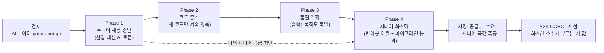

<figure class="post-figure post-figure--header">
<svg role="img" aria-label="AI가 왼쪽에서 끊임없이 새 코드를 뱉어내며 가운데에 유지보수 불가능한 스파게티 코드 더미를 부풀려 쌓아 올린다. 그 더미의 저장소 크기는 계속 커지고, 정상에는 폭풍을 버텨낸 소수의 시니어 개발자 한 명이 홀로 서서 동전 자루를 쥐고 치솟는 몸값 화살표 옆에서 '부르는 게 값'인 희소 자원으로 몸값을 흥정한다." viewBox="0 0 680 300" xmlns="http://www.w3.org/2000/svg">
  <title>AI가 부풀린 스파게티 코드 더미 정상에서, 살아남은 소수의 시니어가 치솟는 몸값을 흥정한다</title>

  <!-- ===== LEFT: AI code generator pumping out new code ===== -->
  <rect x="34" y="118" width="98" height="74" rx="4" fill="var(--bg-light)" stroke="currentColor" stroke-width="1.8"/>
  <text x="83" y="150" text-anchor="middle" font-size="20" fill="var(--secondary-color)" font-weight="700">AI</text>
  <text x="83" y="170" text-anchor="middle" font-size="9" fill="currentColor" opacity="0.85">새 코드 생성</text>
  <text x="83" y="182" text-anchor="middle" font-size="7.5" fill="currentColor" opacity="0.7">good enough</text>

  <!-- three arrows feeding the pile -->
  <line x1="134" y1="138" x2="196" y2="150" stroke="var(--accent-color)" stroke-width="2" marker-end="url(#mb-arrow)"/>
  <line x1="134" y1="155" x2="196" y2="178" stroke="var(--accent-color)" stroke-width="2" marker-end="url(#mb-arrow)"/>
  <line x1="134" y1="172" x2="196" y2="206" stroke="var(--accent-color)" stroke-width="2" marker-end="url(#mb-arrow)"/>
  <text x="150" y="118" text-anchor="middle" font-size="8" fill="currentColor" opacity="0.7">중복 · 덧붙임</text>

  <!-- ===== CENTER: swelling spaghetti-code pile ===== -->
  <polygon points="200,264 300,150 360,118 402,138 470,190 552,264"
           fill="var(--bg-light)" stroke="currentColor" stroke-width="1.8" stroke-linejoin="round"/>
  <!-- tangled spaghetti strands inside the pile -->
  <path d="M226,256 C270,210 250,196 300,190 S330,232 372,214 400,178 440,206 470,236 512,232"
        fill="none" stroke="var(--accent-color)" stroke-width="1.6" opacity="0.55" stroke-linecap="round"/>
  <path d="M238,250 C286,236 274,204 318,214 S356,250 392,232 428,200 470,224 500,250 526,254"
        fill="none" stroke="var(--secondary-color)" stroke-width="1.6" opacity="0.55" stroke-linecap="round"/>
  <path d="M258,258 C300,246 316,222 352,236 S392,262 428,244 456,224 492,246"
        fill="none" stroke="currentColor" stroke-width="1.4" opacity="0.4" stroke-linecap="round"/>
  <!-- a few code cards poking out of the mound base -->
  <rect x="242" y="234" width="34" height="22" rx="2" fill="var(--bg-panel)" stroke="currentColor" stroke-width="1.2" opacity="0.9"/>
  <rect x="330" y="240" width="34" height="20" rx="2" fill="var(--bg-panel)" stroke="currentColor" stroke-width="1.2" opacity="0.9"/>
  <rect x="452" y="232" width="34" height="24" rx="2" fill="var(--bg-panel)" stroke="currentColor" stroke-width="1.2" opacity="0.9"/>
  <!-- growth marker: repo size climbing -->
  <line x1="576" y1="264" x2="576" y2="130" stroke="currentColor" stroke-width="1.4" marker-end="url(#mb-arrow)" opacity="0.8"/>
  <text x="590" y="186" font-size="8.5" fill="currentColor" opacity="0.8" font-weight="700" writing-mode="tb">저장소 ↑ · 복잡도 ↑</text>
  <text x="376" y="284" text-anchor="middle" font-size="9.5" fill="currentColor" opacity="0.8" font-weight="700">유지보수 불가능한 코드 더미</text>

  <!-- ===== SUMMIT: lone surviving senior bargaining a soaring price ===== -->
  <!-- figure -->
  <circle cx="382" cy="86" r="10" fill="var(--bg-panel)" stroke="currentColor" stroke-width="2"/>
  <line x1="382" y1="96" x2="382" y2="120" stroke="currentColor" stroke-width="2.4"/>
  <line x1="382" y1="104" x2="368" y2="116" stroke="currentColor" stroke-width="2.2"/>
  <line x1="382" y1="104" x2="398" y2="98" stroke="currentColor" stroke-width="2.2"/>
  <line x1="382" y1="120" x2="373" y2="136" stroke="currentColor" stroke-width="2.2"/>
  <line x1="382" y1="120" x2="391" y2="136" stroke="currentColor" stroke-width="2.2"/>
  <!-- coin sack in the raised hand -->
  <circle cx="404" cy="92" r="9" fill="var(--badge-fill)" stroke="var(--border-strong)" stroke-width="1.5"/>
  <text x="404" y="96" text-anchor="middle" font-size="10" fill="var(--border-strong)" font-weight="700">$</text>

  <!-- soaring price arrow -->
  <path d="M430,140 L470,110 L494,64" fill="none" stroke="var(--accent-color)" stroke-width="3" marker-end="url(#mb-arrow-big)" stroke-linecap="round"/>
  <text x="512" y="60" text-anchor="middle" font-size="12" fill="var(--accent-color)" font-weight="700">몸값 폭등</text>
  <text x="512" y="76" text-anchor="middle" font-size="8" fill="currentColor" opacity="0.8">부르는 게 값</text>
  <text x="352" y="60" text-anchor="middle" font-size="8.5" fill="currentColor" opacity="0.8">살아남은 소수의 시니어</text>

  <defs>
    <marker id="mb-arrow" markerWidth="8" markerHeight="8" refX="6" refY="4" orient="auto">
      <path d="M0,0 L8,4 L0,8 z" fill="var(--accent-color)"/>
    </marker>
    <marker id="mb-arrow-big" markerWidth="9" markerHeight="9" refX="7" refY="4.5" orient="auto">
      <path d="M0,0 L9,4.5 L0,9 z" fill="var(--accent-color)"/>
    </marker>
  </defs>
</svg>
<figcaption>AI가 뱉어낸 코드가 유지보수 불가능한 더미로 부풀수록, 그 정상을 지켜낸 소수의 시니어는 희소 자원이 되어 몸값을 흥정한다.</figcaption>
</figure>

## 원문 정보

> - **제목**: We're Going to Make Out Like Bandits
> - **출처**: Simon M. Stewart, 개인 블로그 ([rocketpoweredjetpants.com](https://www.rocketpoweredjetpants.com/))
> - **발행**: 2026-04-12 · 약 8분 분량
> - **원문 링크**: <https://www.rocketpoweredjetpants.com/2026/04/were-going-to-make-out-like-bandits/>

AI가 개발자를 대체하느냐 마느냐의 흔한 논쟁을 뒤집어, "AI가 만든 혼란이 오히려 살아남은 시니어의 몸값을 폭등시킨다"는 도발적 시나리오를 그린 에세이다. Articles의 `AI-Industry`(AI가 바꾸는 일·엔지니어의 가치) 맥락에 정확히 들어맞는다.

## 한 줄 요약 (TL;DR)

AI가 주니어 채용을 말리고 유지보수 불가능한 코드를 양산하는 5년의 흐름이 끝날 무렵, 신규 인력 공급은 끊기고 시니어는 번아웃으로 이탈해 **공급은 줄고 수요는 폭발한다** — 그 폭풍을 버텨낸 경험 많은 시니어 개발자는 "도둑처럼 한몫 챙기게(make out like bandits)" 된다.

## 왜 이 글을 골랐나

저자의 논증은 하나의 전제에서 시작해 네 국면(Phase)을 지나 하나의 결론으로 굴러가는 도미노다. 그 인과 사슬을 한눈에 보면 이렇다.

이 위키의 Articles에는 "AI가 엔지니어를 대체하지 못한다"([AI는 왜 소프트웨어 엔지니어를 대체하지 못했나](/2026/06/19/ai-hasnt-replaced-engineers.html))거나 "AI가 채용 시장을 적대적으로 만들었다"([취업도 소프트웨어도 망가졌다](/2026/06/25/jobs-and-software-is-fucked.html))는 글이 이미 여럿 있다. 이 에세이가 흥미로운 건 같은 재료(주니어 채용 붕괴, AI가 쏟아내는 저품질 코드)를 **비관이 아니라 시니어의 기회로** 재조립한다는 점이다.

그 낙관은 편안한 낙관이 아니다. "폭풍이 지나갈 때까지 웅크리고 버티자(hunker down and survive the storm)"는 전제 위에 서 있어서, 오히려 지금 무엇을 지켜야 하는지를 날카롭게 되묻게 한다. 경제학의 수요·공급 하나로 커리어 시나리오를 밀어붙이는 단순함과, 그 단순함이 드러내는 진실을 함께 볼 수 있는 글이다.

## 핵심 내용

저자는 하나의 전제에서 출발해 네 개의 국면(Phase)을 거쳐 결론에 도달한다.

### 전제: AI는 이미 "충분히 좋다"

핵심은 "완벽함"이 아니라 "충분히 좋음(good enough)"이다. AI 코딩 모델은 이미 주니어 개발자와 맞먹거나 능가하는 수준에 도달했다는 것. 이 전제가 참이라면 나머지 도미노가 무너지기 시작한다.

### Phase 1 — 주니어 개발자의 퇴출

기업은 신입을 뽑는 대신 AI 토큰을 산다. "주니어 개발자 채용 공고가 말라붙는다(job openings for junior devs will dry up)"는 현상은 이미 시장에서 벌어지고 있다는 것이 저자의 관찰이다.

### Phase 2 — 코드의 증식

AI는 기존 코드를 재사용·정리하기보다 **새 코드를 얹는 쪽**으로 기운다. "AI는 새 코드를 생성하는 걸 좋아한다(they love to generate new code)". 라이브러리 함수를 알면서도 중복되고 덧붙는 코드를 뱉어내고, 그 결과 저장소 크기가 부풀어 오른다.

### Phase 3 — 코드 품질의 악화

AI가 쓴 코드는 결함률이 더 높고 리팩터링을 회피한다. 저자는 고전적 경구 "디버깅은 프로그램을 작성하는 것보다 두 배 어렵다(debugging is twice as hard as writing a program)"를 끌어와, 우리가 이미 "인간이 감당하던 복잡도 수준을 자주 넘어서 버렸다(frequently blown past human levels of code complexity)"고 말한다. 여기에 컨텍스트 윈도우 한계까지 겹친다 — AI는 현대적 규모의 코드베이스 전체를 한눈에 볼 수 없어서, "한 곳의 버그를 고쳐도 모든 곳에서 고쳐지지 않는다."

### Phase 4 — 시니어 개발자의 희소화

복잡도를 떠안은 시니어에게서 번아웃이 가속된다(저자는 "22%의 심각한 번아웃 급증"을 언급한다). 동시에 주니어가 줄었으니 **미래의 시니어도 줄어든다**. 파이프라인이 위아래로 동시에 조여드는 것이다. 게다가 AI에 기대어 자란 세대는 "유지보수 가능한 코드를 잘 쓰는 사람이 되리라는 보장이 없다."

### 시장의 기회

수요는 늘고 공급은 준다 — 가격은 오른다. 저자는 이를 Y2K 당시 COBOL 프로그래머 품귀 현상에 빗댄다. 낡았지만 아무도 다룰 줄 모르는 시스템을 붙잡고 있던 소수가 부르는 게 값이었던 그 순간이 재현된다는 것이다.

**시니어를 위한 선순환(그들의 관점에서):**

1. 주니어 채용 중단 → AI가 엔트리 레벨 업무를 대체
2. 코드 복잡도 폭발 → AI가 유지보수 불가능한 시스템을 양산
3. 시니어 번아웃 증가 → 경험자가 이탈
4. 공급 부족 + 높은 수요 = 프리미엄 보상

타임라인은 약 5년. 저자는 "이미 1.5~2년이 지났고, 3년쯤 남았다"고 본다.

## 분석과 인사이트

여기서부터는 원문 요약이 아니라 내 관점이다.

**강점 — 프레임 뒤집기가 신선하다.** 대부분의 "개발자와 AI" 담론은 대체/생존의 이분법에 갇혀 있다. 이 글은 같은 사실들을 **시장 미시경제학**으로 재배열해, 위기를 자산으로 번역한다. 특히 Phase 4의 "파이프라인이 위아래로 동시에 조인다"는 지적은 진짜다. 주니어를 안 뽑으면 5년 뒤 시니어가 안 생긴다 — 이건 [The Untrainable](/2026/06/23/the-untrainable.html)이 말한 "측정 불가능한 판단력은 학습되지 않는다"는 논지, 그리고 [Ponytail](/2026/06/23/ponytail-lazy-senior-dev-skill.html)이 스킬로 박제하려 한 "게으른 시니어의 삭제 판단"과 같은 곳을 가리킨다. AI가 흉내 내기 가장 어려운 것은 **무엇을 안 쓸지, 무엇을 지울지에 대한 판단**이다.

**약점 1 — 단일 변수 모델의 위험.** 논증 전체가 "AI는 good enough에서 멈추고 더 나아지지 않는다"는 암묵적 가정 위에 서 있다. 만약 AI가 5년 안에 대규모 코드베이스 리팩터링과 아키텍처 재설계까지 감당하게 되면, Phase 3~4의 "시니어만 풀 수 있는 부채"라는 해자 자체가 증발한다. 저자는 컨텍스트 윈도우 한계를 근거로 들지만, 그건 가장 빠르게 밀려나는 방벽이다.

**약점 2 — 인용 통계의 출처가 약하다.** "22% 번아웃 급증", "1.5~2년 경과" 같은 수치는 에세이 특유의 어림값이다. 원문도 이를 엄밀한 데이터로 제시하지 않으니, **분위기의 근거이지 예측의 증거는 아니다**. 독자는 이 숫자들을 정밀한 계량으로 오독하지 않는 편이 좋다.

**약점 3 — "버티면 이긴다"의 생존 편향.** 이 시나리오의 승자는 "폭풍을 버텨낸 시니어"다. 그런데 [취업도 소프트웨어도 망가졌다](/2026/06/25/jobs-and-software-is-fucked.html)가 보여주듯, 정리해고와 적대적 채용 시장에서 버티는 것 자체가 운과 자원의 문제다. "3년만 웅크리자"는 조언은, 그 3년을 버틸 여유가 없는 사람에게는 위로가 되지 않는다. 그리고 [AI가 우리의 실력을 망치고 있는가](/2026/06/23/is-ai-ruining-our-skills.html)의 탈숙련 연구가 옳다면, 버티는 동안 AI에 기대다 정작 몸값의 원천인 판단력이 녹슬 위험도 있다.

**종합하면**, 이 글은 정밀한 예측이라기보다 **잘 만든 사고 실험**이다. 결론(시니어 몸값 폭등)을 곧이곧대로 베팅하기보다, 그 결론이 참이 되려면 무엇을 지켜야 하는지를 역산하는 데 쓰는 게 이 글의 최선의 용법이다. 바로 그 역산이 다음 절이다.

## 적용 포인트

- **AI가 흉내 내기 어려운 판단력에 투자하라.** 새 코드를 쓰는 능력이 아니라 **무엇을 지우고, 무엇을 추상화하고, 언제 재설계할지**를 판단하는 능력이 희소 자산이다. AI에게 위임하되, 삭제·통합·아키텍처 결정은 손에서 놓지 마라.
- **AI 출력에 대한 "리팩터링 반사신경"을 훈련하라.** 에이전트가 새 코드를 얹으려 할 때, 기존 코드로 해결하도록 되돌리는 습관이 Phase 2(코드 증식)를 개인 수준에서 막는다.
- **탈숙련을 경계하라.** AI에 위임하는 동안에도 핵심 근육(디버깅, 도메인 이해, 시스템 사고)을 의식적으로 계속 써라. 몸값의 원천이 녹슬면 폭풍이 지나가도 챙길 것이 없다.
- **주니어라면 "미래 시니어" 파이프라인의 희소성에 베팅하라.** 채용문은 좁지만, 진짜 유지보수 판단력을 갖춘 다음 세대는 극도로 귀해진다. 실무 경험을 쌓을 창구를 어떻게든 확보하는 것이 장기 몸값 전략이다.
- **숫자가 아니라 방향에 반응하라.** "5년", "22%"를 문자 그대로 받지 말고, "판단력의 희소성이 커진다"는 방향만 취해 커리어 결정에 반영하라.

## 마무리

"We're going to make out like bandits"는 낙관의 탈을 쓴 경고다. 시니어의 몸값이 오른다는 결론이 성립하려면, 그 전제로 **대량 해고와 부풀어 오르는 기술 부채, 그리고 다음 세대 인재 파이프라인의 붕괴**가 먼저 와야 하기 때문이다. 개인에게 반가운 시나리오가 산업 전체에는 재앙일 수 있다는 이 불편한 비대칭이, 이 짧은 에세이가 오래 남는 이유다. 예측을 믿든 안 믿든, "AI가 흉내 낼 수 없는 판단력을 지금 지켜라"는 함의만큼은 어느 시나리오에서도 유효하다.

### 더 읽어보기

- [원문 — We're Going to Make Out Like Bandits (Simon M. Stewart)](https://www.rocketpoweredjetpants.com/2026/04/were-going-to-make-out-like-bandits/)
- [The Untrainable: 벤치마크할 수 없는 일에 가치가 남는다](/2026/06/23/the-untrainable.html) — "측정 가능한 일은 commodity가 되고, 판단력에 해자가 남는다"는 자매 논증
- [AI는 왜 소프트웨어 엔지니어를 대체하지 못했나](/2026/06/19/ai-hasnt-replaced-engineers.html) — 같은 재료를 "대체 불가"로 읽는 대조 관점
- [취업도 소프트웨어도 망가졌다](/2026/06/25/jobs-and-software-is-fucked.html) — "폭풍을 버틴다"의 실제 난이도를 보여주는 현장 기록
- [AI가 우리의 실력을 망치고 있는가](/2026/06/23/is-ai-ruining-our-skills.html) — 버티는 동안 몸값의 원천이 탈숙련될 위험
- [Ponytail: '게으른 시니어'를 코딩 에이전트에 심는 스킬](/2026/06/23/ponytail-lazy-senior-dev-skill.html) — AI가 흉내 내기 어려운 "삭제 판단"을 스킬로 박제하려는 시도
- [Intent Debt: 에이전트가 대신 갚아줄 수 없는 단 하나의 부채](/2026/06/21/intent-debt.html) — AI가 만드는 부채의 구조와 인간이 끝까지 쥐어야 할 몫
