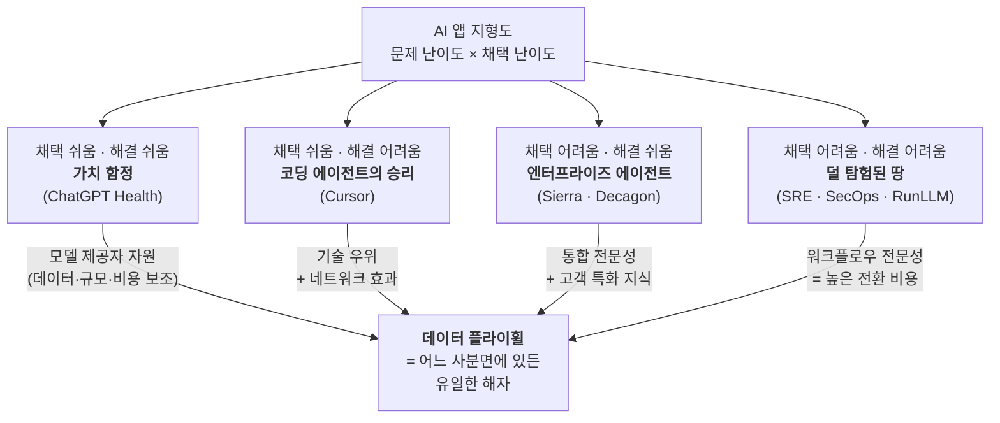

<figure class="post-figure post-figure--header">
<svg role="img" aria-label="오크 전쟁 캠프의 작전 지도 위에 2x2 격자로 나뉜 네 개의 전장이 각각 깃발을 꽂고 있고, 지도 아래로는 '데이터'라는 하나의 황금 광맥이 네 진영을 모두 관통하며 흐르는 그림 — 어느 진영에 있든 유일한 해자는 데이터라는 상징" viewBox="0 0 640 340">
  <title>네 전장을 관통하는 하나의 데이터 광맥</title>

  <!-- MAP FRAME — 작전 지도 (parchment cut into 4 battlegrounds) -->
  <rect x="40" y="24" width="560" height="212" fill="none" stroke="currentColor" stroke-width="2.5" opacity="0.85"/>
  <!-- quadrant dividers -->
  <line x1="320" y1="24" x2="320" y2="236" stroke="currentColor" stroke-width="2" opacity="0.55"/>
  <line x1="40" y1="130" x2="600" y2="130" stroke="currentColor" stroke-width="2" opacity="0.55"/>

  <!-- axis labels -->
  <text x="320" y="16" text-anchor="middle" font-family="var(--font-body)" font-size="11" fill="currentColor" opacity="0.7">← 채택 어려움 · 채택 쉬움 →</text>
  <text x="30" y="130" text-anchor="middle" font-family="var(--font-body)" font-size="11" fill="currentColor" opacity="0.7" transform="rotate(-90 30 130)">← 해결 어려움 · 해결 쉬움 →</text>

  <!-- Q: 각 사분면 깃발 (staff = currentColor, pennant = accent tokens) -->
  <!-- 상단-좌: 어려운 채택 · 쉬운 해결 -->
  <g>
    <line x1="150" y1="46" x2="150" y2="112" stroke="currentColor" stroke-width="3"/>
    <path d="M150 48 L206 60 L150 72 Z" fill="var(--secondary-color)"/>
    <text x="150" y="126" text-anchor="middle" font-family="var(--font-body)" font-size="10.5" fill="currentColor" opacity="0.85">엔터프라이즈</text>
  </g>
  <!-- 상단-우: 쉬운 채택 · 쉬운 해결 (가치 함정) -->
  <g>
    <line x1="410" y1="46" x2="410" y2="112" stroke="currentColor" stroke-width="3"/>
    <path d="M410 48 L466 60 L410 72 Z" fill="var(--accent-color)"/>
    <text x="410" y="126" text-anchor="middle" font-family="var(--font-body)" font-size="10.5" fill="currentColor" opacity="0.85">가치 함정</text>
  </g>
  <!-- 하단-좌: 어려운 채택 · 어려운 해결 (미탐험) -->
  <g>
    <line x1="150" y1="150" x2="150" y2="216" stroke="currentColor" stroke-width="3"/>
    <path d="M150 152 L206 164 L150 176 Z" fill="var(--gold)"/>
    <text x="150" y="230" text-anchor="middle" font-family="var(--font-body)" font-size="10.5" fill="currentColor" opacity="0.85">SRE · SecOps</text>
  </g>
  <!-- 하단-우: 쉬운 채택 · 어려운 해결 (코딩 에이전트) -->
  <g>
    <line x1="410" y1="150" x2="410" y2="216" stroke="currentColor" stroke-width="3"/>
    <path d="M410 152 L466 164 L410 176 Z" fill="var(--secondary-color)"/>
    <text x="410" y="230" text-anchor="middle" font-family="var(--font-body)" font-size="10.5" fill="currentColor" opacity="0.85">코딩 에이전트</text>
  </g>

  <!-- DATA VEIN — 하나의 황금 광맥이 네 진영 아래를 관통한다 -->
  <path d="M8 300 Q120 268 200 292 T360 288 T520 296 T632 280" fill="none" stroke="var(--gold)" stroke-width="9" stroke-linecap="round" opacity="0.9"/>
  <path d="M8 300 Q120 268 200 292 T360 288 T520 296 T632 280" fill="none" stroke="var(--gold-bright)" stroke-width="3" stroke-linecap="round" opacity="0.9" stroke-dasharray="2 12"/>
  <!-- 광맥이 각 전장으로 뻗는 지맥 (feeder veins up into the map) -->
  <g stroke="var(--gold)" stroke-width="2.5" opacity="0.7" stroke-linecap="round">
    <line x1="150" y1="216" x2="150" y2="286"/>
    <line x1="410" y1="216" x2="410" y2="288"/>
    <line x1="280" y1="236" x2="280" y2="288"/>
    <line x1="520" y1="236" x2="520" y2="294"/>
  </g>
  <text x="320" y="326" text-anchor="middle" font-family="var(--font-body)" font-size="12" font-weight="700" fill="var(--gold)">데이터 — 네 진영을 관통하는 유일한 광맥</text>
</svg>
<figcaption>문제 난이도 × 채택 난이도로 갈린 네 전장. 진영은 달라도 그 아래를 관통하는 광맥은 하나 — 데이터다.</figcaption>
</figure>

## 원문 정보

> - **제목**: Data is Your Only Moat: How different adoption models drive better applications
> - **출처**: The AI Frontier — Vikram Sreekanti, Joseph E. Gonzalez (frontierai.substack.com)
> - **발행**: 2026-07-09 · 약 8분 분량
> - **원문 링크**: <https://frontierai.substack.com/p/data-is-your-only-moat-884>

RunLLM을 만드는 두 저자(Berkeley 출신 시스템 연구자)가 AI 애플리케이션 시장을 '문제 난이도 × 채택 난이도' 두 축으로 잘라, 각 진영에서 무엇이 진짜 해자가 되는지를 정리한 글이다. AI가 산업·비즈니스 구조를 어떻게 재편하는지를 다루므로 `Articles/AI-Industry`에 담는다.

## 한 줄 요약 (TL;DR)

AI 앱의 승패는 '어려운 문제를 푸느냐'가 아니라 '어려운 문제를 **쉽게 채택되게** 풀어 학습 데이터를 모으느냐'로 갈린다. 어느 사분면에 있든 지속 가능한 해자는 base model의 성능이 아니라, 채택 용이성이 돌리는 **데이터 플라이휠**과 그 위에 쌓이는 고객 특화 지식뿐이다.

아래 한 장이 이 글의 척추다. **문제 난이도 × 채택 난이도** 두 축이 만드는 네 사분면 — 각 칸의 대표 사례와 해자 원천이 다르지만, 화살표는 모두 같은 종착지로 모인다.

## 왜 이 글을 골랐나

'thin wrapper 논쟁'은 이 위키에서 이미 여러 각도로 다뤘다. Sarah Guo는 [The Untrainable](/2026/06/23/the-untrainable.html)에서 "측정 가능한 일은 학습 가능하고 곧 commodity가 된다 — 진짜 해자는 벤치마크할 수 없는 private ground truth"라고 했고, Simon Willison은 [Anthropic·OpenAI의 PMF](/2026/06/22/anthropic-openai-product-market-fit.html)에서 진짜 돈은 코딩 에이전트가 태우는 엔터프라이즈 토큰에서 나온다고 봤다.

이 글은 그 논의에 **좌표계**를 준다. "해자는 데이터다"라는 말은 흔하지만, *어떤 시장에서 어떤 종류의 데이터가, 왜 모이는가*를 2x2로 분해해 각 진영의 생존 전략을 구체화한 점이 값지다. 스타트업 창업자, 제품을 만드는 엔지니어, 그리고 "내가 만드는 게 결국 frontier lab에 먹히지 않을까"를 걱정하는 모든 사람에게 지도를 쥐어준다.

## 핵심 내용

저자들은 AI 애플리케이션을 두 축으로 나눈다. 가로축은 **문제의 기술적 난이도**(easy ↔ hard to solve), 세로축은 **채택 난이도**(easy ↔ hard to adopt). 여기서 나오는 네 사분면은 각각 완전히 다른 경쟁 동학을 갖는다.

### 쉽게 채택 · 쉽게 해결 — 가치 함정 (Value Trap)

진입 장벽이 가장 낮은 사분면이다. 문제도 쉽고 붙이기도 쉬우니 누구나 만들 수 있고, 그래서 **frontier lab(OpenAI·Google·Anthropic)이 데이터 물량과 비용 보조로 결국 이긴다.** 저자들은 ChatGPT가 헬스 영역으로 밀고 들어오는 것을 시장 잠식의 예로 든다. 사용자 충성도는 극도로 낮고, 여러 도구를 갈아타며 쓴다. 핵심 문장: **"쉽게 채택된다는 것은 곧 쉽게 대체된다는 뜻이다(Easy to adopt also means easy to displace)."**

### 쉽게 채택 · 어렵게 해결 — 코딩 에이전트의 승리

이 위키가 가장 익숙한 진영이다. 코딩 에이전트(Cursor, ChatGPT 통합 등)가 성공한 이유를 저자들은 **데이터 플라이휠**로 설명한다.

- 개발자는 도구를 빠르게 갈아탈 수 있다 → 채택 마찰이 낮다.
- 제안을 **수락/거절**하는 순간이 매일 대량으로 쌓인다 → 빠른 피드백 루프가 곧바로 학습 신호가 된다.

대조군으로 **슬라이드 생성**을 든다. 결과에 대한 세밀한(fine-grained) 피드백이 없어서 개선 속도가 붙지 않는다. 같은 "쉽게 채택"이라도 검증 가능한 신호가 나오느냐가 플라이휠의 회전 여부를 가른다.

다만 저자들은 경고한다. frontier lab이 생산성 스위트를 직접 내놓을 것이고, 자본이 없는 작은 플레이어는 버티기 어렵다. 게다가 **끈적함(stickiness)이 약하다** — 사용자는 코딩 에이전트를 자유롭게 갈아타고, Cursor rules나 브랜드 템플릿 같은 커스터마이징이 주는 잔류 효과는 미미하다.

### 어렵게 채택 · 쉽게 해결 — 엔터프라이즈 에이전트

Sierra, Decagon 같은 회사가 사는 곳이다. 문제 자체는 상대적으로 풀 만하지만, **채택이 조직 단위 결정**이라는 점이 장벽이자 해자가 된다. 개인이 고르는 게 아니라 구매 위원회(buying committee)가 움직인다. 이 진입 장벽이 오히려 방어막이 된다.

- 엔터프라이즈 통합 지식이 경쟁 해자를 만든다.
- 고객 특화 운영 전문성이 시간이 갈수록 복리로 쌓여 **전환 비용을 높인다.**
- 규모를 키운 스타트업은 사실상 incumbent 취급을 받는다.

저자들이 남긴 물음표: 이들이 조달한 자본이 **GTM(영업·시장 진입)에 쓰이는지, 지속 가능한 기술적 해자에 쓰이는지**는 아직 불분명하다.

### 어렵게 채택 · 어렵게 해결 — 가장 덜 탐험된 땅

SRE, 보안 운영(SecOps) 같은 영역이다. 관심이 가장 적게 쏠린 사분면이고, 저자들 자신(RunLLM)이 여기에 베팅했다.

- 가치 제안이 크다: 사람이 몇 시간~며칠 걸리던 워크플로우를 대신 처리한다.
- 그러나 워크플로우가 조직마다 고도로 커스터마이즈되어 있어 구현이 어렵다.
- 최근 순풍: **추론 모델**이 다단계 계획을 가능하게 했고, **개선된 코딩 에이전트**가 워크플로우 구성을 단순화한다.

데이터 해자의 성격이 가장 복잡하지만 잠재적으로 가장 크다. 고객 특화 전문성이 쌓이면 전환 비용이 **"숙련된 엔지니어를 교체하는 것"**에 비견될 만큼 커진다. 단, 데이터 물량이 적고 검증이 어려워 개선 속도는 코딩보다 느리다. 저자들은 향후 **12~24개월** 안에 이 진영에서 승자가 나올 것으로 본다 — 평가 주기가 길고 구현 난이도가 높은 시장이라는 특성과 함께.

### 관통하는 결론

각 사분면의 해자 원천을 저자들은 이렇게 정리한다.

| 사분면 | 해자의 원천 |
| --- | --- |
| 쉽게 채택 · 쉽게 해결 | 모델 제공자의 자원(데이터·규모·비용 보조) |
| 쉽게 채택 · 어렵게 해결 | 기술적 우위 + 네트워크 효과 |
| 어렵게 채택 · 쉽게 해결 | 통합 전문성 + 고객 특화 지식 |
| 어렵게 채택 · 어렵게 해결 | 도메인 워크플로우 전문성이 만드는 높은 전환 비용 |

그리고 **데이터 플라이휠이 돌기 위한 조건** 네 가지: ① 낮은 채택 마찰, ② 빠른 피드백 루프, ③ 대량 사용 패턴, ④ 검증 가능한 결과 신호. 결론 문장은 제목 그대로다 — **"어느 사분면에 속하든, 데이터가 당신의 유일한 해자다."** 그리고 **"채택 용이성은 그 더 깊은 투자를 가능하게 하는 강력한 데이터 획득 플라이휠이다."**

<figure class="post-figure">
<svg role="img" aria-label="데이터 플라이휠 순환 다이어그램 — 낮은 채택 마찰 → 대량 사용 → 검증 가능한 신호(수락·거절) → 모델·워크플로우 개선 → 다시 낮은 마찰로 순환하는 고리. 안쪽의 굵은 화살표는 코딩 에이전트의 빠른 회전, 바깥쪽의 흐린 점선 화살표는 SRE·SecOps의 느린 회전을 나타낸다" viewBox="0 0 640 360">
  <title>같은 플라이휠, 다른 회전 속도 — 코딩 에이전트 vs SRE·SecOps</title>

  <!-- SLOW ORBIT — SRE·SecOps (바깥, 흐린 점선, 느린 회전) -->
  <circle cx="320" cy="188" r="150" fill="none" stroke="var(--gold)" stroke-width="2.5" stroke-dasharray="4 12" opacity="0.6"/>
  <path d="M320 38 A150 150 0 0 1 428 84" fill="none" stroke="var(--gold)" stroke-width="3" stroke-linecap="round" opacity="0.7" marker-end="url(#slowhead)"/>

  <!-- FAST WHEEL — 코딩 에이전트 (안쪽, 굵은 실선, 빠른 회전) -->
  <circle cx="320" cy="188" r="104" fill="none" stroke="var(--secondary-color)" stroke-width="4" opacity="0.9"/>
  <path d="M320 84 A104 104 0 0 1 405 138" fill="none" stroke="var(--secondary-color)" stroke-width="6" stroke-linecap="round" marker-end="url(#fasthead)"/>

  <defs>
    <marker id="fasthead" markerWidth="9" markerHeight="9" refX="4.5" refY="4.5" orient="auto">
      <path d="M0 0 L9 4.5 L0 9 Z" fill="var(--secondary-color)"/>
    </marker>
    <marker id="slowhead" markerWidth="8" markerHeight="8" refX="4" refY="4" orient="auto">
      <path d="M0 0 L8 4 L0 8 Z" fill="var(--gold)" opacity="0.75"/>
    </marker>
  </defs>

  <!-- 4 STAGES on the wheel -->
  <!-- top -->
  <g transform="translate(320 88)">
    <circle r="7" fill="var(--accent-color)"/>
    <text x="0" y="-14" text-anchor="middle" font-family="var(--font-body)" font-size="13" font-weight="700" fill="currentColor">낮은 채택 마찰</text>
  </g>
  <!-- right -->
  <g transform="translate(424 188)">
    <circle r="7" fill="var(--accent-color)"/>
    <text x="16" y="5" text-anchor="start" font-family="var(--font-body)" font-size="13" font-weight="700" fill="currentColor">대량 사용</text>
  </g>
  <!-- bottom -->
  <g transform="translate(320 292)">
    <circle r="7" fill="var(--accent-color)"/>
    <text x="0" y="26" text-anchor="middle" font-family="var(--font-body)" font-size="13" font-weight="700" fill="currentColor">검증 가능한 신호</text>
    <text x="0" y="43" text-anchor="middle" font-family="var(--font-body)" font-size="11" fill="currentColor" opacity="0.7">(수락 / 거절)</text>
  </g>
  <!-- left -->
  <g transform="translate(216 188)">
    <circle r="7" fill="var(--accent-color)"/>
    <text x="-16" y="0" text-anchor="end" font-family="var(--font-body)" font-size="13" font-weight="700" fill="currentColor">모델·워크플로우</text>
    <text x="-16" y="17" text-anchor="end" font-family="var(--font-body)" font-size="13" font-weight="700" fill="currentColor">개선</text>
  </g>

  <!-- center hub -->
  <text x="320" y="184" text-anchor="middle" font-family="var(--font-body)" font-size="14" font-weight="700" fill="var(--gold)">데이터</text>
  <text x="320" y="202" text-anchor="middle" font-family="var(--font-body)" font-size="14" font-weight="700" fill="var(--gold)">플라이휠</text>

  <!-- legend -->
  <g font-family="var(--font-body)" font-size="12">
    <line x1="60" y1="336" x2="92" y2="336" stroke="var(--secondary-color)" stroke-width="5" stroke-linecap="round"/>
    <text x="98" y="340" fill="currentColor">코딩 에이전트 — 빠른 회전</text>
    <line x1="360" y1="336" x2="392" y2="336" stroke="var(--gold)" stroke-width="3" stroke-dasharray="4 6" stroke-linecap="round" opacity="0.75"/>
    <text x="398" y="340" fill="currentColor">SRE·SecOps — 느린 회전</text>
  </g>
</svg>
<figcaption>같은 고리를 돌지만 회전 속도가 다르다. 검증 가능한 신호가 매일 대량으로 나오는 코딩 에이전트는 빠르게(안쪽 실선), 신호가 흐릿하고 데이터가 적은 SRE·SecOps는 느리게(바깥 점선) 돈다.</figcaption>
</figure>

## 분석과 인사이트

**1. 이 2x2의 진짜 통찰은 '축의 교차'에 있다.** 흔히 스타트업은 "어려운 문제를 풀면 이긴다"고 믿는다. 이 글은 그 믿음을 정면으로 반박한다 — 문제 난이도는 두 축 중 **하나일 뿐**이고, 나머지 한 축(채택 난이도)이 *데이터가 모이는 속도*를 결정한다. 어려운 문제를 풀어도 채택이 어려우면 플라이휠이 느리게 돌고, 쉬운 문제를 쉽게 풀면 아예 frontier lab의 먹잇감이 된다. 승리 공식은 **"어려운 해결 × 쉬운 채택"의 교집합**이다.

**2. Sarah Guo의 'private ground truth'와 정확히 맞물린다.** [The Untrainable](/2026/06/23/the-untrainable.html)이 "무엇이 해자인가(벤치마크할 수 없는 데이터)"를 말했다면, 이 글은 "그 데이터를 **어떻게 모으는가**(채택 용이성 → 플라이휠)"를 말한다. 두 글을 겹치면 완결된 그림이 된다: 측정 가능한 일은 commodity가 되고(Guo), 측정 불가능한 private 데이터가 해자이며(Guo), 그 데이터는 낮은 마찰과 검증 가능한 신호가 있을 때만 복리로 쌓인다(이 글).

**3. '검증 가능한 신호'가 코딩과 나머지를 가른다.** 코딩 에이전트가 유독 빨리 좋아지는 이유는 자본이 많아서가 아니라, **수락/거절이라는 즉각적이고 검증 가능한 라벨**이 매일 대량으로 나오기 때문이다. 슬라이드 생성, SRE, SecOps가 뒤처지는 건 문제가 더 어려워서라기보다 *성공/실패를 자동으로 라벨링하기 어려워서*다. 이는 [Anthropic이 Claude로 셀프서비스 분석을 구현한 방법](/2026/06/22/self-service-data-analytics-with-claude.html)이 강조한 '검증(verification) 계층'의 중요성과 같은 결이다. RL 시대의 진짜 병목은 보상 신호를 어디서 싸게 얻느냐다.

**4. 냉정한 함의: '쉽게 채택'은 양날의 검이다.** 낮은 마찰은 플라이휠을 돌리지만 동시에 끈적함을 없앤다. 코딩 에이전트가 서로를 자유롭게 갈아타는 것이 바로 그 증거다. 그래서 이 진영의 생존 전략은 결국 **플라이휠로 번 데이터 우위를 stickiness로 전환**하는 것 — 마찰을 낮춰 데이터를 모으되, 그 데이터로 남이 따라올 수 없는 제품을 만들어 다시 마찰(전환 비용)을 높이는 이중 동작이다.

**5. 이견 — 2x2는 스냅샷이지 궤적이 아니다.** 축 자체가 시간에 따라 움직인다. 추론 모델과 코딩 에이전트가 좋아지면서 "어렵게 해결"이던 워크플로우 구성이 "쉽게 해결"로 이동한다(저자들도 SRE 진영에서 이를 인정한다). 즉 오늘의 해자(문제 난이도)가 내일 증발할 수 있고, 그때 남는 건 결국 **채택으로 축적한 데이터**뿐이다. 이는 오히려 저자들의 결론을 강화한다 — 기술적 우위는 감가상각되지만 데이터 우위는 복리로 쌓인다. 반대로 저자들이 낙관적으로 넘긴 부분: 엔터프라이즈 사분면에서 조달 자본이 GTM에 쓰이는지 해자에 쓰이는지 모른다는 물음은, 사실 [스타트업의 지출 가시성 문제](/2026/06/26/startups-decision-problem.html)와 직결되는 심각한 리스크다.

## 적용 포인트

- **먼저 자기 제품을 2x2에 찍어라.** "문제가 어려운가"만 묻지 말고 "채택이 쉬운가"를 함께 물어라. 두 축의 교집합(어려운 해결 × 쉬운 채택)이 아니면 해자 전략을 다시 설계해야 한다.
- **'쉽게 채택 · 쉽게 해결'이면 탈출 계획을 세워라.** frontier lab이 들어오는 건 시간 문제다. 문제를 더 어렵게(차별화) 만들거나, 채택 장벽을 의도적으로 높여(엔터프라이즈 통합) 진영을 이동하라.
- **플라이휠 4조건으로 제품을 점검하라.** ① 마찰이 충분히 낮은가 ② 피드백이 빠른가 ③ 사용량이 대량인가 ④ **결과가 검증 가능한 신호로 남는가.** 넷 중 ④가 가장 자주 빠진다 — 수락/거절, 재시도, 승인 같은 라벨을 제품에 내장하라.
- **데이터가 안 모이는 워크플로우면 라벨을 설계하라.** 슬라이드·SRE처럼 신호가 흐릿한 영역이라면, 사용자의 자연스러운 행동에서 성공/실패를 유추할 방법을 제품 UX에 심어라. 없으면 개선 속도가 붙지 않는다.
- **낮은 마찰을 stickiness로 환전하라.** 데이터로 만든 우위(개인화·정확도·워크플로우 적합)를 전환 비용으로 굳혀라. 채택은 쉽게, 이탈은 어렵게.
- **UX를 해자 레버로 취급하라.** 저자들이 Claude Code의 웹 브라우저 지원을 채택 마찰을 낮추는 패러다임 전환으로 든 것처럼, "어떻게 붙이느냐"가 곧 "얼마나 데이터가 모이느냐"다.

## 마무리

이 글의 힘은 "데이터가 해자다"라는 익숙한 명제에 **좌표계**를 붙였다는 데 있다. 문제 난이도와 채택 난이도를 교차시키면, 왜 코딩 에이전트가 폭발했고 왜 슬라이드 생성은 정체했으며 왜 SRE·SecOps가 다음 12~24개월의 격전지인지가 한 장의 지도로 설명된다. 어느 진영에 있든 결론은 같다 — 기술적 우위는 감가상각되고 frontier lab에 흡수되지만, 채택 용이성이 돌린 플라이휠 위에 쌓인 **고객 특화 데이터만이 복리로 남는다.** 무엇을 만들든, 오늘 던져야 할 질문은 "이 제품은 매일 어떤 검증 가능한 데이터를 모으고 있는가"다.

### 더 읽어보기

- [원문 — Data is Your Only Moat (The AI Frontier)](https://frontierai.substack.com/p/data-is-your-only-moat-884)
- [The Untrainable: 벤치마크할 수 없는 일에 가치가 남는다](/2026/06/23/the-untrainable.html) — 무엇이 해자인가(private ground truth)에 대한 짝이 되는 글
- [Anthropic과 OpenAI는 PMF를 찾았다](/2026/06/22/anthropic-openai-product-market-fit.html) — 코딩 에이전트 진영에서 실제로 돈이 도는 지점
- [데이터는 소프트웨어가 아니다: Anthropic의 셀프서비스 분석](/2026/06/22/self-service-data-analytics-with-claude.html) — '검증 계층'이 정확도(=데이터 신호)를 만든다는 실무 사례
- [Lean Analytics, 다시 보기](/2026/06/24/lean-analytics-revisited.html) — AI 시대에 제품 지표·해자가 어떻게 흔들리는가
- [스타트업의 진짜 문제는 지출 가시성이다](/2026/06/26/startups-decision-problem.html) — 조달 자본이 GTM에 쓰이는지 해자에 쓰이는지의 리스크
