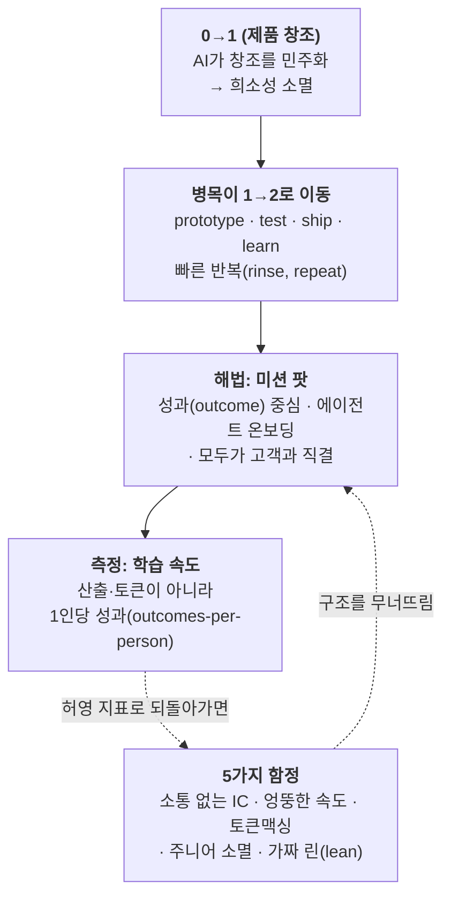

<figure class="post-figure post-figure--header">
<svg role="img" aria-label="왼쪽에는 Product·Design·Eng·Support로 나뉜 낡은 부서별 사일로 상자들이 금이 가고 기울어지며 무너지고, 오른쪽에는 가운데 '고객 문제(outcome)'를 중심으로 사람과 AI 에이전트가 번갈아 둘러선 원형 '미션 팟'이 세워진다. 가운데 큰 화살표가 사일로에서 미션 팟으로의 재구성을 가리키고, 아래 띠에는 'AI-first ≠ AI-only'가 적혀 있다." viewBox="0 0 720 340" xmlns="http://www.w3.org/2000/svg">
  <title>부서 사일로의 붕괴에서 고객 문제 중심의 미션 팟으로 — AI-first ≠ AI-only</title>

  <!-- ===== LEFT: collapsing departmental silos ===== -->
  <text x="150" y="34" text-anchor="middle" font-size="12" fill="currentColor" font-weight="700" opacity="0.75">낡은 부서 사일로</text>
  <!-- Product (upright, cracked) -->
  <rect x="44" y="66" width="46" height="176" rx="3" fill="var(--bg-light)" stroke="currentColor" stroke-width="1.8"/>
  <text x="67" y="158" text-anchor="middle" font-size="9" fill="currentColor" font-weight="700" transform="rotate(-90 67 158)">Product</text>
  <!-- Design (slight tilt) -->
  <g transform="rotate(4 118 240)">
    <rect x="96" y="80" width="46" height="162" rx="3" fill="var(--bg-light)" stroke="currentColor" stroke-width="1.8"/>
    <text x="119" y="165" text-anchor="middle" font-size="9" fill="currentColor" font-weight="700" transform="rotate(-90 119 165)">Design</text>
  </g>
  <!-- Eng (tilt other way) -->
  <g transform="rotate(-6 172 242)">
    <rect x="150" y="60" width="46" height="182" rx="3" fill="var(--bg-light)" stroke="currentColor" stroke-width="1.8"/>
    <text x="173" y="156" text-anchor="middle" font-size="9" fill="currentColor" font-weight="700" transform="rotate(-90 173 156)">Eng</text>
  </g>
  <!-- Support (falling) -->
  <g transform="rotate(14 226 244)">
    <rect x="204" y="92" width="46" height="150" rx="3" fill="var(--bg-light)" stroke="currentColor" stroke-width="1.8"/>
    <text x="227" y="172" text-anchor="middle" font-size="9" fill="currentColor" font-weight="700" transform="rotate(-90 227 172)">Support</text>
  </g>
  <!-- crack line running across the silos -->
  <path d="M40 120 L96 138 L150 116 L206 144 L256 122" fill="none" stroke="var(--accent-color)" stroke-width="2" stroke-dasharray="3 4" opacity="0.85"/>
  <!-- ground line -->
  <line x1="30" y1="246" x2="270" y2="246" stroke="currentColor" stroke-width="1.4" opacity="0.55"/>

  <!-- ===== MIDDLE: transition arrow ===== -->
  <text x="360" y="130" text-anchor="middle" font-size="9.5" fill="currentColor" font-weight="700" opacity="0.8">고객 문제 중심으로</text>
  <text x="360" y="145" text-anchor="middle" font-size="9.5" fill="currentColor" font-weight="700" opacity="0.8">다시 짜다</text>
  <path d="M300 165 L408 165" fill="none" stroke="var(--secondary-color)" stroke-width="4" marker-end="url(#pod-head-arrow)"/>

  <!-- ===== RIGHT: mission pod ===== -->
  <text x="555" y="34" text-anchor="middle" font-size="12" fill="currentColor" font-weight="700" opacity="0.75">미션 팟</text>
  <!-- ring connectors -->
  <g stroke="var(--gold)" stroke-width="1.4" opacity="0.7">
    <line x1="555" y1="150" x2="645" y2="150"/>
    <line x1="555" y1="150" x2="600" y2="228"/>
    <line x1="555" y1="150" x2="510" y2="228"/>
    <line x1="555" y1="150" x2="465" y2="150"/>
    <line x1="555" y1="150" x2="510" y2="72"/>
    <line x1="555" y1="150" x2="600" y2="72"/>
  </g>
  <!-- center: customer problem -->
  <circle cx="555" cy="150" r="46" fill="var(--bg-panel)" stroke="var(--accent-color)" stroke-width="2.5"/>
  <text x="555" y="147" text-anchor="middle" font-size="10.5" fill="currentColor" font-weight="700">고객 문제</text>
  <text x="555" y="162" text-anchor="middle" font-size="8" fill="currentColor" opacity="0.8">outcome</text>
  <!-- surrounding members: person (circle) alternating with agent (square) -->
  <!-- person nodes -->
  <g fill="var(--bg-light)" stroke="var(--secondary-color)" stroke-width="2">
    <circle cx="645" cy="150" r="15"/>
    <circle cx="510" cy="228" r="15"/>
    <circle cx="510" cy="72" r="15"/>
  </g>
  <g fill="currentColor" font-size="8" text-anchor="middle" font-weight="700">
    <text x="645" y="153">사람</text>
    <text x="510" y="231">사람</text>
    <text x="510" y="75">사람</text>
  </g>
  <!-- agent nodes -->
  <g fill="var(--bg-light)" stroke="var(--gold)" stroke-width="2">
    <rect x="586" y="213" width="28" height="28" rx="4"/>
    <rect x="451" y="136" width="28" height="28" rx="4"/>
    <rect x="586" y="59" width="28" height="28" rx="4"/>
  </g>
  <g fill="currentColor" font-size="7.5" text-anchor="middle" font-weight="700">
    <text x="600" y="230">AI</text>
    <text x="465" y="153">AI</text>
    <text x="600" y="76">AI</text>
  </g>

  <!-- ===== BOTTOM banner ===== -->
  <rect x="30" y="290" width="660" height="38" rx="3" fill="var(--bg-panel)" stroke="var(--gold)" stroke-width="2"/>
  <text x="360" y="315" text-anchor="middle" font-size="13" fill="currentColor" font-weight="700">AI-first <tspan fill="var(--accent-color)">&#8800;</tspan> AI-only &#160;&#8212;&#160; AI로 대체된 사람이 아니라, AI로 증폭된 사람</text>

  <defs>
    <marker id="pod-head-arrow" markerWidth="9" markerHeight="9" refX="6" refY="4.5" orient="auto">
      <path d="M0,0 L9,4.5 L0,9 z" fill="var(--secondary-color)"/>
    </marker>
  </defs>
</svg>
<figcaption>직무별 <strong>부서 사일로</strong>(Product·Design·Eng·Support)가 금이 가 무너지고, 그 자리에 하나의 <strong>고객 문제(outcome)</strong>를 가운데 두고 사람과 AI 에이전트가 함께 둘러선 <strong>미션 팟</strong>이 선다. AI-first는 사람을 지우는 AI-only가 아니라, <strong>AI로 증폭된 사람</strong>의 구조다.</figcaption>
</figure>

## 원문 정보

> - **제목**: How The Fastest AI-First Companies Really Work
> - **출처**: NFX / Gigi Levy-Weiss ([nfx.com](https://www.nfx.com/post/ai-first-company-structure-mission-pods))
> - **발행**: 2026-07 · 약 8~10분 분량
> - **원문 링크**: <https://www.nfx.com/post/ai-first-company-structure-mission-pods>

벤처캐피털 NFX가 포트폴리오 회사들을 관찰하며 정리한 "AI-first 조직 설계론"이다. AI가 채용·리더십·일하는 방식을 바꾼다는 담론은 많았지만, 이 글은 그 변화를 **조직도(org chart)와 팀 구조**라는 구체적 층위에서 다룬다는 점에서 Articles에 담을 가치가 있다.

## 한 줄 요약 (TL;DR)

0→1(제품을 만드는 일)은 AI가 이미 풀어버렸으니, 이제 승부는 1→2(프로토타입→테스트→출시→학습을 빠르게 반복)에서 갈린다. 이 병목을 뚫으려면 직무별 사일로를 해체하고 **성과(outcome) 단위로 뭉친 '미션 팟(mission pod)'** — 사람과 AI 에이전트가 함께 하나의 고객 문제를 끝까지 책임지는 팀 — 으로 조직을 다시 짜야 한다. 단, **"AI-first는 AI-only가 아니다."**

### 한눈에 보기

## 왜 이 글을 골랐나

AI 시대의 조직 담론은 대개 두 극단으로 흐른다. 한쪽은 "AI로 사람을 갈아치워 인원을 줄인다"는 대체론, 다른 쪽은 "AI는 그냥 도구일 뿐"이라는 무시론이다. 이 글의 미덕은 그 사이에서 **구체적인 조직 설계 원칙**을 제시한다는 데 있다. 즉 "무엇을 바꿔야 하는가(부서 사일로 → 성과 팟)"와 "어떻게 망치는가(5가지 함정)"를 동시에 준다.

또한 이 위키의 AI-Industry 흐름과 정확히 맞물린다. Anthropic의 [The Founder's Playbook](/2026/06/19/the-founders-playbook.html)이 AI 네이티브 스타트업의 *단계*를 다뤘다면, 이 글은 그 회사의 *내부 구조*를 다룬다. 채용 관점의 [AI 네이티브 채용의 철학](/2026/07/03/ai-native-hiring-philosophy.html), 리더십 관점의 [엔지니어링 리더십의 규칙을 다시 쓰다](/2026/07/02/revised-rules-of-engineering-leadership.html)와 나란히 놓으면 "AI가 바꾸는 조직"의 세 면(채용·리더십·구조)이 채워진다.

## 핵심 내용

### 0→1은 풀렸고, 병목은 1→2다

전통적 조직도는 Product·Design·Engineering·Support를 부서로 분리했다. 이 구조는 **맨바닥에서 제품을 만들어 내는(0→1)** 일에 최적화돼 있었다. 그런데 AI가 '창조'를 민주화하면서 0→1의 희소성이 사라졌다. 이제 경쟁 우위는 **1→2 — 프로토타입, 테스트, 출시, 학습을 빠르게 반복(rinse, repeat)** 하는 능력으로 옮겨갔다.

저자가 경계하는 흔한 실수: 덜 익은 프로토타입을 AI에게 검증받으려 드는 것. 검증의 진짜 원천은 AI가 아니라 **실제 고객 피드백**이다. 빨리 내보내고, 진짜 사용자에게서 배우라.

### 미션 팟 (The Mission Pod)

팀을 **직무가 아니라 성과 중심으로** 묶으라는 것이 핵심 제안이다. 성과란 고객 문제 해결, 제품 표면(surface)의 완성도, 매출 목표 같은 것들이다. 팟 구성원은 부서 간 의존 없이 **하나의 성과를 통째로 소유**하고, AI로 개인의 역량을 증폭하면서 부서 경계를 넘나든다.

저자는 미션 팟을 지탱하는 **5가지 기본 규칙(Five Cardinal Rules)** 을 제시한다.

1. **생성적이고 소통 잘하는 사람을 뽑아라.** 손에 잡히는 결과물을 실제로 내보내는(ship) 사람, ego는 낮고 EQ는 높은 사람. 저자는 이를 "1,000개의 동시 실험(1,000 Simultaneous Experiments)" 태도 — 끊임없는 반복과 학습 — 로 부른다.
2. **에이전트를 조직도에 올려라.** AI를 팀원처럼 다루고, 어떤 일이 사람 주도인지·AI 주도인지·사람 검토가 필요한지를 정밀하게 매핑하라. 이 구분이 없으면 그 회사는 AI 네이티브가 아니라 그냥 **"구독권을 가진 사람들(people with subscriptions)"** 일 뿐이다.
3. **"이거 AI가 할 수 있나?"를 먼저 물어라.** 채용을 기본값으로 두기 전에 AI가 감당 가능한지부터 따져라. 기준은 완벽함이 아니라 **"출시할 만큼 충분히 좋은가(good enough to ship)"** 이며, 품질은 물량에 비례해 함께 확장돼야 한다.
4. **평가 문화(eval culture)를 구축하라.** 품질 기준 없는 대량 AI 산출은 제품을 열화시킨다. 무엇이 출시 가능한지 명확한 가이드라인을 세우고 팀을 정렬시켜 **'슬롭(slop)'** 을 막아라.
5. **모두가 고객과 대화한다.** 고객 인텔리전스는 가장 희소한 경쟁 입력값이다. 엔지니어·디자이너·운영자가 직접 고객 데이터를 모아야 한다. 빠른 프로토타이핑의 이득은 결국 **사용자를 가장 잘 이해하는 쪽**에게 돌아가기 때문이다.

<figure class="post-figure">
<svg role="img" aria-label="미션 팟 한 개의 해부도. 가운데 원에 '고객 문제(outcome) — 성과를 통째로 소유'가 있고, 그 둘레에 여섯 개의 작업 노드가 연결선으로 이어져 있다. 사람 노드는 원 아이콘, 에이전트 노드는 사각 아이콘으로 구분된다. 각 노드에는 담당 구분 태그가 붙는다. 아이디어·제품 판단은 사람 주도, 고객 대화·인텔리전스도 사람 주도, 코드·목업 생성과 카피·리서치 대량 생성과 테스트·검증 반복은 AI 주도, 출시 판단·평가(eval)는 사람 검토다. 아래에 사람 주도·AI 주도·사람 검토 세 가지 태그 범례가 있다." viewBox="0 0 720 440" xmlns="http://www.w3.org/2000/svg">
  <title>미션 팟 해부도 — 고객 문제를 중심으로, 각 작업을 사람 주도 / AI 주도 / 사람 검토로 매핑</title>

  <!-- ===== connectors (drawn first, hidden under opaque nodes/center) ===== -->
  <g stroke="var(--gold)" stroke-width="1.6" opacity="0.75">
    <line x1="360" y1="215" x2="150" y2="78"/>
    <line x1="360" y1="215" x2="570" y2="78"/>
    <line x1="360" y1="215" x2="120" y2="215"/>
    <line x1="360" y1="215" x2="600" y2="215"/>
    <line x1="360" y1="215" x2="150" y2="352"/>
    <line x1="360" y1="215" x2="570" y2="352"/>
  </g>

  <!-- ===== center: customer problem / outcome ===== -->
  <circle cx="360" cy="215" r="58" fill="var(--bg-panel)" stroke="var(--accent-color)" stroke-width="3"/>
  <text x="360" y="205" text-anchor="middle" font-size="12" fill="currentColor" font-weight="700">고객 문제</text>
  <text x="360" y="221" text-anchor="middle" font-size="9" fill="currentColor" opacity="0.85">outcome</text>
  <text x="360" y="237" text-anchor="middle" font-size="7.5" fill="currentColor" opacity="0.75">성과를 통째로 소유</text>

  <!-- ===== node: top-left — person, 사람 주도 ===== -->
  <g>
    <rect x="55" y="45" width="190" height="66" rx="4" fill="var(--bg-light)" stroke="currentColor" stroke-width="1.6"/>
    <circle cx="73" cy="66" r="5.5" fill="none" stroke="var(--secondary-color)" stroke-width="2"/>
    <path d="M65 80 a8 8 0 0 1 16 0" fill="none" stroke="var(--secondary-color)" stroke-width="2"/>
    <text x="90" y="64" font-size="9" fill="currentColor" font-weight="700">사람 — 아이디어</text>
    <text x="90" y="77" font-size="8.5" fill="currentColor" opacity="0.9">제품·시장 판단</text>
    <rect x="90" y="86" width="86" height="17" rx="8.5" fill="none" stroke="var(--secondary-color)" stroke-width="2"/>
    <text x="133" y="98" text-anchor="middle" font-size="8" fill="currentColor" font-weight="700">사람 주도</text>
  </g>

  <!-- ===== node: top-right — agent, AI 주도 ===== -->
  <g>
    <rect x="475" y="45" width="190" height="66" rx="4" fill="var(--bg-light)" stroke="currentColor" stroke-width="1.6"/>
    <rect x="487" y="60" width="16" height="16" rx="3" fill="none" stroke="var(--gold)" stroke-width="2"/>
    <circle cx="492" cy="66" r="1.4" fill="currentColor"/><circle cx="498" cy="66" r="1.4" fill="currentColor"/>
    <text x="512" y="64" font-size="9" fill="currentColor" font-weight="700">에이전트 — 코드</text>
    <text x="512" y="77" font-size="8.5" fill="currentColor" opacity="0.9">·목업 생성</text>
    <rect x="512" y="86" width="70" height="17" rx="8.5" fill="none" stroke="var(--gold)" stroke-width="2"/>
    <text x="547" y="98" text-anchor="middle" font-size="8" fill="currentColor" font-weight="700">AI 주도</text>
  </g>

  <!-- ===== node: left — person, 사람 주도 ===== -->
  <g>
    <rect x="25" y="182" width="190" height="66" rx="4" fill="var(--bg-light)" stroke="currentColor" stroke-width="1.6"/>
    <circle cx="43" cy="203" r="5.5" fill="none" stroke="var(--secondary-color)" stroke-width="2"/>
    <path d="M35 217 a8 8 0 0 1 16 0" fill="none" stroke="var(--secondary-color)" stroke-width="2"/>
    <text x="60" y="201" font-size="9" fill="currentColor" font-weight="700">사람 — 고객 대화</text>
    <text x="60" y="214" font-size="8.5" fill="currentColor" opacity="0.9">·인텔리전스 수집</text>
    <rect x="60" y="223" width="86" height="17" rx="8.5" fill="none" stroke="var(--secondary-color)" stroke-width="2"/>
    <text x="103" y="235" text-anchor="middle" font-size="8" fill="currentColor" font-weight="700">사람 주도</text>
  </g>

  <!-- ===== node: right — agent, AI 주도 ===== -->
  <g>
    <rect x="505" y="182" width="190" height="66" rx="4" fill="var(--bg-light)" stroke="currentColor" stroke-width="1.6"/>
    <rect x="517" y="197" width="16" height="16" rx="3" fill="none" stroke="var(--gold)" stroke-width="2"/>
    <circle cx="522" cy="203" r="1.4" fill="currentColor"/><circle cx="528" cy="203" r="1.4" fill="currentColor"/>
    <text x="542" y="201" font-size="9" fill="currentColor" font-weight="700">에이전트 — 카피</text>
    <text x="542" y="214" font-size="8.5" fill="currentColor" opacity="0.9">·리서치 대량 생성</text>
    <rect x="542" y="223" width="70" height="17" rx="8.5" fill="none" stroke="var(--gold)" stroke-width="2"/>
    <text x="577" y="235" text-anchor="middle" font-size="8" fill="currentColor" font-weight="700">AI 주도</text>
  </g>

  <!-- ===== node: bottom-left — agent, AI 주도 ===== -->
  <g>
    <rect x="55" y="319" width="190" height="66" rx="4" fill="var(--bg-light)" stroke="currentColor" stroke-width="1.6"/>
    <rect x="67" y="334" width="16" height="16" rx="3" fill="none" stroke="var(--gold)" stroke-width="2"/>
    <circle cx="72" cy="340" r="1.4" fill="currentColor"/><circle cx="78" cy="340" r="1.4" fill="currentColor"/>
    <text x="92" y="338" font-size="9" fill="currentColor" font-weight="700">에이전트 — 테스트</text>
    <text x="92" y="351" font-size="8.5" fill="currentColor" opacity="0.9">·검증 반복</text>
    <rect x="92" y="360" width="70" height="17" rx="8.5" fill="none" stroke="var(--gold)" stroke-width="2"/>
    <text x="127" y="372" text-anchor="middle" font-size="8" fill="currentColor" font-weight="700">AI 주도</text>
  </g>

  <!-- ===== node: bottom-right — person, 사람 검토 ===== -->
  <g>
    <rect x="475" y="319" width="190" height="66" rx="4" fill="var(--bg-light)" stroke="currentColor" stroke-width="1.6"/>
    <circle cx="493" cy="340" r="5.5" fill="none" stroke="var(--accent-color)" stroke-width="2"/>
    <path d="M485 354 a8 8 0 0 1 16 0" fill="none" stroke="var(--accent-color)" stroke-width="2"/>
    <text x="512" y="338" font-size="9" fill="currentColor" font-weight="700">사람 — 출시 판단</text>
    <text x="512" y="351" font-size="8.5" fill="currentColor" opacity="0.9">·평가(eval)</text>
    <rect x="512" y="360" width="86" height="17" rx="8.5" fill="none" stroke="var(--accent-color)" stroke-width="2"/>
    <text x="555" y="372" text-anchor="middle" font-size="8" fill="currentColor" font-weight="700">사람 검토</text>
  </g>

  <!-- ===== legend ===== -->
  <g font-size="8.5" font-weight="700">
    <rect x="205" y="410" width="30" height="15" rx="7.5" fill="none" stroke="var(--secondary-color)" stroke-width="2"/>
    <text x="242" y="421" fill="currentColor">사람 주도</text>
    <rect x="315" y="410" width="30" height="15" rx="7.5" fill="none" stroke="var(--gold)" stroke-width="2"/>
    <text x="352" y="421" fill="currentColor">AI 주도</text>
    <rect x="418" y="410" width="30" height="15" rx="7.5" fill="none" stroke="var(--accent-color)" stroke-width="2"/>
    <text x="455" y="421" fill="currentColor">사람 검토</text>
  </g>
</svg>
<figcaption>미션 팟 한 개의 해부도 — 가운데 <strong>고객 문제(outcome)</strong>를 <strong>사람</strong>(원 아이콘)과 <strong>AI 에이전트</strong>(사각 아이콘)가 함께 둘러싸고, 모든 작업에 <strong>[사람 주도 / AI 주도 / 사람 검토]</strong> 태그를 붙인다. 규칙 2·3이 말하는 "어떤 일이 누구 몫인지 정밀하게 매핑"의 시각화다. 이 태그가 안 붙는 단계가 곧 방치된 곳이다.</figcaption>
</figure>

### 다섯 가지 함정 (The Traps)

저자는 미션 팟 구조를 무너뜨리는 전형적 실패 패턴 5가지를 짚는다.

- **함정 1 — 소통 못 하는 IC를 뽑기.** 개인은 빠른데 팀 정렬이 안 되면 **"반쯤 만들다 만, 출시되지 못한 작업들의 무덤"** 이 남는다. 최고의 AI 네이티브 팀은 실행력과 최상급 소통 능력을 함께 갖춘다.
- **함정 2 — 엉뚱한 속도를 측정하기.** 산출 속도(블로그 글 2분 만에 쓰기)와 **학습 속도(prototype→ship 주기 단축)** 를 혼동한다. "2분짜리 거친 초안"을 내보내는 건 진보가 아니다. 측정해야 할 것은 반복(iteration) 속도다.
- **함정 3 — AI 사용량을 생산성 지표로 삼기.** 성과가 아니라 토큰 소비를 보상하는 **'토큰맥싱(tokenmaxing)'** 은 도구 사용과 결과를 분리시킨다. 물어야 할 것은: 어제 없던 무엇이 오늘 만들어졌나? 무엇을 배웠나? 그것이 내일 일을 어떻게 바꾸나?
- **함정 4 — 주니어를 안 뽑기.** 비용 절감을 위해 주니어 자리를 없애면 인재 파이프라인·문화 연속성·조직 지식이 침식된다. 똑똑한 회사는 주니어를 **'에이전트의 오케스트레이터(orchestrators of agents)'** 로 재훈련해, 첫날부터 촘촘한 평가 루프 안에서 성과를 소유하게 한다.
- **함정 5 — '덜 만든 것'을 '린(lean)'으로 착각하기.** 작은 팀이라도 책임·평가 체계는 필요하다. 자동화가 역량 한계 때문에 성장 기회를 놓치고 있다면, 채용은 여전히 정당하다.

### 결론: AI-first는 AI-only가 아니다

승리하는 구조의 핵심은 **AI에 의해 대체된 사람이 아니라, AI에 의해 증폭된 사람(humans amplified by AI)** 이다. 조직 경계를 허물고, 정당한 곳에서는 공격적으로 자동화하고, AI를 워크플로에 심고, 사람을 고객과 계속 연결하고, **AI 허영 지표가 아니라 1인당 성과(outcomes-per-person)** 를 측정하라.

## 분석과 인사이트

**1) "0→1 해결, 1→2 병목"은 강한 프레임이지만 과장의 여지가 있다.** AI가 코드·목업·카피를 빠르게 뽑아 주면서 *가시적 산출물*의 0→1이 싸진 건 맞다. 다만 "0→1이 풀렸다"는 선언은 *무엇을 만들지 정하는* 문제(제품 판단·시장 선택)를 슬쩍 뒤로 밀어둔다. 이 위키의 [확률적 엔지니어링과 24-7 직원](/2026/06/25/probabilistic-engineering-and-the-24-7-employee.html)이 지적하듯 **생성은 싸졌지만 검증은 싸지지 않았다.** 저자가 규칙 4로 '평가 문화'를, 함정 2로 '학습 속도'를 강조하는 것도 결국 병목이 완전히 사라진 게 아니라 **생성에서 검증·학습으로 이동**했음을 인정하는 셈이다. 그 점에서 이 글은 스스로의 프레임을 절반쯤 반박한다.

**2) '미션 팟'은 새 발명이 아니라, AI가 실현 가능성을 준 오래된 이상이다.** 성과 중심 크로스펑셔널 팀(스쿼드, 스트림-얼라인드 팀)은 애자일·팀 토폴로지 시절부터 있던 개념이다. 그동안 실패한 이유는 한 명이 실제로 여러 직무를 감당하기 어려웠기 때문이다. AI가 개인의 스팬을 넓혀 주면서 **"풀스택 성과 오너"라는 이상이 처음으로 현실적**이 됐다는 게 이 글의 진짜 기여다. 즉 조직론 자체는 새롭지 않지만, 그것을 가능케 한 **전제 조건이 바뀌었다.**

**3) 규칙 2 "에이전트를 조직도에 올려라"가 가장 실천적이다.** "구독권을 가진 사람들"이라는 표현은 뼈아프다. 대부분의 조직은 AI를 개인이 알아서 쓰는 도구로 방치할 뿐, **어떤 작업이 사람/AI/검토 몫인지 공식적으로 매핑하지 않는다.** 이 매핑이야말로 [엔지니어링 리더십의 규칙을 다시 쓰다](/2026/07/02/revised-rules-of-engineering-leadership.html)가 말한 "에이전트를 위한 프로세스"의 구체판이다. 조직도에 에이전트를 그려 넣는 순간, 책임 소재·검토 게이트·평가 기준이 자연히 따라온다.

**4) 함정 3·4는 VC답지 않게 '인간 자본'을 지킨다.** '토큰맥싱' 경계와 '주니어를 뽑아라'는 조언은, 효율 극대화를 부추기기 쉬운 투자자 시각에서 나온 것치고 균형 잡혀 있다. 특히 주니어를 없애는 것이 **파이프라인과 조직 지식을 침식한다**는 지적은, [취업도 소프트웨어도 망가졌다](/2026/06/25/jobs-and-software-is-fucked.html)가 고발한 '엔트리 레벨 붕괴'의 반대편 처방으로 읽을 수 있다. 다만 "주니어를 에이전트 오케스트레이터로 재훈련하라"는 말은 듣기엔 좋아도, *어떻게* 그 훈련을 설계하는지는 비어 있다 — 이 글의 가장 큰 공백이다.

**5) 이건 결국 마케팅 자산이다.** NFX는 VC이고, 이 글은 창업자에게 신호를 보내는 콘텐츠다. 사례·수치·실패 데이터 없이 원칙과 표어(1,000 simultaneous experiments, tokenmaxing, people with subscriptions)로 짜여 있다. 표어는 기억엔 좋지만 검증엔 약하다. 원칙의 *방향*은 취하되, 자기 조직의 실제 데이터로 각 규칙을 시험해 볼 것.

## 적용 포인트

- **작업을 사람/AI/검토로 매핑하라.** 팀의 주요 워크플로를 적고 각 단계에 [사람 주도 / AI 주도 / 사람 검토] 태그를 붙여라. 태그가 안 붙는 단계가 곧 방치된 곳이다.
- **'출시 가능' 기준을 문서화하라(eval culture).** 무엇이 shippable인지 팀이 합의한 체크리스트가 없으면, 대량 AI 산출은 곧 슬롭이 된다.
- **속도 지표를 바꿔라.** 산출량·토큰 사용량 대시보드를 **학습 속도(prototype→ship 주기)** 로 교체하라. "어제 없던 무엇이 오늘 있는가 / 무엇을 배웠나"를 주간 회고 질문으로.
- **모두를 고객 앞에 세워라.** 엔지니어·디자이너도 고객 콜/세션 로그를 직접 접하게 하라. 고객 이해는 위임하는 순간 팟의 경쟁력이 샌다.
- **주니어를 '오케스트레이터'로 온보딩하라.** 채용을 없애기 전에, 주니어에게 에이전트를 지휘하고 성과를 소유하는 역할을 촘촘한 평가 루프와 함께 설계하라.
- **"AI가 할 수 있나?"를 기본 질문으로, 단 '덜 만든 것'을 '린'과 혼동하지 마라.** 자동화가 성장 기회를 놓치게 한다면 채용은 여전히 옳다.

## 마무리

이 글의 값어치는 "AI가 조직을 바꾼다"는 익숙한 명제를 **조직도라는 만질 수 있는 층위**로 끌어내린 데 있다. 미션 팟이라는 처방 자체는 새 발명이 아니지만, AI가 개인의 역량 스팬을 넓혀 그 오래된 이상을 처음으로 현실화한다는 관찰은 설득력 있다. 무엇보다 '5가지 함정'이 낙관을 절제시킨다 — 소통 없는 속도, 엉뚱한 지표, 토큰 숭배, 주니어 소멸, 덜 만든 린. VC의 마케팅 자산이라는 한계를 감안하더라도, "AI-first는 AI-only가 아니다"라는 결론과 "1인당 성과를 측정하라"는 한 줄은, AI 시대 팀을 설계하는 사람이라면 붙들어 둘 만하다.

### 더 읽어보기

- [원문 — How The Fastest AI-First Companies Really Work (NFX)](https://www.nfx.com/post/ai-first-company-structure-mission-pods)
- [The Founder's Playbook: AI 네이티브 스타트업을 만드는 4단계](/2026/06/19/the-founders-playbook.html) — 회사의 *단계*를 다룬 짝. 이 글은 그 회사의 *내부 구조*를 다룬다
- [AI 네이티브 채용의 철학 (Musinsa · Tao Kim)](/2026/07/03/ai-native-hiring-philosophy.html) — 미션 팟이 요구하는 '생성적이고 소통 잘하는 사람'을 어떻게 뽑을 것인가
- [엔지니어링 리더십의 규칙을 다시 쓰다 (Will Larson)](/2026/07/02/revised-rules-of-engineering-leadership.html) — '에이전트를 위한 프로세스'와 '지속 팀'을 리더십 관점에서 본 짝
- [확률적 엔지니어링과 24-7 직원 (Tim Davis)](/2026/06/25/probabilistic-engineering-and-the-24-7-employee.html) — '생성은 싸졌지만 검증은 싸지지 않았다'는 비대칭, 이 글의 '평가 문화'와 이어짐
- [취업도 소프트웨어도 망가졌다](/2026/06/25/jobs-and-software-is-fucked.html) — '주니어를 뽑아라'는 함정 4의 반대편, 엔트리 레벨 붕괴의 고발
