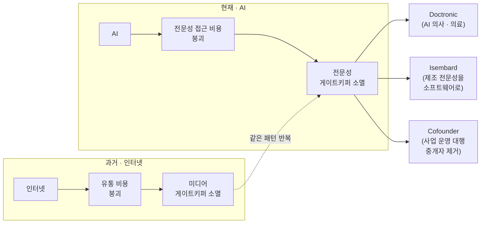

<figure class="post-figure post-figure--header">
<svg role="img" aria-label="무너지는 게이트키퍼 성문 사이로, 갇혀 있던 전문성(의료·제조·경영 아이콘)이 개인의 스마트폰으로 쏟아져 나오는 그림. 위쪽 점선 화살표는 성문을 그대로 둔 채 옆으로 비켜 가는 '자동화', 가운데 부서진 성문은 관문을 통째로 허무는 '파괴'를 상징한다." viewBox="0 0 640 340">
  <title>자동화(문지기 우회)와 파괴(정문 허묾)의 대비 — 전문성이 문지기에서 개인의 손으로</title>

  <!-- ground -->
  <line x1="24" y1="266" x2="616" y2="266" stroke="currentColor" stroke-width="2" opacity="0.45"/>

  <!-- ===== 자동화: 문지기를 그대로 둔 채 옆으로 비켜 최적화 (dashed bypass arc) ===== -->
  <path d="M40 150 C 78 44, 210 34, 262 92" fill="none" stroke="currentColor" stroke-width="2" stroke-dasharray="5 6" opacity="0.6"/>
  <path d="M262 92 l-11 -6 l3 12 z" fill="currentColor" opacity="0.6"/>
  <text x="130" y="34" text-anchor="middle" font-family="var(--font-body)" font-size="11.5" fill="currentColor" opacity="0.72">자동화 — 문지기를 비켜 최적화</text>

  <!-- ===== 게이트키퍼 성문 (gatehouse) ===== -->
  <!-- towers -->
  <rect x="70" y="98" width="52" height="168" fill="none" stroke="currentColor" stroke-width="2.5" opacity="0.9"/>
  <rect x="214" y="98" width="52" height="168" fill="none" stroke="currentColor" stroke-width="2.5" opacity="0.9"/>
  <!-- crenellations -->
  <g fill="currentColor" opacity="0.9">
    <rect x="70" y="86" width="13" height="14"/><rect x="90" y="86" width="13" height="14"/><rect x="109" y="86" width="13" height="14"/>
    <rect x="214" y="86" width="13" height="14"/><rect x="234" y="86" width="13" height="14"/><rect x="253" y="86" width="13" height="14"/>
  </g>
  <!-- tower slit windows -->
  <g fill="currentColor" opacity="0.5">
    <rect x="90" y="146" width="12" height="22"/>
    <rect x="234" y="146" width="12" height="22"/>
  </g>
  <!-- lintel over the arch -->
  <path d="M122 122 h92" fill="none" stroke="currentColor" stroke-width="2.5" opacity="0.9"/>

  <!-- ===== 파괴: 부서진 정문 (shattered gate + crimson breach) ===== -->
  <!-- broken portcullis bars -->
  <g stroke="currentColor" stroke-width="2" opacity="0.55">
    <line x1="138" y1="122" x2="138" y2="182"/>
    <line x1="200" y1="122" x2="200" y2="170"/>
    <line x1="122" y1="150" x2="176" y2="150"/>
  </g>
  <!-- crimson breach crack tearing down through the gate -->
  <path d="M168 122 L156 156 L176 176 L160 210 L182 244 L172 266" fill="none" stroke="var(--accent-color)" stroke-width="4" stroke-linejoin="round" stroke-linecap="round"/>
  <!-- rubble at the base -->
  <g fill="var(--accent-color)" opacity="0.85">
    <path d="M126 266 l14 -16 l12 12 l10 -8 l8 12 z"/>
    <path d="M190 266 l12 -12 l12 10 l10 -6 v8 z"/>
  </g>

  <!-- ===== 갇혀 있던 전문성이 개인의 손으로 쏟아져 나온다 (expertise streaming out) ===== -->
  <!-- dotted flow of expertise from the breach toward the phone -->
  <path d="M186 168 Q 320 120 452 178" fill="none" stroke="var(--gold)" stroke-width="2.5" stroke-dasharray="2 9" stroke-linecap="round" opacity="0.85"/>

  <!-- glyph 1: 의료 (cross) -->
  <g transform="translate(288,150)">
    <circle r="17" fill="none" stroke="var(--secondary-color)" stroke-width="2.5"/>
    <path d="M0 -9 V9 M-9 0 H9" stroke="var(--secondary-color)" stroke-width="3.5" stroke-linecap="round"/>
  </g>
  <!-- glyph 2: 제조 (gear/cog) -->
  <g transform="translate(360,124)">
    <circle r="16" fill="none" stroke="var(--gold)" stroke-width="6" stroke-dasharray="5 4"/>
    <circle r="5.5" fill="none" stroke="var(--gold)" stroke-width="2.5"/>
  </g>
  <!-- glyph 3: 경영 (briefcase) -->
  <g transform="translate(422,162)" stroke="var(--accent-color)" stroke-width="2.5" fill="none">
    <rect x="-16" y="-9" width="32" height="24" rx="2"/>
    <path d="M-7 -9 v-5 h14 v5"/>
    <line x1="-16" y1="2" x2="16" y2="2"/>
  </g>

  <!-- ===== 개인의 스마트폰 (the individual's phone, held in hand) ===== -->
  <!-- hand / palm cradling the phone -->
  <path d="M452 268 q-14 -6 -14 -26 l0 -46 q0 -10 10 -10 l86 0 q12 0 12 12 l0 44 q0 22 -18 32 z" fill="currentColor" opacity="0.16"/>
  <!-- phone body -->
  <rect x="470" y="150" width="86" height="112" rx="9" fill="var(--bg-panel)" stroke="currentColor" stroke-width="2.5"/>
  <!-- screen -->
  <rect x="480" y="164" width="66" height="84" rx="3" fill="none" stroke="currentColor" stroke-width="1.5" opacity="0.6"/>
  <!-- the individual / customer now holds the expertise (person glyph on screen) -->
  <g transform="translate(513,206)">
    <circle cy="-12" r="9" fill="none" stroke="var(--secondary-color)" stroke-width="2.5"/>
    <path d="M-15 16 q0 -20 15 -20 q15 0 15 20" fill="none" stroke="var(--secondary-color)" stroke-width="2.5"/>
  </g>

  <!-- labels -->
  <text x="176" y="304" text-anchor="middle" font-family="var(--font-body)" font-size="12" font-weight="700" fill="var(--accent-color)">파괴 — 정문을 통째로 허묾</text>
  <text x="513" y="304" text-anchor="middle" font-family="var(--font-body)" font-size="12" font-weight="700" fill="var(--secondary-color)">권력 → 고객의 손</text>
</svg>
<figcaption>자동화는 문지기를 그대로 둔 채 옆으로 비켜 최적화한다(점선). 파괴는 정문 자체를 허물어, 갇혀 있던 전문성을 개인의 손으로 쏟아 넘긴다.</figcaption>
</figure>

## 원문 정보

> - **제목**: Obliterate, Don't Automate
> - **출처**: Union Square Ventures (USV) 블로그 ([blog.usv.com](https://blog.usv.com/obliterate))
> - **발행**: 2026-07-22 · 약 4분 분량
> - **원문 링크**: <https://blog.usv.com/obliterate>

USV는 Twitter·Etsy·Coinbase 등에 초기 투자한 뉴욕의 대표 벤처캐피털이다. 이 글은 그들의 오래된 투자 철학("Don't Automate, Obliterate")을 AI 시대에 맞게 뒤집어 다시 세운 짧은 선언문이다. AI가 '일'이 아니라 '시장 구조' 자체를 어떻게 바꾸는지를 투자자의 언어로 압축했기에 Articles에 담는다.

## 한 줄 요약 (TL;DR)

인터넷이 **유통 비용**을 0에 가깝게 무너뜨려 미디어 문지기의 시장 지배력을 걷어냈듯, AI는 **전문성(expertise)**에 똑같은 일을 한다. 승자는 기존 게이트키퍼의 업무를 자동화(효율화)하는 회사가 아니라, 게이트키퍼가 통제하던 시장을 통째로 재구성해 그 권력을 문지기에서 고객에게 넘기는 회사다.

아래 한 장이 이 글의 척추다. 위·아래 두 줄이 같은 패턴을 반복한다 — **무언가의 비용이 붕괴하면, 그 비용을 통제하던 문지기가 소멸한다.** 인터넷이 유통에 한 일을 AI가 전문성에 한다.

## 왜 이 글을 골랐나

이 위키의 Articles/AI-Industry에는 "AI가 일과 산업을 어떻게 바꾸는가"를 다루는 글이 여럿 쌓여 있다. 대부분은 **노동·커리어·기술 부채** 같은 개인·팀 층위를 본다. 이 글은 한 단계 위, **시장 구조와 권력의 이동**을 본다는 점에서 결이 다르다.

특히 흥미로운 지점은 두 가지다. 첫째, 이 글은 **1990년 Michael Hammer의 리엔지니어링 명제**("Don't Automate, Obliterate")를 35년 만에 다시 꺼내 AI에 대입한다 — 즉 지금의 흥분을 완전히 새로운 것으로 포장하는 대신, 검증된 프레임 위에 세운다. 둘째, USV는 이걸 **투자 명제(무엇에 돈을 넣을지의 기준)**로 제시한다. 창업가·엔지니어에게는 "무엇을 만들면 자본이 붙는가"의 힌트가 되고, 실무자에게는 "내가 팔던 전문성이 언제 문지기 자리에서 밀려나는가"의 경고가 된다.

## 핵심 내용

### 1. 뿌리: Hammer의 리엔지니어링, 그리고 Fred Wilson의 2015년

원제 "Obliterate, Don't Automate"는 두 개의 선행 텍스트를 뒤집은 것이다.

- **Michael Hammer, 1990 (HBR, "Reengineering Work: Don't Automate, Obliterate")**: 기업이 IT를 도입할 때 기존의 비효율적 프로세스를 그대로 두고 '전산화'만 하면 낡은 업무를 더 빨리 굴릴 뿐이다. 진짜 성과는 프로세스를 **없애고 다시 설계**할 때 나온다.
- **Fred Wilson, 2015 (USV, "Don't Automate, Obliterate")**: 위 명제를 투자 철학으로 옮긴다. USV는 기존 시장에 **효율(efficiency)**만 더하는 회사가 아니라, 시장 자체를 **다시 세우는** 회사를 찾는다.

이번 글은 그 순서를 뒤집어 **"Obliterate, Don't Automate"**로 재선언한다. AI 시대에는 '파괴'가 부수적 선택지가 아니라 기본값이 되었다는 뉘앙스의 전환이다.

### 2. AI가 바꾸는 것: 유통에서 전문성으로

글의 중심 논증은 하나의 유비(analogy)로 압축된다.

> "인터넷은 유통 비용을 무너뜨렸고, 그것을 통제하던 미디어 기업들에게서 시장 권력을 벗겨냈다. AI는 전문성에 똑같은 일을 한다."

- **인터넷 이전**: 콘텐츠를 대중에게 닿게 하려면 신문사·방송사·유통망이라는 **문지기**를 거쳐야 했다. 유통 비용이 곧 그들의 권력이었다.
- **인터넷 이후**: 누구나 직접 배포할 수 있게 되자 그 권력은 증발했다.
- **AI 이전**: 의료·법률·제조·경영 같은 **전문성**은 자격을 가진 전문가(게이트키퍼)에게 '빌려' 써야 했다. 접근 비용이 곧 그들의 권력이었다.
- **AI 이후**: 사용자가 전문성을 문지기에게서 빌리지 않고 **직접 접근·배치**한다. 그 결과 시장 구조가 근본적으로 재편된다.

핵심은 자동화와 파괴의 구분이다. 전문가의 업무를 더 빠르게 돕는 도구를 만드는 것은 **자동화**다. 전문가라는 중개 계층 자체가 필요 없도록 시장을 다시 짜는 것이 **파괴**다. USV가 베팅하는 쪽은 후자다.

### 3. 세 가지 사례

글은 자신들의 포트폴리오에서 '파괴' 유형의 회사를 예로 든다.

- **Doctronic** — 처방까지 (유타주부터) 법적으로 낼 수 있는 **AI 의사**를 스마트폰을 가진 누구의 주머니에나 넣어 의료를 민주화한다. 병원·전문의라는 접근 관문을 우회한다.
- **Isembard** — **제조 전문성**을 소프트웨어로 패키징해, 특화된 산업 역량을 널리 배치 가능하게 만든다. 숙련·설비에 갇혀 있던 지식을 코드로 푼다.
- **Cofounder** — 고객을 **대신해 사업 전체를 운영**한다. 전통적 중개자(대행사·컨설턴트 등)를 제거하는 쪽이다.

세 사례의 공통점은 뚜렷하다. 기존 전문가를 '보조'하는 게 아니라, 전문성에 대한 **접근 통제권을 문지기에게서 고객에게로 이전**한다.

### 4. 결론: 거의 모든 카테고리로

USV의 결론은 이 패턴이 특정 산업의 이야기가 아니라는 것이다. AI의 진짜 힘은 **거의 모든 비즈니스 카테고리에서 권력을 게이트키퍼로부터 고객에게 넘기는 데** 있고, 그것이 전례 없는 시장 재구성의 기회를 만든다.

## 분석과 인사이트

**(1) 이 글은 '효율화 스타트업'에 대한 조용한 사망 선고다.** 지난 몇 년의 흔한 AI 창업 서사는 "X 직군을 위한 코파일럿"이었다 — 변호사·의사·회계사의 생산성을 올리는 도구. USV의 프레임에서 이런 회사는 대부분 **자동화** 진영이고, 문지기의 존재를 전제하므로 그 문지기에게 가치의 상당 부분을 헌납한다. 이 위키의 [데이터가 당신의 유일한 해자다](/2026/07/20/data-is-your-only-moat.html)가 던진 질문 — "채택이 쉬운 곳에서 데이터 플라이휠을 돌리는 회사만 해자를 갖는다" — 와 겹쳐 읽으면, '고객에게 직접 닿아 관문을 없애는' 파괴 유형이 왜 구조적으로 더 강한 해자를 갖는지가 분명해진다.

**(2) 그러나 '유통'과 '전문성'의 유비에는 비대칭이 있다.** 콘텐츠 유통에는 규제·책임이 거의 없었다. 반면 전문성 시장의 문지기 상당수(의료 면허, 법률 자격, 제조 안전 규격)는 **비효율이 아니라 책임·안전을 담보하는 장치**다. 원문이 Doctronic을 소개하며 "유타주부터 법적으로 처방 가능"이라고 굳이 명시한 것 자체가, 파괴의 속도를 정하는 병목이 **기술이 아니라 규제·책임**임을 드러낸다. 즉 이 명제는 "기술적으로 가능한가"보다 "누가 책임지는가"가 승부처인 시장에서는 훨씬 느리게, 그리고 지역별로 쪼개져 실현된다. 노동 대체의 인센티브 구조를 냉정하게 짚은 [죽은 경제 이론](/2026/06/22/the-dead-economy-theory.html)의 시선과 나란히 두면, 파괴가 '누구에게' 권력을 넘기는가라는 분배 질문도 함께 따라온다.

**(3) 엔지니어에게 이건 곧 '자기 전문성의 게이트키퍼 지수'를 점검하라는 신호다.** 내가 파는 것이 "특정 지식에 대한 접근을 통제하는 대가"에 가깝다면, 그 부분은 AI가 가장 먼저 무너뜨릴 표면이다. 반대로 "맥락을 읽고 책임지고 판단하는 역량"에 가깝다면 오히려 몸값이 오른다 — 이는 [우리는 도둑처럼 한몫 챙길 것이다](/2026/07/18/make-out-like-bandits.html)가 시니어 개발자의 몸값 상승으로, [AI 시대, 나의 전문성을 재설계하는 법](/2026/06/22/ai-era-expertise-redesign.html)이 '스킬 숙련자에서 운영 책임자로'라는 재정의로 각각 예고한 방향과 같은 곳을 가리킨다.

**(4) 투자 명제로서의 실용적 필터.** "이 회사는 문지기를 자동화하는가, 파괴하는가?"는 창업 아이디어를 거르는 한 줄 리트머스가 된다. [The Founder's Playbook](/2026/06/19/the-founders-playbook.html)이 제시한 AI 네이티브 스타트업의 단계론에 이 질문을 앞단에 붙이면, "무엇을 만들까" 이전에 "어느 시장의 어떤 관문을 없앨까"를 먼저 정하게 된다.

## 적용 포인트

- **아이디어를 이 한 줄로 거른다**: "우리는 [X 직군]을 **돕는가**, 아니면 [X라는 관문] 없이도 되게 **만드는가**?" 전자면 자동화, 후자면 파괴다.
- **자기 역할을 '게이트키퍼 지수'로 점검한다**: 내 가치가 '지식 접근 통제'에 있는지, '맥락·판단·책임'에 있는지 구분하고 후자로 무게중심을 옮긴다.
- **규제·책임이 병목인 시장을 노린다면 지역·수직 단위로 쪼갠다**: Doctronic의 '유타주부터'처럼, 파괴는 전면전이 아니라 규제가 허용하는 좁은 틈부터 시작된다.
- **해자는 '파괴 이후'에서 찾는다**: 관문을 없애 고객에게 직접 닿은 뒤 쌓이는 사용·데이터 플라이휠이 진짜 방어선이다. 접근 자체는 곧 흔해진다.
- **'효율' 지표에 안주하지 않는다**: 기존 프로세스를 N% 빠르게 만든다는 수치는 Hammer의 경고대로 '낡은 업무를 더 빨리 굴리는' 함정일 수 있다.

## 마무리

"Obliterate, Don't Automate"는 새 기술을 새 이론으로 설명하지 않는다. 오히려 35년 된 리엔지니어링 명제와 인터넷이 미디어에 한 일을 그대로 빌려와, AI를 **전문성의 유통 혁명**으로 규정한다. 이 프레임의 힘은 단순함에 있다 — 문지기를 더 빠르게 만들지, 아예 없앨지. 다만 전문성 시장의 문지기는 비효율의 산물만이 아니라 책임·안전의 장치이기도 하므로, 진짜 승부는 "기술적으로 파괴 가능한가"가 아니라 "누가 그 책임을 넘겨받는가"에서 갈릴 것이다. 창업가에게는 겨냥할 관문을, 엔지니어에게는 지켜야 할 역량의 방향을 동시에 가리키는 짧지만 밀도 높은 선언이다.

### 더 읽어보기

- [원문 — Obliterate, Don't Automate (USV)](https://blog.usv.com/obliterate)
- [데이터가 당신의 유일한 해자다](/2026/07/20/data-is-your-only-moat.html) — 파괴 이후 진짜 해자는 채택 용이성이 돌리는 데이터 플라이휠이라는 논지
- [The Founder's Playbook: AI 네이티브 스타트업을 만드는 4단계](/2026/06/19/the-founders-playbook.html) — "무엇을 만들까" 앞에 "어느 관문을 없앨까"를 붙일 단계론
- [우리는 도둑처럼 한몫 챙길 것이다](/2026/07/18/make-out-like-bandits.html) — 게이트키퍼가 아닌 판단·책임 역량의 몸값이 오르는 흐름
- [AI 시대, 나의 전문성을 재설계하는 법](/2026/06/22/ai-era-expertise-redesign.html) — '스킬 숙련자에서 운영 책임자로'라는 전문가 재정의
- [죽은 경제 이론](/2026/06/22/the-dead-economy-theory.html) — 파괴가 '누구에게' 권력을 넘기는가라는 분배 질문
