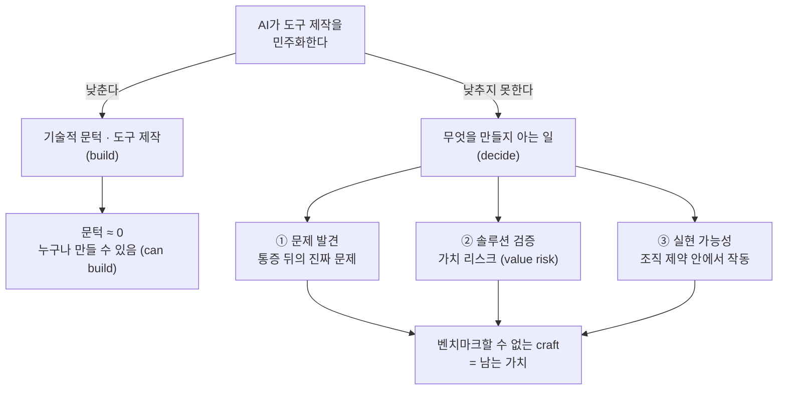

<figure class="post-figure post-figure--header">
<svg role="img" aria-label="AI가 망치를 공짜로 나눠준 대장간을 한 장으로 그린 그림. 좌우 양쪽 바닥에는 누구나 똑같이 쥔 여러 개의 망치가 흐릿하게 늘어서 있어 '이제 누구나 도구를 만들 수 있다(can build)'를 나타낸다. 한가운데에는 금빛 후광에 싸여 환하게 빛나는 설계 두루마리 한 장이 떠 있고, 그 안에는 검 한 자루의 설계 도면과 치수선, 그리고 큰 물음표가 그려져 '이 검이 존재해야 하는가, 어떤 모양이어야 하는가'라는 판단만이 빛난다." viewBox="0 0 680 300" xmlns="http://www.w3.org/2000/svg">
  <title>누구나 망치를 쥔 대장간 — 빛나는 건 '무엇을 벼릴지' 아는 한 사람</title>

  <!-- top title -->
  <text x="340" y="26" text-anchor="middle" font-size="13" fill="currentColor" font-weight="700" opacity="0.82">AI가 망치를 공짜로 나눠준 대장간</text>

  <!-- ground line -->
  <line x1="34" y1="272" x2="646" y2="272" stroke="currentColor" stroke-width="1.5" opacity="0.4"/>

  <!-- ===== dim crowd: everyone holds an identical hammer (can build) ===== -->
  <g fill="currentColor" opacity="0.26">
    <!-- left group -->
    <g><rect x="46" y="216" width="28" height="15" rx="2"/><rect x="57" y="231" width="6" height="40"/></g>
    <g><rect x="116" y="216" width="28" height="15" rx="2"/><rect x="127" y="231" width="6" height="40"/></g>
    <g><rect x="186" y="216" width="28" height="15" rx="2"/><rect x="197" y="231" width="6" height="40"/></g>
    <!-- right group -->
    <g><rect x="466" y="216" width="28" height="15" rx="2"/><rect x="477" y="231" width="6" height="40"/></g>
    <g><rect x="536" y="216" width="28" height="15" rx="2"/><rect x="547" y="231" width="6" height="40"/></g>
    <g><rect x="606" y="216" width="28" height="15" rx="2"/><rect x="617" y="231" width="6" height="40"/></g>
  </g>
  <text x="130" y="292" text-anchor="middle" font-size="10" fill="currentColor" opacity="0.55">누구나 망치를 쥔다 · can build</text>
  <text x="550" y="292" text-anchor="middle" font-size="10" fill="currentColor" opacity="0.55">누구나 망치를 쥔다 · can build</text>

  <!-- ===== center: the one who knows WHAT to forge (glowing blueprint) ===== -->
  <circle cx="340" cy="140" r="92" fill="var(--gold)" opacity="0.07"/>
  <circle cx="340" cy="140" r="62" fill="var(--gold)" opacity="0.10"/>

  <!-- blueprint scroll -->
  <rect x="272" y="74" width="136" height="130" rx="4" fill="var(--bg-light)" stroke="var(--gold)" stroke-width="2.5"/>

  <!-- sword being designed -->
  <polygon points="340,90 347,155 333,155" fill="none" stroke="var(--accent-color)" stroke-width="2"/>
  <line x1="340" y1="98" x2="340" y2="150" stroke="var(--accent-color)" stroke-width="1" opacity="0.55"/>
  <rect x="320" y="155" width="40" height="7" rx="1" fill="var(--accent-color)"/>
  <line x1="340" y1="162" x2="340" y2="182" stroke="currentColor" stroke-width="5"/>
  <circle cx="340" cy="186" r="5" fill="var(--accent-color)"/>

  <!-- dimension line (blueprint feel) -->
  <line x1="376" y1="90" x2="376" y2="162" stroke="currentColor" stroke-width="1" stroke-dasharray="3 3" opacity="0.6"/>
  <line x1="372" y1="90" x2="380" y2="90" stroke="currentColor" stroke-width="1" opacity="0.6"/>
  <line x1="372" y1="162" x2="380" y2="162" stroke="currentColor" stroke-width="1" opacity="0.6"/>

  <!-- the question: what shape should exist? -->
  <text x="298" y="132" text-anchor="middle" font-size="28" font-weight="700" fill="var(--gold)">?</text>

  <!-- center labels -->
  <text x="340" y="228" text-anchor="middle" font-size="11.5" fill="currentColor" font-weight="700">이 검이 존재해야 하는가?</text>
  <text x="340" y="246" text-anchor="middle" font-size="10.5" fill="currentColor" opacity="0.78">— 어떤 모양이어야 하는가 · decide</text>
</svg>
<figcaption>기술적 문턱이 사라져도, 정작 빛나는 건 '무엇을 벼려야 하는지'를 아는 한 사람이다.</figcaption>
</figure>

## 원문 정보

> - **제목**: A Fresh Definition of The Product Role
> - **출처**: Silicon Valley Product Group (SVPG) · Marty Cagan ([svpg.com](https://www.svpg.com/))
> - **발행**: 2026-08-10 · 약 6~7분 분량
> - **원문 링크**: <https://www.svpg.com/a-fresh-definition-of-the-product-role/>

프로덕트 매니지먼트의 정전(正典)이라 할 *Inspired* · *Empowered*의 저자 Marty Cagan이, "AI가 도구를 누구나 만들 수 있게 한다면 프로덕트 역할은 사라지는가?"라는 질문에 정면으로 답한 글이다. AI가 직업과 역할의 가치를 어떻게 재배치하는지를 다루므로 `Articles/AI-Industry`에 담는다.

## 한 줄 요약 (TL;DR)

AI는 '도구를 만드는 일'을 값싸게 만들지만, 정작 어려운 일 — **어떤 것이 존재해야 하는지, 그리고 어떻게 존재해야 하는지를 아는 일** — 은 값싸게 만들지 못한다. 프로덕트 역할의 본질은 도구 제작이 아니라 문제 발견·솔루션 검증·조직 실현 가능성 판단에 있고, 이 셋은 여전히 소수만이 잘하는 기술이다.

### 한눈에 보기

기술적 문턱은 바닥으로 내려가지만, 그 옆의 세 기둥 — 문제 발견·솔루션 검증·실현 가능성 — 은 그대로 서 있다.

## 왜 이 글을 골랐나

"AI가 코드를/도구를 공짜로 만든다"는 서사는 이 위키의 여러 글이 이미 다뤄 온 주제다. 다만 대부분은 **엔지니어의 가치**가 어디로 이동하는가에 초점을 맞췄다. Cagan의 글은 같은 질문을 **프로덕트 역할**에 던진다는 점에서 결이 다르다.

그리고 이 구분이 중요한 이유가 있다. AI 시대에 "누구나 만들 수 있다"는 말이 사실이 되어 갈수록, 병목은 **제작(build)에서 판단(decide)으로** 옮겨간다. 무엇을 만들지 결정하는 일 — 그게 정확히 프로덕트의 일이다. Cagan은 이 이동을 프로덕트 역할의 위기가 아니라 오히려 **본질의 재확인**으로 읽어낸다. 엔지니어든 디자이너든 창업자든, "그래서 무엇을 만들 것인가"를 고민하는 모든 사람에게 적용되는 프레임이다.

## 핵심 내용

### 프로덕트 정의는 일종의 로르샤흐 테스트

Cagan은 "당신은 프로덕트의 역할을 어떻게 정의하는가?"라는 질문 자체가 **진단 도구**라고 말한다. 사람마다 내놓는 정의가 제각각인데, 그 대답에는 그 사람이 팀에 무엇을 기여한다고 믿는지, 어떤 운영 모델(operating model)로 일하는지가 그대로 드러난다는 것이다. 정의가 곧 그 사람의 직업적 가치관을 비추는 잉크 얼룩(로르샤흐)이다.

### Benedict Evans의 도구 제작 이야기에서 빌려온 프레임

이 글의 출발점은 기술 분석가 Benedict Evans가 팟캐스트에서 한 '도구 제작(tool-building)' 논의다. 핵심 관찰은 이렇다.

> "AI는 누구나 도구를 만들 수 있게 해준다… 다만 대부분의 사람과 기업은 도구 제작자가 아니고, 그렇게 사고하지 않으며, 그렇게 할 수도 없고 하지도 않을 것이다."

즉 "만들 수 있게 됨(can build)"과 "만드는 사람이 됨(are builders)"은 전혀 다른 이야기다. 기술적 문턱이 사라져도 대부분의 사람과 조직은 여전히 도구 제작자로 사고하지 않는다. 그리고 바로 그 간극 위에 프로덕트 역할이 서 있다.

### 프로덕트 역할을 이루는 세 가지 기술

Cagan은 이 프레임을 빌려 프로덕트의 본질을 세 가지 기술로 정리한다.

**1) 문제 발견 (Problem Discovery)**

대부분의 사람은 통증(pain)을 느끼거나 표면적인 아이디어 정도는 낸다. 하지만 뛰어난 프로덕트 담당자는 구체적인 불평 뒤에 있는 **더 깊고 더 일반적인 진짜 문제**를 찾아낸다. "이 버튼을 여기 놔달라"는 요청 밑에 깔린 실제 니즈를 읽어내는 능력이다.

**2) 솔루션 발견 = 가치 리스크 (Solution Discovery / Value Risk)**

> "도구를 정말 잘 쓰는 사람과, 그 도구를 정말 잘 만드는 사람은 같은 사람이 아니다."

무언가를 **잘 사용하는 것**과 그것을 **효과적으로 설계하는 것**은 근본적으로 다른 능력이다. 사용자가 원한다고 말하는 것을 그대로 만드는 게 아니라, 실제로 가치를 주는(고객이 사고 쓰는) 솔루션인지를 검증하는 일 — 이게 가치 리스크를 다루는 기술이다.

**3) 실현 가능성 판단 (Viability Assessment)**

뛰어난 프로덕트 담당자는 **조직의 복잡성**을 이해한다. 솔루션이 영업·마케팅·재무·컴플라이언스·법무, 그리고 기존 레거시 시스템과 어떻게 맞물리는지를 안다. 아무리 좋은 솔루션도 조직 전체의 제약 안에서 실제로 돌아갈 수 있어야 한다.

### 결론: 기술 문턱은 바뀌어도 인간의 과제는 그대로다

AI는 창작 도구를 민주화한다. 그러나 프로덕트의 craft — 진짜 문제를 알아보고, 효과적인 솔루션을 설계하며, 조직의 제약을 헤쳐 나가는 일 — 는 대부분의 사람이 갖지 못한 특정한 사고방식을 요구한다. Cagan의 마무리 문장이 이 논지를 압축한다.

> "어려운 부분은 그것이 존재해야 한다는 것을 아는 일, 그리고 그것이 어떻게 존재해야 하는지를 아는 일이다. 그리고 그건 (도구를 만드는 사람과는) 다른 사람이다."

AI는 **기술적 문턱**을 바꿀 뿐, 무엇이 존재해야 하고 어떻게 존재해야 하는지를 아는 **근본적으로 인간적인 과제**는 바꾸지 못한다.

## 분석과 인사이트

여기서부터는 원문 요약이 아니라 내 관점이다.

**"can build ≠ are builders"는 이 글의 진짜 못이다.** AI 담론이 흔히 저지르는 오류는 "가능해짐"과 "실제로 함"을 같은 것으로 취급하는 것이다. 스프레드시트가 누구나 모델링을 할 수 있게 했지만 모두가 재무 분석가가 되지는 않았고, 카메라가 누구나 사진을 찍게 했지만 사진의 값어치가 0이 되지는 않았다. 병목이 '제작 역량'에서 '무엇을 만들지 아는 안목'으로 이동했을 뿐이다. Cagan은 이 오래된 진실을 프로덕트 역할에 정확히 적용한다.

**이 위키의 다른 글들과 놀랍도록 정합적이다.** [The Untrainable](/2026/06/23/the-untrainable.html)은 "측정할 수 있는 일은 학습 가능하고 따라서 commodity가 된다 — 해자는 벤치마크할 수 없는 곳에 있다"고 말한다. Cagan의 세 기술(문제 발견·가치 검증·실현 가능성)은 정확히 **벤치마크하기 어려운 일**이다. [취향과 판단, 그리고 AI](/2026/08/04/taste-judgment-and-ai.html)의 '판단은 이전되지 않는다'는 논지, [AI는 왜 엔지니어를 대체하지 못했나](/2026/06/19/ai-hasnt-replaced-engineers.html)의 decide-execute-deliver 프레임에서 'decide'가 남는다는 관찰과도 같은 방향을 가리킨다. 서로 다른 저자들이 각자의 직군에서 같은 결론에 도달하고 있다는 게 인상적이다.

**다만 한 가지 이견 혹은 경계.** Cagan의 논지는 "프로덕트 역할은 안전하다"로 오독되기 쉽다. 하지만 글이 지키는 것은 **역할(craft)**이지 **자리(headcount)**가 아니다. 세 기술을 실제로 갖춘 프로덕트 담당자는 귀해지지만, "고객 요청을 티켓으로 옮기고 로드맵을 관리하던" 사무적 프로덕트 매니저는 오히려 AI에 더 빠르게 흡수된다. 이 글은 프로덕트 직군에 대한 안심이 아니라 **자기 검증표**로 읽는 게 맞다 — 나는 통증을 접수하는 사람인가, 문제를 발견하는 사람인가?

**엔지니어에게도 그대로 적용된다.** '도구를 잘 쓰는 사람 ≠ 도구를 잘 만드는 사람'은 그대로 '코드를 잘 짜는 사람 ≠ 무엇을 만들지 아는 사람'으로 번역된다. AI가 코딩을 값싸게 만든 시대에 엔지니어가 프로덕트 감각(문제 발견·가치 판단)을 갖추는 일이 왜 커리어 방어책이 되는지를, 이 글은 프로덕트 쪽에서 거울처럼 보여준다.

## 적용 포인트

- **자기 정의를 한 문장으로 써 보라.** "나는 프로덕트/엔지니어링에서 무엇을 기여하는가?" 그 대답이 '요청 처리·기능 배송'에 머문다면, 그건 AI가 가장 먼저 흡수할 층이다.
- **'통증'과 '문제'를 분리하라.** 이해관계자가 가져오는 것은 대개 통증이나 이미 정해진 해법이다. 그 뒤의 더 일반적인 진짜 문제를 한 단계 더 파고드는 습관을 들여라.
- **"사용 잘함"을 "설계 잘함"으로 착각하지 말라.** 파워 유저의 요구를 그대로 만들지 말고, 그것이 실제로 가치를 주는 솔루션인지(value risk) 별도로 검증하라.
- **실현 가능성을 초기에 끌어와라.** 영업·법무·컴플라이언스·레거시 제약을 설계가 끝난 뒤가 아니라 발견 단계에서 함께 본다.
- **벤치마크 불가능한 근육을 키워라.** 측정·자동화가 쉬운 일일수록 commodity가 된다. 나의 시간을 '무엇을 만들지 아는 일'에 재배치하라.

## 마무리

Cagan의 글은 새로운 이론을 제시하지 않는다. 오히려 AI라는 렌즈를 통해 프로덕트 역할의 **가장 오래된 본질**을 다시 비춰 보인다. 도구를 만드는 문턱이 낮아질수록, "무엇이 존재해야 하고 어떻게 존재해야 하는가"를 아는 사람의 값어치는 오히려 선명해진다. 이것은 프로덕트에만 국한된 이야기가 아니다 — 코드가, 디자인이, 콘텐츠가 값싸진 모든 영역에서 병목은 제작에서 판단으로 옮겨가고, 그 판단을 감당할 수 있는 사람이 남는다.

### 더 읽어보기

- [원문 — A Fresh Definition of The Product Role (Marty Cagan, SVPG)](https://www.svpg.com/a-fresh-definition-of-the-product-role/)
- [The Untrainable: 벤치마크할 수 없는 일에 가치가 남는다](/2026/06/23/the-untrainable.html) — '측정 가능 = commodity, 해자는 벤치마크 밖에' — Cagan의 세 기술과 정확히 맞물린다
- [취향과 판단, 그리고 AI](/2026/08/04/taste-judgment-and-ai.html) — 에이전트가 못 가져가는 '이름을 거는 판단', 같은 결론의 다른 얼굴
- [AI는 왜 소프트웨어 엔지니어를 대체하지 못했나](/2026/06/19/ai-hasnt-replaced-engineers.html) — decide-execute-deliver 중 'decide'가 남는다는 프레임
- [코드가 공짜가 된 시대의 '취향(taste)'](/2026/06/19/ai-engineer-taste.html) — 엔지니어 버전의 '무엇을 만들지 아는 안목'
- [AI 시대, 나의 전문성을 재설계하는 법](/2026/06/22/ai-era-expertise-redesign.html) — '스킬 숙련자에서 운영 책임자로', 무게중심이 생산에서 검증으로 이동한다는 관찰
