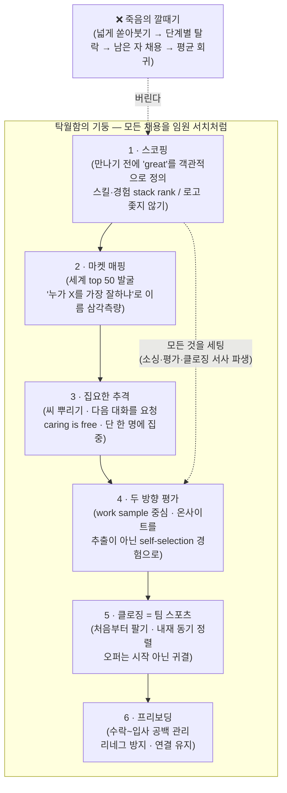

<figure class="post-figure post-figure--header">
<svg role="img" aria-label="왼쪽은 '죽음의 깔때기(funnel of doom)': 넓은 입구로 수많은 지원자가 쏟아져 들어가 단계마다 걸러지고 밑바닥에 '남은 자' 한 명만 떨어진다. 오른쪽은 '탁월함의 기둥(pillar of excellence)': 세계 top 1% 소수 정예 명단이 새겨진 좁고 단단한 기둥 위에서 오크 전사가 화살로 그중 단 한 명을 정조준한다. 대량 스크리닝 대 정밀 서치의 대비." viewBox="0 0 680 340" xmlns="http://www.w3.org/2000/svg">
  <title>죽음의 깔때기(남은 자를 뽑는 평균 회귀) 대 탁월함의 기둥(top 1%를 미리 정의해 정조준)</title>
  <defs>
    <marker id="tal-head" markerWidth="9" markerHeight="9" refX="7" refY="3" orient="auto">
      <path d="M0 0 L7 3 L0 6 z" fill="currentColor"/>
    </marker>
    <marker id="tal-head-acc" markerWidth="10" markerHeight="10" refX="8" refY="3" orient="auto">
      <path d="M0 0 L8 3 L0 6 z" fill="var(--accent-color)"/>
    </marker>
  </defs>

  <!-- ===== LEFT: funnel of doom ===== -->
  <text x="150" y="26" text-anchor="middle" font-size="13" fill="currentColor" font-weight="700">FUNNEL OF DOOM</text>
  <text x="150" y="42" text-anchor="middle" font-size="10" fill="currentColor" opacity="0.6">넓게 쏟아붓고 · 남은 자를 뽑는다</text>

  <!-- crowd of applicants pouring in -->
  <g fill="currentColor" opacity="0.42">
    <circle cx="60" cy="62" r="5"/><circle cx="88" cy="58" r="5"/><circle cx="116" cy="62" r="5"/>
    <circle cx="144" cy="57" r="5"/><circle cx="172" cy="62" r="5"/><circle cx="200" cy="58" r="5"/><circle cx="228" cy="62" r="5"/>
    <circle cx="74" cy="76" r="5"/><circle cx="102" cy="74" r="5"/><circle cx="130" cy="76" r="5"/>
    <circle cx="158" cy="74" r="5"/><circle cx="186" cy="76" r="5"/><circle cx="214" cy="74" r="5"/>
  </g>

  <!-- funnel body -->
  <path d="M48 92 L252 92 L188 176 L188 250 L112 250 L112 176 Z" fill="var(--bg-light)" stroke="currentColor" stroke-width="2"/>
  <!-- filter stages -->
  <line x1="76" y1="120" x2="224" y2="120" stroke="currentColor" stroke-width="1.4" opacity="0.55" stroke-dasharray="4 4"/>
  <line x1="104" y1="150" x2="196" y2="150" stroke="currentColor" stroke-width="1.4" opacity="0.55" stroke-dasharray="4 4"/>
  <text x="252" y="118" text-anchor="start" font-size="8.5" fill="currentColor" opacity="0.6">스크린</text>
  <text x="252" y="148" text-anchor="start" font-size="8.5" fill="currentColor" opacity="0.6">인터뷰</text>
  <!-- dropped-out applicants spilling to the sides -->
  <g fill="currentColor" opacity="0.3">
    <circle cx="40" cy="126" r="4"/><circle cx="30" cy="140" r="4"/>
    <circle cx="260" cy="126" r="4"/><circle cx="270" cy="140" r="4"/>
    <circle cx="70" cy="164" r="4"/><circle cx="230" cy="164" r="4"/>
  </g>

  <!-- the one remainder at the bottom -->
  <circle cx="150" cy="270" r="9" fill="var(--bg-panel)" stroke="currentColor" stroke-width="2"/>
  <text x="150" y="300" text-anchor="middle" font-size="10" fill="currentColor" opacity="0.75" font-weight="700">남은 자 1명</text>
  <text x="150" y="316" text-anchor="middle" font-size="8.5" fill="currentColor" opacity="0.55">= 평균으로 회귀</text>

  <!-- divider -->
  <line x1="340" y1="40" x2="340" y2="300" stroke="currentColor" stroke-width="1.2" opacity="0.3" stroke-dasharray="3 5"/>
  <text x="340" y="176" text-anchor="middle" font-size="11" fill="var(--accent-color)" font-weight="700">VS</text>

  <!-- ===== RIGHT: pillar of excellence ===== -->
  <text x="512" y="26" text-anchor="middle" font-size="13" fill="var(--accent-color)" font-weight="700">PILLAR OF EXCELLENCE</text>
  <text x="512" y="42" text-anchor="middle" font-size="10" fill="currentColor" opacity="0.6">top 1%를 정의하고 · 한 명을 정조준</text>

  <!-- the pillar: narrow, solid, engraved with a shortlist -->
  <rect x="470" y="120" width="84" height="150" rx="4" fill="var(--bg-light)" stroke="var(--accent-color)" stroke-width="2.4"/>
  <rect x="470" y="108" width="84" height="16" rx="3" fill="var(--bg-panel)" stroke="var(--accent-color)" stroke-width="2"/>
  <rect x="464" y="270" width="96" height="14" rx="3" fill="var(--bg-panel)" stroke="var(--accent-color)" stroke-width="2"/>
  <!-- engraved shortlist rows -->
  <line x1="482" y1="140" x2="542" y2="140" stroke="currentColor" stroke-width="1.4" opacity="0.55"/>
  <line x1="482" y1="158" x2="542" y2="158" stroke="currentColor" stroke-width="1.4" opacity="0.55"/>
  <line x1="482" y1="176" x2="542" y2="176" stroke="currentColor" stroke-width="1.4" opacity="0.55"/>
  <line x1="482" y1="194" x2="542" y2="194" stroke="currentColor" stroke-width="1.4" opacity="0.55"/>
  <line x1="482" y1="212" x2="542" y2="212" stroke="currentColor" stroke-width="1.4" opacity="0.55"/>
  <line x1="482" y1="230" x2="542" y2="230" stroke="currentColor" stroke-width="1.4" opacity="0.55"/>
  <text x="512" y="256" text-anchor="middle" font-size="8.5" fill="currentColor" opacity="0.6">세계 top 50 명단</text>

  <!-- the targeted one (marked on the shortlist) -->
  <circle cx="512" cy="176" r="10" fill="none" stroke="var(--accent-color)" stroke-width="2.4"/>
  <line x1="512" y1="163" x2="512" y2="169" stroke="var(--accent-color)" stroke-width="2"/>
  <line x1="512" y1="183" x2="512" y2="189" stroke="var(--accent-color)" stroke-width="2"/>
  <line x1="499" y1="176" x2="505" y2="176" stroke="var(--accent-color)" stroke-width="2"/>
  <line x1="519" y1="176" x2="525" y2="176" stroke="var(--accent-color)" stroke-width="2"/>

  <!-- the aimed arrow -> precise targeting -->
  <line x1="612" y1="176" x2="528" y2="176" stroke="var(--accent-color)" stroke-width="2.6" marker-end="url(#tal-head-acc)"/>
  <text x="600" y="152" text-anchor="middle" font-size="9.5" fill="var(--accent-color)" opacity="0.85" font-weight="700">정조준</text>
  <text x="600" y="300" text-anchor="middle" font-size="10" fill="var(--accent-color)" opacity="0.85" font-weight="700">그 한 사람</text>
  <text x="600" y="316" text-anchor="middle" font-size="8.5" fill="currentColor" opacity="0.55">임원 서치처럼</text>
</svg>
<figcaption>대부분이 돌리는 '죽음의 깔때기'(넓게 쏟아붓고 남은 자를 뽑아 평균으로 회귀) 대 Adam Ward의 '탁월함의 기둥'(top 1%를 미리 정의해 한 명을 집요하게 정조준).</figcaption>
</figure>

## 원문 정보

> - **제목**: The playbook for building high talent density teams
> - **출처**: Lenny's Podcast · 게스트 Adam Ward (Head of Talent, Cursor) ([youtube.com](https://www.youtube.com/watch?v=zegYJ6dhIg4))
> - **발행**: 2026-08-09 · 약 91분 분량 (영상)
> - **원문 링크**: <https://youtu.be/zegYJ6dhIg4>

이 글은 "채용을 어떻게 할 것인가"를 20년간 최전선에서 다뤄온 사람의 방법론을 정리한 것이다. AI 인재 전쟁이라는 지금 이 순간의 채용 시장을 배경으로 하되, 그 안에서 통하는 원리는 시대를 타지 않는다.

## 한 줄 요약 (TL;DR)

대부분의 회사는 채용을 '깔때기(funnel)'로 돌린다 — 100명에게 연락해 20명을 거르고 남는 사람을 뽑는다. Adam Ward는 이 방식이 top 20%가 아니라 "그날 컨디션이 나빴던 20명"을 뽑는 **평균 회귀 장치**라고 못 박고, 모든 채용을 임원 서치처럼 다뤄 **세계 top 1%를 미리 정의하고 집요하게 좇으라**고 말한다. 채용의 원자 단위는 '직무'가 아니라 '그 사람 한 명'이다.

## 왜 이 글을 골랐나

Adam Ward는 Facebook의 엔지니어링 조직을 1,000명에서 10,000명으로, Pinterest를 200명에서 2,000명으로 키운 리크루팅 리더이고, 지금은 Cursor의 채용을 이끈다. 그가 세운 리크루팅 펌 Growth by Design은 통째로 Cursor에 인수됐다 — 채용 팀이 회사에 '인수'된다는 건 흔치 않은 일이고, 그만큼 지금 시장에서 인재가 곧 해자라는 신호다.

아래는 이 글의 척추 — '남은 자를 뽑는 깔때기'를 버리고, 모든 채용을 임원 서치처럼 다루는 재설계된 파이프라인 6단계다.

이 위키에는 이미 채용을 **지원자 관점**에서 다룬 글들이 있다. [AI 네이티브 채용의 철학](/2026/07/03/ai-native-hiring-philosophy.html)이 "무엇을 평가할 것인가"를, [노동시장에서 살아남기](/2026/06/22/surviving-in-the-job-market.html)가 "스스로를 어떻게 포지셔닝할 것인가"를 다뤘다면, 이 글은 **채용하는 쪽의 실전 운영 플레이북**이다. 두 시점을 겹쳐 보면 채용이라는 게임의 양면이 완성된다.

## 핵심 내용

### 시장: 11점짜리 과열, 그리고 두 도시 이야기

Ward는 지금 채용 시장을 10점 만점에 "11점"이라 부른다. 과거 모바일 전환기(iOS 엔지니어라는 직군이 없다가 폭발적으로 생겨나던 시기)와 닮았지만, 결정적 차이는 **압축된 시간**이다. 그때는 2년에 걸쳐 벌어진 일이 지금은 며칠·몇 주 단위로 일어난다. 모델은 3~4개월이 아니라 며칠 간격으로 나온다.

동시에 시장은 '두 도시 이야기'다. 한쪽에선 갓 졸업한 PhD에게 NBA 선수급 연봉을 제시하고, 바로 옆 헤드라인에선 우량 기업이 인력의 10%를 감원한다. Ward는 이를 노동과 일하는 방식의 **재정착(resettlement)** 국면으로 본다 — 지금은 그 격차가 가장 크게 벌어진 시점이고, 언젠가 다시 좁혀질 것이라고 그는 믿는다.

**뜨는 역할과 식는 역할**:
- **뜨는 것 — Forward Deployed Engineer(FDE)**: 기술적으로 깊으면서도 세일즈·고객과 함께 제품을 배포하고, 임원 앞에서 "토큰 맥싱에서 최적화로" 같은 언어를 통역해줄 수 있는 사람. 3~5년 전의 풀스택 엔지니어가 이 역할로 옮겨가며 커리어의 새 장을 여는 경우가 많다.
- **뜨는 것 — 파워 IC · 취향(taste) · 시스템 사고**: 깊은 판단력·문제 해결·호기심을 갖춘 개인 기여자. Ward는 시스템 사고를 "전략적으로 들리지만 실은 극도로 전술적인 것 — 근본 문제를 묻고, 큰 문제를 아주 작은 조각으로 쪼개 하나씩 제거하는 능력"으로 정의한다.
- **식는 것 — 과도하게 좁고 특화된 전문가, 그리고 경험이 얕은 신입**: 엔지니어·제품·디자인이 서로 겹쳐지며(디자인도 할 줄 아는 엔지니어, 제품 감각이 있는 디자이너), 너무 narrow한 사람과 아직 경험이 없는 신입의 일부는 이제 Cursor 같은 제품이 대신할 수 있다.

### funnel of doom: 대부분이 채용을 망치는 방식

Ward가 1998년 인턴 시절 배운 개념. 회사들은 채용을 **세일즈 깔때기**처럼 다룬다. "100명에게 연락하면 20%가 답한다. 그런데 정의상 그 20%는 top 20%가 아니다. 그냥 (내겐 운 좋게) 그날 컨디션이 나빴던 20명이다." 즉 시작부터 최적이 아닌 집단에서 출발한다. 그리고 각 단계에서 사람을 걸러내고 **남은 자를 뽑는다(remainder hiring)**. 볼륨이 커질수록 이 방식은 **평균으로 회귀**한다.

세일즈에 빗댄 것 자체가 해롭다고 그는 말한다. 세일즈에서 파는 위젯은 정적이고 합리적이지만, 채용에는 **비합리적 단위(채용 매니저·리크루터)와 또 다른 비합리적 단위(지원자)**가 있다. 이걸 선형적·거래적으로 통과시킨다고 믿는 건 오류다.

### 대안: 모든 채용을 임원 서치처럼 — top 1%를 좇는 3단계

깔때기 안에 있는 **'탁월함의 기둥(pillar of excellence)'**에서 시작하라. 잘된 임원 서치의 3단계를 모든 채용에 적용한다.

**1) 스코핑 (가장 저평가된 초석)**  
"보면 안다(I'll know it when I see it)"는 착각이다. 후보를 만나기 **전에** 무엇이 'great'인지 객관적으로 정의해야 한다. 필요한 스킬과 경험을 **stack rank** 하고, 이 역할이 왜 중요한지·성공은 어떤 모습인지 명확히 한다. 이 작업 하나가 소싱 전략, 피치, 평가 기준, 클로징까지 전부 세팅한다. 핵심은 **이력서의 로고(어느 회사 출신인가)를 좇지 말 것** — 객관적이고 이전 가능한(transferable) 특성으로 정의하라. 남의 회사가 정의한 'great'를 베끼는 건, 그 회사의 (아마 완벽하지 않은) 프로세스를 그대로 가져오는 것이다.

**2) 마켓 매핑 — 세계의 top 50 찾기**  
스코핑을 신뢰할 만한 사람들의 안목과 결합해 "이 일을 할 수 있는 사람은 세상에 50명" 수준으로 좁힌다. 여기서 대부분이 저지르는 실수: **"당신이 아는 최고의 제품 엔지니어가 누구냐"**는 최악의 질문이다. 대신 **"함께 일한 제품 엔지니어 중, 디자이너와 가장 협업을 잘하던 사람은? 프레임워크를 제품으로 가장 잘 번역하던 사람은?"**처럼 스코핑에서 뽑은 구체적 특성으로 물어라. 그러면 여러 사람에게서 **같은 이름이 삼각측량**된다.

<figure class="post-figure">
<svg role="img" aria-label="위쪽: '누가 최고냐'는 막연한 질문은 사람마다 제각각 다른 이름을 돌려줘 신호가 흩어진다. 아래쪽: 스코핑에서 뽑은 구체적 특성('누가 X를 가장 잘하냐')으로 물으면 여러 사람이 같은 한 이름을 가리켜 삼각측량된다." viewBox="0 0 640 300" xmlns="http://www.w3.org/2000/svg">
  <title>레퍼런스 질문을 바꾸면 이름이 삼각측량된다 — 막연한 질문은 흩어지고, 구체적 특성 질문은 한 이름으로 수렴한다</title>
  <defs>
    <marker id="tri-head" markerWidth="8" markerHeight="8" refX="6" refY="3" orient="auto">
      <path d="M0 0 L6 3 L0 6 z" fill="currentColor"/>
    </marker>
    <marker id="tri-head-acc" markerWidth="9" markerHeight="9" refX="7" refY="3" orient="auto">
      <path d="M0 0 L7 3 L0 6 z" fill="var(--accent-color)"/>
    </marker>
  </defs>

  <!-- ===== TOP ROW: vague question -> scattered names ===== -->
  <rect x="24" y="30" width="150" height="40" rx="6" fill="var(--bg-light)" stroke="currentColor" stroke-width="1.6"/>
  <text x="99" y="48" text-anchor="middle" font-size="10.5" fill="currentColor" font-weight="700">"누가 최고냐?"</text>
  <text x="99" y="62" text-anchor="middle" font-size="8.5" fill="currentColor" opacity="0.6">막연한 질문</text>

  <!-- three referrers -->
  <circle cx="250" cy="34" r="7" fill="currentColor" opacity="0.5"/>
  <circle cx="250" cy="50" r="7" fill="currentColor" opacity="0.5"/>
  <circle cx="250" cy="66" r="7" fill="currentColor" opacity="0.5"/>
  <line x1="174" y1="50" x2="240" y2="50" stroke="currentColor" stroke-width="1.4" opacity="0.6" marker-end="url(#tri-head)"/>

  <!-- scattered different names -->
  <line x1="262" y1="34" x2="330" y2="26" stroke="currentColor" stroke-width="1.2" opacity="0.5" marker-end="url(#tri-head)"/>
  <line x1="262" y1="50" x2="330" y2="50" stroke="currentColor" stroke-width="1.2" opacity="0.5" marker-end="url(#tri-head)"/>
  <line x1="262" y1="66" x2="330" y2="74" stroke="currentColor" stroke-width="1.2" opacity="0.5" marker-end="url(#tri-head)"/>
  <circle cx="348" cy="24" r="11" fill="var(--bg-panel)" stroke="currentColor" stroke-width="1.4"/><text x="348" y="28" text-anchor="middle" font-size="10" fill="currentColor">A</text>
  <circle cx="348" cy="50" r="11" fill="var(--bg-panel)" stroke="currentColor" stroke-width="1.4"/><text x="348" y="54" text-anchor="middle" font-size="10" fill="currentColor">B</text>
  <circle cx="348" cy="76" r="11" fill="var(--bg-panel)" stroke="currentColor" stroke-width="1.4"/><text x="348" y="80" text-anchor="middle" font-size="10" fill="currentColor">C</text>
  <text x="470" y="54" text-anchor="middle" font-size="10.5" fill="currentColor" opacity="0.7" font-weight="700">→ 제각각 · 신호 흩어짐</text>

  <line x1="24" y1="120" x2="616" y2="120" stroke="currentColor" stroke-width="1" opacity="0.25" stroke-dasharray="4 5"/>

  <!-- ===== BOTTOM ROW: specific question -> converged name ===== -->
  <rect x="24" y="180" width="150" height="52" rx="6" fill="var(--bg-light)" stroke="var(--accent-color)" stroke-width="1.8"/>
  <text x="99" y="200" text-anchor="middle" font-size="10.5" fill="var(--accent-color)" font-weight="700">"누가 X를</text>
  <text x="99" y="214" text-anchor="middle" font-size="10.5" fill="var(--accent-color)" font-weight="700">가장 잘하냐?"</text>
  <text x="99" y="227" text-anchor="middle" font-size="8" fill="currentColor" opacity="0.6">스코핑 특성으로</text>

  <!-- three referrers -->
  <circle cx="250" cy="190" r="7" fill="currentColor" opacity="0.5"/>
  <circle cx="250" cy="206" r="7" fill="currentColor" opacity="0.5"/>
  <circle cx="250" cy="222" r="7" fill="currentColor" opacity="0.5"/>
  <line x1="174" y1="206" x2="240" y2="206" stroke="var(--accent-color)" stroke-width="1.4" opacity="0.7" marker-end="url(#tri-head-acc)"/>

  <!-- converging to one name -->
  <line x1="262" y1="190" x2="336" y2="204" stroke="var(--accent-color)" stroke-width="1.4" opacity="0.75" marker-end="url(#tri-head-acc)"/>
  <line x1="262" y1="206" x2="336" y2="206" stroke="var(--accent-color)" stroke-width="1.4" opacity="0.75" marker-end="url(#tri-head-acc)"/>
  <line x1="262" y1="222" x2="336" y2="208" stroke="var(--accent-color)" stroke-width="1.4" opacity="0.75" marker-end="url(#tri-head-acc)"/>
  <circle cx="356" cy="206" r="16" fill="var(--bg-panel)" stroke="var(--accent-color)" stroke-width="2.4"/>
  <text x="356" y="211" text-anchor="middle" font-size="13" fill="var(--accent-color)" font-weight="700">P</text>
  <text x="490" y="210" text-anchor="middle" font-size="10.5" fill="var(--accent-color)" opacity="0.85" font-weight="700">→ 같은 이름 삼각측량</text>
</svg>
<figcaption>레퍼런스 질문 하나를 바꾸면 신호가 달라진다 — 막연한 "누가 최고냐"는 제각각 흩어지고, 스코핑에서 뽑은 구체적 특성("누가 X를 가장 잘하냐")은 여러 사람에게서 같은 한 이름으로 수렴한다.</figcaption>
</figure> 여기에 더해, 같은 특성을 중시하는 회사들의 채용 공고를 Boolean·AI 스트링으로 훑어 후보 회사 리스트를 만들고, 무엇보다 **현직 직원들의 네트워크를 사람 손으로 파고든다** — 6주간 격주로 마주 앉아 이름을 캐고, 노트를 보냈는지 서로 책임을 묻는 1:1 방식. Coda의 사례처럼 **`#hiring-ideas` 슬랙 채널**을 만들어 누구든 인상적인 사람(제품, 글, 바비큐에서 들은 이야기)의 프로필을 던지면 팀이 그 사람을 어떻게 끌어올지 함께 전략을 짠다.

**3) 집요한 추격 (relentless pursuit)**  
씨앗을 뿌린다. 후보마다 수확 시점이 다르니 몇 주·몇 달·때로 1년이 걸려도 시계를 지금 돌려야 한다. 핵심 전환은 **"인터뷰를 요청하는 게 아니라 다음 대화를 요청한다"**는 것. "지금은 타이밍이 아니다"라는 답에는 "그럼 커피 한잔, 사무실 구경, 당신 일에 관심 있는 우리 팀원 소개는 어떠냐"로 응한다. 여기서 그의 반복되는 격언 — **"caring is free(마음 쓰는 건 공짜다)"**. 지원자 만족도 1위 요인은 언제나 "그 회사가 나를 진심으로 원한다고 느꼈다"이다. 다른 회사보다 더 마음 쓰는 것은 우리 안에 있는 불공정한 우위다. **10명이 아니라 단 한 명을 뽑는다는 걸 기억하라** — 숫자 게임에 빠지지 말고 그 한 사람에게 집중하라.

### 리크루터는 '확신 엔진'이지 '결정 엔진'이 아니다

Ward의 강한 지론: 많은 회사가 채용 목표를 리크루팅 조직에 떠넘긴다. 하지만 채용 결정은 언제나 채용 매니저·리더가 내린다. 리크루터의 역할은 **그 결정에 확신을 제공하는 것**이다. 좋은 채용의 기쁨도, 나쁜 채용의 고통도 리크루터가 아니라 **채용 매니저와 팀이 진다** — 그러니 결정권도 책임도 없는 리크루팅 함수에 채용을 넘기면 실이 끊긴다. "인재가 1순위"라고 말했다면, 시간·비용을 이유로 그걸 외주화할 수 없다. **측정되는 것이 실행된다** — 가동률·매출을 측정하듯 채용도 측정하고 책임지게 하라.

### 평가: work sample과 두 방향 경험

연구가 말하는 성공의 **최고 예측 변수는 워크 샘플**인데도 대부분 회사는 여전히 마주 앉은 1:1 인터뷰에 시간을 쏟는다. Cursor는 일부 역할에 긴 온사이트·나란히 앉아 진행하는 프로젝트를 두는 것으로 유명하다. 중요한 반전: 대부분 회사는 온사이트를 **'추출(우리가 정보를 뽑는 자리)'**로만 쓰지만, Cursor는 이를 **두 방향(two-way)** 경험으로 설계한다. 좋은 **자기 선택(self-selection)**이 좋은 데이터를 낳기 때문. 누가 인사하고, 누가 점심을 함께 먹는지까지 큐레이션한다. Michael Terrell의 사례처럼, 부담이 크다고 워크 트라이얼을 없앴더니 **시그널이 완전히 무너져 되살렸다** — 기술 시그널뿐 아니라 협업·핵심 가치 같은, 종종 더 중요한 신호를 시간에 걸쳐 얻기 때문이다. 세일즈·PM·오퍼레이션 직군에도 각자의 버전(까다로운 고객 챌린지, 프로젝트)이 있다.

### 클로징: 마지막에 팔지 말고, 처음부터 팔아라

클로징의 기술은 **처음부터 후보의 동기를 명확히 파악하고, 전 과정을 그 동기에 맞추는 것**이다. 그러면 오퍼는 시작이 아니라 **자연스러운 귀결(culmination)**이 된다. Anthropic이 천문학적 오퍼를 던지는 시대에도, Ward는 **외재적 요인(연봉)보다 내재적 요인(사람·일·역할)**에 집중한다 — 보상을 '오느냐 마느냐'의 이유에서 최대한 제거한다. 가장 높은 숫자를 좇아 옮긴 사람은 6개월 뒤 그게 새 기준선이 될 뿐 일과 동료에 설레지 않는다. "제 시점에, 제 사람에게 맞는 제 회사가 있다"는 그의 믿음 아래, 맞지 않으면 지금 걸러내는 편이 낫다(6개월 뒤 그 일을 다시 하고 싶지 않으니까).

지원자에게 주는 조언: 협상은 **하나의 논리선(line of logic)에 들어맞아야** 한다. "이게 왜 중요한지" 근거가 있으면 상대가 이해하고 윗선에 전달하기도 쉽다. 그때그때 이유를 갈아끼우는 후보는 신뢰를 잃는다.

**클로징은 팀 스포츠다.** 고급 후보에겐 매일 10분짜리 스탠드업으로 "yes로 만들 방법"을 함께 궁리하고, **후보마다 전용 슬랙 채널**을 판다. 그리고 지극히 개인화한다 — 클래식 바이올린을 전공한 후보에게 뉴욕의 전문 악기점에서 터키산 현악기를 사 저녁 자리에서 선물한 일화처럼. 수백 달러짜리지만, 후보는 "나에게만 맞춰진 경험"으로 기억한다.

### 그 뒤 — 리네그, 그리고 팀을 짓는 일

요즘 늘어나는 현상: **오퍼 수락 후 번복(renege)**. 수락과 입사 사이의 공백에서 더 좋은 오퍼가 들어온다. 그래서 Cursor는 수락 후에도 **프리보딩(pre-boarding)** — 다른 합류 예정자들과의 저녁 모임, 커뮤니티, Cursor 노트북 선물 — 으로 연결을 유지한다.

첫 리크루터를 뽑을 때의 흔한 실수: **'시스템을 세울 사람'과 '당장 채용을 쳐낼 사람'이라는 상충하는 두 역할을 한 명의 은탄환으로 뭉개는 것.** 둘을 분리하라(시스템 담당 + 계약직 리크루터 병행 등). 좋은 리크루터의 조건은 ① 호기심·비즈니스 이해 ② **90~110% 부하에서 최고, 그 밖에선 무용**한 하이 모터. Ward가 팀에서 찾는 세 특성: **뛰어난 인간이자 장인 · 증명하고 싶은 헝그리함(chip on the shoulder) · 자기보다 팀**. 그는 리크루팅 팀이 회사에서 **가장 높은 보수를 받는 팀 중 하나**여야 한다고 본다 — 이 수준의 전략적 리크루터는 공급이 극히 적기 때문. 마지막 트렌드: **'talent engineer'의 부상** — 모든 리크루터가 Cursor로 자기 도구를 만드는 사람이 돼야 한다.

그리고 talent density의 진짜 의미: 그것은 개인이 아니라 **팀의 성질**이다. 훌륭한 매니저는 상호 보완적인 조각을 맞추는 퍼즐 빌더다. **"나쁜 팀 위의 10배 인재는 존재하지 않는다."**

## 분석과 인사이트

**1) '처리량'에서 '정밀함'으로의 프레임 전환이 핵심이다.** funnel of doom의 진짜 문제는 비효율이 아니라 **평균 회귀**다. 넓은 입구에서 걸러 남은 자를 뽑으면, 아무리 인터뷰 위생이 좋아도 볼륨이 커질수록 평균으로 수렴한다. Ward의 반론은 통계적으로 정직하다 — "답장한 20%는 top 20%가 아니라 그날 운 나빴던 20명"이라는 문장은 채용 깔때기의 생존 편향을 한 줄로 폭로한다. 대안은 top을 **미리 정의**하고 평가를 그 가설의 **검증**에만 쓰는 것이다.

**2) 스코핑이 사실상 모든 것을 결정한다.** 나는 이 대목이 가장 이전 가능성이 높다고 본다. "보면 안다"는 대부분 자기기만이고, 로고 좇기는 남의 (검증 안 된) 프로세스를 수입하는 일이다. 스킬·경험을 stack rank 한 **객관적 정의**가 있으면 소싱 질문("누가 최고냐" → "누가 X를 가장 잘하냐"), 평가 루프, 클로징 서사가 전부 파생된다. 채용이 흔들리는 팀은 대개 인터뷰가 아니라 **스코핑 부재**에서 흔들린다.

**3) 개발자·리더에게 주는 실무적 함의는 뾰족하다.** ① **채용 매니저가 첫 대화를 소유하라** — Ward는 온사이트에 과투자하면서 정작 가장 중요한 '채용 매니저 첫 대화'를 30분짜리로 저평가한다고 지적한다. 함께 일할 사람, 결정할 사람이 가장 중요한 질문을 던지고 동기를 끌어내야 한다. ② **워크 샘플을 루프에 넣어라** — 최고의 예측 변수인데 가장 덜 쓰인다. ③ 리크루터를 '확신 엔진'으로 재정의하고, 결정과 책임은 채용 매니저가 진다.

**4) 지원자 시점과 겹쳐 읽을 때 가장 강력하다.** Ward는 채용하는 쪽에서 "top 50을 정의하고 논리적으로 좇는다"고 말한다. 그렇다면 지원자에게 최적 전략은 **자신을 legible(읽히게)하게 만드는 것** — 애매한 '풀스택 잘함'이 아니라 "프레임워크를 제품으로 번역하는 사람"처럼 **스코핑 질문에 잡히는 구체적 특성**을 갖는 것이다. 이는 [노동시장에서 살아남기](/2026/06/22/surviving-in-the-job-market.html)의 '벤더 포지셔닝'과 정확히 맞물린다. 협상을 "하나의 논리선에 맞추라"는 조언도 같은 결이다.

**5) 균형 감각 — 이 방식은 만능이 아니다.** Ward 스스로 "절대적 진리는 없다"고 단서를 단다. top 50 서치는 극도로 시간 집약적이고, 소수 정예를 좇을 수 있는 **강한 브랜드(Cursor, SpaceX 데이터센터)와 '채용이 1순위'라고 진심으로 믿는 창업팀**이라는 전제가 크다. 브랜드가 약한 회사에서 이 플레이북을 그대로 복사하면 '집요한 추격'이 '집요한 무응답'이 될 수 있다. 다만 스코핑·구체적 질문·첫 대화 소유·워크 샘플·논리적 클로징은 브랜드와 무관하게 이식 가능한 핵심이다. 또한 '진심으로 원한다는 느낌'을 **연출 기법**으로만 소비하면(개인화 선물 등) 진정성 없는 조작이 된다 — Ward의 전제는 실제로 더 마음 쓰는 문화가 먼저 있다는 것이다.

## 적용 포인트

- **후보를 만나기 전에 스코핑 문서를 써라.** 필요한 스킬·경험을 stack rank 하고, 이 역할이 왜 중요한지·성공의 모습을 명문화한다. 회사 로고가 아니라 객관적·이전 가능한 특성으로.
- **레퍼런스 질문을 바꿔라.** "최고가 누구냐"(X) → "누가 X를 가장 잘하더냐"(O). 여러 사람에게서 같은 이름이 삼각측량되는지 본다.
- **채용 매니저가 첫 대화를 소유하라.** 30분 스크린으로 위임하지 말고, 가장 중요한 동기·질문을 직접 다룬다.
- **루프에 워크 샘플을 넣고, 평가를 두 방향으로 설계하라.** 뽑기만 하지 말고 후보에게도 시그널을 준다(누가 인사·점심을 함께 하는지까지 큐레이션).
- **처음부터 팔아라.** 초반에 동기를 파악하고 전 과정을 거기 맞춰, 오퍼가 귀결이 되게 한다. 외재(연봉)보다 내재(사람·일)에 집중.
- **`#hiring-ideas` 채널을 만들어라.** 누구든 인상적인 사람을 던지고 팀이 함께 접근 전략을 짜는 문화.
- **수락 후를 관리하라(프리보딩).** 리네그가 느는 시장에서, 수락과 입사 사이에 커뮤니티·연결을 유지한다.
- **(지원자로서) 자신을 읽히게 하고, 협상을 하나의 논리선에 맞춰라.** 그때그때 이유를 갈아끼우지 말 것.

## 마무리

Adam Ward의 플레이북을 한 문장으로 줄이면 **"채용의 원자 단위는 직무가 아니라 사람 한 명이다"**이다. 깔때기를 돌려 남은 자를 뽑는 대신, top 1%를 미리 정의하고(스코핑) 찾아내고(마켓 매핑) 집요하게 좇는(pursuit) 이 방식은 느리고 비싸 보이지만, 사실은 시간을 다른 곳으로 옮겨 담는 것일 뿐이며 '남은 자 채용'이야말로 장기적으로 더 비싸다. AI 인재 전쟁으로 가장 희소한 자원이 결국 **시간**임이 드러난 지금, 실행은 결국 '제때 제 인재를 모으는 능력'으로 수렴한다. 그리고 그 능력은 브랜드가 아니라 **얼마나 더 마음 쓰느냐**에서 갈린다 — caring is free.

### 더 읽어보기

- [The playbook for building high talent density teams (원문 영상, Lenny's Podcast)](https://youtu.be/zegYJ6dhIg4) — Adam Ward 인터뷰 전편
- [AI 네이티브 채용의 철학: 코딩 테스트가 죽은 시대에 무엇을 평가할 것인가](/2026/07/03/ai-native-hiring-philosophy.html) — '무엇을 평가할 것인가'를 다룬 짝. 이 글의 '스코핑'과 함께 읽으면 평가 설계가 완성된다
- [노동시장이라는 게임에서 살아남기](/2026/06/22/surviving-in-the-job-market.html) — 같은 채용 게임의 지원자 시점. 'top 50에 들도록 자신을 legible하게 만들기'
- [팀이 성공해야 개인이 성공한다](/2026/07/06/team-success-individual-success.html) — "나쁜 팀 위의 10배 인재는 없다"는 talent density의 팀 관점
- [The Founder's Playbook: AI 네이티브 스타트업을 만드는 4단계](/2026/06/19/the-founders-playbook.html) — "실행이 곧 제때 제 인재를 모으는 능력"이라는 명제의 스타트업 실행 편
