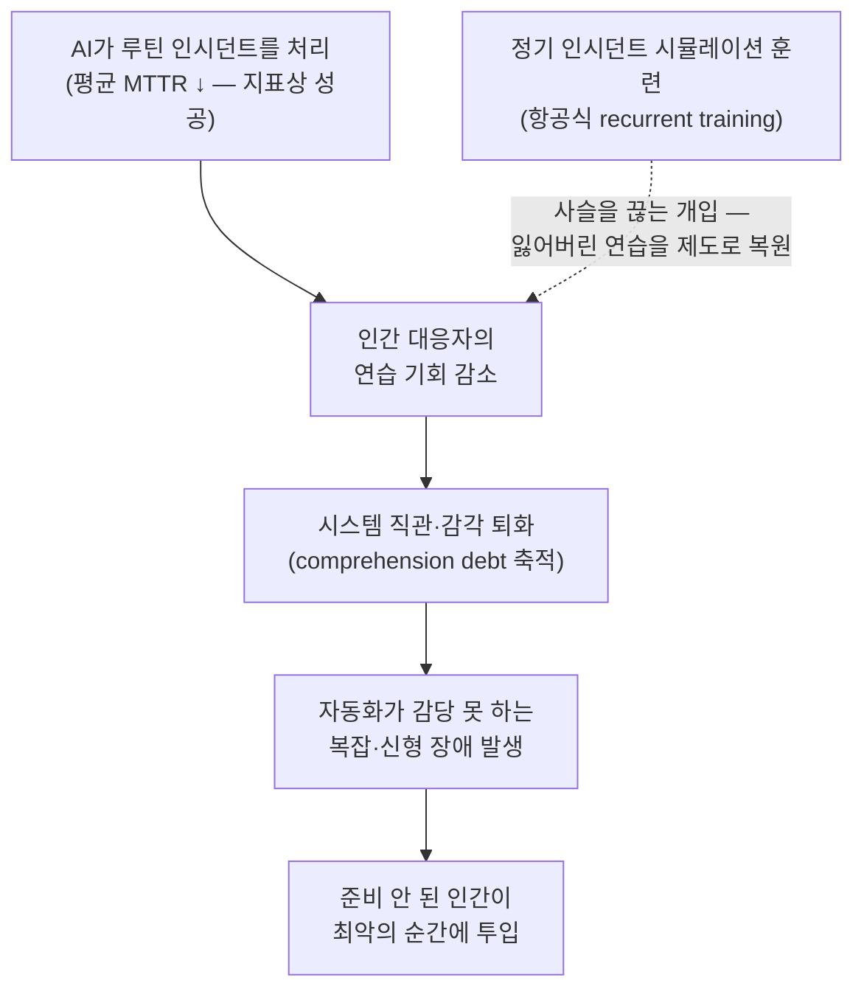

<figure class="post-figure post-figure--header">
<svg role="img" aria-label="왼쪽의 AI 방어 타워가 발밑으로 몰려오는 작은 루틴 장애들을 자동으로 요격하는 동안, 가운데 막사의 전사들은 잠들어 있고 세워 둔 무기에는 녹이 슬어 간다. 오른쪽 지평선에는 타워가 감당하지 못할 거대한 폭풍 — 신형 장애 — 이 번개를 품고 다가온다. 자동화가 성공할수록 인간은 실패의 순간에 덜 준비된다는 역설." viewBox="0 0 680 320" xmlns="http://www.w3.org/2000/svg">
  <title>자동화의 아이러니 — AI 타워가 루틴 장애를 막는 동안 전사의 무기는 녹슬고, 지평선엔 타워가 감당 못 할 폭풍이 온다</title>
  <defs>
    <marker id="ir-head" markerWidth="9" markerHeight="9" refX="7" refY="3" orient="auto">
      <path d="M0 0 L7 3 L0 6 z" fill="currentColor"/>
    </marker>
  </defs>

  <!-- ground line -->
  <line x1="24" y1="272" x2="656" y2="272" stroke="currentColor" stroke-width="2" opacity="0.5"/>

  <!-- ===== LEFT: AI 방어 타워 ===== -->
  <rect x="96" y="120" width="64" height="152" fill="var(--bg-light)" stroke="currentColor" stroke-width="2"/>
  <rect x="98" y="108" width="12" height="14" fill="var(--bg-light)" stroke="currentColor" stroke-width="1.6"/>
  <rect x="122" y="108" width="12" height="14" fill="var(--bg-light)" stroke="currentColor" stroke-width="1.6"/>
  <rect x="146" y="108" width="12" height="14" fill="var(--bg-light)" stroke="currentColor" stroke-width="1.6"/>
  <line x1="128" y1="108" x2="128" y2="88" stroke="var(--secondary-color)" stroke-width="2"/>
  <circle cx="128" cy="84" r="5" fill="var(--secondary-color)"/>
  <circle cx="128" cy="84" r="11" fill="none" stroke="var(--secondary-color)" stroke-width="1.2" opacity="0.5"/>
  <text x="128" y="172" text-anchor="middle" font-size="18" fill="var(--secondary-color)" font-weight="700">AI</text>
  <text x="128" y="196" text-anchor="middle" font-size="9" fill="currentColor" opacity="0.65">자동 방어</text>

  <!-- routine incidents (small blobs) auto-deflected -->
  <line x1="98" y1="188" x2="48" y2="238" stroke="var(--secondary-color)" stroke-width="1.8" opacity="0.85"/>
  <line x1="98" y1="200" x2="66" y2="256" stroke="var(--secondary-color)" stroke-width="1.8" opacity="0.85"/>
  <circle cx="42" cy="246" r="9" fill="var(--bg-panel)" stroke="currentColor" stroke-width="1.6"/>
  <text x="42" y="250" text-anchor="middle" font-size="9" fill="currentColor" font-weight="700">!</text>
  <line x1="32" y1="236" x2="52" y2="256" stroke="var(--secondary-color)" stroke-width="1.6"/>
  <line x1="52" y1="236" x2="32" y2="256" stroke="var(--secondary-color)" stroke-width="1.6"/>
  <circle cx="70" cy="262" r="7" fill="var(--bg-panel)" stroke="currentColor" stroke-width="1.6"/>
  <text x="70" y="266" text-anchor="middle" font-size="8" fill="currentColor" font-weight="700">!</text>
  <line x1="62" y1="254" x2="78" y2="270" stroke="var(--secondary-color)" stroke-width="1.4"/>
  <line x1="78" y1="254" x2="62" y2="270" stroke="var(--secondary-color)" stroke-width="1.4"/>
  <text x="56" y="222" text-anchor="middle" font-size="9.5" fill="currentColor" opacity="0.6" font-weight="700">루틴 장애</text>
  <text x="128" y="292" text-anchor="middle" font-size="10" fill="var(--secondary-color)" font-weight="700">AI 방어 타워 · 자동 요격</text>

  <!-- ===== CENTER: 잠든 막사 + 녹스는 무기 ===== -->
  <polygon points="242,202 315,160 388,202" fill="var(--bg-panel)" stroke="currentColor" stroke-width="2"/>
  <rect x="250" y="202" width="130" height="70" fill="var(--bg-light)" stroke="currentColor" stroke-width="2"/>
  <rect x="300" y="234" width="30" height="38" fill="var(--bg-sunken)" stroke="currentColor" stroke-width="1.4"/>
  <text x="336" y="152" font-size="13" fill="currentColor" opacity="0.55" font-weight="700">Z</text>
  <text x="350" y="140" font-size="11" fill="currentColor" opacity="0.45" font-weight="700">z</text>
  <text x="361" y="130" font-size="9" fill="currentColor" opacity="0.35" font-weight="700">z</text>
  <!-- weapon rack: leaning axe + sword, rust dots -->
  <line x1="412" y1="272" x2="430" y2="200" stroke="currentColor" stroke-width="3"/>
  <polygon points="422,192 446,200 428,214" fill="var(--steel)" stroke="currentColor" stroke-width="1.2"/>
  <line x1="396" y1="272" x2="390" y2="214" stroke="currentColor" stroke-width="2.4"/>
  <line x1="382" y1="222" x2="399" y2="220" stroke="currentColor" stroke-width="2"/>
  <circle cx="432" cy="203" r="2.2" fill="var(--accent-color)" opacity="0.8"/>
  <circle cx="427" cy="209" r="1.8" fill="var(--accent-color)" opacity="0.7"/>
  <circle cx="424" cy="230" r="1.8" fill="var(--accent-color)" opacity="0.6"/>
  <circle cx="392" cy="236" r="1.8" fill="var(--accent-color)" opacity="0.7"/>
  <circle cx="418" cy="252" r="1.6" fill="var(--accent-color)" opacity="0.55"/>
  <text x="336" y="292" text-anchor="middle" font-size="10" fill="currentColor" opacity="0.75" font-weight="700">잠든 전사 · 녹스는 무기 (연습 기회 상실)</text>

  <!-- ===== RIGHT: 지평선의 거대한 폭풍 (신형 장애) ===== -->
  <circle cx="520" cy="112" r="32" fill="currentColor" opacity="0.14"/>
  <circle cx="566" cy="92" r="42" fill="currentColor" opacity="0.16"/>
  <circle cx="616" cy="110" r="36" fill="currentColor" opacity="0.14"/>
  <circle cx="568" cy="126" r="40" fill="currentColor" opacity="0.12"/>
  <circle cx="520" cy="112" r="32" fill="none" stroke="currentColor" stroke-width="1.6" opacity="0.6"/>
  <circle cx="566" cy="92" r="42" fill="none" stroke="currentColor" stroke-width="1.6" opacity="0.6"/>
  <circle cx="616" cy="110" r="36" fill="none" stroke="currentColor" stroke-width="1.6" opacity="0.6"/>
  <polyline points="556,146 542,182 556,178 538,222" fill="none" stroke="var(--accent-color)" stroke-width="3.5"/>
  <polyline points="608,150 598,178 608,175 596,206" fill="none" stroke="var(--accent-color)" stroke-width="2.5" opacity="0.85"/>
  <text x="572" y="38" text-anchor="middle" font-size="11" fill="var(--accent-color)" font-weight="700">신형 장애 · 다가오는 폭풍</text>
  <!-- approach beyond the tower's reach -->
  <line x1="496" y1="160" x2="446" y2="188" stroke="currentColor" stroke-width="1.6" stroke-dasharray="5 4" opacity="0.7" marker-end="url(#ir-head)"/>
  <text x="484" y="206" text-anchor="middle" font-size="9" fill="currentColor" opacity="0.6">자동화의 사거리 밖</text>
</svg>
<figcaption>자동화의 아이러니 — AI 타워가 루틴 장애를 자동 요격하는 동안 전사들은 잠들고 무기는 녹슨다. 지평선엔 타워가 감당 못 할 폭풍(신형 장애)이 다가온다.</figcaption>
</figure>

## 원문 정보

> - **제목**: AI handles incidents, engineers lose touch with their systems
> - **출처**: Sylvain Kalache (sylvainkalache.com)
> - **발행**: 2026-09-04 · 약 6분 분량
> - **원문 링크**: [https://www.sylvainkalache.com/blog/ai-handles-incidents-engineers-lose-touch-with-their-systems](https://www.sylvainkalache.com/blog/ai-handles-incidents-engineers-lose-touch-with-their-systems)

AI 시대의 탈숙련(deskilling) 논의를 **인시던트 대응(incident response)**이라는 구체적 영역으로 좁혀, 항공 산업의 훈련 체계에서 실천적 해법까지 끌어낸 글이라 Articles에 담는다.

## 한 줄 요약 (TL;DR)

AI 인시던트 대응 도구가 루틴한 장애를 잘 처리할수록 인간 엔지니어는 시스템 감각을 기를 연습 기회를 잃는다 — 그래서 정작 자동화가 감당 못 하는 복잡하고 새로운 장애가 터졌을 때 가장 준비되지 않은 상태가 된다. 해법은 항공 산업처럼 **정기적인 인시던트 시뮬레이션 훈련**을 on-call 준비 태세의 일부로 만드는 것이다.

## 왜 이 글을 골랐나

"AI가 실력을 망치는가"라는 논의는 이 위키에서도 여러 번 다뤘다. [Nature의 탈숙련 기사 분석](/2026/06/23/is-ai-ruining-our-skills.html)이 의사·개발자의 실력 저하를 **데이터로** 보여줬다면, 이 글은 같은 문제를 **운영(operations)이라는 가장 위험한 영역**에서 짚는다. 코드 리뷰 실력이 무뎌지는 것과 새벽 3시 SEV0 대응 실력이 무뎌지는 것은 결과의 무게가 다르다.

글의 척추가 되는 인과 사슬과, 그 사슬을 끊는 개입 지점을 한 장으로 요약하면 이렇다.

특히 이 글이 좋은 점은 1983년 Lisanne Bainbridge의 고전 "Ironies of Automation"이라는 이론적 틀과, 항공 산업이라는 **이미 이 문제를 40년 겪고 해법을 제도화한 산업**의 사례를 함께 가져온다는 것이다. 문제 제기에서 멈추지 않고 "그래서 무엇을 하라"까지 간다.

## 핵심 내용

### 자동화는 가장 어려운 인시던트만 인간에게 남긴다

저자의 출발점은 단순한 관찰이다.

> "The better these tools become at resolving routine incidents, the less practice human responders will get."
> (이 도구들이 루틴한 인시던트를 잘 해결할수록, 인간 대응자가 얻는 연습 기회는 줄어든다.)

루틴한 인시던트는 사실 **안전한 학습 환경**이다. 위험 부담이 크지 않은 장애를 반복해서 다루면서 엔지니어는 시스템에 대한 직관을 쌓는다. 그런데 AI가 그 루틴한 일을 가져가면, 인간에게는 **비정상적이고 새로운 상황에 대한 책임만** 남는다. 저자는 이것이 새로운 문제가 아니라며 Lisanne Bainbridge가 1983년에 정식화한 "Ironies of Automation"을 인용한다.

> "Automation reduces operators' opportunities to practice routine work while leaving them responsible for new and abnormal situations."
> (자동화는 운영자가 루틴한 작업을 연습할 기회를 줄이면서도, 새롭고 비정상적인 상황에 대한 책임은 그대로 남긴다.)

여기서 저자는 구체적인 예측을 하나 내놓는다. **평균 MTTR은 내려가겠지만, 복잡한 인시던트의 해결 시간은 오히려 늘어날 것**이라는 예측이다. 지표상으로는 개선처럼 보이는 그래프 아래에서 조직의 실전 대응력은 조용히 침식된다.

### 항공 산업은 '드문 실패'를 위해 조종사를 훈련시킨다

<figure class="post-figure">
<svg role="img" aria-label="왼쪽 패널은 자동조종장치가 순항을 담당하는 조종석 — 파일럿은 지켜볼 뿐이고, 실전에서 엔진 정지를 겪을 확률은 10만 비행시간당 1회 미만이다. 오른쪽 패널은 시뮬레이터 — 엔진 화재와 실속 경보 앞에서 파일럿이 조종간을 붙잡고 훈련한다. FAA는 이 드문 실패를 위해 6개월마다 반복 시뮬레이터 훈련을 의무화한다. 극히 드문 실패를 위해 정기 훈련을 강제하는 비대칭이 핵심이다." viewBox="0 0 680 300" xmlns="http://www.w3.org/2000/svg">
  <title>항공 유비 — 자동조종 조종석(루틴은 기계가) vs 시뮬레이터 훈련(드문 실패는 인간이 연습한다)</title>

  <!-- ===== LEFT: 조종석 · 자동조종 ===== -->
  <text x="172" y="42" text-anchor="middle" font-size="11" fill="currentColor" font-weight="700" opacity="0.85">조종석 — 자동조종이 순항을 담당</text>
  <rect x="32" y="54" width="280" height="182" fill="var(--bg-light)" stroke="currentColor" stroke-width="2"/>
  <!-- windshield: calm cruise -->
  <rect x="52" y="72" width="240" height="62" fill="var(--bg-panel)" stroke="currentColor" stroke-width="1.6"/>
  <line x1="52" y1="104" x2="292" y2="104" stroke="currentColor" stroke-width="1.2" opacity="0.5"/>
  <circle cx="92" cy="90" r="8" fill="none" stroke="currentColor" stroke-width="1.2" opacity="0.45"/>
  <ellipse cx="238" cy="94" rx="16" ry="6" fill="none" stroke="currentColor" stroke-width="1.2" opacity="0.4"/>
  <ellipse cx="160" cy="118" rx="14" ry="5" fill="none" stroke="currentColor" stroke-width="1.2" opacity="0.35"/>
  <!-- autopilot indicator -->
  <rect x="52" y="146" width="122" height="24" fill="none" stroke="var(--secondary-color)" stroke-width="1.8"/>
  <text x="113" y="162" text-anchor="middle" font-size="10" fill="var(--secondary-color)" font-weight="700">AUTOPILOT ON</text>
  <!-- idle pilot, arms folded -->
  <circle cx="238" cy="164" r="10" fill="var(--bg-panel)" stroke="currentColor" stroke-width="1.8"/>
  <line x1="238" y1="174" x2="238" y2="198" stroke="currentColor" stroke-width="2.2"/>
  <line x1="226" y1="186" x2="250" y2="186" stroke="currentColor" stroke-width="2"/>
  <text x="260" y="158" font-size="10" fill="currentColor" opacity="0.5">···</text>
  <text x="172" y="222" text-anchor="middle" font-size="10" fill="currentColor" opacity="0.75">엔진 정지: 10만 비행시간당 1회 미만</text>
  <text x="172" y="256" text-anchor="middle" font-size="9.5" fill="currentColor" opacity="0.6">실전은 루틴뿐 — 드문 실패를 겪을 기회가 없다</text>

  <!-- vs -->
  <text x="340" y="152" text-anchor="middle" font-size="15" fill="currentColor" font-weight="700" opacity="0.65">vs</text>

  <!-- ===== RIGHT: 시뮬레이터 · 훈련 ===== -->
  <text x="508" y="42" text-anchor="middle" font-size="11" fill="var(--accent-color)" font-weight="700">시뮬레이터 — 드문 실패를 반복 훈련</text>
  <rect x="368" y="54" width="280" height="182" fill="var(--bg-light)" stroke="var(--accent-color)" stroke-width="2.2"/>
  <!-- simulator screen: alarms -->
  <rect x="388" y="72" width="240" height="62" fill="var(--bg-panel)" stroke="currentColor" stroke-width="1.6"/>
  <text x="466" y="98" text-anchor="middle" font-size="12" fill="var(--accent-color)" font-weight="700">⚠ ENGINE FIRE</text>
  <text x="466" y="120" text-anchor="middle" font-size="10" fill="var(--accent-color)" font-weight="700" opacity="0.85">STALL · STALL</text>
  <!-- flame icon -->
  <polygon points="588,120 582,104 590,108 588,92 600,106 596,110 604,112 594,126" fill="var(--accent-color)" opacity="0.85"/>
  <!-- active pilot, hands on controls -->
  <circle cx="574" cy="164" r="10" fill="var(--bg-panel)" stroke="currentColor" stroke-width="1.8"/>
  <line x1="574" y1="174" x2="574" y2="198" stroke="currentColor" stroke-width="2.2"/>
  <line x1="574" y1="180" x2="548" y2="168" stroke="currentColor" stroke-width="2"/>
  <line x1="574" y1="182" x2="552" y2="192" stroke="currentColor" stroke-width="2"/>
  <line x1="540" y1="196" x2="548" y2="162" stroke="currentColor" stroke-width="2.6"/>
  <line x1="533" y1="163" x2="556" y2="167" stroke="currentColor" stroke-width="2.2"/>
  <line x1="590" y1="150" x2="596" y2="144" stroke="currentColor" stroke-width="1.4" opacity="0.5"/>
  <line x1="596" y1="158" x2="604" y2="154" stroke="currentColor" stroke-width="1.4" opacity="0.5"/>
  <text x="508" y="222" text-anchor="middle" font-size="10" fill="currentColor" opacity="0.85" font-weight="700">FAA 의무: 6개월마다 반복 시뮬레이터 훈련</text>
  <text x="508" y="256" text-anchor="middle" font-size="9.5" fill="currentColor" opacity="0.6">실전이 주지 않는 실패를, 훈련이 정기적으로 겪게 한다</text>

  <!-- asymmetry crux -->
  <text x="340" y="288" text-anchor="middle" font-size="10.5" fill="var(--secondary-color)" font-weight="700">비대칭 — 10만 시간당 1회 미만의 실패를 위해, 6개월마다 훈련을 강제한다</text>
</svg>
<figcaption>항공 유비 — 자동조종이 루틴(순항)을 맡는 조종석과, 엔진 화재·실속 같은 드문 실패를 반복 훈련하는 시뮬레이터의 대비. 드문 실패일수록 훈련은 제도로 강제된다.</figcaption>
</figure>

소프트웨어보다 먼저 이 역설을 맞닥뜨린 산업이 항공이다. 자동조종이 루틴한 비행을 담당하고 조종사는 예외 상황을 관리한다. 현대 터빈 엔진의 비행 중 정지(shutdown)는 **10만 비행시간당 1회 미만** — 즉 조종사 대부분은 실전에서 엔진 정지를 평생 한 번도 겪지 않는다.

그 드문 순간이 왔을 때 무슨 일이 벌어지는가. 저자는 TransAsia Airways 235편 추락 사고를 든다. 승무원이 **고장 난 엔진을 잘못 식별**했고, 경고가 울린 지 **117초** 만에 추락했다. 항공 산업의 대응은 훈련의 제도화였다. FAA는 기장에게 **6개월마다** 반복 시뮬레이터 훈련(recurrent simulator training)을 요구한다. 실전에서 겪을 수 없는 실패를, 시뮬레이터에서 정기적으로 겪게 만드는 것이다.

### 소프트웨어 산업에도 인시던트 시뮬레이터가 필요하다

저자는 이 모델을 소프트웨어로 옮긴 사례로 Rootly와 Uptime Labs의 파트너십이 만든 인시던트 시뮬레이션을 소개한다. 시뮬레이션은 e-commerce 장애를 조사하고, LLM이 연기하는 이해관계자들과 조율하고, CEO와 고객 지원의 압박을 관리하는 것까지 포함한다. 이런 연습이 기르는 것은 기술 지식만이 아니다 — **불완전한 정보 아래서의 의사결정, 명확한 커뮤니케이션, 조율, 대응 관리** 같은, 실제 인시던트에서 가장 무너지기 쉬운 능력들이다.

### AI의 설명은 실전 연습을 대체하지 못한다

AI가 조사 단계와 진단 근거를 설명해 주면 학습에 도움이 되지 않을까? 저자는 도움은 되지만 대체는 안 된다고 선을 긋는다.

> "You might pick up a few things from watching Serena Williams play, but you only learn tennis by getting on the court."
> (Serena Williams의 경기를 보면서 몇 가지 배울 수는 있지만, 테니스는 코트에 서야만 배운다.)

저자는 Holberton School에서의 경험도 근거로 든다. 학생들에게 필요했던 것은 잘 돌아가는 시스템의 관찰이 아니라 **직접 고쳐야 하는 망가진 인프라 프로젝트**였다.

### 인시던트 시뮬레이션을 on-call 준비 태세의 일부로

글의 결론은 제도화 요구다. 시스템이 실제로 하는 일과 대응자가 이해하는 것 사이의 간극 — 저자는 이를 **"comprehension debt"(이해 부채)**라 부른다 — 는 방치하면 계속 쌓인다. 저자의 정기 훈련 권고는 네 가지다: 시스템을 직접 만지는 hands-on 상호작용, 낯선 실패 유형의 처리, 압박 상황에서의 연습, 그리고 SEV0 조율의 리허설. 이는 Bainbridge가 40여 년 전에 내린 처방 — 스킬 퇴화를 막으려면 정기적인 수동 제어와 시뮬레이션이 필요하다 — 과 정확히 같은 결론이다.

> "The more successful it becomes, the less prepared humans may be for the moment it fails."
> (자동화가 성공할수록, 인간은 그것이 실패하는 순간에 대해 덜 준비된 상태가 된다.)

## 분석과 인사이트

### 'MTTR 개선'이라는 착시를 경계하라

이 글에서 가장 실무적으로 날카로운 대목은 **평균 MTTR은 내려가고 복잡한 인시던트의 해결 시간은 올라간다**는 예측이라고 본다. 평균 지표만 보는 경영진에게 AI 인시던트 도구 도입은 순수한 성공으로 보고될 것이다. 하지만 분포의 꼬리 — 자동화가 못 푸는 상위 5%의 장애 — 가 길어지고 있다면, 조직은 겉으로 건강해 보이면서 속으로 취약해지는 중이다. 대시보드에 **p95/p99 해결 시간과 '인간이 개입한 인시던트'의 별도 추적**이 없다면 이 침식은 보이지 않는다.

### 'comprehension debt'는 부채 계보의 운영 버전이다

이 위키에서 다뤄 온 부채 개념들과 정확히 이어진다. [하용호의 발표](/2026/06/22/ai-era-expertise-redesign.html)가 말한 기술·인지·의도 3대 부채, [Fowler의 fragment](/2026/06/23/fowler-fragments-verification-cognitive-surrender.html)가 말한 '인지적 항복'이 **코드를 만드는 쪽**의 부채라면, comprehension debt는 **시스템을 지키는 쪽**의 부채다. 코드는 AI가 짜 주고 장애도 AI가 막아 주는 시스템에서, "이 시스템이 실제로 어떻게 동작하는지 아는 사람"은 채용 공고에도 온보딩 문서에도 없는 채로 사라져 간다. 그리고 이 부채는 다른 부채와 달리 **상환 요구가 새벽 3시에, 이자까지 붙어서** 온다.

### 항공 유비의 힘과 한계

항공 유비는 설득력 있지만 한 가지 중요한 차이가 있다. 항공기는 기종이 표준화되어 있어 시뮬레이터가 실기와 거의 같지만, 소프트웨어 시스템은 회사마다, 심지어 팀마다 다르다. 범용 인시던트 시뮬레이션은 커뮤니케이션·조율·압박 대응 같은 **이전 가능한 스킬**은 잘 길러 주겠지만, "우리 시스템의 어디가 어떻게 무너지는지"라는 **시스템 특수적 직관**은 결국 자기 인프라 위에서의 game day / chaos engineering으로만 길러진다. 둘은 보완재이지 대체재가 아니다. 또 하나, 이 글이 소개하는 시뮬레이션 사례는 특정 벤더(Rootly, Uptime Labs)의 파트너십이라는 점은 읽을 때 감안할 부분이다 — 다만 도구가 무엇이든 "정기 시뮬레이션을 on-call 요건으로"라는 처방 자체의 타당성은 별개로 성립한다.

### 이 글이 멈춘 곳: 유인 구조

글이 다루지 않은 질문이 하나 있다. 훈련의 필요성은 알겠는데, **누가 그 시간을 지불하는가?** FAA의 6개월 훈련은 규제이기 때문에 지켜진다. 소프트웨어에는 그런 규제가 없고, 분기 로드맵 압박 아래서 시뮬레이션 훈련은 언제나 "다음 스프린트에"로 밀리기 가장 쉬운 항목이다. 결국 이것은 [Nature 기사](/2026/06/23/is-ai-ruining-our-skills.html)의 결론과 만난다 — 탈숙련은 개인의 의지 문제가 아니라 **조직 설계의 문제**이고, 훈련이 제도(on-call 로테이션의 요건, 승격 기준, SLA)에 박혀 있지 않으면 일어나지 않는다.

## 적용 포인트

- **인시던트 지표를 분해하라.** 평균 MTTR만 보지 말고 p95/p99, 그리고 "AI가 자동 해결한 것"과 "인간이 개입한 것"을 분리 추적하라. 복잡 인시던트의 해결 시간이 늘고 있다면 comprehension debt가 쌓이는 신호다.
- **on-call 투입 전 시뮬레이션을 요건으로 만들어라.** 새 on-call 멤버는 실전 투입 전에 최소 한 번의 모의 인시던트(game day)를 거치게 하고, 기존 멤버도 항공식으로 **주기적 리허설**을 돌려라.
- **AI가 해결한 인시던트도 사람이 리플레이하라.** AI가 자동 해결한 장애 중 매달 몇 건을 골라, 대응자가 AI의 조사 경로를 따라가며 "내가 처음부터 풀었다면"을 복기하는 시간을 갖는다. 관찰만으로는 부족하지만, 복기는 감각 유지의 최소 비용 수단이다.
- **SEV0 조율을 따로 연습하라.** 기술적 디버깅보다 먼저 무너지는 것은 커뮤니케이션이다. 이해관계자 압박·상황 공유·역할 분담을 포함한 리허설을 하라.
- **낯선 실패를 일부러 만들어라.** 잘 아는 장애의 반복이 아니라, chaos engineering으로 팀이 처음 보는 유형의 실패를 주입해 "불완전한 정보 아래서의 의사결정"을 훈련하라.

## 마무리

이 글의 핵심 문장은 마지막 인용 하나로 요약된다 — 자동화는 성공할수록 인간을 실패의 순간에 덜 준비된 상태로 만든다. Bainbridge가 1983년에 산업 제어 시스템을 보며 쓴 이 역설은, AI 인시던트 대응 도구의 시대에 소프트웨어 운영의 문제로 그대로 돌아왔다. 답도 40년 전과 같다: 실전이 연습 기회를 주지 않는다면, 연습을 제도로 만들어야 한다. 항공 산업은 그것을 규제로 강제해서 해냈고, 소프트웨어 산업은 아직 각 조직의 선택에 맡겨져 있다. AI 도구를 도입하는 결재는 쉽게 나지만, 그 도구가 앗아 가는 연습 기회를 보상하는 훈련의 결재는 잘 나지 않는다 — 이 비대칭을 인식하는 것이 첫걸음이다.

### 더 읽어보기

- [원문 — AI handles incidents, engineers lose touch with their systems](https://www.sylvainkalache.com/blog/ai-handles-incidents-engineers-lose-touch-with-their-systems)
- [AI가 우리의 실력을 망치고 있는가: Nature의 탈숙련 기사](/2026/06/23/is-ai-ruining-our-skills.html) — 같은 탈숙련 문제를 의사·개발자 데이터로 보여주는 짝 글
- [LLM이 써 줄 인시던트 리포트의 미래가 두렵다](/2026/06/19/llm-written-incident-report-future.html) — 인시던트의 '쓰기' 쪽에서 같은 우려를 다룬 Lorin Hochstein의 글
- [코딩이 공짜가 되면 무엇이 비싸지는가 — Fowler의 Fragments](/2026/06/23/fowler-fragments-verification-cognitive-surrender.html) — '인지적 항복'이라는 개념으로 본 같은 역설
- [AI 시대, 나의 전문성을 재설계하는 법 (하용호)](/2026/06/22/ai-era-expertise-redesign.html) — 기술·인지·의도 부채와 '운영 책임자로의 전환'이라는 처방
