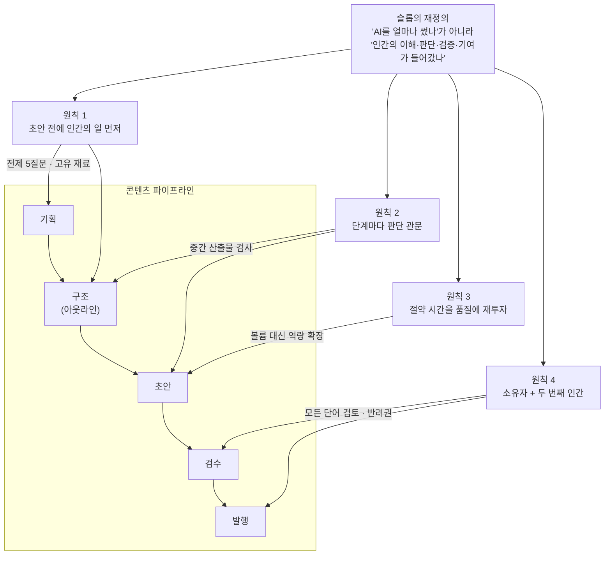

<figure class="post-figure post-figure--header">
<svg role="img" aria-label="AI가 뽑아낸 글 초안들이 컨베이어 벨트를 타고 세 개의 관문을 통과한다. 관문마다 인간 검수자가 서서 도장을 찍고, 관문을 지날 때마다 초안에 판단 도장이 하나씩 늘어난다. 벨트 끝에는 소유자의 이름표가 붙은 완성본 하나가 있다. 반면 벨트 초입에서 관문 없이 아래로 빠져나간 초안들은 잿빛 슬롭 더미로 쌓인다." viewBox="0 0 680 370" xmlns="http://www.w3.org/2000/svg">
  <title>관문마다 인간이 도장을 찍는 AI 초안 컨베이어 vs 관문 없이 쏟아지는 슬롭 더미</title>

  <text x="300" y="24" text-anchor="middle" font-size="11" fill="currentColor" font-weight="700" opacity="0.8">모든 글에 AI — 그러나 관문마다 인간의 판단</text>

  <!-- ===== 컨베이어 벨트 ===== -->
  <line x1="24" y1="196" x2="545" y2="196" stroke="currentColor" stroke-width="2.5"/>
  <circle cx="50" cy="208" r="7" fill="var(--bg-light)" stroke="currentColor" stroke-width="1.6"/>
  <circle cx="120" cy="208" r="7" fill="var(--bg-light)" stroke="currentColor" stroke-width="1.6"/>
  <circle cx="190" cy="208" r="7" fill="var(--bg-light)" stroke="currentColor" stroke-width="1.6"/>
  <circle cx="260" cy="208" r="7" fill="var(--bg-light)" stroke="currentColor" stroke-width="1.6"/>
  <circle cx="330" cy="208" r="7" fill="var(--bg-light)" stroke="currentColor" stroke-width="1.6"/>
  <circle cx="400" cy="208" r="7" fill="var(--bg-light)" stroke="currentColor" stroke-width="1.6"/>
  <circle cx="470" cy="208" r="7" fill="var(--bg-light)" stroke="currentColor" stroke-width="1.6"/>
  <circle cx="530" cy="208" r="7" fill="var(--bg-light)" stroke="currentColor" stroke-width="1.6"/>

  <!-- AI 초안 (벨트 초입) -->
  <rect x="40" y="148" width="36" height="48" fill="var(--bg-light)" stroke="currentColor" stroke-width="1.6"/>
  <line x1="46" y1="158" x2="70" y2="158" stroke="currentColor" stroke-width="1.2" opacity="0.5"/>
  <line x1="46" y1="166" x2="70" y2="166" stroke="currentColor" stroke-width="1.2" opacity="0.5"/>
  <line x1="46" y1="174" x2="64" y2="174" stroke="currentColor" stroke-width="1.2" opacity="0.5"/>
  <text x="58" y="140" text-anchor="middle" font-size="9.5" fill="currentColor" opacity="0.7">AI 초안</text>

  <!-- 관문 1 (아이디어) -->
  <rect x="140" y="96" width="6" height="100" fill="currentColor" opacity="0.85"/>
  <rect x="174" y="96" width="6" height="100" fill="currentColor" opacity="0.85"/>
  <rect x="140" y="88" width="40" height="8" fill="currentColor" opacity="0.85"/>
  <circle cx="160" cy="50" r="9" fill="var(--bg-light)" stroke="currentColor" stroke-width="2"/>
  <path d="M 146 76 Q 160 58 174 76" fill="none" stroke="currentColor" stroke-width="2"/>
  <rect x="174" y="58" width="10" height="14" rx="2" fill="var(--accent-color)"/>
  <text x="160" y="122" text-anchor="middle" font-size="8.5" fill="currentColor" opacity="0.65">관문 ①</text>
  <text x="160" y="240" text-anchor="middle" font-size="9" fill="currentColor" opacity="0.7">아이디어</text>

  <!-- 초안 + 도장 1개 -->
  <rect x="216" y="148" width="36" height="48" fill="var(--bg-light)" stroke="currentColor" stroke-width="1.6"/>
  <line x1="222" y1="160" x2="246" y2="160" stroke="currentColor" stroke-width="1.2" opacity="0.5"/>
  <line x1="222" y1="168" x2="246" y2="168" stroke="currentColor" stroke-width="1.2" opacity="0.5"/>
  <rect x="238" y="180" width="10" height="10" fill="var(--accent-color)"/>

  <!-- 관문 2 (근거) -->
  <rect x="280" y="96" width="6" height="100" fill="currentColor" opacity="0.85"/>
  <rect x="314" y="96" width="6" height="100" fill="currentColor" opacity="0.85"/>
  <rect x="280" y="88" width="40" height="8" fill="currentColor" opacity="0.85"/>
  <circle cx="300" cy="50" r="9" fill="var(--bg-light)" stroke="currentColor" stroke-width="2"/>
  <path d="M 286 76 Q 300 58 314 76" fill="none" stroke="currentColor" stroke-width="2"/>
  <rect x="314" y="58" width="10" height="14" rx="2" fill="var(--accent-color)"/>
  <text x="300" y="122" text-anchor="middle" font-size="8.5" fill="currentColor" opacity="0.65">관문 ②</text>
  <text x="300" y="240" text-anchor="middle" font-size="9" fill="currentColor" opacity="0.7">근거</text>

  <!-- 초안 + 도장 2개 -->
  <rect x="356" y="148" width="36" height="48" fill="var(--bg-light)" stroke="currentColor" stroke-width="1.6"/>
  <line x1="362" y1="160" x2="386" y2="160" stroke="currentColor" stroke-width="1.2" opacity="0.5"/>
  <line x1="362" y1="168" x2="386" y2="168" stroke="currentColor" stroke-width="1.2" opacity="0.5"/>
  <rect x="362" y="180" width="10" height="10" fill="var(--accent-color)"/>
  <rect x="378" y="180" width="10" height="10" fill="var(--accent-color)"/>

  <!-- 관문 3 (초안 검수) -->
  <rect x="420" y="96" width="6" height="100" fill="currentColor" opacity="0.85"/>
  <rect x="454" y="96" width="6" height="100" fill="currentColor" opacity="0.85"/>
  <rect x="420" y="88" width="40" height="8" fill="currentColor" opacity="0.85"/>
  <circle cx="440" cy="50" r="9" fill="var(--bg-light)" stroke="currentColor" stroke-width="2"/>
  <path d="M 426 76 Q 440 58 454 76" fill="none" stroke="currentColor" stroke-width="2"/>
  <rect x="454" y="58" width="10" height="14" rx="2" fill="var(--accent-color)"/>
  <text x="440" y="122" text-anchor="middle" font-size="8.5" fill="currentColor" opacity="0.65">관문 ③</text>
  <text x="440" y="240" text-anchor="middle" font-size="9" fill="currentColor" opacity="0.7">초안 검수</text>

  <!-- 완성본: 이름표 + 승인 -->
  <text x="586" y="100" text-anchor="middle" font-size="9.5" fill="currentColor" opacity="0.7">완성본 · 하나</text>
  <rect x="560" y="112" width="52" height="76" fill="var(--bg-panel)" stroke="currentColor" stroke-width="2"/>
  <line x1="568" y1="126" x2="604" y2="126" stroke="currentColor" stroke-width="1.4" opacity="0.6"/>
  <line x1="568" y1="136" x2="604" y2="136" stroke="currentColor" stroke-width="1.4" opacity="0.6"/>
  <line x1="568" y1="146" x2="596" y2="146" stroke="currentColor" stroke-width="1.4" opacity="0.6"/>
  <rect x="566" y="158" width="10" height="10" fill="var(--accent-color)"/>
  <rect x="580" y="158" width="10" height="10" fill="var(--accent-color)"/>
  <rect x="594" y="158" width="10" height="10" fill="var(--accent-color)"/>
  <circle cx="606" cy="112" r="12" fill="none" stroke="var(--secondary-color)" stroke-width="2.4"/>
  <polyline points="600,112 604,117 613,106" fill="none" stroke="var(--secondary-color)" stroke-width="2.4"/>
  <rect x="554" y="196" width="64" height="18" rx="2" fill="var(--gold)"/>
  <text x="586" y="209" text-anchor="middle" font-size="9" fill="var(--bg-panel)" font-weight="700">소유자의 이름</text>
  <text x="586" y="234" text-anchor="middle" font-size="8.5" fill="currentColor" opacity="0.65">두 번째 인간까지 통과</text>

  <!-- ===== 관문 없는 경로: 슬롭 더미 ===== -->
  <path d="M 58 212 C 70 268, 120 300, 188 312" fill="none" stroke="currentColor" stroke-width="1.6" stroke-dasharray="5 5" opacity="0.5"/>
  <polygon points="188,312 176,304 178,316" fill="currentColor" opacity="0.5"/>
  <text x="96" y="262" text-anchor="middle" font-size="9.5" fill="currentColor" opacity="0.65">관문 없음 · 검증 생략</text>

  <rect x="216" y="292" width="34" height="44" fill="currentColor" fill-opacity="0.12" stroke="currentColor" stroke-width="1.2" stroke-opacity="0.3" transform="rotate(-14 233 314)"/>
  <rect x="248" y="300" width="34" height="44" fill="currentColor" fill-opacity="0.12" stroke="currentColor" stroke-width="1.2" stroke-opacity="0.3" transform="rotate(9 265 322)"/>
  <rect x="282" y="288" width="34" height="44" fill="currentColor" fill-opacity="0.12" stroke="currentColor" stroke-width="1.2" stroke-opacity="0.3" transform="rotate(-6 299 310)"/>
  <rect x="314" y="302" width="34" height="44" fill="currentColor" fill-opacity="0.12" stroke="currentColor" stroke-width="1.2" stroke-opacity="0.3" transform="rotate(15 331 324)"/>
  <rect x="346" y="292" width="34" height="44" fill="currentColor" fill-opacity="0.12" stroke="currentColor" stroke-width="1.2" stroke-opacity="0.3" transform="rotate(-11 363 314)"/>
  <rect x="378" y="304" width="34" height="44" fill="currentColor" fill-opacity="0.12" stroke="currentColor" stroke-width="1.2" stroke-opacity="0.3" transform="rotate(7 395 326)"/>
  <text x="310" y="364" text-anchor="middle" font-size="10" fill="currentColor" opacity="0.65">잿빛 슬롭 더미 — 아낀 노력은 독자에게 전가된다</text>
</svg>
<figcaption>같은 AI 초안이라도 관문마다 인간이 도장을 찍으면 이름표가 붙은 완성본 하나가 되고, 관문 없이 쏟아지면 잿빛 슬롭 더미가 된다. 슬롭 여부를 가르는 것은 AI 사용량이 아니라 인간의 판단이 들어갈 자리다.</figcaption>
</figure>

## 원문 정보

> - **제목**: How We Use AI for Every Article Without Making AI Slop
> - **출처**: Si Quan Ong, Ahrefs Blog ([ahrefs.com](https://ahrefs.com/blog/))
> - **발행**: 2026-08-28 · 약 9분 분량
> - **원문 링크**: <https://ahrefs.com/blog/how-we-use-ai-without-making-ai-slop/>

SEO 도구 회사 Ahrefs가 자사 블로그의 **모든 글에 AI를 쓰면서도** 품질을 지키는 실제 운영 원칙을 공개한 글이다. "AI 슬롭" 담론이 대부분 비판에 머무는 가운데, 슬롭을 피하는 **구체적인 워크플로우**를 내부 사례로 보여 준다는 점에서 Articles에 담는다.

## 한 줄 요약 (TL;DR)

슬롭 여부를 가르는 것은 AI를 얼마나 썼느냐가 아니라 **인간의 이해·판단·검증·기여가 독자의 주의를 정당화할 만큼 들어갔느냐**다. Ahrefs는 이를 네 가지 원칙 — 초안 전에 인간의 일을 먼저 하기, 판단을 내릴 관문 만들기, 절약한 시간을 품질에 재투자하기, 모든 글에 소유자와 두 번째 인간 두기 — 으로 운영한다.

## 왜 이 글을 골랐나

"AI 슬롭"은 이제 콘텐츠만의 문제가 아니다. 코드, 문서, 인시던트 리포트, PR 설명 — 개발자가 만드는 거의 모든 산출물이 같은 질문 앞에 서 있다. [George Hotz의 'The Eternal Sloptember'](/2026/06/22/the-eternal-sloptember.html)가 "의도 없는 산출물"이라는 품질 위기를 고발했다면, 이 글은 그 반대편에서 **"그래서 어떻게 AI를 쓰면서 슬롭을 안 만드는가"**에 대한 운영 매뉴얼을 내놓는다.

특히 흥미로운 것은 이 글이 콘텐츠 마케팅 팀의 이야기이면서도, 그 처방이 코딩 에이전트를 쓰는 엔지니어링 워크플로우와 거의 일대일로 겹친다는 점이다. 게이트를 두고 중간 산출물을 검사하라는 원칙은 ["짧은 목줄" 방법](/2026/07/06/short-leash-ai-coding.html)과, "도장만 찍는 human in the loop는 의미가 없다"는 경고는 [자동화가 인간을 시스템에서 멀어지게 한다는 관찰](/2026/09/08/ai-incidents-engineers-lose-touch.html)과 정확히 공명한다.

글의 척추를 한 장으로 정리하면 이렇다 — 슬롭의 재정의에서 출발한 네 원칙이 콘텐츠 파이프라인의 각 단계에 꽂힌다.

## 핵심 내용

### 슬롭의 재정의: 노력의 전가

글의 출발점은 슬롭의 정의다.

> "AI slop is content published without enough human understanding, judgement, evidence, or original contribution to justify the reader's attention."

핵심 통찰은 **"슬롭은 노력을 만드는 쪽에서 읽는 쪽으로 전가한다(slop transfers effort from the creator to the reader)"**는 것이다. 검증, 분석, 고유한 기여를 건너뛰면 만드는 사람은 시간을 아끼지만, 그 비용은 독자 전원이 나눠 낸다 — "The creator saves time. Everyone else pays for it."

따라서 AI 사용량은 품질의 척도가 아니다. Ahrefs는 리서치·아웃라인·초안·팩트체크를 자동화하는 자체 파이프라인(Letaido, 글당 6~12분)과 12개 데이터셋을 매달 갱신하는 Data Refresh Hub까지 운영하면서도, 인간의 책임이 들어가는 지점을 워크플로우에 명시적으로 박아 둔다.

### 원칙 1 — 초안 전에 인간의 일을 먼저 하라

가장 중요한 사고는 초안 이전, 상류(upstream)에서 일어난다. 무엇을 다룰 가치가 있는지, 어떻게 구조화할지, 무엇이 고유한 기여인지는 인간이 정한다. Ahrefs는 글을 시작하기 전에 다섯 가지 질문으로 대략의 전제(premise)를 세운다.

- **독자(Reader)**: 누구이며 무엇을 이루려 하는가
- **약속(Promise)**: 이 글을 읽고 무엇을 이해/달성해야 하는가
- **관점(Point of view)**: 나의 입장은 무엇이고, 어디서 반론이 나올 수 있는가
- **근거(Evidence)**: 어떤 주장에 출처가 필요한가
- **정보 이득(Information gain)**: 기존 검색 결과 대비 무엇이 새로운가

그리고 AI에게는 인터넷의 평균이 아니라 **자기만의 재료**를 먹인다. 사실·통계·제품 세부를 모아 둔 "Source of Truth" 지식 베이스, 불확실함과 단서·반쯤 형성된 생각까지 그대로 담는 음성 구술(Wispr Flow), 아웃라인 전에 작성자의 빈틈을 찾아내는 AI 인터뷰 같은 방식이다.

### 원칙 2 — 멈춰서 판단을 내릴 자리를 만들어라

워크플로우를 단계로 쪼개고 단계마다 **결정 관문(decision gate)**을 둔다. Ahrefs 콘텐츠 디렉터 Ryan Law의 워크플로우는 네 개의 관문으로 되어 있다.

- **아이디어 게이트**: 기존 검색 결과 너머의 기여가 있는지 검증
- **아웃라인 게이트**: 각 섹션이 독자와 글의 약속에 봉사하는지 확인
- **근거 게이트**: 중요한 주장을 실제로 검증
- **초안 게이트**: 근거 없는 확신, 필러, 노력 없이 얻은 예시를 걸러냄

관문의 진짜 목적은 **값싼 산출물이 만드는 가짜 매몰 비용**을 막는 데 있다. AI가 몇 분 만에 그럴듯한 완성본을 내놓으면 "이걸 굳이 버려야 하나"라는 심리가 생기고, 그 순간 "이 글이 존재해야 하는가"라는 질문 자체가 사라진다. 그래서 광낸 최종본이 아니라 **중간 산출물을 검사한다.**

### 원칙 3 — AI가 아껴 준 시간을 더 나은 콘텐츠에 써라

효율 이득을 발행량 증가가 아니라 **글의 역량 확장**에 쓴다. "초안 작성과 발행이 콘텐츠의 유일한 병목이었던 적은 없다(Drafting and publishing were never the only constraints)."

실제로 비전문가 작성자들이 예전에는 전담 인력이 필요했던 일을 스스로 하게 됐다. 데이터셋 분석(평균 오가닉 트래픽 벤치마크 같은 연구), 기본 임베드를 대체하는 인터랙티브 인터페이스, 무료 도구(LLMs.txt 생성기), 개발자 대기열 없이 만드는 퀴즈와 시각화. 절약분은 속도가 아니라 **기준을 올리는 데** 투자된다.

### 원칙 4 — 모든 글에 소유자와 두 번째 인간을 둬라

모든 글에는 그 주제의 주장들을 이해하고 책임지는 **한 명의 소유자**가 있고, 그 위에 진짜 전문성으로 검증·수정·반박할 수 있는 **편집자**가 있다. Ryan Law는 블로그에 올라가는 **모든 글의 모든 단어를 읽고**, 전제를 반박하고 근거를 따지고 통짜 섹션을 반려할 권한을 가진다.

> "A human in the loop means very little if the human only rubber-stamps the output."

그리고 글의 결론이자 가장 날카로운 문장 — **"If nobody truly owns the result, it's slop."** AI 생성이든 AI 보조든, 발행할 가치가 있게 만들 만큼의 사람 시간(작성자+편집자)은 여전히 들어간다는 것이다.

## 분석과 인사이트

### 슬롭의 단위는 '산출물'이 아니라 '책임'이다

이 글의 가장 큰 기여는 슬롭 논쟁의 축을 옮긴 것이다. "AI로 썼는가"(수단)에서 "누가 이 결과를 소유하는가"(책임)로. 이 프레임은 [Addy Osmani가 말한 취향과 판단의 구분](/2026/08/04/taste-judgment-and-ai.html)과 정확히 포개진다 — 취향(무엇이 좋은지 알아보기)은 AI와 나눌 수 있지만, 판단(결과에 이름을 거는 일)은 이전되지 않는다. Ahrefs의 "모든 글에 소유자"는 그 판단을 조직 구조로 강제한 것이다.

<figure class="post-figure">
<svg role="img" aria-label="노력 보존의 법칙 개념도. 왼쪽에는 만드는 쪽 1명의 노력 막대가 있고, 아래쪽은 실제로 들인 노력, 위쪽 점선 부분은 건너뛴 검증·분석·기여로 작성자의 절약분이다. 그 건너뛴 부분에서 점선 화살표들이 오른쪽의 독자 9명에게 퍼져 나가며, 독자마다 비용 칩이 붙어 있다. 작성자 1명의 절약이 독자 N명의 비용으로 곱해지는 비대칭을 보여 준다." viewBox="0 0 680 330" xmlns="http://www.w3.org/2000/svg">
  <title>노력 보존의 법칙 — 만드는 쪽이 건너뛴 노력은 독자 N명에게 곱해져 전가된다</title>

  <!-- ===== LEFT: 만드는 쪽 ===== -->
  <text x="120" y="28" text-anchor="middle" font-size="11" fill="currentColor" font-weight="700">만드는 쪽 · 1명</text>
  <text x="120" y="46" text-anchor="middle" font-size="9" fill="currentColor" opacity="0.6">글 하나에 필요한 노력 총량</text>

  <!-- 건너뛴 노력 (점선) -->
  <rect x="85" y="60" width="70" height="90" fill="none" stroke="currentColor" stroke-width="1.6" stroke-dasharray="5 4" opacity="0.75"/>
  <text x="120" y="98" text-anchor="middle" font-size="10" fill="currentColor" opacity="0.75">건너뛴</text>
  <text x="120" y="113" text-anchor="middle" font-size="9.5" fill="currentColor" opacity="0.75">검증 · 분석 · 기여</text>

  <!-- 들인 노력 (실선) -->
  <rect x="85" y="150" width="70" height="114" fill="var(--bg-light)" stroke="currentColor" stroke-width="2"/>
  <text x="120" y="212" text-anchor="middle" font-size="10" fill="currentColor" font-weight="700">들인 노력</text>

  <text x="120" y="290" text-anchor="middle" font-size="11" fill="var(--secondary-color)" font-weight="700">작성자의 절약: −1</text>

  <!-- ===== CENTER: 전가 ===== -->
  <line x1="158" y1="80" x2="428" y2="88" stroke="var(--accent-color)" stroke-width="1.6" stroke-dasharray="5 4" opacity="0.8"/>
  <polygon points="432,88 420,82 420,94" fill="var(--accent-color)" opacity="0.8"/>
  <line x1="158" y1="105" x2="428" y2="163" stroke="var(--accent-color)" stroke-width="1.6" stroke-dasharray="5 4" opacity="0.8"/>
  <polygon points="432,164 419,161 423,172" fill="var(--accent-color)" opacity="0.8"/>
  <line x1="158" y1="130" x2="428" y2="238" stroke="var(--accent-color)" stroke-width="1.6" stroke-dasharray="5 4" opacity="0.8"/>
  <polygon points="432,240 420,238 425,248" fill="var(--accent-color)" opacity="0.8"/>

  <text x="293" y="130" text-anchor="middle" font-size="12" fill="var(--accent-color)" font-weight="700">전가 (transfer)</text>
  <text x="293" y="148" text-anchor="middle" font-size="9.5" fill="currentColor" opacity="0.7">건너뛴 노력이 독자 수만큼 곱해진다</text>
  <text x="293" y="205" text-anchor="middle" font-size="20" fill="var(--accent-color)" font-weight="700">× N</text>

  <!-- ===== RIGHT: 읽는 쪽 ===== -->
  <text x="545" y="28" text-anchor="middle" font-size="11" fill="currentColor" font-weight="700">읽는 쪽 · N명</text>

  <!-- row 1 -->
  <rect x="459" y="64" width="22" height="10" fill="var(--accent-color)" opacity="0.85"/>
  <circle cx="470" cy="90" r="9" fill="var(--bg-light)" stroke="currentColor" stroke-width="1.8"/>
  <path d="M 457 114 Q 470 98 483 114" fill="none" stroke="currentColor" stroke-width="1.8"/>
  <rect x="534" y="64" width="22" height="10" fill="var(--accent-color)" opacity="0.85"/>
  <circle cx="545" cy="90" r="9" fill="var(--bg-light)" stroke="currentColor" stroke-width="1.8"/>
  <path d="M 532 114 Q 545 98 558 114" fill="none" stroke="currentColor" stroke-width="1.8"/>
  <rect x="609" y="64" width="22" height="10" fill="var(--accent-color)" opacity="0.85"/>
  <circle cx="620" cy="90" r="9" fill="var(--bg-light)" stroke="currentColor" stroke-width="1.8"/>
  <path d="M 607 114 Q 620 98 633 114" fill="none" stroke="currentColor" stroke-width="1.8"/>

  <!-- row 2 -->
  <rect x="459" y="139" width="22" height="10" fill="var(--accent-color)" opacity="0.85"/>
  <circle cx="470" cy="165" r="9" fill="var(--bg-light)" stroke="currentColor" stroke-width="1.8"/>
  <path d="M 457 189 Q 470 173 483 189" fill="none" stroke="currentColor" stroke-width="1.8"/>
  <rect x="534" y="139" width="22" height="10" fill="var(--accent-color)" opacity="0.85"/>
  <circle cx="545" cy="165" r="9" fill="var(--bg-light)" stroke="currentColor" stroke-width="1.8"/>
  <path d="M 532 189 Q 545 173 558 189" fill="none" stroke="currentColor" stroke-width="1.8"/>
  <rect x="609" y="139" width="22" height="10" fill="var(--accent-color)" opacity="0.85"/>
  <circle cx="620" cy="165" r="9" fill="var(--bg-light)" stroke="currentColor" stroke-width="1.8"/>
  <path d="M 607 189 Q 620 173 633 189" fill="none" stroke="currentColor" stroke-width="1.8"/>

  <!-- row 3 -->
  <rect x="459" y="214" width="22" height="10" fill="var(--accent-color)" opacity="0.85"/>
  <circle cx="470" cy="240" r="9" fill="var(--bg-light)" stroke="currentColor" stroke-width="1.8"/>
  <path d="M 457 264 Q 470 248 483 264" fill="none" stroke="currentColor" stroke-width="1.8"/>
  <rect x="534" y="214" width="22" height="10" fill="var(--accent-color)" opacity="0.85"/>
  <circle cx="545" cy="240" r="9" fill="var(--bg-light)" stroke="currentColor" stroke-width="1.8"/>
  <path d="M 532 264 Q 545 248 558 264" fill="none" stroke="currentColor" stroke-width="1.8"/>
  <rect x="609" y="214" width="22" height="10" fill="var(--accent-color)" opacity="0.85"/>
  <circle cx="620" cy="240" r="9" fill="var(--bg-light)" stroke="currentColor" stroke-width="1.8"/>
  <path d="M 607 264 Q 620 248 633 264" fill="none" stroke="currentColor" stroke-width="1.8"/>

  <text x="545" y="292" text-anchor="middle" font-size="11" fill="var(--accent-color)" font-weight="700">독자의 비용: +1 × N</text>

  <text x="340" y="322" text-anchor="middle" font-size="10" fill="currentColor" opacity="0.7">"The creator saves time. Everyone else pays for it."</text>
</svg>
<figcaption>노력 보존의 법칙 — 글 하나에 들어가야 할 노력 총량은 일정하다. 만드는 쪽이 건너뛴 검증·분석은 사라지지 않고, 독자 N명 각각에게 곱해져 전가된다. 작성자 1명의 절약 vs 독자 N명의 비용이라는 비대칭이 슬롭의 본질이다.</figcaption>
</figure>

### 게이트 설계는 코딩 에이전트 워크플로우 그 자체다

네 개의 관문(아이디어→아웃라인→근거→초안)을 엔지니어링 언어로 번역하면 그대로 익숙한 그림이 된다: 이슈/RFC 검토 → 설계 리뷰 → 테스트/검증 → 코드 리뷰. 원칙도 동일하다 — **최종 diff만 보지 말고 중간 산출물(계획, 접근, 가정)을 검사하라.** [Greg Slepak의 "짧은 목줄" 방법](/2026/07/06/short-leash-ai-coding.html)이 diff 단위의 짧은 피드백 루프로 같은 문제를 푸는 것과 비교해 읽으면, 도메인은 달라도 처방이 수렴한다는 사실이 선명해진다.

특히 "값싼 산출물이 만드는 가짜 매몰 비용" 관찰은 코드에서 더 아프다. 에이전트가 10분 만에 낸 500줄짜리 PR 앞에서 "이 기능이 애초에 필요한가"를 묻기란, 빈 에디터 앞에서 묻는 것보다 훨씬 어렵다. 생성이 싸질수록 **버리는 결정**이 비싸게 느껴지는 역설 — 게이트는 그 역설을 깨는 장치다.

### 러버스탬프 경고는 조직 설계의 문제다

"도장만 찍는 human in the loop"는 개인의 나태가 아니라 인센티브 설계의 실패다. 검토자에게 반려할 **권한**과 반박할 **전문성**이 없으면, 인간은 루프 안에 있어도 기능하지 않는다. 이는 [AI가 인시던트를 처리할수록 엔지니어가 시스템과 멀어진다](/2026/09/08/ai-incidents-engineers-lose-touch.html)는 자동화의 아이러니와 같은 뿌리다. Ahrefs의 해법 — 디렉터가 모든 단어를 읽고 반려권을 가진다 — 은 우직하지만, "검토는 실제 권한과 실제 전문성을 가진 사람이 한다"는 조건을 채우는 몇 안 되는 정직한 방법이다.

한 가지 짚을 점: 이 모델은 **스케일 한계**가 있다. 한 사람이 모든 단어를 읽는 구조는 발행량이 늘면 그 사람이 병목이 되거나 러버스탬프가 된다. 원문은 이 긴장을 깊게 다루지 않는데, "절약한 시간을 볼륨이 아니라 품질에 쓴다"(원칙 3)는 선택이 사실상 이 한계에 대한 암묵적 답이라고 본다 — 볼륨을 스스로 제한했기 때문에 이 검수 모델이 유지되는 것이다.

### '정보 이득' 질문은 코드에도 유효하다

다섯 질문 중 "information gain — 기존 결과 대비 무엇이 새로운가"는 콘텐츠 SEO 용어지만, 소프트웨어로 번역하면 "이 코드/추상화/문서가 이미 존재하는 것에 무엇을 더하는가"다. AI가 생성 비용을 0으로 만든 시대에 산출물의 존재 이유를 묻는 질문으로, 다섯 가지 중 가장 오래 남을 질문이라고 생각한다.

## 적용 포인트

- **초안 전에 전제를 문서로 강제하라.** 코드라면 이슈/설계 노트에 독자(사용자)·약속(무엇이 좋아지나)·관점·근거·정보 이득을 한 단락씩 — 이게 없으면 에이전트를 돌리지 않는다.
- **에이전트 워크플로우에 관문을 명시하라.** 계획 승인 → 접근 승인 → 테스트 통과 → diff 리뷰. 최종 산출물이 아니라 중간 산출물을 검사한다.
- **"버리는 결정"을 정기적으로 연습하라.** AI가 만든 그럴듯한 산출물을 매몰 비용 없이 폐기해 본 경험이 게이트를 실질적으로 만든다.
- **AI에게 평균적 인터넷이 아니라 고유 컨텍스트를 먹여라.** 팀의 Source of Truth(설계 결정 기록, 도메인 지식 베이스, 실측 데이터)를 먼저 구축하고 그걸 입력으로 쓴다.
- **절약된 시간의 용처를 미리 정하라.** "더 많이"가 아니라 "더 낫게" — 테스트 커버리지, 문서, 성능 분석처럼 예전엔 못 하던 일을 명시적 목표로 잡는다.
- **모든 산출물에 이름을 붙여라.** PR이든 문서든 "이 결과를 소유하는 한 사람"이 없으면 발행(머지)하지 않는다. 검토자에게는 반려할 실권을 준다.

## 마무리

이 글의 미덕은 균형이다. AI 회의론처럼 "쓰지 마라"고 하지 않고, AI 낙관론처럼 "다 맡겨라"고도 하지 않는다. 대신 슬롭의 정의를 "인간의 책임이 빠진 산출물"로 고정하고, 그 책임이 들어갈 자리 — 초안 전의 사고, 단계별 관문, 절약분의 재투자, 이름이 붙은 소유권 — 를 워크플로우에 구조적으로 박아 넣는다. 콘텐츠 팀의 이야기지만, 코딩 에이전트와 일하는 모든 엔지니어링 조직이 그대로 가져다 쓸 수 있는 설계도다. 결국 한 문장이 남는다: **아무도 결과를 진짜로 소유하지 않으면, 그것이 슬롭이다.**

### 더 읽어보기

- [원문 — How We Use AI for Every Article Without Making AI Slop](https://ahrefs.com/blog/how-we-use-ai-without-making-ai-slop/)
- [영원한 Sloptember: 에이전트는 프로그래밍을 못 한다 (George Hotz)](/2026/06/22/the-eternal-sloptember.html) — 슬롭 위기를 고발하는 반대편 관점, "의도 없는 산출물"론
- [취향과 판단, 그리고 AI (Addy Osmani)](/2026/08/04/taste-judgment-and-ai.html) — "이름을 거는 일"로서의 판단, 소유권 원칙의 이론적 짝
- [짧은 목줄(Short Leash) 방법 (Greg Slepak)](/2026/07/06/short-leash-ai-coding.html) — 코딩 도메인에서 같은 게이트 규율을 실천하는 방법
- [AI가 인시던트를 처리할수록 엔지니어는 시스템과 멀어진다 (Sylvain Kalache)](/2026/09/08/ai-incidents-engineers-lose-touch.html) — 러버스탬프 human-in-the-loop가 낳는 기술 퇴화의 실제 사례
