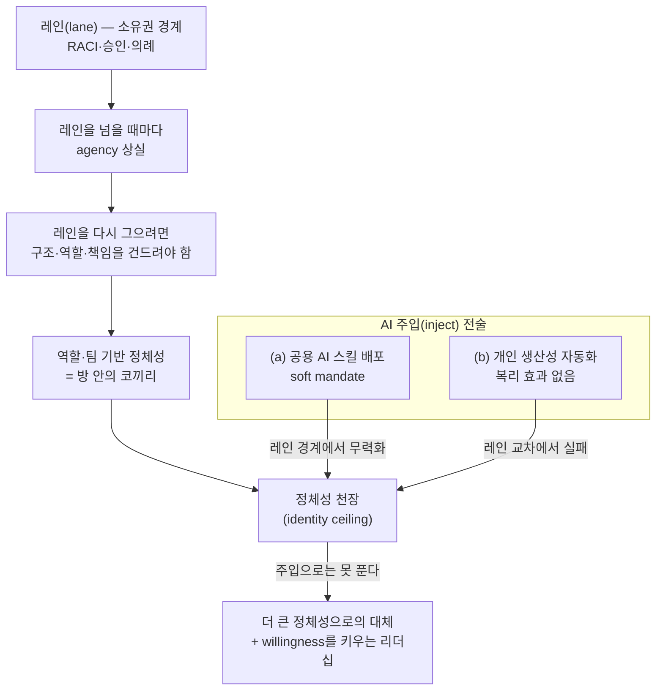

<figure class="post-figure post-figure--header">
<svg role="img" aria-label="방 한가운데 '정체성'이라 쓰인 거대한 코끼리가 서 있지만, 브라운필드 조직의 사람들은 코끼리를 등진 채 벽에 'AI 스킬'과 '자동화 도구' 쪽지만 붙이고 있다. 열린 문 밖 레인 없는 벌판에서는 브라운필드 난민들이 에이전트와 함께 깃발(목표)을 향해 달리고 있다." viewBox="0 0 640 340">
  <title>브라운필드의 방 안 코끼리(정체성) vs 문 밖 레인 없는 벌판의 난민 캠프</title>

  <!-- ground: room floor + field, one continuous line -->
  <line x1="28" y1="270" x2="616" y2="270" stroke="currentColor" stroke-width="2" opacity="0.45"/>

  <!-- ===== 브라운필드의 방 (left) ===== -->
  <!-- left wall + back wall top edge -->
  <line x1="36" y1="64" x2="36" y2="270" stroke="currentColor" stroke-width="2.5" opacity="0.7"/>
  <line x1="36" y1="64" x2="424" y2="64" stroke="currentColor" stroke-width="2" opacity="0.45"/>

  <!-- 벽에 붙인 쪽지들: AI 스킬 / 자동화 도구 -->
  <g>
    <rect x="52" y="84" width="66" height="26" fill="none" stroke="currentColor" stroke-width="2"/>
    <circle cx="85" cy="84" r="2.5" fill="var(--accent-color)"/>
    <text x="85" y="102" text-anchor="middle" font-family="var(--font-body)" font-size="11" fill="currentColor">AI 스킬</text>
    <rect x="132" y="100" width="80" height="26" fill="none" stroke="currentColor" stroke-width="2"/>
    <circle cx="172" cy="100" r="2.5" fill="var(--accent-color)"/>
    <text x="172" y="118" text-anchor="middle" font-family="var(--font-body)" font-size="11" fill="currentColor">자동화 도구</text>
  </g>

  <!-- 쪽지를 붙이는 사람들 (코끼리를 등지고 벽만 본다) -->
  <g stroke="currentColor" stroke-width="2.5" fill="none" stroke-linecap="round">
    <circle cx="88" cy="168" r="8"/>
    <line x1="88" y1="176" x2="88" y2="226"/>
    <line x1="88" y1="226" x2="78" y2="268"/>
    <line x1="88" y1="226" x2="98" y2="268"/>
    <line x1="88" y1="186" x2="68" y2="128"/>
    <circle cx="150" cy="176" r="8"/>
    <line x1="150" y1="184" x2="150" y2="232"/>
    <line x1="150" y1="232" x2="140" y2="268"/>
    <line x1="150" y1="232" x2="160" y2="268"/>
    <line x1="150" y1="192" x2="166" y2="132"/>
  </g>

  <!-- ===== 방 안의 코끼리 = 정체성 ===== -->
  <text x="300" y="112" text-anchor="middle" font-family="var(--font-body)" font-size="11" fill="currentColor" opacity="0.7">방 안의 코끼리</text>
  <!-- body -->
  <ellipse cx="300" cy="196" rx="74" ry="52" fill="none" stroke="currentColor" stroke-width="2.5"/>
  <!-- legs -->
  <g stroke="currentColor" stroke-width="9" opacity="0.9">
    <line x1="258" y1="246" x2="258" y2="268"/>
    <line x1="288" y1="248" x2="288" y2="268"/>
    <line x1="318" y1="248" x2="318" y2="268"/>
    <line x1="346" y1="244" x2="346" y2="268"/>
  </g>
  <!-- tail -->
  <path d="M372 182 q20 12 12 40" fill="none" stroke="currentColor" stroke-width="2.5" stroke-linecap="round"/>
  <!-- ear (behind head) -->
  <ellipse cx="240" cy="158" rx="20" ry="27" fill="currentColor" opacity="0.15" stroke="currentColor" stroke-width="2"/>
  <!-- head (occludes body edge) -->
  <circle cx="212" cy="176" r="34" fill="var(--bg-panel)" stroke="currentColor" stroke-width="2.5"/>
  <!-- trunk -->
  <path d="M186 196 C 168 220, 166 244, 190 254" fill="none" stroke="currentColor" stroke-width="5" stroke-linecap="round"/>
  <!-- tusk -->
  <path d="M194 202 q-16 10 -20 24" fill="none" stroke="currentColor" stroke-width="3" stroke-linecap="round"/>
  <!-- eye -->
  <circle cx="204" cy="168" r="3" fill="currentColor"/>
  <!-- 코끼리의 이름 -->
  <text x="302" y="202" text-anchor="middle" font-family="var(--font-body)" font-size="14" font-weight="700" fill="var(--accent-color)">정체성</text>

  <!-- ===== 열린 문 ===== -->
  <line x1="432" y1="100" x2="432" y2="270" stroke="currentColor" stroke-width="3"/>
  <line x1="458" y1="100" x2="458" y2="270" stroke="currentColor" stroke-width="3"/>
  <line x1="428" y1="100" x2="462" y2="100" stroke="currentColor" stroke-width="3"/>
  <polygon points="458,104 484,92 484,252 458,264" fill="currentColor" opacity="0.12" stroke="currentColor" stroke-width="2"/>

  <!-- ===== 문 밖: 레인 없는 벌판 (난민 캠프) ===== -->
  <!-- sun -->
  <circle cx="584" cy="80" r="14" fill="none" stroke="var(--gold)" stroke-width="3"/>
  <g stroke="var(--gold)" stroke-width="2" stroke-linecap="round" opacity="0.8">
    <line x1="584" y1="56" x2="584" y2="48"/>
    <line x1="606" y1="80" x2="614" y2="80"/>
    <line x1="600" y1="63" x2="606" y2="57"/>
  </g>
  <!-- goal flag -->
  <line x1="600" y1="270" x2="600" y2="168" stroke="currentColor" stroke-width="2.5"/>
  <polygon points="600,168 632,180 600,192" fill="var(--accent-color)"/>
  <!-- 달리는 난민들 -->
  <g stroke="var(--secondary-color)" stroke-width="2.5" fill="none" stroke-linecap="round">
    <circle cx="500" cy="222" r="6"/>
    <path d="M500 228 L510 250"/>
    <path d="M510 250 L500 268 M510 250 L520 266"/>
    <path d="M503 236 L518 230"/>
    <circle cx="546" cy="216" r="6"/>
    <path d="M546 222 L556 244"/>
    <path d="M556 244 L546 262 M556 244 L566 260"/>
    <path d="M549 230 L564 224"/>
  </g>
  <!-- speed lines -->
  <g stroke="var(--secondary-color)" stroke-width="2" stroke-linecap="round" opacity="0.5">
    <line x1="478" y1="234" x2="490" y2="234"/>
    <line x1="476" y1="244" x2="486" y2="244"/>
    <line x1="526" y1="228" x2="536" y2="228"/>
  </g>
  <!-- 에이전트 무리 (brass squares) -->
  <g fill="var(--gold)">
    <rect x="520" y="196" width="7" height="7"/>
    <rect x="538" y="184" width="7" height="7"/>
    <rect x="558" y="198" width="7" height="7"/>
  </g>

  <!-- labels -->
  <text x="228" y="306" text-anchor="middle" font-family="var(--font-body)" font-size="12" font-weight="700" fill="var(--accent-color)">브라운필드 — 코끼리는 못 본 척, 벽엔 AI 스킬</text>
  <text x="544" y="306" text-anchor="middle" font-family="var(--font-body)" font-size="12" font-weight="700" fill="var(--secondary-color)">난민 캠프 — 레인 없는 벌판</text>
</svg>
<figcaption>브라운필드는 방 한가운데의 코끼리(역할·팀 기반 정체성)를 못 본 척, 벽에 AI 스킬과 자동화 도구만 붙인다. 문 밖 레인 없는 벌판에서는 난민들이 에이전트와 함께 곧장 목표로 달린다.</figcaption>
</figure>

## 원문 정보

> - **제목**: The Elephant in the Brownfield
> - **출처**: Subbu Allamaraju — 『RESTful Web Services Cookbook』 저자이자 기술 리더십 에세이스트 ([subbu.org](https://www.subbu.org/))
> - **발행**: 2026-08-21 · 약 6분 분량
> - **원문 링크**: [https://www.subbu.org/essays/2026/the-elephant-in-the-brownfield/](https://www.subbu.org/essays/2026/the-elephant-in-the-brownfield/)

"AI를 조직에 주입하는 것만으로는 왜 가치가 나오지 않는가"를 조직·리더십의 관점에서 파고드는 글이라, AI가 일과 조직을 바꾸는 방식을 추적하는 `Articles/AI-Industry`에 담는다.

## 한 줄 요약 (TL;DR)

기존 기업(브라운필드)의 AI 전환이 실패하는 진짜 이유는 도구나 기술이 아니라, 소유권 경계(레인)와 그 위에 세워진 **역할·팀 기반 정체성**이다 — 리더의 일은 AI를 주입하는 것이 아니라, 그 정체성의 그립(grip)을 느슨하게 풀고 변화하려는 **자발적 의지(willingness)** 를 끌어내는 것이다.

## 왜 이 글을 골랐나

AI 도입에 관한 글은 대부분 "무엇을 도입할까"(도구, 에이전트, 인프라)를 다룬다. 이 글은 그 앞 단계 — "왜 도입해도 안 바뀌는가" — 를 다룬다는 점에서 드물다.

이 위키에서 다뤄 온 흐름과도 정확히 이어진다. NFX의 [미션 팟 조직론](/2026/08/04/ai-first-company-mission-pods.html)이 "AI-first 조직은 이렇게 짜라"는 **구조적 처방**이라면, 이 글은 그 처방이 브라운필드에서 왜 그렇게 어려운지 — 구조를 바꾸는 일이 사람들의 **정체성**을 건드리기 때문이라는 — 를 설명하는 **진단**이다. Will Larson이 [엔지니어링 리더십의 규칙을 다시 쓰며](/2026/07/02/revised-rules-of-engineering-leadership.html) 내린 결론("기술적 가능성은 매달 넓어져도 조직의 병목은 그대로")의 그 '병목'에 이름을 붙인 글이라고도 할 수 있다.

글의 논증을 한 흐름으로 접으면 아래와 같다 — 레인에서 시작해 willingness로 끝나는 인과 사슬이다.

## 핵심 내용

### 브라운필드 난민 vs 브라운필드

저자는 최근 만난, 기존 기업을 떠나(또는 밀려나) 창업으로 향한 숙련 엔지니어·리더들을 **"브라운필드 난민(brownfield refugees)"** 이라 부른다. 이들은 1년 전만 해도 상상하기 어려웠던 속도로 만들고, "이전 시대(before times)"에 신성시되던 관행과 원칙을 깨뜨리며, 그 새로운 방식을 중심으로 조직을 짜고 있다. 아이디어 밀도가 극도로 높은 집단이다.

반면 브라운필드 쪽의 현실은, 저자가 시애틀의 한 밋업에서 들은 AI 배포 전략 패널에서 압축적으로 드러난다. 그곳의 전술은 결국 두 가지였다.

- (a) "모두를 위한 **공용 AI 스킬**을 배포하고 있다"
- (b) "리더인 **내가** 이런 식으로 일을 자동화했고, 팀이 좋아한다"

저자는 이것이 "우리는 이제 AI-native 회사가 됩니다" 선언과 같은 부류라고 본다. 자율 에이전트 루프에 투자하는 더 앞선 회사들도 있지만, 공통된 주제는 하나다 — **이미 존재하는 것에 AI를 주입(inject)하는 것**. 저자 자신도 그런 일을 해 봤고 필요한 단계라고 인정하지만, "충분히 멀리 가지 못한다"고 단언한다.

### 코끼리는 더 크다: 레인과 agency

두 진영에 대한 흔한 반박 — "난민들은 고객도 미션 크리티컬한 소프트웨어도 없으니 마음껏 혁신할 수 있는 것", "브라운필드는 원래 느리고 낡은 레거시" — 은 둘 다 사실이지만, 둘 다 핵심을 놓친다는 것이 저자의 진단이다.

난민 캠프에서는 사람들이 로드맵이나 지시를 기다리지 않고 큰 결정을 내리는 **높은 agency**를 가진다. 저자는 이들을 세 가지 상(像)으로 그린다.

- **Super-IC**: 넓게든 깊게든 스스로 움직이는 개인
- **Product engineer**: PM과 개발자의 교차점에서, 제품 가설을 프로덕션 코드로 직접 전환하는 사람
- **Agent manager**: 에이전트 팩토리를 짓고 에이전트 루프를 돌려 큰 덩어리의 일을 움직이는 사람

브라운필드는 반대다. 사람들은 소유권 경계를 따라 층층이 조직되고, 자기 **레인(lane)** 안에 머무르며, 레인을 넘는 것은 금기다. 일은 레인 안에서는 (AI가 있든 없든) 빠르게 움직이지만, 의존성이 레인을 가로지르는 순간 느려진다 — 합의하고, 부탁을 주고받고, 이견을 조율하고, 계획을 수정해야 한다. 누가 소유하고, 누가 할 수 있고, 누가 결정하고, 누가 승인하는가의 문제는 정교한 RACI·DACI, 승인자와 반대자, 그리고 그것들을 지탱하는 의례·프로세스·페이퍼 트레일로 번진다.

<figure class="post-figure">
<svg role="img" aria-label="왼쪽 브라운필드에는 나란한 레인이 그어져 있고, 레인 안에서는 화살표가 빠르게 달리지만 레인을 가로지르는 세로 화살표는 RACI·승인, 의례·프로세스라는 톨게이트를 지날 때마다 가늘어지며 agency를 잃는다. 오른쪽 난민 캠프는 레인이 없는 벌판으로, super-IC·product engineer·agent manager가 굵은 화살표로 곧장 목표 깃발에 도달한다." viewBox="0 0 640 300">
  <title>브라운필드의 레인·톨게이트 vs 난민 캠프의 레인 없는 벌판</title>

  <!-- ===== LEFT: 브라운필드 — 레인과 톨게이트 ===== -->
  <text x="160" y="24" text-anchor="middle" font-family="var(--font-body)" font-size="12" font-weight="700" fill="currentColor" opacity="0.85">브라운필드 — 레인과 톨게이트</text>

  <!-- lane lines -->
  <g stroke="currentColor" stroke-width="2" opacity="0.5">
    <line x1="24" y1="56" x2="296" y2="56"/>
    <line x1="24" y1="116" x2="296" y2="116"/>
    <line x1="24" y1="176" x2="296" y2="176"/>
    <line x1="24" y1="236" x2="296" y2="236"/>
  </g>

  <!-- in-lane fast arrows -->
  <g stroke="var(--secondary-color)" stroke-width="2.5" stroke-linecap="round">
    <line x1="44" y1="86" x2="140" y2="86"/>
    <line x1="44" y1="146" x2="140" y2="146"/>
    <line x1="44" y1="206" x2="140" y2="206"/>
  </g>
  <g fill="var(--secondary-color)">
    <path d="M152 86 l-13 -6 v12 z"/>
    <path d="M152 146 l-13 -6 v12 z"/>
    <path d="M152 206 l-13 -6 v12 z"/>
  </g>
  <g stroke="var(--secondary-color)" stroke-width="2" stroke-linecap="round" opacity="0.45">
    <line x1="30" y1="80" x2="38" y2="80"/>
    <line x1="30" y1="140" x2="38" y2="140"/>
    <line x1="30" y1="200" x2="38" y2="200"/>
  </g>
  <text x="44" y="106" text-anchor="start" font-family="var(--font-body)" font-size="10.5" fill="var(--secondary-color)">레인 안은 빠르다</text>

  <!-- crossing arrow: 레인을 가로지르며 톨게이트마다 가늘어진다 -->
  <line x1="232" y1="68" x2="232" y2="106" stroke="var(--accent-color)" stroke-width="3.5" stroke-linecap="round"/>
  <line x1="232" y1="126" x2="232" y2="166" stroke="var(--accent-color)" stroke-width="2.2" stroke-dasharray="6 5" stroke-linecap="round"/>
  <line x1="232" y1="186" x2="232" y2="218" stroke="var(--accent-color)" stroke-width="1.4" stroke-dasharray="3 6" stroke-linecap="round" opacity="0.7"/>
  <path d="M232 228 l-6 -12 h12 z" fill="var(--accent-color)" opacity="0.7"/>

  <!-- tollgate 1: RACI·승인 -->
  <g stroke="var(--accent-color)" stroke-width="2" fill="none">
    <rect x="210" y="110" width="44" height="12"/>
    <line x1="222" y1="110" x2="216" y2="122"/>
    <line x1="238" y1="110" x2="232" y2="122"/>
  </g>
  <text x="204" y="121" text-anchor="end" font-family="var(--font-body)" font-size="10.5" font-weight="700" fill="var(--accent-color)">RACI·승인</text>

  <!-- tollgate 2: 의례·프로세스 -->
  <g stroke="var(--accent-color)" stroke-width="2" fill="none">
    <rect x="210" y="170" width="44" height="12"/>
    <line x1="222" y1="170" x2="216" y2="182"/>
    <line x1="238" y1="170" x2="232" y2="182"/>
  </g>
  <text x="204" y="181" text-anchor="end" font-family="var(--font-body)" font-size="10.5" font-weight="700" fill="var(--accent-color)">의례·프로세스</text>

  <text x="232" y="262" text-anchor="middle" font-family="var(--font-body)" font-size="11" font-weight="700" fill="var(--accent-color)">교차마다 agency ↓</text>

  <!-- divider -->
  <line x1="318" y1="40" x2="318" y2="272" stroke="currentColor" stroke-width="2" stroke-dasharray="4 8" opacity="0.35"/>

  <!-- ===== RIGHT: 난민 캠프 — 레인 없는 벌판 ===== -->
  <text x="478" y="24" text-anchor="middle" font-family="var(--font-body)" font-size="12" font-weight="700" fill="currentColor" opacity="0.85">난민 캠프 — 레인 없는 벌판</text>

  <!-- goal flag -->
  <line x1="586" y1="236" x2="586" y2="84" stroke="currentColor" stroke-width="2.5"/>
  <polygon points="586,84 618,96 586,108" fill="var(--accent-color)"/>
  <line x1="340" y1="236" x2="616" y2="236" stroke="currentColor" stroke-width="2" opacity="0.3"/>
  <text x="580" y="254" text-anchor="middle" font-family="var(--font-body)" font-size="10.5" fill="currentColor" opacity="0.75">목표(제품·고객)</text>

  <!-- three refugees, straight bold arrows to the flag -->
  <g stroke="var(--secondary-color)" stroke-width="2.5" fill="none" stroke-linecap="round">
    <circle cx="380" cy="62" r="7"/>
    <path d="M380 69 L380 88 M380 88 L372 100 M380 88 L388 100 M374 76 L392 72"/>
    <circle cx="380" cy="128" r="7"/>
    <path d="M380 135 L380 154 M380 154 L372 166 M380 154 L388 166 M374 142 L392 138"/>
    <circle cx="380" cy="194" r="7"/>
    <path d="M380 201 L380 220 M380 220 L372 232 M380 220 L388 232 M374 208 L392 204"/>
  </g>
  <g stroke="var(--secondary-color)" stroke-width="2.5" stroke-linecap="round">
    <line x1="404" y1="80" x2="562" y2="120"/>
    <line x1="404" y1="146" x2="562" y2="148"/>
    <line x1="404" y1="212" x2="562" y2="176"/>
  </g>
  <g fill="var(--secondary-color)">
    <path d="M574 123 l-14 -8 l2 13 z"/>
    <path d="M574 148 l-14 -6 v12 z"/>
    <path d="M574 173 l-12 10 l-2 -13 z"/>
  </g>

  <!-- 에이전트 무리 (agent manager의 화살표 주변, brass squares) -->
  <g fill="var(--gold)">
    <rect x="448" y="188" width="7" height="7"/>
    <rect x="478" y="196" width="7" height="7"/>
    <rect x="508" y="180" width="7" height="7"/>
  </g>

  <!-- role labels -->
  <text x="380" y="46" text-anchor="middle" font-family="var(--font-body)" font-size="10.5" font-weight="700" fill="currentColor">super-IC</text>
  <text x="380" y="117" text-anchor="middle" font-family="var(--font-body)" font-size="10.5" font-weight="700" fill="currentColor">product engineer</text>
  <text x="380" y="183" text-anchor="middle" font-family="var(--font-body)" font-size="10.5" font-weight="700" fill="currentColor">agent manager</text>

  <text x="478" y="278" text-anchor="middle" font-family="var(--font-body)" font-size="11" font-weight="700" fill="var(--secondary-color)">로드맵을 기다리지 않는 높은 agency</text>
</svg>
<figcaption>레인 안에서는 일이 빠르지만, 레인을 가로지르는 순간 RACI·승인·의례라는 톨게이트가 agency를 깎아 낸다. 레인 없는 벌판에서는 super-IC·product engineer·agent manager가 곧장 목표에 닿는다.</figcaption>
</figure>

순효과는 **레인을 넘을 때마다 agency가 상실되는 것**이다. 그런 구조에서는 super-IC도, product engineer도, agent manager도 출현하지 않는다. 그리고 레인을 없애거나 교차 규칙을 바꾸는 일은 구조·역할·책임을 다시 깎아내는 일이고, 그것은 사람들의 핵심 — **정체성** — 을 건드린다.

> 모든 사람은 직장에서 역할과 팀에 기반한 정체성을 가진다. (…) 과제는 기술적인 것이 아니다. 정체성의 그립을 느슨하게 풀고, 변화하려는 의지를 만들어내는 인간의 기술(human art)이다.

### 그립 풀기: 주입 전술은 왜 천장에 부딪히는가

그렇다면 리더는 그 그립을 어떻게 푸는가? 저자의 답은 명확하다 — "확실한 건, AI를 주입하는 것으로는 안 된다."

- **공용 AI 스킬 배포**는 사람들이 AI를 어떻게 써야 하는지에 대한 **부드러운 강제(soft mandate)** 다. 리더십이 지시를 '이네이블먼트'로 포장하고, 파워 유저 중앙 팀이 스킬을 조직에 주입한다. 일이 레인 안에 머무는 동안은 작동하지만, 레인 경계에 부딪히는 순간 사람들은 예전과 똑같은 메커니즘으로 돌아간다. **같은 정체성 천장(identity ceiling)** 에 부딪힌다.
- **각자 알아서 자동화하는 점진주의**는 개인의 모범을 조직 전환으로 착각한다. 레인 교차가 필요한 일에서 실패한다. 같은 천장. **복리 효과가 없다.** 정체성은 그대로 남는다.

저자는 951개 글로벌 기업의 AI 예산을 조사한 Bain 서베이 — "기술은 작동했지만(technology worked) 가치는 도착하지 않았다(value didn't arrive)", "일하는 방식을 바꾸지 않고 AI를 배치하면 비즈니스 가치 미달이 보장된다" — 를 인용하면서도, 그조차 **물러터진 표현**이라고 본다. 한 겹이 더 있다는 것이다.

> 더 어려운 문제는 이것이다: 사람들은 **다르게 일할 권한이 주어지지 않는 한** — 자기 레인 안에서뿐 아니라 레인을 넘을 때에도 — 일하는 방식을 바꾸지 않는다.

구체적으로는, 아키텍트 동료가 "내 사인오프 없이는 못 내보낸다"는 말을 멈추는 것, identity 팀이 백로그가 꽉 찼다는 이유로 당신을 막지 않는 것이다.

### 난민의 진짜 비밀: 정체성을 버린 게 아니라 더 큰 것으로 바꿨다

브라운필드 난민들에게 지켜야 할 역할 정체성이 없는 이유는, 정체성을 **버려서**가 아니다. 창업자로 살아남기, 아이디어를 다른 사람들에게 각인시키기, 고객을 성공시키기 — **더 큰 정체성으로 대체했기** 때문이다. 판돈이 역할·팀 기반 정체성보다 크다.

여기서 저자는 리더십의 핵심 원칙을 꺼낸다.

> 사람들이 일하는 방식을 바꾸게 **만들** 수는 없다. 바꾸려는 **의지(willingness)를 키울** 수 있을 뿐이다.

저자 자신도 그 의지에 호소할 수 있었을 때 최고의 성과를 냈고 — 사람들이 저자의 목표를 자기 것으로 만들었다 — 그러지 못했을 때는 목표가 그들이 중요하게 여기는 것과 충돌해 에스컬레이션과 씨름해야 했다.

최고의 AI 펩톡을 해도(잦은 정리해고의 시대에는 오히려 역효과가 날 수 있다), 최고의 agentic AI 인프라와 도구를 깔아도, 결정권을 움켜쥔 아키텍트, 백로그를 지키는 PM, 플래닝 의례와 기술부채 예산을 고수하는 매니저와 마주치게 된다. 저자는 그들을 탓하는 대신 질문으로 끝맺는다 — **그들이 나쁜가? 사람들은 어디에서 멈춰 서는가? 무엇을 붙잡고 있는가?**

## 분석과 인사이트

### Conway의 법칙의 '정체성 버전'

Conway의 법칙은 "조직 구조가 시스템 구조를 결정한다"고 말한다. 이 글은 그 앞 단계를 짚는다 — **정체성이 조직 구조를 지키고, 그 구조가 AI의 가치를 막는다.** 레인·RACI·승인 의례는 비합리의 산물이 아니라, 역할 정체성이 자기를 보존하는 면역 반응이라는 것이다. "AI 전환 실패"를 도구 선택이나 교육 부족의 문제로 프레이밍하는 대부분의 담론보다 한 겹 깊은 진단이고, 나는 이 프레임이 실무에서 목격하는 현상 — 도구는 깔렸는데 아무것도 안 바뀌는 — 을 가장 잘 설명한다고 본다.

### '주입 vs 재구성' 프레임의 조직 내부 적용

USV의 [Obliterate, Don't Automate](/2026/08/04/obliterate-dont-automate.html)가 시장 차원에서 "게이트키퍼를 효율화하지 말고 걷어내라"고 말했다면, 이 글은 같은 논리를 **조직 내부**에 적용한다. 공용 스킬 배포와 개인 자동화는 기존 레인을 그대로 둔 채 그 위를 효율화하는 '자동화'이고, 저자가 요구하는 것은 레인 자체를 다시 긋는 '재구성'이다. NFX의 [미션 팟](/2026/08/04/ai-first-company-mission-pods.html)이 재구성의 목적지 그림이라면, 이 글은 그 여정의 최대 저항 — 정체성 — 을 지도에 표시한다. 세 글을 겹쳐 읽으면 "구조 처방(NFX) + 시장 논리(USV) + 인간적 장벽(Subbu)"이라는 꽤 완결된 그림이 나온다.

### 동의하는 지점: '복리 효과 없음'이라는 판정

개인 생산성 자동화에 대한 "no compounding effects"라는 판정이 특히 날카롭다. 레인 안의 자동화는 산술적으로 더해질 뿐이고, 레인을 넘는 agency가 생겨야 — 한 사람이 가설부터 프로덕션까지 관통할 수 있어야 — 곱셈이 시작된다. Marty Cagan이 말한 [프로덕트 역할의 재정의](/2026/08/18/a-fresh-definition-of-the-product-role.html)에서 등장한 'product engineer' 상과 정확히 같은 인물이 여기서도 병목 해소의 열쇠로 지목되는 점도 흥미롭다 — 서로 다른 저자들이 같은 종(種)의 출현을 보고하고 있다.

### 이견과 한계: 레인은 공짜로 생기지 않았다

다만 두 가지는 짚어야 공정하다. 첫째, **레인에는 정체성 보호 말고도 실존하는 기능이 있다.** 온콜 책임, 규제·감사 대응, 보안 경계, 장애의 blast radius 제한 — 저자도 "과거에는 일을 조직하는 데 필요했다"고 인정하지만, 미션 크리티컬한 시스템에서 어떤 레인은 AI 시대에도 남아야 한다. 문제는 레인의 존재가 아니라, 어떤 레인이 여전히 가치를 지키고 어떤 레인이 정체성만 지키는지 **구분하지 않는 것**이다. 둘째, 이 글은 진단은 깊지만 **처방은 얇다.** "willingness를 키워라"는 원칙이지 방법론이 아니다 — 더 큰 정체성(고객 성공, 생존급 미션)을 조직 안에서 어떻게 설계하는지는 독자의 숙제로 남는다. NFX의 미션 팟 같은 구조 처방과 반드시 짝지어 읽어야 하는 이유다.

## 적용 포인트

- **AI 도구를 깔기 전에 레인 교차 규칙부터 감사하라.** 우리 팀에서 일이 멈추는 지점은 도구가 없어서인가, 승인·사인오프·백로그 대기 때문인가? 후자라면 스킬 배포는 천장에 부딪힌다.
- **"주입"과 "재구성"을 구분해서 스스로의 이니셔티브를 분류해 보라.** 지금 추진 중인 AI 프로젝트가 기존 역할·프로세스를 그대로 둔 채 효율화하는 것이라면, 복리 효과를 기대하지 말 것.
- **리더라면 mandate를 enablement로 포장하지 말라.** 공용 스킬 배포가 사실상 지시라면, 그 지시가 레인 경계에서 무력화된다는 것을 전제로 설계하라. 대신 사람들이 붙잡고 있는 것이 무엇인지 — 결정권인지, 백로그인지, 의례인지 — 를 먼저 관찰하라.
- **개인으로서는 '더 큰 정체성'을 미리 준비하라.** 역할 기반 정체성("나는 X팀의 Y 담당")이 아니라 성과 기반 정체성("나는 이 문제를 끝까지 푸는 사람")으로 옮겨 갈수록, super-IC·product engineer·agent manager로의 전환이 덜 위협적이 된다.
- **레인을 없앨 때는 그 레인이 지키던 실제 가치(온콜, 보안, 규제)를 어디로 옮길지 함께 설계하라.** 정체성만 지키는 레인과 가치를 지키는 레인을 구분하는 것이 리더의 일이다.

## 마무리

이 글의 코끼리는 AI가 아니다. AI를 둘러싼 조직도, RACI, 승인 의례 뒤에 숨어 있는 **역할·팀 기반 정체성**이다. 브라운필드 난민들이 빠른 것은 위험이 없어서가 아니라 지킬 역할 정체성이 없어서이고 — 정확히는, 더 큰 정체성으로 갈아탔기 때문이다. 그래서 브라운필드 리더의 진짜 과제는 기술 선택이 아니라, 사람들이 붙잡고 있는 것을 알아보고 그 그립을 스스로 풀 willingness를 만들어내는 인간의 기술이다. 도구는 매달 좋아진다. 정체성은 저절로 풀리지 않는다.

### 더 읽어보기

- [원문 — The Elephant in the Brownfield (Subbu Allamaraju)](https://www.subbu.org/essays/2026/the-elephant-in-the-brownfield/)
- [가장 빠른 AI-first 회사는 어떻게 일하는가: 미션 팟 (NFX)](/2026/08/04/ai-first-company-mission-pods.html) — 이 글이 진단한 '레인 해체'의 구조적 처방
- [자동화하지 말고 파괴하라 (USV)](/2026/08/04/obliterate-dont-automate.html) — '주입 vs 재구성' 프레임의 시장 차원 버전
- [엔지니어링 리더십의 규칙을 다시 쓰다 (Will Larson)](/2026/07/02/revised-rules-of-engineering-leadership.html) — "기술은 넓어져도 조직 병목은 그대로"라는 같은 결론의 실무 리더 버전
- [프로덕트 역할의 새로운 정의 (Marty Cagan)](/2026/08/18/a-fresh-definition-of-the-product-role.html) — 이 글의 'product engineer' 상을 프로덕트 관점에서 정의한 글
