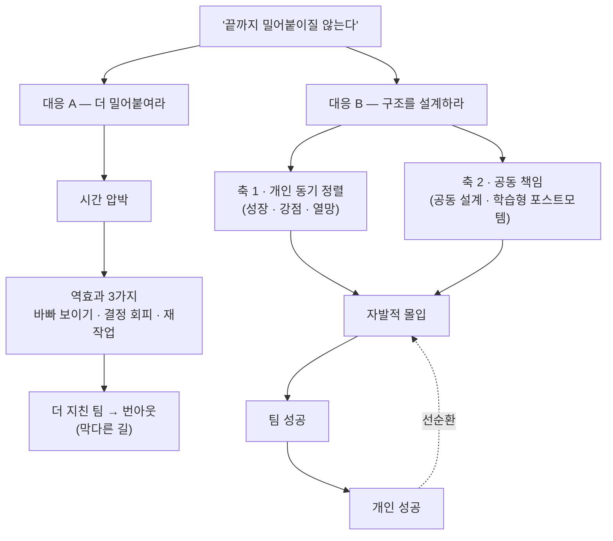
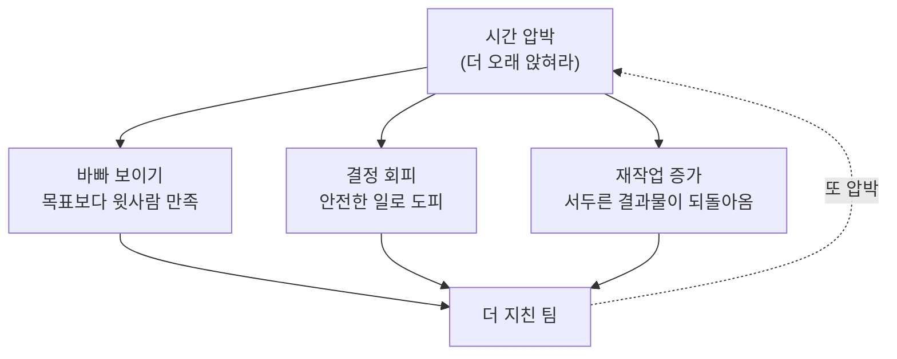

<figure class="post-figure post-figure--header">
<svg role="img" aria-label="왼쪽은 채찍을 든 리더가 책상에 오래 앉은 지친 팀을 늦은 시각까지 몰아붙이는 '압박' 장면, 오른쪽은 인정·안정·자율이라는 서로 다른 개인 동기를 '구조라는 레일'로 정렬해 하나의 팀 목표 깃발로 모으는 '설계' 장면. 두 접근의 대비." viewBox="0 0 760 300" xmlns="http://www.w3.org/2000/svg">
  <title>압박(채찍) vs 설계(레일) — 오래 앉히기와 선택의 구조</title>
  <defs>
    <marker id="tsi-hdr-arrow" markerWidth="9" markerHeight="9" refX="7" refY="4.5" orient="auto">
      <path d="M0 0 L9 4.5 L0 9 Z" fill="var(--secondary-color)"/>
    </marker>
  </defs>

  <!-- ── LEFT: 압박 ── -->
  <text x="190" y="44" text-anchor="middle" font-size="16" font-weight="700" fill="var(--accent-color)">압박</text>
  <text x="190" y="63" text-anchor="middle" font-size="11" fill="currentColor" opacity="0.8">시간을 쥐어짜 밀어붙인다</text>

  <!-- 리더 + 채찍 -->
  <g fill="currentColor">
    <circle cx="70" cy="98" r="12"/>
    <path d="M57 110 L83 110 L79 154 L61 154 Z"/>
  </g>
  <g stroke="currentColor" stroke-width="6" stroke-linecap="round" fill="none">
    <line x1="65" y1="154" x2="62" y2="184"/>
    <line x1="75" y1="154" x2="78" y2="184"/>
    <line x1="81" y1="116" x2="104" y2="100"/>
  </g>
  <path d="M104 100 C 150 60 210 70 250 96" stroke="var(--accent-color)" stroke-width="2.5" fill="none"/>
  <g stroke="var(--accent-color)" stroke-width="2" fill="none">
    <line x1="250" y1="96" x2="262" y2="88"/>
    <line x1="250" y1="96" x2="263" y2="99"/>
  </g>

  <!-- 늦은 시각 시계 -->
  <g>
    <circle cx="330" cy="106" r="15" fill="var(--bg-panel)" stroke="currentColor" stroke-width="2"/>
    <line x1="330" y1="106" x2="330" y2="96" stroke="currentColor" stroke-width="2" stroke-linecap="round"/>
    <line x1="330" y1="106" x2="322" y2="100" stroke="currentColor" stroke-width="2" stroke-linecap="round"/>
  </g>

  <!-- 지쳐 소진되는 화살표 -->
  <g stroke="var(--accent-color)" stroke-width="2" fill="none">
    <path d="M191 118 L200 128 L209 118"/>
    <path d="M191 130 L200 140 L209 130"/>
    <path d="M276 118 L285 128 L294 118"/>
    <path d="M276 130 L285 140 L294 130"/>
  </g>

  <!-- 책상 + 오래 앉은 두 사람 -->
  <rect x="150" y="192" width="196" height="7" fill="currentColor"/>
  <g stroke="currentColor" stroke-width="5" stroke-linecap="round">
    <line x1="160" y1="199" x2="160" y2="232"/>
    <line x1="336" y1="199" x2="336" y2="232"/>
  </g>
  <g fill="currentColor"><circle cx="200" cy="152" r="11"/><circle cx="285" cy="152" r="11"/></g>
  <g stroke="currentColor" stroke-width="7" stroke-linecap="round" fill="none">
    <path d="M200 163 C 200 181 214 187 228 191"/>
    <path d="M285 163 C 285 181 299 187 313 191"/>
  </g>
  <text x="188" y="253" text-anchor="middle" font-size="10.5" fill="currentColor" opacity="0.7">오래 앉아 있게 만든다</text>

  <!-- ── 가운데 대비 ── -->
  <line x1="380" y1="78" x2="380" y2="250" stroke="currentColor" stroke-width="2" stroke-dasharray="4 6" opacity="0.3"/>
  <circle cx="380" cy="164" r="17" fill="var(--bg-panel)" stroke="currentColor" stroke-width="2"/>
  <text x="380" y="169" text-anchor="middle" font-size="13" font-weight="700" fill="currentColor">vs</text>

  <!-- ── RIGHT: 설계 ── -->
  <text x="570" y="44" text-anchor="middle" font-size="16" font-weight="700" fill="var(--secondary-color)">설계</text>
  <text x="570" y="63" text-anchor="middle" font-size="11" fill="currentColor" opacity="0.8">선택의 구조로 정렬한다</text>

  <!-- 서로 다른 개인 동기 3갈래 -->
  <text x="445" y="102" text-anchor="middle" font-size="11" fill="currentColor">인정</text>
  <text x="445" y="152" text-anchor="middle" font-size="11" fill="currentColor">안정</text>
  <text x="445" y="202" text-anchor="middle" font-size="11" fill="currentColor">자율</text>
  <circle cx="445" cy="118" r="6" fill="currentColor"/>
  <circle cx="445" cy="168" r="6" fill="var(--gold)"/>
  <circle cx="445" cy="218" r="6" fill="var(--primary-color)"/>
  <path d="M452 118 Q 560 130 606 158" stroke="currentColor" stroke-width="2.5" fill="none"/>
  <path d="M452 168 Q 560 168 606 168" stroke="var(--gold)" stroke-width="2.5" fill="none"/>
  <path d="M452 218 Q 560 206 606 178" stroke="var(--primary-color)" stroke-width="2.5" fill="none"/>

  <!-- 구조(레일) 게이트 -->
  <rect x="608" y="146" width="30" height="44" rx="4" fill="var(--secondary-color)" opacity="0.14"/>
  <rect x="608" y="146" width="30" height="44" rx="4" fill="none" stroke="var(--secondary-color)" stroke-width="2"/>
  <text x="623" y="210" text-anchor="middle" font-size="10" fill="currentColor" opacity="0.72">구조 = 레일</text>

  <!-- 하나의 팀 목표로 정렬 -->
  <path d="M640 168 L670 168" stroke="var(--secondary-color)" stroke-width="4" fill="none" marker-end="url(#tsi-hdr-arrow)"/>
  <line x1="656" y1="224" x2="706" y2="224" stroke="currentColor" stroke-width="2"/>
  <rect x="678" y="106" width="5" height="118" fill="currentColor"/>
  <path d="M683 109 L722 122 L683 135 Z" fill="var(--secondary-color)"/>
  <text x="681" y="245" text-anchor="middle" font-size="12" font-weight="700" fill="var(--secondary-color)">팀 목표</text>
</svg>
<figcaption>왼쪽 '압박'은 사람을 늦게까지 오래 앉혀 두지만 팀은 소진된다. 오른쪽 '설계'는 인정·안정·자율처럼 제각각인 개인 동기를 '선택의 구조'라는 레일로 정렬해 하나의 팀 목표로 모은다.</figcaption>
</figure>

## 원문 정보

> - **제목**: 팀이 성공해야 개인이 성공한다
> - **출처**: w0nder.land (<https://w0nder.land>) · 개인 블로그
> - **발행**: 2026-03-21 · 약 6분 분량
> - **원문 링크**: <https://w0nder.land/posts/68-%ED%8C%80%EC%9D%B4%20%EC%84%B1%EA%B3%B5%ED%95%B4%EC%95%BC%20%EA%B0%9C%EC%9D%B8%EC%9D%B4%20%EC%84%B1%EA%B3%B5%ED%95%9C%EB%8B%A4>

`Articles` 카테고리는 읽을 만한 외부 글을 골라 핵심을 정리하고 내 관점으로 분석하는 공간이다. 이 글은 AI나 특정 기술이 아니라 **팀을 이끄는 방식** — 리더십과 조직 설계라는 소프트 스킬 — 을 정면으로 다루기에 `Career-Life`에 담는다.

## 한 줄 요약 (TL;DR)

"우리 직원들은 끝까지 밀어붙이질 않아요"라는 불만의 해법은 **더 많은 시간이 아니라 더 나은 구조**다. 리더가 (1) 개인의 동기를 일과 정렬시키고 (2) 성공과 실패를 팀이 함께 지게 설계하면, 끈기는 강요된 의무가 아니라 **구성원 스스로의 선택**이 된다. 강한 팀은 오래 앉아 있어서 만들어지지 않는다.

## 왜 이 글을 골랐나

이 위키에는 "어떻게 더 잘 만들 것인가"를 다루는 기술 글이 많다. 하지만 대부분의 성과는 혼자가 아니라 **팀에서** 나오고, 팀의 성패는 리더가 무엇을 설계했는지에 크게 좌우된다. 이 글은 그 지점을 짧고 밀도 있게 짚는다.

특히 이 글이 좋은 이유는 흔한 처방을 정면으로 뒤집기 때문이다. "직원들이 몰입하지 않는다"는 진단에 대부분의 조직은 **압박·야근·정신교육**으로 반응한다. 저자는 그 반응이 왜 역효과를 내는지 원인부터 해체한 뒤, 자율(autonomy)이라는 유행하는 반대 처방마저 "구조 없는 자율은 정렬 장치가 없다"며 경계한다. 그리고 그 사이에 **"선택의 구조(choice architecture)"** 라는 제3의 답을 놓는다.

같은 결의 리더십 글로는 [권한을 위임받은 개발자는 어떻게 성장하는가(토스 회고)](/2026/06/23/toss-retrospective-growth-leadership.html)와 [엔지니어링 리더십의 규칙을 다시 쓰다(Will Larson)](/2026/07/02/revised-rules-of-engineering-leadership.html)가 있고, 개인 차원의 소프트 스킬로는 [사회생활 생존 꿀팁 30가지](/2026/06/19/social-life-survival-tips.html), [노동시장이라는 게임에서 살아남기](/2026/06/22/surviving-in-the-job-market.html)가 있다. 이 글은 그 사이 — **개인의 성공과 팀의 성공을 잇는 리더의 설계** — 를 채운다.

아래 한 장이 이 글의 인과 척추다. 같은 불만에서 갈라지는 **두 경로** — 압박은 막다른 길로, 설계는 선순환으로 이어진다.

## 핵심 내용

원문은 **문제 진단 → 잘못된 두 처방 → 두 축의 설계 → 결론** 순서로 짧게 전개된다. 아래는 그 구조를 따라 정리한 것이다.

### 문제: "끝까지 밀어붙이질 않는다"

글은 대표들이 자주 하는 말로 시작한다 — "우리 직원들은 끝까지 밀어붙이질 않아요." 그리고 이 진단에 대한 가장 흔한 반응, 즉 **더 오래 일하게 만드는 것**이 왜 실패하는지를 짚는다. 시간을 늘린다고 아웃풋의 질이 오르지 않는다. 오히려 압박은 세 가지 역효과를 낳는다.

- **책임의 방향이 뒤틀린다.** 목표 달성보다 **바빠 보이는 것**, 즉 윗사람을 만족시키는 데 에너지가 쏠린다.
- **중요한 결정이 미뤄진다.** 사람들은 어렵지만 중요한 판단을 회피하고 **안전한 일**로 도피한다.
- **재작업(rework)이 늘어난다.** 서두른 결과물이 되돌아오고, 그만큼 팀은 더 지친다.

이 대목의 핵심 문장이 이것이다.

> "시간은 압박으로 늘릴 수 있지만, 아웃풋은 구조 없이는 늘지 않는다."

한 번의 압박은 세 갈래로 갈라졌다가 **'더 지친 팀'이라는 같은 출구**로 모이고, 그 지친 팀은 다시 압박을 부른다 — 자기강화적 악순환이다.

### 잘못된 반대 처방: 구조 없는 자율

그렇다고 반대로 **자율만 주면 되는가?** 저자는 여기에도 선을 긋는다. 방향과 장치 없이 자유만 부여하면 개인의 노력을 팀 목표에 맞출 **정렬(alignment) 메커니즘**이 사라진다. 자율은 방임이 아니라 **"선택의 구조"** 위에서만 작동한다. 즉 구성원이 스스로 선택하되, 그 선택이 자연스럽게 팀의 목표로 수렴하도록 판을 짜 두어야 한다.

### 해법: 두 개의 축으로 설계한다

그래서 리더가 해야 할 일은 압박도 방임도 아닌 **설계**다. 저자는 이를 두 축으로 나눈다.

**축 1 — 개인의 동기를 일과 정렬시킨다.** 리더는 구성원 각자의 **성장 방향, 아직 못 쓰고 있는 강점, 커리어 열망**을 이해해야 한다. 그리고 지금 하는 프로젝트 안에서 그 사람의 성장 기회를 찾아 일과 연결해 준다. 중요한 건 **동기가 사람마다 다르다**는 사실이다 — 누군가는 인정을, 누군가는 안정을, 누군가는 자율을 원한다. 좋은 시스템은 이 서로 다른 동기를 **동시에** 수용한다.

**축 2 — 팀이 함께 성공한다는 감각을 만든다.** 팀은 **상호의존**을 실제로 경험해야 한다. 개인의 장애물이 곧 팀의 장애물이 되는 구조다. 저자는 이를 위한 장치로 다음을 든다.

- **실행 전, 방법을 함께 설계하는 회의.** 일을 시작하기 전에 "어떻게 할지"를 같이 정한다.
- **성공과 실패를 함께 지는 공동 책임.** 결과의 소유권을 팀이 나눈다.
- **비난이 아니라 조직의 학습에 초점을 둔 포스트모템.** 누구 탓인지가 아니라 무엇을 배웠는지를 남긴다.
- **성취를 개인의 공이 아니라 팀의 성취로 축하한다.**

<figure class="post-figure">
<svg role="img" aria-label="가로축은 개인 동기 정렬, 세로축은 공동 정체성인 2×2 매트릭스. 둘 다 낮으면 압박·방임(몰입 없음), 개인 동기만 높으면 각자도생, 공동 정체성만 높으면 억지 단합(소진), 두 축이 모두 채워진 오른쪽 위 사분면에서만 자발적 몰입이 나온다." viewBox="0 0 720 470" xmlns="http://www.w3.org/2000/svg">
  <title>두 축 프레임워크 — 개인 동기 정렬 × 공동 정체성</title>

  <!-- 자발적 몰입 사분면 강조 -->
  <rect x="375" y="70" width="245" height="160" fill="var(--secondary-color)" opacity="0.12"/>

  <!-- 사분면 격자 -->
  <rect x="130" y="70" width="490" height="320" fill="none" stroke="currentColor" stroke-width="2"/>
  <line x1="375" y1="70" x2="375" y2="390" stroke="currentColor" stroke-width="1.5" stroke-dasharray="4 5" opacity="0.5"/>
  <line x1="130" y1="230" x2="620" y2="230" stroke="currentColor" stroke-width="1.5" stroke-dasharray="4 5" opacity="0.5"/>

  <!-- 축 -->
  <line x1="130" y1="390" x2="130" y2="56" stroke="currentColor" stroke-width="2"/>
  <line x1="130" y1="390" x2="652" y2="390" stroke="currentColor" stroke-width="2"/>
  <path d="M130 52 L125 64 L135 64 Z" fill="currentColor"/>
  <path d="M656 390 L644 385 L644 395 Z" fill="currentColor"/>

  <!-- 축 라벨 -->
  <text x="54" y="230" transform="rotate(-90 54 230)" text-anchor="middle" font-size="12.5" font-weight="700" fill="currentColor">공동 정체성 · 함께 성공한다는 감각</text>
  <text x="392" y="432" text-anchor="middle" font-size="12.5" font-weight="700" fill="currentColor">개인 동기 정렬 · 성장·강점·열망</text>
  <text x="120" y="82" text-anchor="end" font-size="10" fill="currentColor" opacity="0.7">높음</text>
  <text x="120" y="386" text-anchor="end" font-size="10" fill="currentColor" opacity="0.7">낮음</text>
  <text x="150" y="408" text-anchor="middle" font-size="10" fill="currentColor" opacity="0.7">낮음</text>
  <text x="600" y="408" text-anchor="middle" font-size="10" fill="currentColor" opacity="0.7">높음</text>

  <!-- TL: 억지 단합 -->
  <text x="252" y="140" text-anchor="middle" font-size="14" font-weight="700" fill="currentColor">억지 단합</text>
  <text x="252" y="160" text-anchor="middle" font-size="11" fill="currentColor" opacity="0.72">소속감은 있으나</text>
  <text x="252" y="176" text-anchor="middle" font-size="11" fill="currentColor" opacity="0.72">개인 동기 미충족 → 소진</text>

  <!-- BL: 압박·방임 -->
  <text x="252" y="300" text-anchor="middle" font-size="14" font-weight="700" fill="currentColor">압박 · 방임</text>
  <text x="252" y="320" text-anchor="middle" font-size="11" fill="currentColor" opacity="0.72">시키는 일만 — 몰입 없음</text>

  <!-- BR: 각자도생 -->
  <text x="498" y="300" text-anchor="middle" font-size="14" font-weight="700" fill="currentColor">각자도생</text>
  <text x="498" y="320" text-anchor="middle" font-size="11" fill="currentColor" opacity="0.72">개인은 열심, 팀 정렬 없음</text>

  <!-- TR: 자발적 몰입 (목표) -->
  <g>
    <circle cx="498" cy="104" r="13" fill="var(--secondary-color)" opacity="0.16"/>
    <circle cx="498" cy="104" r="13" fill="none" stroke="var(--secondary-color)" stroke-width="2"/>
    <path d="M491 104 l5 5 l9 -10" stroke="var(--secondary-color)" stroke-width="2.5" fill="none" stroke-linecap="round" stroke-linejoin="round"/>
  </g>
  <text x="498" y="152" text-anchor="middle" font-size="16" font-weight="700" fill="var(--secondary-color)">자발적 몰입</text>
  <text x="498" y="174" text-anchor="middle" font-size="11" fill="var(--secondary-color)">끈기 = 강요 아닌 선택</text>
</svg>
<figcaption>두 축은 서로를 대체하지 못한다. 개인 동기 정렬 하나로는 '각자도생', 공동 정체성 하나로는 '억지 단합'에 그친다. 둘이 모두 채워진 오른쪽 위 사분면에서만 '자발적 몰입'이 나온다.</figcaption>
</figure>

### 결론: 끈기는 강요가 아니라 설계의 결과

글은 이렇게 닫힌다.

> "강한 팀은 오래 앉아 있어서 만들어지지 않는다."

리더십은 권한으로 노력을 **명령**하는 것이 아니라, 사람들이 스스로 몰입하고 싶어지는 **문제를 설계**하는 일이다. 개인의 동기와 팀의 목표가 구조적으로 맞물리면, "끝까지 밀어붙이는" 끈기는 외부에서 강제된 의무가 아니라 **구성원이 스스로 내린 선택**이 된다. 그래서 순서가 중요하다 — 개인이 성공해서 팀이 잘되는 게 아니라, **팀이 성공하도록 설계될 때 개인의 성공이 따라온다.**

## 분석과 인사이트

여기서부터는 원문 요약이 아니라 내 관점이다.

**1. "압박 vs. 자율"의 이분법을 깨는 게 이 글의 진짜 기여다.** 조직 논쟁은 보통 두 극단을 오간다 — 못 미더우니 조여라(통제) vs. 알아서 하게 놔둬라(자율). 이 글은 둘 다 틀렸다고 말한다. 통제는 역효과를 낳고, 무구조 자율은 정렬을 잃는다. 답은 **"선택의 구조"** — 행동경제학의 넛지(nudge)와 같은 발상이다. 사람의 자유의지를 존중하되, 좋은 선택이 쉬워지도록 판을 설계한다. 리더의 일이 "지시"에서 **"환경 설계"** 로 이동한다는 관점이 핵심이다.

**2. 압박의 세 가지 역효과는 실무에서 정확히 관찰된다.** 특히 첫 번째 — "목표 달성보다 바빠 보이기에 책임이 쏠린다" — 는 성과주의가 오작동하는 전형이다. 측정하는 것이 관리되는 게 아니라, **보여지는 것이 관리된다.** 리더가 야근 시간이나 커밋 수 같은 **대리 지표(proxy metric)** 를 보기 시작하면 팀은 즉시 그 지표를 최적화한다(Goodhart의 법칙). 이 글의 처방 — 방법을 함께 설계하고, 결과를 함께 책임지고, 팀 단위로 축하하라 — 는 대리 지표가 아니라 **실제 결과**로 시선을 돌리는 장치다.

**3. 이 글은 [토스 회고](/2026/06/23/toss-retrospective-growth-leadership.html)와 정확히 짝을 이룬다.** 토스 글의 키워드가 **DRI(Directly Responsible Individual)·실패에 관대한 문화·심리적 안정감**이었다면, 이 글은 그 문화를 **어떻게 설계하는가**의 레시피에 가깝다. "비난이 아니라 학습에 초점을 둔 포스트모템"은 심리적 안정감의 구체적 실행 방법이고, "성공·실패의 공동 책임"은 DRI가 고립되지 않도록 받쳐 주는 안전망이다. 개인에게 권한을 위임하는 것(토스)과 그 위임이 팀 목표로 정렬되도록 판을 짜는 것(이 글)은 동전의 양면이다.

**4. AI 시대에도 — 오히려 더 — 유효하다.** [Will Larson의 리뉴얼된 리더십 규칙](/2026/07/02/revised-rules-of-engineering-leadership.html)에서 가장 인상적인 결론은 "기술적 가능성은 매달 넓어져도 **조직의 병목은 그대로**"였다. AI가 코드 생산의 한계비용을 끌어내릴수록, 차별화는 개인의 타이핑 속도가 아니라 **팀이 무엇을, 왜, 어떻게 함께 정할 것인가**에서 나온다. "실행 전 방법을 함께 설계하는 회의"의 가치는 코드가 싸질수록 커진다 — 잘못된 방향으로 빨리 달리는 것만큼 비싼 낭비는 없기 때문이다.

**5. 다만 한 가지 경계 — 이 설계는 리더에게 막대한 정서적 노동을 요구한다.** "각자의 성장 방향과 미충족 강점과 커리어 열망을 이해하라"는 처방은 이상적이지만, 팀이 크거나 리더의 대역폭이 좁으면 지속 가능하지 않다. 글은 이 비용을 거의 다루지 않는다. 현실에서는 **1:1 미팅의 정례화, 성장 대화의 문서화, 팀 규모의 제한(예: 6~8명)** 같은 운영 장치가 뒷받침되어야 이 두 축이 굴러간다. 좋은 원칙이지만, 그것을 지탱하는 **운영 체력**이 없으면 또 하나의 좋은 말로 끝난다.

## 적용 포인트

리더(혹은 리더가 될 사람)가 바로 시도할 수 있는 것들.

- **압박 대신 "선택의 구조"를 점검하라.** "왜 안 밀어붙이지?"라고 묻기 전에, 지금 구조가 **좋은 선택을 쉽게** 만들어 주는지 자문한다. 나쁜 선택이 편한 환경이라면 사람이 아니라 판을 고쳐야 한다.
- **대리 지표를 성과로 착각하지 마라.** 야근 시간·자리 지킴·커밋 수를 보기 시작하면 팀은 그것을 최적화한다. 시선을 **실제 결과와 임팩트**에 고정한다.
- **일을 시작하기 전에 "방법"을 함께 설계하라.** 실행 전 30분의 공동 설계가 며칠의 재작업을 막는다. 방향의 합의는 실행 후가 아니라 실행 전에 만든다.
- **포스트모템을 "누구 탓"이 아니라 "무엇을 배웠나"로 운영하라.** 비난 없는 회고가 곧 심리적 안정감의 실행 버전이다.
- **성취를 팀 단위로 축하하라.** 개인의 공을 지우라는 게 아니라, 상호의존의 감각을 기르라는 것 — 개인의 장애물이 팀의 장애물이 되는 문화가 여기서 나온다.
- **구성원별 동기 지도를 만들어라.** 인정형·안정형·자율형 등 각자가 무엇에 움직이는지 파악하고, 현재 프로젝트 안에서 그 동기와 성장 기회를 잇는다. (지속하려면 1:1의 정례화가 필수다.)

## 마무리

이 글의 미덕은 짧고 단호하다는 점이다. "직원들이 몰입하지 않는다"는 흔한 진단에 대해, 저자는 압박(통제)도 방임(무구조 자율)도 아닌 **설계**를 답으로 내놓는다. 개인의 동기를 일과 정렬하고, 성공과 실패를 함께 지도록 판을 짜면, 끈기는 강요가 아니라 선택이 된다. 결국 리더의 일은 사람을 밀어붙이는 것이 아니라 **사람들이 스스로 몰입하고 싶은 문제를 만들어 주는 것**이다. 그래서 순서는 분명하다 — 팀이 성공하도록 설계될 때, 개인의 성공이 그 위에서 자란다.

### 더 읽어보기

- [원문 — 팀이 성공해야 개인이 성공한다 (w0nder.land)](https://w0nder.land/posts/68-%ED%8C%80%EC%9D%B4%20%EC%84%B1%EA%B3%B5%ED%95%B4%EC%95%BC%20%EA%B0%9C%EC%9D%B8%EC%9D%B4%20%EC%84%B1%EA%B3%B5%ED%95%9C%EB%8B%A4)
- [권한을 위임받은 개발자는 어떻게 성장하는가 — 토스 회고](/2026/06/23/toss-retrospective-growth-leadership.html) — DRI·심리적 안정감·실패에 관대한 문화, 이 글의 "설계"가 지향하는 결과물
- [엔지니어링 리더십의 규칙을 다시 쓰다 (Will Larson)](/2026/07/02/revised-rules-of-engineering-leadership.html) — AI 시대에도 "조직의 병목은 그대로"라는, 팀 설계의 중요성
- [사회생활 생존 꿀팁 30가지](/2026/06/19/social-life-survival-tips.html) — 같은 "직장·소프트 스킬" 계열, 개인 차원의 처세
- [노동시장이라는 게임에서 살아남기](/2026/06/22/surviving-in-the-job-market.html) — 개인의 성공을 시장 관점에서 본 짝 글
