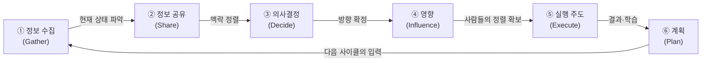

<figure class="post-figure post-figure--header">
<svg role="img" aria-label="개발자의 산출물과 매니저의 산출물을 좌우로 대비한 그림. 왼쪽에는 'Merged'로 표시된 PR 카드 한 장에 코드 줄과 초록색 체크 도장이 찍혀 있어, 손에 잡히는 눈에 보이는 산출물을 나타낸다. 오른쪽에는 사람을 뜻하는 여러 개의 점들이 점선 화살표와 대화 말풍선, 원형 회의 테이블로 어지럽게 이어져 있어, 하루가 대화와 판단으로 채워지지만 손에 잡히는 결과물은 남지 않는 매니저의 눈에 보이지 않는 산출물을 나타낸다." viewBox="0 0 680 300" xmlns="http://www.w3.org/2000/svg">
  <title>개발자의 '눈에 보이는 산출물'(코드/PR)과 매니저의 '눈에 보이지 않는 산출물'(대화·화살표·회의)의 대비</title>

  <defs>
    <marker id="eld-arrow" viewBox="0 0 10 10" refX="8" refY="5" markerWidth="6" markerHeight="6" orient="auto-start-reverse">
      <path d="M0,0 L10,5 L0,10 z" fill="var(--secondary-color)"/>
    </marker>
  </defs>

  <!-- ===== LEFT: developer's visible deliverable (PR card) ===== -->
  <text x="150" y="30" text-anchor="middle" font-size="12" fill="currentColor" font-weight="700" opacity="0.8">개발자 · 눈에 보이는 산출물</text>

  <!-- PR card -->
  <rect x="46" y="52" width="208" height="196" rx="4" fill="var(--bg-panel)" stroke="currentColor" stroke-width="2"/>
  <!-- title bar -->
  <rect x="46" y="52" width="208" height="34" rx="4" fill="var(--bg-sunken)" stroke="currentColor" stroke-width="2"/>
  <circle cx="66" cy="69" r="5" fill="var(--secondary-color)"/>
  <text x="82" y="73" font-size="11" fill="currentColor" font-weight="700">PR #42 · Merged</text>

  <!-- code lines -->
  <rect x="66" y="104" width="120" height="8" rx="2" fill="currentColor" opacity="0.7"/>
  <rect x="66" y="122" width="168" height="8" rx="2" fill="currentColor" opacity="0.45"/>
  <rect x="86" y="140" width="128" height="8" rx="2" fill="currentColor" opacity="0.45"/>
  <rect x="86" y="158" width="104" height="8" rx="2" fill="currentColor" opacity="0.45"/>
  <rect x="66" y="176" width="140" height="8" rx="2" fill="currentColor" opacity="0.45"/>

  <!-- green merge check seal -->
  <circle cx="210" cy="208" r="26" fill="var(--bg-light)" stroke="var(--secondary-color)" stroke-width="3"/>
  <path d="M197,208 L206,217 L224,197" fill="none" stroke="var(--secondary-color)" stroke-width="4" stroke-linecap="round" stroke-linejoin="round"/>
  <text x="150" y="240" text-anchor="middle" font-size="9.5" fill="currentColor" opacity="0.8">손에 잡히는 결과물</text>

  <!-- divider -->
  <line x1="340" y1="44" x2="340" y2="258" stroke="currentColor" stroke-width="1" opacity="0.25"/>
  <text x="340" y="286" text-anchor="middle" font-size="14" fill="var(--accent-color)" font-weight="700">vs</text>

  <!-- ===== RIGHT: manager's invisible deliverable (talk / arrows / meetings) ===== -->
  <text x="530" y="30" text-anchor="middle" font-size="12" fill="currentColor" font-weight="700" opacity="0.8">매니저 · 눈에 안 보이는 산출물</text>

  <!-- people nodes -->
  <circle cx="420" cy="96" r="11" fill="var(--bg-light)" stroke="currentColor" stroke-width="2"/>
  <circle cx="530" cy="70" r="11" fill="var(--bg-light)" stroke="currentColor" stroke-width="2"/>
  <circle cx="628" cy="118" r="11" fill="var(--bg-light)" stroke="currentColor" stroke-width="2"/>
  <circle cx="446" cy="196" r="11" fill="var(--bg-light)" stroke="currentColor" stroke-width="2"/>
  <circle cx="612" cy="214" r="11" fill="var(--bg-light)" stroke="currentColor" stroke-width="2"/>

  <!-- dashed conversation arrows between people -->
  <path d="M433,92 C470,74 496,72 517,71" fill="none" stroke="var(--secondary-color)" stroke-width="1.8" stroke-dasharray="5 4" marker-end="url(#eld-arrow)"/>
  <path d="M542,74 C576,86 596,98 615,110" fill="none" stroke="var(--secondary-color)" stroke-width="1.8" stroke-dasharray="5 4" marker-end="url(#eld-arrow)"/>
  <path d="M423,109 C432,144 438,166 444,183" fill="none" stroke="var(--secondary-color)" stroke-width="1.8" stroke-dasharray="5 4" marker-end="url(#eld-arrow)"/>
  <path d="M459,192 C520,176 566,150 606,126" fill="none" stroke="var(--secondary-color)" stroke-width="1.8" stroke-dasharray="5 4" marker-end="url(#eld-arrow)"/>
  <path d="M600,210 C550,206 500,202 459,198" fill="none" stroke="var(--secondary-color)" stroke-width="1.8" stroke-dasharray="5 4" marker-end="url(#eld-arrow)"/>

  <!-- speech bubbles -->
  <g>
    <rect x="480" y="112" width="46" height="30" rx="6" fill="var(--bg-panel)" stroke="var(--accent-color)" stroke-width="1.8"/>
    <path d="M494,142 L500,152 L506,142 z" fill="var(--bg-panel)" stroke="var(--accent-color)" stroke-width="1.8"/>
    <circle cx="493" cy="127" r="2.4" fill="currentColor" opacity="0.7"/>
    <circle cx="503" cy="127" r="2.4" fill="currentColor" opacity="0.7"/>
    <circle cx="513" cy="127" r="2.4" fill="currentColor" opacity="0.7"/>
  </g>

  <!-- meeting table (circle of seats) -->
  <circle cx="528" cy="164" r="16" fill="none" stroke="currentColor" stroke-width="1.6" opacity="0.55" stroke-dasharray="3 3"/>

  <text x="530" y="252" text-anchor="middle" font-size="9.5" fill="currentColor" opacity="0.8">대화·판단으로 흩어지는 하루</text>
</svg>
<figcaption>개발자의 산출물은 코드·PR로 증명되지만, 매니저의 산출물은 대화·화살표·회의로 흩어져 손에 잡히지 않는다.</figcaption>
</figure>

## 원문 정보

> - **제목**: Engineering Leaders Day-to-Day Activities
> - **출처**: Effective Engineering Leaders · James Samuel ([softwareleads.substack.com](https://softwareleads.substack.com/p/engineering-leaders-day-to-day-activities))
> - **발행**: 2026-07-10 · 약 8분 분량
> - **원문 링크**: <https://softwareleads.substack.com/p/engineering-leaders-day-to-day-activities>

개발자에서 엔지니어링 매니저로 넘어간 사람이 가장 먼저 부딪히는 위화감 — "나는 오늘 하루 종일 회의만 했는데, 대체 무엇을 만든 거지?" — 을 정면으로 다룬 글이다. 커리어 전환의 심리와 소프트 스킬을 다루므로 `Career-Life`에 담는다.

## 한 줄 요약 (TL;DR)

매니저의 일은 개발자의 산출물처럼 눈에 보이지 않지만, **정보 수집 → 정보 공유 → 의사결정 → 의사결정에 대한 영향 → 실행 주도 → 계획**이라는 예측 가능한 6단계 사이클을 돈다. 이 사이클을 인식하는 순간, 신임 매니저는 자신이 '진짜 일'을 하고 있음을 알게 된다.

## 왜 이 글을 골랐나

개발자로 커리어를 쌓아온 사람에게 매니지먼트는 종종 '커밋 그래프가 비어가는 불안'으로 다가온다. PR, 배포된 기능, 통과한 테스트처럼 손에 잡히는 증거가 사라지고, 하루가 대화와 판단으로만 채워지기 때문이다. 이 글의 미덕은 그 불안을 **"매니저의 업무를 구성 요소로 분해하면 여섯 개의 반복 활동으로 보인다"**는 구조로 해소한다는 점이다.

아래 도표가 이 글의 척추다. 여섯 활동은 선형 리스트가 아니라 **순환 파이프라인**으로 돌고, 각 단계의 품질이 다음 단계의 입력이 된다.

병목은 언제나 **가장 약한 단계**다 — 부실한 정보 수집(①)은 잘못된 의사결정(③)으로, 서툰 정보 공유(②)는 실행 정렬 실패(④·⑤)로 번진다.

이 위키에는 이미 리더십과 팀을 다룬 글이 몇 편 있다 — [팀이 성공해야 개인이 성공한다](/2026/07/06/team-success-individual-success.html)는 '팀 구조를 어떻게 설계하는가', [권한을 위임받은 개발자는 어떻게 성장하는가](/2026/06/23/toss-retrospective-growth-leadership.html)는 '위임 문화 안에서 어떻게 성장하는가'를 다뤘다. 이 글은 그 사이의 빈칸, 즉 **'리더 개인의 하루가 실제로 어떤 활동으로 채워지는가'**를 메운다.

## 핵심 내용

원문은 매니저의 업무를 여섯 개의 반복 활동으로 나눈다. 이 여섯 개는 순서대로 하나의 사이클을 이루고, 각 단계의 품질이 다음 단계의 입력이 된다.

### 1. 정보 수집 (Gather information)

매니저는 엔지니어, 임원, 대시보드, 지표, 장애 등 여러 출처에서 **의도적으로** 데이터를 모아야 한다. 핵심은 노이즈를 걸러내고 흩어진 정보를 하나의 일관된 이해로 종합하는 능력이다. 원문은 이 단계를 사이클의 토대로 본다.

> "Without an accurate grasp of the current state, making great decisions is hard. You might solve the wrong problems, prioritize the wrong work, and miss emerging risks."
>
> (현재 상태를 정확히 파악하지 못하면 좋은 결정을 내리기 어렵다. 엉뚱한 문제를 풀고, 잘못된 일에 우선순위를 두고, 떠오르는 리스크를 놓칠 수 있다.)

### 2. 정보 공유 (Share information)

매니저는 개별 팀의 맥락과 조직 전체의 지식을 잇는 다리다. 특히 정리해고·조직 개편·이탈 같은 **조직 변화 시기**에 이 역할이 결정적이다. 이때는 무엇을 전달하느냐만큼 **어떻게 전달하느냐**가 중요하다 — 어려운 소식일수록 전달 방식이 메시지 자체를 좌우한다.

### 3. 의사결정 (Make decisions)

리더는 우선순위, 사람, 기술 방향, 리스크에 대해 매일 수많은 결정을 내린다. 정보는 늘 불완전하고 선택지는 모호한 것이 정상이다. 원문은 이 능력이 타고나는 것이 아니라 **반복 · 성찰 · 경험을 통해 향상된다**고 본다.

### 4. 의사결정에 대한 영향 (Influence decisions)

영향력은 권한과 다르다. 내가 직접 결정하지 못하는 사안에서, 상대가 트레이드오프를 더 잘 평가하도록 돕는 것이 영향력이다. 이를 위해서는 **다른 팀의 목표 · 제약 · 인센티브**를 이해해야 한다. 원문의 핵심 문장:

> "Many leadership challenges are not fundamentally technical problems."
>
> (많은 리더십 과제는 본질적으로 기술 문제가 아니다.)

결국 실행을 결정하는 것은 사람들의 정렬(alignment)이다.

### 5. 실행 주도 / 방향 설정 (Lead execution & set direction)

매니저는 공동 목표를 향한 경로를 정의하고, 그 목표가 달성될 수 있는 **조건**을 만든다. 여기서 롤 모델링이 결정적이다 — 팀은 리더의 말보다 **행동을 관찰한다**. 방향은 스스로 만들어내기도 하고(떠오르는 니즈를 포착), 조직의 우선순위를 팀 언어로 번역하기도 한다.

### 6. 계획 (Plan)

계획이란 현재 상태에서 원하는 미래 상태로 이동하는 일이다. 분기 계획에 국한되지 않고, 일상의 문제 해결과 개선 활동 전반으로 확장된다. 프로세스 개선, 시스템 마이그레이션, 팀 성장, 성과 조정 — 의미 있는 변화에는 모두 계획이 필요하다.

## 분석과 인사이트

**여섯 단계의 진짜 메시지는 "매니저의 일은 보이지 않을 뿐 존재한다"는 재프레이밍이다.** 개발자의 일은 산출물(deliverable)로 증명되지만, 매니저의 일은 수십 번의 대화와 판단으로 흩어져 있어 하루가 끝나도 손에 잡히는 것이 없다. 원문의 프레임워크는 이 흩어진 활동에 이름을 붙여줌으로써, 신임 매니저가 자기 하루를 '낭비'가 아니라 '여섯 종류의 노동'으로 읽게 만든다. 이것만으로도 이 글의 값은 충분하다.

다만 나는 **여섯 단계를 선형 리스트가 아니라 순환 파이프라인으로 읽어야 한다**고 본다. 원문도 각 단계가 다음 단계의 입력이 됨을 암시한다 — 부실한 정보 수집(1)은 잘못된 의사결정(3)으로, 서툰 정보 공유(2)는 실행 정렬 실패(4·5)로 이어진다. 즉 이 사이클의 **병목은 언제나 가장 약한 단계**다. 회의가 많다고 느껴진다면, 그 회의가 이 여섯 단계 중 어디에 기여하는지 — 혹은 어디에도 기여하지 못하는지 — 를 점검하는 진단 도구로 쓸 수 있다.

가장 공감이 가는 대목은 **"많은 리더십 과제는 기술 문제가 아니다"**이다. 개발자 출신 매니저가 가장 흔히 저지르는 실수는, 조직·정렬의 문제를 기술적으로 풀려는 것이다(더 나은 도구, 더 정교한 프로세스로). 이 글의 4번(영향)과 5번(방향)은 그 함정을 정확히 겨냥한다. 개발자로서의 강점이 매니저로서는 오히려 회피 기제가 될 수 있다는 경고로 읽힌다.

한 가지 아쉬운 점은, 원문이 각 활동의 **'무엇'은 잘 정리했지만 '어떻게 잘하는가'와 '어떻게 시간을 배분하는가'**는 다루지 않는다는 것이다. 여섯 단계에 시간을 어떻게 나눌지, 어떤 단계에서 실패가 가장 치명적인지는 결국 각자의 맥락에서 채워야 할 빈칸이다. 이 글은 지도(map)이지 내비게이션(turn-by-turn)은 아니다.

## 적용 포인트

- **하루를 여섯 통으로 분류해보기.** 오늘 한 활동을 수집 / 공유 / 결정 / 영향 / 실행 / 계획으로 태깅하면, 어디에 시간이 쏠리고 어디가 비어 있는지 즉시 보인다.
- **회의를 사이클로 심문하기.** "이 회의는 여섯 단계 중 무엇에 기여하는가?"에 답할 수 없다면, 그 회의는 줄이거나 없앨 후보다.
- **정보 수집(1)을 의도적 루틴으로 만들기.** 지표·장애·1:1을 수동적으로 받지 말고, "지금 내 현재 상태 인식은 정확한가?"를 주기적으로 자문한다. 사이클의 토대가 부실하면 나머지가 다 흔들린다.
- **어려운 소식일수록 '전달 방식'을 먼저 설계하기.** 무엇을 말할지만큼 어떻게·언제·누구에게 말할지를 준비한다(정보 공유 단계).
- **문제가 조직 정렬 문제인지 기술 문제인지 먼저 판별하기.** 기술로 풀려는 관성을 의심하고, 4번(영향)·5번(방향)의 렌즈를 먼저 대본다.
- **말보다 행동으로 방향을 보이기.** 팀은 리더의 선언이 아니라 관찰 가능한 행동을 모델로 삼는다.

## 마무리

이 글의 가치는 새로운 리더십 이론이 아니라, **이미 하고 있지만 스스로 인정하지 못했던 노동에 이름을 붙여준다**는 데 있다. 개발자에서 매니저로 넘어간 사람이 느끼는 "아무것도 안 만든 것 같은 불안"은, 산출물이 없어서가 아니라 산출물의 형태가 코드에서 대화·판단·정렬로 바뀌었기 때문이다. 여섯 단계 사이클은 그 새로운 산출물을 볼 수 있게 해주는 렌즈다. 매니지먼트를 막 시작했거나 고민 중인 개발자라면, 오늘 하루를 이 여섯 통에 나눠 담아보는 것부터 시작할 만하다.

### 더 읽어보기

- [원문 — Engineering Leaders Day-to-Day Activities (James Samuel)](https://softwareleads.substack.com/p/engineering-leaders-day-to-day-activities)
- [팀이 성공해야 개인이 성공한다](/2026/07/06/team-success-individual-success.html) — 리더가 '팀 구조'를 어떻게 설계하는가 (이 글의 5번 방향 설정과 연결)
- [권한을 위임받은 개발자는 어떻게 성장하는가](/2026/06/23/toss-retrospective-growth-leadership.html) — 위임 문화 속에서 개인이 성장하는 방식 (이 글의 4번 영향·5번 방향의 조직판)
- [노동시장이라는 게임에서 살아남기](/2026/06/22/surviving-in-the-job-market.html) — 개인 기여자 관점의 커리어 포지셔닝, 이 글의 매니저 전환과 대비해 읽기
