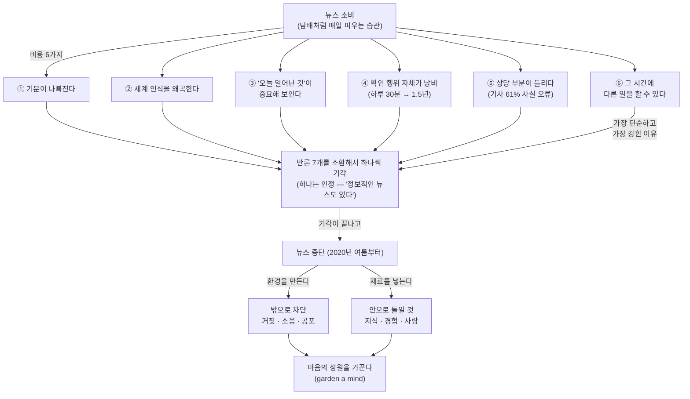

<figure class="post-figure post-figure--header">
<svg role="img" aria-label="뉴스를 담배처럼 물고 피우는 오크의 풍자화. 왼쪽의 오크가 한 손에 말린 신문을 담배처럼 물고 있고, 불붙은 끝에서는 연기 대신 헤드라인 단어(BREAKING, 충격, 위기, 스캔들, 붕괴)가 연기처럼 피어오른다. 오른쪽에는 신문에 빗금을 그은 '무뉴스 구역(NO NEWS)' 표지판이 서 있다. 아래에는 흡연 경고 문구를 패러디한 'READING THE NEWS MAKES YOU FEEL BAD FOR NO REASON' 경고 라벨이 붙어 있다." viewBox="0 0 680 340" xmlns="http://www.w3.org/2000/svg">
  <title>뉴스를 담배처럼 피우는 오크 — 연기 대신 헤드라인이 피어오르고, 무뉴스 구역 표지판과 뉴스 경고 라벨이 붙는다</title>

  <!-- ===== smoke (behind the orc, rises from the lit tip) ===== -->
  <g fill="none" stroke="currentColor" stroke-width="2" stroke-linecap="round">
    <path d="M 335 142 C 316 116 352 96 336 70 C 324 50 344 34 336 16" opacity="0.35"/>
    <path d="M 341 140 C 368 116 340 92 372 64 C 392 46 382 28 396 12" opacity="0.28"/>
    <path d="M 330 144 C 306 122 322 98 300 72" opacity="0.22"/>
  </g>

  <!-- ===== orc bust (front, holding a rolled-up newspaper like a cigarette) ===== -->
  <g>
    <!-- shoulders / torso -->
    <path d="M 96 262 C 104 224 136 208 190 208 C 244 208 276 224 284 262 Z" fill="var(--orc-green)" fill-opacity="0.22" stroke="currentColor" stroke-width="2.5" stroke-linejoin="round"/>
    <!-- ears -->
    <polygon points="112,130 76,102 104,170" fill="var(--orc-green)" fill-opacity="0.24" stroke="currentColor" stroke-width="2" stroke-linejoin="round"/>
    <polygon points="268,130 304,100 276,164" fill="var(--orc-green)" fill-opacity="0.24" stroke="currentColor" stroke-width="2" stroke-linejoin="round"/>
    <!-- head -->
    <path d="M 112 118 L 268 118 L 280 172 L 254 238 L 126 238 L 100 172 Z" fill="var(--orc-green)" fill-opacity="0.3" stroke="currentColor" stroke-width="2.5" stroke-linejoin="round"/>
    <!-- topknot -->
    <rect x="164" y="108" width="52" height="14" rx="4" fill="currentColor" opacity="0.85"/>
    <circle cx="168" cy="100" r="15" fill="currentColor" opacity="0.85"/>
    <circle cx="192" cy="92" r="18" fill="currentColor" opacity="0.85"/>
    <circle cx="216" cy="100" r="15" fill="currentColor" opacity="0.85"/>
    <!-- brow + eyes -->
    <line x1="128" y1="158" x2="172" y2="146" stroke="currentColor" stroke-width="5" stroke-linecap="round"/>
    <line x1="252" y1="158" x2="208" y2="146" stroke="currentColor" stroke-width="5" stroke-linecap="round"/>
    <ellipse cx="150" cy="170" rx="9" ry="5.5" fill="currentColor" opacity="0.8"/>
    <ellipse cx="230" cy="170" rx="9" ry="5.5" fill="currentColor" opacity="0.8"/>
    <!-- nostrils + mouth -->
    <circle cx="182" cy="198" r="3" fill="currentColor" opacity="0.5"/>
    <circle cx="198" cy="198" r="3" fill="currentColor" opacity="0.5"/>
    <line x1="166" y1="216" x2="214" y2="216" stroke="currentColor" stroke-width="2.5" stroke-linecap="round"/>
    <!-- tusks -->
    <path d="M 138 234 C 132 220 132 208 140 198 C 146 208 146 222 150 234 Z" fill="var(--bg-light)" stroke="currentColor" stroke-width="1.8"/>
    <path d="M 242 234 C 248 220 248 208 240 198 C 234 208 234 222 230 234 Z" fill="var(--bg-light)" stroke="currentColor" stroke-width="1.8"/>
    <!-- raised forearm, reaching up past the cheek to grip the roll -->
    <line x1="272" y1="234" x2="296" y2="176" stroke="currentColor" stroke-width="17" stroke-linecap="round"/>
    <line x1="272" y1="234" x2="296" y2="176" stroke="var(--orc-green)" stroke-opacity="0.3" stroke-width="13" stroke-linecap="round"/>
  </g>

  <!-- ===== rolled-up newspaper "cigarette" + holding hand ===== -->
  <g transform="rotate(-26 190 220)">
    <rect x="186" y="210" width="170" height="21" rx="4" fill="var(--bg-panel)" stroke="currentColor" stroke-width="2"/>
    <line x1="194" y1="213" x2="194" y2="228" stroke="currentColor" stroke-width="1.5" opacity="0.45"/>
    <line x1="201" y1="213" x2="201" y2="228" stroke="currentColor" stroke-width="1.5" opacity="0.3"/>
    <line x1="244" y1="216" x2="284" y2="216" stroke="currentColor" stroke-width="1.2" opacity="0.3"/>
    <line x1="244" y1="222" x2="296" y2="222" stroke="currentColor" stroke-width="1.2" opacity="0.3"/>
    <line x1="244" y1="227" x2="276" y2="227" stroke="currentColor" stroke-width="1.2" opacity="0.3"/>
    <!-- fist gripping the shaft, at the mouth end (rotates with it) -->
    <rect x="278" y="204" width="40" height="33" rx="10" fill="var(--orc-green)" fill-opacity="0.34" stroke="currentColor" stroke-width="2"/>
    <line x1="288" y1="210" x2="288" y2="231" stroke="currentColor" stroke-width="1.5" opacity="0.4"/>
    <line x1="298" y1="210" x2="298" y2="231" stroke="currentColor" stroke-width="1.5" opacity="0.4"/>
    <line x1="308" y1="210" x2="308" y2="231" stroke="currentColor" stroke-width="1.5" opacity="0.4"/>
    <!-- lit end -->
    <rect x="342" y="210" width="14" height="21" fill="var(--accent-color)" opacity="0.9"/>
    <circle cx="358" cy="220" r="9" fill="var(--accent-color)" opacity="0.2"/>
    <circle cx="354" cy="220" r="4.5" fill="var(--accent-color)" opacity="0.5"/>
  </g>

  <!-- ===== headline words rising as smoke ===== -->
  <g font-weight="700" fill="currentColor">
    <text x="296" y="64" font-size="10" opacity="0.5">스캔들</text>
    <text x="346" y="42" font-size="10.5" opacity="0.55">붕괴</text>
    <text x="386" y="72" font-size="11" opacity="0.6">위기</text>
    <text x="360" y="100" font-size="10.5" opacity="0.5">충격</text>
    <text x="396" y="26" font-size="11" opacity="0.65" letter-spacing="1">BREAKING</text>
  </g>

  <!-- ===== NO NEWS sign (no-smoking sign parody) ===== -->
  <g>
    <rect x="530" y="176" width="10" height="92" fill="currentColor" opacity="0.75"/>
    <rect x="448" y="58" width="174" height="114" rx="5" fill="var(--bg-light)" stroke="currentColor" stroke-width="2.5"/>
    <!-- the banned item: a folded newspaper -->
    <rect x="484" y="94" width="102" height="40" rx="2" fill="var(--bg-panel)" stroke="currentColor" stroke-width="2"/>
    <line x1="535" y1="96" x2="535" y2="132" stroke="currentColor" stroke-width="1.5" opacity="0.4"/>
    <line x1="492" y1="104" x2="527" y2="104" stroke="currentColor" stroke-width="1.4" opacity="0.45"/>
    <line x1="492" y1="112" x2="521" y2="112" stroke="currentColor" stroke-width="1.2" opacity="0.3"/>
    <line x1="492" y1="119" x2="527" y2="119" stroke="currentColor" stroke-width="1.2" opacity="0.3"/>
    <line x1="543" y1="104" x2="578" y2="104" stroke="currentColor" stroke-width="1.4" opacity="0.45"/>
    <line x1="543" y1="112" x2="572" y2="112" stroke="currentColor" stroke-width="1.2" opacity="0.3"/>
    <line x1="543" y1="119" x2="578" y2="119" stroke="currentColor" stroke-width="1.2" opacity="0.3"/>
    <circle cx="535" cy="112" r="34" fill="none" stroke="var(--accent-color)" stroke-width="4.5"/>
    <line x1="511" y1="88" x2="559" y2="136" stroke="var(--accent-color)" stroke-width="5.5" stroke-linecap="round"/>
    <text x="535" y="164" text-anchor="middle" font-size="14" font-weight="700" letter-spacing="2" fill="var(--accent-color)">NO NEWS</text>
  </g>
  <rect x="492" y="186" width="86" height="19" rx="3" fill="var(--bg-panel)" stroke="currentColor" stroke-width="1.5"/>
  <text x="535" y="199" text-anchor="middle" font-size="12" font-weight="700" fill="currentColor">무뉴스 구역</text>

  <!-- ===== warning-label parody strip ===== -->
  <g>
    <rect x="40" y="270" width="600" height="56" rx="4" fill="var(--bg-sunken)" stroke="currentColor" stroke-width="2"/>
    <rect x="52" y="281" width="86" height="34" rx="3" fill="var(--accent-color)"/>
    <text x="95" y="296" text-anchor="middle" font-size="13" font-weight="700" fill="var(--bg-panel)">경고</text>
    <text x="95" y="309" text-anchor="middle" font-size="7.5" font-weight="700" letter-spacing="1" fill="var(--bg-panel)">WARNING</text>
    <text x="390" y="298" text-anchor="middle" font-size="12.5" font-weight="700" fill="currentColor">READING THE NEWS MAKES YOU FEEL BAD FOR NO REASON</text>
    <text x="390" y="315" text-anchor="middle" font-size="9.5" fill="currentColor" opacity="0.72">담배에 경고 그림이 붙듯, 뉴스에도 언젠가 이런 문구가 붙는다</text>
  </g>
</svg>
<figcaption>뉴스를 담배처럼 피우는 오크 — 입에서는 연기 대신 헤드라인 단어가 피어오른다. 글의 마지막이 상상하는 것처럼, 뉴스에도 언젠가 담배처럼 경고 그림이 붙는다.</figcaption>
</figure>

## 원문 정보

> - **제목**: Reading the news is the new smoking ("I quit. I feel great. You can too.")
> - **출처**: Adam Mastroianni, *Experimental History* (Substack)
> - **발행**: 2022-06-14
> - **원문 링크**: [experimental-history.com](https://www.experimental-history.com/p/reading-the-news-is-the-new-smoking)

이 글은 AI도 코딩도 아니다. 뉴스를 어떻게 '먹을 것인가'라는, 그러니까 **정보 섭취 습관과 주의력 배분**에 관한 에세이다. `Articles` 안에서 AI 이야기만 잔뜩 쌓인 사이, AI와 무관한 '일과 삶'의 주제를 담당하는 `Career-Life`에 단 한 편 두기에 적격이라고 판단했다. 특히 이 위키가 "무엇을 배울지 고르는 일" 자체를 다루는 공간이라는 점에서, **무엇에 주의를 쓸지 고르는 일**은 같은 문제의 다른 얼굴이다.

## 한 줄 요약 (TL;DR)

뉴스 읽기는 흡연과 같다 — 몸에 해롭고, 곁의 사람에게도 간접 피해(2차 분노·불안)를 끼친다. 저자는 2020년 여름 뉴스를 끊었고, 그 이유 여섯 가지와 "그래도 뉴스는 읽어야 하지 않느냐"는 반론 일곱 가지를 차례로 부수며, 결론적으로 **마음을 직접 손볼 수는 없으니 환경을 가꿔라(garden a mind)** 라고 말한다.

이 글을 관통하는 척추는 "뉴스 소비의 비용을 계산하고 → 반론을 하나씩 받아치고 → 그 자리를 정원으로 채운다"는 세 단계다.

여섯 개의 비용이 반론 기각의 재료가 되고, 그 기각이 끝나야 "그 시간을 무엇으로 채울 것인가"라는 정원의 질문이 열린다.

## 왜 이 글을 골랐나

첫째, **설득의 구조가 공부하기 좋다.** 이 글은 "뉴스를 끊었다"는 개인적 선언에서 출발해 이유 여섯 개를 나열하고, 예상 반론 일곱 개를 하나씩 받아 친 뒤, 마지막에 은유로 마무리한다. 논쟁적인 주장을 상대의 반박을 먼저 소환해서 처리하는 이 순서는, 기술적 의사결정 문서에서 흔히 쓰는 형식과 동일하다. 주장의 강도가 아니라 **반론 처리의 밀도**로 설득하는 글을 어떻게 쓰는지 배울 수 있다.

둘째, **개발자의 주의력 문제와 정확히 겹친다.** 뉴스를 "또 하나 확인해야 하는 것"으로 보는 저자의 관점은 메일·알림·슬랙·트위터를 습관적으로 확인하는 개발자의 패턴과 같은 뿌리에서 나온다. 2022년에 쓰인 글이지만, AI가 생성하는 콘텐츠의 양이 폭증한 지금 읽으면 오히려 더 맞닿는다 — 소음이 늘어난 것은 뉴스만이 아니니까.

## 핵심 내용

### 1. 왜 나는 뉴스를 피우지 않는가 — 여섯 가지 이유

저자는 뉴스를 담배에 비유한다. 스트레스나 지루함을 느끼면 담뱃불을 찾던 사람들이 이제는 CNN을 찾는다는 것. 그리고 흡연이 그랬듯 뉴스에도 **간접흡연**이 있다 — 내가 읽고 분노한 것을 옆 사람에게 토해내는 일.

여섯 가지 이유는 이렇다.

- **기분이 나빠진다.** 헤드라인을 읽으면 기분이 나빠지고, 잔인해지고(bloodthirsty), 나쁜 일은 여전히 나쁜 채로 남는다. "걱정 마세요 여러분, 제가 여기 앉아서 여러분 이야기를 읽고 괴로워하고 있겠습니다"라는 자조가 인상적이다.
- **세계 인식을 왜곡한다.** 저자는 2주치의 뉴욕타임스 1면 기사를 색으로 분류했다 — 나쁜 행동은 빨강, 좋은 것은 초록, 둘 다 아니면 회색. 결과는 "신문은 검정, 하양, 그리고 빨강으로 가득하다(the newspaper is black, white, and red all over)"는 말로 요약된다. 살인·사고·자살의 사망자 수를 사람들이 심장질환보다 훨씬 과대평가한다는 그의 연구 결과와 맞물려, 이런 왜곡의 원인이 된다.
- **'오늘 일어난 것'이라는 이유만으로 중요해 보인다.** 스캔들이 몇 날 만에 초신성처럼 터지고 사라진다는 것. 친구가 트럼프 스캔들마다 "이번이 마침내 트럼프를 끝장낼 사건일 것이다"라는 캡션을 단 167개짜리 트윗 스레드를 만든 일은, 그 착각의 축적물 그 자체다.
- **확인 행위 자체가 낭비다.** 메일과 주가를 반복해서 확인하는 것과 같은 습관. 하루 30분씩 18세부터 90세까지 뉴스를 읽으면 547.5일, 즉 1년 반이 통째로 들어간다.
- **상당 부분이 틀리다.** 저자 자신의 연구가 언론에 오보된 경험에서 출발해, 마이클 크라이턴이 붙인 이름 *Gell-Mann Amnesia*(원문 표기는 'Gell-Man')를 인용한다 — 남의 분야 기사의 오류는 알아차리면서, 내 분야 기사는 그 오류를 읽고도 나머지를 믿어버리는 현상. 그가 인용한 대규모 연구에서는 **기사 61%가 사실관계 오류를 포함**했다는 결과가 나온다(사건을 목격한 1차 증언자 기준).
- **그 시간에 다른 일을 할 수 있다.** 가장 단순하고, 가장 강한 이유.

### 2. "그래도 뉴스는 읽어야 하지 않느냐" — 일곱 가지 반론 기각

이 글에서 가장 값진 부분은 여기다. 저자는 자기 주장에 대한 반론을 일곱 개 소환하고, 하나씩 대답한다.

- **"알아야 한다(You have to be informed)."** 알아야 하는 것과 뉴스를 읽는 것은 다르다. 어떤 편집자가 그에게 사사로이 털어놓은 말이 핵심을 찌른다 — 뉴스는 **"똑똑해 보이고 싶은 사람들의 오락(entertainment for people who want to feel smart)"** 이라는 것.
- **"어둠 속에서 민주주의가 죽는다!"** 실제로 뉴스가 민주주의를 지킨 사례가 아니라, 트럼프 1차 경선에서 **20억 달러어토의 무료 보도**를 뉴스가 쏟아낸 사례를 꼽는다. 뉴스가 정치를 조명했다기보다 뉴스가 정치를 키웠다는 반전.
- **"대화 주제에 뒤처진다."** 뒤처져도 별일이 없다는 게 그의 보고다.
- **"세상의 고통에 주의를 기울여야 한다."** 이에 대해선 가장 날카롭게 자기 자신을 판다. 그는 학살·역병·기근에 관한 기사를 들이켰고, 그리고 아무것도 하지 않았다. "그건 미덕이 아니라 관음증이다(That's voyeurism, not virtue)."
- **"뉴스를 읽고 분노해서 바꾼 일도 있었다."** 분노를 무기로 쓰는 방식 자체가 지독하다는 것. 저자는 그것을 최루 가스에 비유하고, 서로 쓰지 않기로 합의하는 상호 군축을 제안한다.
- **"정보적인 뉴스도 있다."** 이 반론은 사실상 인정한다. 좋은 장편 논픽션과 지역 뉴스는 따로 찾지 않아도 트위터나 큐레이션 미디어를 통해 결국 도달한다는 것.
- **"핵미사일이 날아오면 어떻게 할 건데."** 드물게 일어나는 진짜 비상은, 지나치게 자주 울린 경보 때문에 오히려 알아차리지 못한다는 논리다. 그는 브론즈 화재에서 거주자들이 잦은 오경보에 무디어져 19명이 사망한 사례를 인용하며 한 문장으로 정리한다 — **"News becomes noise."**

실제로 그는 뉴스 규칙을 단 한 번 깼다. 2021년 1월 6일. 그리고 즉시 후회했다 — 자기도 다른 사람들처럼 분노하는 공연만 했다는 것을 깨달았기 때문.

일곱 개의 반론과 저자의 답변을 한 장에 모으면, 이 글이 설득을 **밀도**로 하는 글이라는 점이 보인다.

<figure class="post-figure">
<svg role="img" aria-label="일곱 개의 반론과 저자의 답변을 짝지은 대응표. 왼쪽 열에 반론이, 오른쪽 열에 저자의 한 줄 답변이 놓인다. 1 '알아야 한다' → 뉴스는 똑똑해 보이고 싶은 사람들의 오락이다. 2 '민주주의가 죽는다' → 뉴스가 민주주의를 지킨 게 아니라 트럼프에게 20억 달러어치의 무료 보도를 쏟아부었다. 3 '대화에 뒤처진다' → 뒤처져도 별일이 없었다. 4 '세상의 고통에 주의를' → 아무것도 하지 않는 소비는 미덕이 아니라 관음증이다. 5 '분노가 바꾼다' → 분노는 최루 가스와 같아서 상호 군축해야 한다. 6 '정보적인 뉴스도 있다' → 인정. 좋은 논픽션은 결국 도달한다. 7 '핵미사일이 오면' → 자주 울린 경보 때문에 진짜 비상을 못 알아챈다. News becomes noise. 여섯은 기각되고 하나만 인정된다." viewBox="0 0 680 484" xmlns="http://www.w3.org/2000/svg">
  <title>반론 7개와 저자의 답변 — 여섯은 기각, 하나는 인정</title>

  <defs>
    <marker id="ob-arrow" viewBox="0 0 10 10" refX="9" refY="5" markerWidth="6" markerHeight="6" orient="auto-start-reverse">
      <path d="M 0 0 L 10 5 L 0 10 z" fill="var(--secondary-color)"/>
    </marker>
    <marker id="ob-arrow-gold" viewBox="0 0 10 10" refX="9" refY="5" markerWidth="6" markerHeight="6" orient="auto-start-reverse">
      <path d="M 0 0 L 10 5 L 0 10 z" fill="var(--gold)"/>
    </marker>
  </defs>

  <!-- ===== column headers ===== -->
  <text x="190" y="26" text-anchor="middle" font-size="12" font-weight="700" fill="currentColor" opacity="0.75">반론 (Objection)</text>
  <text x="490" y="26" text-anchor="middle" font-size="12" font-weight="700" fill="currentColor" opacity="0.75">저자의 답변 (Answer)</text>

  <!-- ===== rows ===== -->
  <!-- 1 -->
  <g>
    <rect x="26" y="38" width="300" height="52" rx="4" fill="var(--bg-light)" stroke="currentColor" stroke-width="1.8"/>
    <text x="38" y="58" font-size="11" font-weight="700" fill="currentColor">1 · "알아야 한다"</text>
    <text x="38" y="76" font-size="9" fill="currentColor" opacity="0.7">You have to be informed</text>
    <line x1="330" y1="64" x2="356" y2="64" stroke="var(--secondary-color)" stroke-width="2" marker-end="url(#ob-arrow)"/>
    <rect x="360" y="38" width="294" height="52" rx="4" fill="var(--bg-panel)" stroke="var(--border-color)" stroke-width="1.5"/>
    <text x="372" y="58" font-size="10.5" font-weight="700" fill="currentColor">뉴스는 "똑똑해 보이고 싶은</text>
    <text x="372" y="74" font-size="10.5" font-weight="700" fill="currentColor">사람들의 오락"</text>
  </g>
  <!-- 2 -->
  <g>
    <rect x="26" y="98" width="300" height="52" rx="4" fill="var(--bg-light)" stroke="currentColor" stroke-width="1.8"/>
    <text x="38" y="118" font-size="11" font-weight="700" fill="currentColor">2 · "민주주의가 죽는다"</text>
    <text x="38" y="136" font-size="9" fill="currentColor" opacity="0.7">Democracy dies in darkness</text>
    <line x1="330" y1="124" x2="356" y2="124" stroke="var(--secondary-color)" stroke-width="2" marker-end="url(#ob-arrow)"/>
    <rect x="360" y="98" width="294" height="52" rx="4" fill="var(--bg-panel)" stroke="var(--border-color)" stroke-width="1.5"/>
    <text x="372" y="118" font-size="10.5" fill="currentColor">지킨 게 아니라 키웠다 —</text>
    <text x="372" y="134" font-size="10.5" fill="currentColor">트럼프에 <tspan font-weight="700">20억 달러어치 무료 보도</tspan></text>
  </g>
  <!-- 3 -->
  <g>
    <rect x="26" y="158" width="300" height="52" rx="4" fill="var(--bg-light)" stroke="currentColor" stroke-width="1.8"/>
    <text x="38" y="178" font-size="11" font-weight="700" fill="currentColor">3 · "대화 주제에 뒤처진다"</text>
    <text x="38" y="196" font-size="9" fill="currentColor" opacity="0.7">I'll be out of the loop</text>
    <line x1="330" y1="184" x2="356" y2="184" stroke="var(--secondary-color)" stroke-width="2" marker-end="url(#ob-arrow)"/>
    <rect x="360" y="158" width="294" height="52" rx="4" fill="var(--bg-panel)" stroke="var(--border-color)" stroke-width="1.5"/>
    <text x="372" y="178" font-size="10.5" fill="currentColor">뒤처져도 별일이 없었다 —</text>
    <text x="372" y="194" font-size="10.5" fill="currentColor" opacity="0.75">그의 실제 보고</text>
  </g>
  <!-- 4 -->
  <g>
    <rect x="26" y="218" width="300" height="52" rx="4" fill="var(--bg-light)" stroke="currentColor" stroke-width="1.8"/>
    <text x="38" y="238" font-size="11" font-weight="700" fill="currentColor">4 · "고통에 주의를 기울여야"</text>
    <text x="38" y="256" font-size="9" fill="currentColor" opacity="0.7">Pay attention to suffering</text>
    <line x1="330" y1="244" x2="356" y2="244" stroke="var(--secondary-color)" stroke-width="2" marker-end="url(#ob-arrow)"/>
    <rect x="360" y="218" width="294" height="52" rx="4" fill="var(--bg-panel)" stroke="var(--border-color)" stroke-width="1.5"/>
    <text x="372" y="238" font-size="10.5" fill="currentColor">아무것도 하지 않았다 —</text>
    <text x="372" y="254" font-size="10.5" font-weight="700" fill="var(--accent-color)">"미덕이 아니라 관음증"</text>
  </g>
  <!-- 5 -->
  <g>
    <rect x="26" y="278" width="300" height="52" rx="4" fill="var(--bg-light)" stroke="currentColor" stroke-width="1.8"/>
    <text x="38" y="298" font-size="11" font-weight="700" fill="currentColor">5 · "분노가 세상을 바꾼다"</text>
    <text x="38" y="316" font-size="9" fill="currentColor" opacity="0.7">Righteous anger works</text>
    <line x1="330" y1="304" x2="356" y2="304" stroke="var(--secondary-color)" stroke-width="2" marker-end="url(#ob-arrow)"/>
    <rect x="360" y="278" width="294" height="52" rx="4" fill="var(--bg-panel)" stroke="var(--border-color)" stroke-width="1.5"/>
    <text x="372" y="298" font-size="10.5" fill="currentColor">분노는 최루 가스와 같다 —</text>
    <text x="372" y="314" font-size="10.5" font-weight="700" fill="currentColor">상호 군축을 제안</text>
  </g>
  <!-- 6 (the conceded one) -->
  <g>
    <rect x="26" y="338" width="300" height="52" rx="4" fill="var(--bg-sunken)" stroke="var(--gold)" stroke-width="2.2"/>
    <text x="38" y="358" font-size="11" font-weight="700" fill="currentColor">6 · "정보적인 뉴스도 있다"</text>
    <text x="38" y="376" font-size="9" fill="currentColor" opacity="0.7">Some news is informative</text>
    <line x1="330" y1="364" x2="356" y2="364" stroke="var(--gold)" stroke-width="2" marker-end="url(#ob-arrow-gold)"/>
    <rect x="360" y="338" width="294" height="52" rx="4" fill="var(--bg-sunken)" stroke="var(--gold)" stroke-width="2.2"/>
    <text x="372" y="358" font-size="10.5" font-weight="700" fill="var(--accent-color)">인정 (Concede)</text>
    <text x="372" y="376" font-size="10.5" fill="currentColor">좋은 논픽션은 결국 도달한다</text>
  </g>
  <!-- 7 -->
  <g>
    <rect x="26" y="398" width="300" height="52" rx="4" fill="var(--bg-light)" stroke="currentColor" stroke-width="1.8"/>
    <text x="38" y="418" font-size="11" font-weight="700" fill="currentColor">7 · "핵미사일이 날아오면?"</text>
    <text x="38" y="436" font-size="9" fill="currentColor" opacity="0.7">What about emergencies</text>
    <line x1="330" y1="424" x2="356" y2="424" stroke="var(--secondary-color)" stroke-width="2" marker-end="url(#ob-arrow)"/>
    <rect x="360" y="398" width="294" height="52" rx="4" fill="var(--bg-panel)" stroke="var(--border-color)" stroke-width="1.5"/>
    <text x="372" y="418" font-size="10.5" fill="currentColor">잦은 오경보에 무디어져</text>
    <text x="372" y="434" font-size="10.5" font-weight="700" fill="currentColor">진짜 비상을 못 알아챈다</text>
  </g>

  <!-- ===== bottom tally band ===== -->
  <rect x="26" y="460" width="628" height="18" rx="3" fill="var(--bg-sunken)" stroke="none"/>
  <text x="340" y="473" text-anchor="middle" font-size="11" font-weight="700" fill="currentColor">여섯 개는 기각 — 하나만 인정</text>
</svg>
<figcaption>반론 일곱 개, 답변 일곱 개 — 여섯은 기각되고 하나만 인정된다. 패배 하나를 인정한 것이 나머지 여섯의 신뢰도를 올린다(본문 "넷째" 인사이트).</figcaption>
</figure>

### 3. 마음을 가꾸는 법 (How to garden a mind)

마지막은 비유다. 마음은 정원과 같다. 밖으로 차단할 것 — 거짓, 소음, 공포. 안으로 들여놓을 것 — 지식, 경험, 사랑. 그리고 정원사가 직접 식물을 잡아당겨 자라게 하지 못하듯, **"이마의 전두엽을 잡아당긴다고 똑똑해지지는 않는다."** 할 수 있는 일은 환경을 만드는 것뿐이고, 뇌의 주름이 깊어지기를 바라는 것뿐이라는 말로 끝난다.

마무리에선 뉴스가 담배의 운명을 따라가는 상상을 그린다 — 담배처럼 뉴스에도 경고 그림이 붙고, 실내 흡연이 금지되듯 뉴스도 구역이 나뉘고, 교실 뒤에서 월스트리트저널을 몰래 거래하는 반항기 넘치는 청소년들. "READING THE NEWS MAKES YOU FEEL BAD FOR NO REASON"이라는 문구가 붙은 경고 그림. 그렇게 되면 실내 공간, 즉 **우리 각자의 머릿속**이 정화된다는 것. 그는 그때까지 "밖에서 나무 옆에 서 있겠다"며 글을 닫는다.

## 분석과 인사이트

여기서부터는 원문이 아니라 내 관점이다.

**첫째, 이 글의 실제 논점은 '뉴스'가 아니라 '주의력의 회계'다.** 표면적으로는 뉴스 폐지론이지만, 골격은 소비 항목 하나의 비용을 정확히 계산해보자는 것이다. 547.5일이라는 계산이 그 대표 사례다. 개발자에게도 같은 계산이 성립한다 — 알림을 확인하는 30초, 슬랙을 훑는 5분, 트위터를 도는 20분. 각각은 무해해 보여도 곱하기 365일이 되면 커리어의 한 단락이 된다. 뉴스에 반대하는 글이 아니라 **무료처럼 보이는 습관의 총비용을 계산해보라**는 글로 읽는 편이 맞다고 본다.

**둘째, "오늘 일어난 것"만으로 중요해 보인다는 지적은 정보 설계의 문제다.** 뉴스의 정렬 기준은 중요도가 아니라 최신성이다. 이건 데이터 분야에서 늘 겪는 일과 정확히 같은 구조다 — 대시보드에 최근 24시간의 변동이 상단에 있고, 진짜 중요한 추세는 스크롤 아래에 있다. 저자가 2주치 1면을 색으로 칠해본 것이 좋은 실험인 이유는, **시간이 지나도 남는 기사가 무엇인지**를 노이즈와 분리해서 보여주기 때문이다. 이 실험은 뉴스가 아니라 나의 정보 소비 목록에 그대로 적용할 수 있다.

**셋째, "관음증이지 미덕이 아니다"는 이 글에서 가장 무겁고, 가장 동의하기 어려운 문장이다.** 나는 이 문장에 절반은 동의하고 절반은 저항한다. 동의하는 쪽 — 아무 행동으로도 이어지지 않는 소비가 분노를 갱신하고 무력감을 재생산한다는 진단은 정확하다. 저항하는 쪽 — 그러나 인식과 행동 사이의 거리를 '위선'으로 단정하면, 세상을 알아차리는 것 자체의 가치를 과소평가하게 된다. 저자도 결국 "세상의 고통은 행동으로 대응하라"는 쪽을 버리지 않았다. 그의 진짜 주장은 **뉴스를 읽는 것이 행동의 대체재가 되어서는 안 된다**로 읽는 편이 공정하다고 본다.

**넷째, 반론을 미리 소환해서 부수는 구성은 논쟁적 주장을 쓰는 템플릿으로 그대로 배울 수 있다.** 기술 블로그에서 "X는 쓰레기다"식 글이 실패하는 이유는 대개 반론을 상대의 최강 형태로 옮겨놓지 않았기 때문이다. 이 글은 일곱 개의 반론 중 하나("정보적인 뉴스도 있다")는 **인정**까지 하고 넘어간다. 패배 하나를 인정하는 것이 오히려 나머지 여섯 개의 신뢰도를 올린다는 것 — 설득에서 흔히 놓치는 포인트다.

**다섯째, 한계도 분명하다.** 이것은 데이터가 아니라 한 사람의 자기 실험 보고다. 61%라는 수치나 과대평가 연구는 인용일 뿐이고, "끊고 나서 기분이 좋아졌다"는 증언은 생존 편향의 가능성을 배제할 수 없다 — 뉴스를 끊어도 괜찮은 직업과 안전망을 가진 사람의 보고라는 점. 그리고 2022년 글이므로, 지금의 피드·추천 알고리즘·AI 생성 콘텐츠 환경과는 조건이 다르다. 그래서 이 글은 "법칙"이 아니라 **"한 번쯤 시도해볼 만한 자기 실험의 설계도"** 로 읽는 게 맞다고 본다.

## 적용 포인트

- **내 정보 소비에 뉴스 1면 실험을 돌려본다.** 최근 2주간 내가 읽은 글·영상 목록을 만들고, "3개월 뒤에도 남아 있을 것"과 "오늘 화제였기 때문에 읽었던 것"으로 나눠본다.
- **확인 비용을 하루 단위로 계산해본다.** 뉴스·알림·피드 확인에 하루 몇 분이 드는지 기록하고, 그 숫자에 365를 곱해본다. 547.5일 계산은 그대로 옮겨 쓸 수 있는 프레임이다.
- **'알아야 한다'를 '언제 쓸지 모른다'로 정확히 바꿔 말한다.** 정보를 축적하는 이유가 실제 사용 시점과 연결되지 않으면, 그건 오락이다. 오락 자체가 나쁜 게 아니라, 오락을 의무라고 부르는 것이 문제다.
- **분노를 유발하는 소스를 2차 흡연으로 취급한다.** 내가 읽고 옆 사람에게 토해내는 것이 간접흡연이라는 프레임은, 팀 채널에서 무엇을 공유할지 고르는 기준으로도 쓸 만하다.
- **마음의 정원에서 '밖으로 차단할 것 / 안으로 들일 것'을 각각 세 개씩 적어둔다.** 저자의 리스트(거짓·소음·공경 / 지식·경험·사랑)를 따라하지 말고 내 목록을 만드는 것이 이 글의 실제 실천이다.

## 마무리

이 글의 힘은 결론의 급진성이 아니라, 논증의 순서에 있다. 이유 여섯 개를 나열하고, 반론 일곱 개를 하나씩 받아치고, 하나는 인정하고, 마지막에 비유로 정원을 가꾼다. 뉴스를 끊으라는 결론에 동의하든 아니든, **내 주의력의 회계장부를 한 번은 직접 계산해보라**는 요구는 그대로 남는다. 담배가 실내에서 금지되기까지 수십 년이 걸렸다. 정보 소비의 '금연 구역'이 생기려면 더 오래 걸리겠지만, 그 구역은 굳이 사회가 선포해주지 않아도 내 머릿속에 먼저 만들 수 있다.

### 더 읽어보기

- [원문 — Reading the news is the new smoking (Adam Mastroianni, Experimental History)](https://www.experimental-history.com/p/reading-the-news-is-the-new-smoking)
- [모호한 의견에서 본질을 찾기: 문제 정의와 Principal Engineer의 사고 방식](/2026/07/31/problem-framing-principal-engineer.html) — 소음 속에서 본질을 골라내는 사고법. "무엇에 주의를 쓸지"의 기술적 버전
- [노동시장이라는 게임에서 살아남기](/2026/06/22/surviving-in-the-job-market.html) — 내 자원(시간·주의력)을 어디에 투입할지에 대한 같은 질문의 커리어 버전
- [AI가 우리의 실력을 망치고 있는가: 의사·개발자의 '탈숙련(deskilling)'을 다룬 Nature 기사](/2026/06/23/is-ai-ruining-our-skills.html) — 편리한 소비가 실력을 잠식하는 경로. 이 글의 '편리한 습관의 비용' 논점과 이어짐
- [취향과 판단, 그리고 AI](/2026/08/04/taste-judgment-and-ai.html) — 무엇을 골라들지 고르는 취향이 곧 실력이라는 관점. 정보 다이어트의 전제 조건
