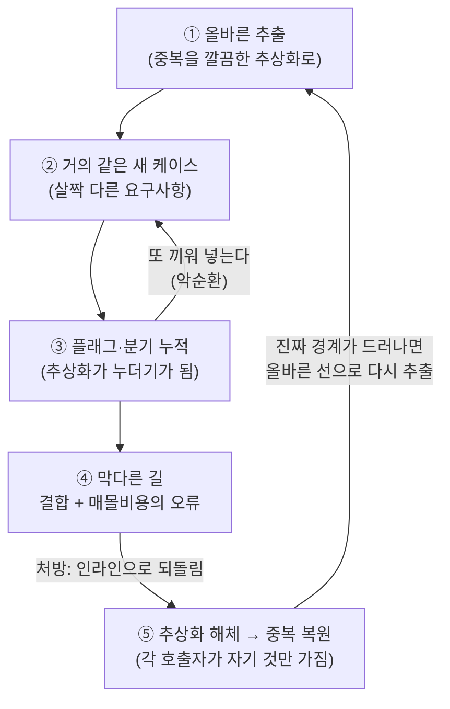

<figure class="post-figure post-figure--header">
<svg role="img" aria-label="무너지기 직전의 금이 간 거대한 단일 기둥을 떠받친 오크 전사. 기둥에는 여러 호출자가 묶여 있고, 발밑에는 '매몰비용'이라 적힌 돌무더기가 전사를 짓누른다." viewBox="0 0 640 320" xmlns="http://www.w3.org/2000/svg">
  <title>잘못된 추상화라는 거대한 기둥과 매몰비용에 짓눌린 오크 전사</title>
  <!-- ground -->
  <line x1="40" y1="284" x2="600" y2="284" stroke="currentColor" stroke-width="3" opacity="0.5"/>

  <!-- the towering monolithic pillar (the wrong abstraction), leaning / cracking -->
  <g transform="rotate(-4 400 180)">
    <rect x="356" y="36" width="92" height="240" fill="var(--bg-sunken)" stroke="currentColor" stroke-width="3"/>
    <!-- capital + base -->
    <rect x="344" y="24" width="116" height="16" fill="var(--secondary-color)" stroke="currentColor" stroke-width="3"/>
    <rect x="344" y="270" width="116" height="14" fill="var(--secondary-color)" stroke="currentColor" stroke-width="3"/>
    <!-- accumulated flags / branches bolted on (the patched conditionals) -->
    <rect x="362" y="64" width="80" height="14" fill="none" stroke="currentColor" stroke-width="2" opacity="0.8"/>
    <rect x="362" y="92" width="80" height="14" fill="none" stroke="currentColor" stroke-width="2" opacity="0.8"/>
    <rect x="362" y="120" width="80" height="14" fill="none" stroke="currentColor" stroke-width="2" opacity="0.8"/>
    <rect x="362" y="148" width="80" height="14" fill="none" stroke="currentColor" stroke-width="2" opacity="0.8"/>
    <rect x="362" y="176" width="80" height="14" fill="none" stroke="currentColor" stroke-width="2" opacity="0.8"/>
    <!-- cracks: it is about to fail -->
    <polyline points="402,40 392,80 408,110 396,150 410,196 398,236" fill="none" stroke="var(--accent-color)" stroke-width="3"/>
    <polyline points="402,110 378,124" fill="none" stroke="var(--accent-color)" stroke-width="3"/>
    <polyline points="396,150 424,168" fill="none" stroke="var(--accent-color)" stroke-width="3"/>
  </g>

  <!-- caller threads bound to the single pillar (coupling) -->
  <g stroke="var(--accent-color)" stroke-width="2" fill="none" opacity="0.9">
    <path d="M356 70 C 320 70, 300 60, 286 52"/>
    <path d="M356 110 C 316 112, 296 120, 282 128"/>
    <path d="M356 170 C 318 174, 298 188, 286 200"/>
    <path d="M448 96 C 492 92, 514 80, 528 70"/>
    <path d="M448 150 C 494 152, 516 164, 530 176"/>
  </g>
  <g fill="var(--accent-color)">
    <circle cx="282" cy="50" r="6"/>
    <circle cx="278" cy="130" r="6"/>
    <circle cx="282" cy="202" r="6"/>
    <circle cx="532" cy="68" r="6"/>
    <circle cx="534" cy="178" r="6"/>
  </g>

  <!-- orc warrior straining to hold it up -->
  <g stroke="currentColor" stroke-width="4" fill="var(--secondary-color)" stroke-linecap="round" stroke-linejoin="round">
    <!-- head -->
    <circle cx="180" cy="150" r="20" fill="var(--orc-green)"/>
    <!-- tusks -->
    <path d="M172 160 l-3 8 M188 160 l3 8" fill="none"/>
    <!-- torso bent under load -->
    <path d="M180 170 L176 224" fill="none"/>
    <!-- arms pushing up at the pillar base -->
    <path d="M180 182 L214 150 M180 188 L214 162" fill="none"/>
    <!-- legs braced -->
    <path d="M176 224 L156 276 M176 224 L200 276" fill="none"/>
  </g>

  <!-- sunk-cost rubble pinning the warrior down -->
  <g fill="var(--bg-light)" stroke="currentColor" stroke-width="3">
    <rect x="120" y="252" width="40" height="24"/>
    <rect x="150" y="262" width="46" height="22"/>
    <rect x="100" y="266" width="34" height="18"/>
  </g>
  <text x="148" y="270" font-family="Pretendard, sans-serif" font-size="13" font-weight="700" text-anchor="middle" fill="currentColor">매몰비용</text>

  <!-- label for the pillar -->
  <text x="402" y="312" font-family="Pretendard, sans-serif" font-size="13" font-weight="700" text-anchor="middle" fill="var(--accent-color)">잘못된 추상화</text>
</svg>
<figcaption>한 덩어리로 묶었기에 더 못 빼낸다 — 호출자들이 묶인 채 금이 간 거대한 추상화를, 매몰비용에 짓눌린 전사가 차마 무너뜨리지 못한다.</figcaption>
</figure>

## 원문 정보

> - **제목**: The Wrong Abstraction
> - **출처**: Sandi Metz — 개인 블로그 ([sandimetz.com](https://sandimetz.com/)). 저자는 『Practical Object-Oriented Design in Ruby(POODR)』의 저자이자 객체지향 설계 분야의 대표적 강연자다.
> - **발행**: 2016-01-20 · 약 6~7분 분량(짧은 에세이)
> - **원문 링크**: <https://sandimetz.com/blog/2016/1/20/the-wrong-abstraction>

이 글을 Articles에 담는 맥락: 이 위키의 Engineering 시리즈는 [Refactoring](/2026/06/19/refactoring-improving-design.html)·[The Pragmatic Programmer](/2026/06/19/pragmatic-programmer.html) 같은 고전을 통해 "좋은 설계를 어떻게 유지하는가"를 다뤘다. 이 에세이는 그 반대편 — **좋은 의도(DRY)가 어떻게 설계를 망가뜨리는가** — 를 한 문장으로 정리한, 현대 엔지니어링 격언의 출처다.

## 한 줄 요약 (TL;DR)

**중복(duplication)은 잘못된 추상화(the wrong abstraction)보다 훨씬 싸다.** DRY를 지키려다 만든 추상화가 시간이 지나며 점점 더 많은 예외를 떠안아 누더기가 되면, 그때는 차라리 추상화를 **인라인으로 풀어 헤쳐 중복으로 되돌리고**, 거기서 진짜 패턴이 다시 드러나기를 기다리는 편이 낫다.

## 왜 이 글을 골랐나

신입 시절 우리는 "코드 중복은 악"이라고 배운다. 같은 코드가 두 번 보이면 곧장 함수로, 클래스로, 추상화로 묶는 것이 반사신경이 된다. DRY(Don't Repeat Yourself)는 그렇게 거의 종교가 된다.

이 에세이가 고전이 된 이유는, 바로 그 반사신경이 **언제 독이 되는지**를 정확히 짚기 때문이다. 잘못된 추상화는 단순히 "별로인 코드"가 아니다. 그것은 **여러 호출자를 하나의 결합점으로 묶어 두기 때문에**, 시간이 지날수록 빼내기가 더 어려워지는 종류의 부채다. 게다가 그것을 만든 사람일수록 — 노력을 쏟아부었기에 — 그것을 버리지 못한다. 저자는 이 심리를 **매몰비용의 오류(sunk cost fallacy)** 라고 정확히 이름 붙인다.

이 위키에 쌓인 설계 고전들이 "어떻게 추상화를 잘 만들 것인가"를 말한다면, 이 글은 그 정반대 방향에서 같은 진실에 도달한다 — **틀린 추상화를 인정하고 되돌리는 용기**가 좋은 설계의 일부라는 것. [내 소프트웨어의 북극성](/2026/06/22/my-software-north-star.html)이 "아름다운 추상화도 수단일 뿐"이라고 말한 것과 한 줄기다.

### 한눈에 보기 — 추상화의 일생

## 핵심 내용

원문은 짧지만 하나의 또렷한 서사 — **한 추상화가 태어나서 썩어 가는 일생** — 를 따라간다. 그 단계를 정리한다.

### 1. 추상화의 탄생 — 처음엔 옳았다

누군가 코드에서 반복되는 패턴을 발견하고, 그것을 깔끔한 추상화(함수·메서드·클래스)로 추출한다. 이 시점에서는 **추상화가 실제로 옳다.** 중복이 사라지고, 여러 호출자가 하나의 잘 정의된 단위를 공유한다. 모두가 행복하다.

### 2. 새 요구사항 — "거의 같지만 조금 다른" 케이스

시간이 흐르고 새 요구사항이 들어온다. 기존 추상화가 하는 일과 **거의 같지만 살짝 다르다.** 이때 다음 개발자(원작자일 수도, 아닐 수도 있다)는 가장 자연스러운 선택을 한다 — 기존 추상화에 **매개변수(parameter)나 분기(`if`/조건 플래그)를 하나 추가**해서 새 케이스를 끼워 넣는다. 코드 중복을 피했으니 DRY를 지킨 것처럼 느껴진다.

### 3. 반복되는 땜질 — 추상화가 누더기가 된다

이 과정이 한 번으로 끝나지 않는다. 또 다른 "거의 같은" 케이스가 오고, 또 플래그가 붙고, 또 분기가 생긴다. 호출하는 쪽은 점점 많아지고, 추상화 내부는 **조건문과 특수 케이스로 뒤덮인다.** 원래 하나의 일을 하던 단위가 이제는 여러 개의 어렴풋이 비슷한 일을 동시에 하려고 애쓰는, 이해하기 어려운 덩어리가 된다. 이것이 **잘못된 추상화**다.

### 4. 막다른 길 — 그리고 매몰비용의 오류

이 시점이 되면 누구나 코드가 엉망임을 느낀다. 하지만 손대지 못한다. 두 가지 힘이 작동한다.

- **결합(coupling)의 무게**: 추상화가 이미 너무 많은 호출자에게 물려 있어, 건드리면 어디가 깨질지 모른다.
- **매몰비용의 오류(sunk cost fallacy)**: "여기까지 이만큼 투자했는데 이제 와서 버릴 수 없다"는 심리. 이미 들어간 노력 때문에 잘못된 길을 계속 간다.

저자의 통찰은 이 둘이 **악순환**을 만든다는 데 있다. 추상화가 잘못됐을수록 사람들은 그것을 고치기보다 거기에 **케이스를 더 끼워 넣고**, 그럴수록 추상화는 더 잘못되고 더 빼내기 어려워진다.

### 5. 처방 — 추상화를 인라인으로 되돌려라

저자의 해법은 직관에 반한다. **추상화를 다시 인라인(inline)으로 풀어라.** 즉, 추상화를 호출하던 각 지점에 그 코드를 다시 펼쳐 넣어 — 의도적으로 **중복을 되살린다.** 그런 다음 각 호출자에 해당하는 조건 분기를 그 자리로 옮기고, 더 이상 쓰이지 않게 된 추상화의 죽은 가지들을 쳐낸다.

그 결과 코드는 일시적으로 "덜 DRY"해지지만, 각 호출 지점이 **자기에게 필요한 것만** 갖게 되어 다시 이해 가능해진다. 그리고 이렇게 풀어 놓고 보면, 비로소 **진짜 공통 패턴이 새로 드러난다.** 그때 — 처음의 잘못된 선이 아니라 — 올바른 경계를 따라 다시 추상화하면 된다.

### 한 문장으로

이 모든 서사가 응축된 격언이 글의 핵심이다.

> *"중복은 잘못된 추상화보다 훨씬 싸다 — 그러니 잘못된 추상화보다는 차라리 중복을 택하라."*
> ("duplication is far cheaper than the wrong abstraction" / "prefer duplication over the wrong abstraction")

## 분석과 인사이트

여기서부터는 원문 요약이 아니라 내 관점이다.

<figure class="post-figure">
<svg role="img" aria-label="시간에 따른 되돌리기 비용 비교 그래프. 중복은 거의 평평한 선으로 비용이 일정하게 낮게 유지되는 반면, 잘못된 추상화는 호출자가 늘수록 복리로 가파르게 치솟는 곡선을 그린다. 두 선 사이의 벌어지는 간격이 비용 비대칭을 나타낸다." viewBox="0 0 640 360" xmlns="http://www.w3.org/2000/svg">
  <title>중복(평평) vs 잘못된 추상화(복리로 치솟음)의 되돌리기 비용 곡선</title>
  <!-- axes -->
  <line x1="70" y1="40" x2="70" y2="300" stroke="currentColor" stroke-width="3"/>
  <line x1="70" y1="300" x2="600" y2="300" stroke="currentColor" stroke-width="3"/>
  <!-- axis arrows -->
  <polygon points="70,34 65,46 75,46" fill="currentColor"/>
  <polygon points="606,300 594,295 594,305" fill="currentColor"/>
  <!-- axis labels -->
  <text x="64" y="30" font-family="Pretendard, sans-serif" font-size="13" font-weight="700" text-anchor="end" fill="currentColor">되돌리는 비용</text>
  <text x="600" y="324" font-family="Pretendard, sans-serif" font-size="13" font-weight="700" text-anchor="end" fill="currentColor">시간 · 호출자 수 →</text>

  <!-- duplication: near-flat line (local, constant) -->
  <path d="M70 270 C 220 264, 420 262, 590 258" fill="none" stroke="var(--secondary-color)" stroke-width="4"/>
  <text x="500" y="248" font-family="Pretendard, sans-serif" font-size="14" font-weight="700" fill="var(--secondary-color)">중복 — 국소·일정</text>

  <!-- wrong abstraction: compounding curve (global, exponential) -->
  <path d="M70 268 C 250 262, 380 230, 470 150 C 520 104, 560 78, 588 56" fill="none" stroke="var(--accent-color)" stroke-width="4"/>
  <text x="300" y="120" font-family="Pretendard, sans-serif" font-size="14" font-weight="700" fill="var(--accent-color)">잘못된 추상화 — 전역·복리</text>

  <!-- the widening gap between the two -->
  <line x1="560" y1="258" x2="560" y2="72" stroke="currentColor" stroke-width="2" stroke-dasharray="5 5" opacity="0.7"/>
  <text x="572" y="170" font-family="Pretendard, sans-serif" font-size="12" font-weight="700" fill="currentColor" opacity="0.85" transform="rotate(90 572 170)">벌어지는 간격</text>
</svg>
<figcaption>두 부채의 성질이 다르다 — 중복은 비용이 거의 그대로 유지되지만, 잘못된 추상화는 호출자가 늘수록 되돌리는 비용이 복리로 치솟는다. 그 벌어지는 간격이 곧 "왜 중복이 더 싼가"이다.</figcaption>
</figure>

**이 글의 진짜 기여는 "DRY를 하지 마라"가 아니라, 추상화의 비용을 비대칭으로 보게 한 것이다.** 중복과 잘못된 추상화는 둘 다 부채지만 성질이 다르다. 중복은 **국소적(local)** 부채다 — 두 군데가 같다는 사실은 두 군데만 건드리면 되고, 틀려도 영향 범위가 좁다. 반면 잘못된 추상화는 **전역적(global)·결합형** 부채다 — 모든 호출자를 한 점에 묶어 두므로, 잘못을 깨달았을 때 빼내는 비용이 호출자 수에 비례해 커진다. **중복은 시간이 지나도 비용이 거의 그대로지만, 잘못된 추상화는 시간이 지날수록 비용이 복리로 늘어난다.** 그래서 "둘 중 무엇이 더 싼가"가 아니라 "무엇을 되돌리기 쉬운가"로 봐야 한다 — 그리고 되돌리기 쉬운 쪽은 거의 항상 중복이다.

**"추상화를 인라인으로 되돌리라"는 처방은 [리팩터링](/2026/06/19/refactoring-improving-design.html)의 문법으로 읽으면 더 분명해진다.** 우리는 보통 리팩터링을 "중복 → 추상화" 방향으로만 생각하지만, Martin Fowler의 카탈로그에는 `Inline Function`·`Inline Class` 같은 **반대 방향** 수술이 엄연히 들어 있다. Metz의 글은 이 역방향 리팩터링이 단순한 기교가 아니라, **잘못 그은 경계선을 지우고 다시 그릴 수 있는 유일한 길**임을 일러 준다. 추상화를 되돌리는 것은 후퇴가 아니라, 정보가 더 쌓인 지금 시점에서 더 나은 경계를 찾기 위한 **전진**이다.

**가장 날카로운 부분은 심리 진단이다.** 잘못된 추상화가 끈질긴 이유는 기술이 아니라 **사람**에 있다. 매몰비용의 오류는 만든 사람에게만 작동하는 게 아니다. 그 코드를 물려받은 사람도 "기존 구조를 존중해야 한다"는 무언의 압력 아래, 구조를 갈아엎기보다 **플래그를 하나 더 붙이는** 쪽을 택한다. 그게 더 안전해 보이고, 더 빠르고, 남의 설계를 부정하지 않아도 되기 때문이다. 그래서 잘못된 추상화는 **조직적으로 자라난다.** 이 글이 10년 가까이 인용되는 이유는, 기술적 처방보다 이 **"끼워 넣기의 유혹"에 이름을 붙여 준 것**에 있다고 본다.

**다만 균형추도 필요하다. 이 글은 "언제나 인라인하라"가 아니다.** 안정적이고 경계가 선명한 추상화 — 잘 정의된 라이브러리 API, 도메인의 진짜 개념 — 까지 풀어 헤치면 그게 또 다른 손해다. 핵심 신호는 "중복이 보인다"가 아니라 **"하나의 추상화가 서로 무관한 여러 케이스를 조건 플래그로 떠안고 있다"** 는 증상이다. DRY가 노리는 진짜 목표는 코드의 물리적 동일함이 아니라 **지식(knowledge)의 단일 출처**라는 점([Pragmatic Programmer](/2026/06/19/pragmatic-programmer.html)의 원래 정의)을 기억하면 선이 분명해진다 — 우연히 같아 보이는 두 코드를 묶는 것은 DRY가 아니라 잘못된 결합이다.

## 적용 포인트

- **추출을 서두르지 않는다.** 두 번째 등장만으로 곧장 추상화하지 말고, 패턴이 "진짜"인지 한 번 더 본다(Rule of three의 정신). 우연히 비슷한 코드와, 같은 지식의 두 표현을 구분한다.
- **추상화에 플래그/조건이 늘어나면 경보로 받아들인다.** 하나의 함수·클래스에 `if type == ...`, `mode` 플래그, 선택적 매개변수가 쌓이기 시작하면 "거의 같지만 다른" 케이스를 억지로 욱여넣고 있다는 신호다.
- **잘못된 추상화는 인라인으로 되돌린다.** 호출 지점마다 코드를 다시 펼치고, 각자에게 필요한 분기를 그 자리로 옮긴 뒤, 죽은 가지를 친다. 깨끗해진 상태에서 진짜 패턴이 다시 드러나길 기다린다.
- **매몰비용을 의사결정에서 분리한다.** "이미 이만큼 만들었으니"는 코드를 유지할 이유가 되지 못한다. 판단 기준은 "지금부터 이 구조를 안고 갈 비용 vs 되돌릴 비용"뿐이다.
- **물려받은 코드를 고칠 권한을 스스로에게 준다.** 남의 추상화라도 잘못됐다면 플래그를 더 붙이지 말고 구조를 다시 그린다. 기존 설계를 존중하는 것과, 틀린 설계를 영속시키는 것은 다르다.

## 마무리

이 에세이는 한 문장으로 요약된다 — **"중복은 잘못된 추상화보다 싸다."** 우리가 신입 때 배운 "중복은 악"이라는 교리에 정면으로 단서를 다는 말이다. DRY는 여전히 옳지만, 그것을 지키려고 만든 추상화가 누더기가 됐다면, **틀렸음을 인정하고 풀어 헤치는 것**이야말로 좋은 설계자의 규율이다. 코드는 한 번 정하면 끝나는 게 아니라 계속 자라며 진실이 드러나고, 그 새 진실 앞에서 어제의 경계선을 지울 수 있는 용기가 — 결국 — 설계의 일부다.

### 더 읽어보기

- [원문 — The Wrong Abstraction (Sandi Metz, sandimetz.com)](https://sandimetz.com/blog/2016/1/20/the-wrong-abstraction)
- [Refactoring: 동작을 지키며 설계를 개선하는 규율](/2026/06/19/refactoring-improving-design.html) — 추상화를 만드는 방향과 `Inline`으로 되돌리는 방향, 양쪽을 다루는 카탈로그
- [The Pragmatic Programmer (DRY·예광탄·깨진 창문)](/2026/06/19/pragmatic-programmer.html) — DRY의 원래 정의("지식의 단일 출처")로 이 글의 처방을 다시 읽기
- [내 소프트웨어의 북극성 (Loris Cro)](/2026/06/22/my-software-north-star.html) — "아름다운 추상화도 목적이 아니라 수단"이라는 같은 줄기의 관점
