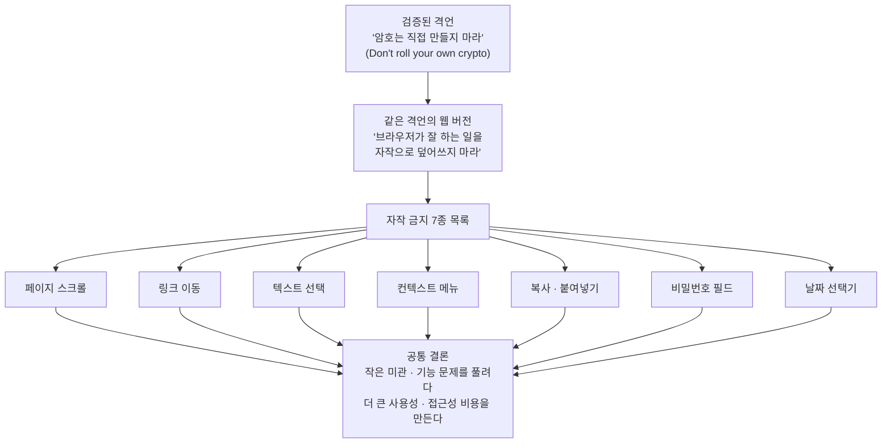

<figure class="post-figure post-figure--header">
<svg role="img" aria-label="왼쪽에는 브라우저가 잘 만들어 준 매끈한 기본 도구 패널(스크롤바·링크·달력·비밀번호 점)이 놓여 있고, 오른쪽에서는 한 개발자가 그 멀쩡한 부품을 치우고 금이 가고 삐걱대는 자작 부품으로 갈아 끼우려 한다. 가운데에는 '직접 만들지 마세요'라는 한 줄 경고가 있다." viewBox="0 0 640 300" xmlns="http://www.w3.org/2000/svg">
  <title>잘 작동하는 브라우저 기본 도구를 삐걱대는 자작 부품으로 갈아 끼우려는 장면</title>

  <!-- ground line -->
  <line x1="36" y1="262" x2="604" y2="262" stroke="currentColor" stroke-width="3" opacity="0.45"/>

  <!-- LEFT: the native toolkit panel — clean, well-made, already in hand -->
  <g>
    <rect x="48" y="70" width="206" height="172" fill="var(--bg-sunken)" stroke="currentColor" stroke-width="3"/>
    <rect x="48" y="70" width="206" height="22" fill="var(--secondary-color)" stroke="currentColor" stroke-width="3"/>
    <text x="151" y="86" font-family="Pretendard, sans-serif" font-size="12" font-weight="700" text-anchor="middle" fill="var(--bg-panel)">브라우저 기본</text>

    <!-- native scrollbar: crisp track + thumb -->
    <rect x="64" y="104" width="16" height="124" fill="none" stroke="currentColor" stroke-width="2"/>
    <rect x="64" y="120" width="16" height="44" fill="var(--secondary-color)"/>
    <polygon points="72,108 67,116 77,116" fill="currentColor"/>
    <polygon points="72,224 67,216 77,216" fill="currentColor"/>

    <!-- native link: tidy underlined chip -->
    <rect x="96" y="108" width="142" height="24" fill="none" stroke="currentColor" stroke-width="2"/>
    <text x="106" y="125" font-family="Pretendard, sans-serif" font-size="12" font-weight="700" fill="var(--secondary-color)">link</text>
    <line x1="106" y1="128" x2="158" y2="128" stroke="var(--secondary-color)" stroke-width="2"/>

    <!-- native date picker: even calendar grid -->
    <rect x="96" y="146" width="142" height="82" fill="none" stroke="currentColor" stroke-width="2"/>
    <line x1="96" y1="164" x2="238" y2="164" stroke="currentColor" stroke-width="2"/>
    <g fill="currentColor">
      <rect x="106" y="174" width="10" height="10"/><rect x="126" y="174" width="10" height="10"/><rect x="146" y="174" width="10" height="10"/><rect x="166" y="174" width="10" height="10"/><rect x="186" y="174" width="10" height="10"/>
      <rect x="106" y="192" width="10" height="10"/><rect x="126" y="192" width="10" height="10"/><rect x="146" y="192" width="10" height="10" fill="var(--accent-color)"/><rect x="166" y="192" width="10" height="10"/><rect x="186" y="192" width="10" height="10"/>
      <rect x="106" y="210" width="10" height="10"/><rect x="126" y="210" width="10" height="10"/><rect x="146" y="210" width="10" height="10"/><rect x="166" y="210" width="10" height="10"/><rect x="186" y="210" width="10" height="10"/>
    </g>
  </g>

  <!-- CENTER: the message + a swap arrow -->
  <g>
    <text x="320" y="44" font-family="Pretendard, sans-serif" font-size="17" font-weight="700" text-anchor="middle" fill="var(--accent-color)">직접 만들지 마세요</text>
    <line x1="278" y1="156" x2="360" y2="156" stroke="currentColor" stroke-width="3"/>
    <polygon points="372,156 356,148 356,164" fill="currentColor"/>
    <text x="320" y="186" font-family="Pretendard, sans-serif" font-size="11" font-weight="700" text-anchor="middle" fill="currentColor" opacity="0.7">갈아 끼우기</text>
  </g>

  <!-- RIGHT: the developer handing over a cracked, wobbly DIY part -->
  <g>
    <!-- developer figure (simple pixel bust) -->
    <rect x="556" y="92" width="36" height="36" fill="var(--bg-sunken)" stroke="currentColor" stroke-width="3"/>
    <rect x="552" y="128" width="44" height="56" fill="none" stroke="currentColor" stroke-width="3"/>
    <!-- extended arm offering the broken part -->
    <line x1="552" y1="150" x2="500" y2="170" stroke="currentColor" stroke-width="3"/>

    <!-- the wobbly DIY widget: a crooked, cracked, mismatched control -->
    <g transform="rotate(7 452 178)">
      <rect x="404" y="142" width="96" height="78" fill="var(--bg-light)" stroke="var(--accent-color)" stroke-width="3"/>
      <!-- crooked scroll thumb that doesn't fit -->
      <rect x="412" y="150" width="14" height="30" fill="none" stroke="var(--accent-color)" stroke-width="2"/>
      <rect x="412" y="158" width="14" height="9" fill="var(--accent-color)"/>
      <!-- broken/jagged calendar cells -->
      <g fill="none" stroke="var(--accent-color)" stroke-width="2">
        <rect x="436" y="152" width="12" height="12"/><rect x="456" y="152" width="12" height="12"/><rect x="476" y="156" width="12" height="9"/>
        <rect x="436" y="176" width="12" height="12"/><rect x="458" y="178" width="9" height="12"/>
      </g>
      <!-- crack across the widget -->
      <polyline points="404,196 432,184 452,206 476,190 500,202" fill="none" stroke="var(--accent-color)" stroke-width="3"/>
      <!-- loose bolts falling off -->
      <circle cx="412" cy="226" r="3" fill="var(--accent-color)"/>
      <circle cx="470" cy="232" r="3" fill="var(--accent-color)"/>
    </g>
    <!-- friction sparks: it grinds -->
    <g stroke="var(--accent-color)" stroke-width="2" opacity="0.8">
      <line x1="500" y1="138" x2="510" y2="128"/>
      <line x1="500" y1="226" x2="510" y2="236"/>
    </g>
  </g>
</svg>
<figcaption>왼쪽엔 브라우저가 이미 잘 다듬어 손에 쥐여 준 기본 도구 — 스크롤바·링크·달력·비밀번호. 오른쪽에선 개발자가 그 멀쩡한 부품을 치우고 금이 간 자작 부품으로 갈아 끼우려 한다. 보안의 "암호는 직접 만들지 마라"를 웹 표면으로 옮긴 한 줄이 이 글의 전부다.</figcaption>
</figure>

## 원문 정보

> - **제목**: Don't Roll Your Own ...
> - **출처**: Susam Pal — 개인 사이트 ([susam.net](https://susam.net/)). 오랜 소프트웨어 개발자이자 보안 분야 경력을 가진 저자의 글쓰기 공간이다.
> - **발행**: 2026-05-23 · 약 6~7분 분량(짧은 에세이/랜트)
> - **원문 링크**: <https://susam.net/do-not-roll-your-own.html>

이 글을 Articles에 담는 맥락: 제목만 보면 흔한 보안 격언 *"Don't roll your own crypto"* 를 다루는 글 같지만, 본문은 그 격언을 **웹 디자인으로 확장**하는 데 초점이 있다. 보안이 아니라 **"플랫폼이 잘 하는 일을 굳이 다시 만들지 마라"는 엔지니어링 관습·문화** 비평이므로 `Engineering-Culture`에 둔다.

## 한 줄 요약 (TL;DR)

보안 업계에 *"암호는 직접 만들지 마라(Don't roll your own crypto)"* 라는 격언이 있듯이, 웹에도 비슷한 격언이 필요하다. **브라우저가 이미 잘 하고 있고 사용자가 매일 의존하는 것 — 스크롤, 링크 이동, 텍스트 선택, 컨텍스트 메뉴, 복사·붙여넣기, 비밀번호 입력, 날짜 선택 — 을 자작 구현으로 덮어쓰지 마라.** 작은 미관·기능 문제를 풀려다 더 큰 사용성·접근성 문제를 만들고, 잦은 UI 개편은 디지털에 덜 익숙한 사용자에게 매번 새 도구를 배우게 하는 비용을 떠넘긴다.

## 왜 이 글을 골랐나

이 글이 영리한 것은 **이미 합의된 규율을 빌려와, 아직 합의되지 않은 영역으로 옮긴다**는 점이다. *"암호는 직접 만들지 마라"* 는 오늘날 거의 모두가 동의하는 격언이다. 검증되지 않은 자작 암호가 사용자의 민감 정보를 위험에 빠뜨린다는 걸 업계가 비싼 대가를 치르며 배웠기 때문이다. 저자는 묻는다 — 그렇다면 **웹 UI에는 왜 비슷한 절제가 없는가?**

깨진 스크롤바가 깨진 암호화만큼 치명적이지 않다는 건 저자도 인정한다. 하지만 둘은 같은 구조의 실수다. 잘 검증된 표준 구현(암호 라이브러리 / 브라우저 네이티브 동작)이 멀쩡히 있는데, **개발자가 자기 손으로 다시 만들겠다고 나서면서 멀쩡하던 것을 망가뜨린다.** 이 위키에는 *"기술적 탁월함보다 사용자 효용이 먼저"* 라는 [내 소프트웨어의 북극성](/2026/06/22/my-software-north-star.html)이나, *"중복보다 잘못된 추상화가 더 비싸다"* 는 [The Wrong Abstraction](/2026/06/22/the-wrong-abstraction.html)처럼 **"좋은 의도가 어떻게 결과를 망치는가"** 를 짚는 글이 여럿 있다. 이 랜트도 같은 줄기다 — 다만 코드의 안쪽이 아니라, **사용자가 매일 만지는 표면**에서 그 이야기를 한다.

저자 스스로 이 글을 "UX 설계 가이드가 아니라, 웹을 쓰는 한 사용자의 한탄"이라고 못박는다. 그 솔직한 위치 선정이 오히려 글을 설득력 있게 만든다.

## 핵심 내용

원문은 하나의 분명한 뼈대를 따라간다 — **검증된 격언(암호) → 같은 격언의 웹 버전 → 절대 자작하지 말아야 할 목록 → 가장 거슬리는 것부터 하나씩 → 마지막으로 "그만 좀 바꿔라"라는 호소.**

### 1. 출발점 — "암호는 직접 만들지 마라"

저자는 익숙한 보안 격언으로 글을 연다. 이 격언은 *"아무도 암호 코드를 짜면 안 된다"* 는 뜻이 아니다. 누군가는 짜야 한다. 핵심은, **사용자의 민감 정보를 지키는 일반 프로덕션 소프트웨어가 검증되지 않은 사설 구현에 의존해서는 안 된다**는 것이다. 가능하면 동료 검토를 거치고 시간의 시험을 통과한 표준 패키지를 써야 한다.

저자는 자기 경력 초기에 직접 만든 RC4 구현들이 부적절한 초기화 벡터, 예측 가능한 키스트림, 평문이 암호문으로 새는 문제로 사용자 데이터를 위험에 빠뜨리는 걸 여러 번 봤다고 회고한다. 다행히 오늘날 주요 전자상거래나 은행은 자작 암호를 쓰지 않는다. 결제·의료·개인정보 같은 규제 영역에서는 자작 암호가 강한 암호화 요구를 위반해 막대한 벌금으로 이어질 수도 있다. 즉 이 영역에서는 **"직접 만들지 마라"가 이미 표준 관행으로 자리 잡았다.**

(이 위키의 [CLI 인증, 제대로 하는 법](/2026/06/20/cli-authentication-the-right-way.html)도 같은 정신이다 — 검증된 표준 흐름이 있는데 자작 인증을 굴리지 말라는 것.)

### 2. 같은 격언이 웹 디자인에도 필요하다

웹 디자인은 암호학이 아니다. 깨진 스크롤바는 깨진 암호화와 같은 종류의 실패가 아니다. 그럼에도 저자는 **웹 디자인에도 비슷한 격언이 있었으면 한다**고 말한다. 특히 X가 **"브라우저가 이미 잘 하는 일이고, 사용자가 매일 의존하는 일"** 일 때, 개발자는 자기만의 X를 만들어선 안 된다는 것이다.

> *"Don't roll your own page scrolling. ... link navigation. ... text selection. ... context menu. ... copy and paste. ... password field. ... date picker."*

저자가 꼽은 "자작하지 마라" 목록은 다음과 같다.

- **페이지 스크롤** (page scrolling)
- **링크 이동** (link navigation)
- **텍스트 선택** (text selection)
- **컨텍스트 메뉴** (context menu)
- **복사·붙여넣기** (copy and paste)
- **비밀번호 입력 필드** (password field)
- **날짜 선택기** (date picker)

저자는 자신이 "아무것도 직접 만들지 말라"고 말하는 게 아니라고 분명히 한다. 본인도 창의적 컴퓨팅을 즐기고 재미있는 도구를 직접 만드는 걸 좋아한다고 밝힌다. 다만 **사람들이 일을 끝내기 위해 반드시 써야 하는 진지한 웹사이트의 UI 기능**에서는, 어떤 화려한 기능을 넣고 무엇을 뺄지 개발 커뮤니티가 더 보수적이기를 바란다고 말한다.

글 전체의 척추를 한 장으로 옮기면 이렇게 흐른다 — 검증된 보안 격언에서 출발해 그 격언의 웹 버전으로, 거기서 "자작하지 마라" 7종 목록으로, 그리고 모두가 같은 결론으로 모인다.

### 3. 가장 거슬리는 것 — 자작 스크롤

저자가 가장 싫어하는 것은 자작 스크롤이다. 마우스·터치패드·키보드에 스크롤이 어떻게 반응하는지 이미 몸에 익었는데, 사이트가 그 기본 동작을 자기 구현으로 덮어쓰면 **페이지가 "망가진다."** 너무 느리거나 너무 빨리 움직이고, 키보드 스크롤은 될 수도 안 될 수도 있다. 생각조차 필요 없던 익숙한 동작을, 이제 의식해야 하는 낯선 동작으로 바꿔 버린다는 것이다.

### 4. 자작 링크 이동 — 그리고 GitHub 사례

두 번째 짜증은 자작 링크 이동이다. 저자는 한 줄로 정곡을 찌른다.

> *"This is the whole reason web browsers even exist."*

링크를 따라가는 것은 브라우저의 본업이다. 그러니 그 동작은 건드릴 필요가 없고, 건드려야 한다고 느낀다면 정말 그럴 만큼 중요한 일인지 다시 생각하라고 한다. 저자는 GitHub을 예로 든다. GitHub에서 파일·이슈 링크를 클릭하면 JavaScript로 구현된 거대한 기능이 클릭을 가로채 처리한다(F12 → Debugger/Sources → Event Listener Breakpoints → Mouse → click으로 확인 가능). 그 결과 **링크를 클릭하면 가끔 로딩이 너무 오래 걸린다.** 역설적으로, 같은 탭에서 JavaScript가 처리하길 기다리는 것보다 **새 탭으로 여는 게 더 빠를 때가 많다**는 것이다.

### 5. 자작 비밀번호 필드 — 보안·접근성 위험

자작 비밀번호 필드는 또 다른 위험이다(다행히 근래에는 드물어졌다). 브라우저 기본 비밀번호 필드는 비밀번호 저장·자동 채움·강력한 비밀번호 생성을 제안하고, 안전하지 않은 HTTP로 전송할 때 경고하며, 비밀번호 관리자·자동 채움·모바일 키보드·접근성 도구와 협력한다. 이걸 가짜 버전으로 갈아 치우면 그 모든 게 깨진다. 더 나쁜 경우, 일반 텍스트 필드를 직접 마스킹해 쓰다가 **브라우저·OS·보조 도구가 그것을 비밀번호가 아니라 평범한 가시 텍스트로 취급해, 의도치 않게 비밀번호가 노출될 수 있다.**

### 6. 자작 날짜 선택기 — 열 사이트, 열 가지 사용법

날짜 선택기는 흔한 골칫거리다. 저자도 `<input type="date">` 가 날짜 **범위**를 못 고른다는 건 인정한다. 하지만 그건 괜찮다 — 시작일·종료일 입력 필드를 둘 두면 된다. 저자는 어디서나 같은 방식으로 달력을 다룰 수만 있다면 입력 필드 두 개쯤 쓰는 작은 대가는 기꺼이 치르겠다고 말한다. 정작 하기 싫은 것은 **열 개 사이트의 열 개 구현에서 열 가지 날짜 선택 방식을 배우는 일**이다.

지금 날짜 선택기 구현은 제각각이다. 어떤 건 연도를 고르려면 월 보기에서 줌아웃해 연 보기로 가야 하고(그 사이 월은 못 바꾼다), 어떤 건 나이가 많으면 '이전 연도' 버튼을 문자 그대로 마흔 번 눌러야 하며, 어떤 건 날짜를 타이핑조차 못 하게 한다. 저자의 결론은 단호하다.

> *"No. I do not want to learn your calendar widget. I just want to use the date picker in my favourite browser, which is quite sane. Saner than your custom implementation."*

저자가 내놓는 절충안이 중요하다 — 네이티브 지원이 부족한 브라우저를 위해 달력 위젯이 필요하다면, 네이티브를 **대체(replace)** 하지 말고 그 **곁에(alongside)** 두라는 것이다. `<input type="date">` 요소는 그대로 두고, 같은 필드를 조작하는 커스텀 위젯을 추가로 제공하면 된다.

### 7. 그만 좀 바꿔라 — 인터페이스 churn

마지막으로 저자는 폼 컨트롤을 그만 건드리라고 한다. 폼 컨트롤은 기존 문제 하나를 풀면서 거의 항상 새 문제를 만든다는 것이다. 그리고 한 가지 호소를 덧붙인다 — **몇 달마다 레이아웃과 인터페이스를 바꾸지 마라.** 본인은 새 디자인에 적응하겠지만, 나이 든 친척들은 그러지 못한다. 그들에게는 UI가 바뀔 때마다 **완전히 새 도구를 배우는 일**이고, 모든 사이트가 몇 달마다 이러면 아무런 기능적 이득도 없이 익숙한 것을 다시 배우느라 막대한 시간을 쓰게 된다.

> *"Please just let them enjoy their retirement."*

저자는 비유로 글을 맺는다. 어떤 리눅스 배포판이 몇 달마다 핵심 명령어와 옵션을 전부 새로 디자인한다면, 혹은 세탁기 버튼이 매일 아침 재배치된다면 기분이 어떻겠느냐고. 유쾌하지 않을 것이다.

## 분석과 인사이트

여기서부터는 원문 요약이 아니라 내 관점이다.

<figure class="post-figure">
<svg role="img" aria-label="자작 구현의 비용 비대칭을 보여 주는 저울 그림. 왼쪽 접시에는 개발자가 한 번 치르는 일회성 비용을 나타내는 작은 동전 하나가 놓여 있고, 오른쪽 접시에는 사용자 한 명 한 명이 모든 사이트에서 매 방문마다 치르는 비용을 나타내는 동전 더미가 가득 쌓여 무겁게 기울어 있다." viewBox="0 0 640 300" xmlns="http://www.w3.org/2000/svg">
  <title>일회성 개발 비용 vs 모든 사용자가 매번 영원히 치르는 사용성 비용의 비대칭</title>

  <!-- balance beam, tipped heavily toward the user side (right) -->
  <line x1="320" y1="56" x2="320" y2="92" stroke="currentColor" stroke-width="4"/>
  <g transform="rotate(11 320 92)">
    <line x1="150" y1="92" x2="490" y2="92" stroke="currentColor" stroke-width="4"/>
    <!-- left pan hanger + pan: developer, once -->
    <line x1="186" y1="92" x2="186" y2="124" stroke="currentColor" stroke-width="2"/>
    <line x1="150" y1="92" x2="186" y2="124" stroke="currentColor" stroke-width="2"/>
    <line x1="222" y1="92" x2="186" y2="124" stroke="currentColor" stroke-width="2"/>
    <path d="M152 124 H220 L210 148 H162 Z" fill="var(--bg-sunken)" stroke="currentColor" stroke-width="3"/>
    <!-- one coin -->
    <ellipse cx="186" cy="124" rx="13" ry="6" fill="var(--secondary-color)" stroke="currentColor" stroke-width="2"/>
    <!-- right pan hanger + pan: every user, forever -->
    <line x1="454" y1="92" x2="454" y2="124" stroke="currentColor" stroke-width="2"/>
    <line x1="418" y1="92" x2="454" y2="124" stroke="currentColor" stroke-width="2"/>
    <line x1="490" y1="92" x2="454" y2="124" stroke="currentColor" stroke-width="2"/>
    <path d="M420 124 H488 L478 148 H430 Z" fill="var(--bg-sunken)" stroke="currentColor" stroke-width="3"/>
    <!-- a heavy stack of coins -->
    <g fill="var(--accent-color)" stroke="currentColor" stroke-width="2">
      <ellipse cx="454" cy="124" rx="22" ry="7"/>
      <ellipse cx="454" cy="116" rx="22" ry="7"/>
      <ellipse cx="454" cy="108" rx="22" ry="7"/>
      <ellipse cx="448" cy="100" rx="16" ry="6"/>
      <ellipse cx="462" cy="96" rx="14" ry="5"/>
      <ellipse cx="452" cy="89" rx="11" ry="5"/>
    </g>
  </g>
  <!-- pivot base -->
  <polygon points="320,52 306,52 320,40 334,52" fill="currentColor"/>
  <polygon points="296,256 344,256 332,232 308,232" fill="currentColor" opacity="0.5"/>
  <line x1="284" y1="256" x2="356" y2="256" stroke="currentColor" stroke-width="3" opacity="0.5"/>

  <!-- labels -->
  <text x="150" y="196" font-family="Pretendard, sans-serif" font-size="13" font-weight="700" text-anchor="middle" fill="var(--secondary-color)">개발자 · 한 번</text>
  <text x="150" y="214" font-family="Pretendard, sans-serif" font-size="11" text-anchor="middle" fill="currentColor" opacity="0.75">일회성 결정</text>

  <text x="490" y="206" font-family="Pretendard, sans-serif" font-size="13" font-weight="700" text-anchor="middle" fill="var(--accent-color)">사용자 한 명 한 명</text>
  <text x="490" y="224" font-family="Pretendard, sans-serif" font-size="11" text-anchor="middle" fill="currentColor" opacity="0.75">매 방문 · 모든 사이트 · 영원히</text>
</svg>
<figcaption>자작의 비용은 비대칭이다 — 개발자는 만들 때 한 번 치르지만, 그것이 만드는 사용성 비용은 사용자 한 명 한 명이 모든 사이트에서 매 방문마다 치른다. "열 사이트, 열 가지 날짜 선택법"이 정확히 이 기울어진 저울이다.</figcaption>
</figure>

**이 글의 진짜 기여는 "자작 = 나쁨"이 아니라, 자작의 비용이 어디에 떨어지는지를 옮겨 보게 한 것이다.** 자작 스크롤이나 자작 날짜 선택기를 만드는 비용은 개발자가 한 번 치른다. 하지만 그것이 만들어 내는 사용성 비용은 **사용자 한 명 한 명이, 방문할 때마다, 영원히** 치른다. 게다가 그 비용은 한 사이트에서 끝나지 않고 사용자가 쓰는 모든 사이트에 걸쳐 누적된다 — "열 사이트, 열 가지 날짜 선택법"이 정확히 그 지점이다. 개발자에게는 일회성 결정이지만 사용자에게는 **분산되고 반복되는 세금**이다. 격언의 형태를 빌린 이유도 여기 있다고 본다. 매번 케이스를 따지는 대신, **"그냥 만들지 마"** 라는 기본값(default)을 세워 이 비대칭을 차단하려는 것이다.

**암호 비유는 장식이 아니라 논증의 핵심이다.** 자작 암호가 위험한 진짜 이유는 코드가 못나서가 아니라, **혼자서는 검증되지 않은 엣지 케이스의 총합**을 감당할 수 없기 때문이다. 브라우저의 네이티브 동작도 똑같다. `<input type="password">` 하나에는 비밀번호 관리자 연동, HTTP 경고, 모바일 키보드, 스크린 리더, 자동 채움이 수십 년간 다듬어져 응축돼 있다. 자작 구현은 그 보이지 않는 누적을 **모두 잃은 채 시작한다.** 두 경우 모두, "내가 다시 만들 수 있다"는 자신감이 실은 **얼마나 많은 것이 이미 해결돼 있는지 모르는 데서** 나온다. 이건 [CLI 인증을 제대로 하는 법](/2026/06/20/cli-authentication-the-right-way.html)이 자작 인증 대신 RFC 표준 흐름을 기본값으로 쓰라고 말한 것과 정확히 같은 교훈이다.

**가장 균형 잡힌 대목은 7번의 절충안이다.** 저자는 "네이티브가 부족하면 그 곁에 커스텀을 두라"고 말한다 — 대체가 아니라 보강(progressive enhancement). 이것이 이 글을 단순한 러다이트적 불평과 갈라놓는다. 핵심 신호는 *"커스텀을 만들었는가"* 가 아니라 *"커스텀이 사용자에게서 네이티브의 선택지를 빼앗았는가"* 다. 네이티브를 살려 두고 그 위에 얹는 것은 사용자에게 **퇴로**를 남긴다. 네이티브를 지우고 자작으로 덮는 것은 **사용자를 당신의 구현에 가둔다.** 좋은 자작과 나쁜 자작을 가르는 선이 여기다.

**다만 한 가지는 짚어 둘 만하다.** 이 글은 의도적으로 "한 사용자의 한탄"으로 스스로를 한정한다. 그래서 디자이너 입장의 정당한 사유 — 브랜드 일관성, 디자인 시스템, 네이티브 컨트롤의 빈약한 커스터마이즈, 크로스 브라우저 편차 — 는 거의 다루지 않는다. 그럼에도 글이 유효한 이유는, 저자가 노리는 표적이 "모든 커스텀"이 아니라 **"이득 없이 익숙한 것을 망가뜨리는 커스텀"** 으로 좁게 겨눠져 있기 때문이다. 이 위키의 [내 소프트웨어의 북극성](/2026/06/22/my-software-north-star.html)이 *"메모리 안전·아름다운 추상화도 결국 사용자 효용을 위한 수단"* 이라고 말했듯, 자작 UI도 그 자체가 목적일 수 없다. 사용자 효용이라는 북극성을 가리키지 못하는 자작은, 아무리 정교해도 잘못된 방향의 노력이다.

## 적용 포인트

- **네이티브를 기본값으로 둔다.** 스크롤·링크·폼 컨트롤·날짜·비밀번호는 별도 사유가 없는 한 브라우저 기본 동작을 그대로 쓴다. "왜 커스텀이 필요한가"의 입증 책임을 자작 쪽에 지운다.
- **대체가 아니라 보강(progressive enhancement)으로 간다.** 커스텀 위젯이 꼭 필요하면 네이티브 입력을 살려 둔 채 그 곁에 얹는다. 사용자에게 네이티브로 돌아갈 퇴로를 남긴다.
- **비밀번호는 절대 자작하지 않는다.** `<input type="password">` 를 텍스트 필드 + 자체 마스킹으로 흉내 내지 않는다. 비밀번호 관리자·자동 채움·접근성·HTTP 경고를 잃고, 평문 노출 위험까지 떠안는다.
- **링크는 브라우저에 맡긴다.** JavaScript로 링크 클릭을 가로채기 전에, 그것이 정상 내비게이션을 깰 만큼 중요한지 다시 묻는다. 네이티브 이동보다 느리고 새 탭 열기보다 굼뜨다면 가로챌 이유가 없다.
- **스크롤 동작을 덮어쓰지 않는다.** 스크롤 속도·관성·키보드 스크롤을 자체 구현으로 바꾸지 않는다. 사용자가 생각 없이 쓰던 것을 의식하게 만드는 순간 이미 손해다.
- **잦은 개편을 비용으로 계산한다.** 몇 달마다 레이아웃을 바꾸기 전에, 적응에 가장 약한 사용자(고령·저숙련)가 치를 재학습 비용을 더한다. 기능적 이득 없는 개편은 사용자에게 세탁기 버튼을 매일 재배치하는 것과 같다.
- **접근성·키보드 사용자를 테스트한다.** 자작 컨트롤을 도입했다면 스크린 리더, 키보드 탐색, 모바일 키보드에서 동작을 반드시 확인한다 — 네이티브가 공짜로 주던 것들이다.

## 마무리

이 글은 한 문장으로 줄여진다 — **브라우저가 이미 잘 하는 일을 굳이 다시 만들지 마라.** *"암호는 직접 만들지 마라"* 가 보안에서 표준이 된 것처럼, 웹에도 같은 절제가 필요하다는 것이다. 자작의 비용은 개발자가 한 번 치르지만, 그 사용성 비용은 사용자가 매번 영원히 치른다. 그래서 핵심은 "커스텀을 만들 수 있느냐"가 아니라 "그 커스텀이 사용자에게서 익숙함과 선택지를 빼앗느냐"다. 진짜로 필요하면 네이티브 곁에 보강으로 얹어 퇴로를 남기고, 그렇지 않다면 — 저자의 표현처럼 — **잘 작동하는 것들을 그냥 그들의 은퇴 생활을 즐기게 내버려 두자.**

### 더 읽어보기

- [원문 — Don't Roll Your Own ... (Susam Pal, susam.net)](https://susam.net/do-not-roll-your-own.html)
- [내 소프트웨어의 북극성 (Loris Cro)](/2026/06/22/my-software-north-star.html) — "기술적 탁월함보다 사용자 효용이 먼저"라는 같은 줄기의 관점
- [잘못된 추상화 (Sandi Metz)](/2026/06/22/the-wrong-abstraction.html) — "좋은 의도가 어떻게 결과를 망치는가"를 코드 안쪽에서 다룬 글
- [CLI 인증, 제대로 하는 법](/2026/06/20/cli-authentication-the-right-way.html) — 자작 대신 검증된 표준을 기본값으로 쓰라는 같은 정신의 보안 사례
