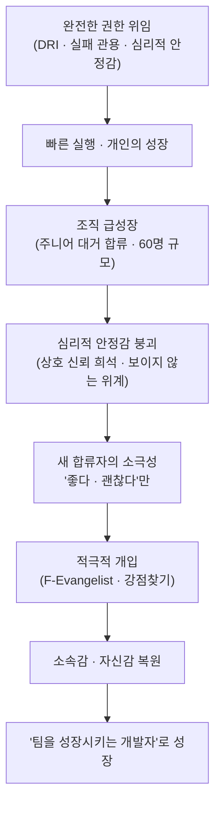

<figure class="post-figure post-figure--header">
<svg role="img" aria-label="권한(DRI)을 쥐고 자기 길을 빠르게 전진하던 개발자가, 조직 급성장으로 생긴 '심리적 거리'의 벽을 만나고, '강점찾기'로 그 벽을 허물어 다시 나아가는 여정을 도트 플랫포머 풍으로 그린 한 장면" viewBox="0 0 640 300" xmlns="http://www.w3.org/2000/svg" shape-rendering="crispEdges">
  <title>권한 위임 → 급성장 위기 → 문화 복원의 여정</title>
  <!-- ground line (the level path) -->
  <rect x="32" y="236" width="576" height="8" fill="currentColor" opacity="0.22"/>
  <g fill="currentColor" opacity="0.16">
    <rect x="40" y="244" width="16" height="16"/><rect x="88" y="244" width="16" height="16"/>
    <rect x="136" y="244" width="16" height="16"/><rect x="280" y="244" width="16" height="16"/>
    <rect x="328" y="244" width="16" height="16"/><rect x="520" y="244" width="16" height="16"/>
    <rect x="568" y="244" width="16" height="16"/>
  </g>

  <!-- STAGE 1: developer with DRI banner, fast forward -->
  <g>
    <!-- speed dashes -->
    <g stroke="var(--accent-color)" stroke-width="4" stroke-linecap="round" opacity="0.7">
      <line x1="36" y1="196" x2="60" y2="196"/>
      <line x1="32" y1="212" x2="52" y2="212"/>
    </g>
    <!-- orc-green head (the developer) -->
    <rect x="76" y="176" width="24" height="24" fill="var(--secondary-color)"/>
    <rect x="80" y="184" width="4" height="4" fill="var(--bg-panel)"/>
    <rect x="92" y="184" width="4" height="4" fill="var(--bg-panel)"/>
    <!-- body -->
    <rect x="78" y="200" width="20" height="28" fill="currentColor"/>
    <!-- legs (stride) -->
    <rect x="78" y="228" width="8" height="8" fill="currentColor"/>
    <rect x="92" y="228" width="8" height="8" fill="currentColor"/>
    <!-- DRI banner pole + flag -->
    <rect x="104" y="148" width="4" height="80" fill="currentColor"/>
    <rect x="108" y="148" width="44" height="28" fill="var(--accent-color)"/>
    <text x="130" y="167" text-anchor="middle" font-size="13" fill="var(--bg-panel)" font-weight="700">DRI</text>
    <text x="92" y="262" text-anchor="middle" font-size="12" fill="currentColor" font-weight="700">자율 · 빠른 실행</text>
  </g>

  <!-- STAGE 2: the wall of 심리적 거리 (org growth) -->
  <g>
    <rect x="300" y="120" width="40" height="116" fill="var(--bg-panel)" stroke="currentColor" stroke-width="3"/>
    <!-- brick courses -->
    <g stroke="currentColor" stroke-width="2" opacity="0.55">
      <line x1="300" y1="148" x2="340" y2="148"/>
      <line x1="300" y1="176" x2="340" y2="176"/>
      <line x1="300" y1="204" x2="340" y2="204"/>
      <line x1="320" y1="120" x2="320" y2="148"/>
      <line x1="320" y1="176" x2="320" y2="204"/>
    </g>
    <text x="320" y="108" text-anchor="middle" font-size="12" fill="currentColor" font-weight="700">심리적 거리</text>
    <text x="320" y="262" text-anchor="middle" font-size="11" fill="currentColor" opacity="0.75">급성장</text>
  </g>

  <!-- STAGE 3: 강점찾기 breaks the wall, path continues up -->
  <g>
    <!-- falling bricks (wall coming down) -->
    <g fill="var(--secondary-color)" opacity="0.85">
      <rect x="352" y="150" width="14" height="14" transform="rotate(18 359 157)"/>
      <rect x="372" y="176" width="14" height="14" transform="rotate(-12 379 183)"/>
    </g>
    <!-- ascending path of stars (strengths) -->
    <path d="M392,212 L444,184 L496,150 L560,108" fill="none" stroke="var(--secondary-color)" stroke-width="4" stroke-linecap="round"/>
    <g fill="var(--gold)">
      <path d="M444,176 l3,7 8,1 -6,5 2,8 -7,-4 -7,4 2,-8 -6,-5 8,-1 z"/>
      <path d="M496,142 l3,7 8,1 -6,5 2,8 -7,-4 -7,4 2,-8 -6,-5 8,-1 z"/>
    </g>
    <!-- destination flag: 소속감 복원 -->
    <rect x="560" y="80" width="4" height="40" fill="currentColor"/>
    <rect x="528" y="80" width="32" height="22" fill="var(--secondary-color)"/>
    <text x="544" y="96" text-anchor="middle" font-size="11" fill="var(--bg-panel)" font-weight="700">★</text>
    <text x="486" y="262" text-anchor="middle" font-size="12" fill="currentColor" font-weight="700">강점찾기 · 소속감 복원</text>
  </g>
</svg>
<figcaption>권한(DRI)을 쥐고 자기 길을 빠르게 달리던 개발자가, 조직 급성장으로 솟은 '심리적 거리'의 벽을 만나고, '강점찾기'로 그 벽을 허물어 다시 위로 나아간다 — 이 글의 여정.</figcaption>
</figure>

## 원문 정보

> - **제목**: 토스에서 일하며 깨달은 성장과 리더십
> - **출처**: Evan Moon (<https://evan-moon.github.io>)
> - **발행**: 2022-05-07 · 약 25~30분 분량
> - **원문 링크**: <https://evan-moon.github.io/2022/05/07/toss-retrospective/>

`Articles` 카테고리는 읽을 만한 외부 글을 골라 핵심을 정리하고 내 관점으로 분석하는 공간이다. 이 글은 개인 회고의 형식을 빌렸지만 내용의 무게중심은 **엔지니어링 조직이 어떻게 빠르게 일하고, 어떻게 사람을 성장시키며, 커지면서 그 힘을 어떻게 잃고 되찾는가**에 있어서 `Engineering-Culture`에 담는다.

## 한 줄 요약 (TL;DR)

토스가 빠르게 일하는 비결은 천재 CEO가 아니라 **권한을 끝까지 위임하는 DRI 문화·실패에 관대한 문화·심리적 안정감**이라는 세 기둥이다. 다만 이 문화는 조직이 급성장하면 자동으로 유지되지 않는다. 저자는 그것이 흔들리는 지점(주니어 합류·심리적 위계)을 진단하고, '강점찾기'라는 적극적 개입으로 소속감을 복원한 경험을 통해 "팀을 성장시키는 개발자"로 한 단계 올라섰다.

## 왜 이 글을 골랐나

이 글 전체를 관통하는 인과 사슬은 하나다 — **위임이 속도와 성장을 낳고, 급성장이 그 토대(심리적 안정감)를 무너뜨리며, 적극적 개입이 그것을 복원한다.**

이 위키에는 "어떻게 더 잘 만들 것인가"를 다루는 기술 글이 많다. 하지만 **그 좋은 개발자들을 빠르게 움직이게 하고 계속 성장시키는 '조직'은 어떻게 만들어지는가**는 상대적으로 비어 있다. 이 글은 흔히 신화처럼 소비되는 "토스는 어떻게 그렇게 일을 빠르게 하는가"라는 질문을, 일하는 당사자의 시선에서 구조적으로 분해한다.

특히 좋은 점은, 토스를 미화하지 않는다는 것이다. 저자는 자율과 책임이라는 빛을 충분히 그리면서도, 조직이 60명 규모로 커지며 그 문화가 어떻게 균열을 일으켰는지, 그리고 그것을 복원하기 위해 자신이 무엇을 시도했고 무엇이 실패했는지까지 정직하게 쓴다. "좋은 문화의 소개"가 아니라 "**좋은 문화를 유지하는 일의 어려움과 노동**"에 대한 기록이라는 점이 이 글의 가치다.

같은 저자의 [노동시장이라는 게임에서 살아남기](/2026/06/22/surviving-in-the-job-market.html)가 "시장에서 나를 어떻게 값으로 증명하는가"라는 개인의 관점이라면, 이 글은 그 개인이 일하는 **조직의 내부 구조**를 들여다본다. 둘은 동전의 양면이다.

## 핵심 내용

원문은 크게 세 단계로 전개된다. **(1) 토스가 빠르게 일하는 세 가지 문화적 기둥**, **(2) 그 문화가 급성장 속에서 흔들린 지점**, **(3) 저자가 시도한 문화 복원 실험**. 아래는 원문의 서사를 따라 재구성한 것이다.

### 1. 빠름의 비밀 — 완전한 권한 위임(DRI)

토스 사람들이 가장 자주 받는 질문은 "토스는 어떻게 그렇게 일해요?"다. 저자는 그 답의 핵심을 **DRI(Directly Responsible Individual, 최종의사결정권자)** 문화에서 찾는다. 의사결정권이 CEO 한 명에게 집중된 것이 아니라 팀 전체에 퍼져 있고, 각 제품의 방향성은 그 제품을 만드는 사일로의 PO가 쥔다.

여기서 인상적인 건, 이 권한이 **신성불가침 영역**처럼 다뤄진다는 점이다. DRI를 맡았다는 것은 동료들이 그 능력을 신뢰한다는 뜻이고, DRI를 잃는다는 것은 신뢰를 잃어 팀에 필요 없는 사람이 된다는 뜻이다. 그래서 모두가 죽기살기로 자기 DRI를 지킨다. CEO조차 권위로 그것을 뒤엎으려 하면 곱게 받아들여지지 않는다.

> "대표가 하라면 해야지…"가 아니라 "니가 뭔데 내 DRI를 위협해"와 같은 반응이 나오기 쉬운 환경

실제로 CEO가 반대한 아이템을 PO가 끝까지 밀어붙여 성공시킨 사례가 쌓이면서 이 문화는 더 단단해진다. 그 결과 쓸데없는 보고·승인 절차가 사라지고, "나 이거 만들래!"라고 결정한 사람이 하루이틀 만에 제품을 만들어 내는 실행 속도가 나온다. 저자는 빠름의 근원을 **완전한 권한 위임**으로 정리한다. 누가 시켜서가 아니라 스스로 아이디어를 내고 키우니, 제품에 대한 애정 자체가 다르다.

### 2. 실패에 관대한 문화 — 단, 그냥 봐주는 게 아니라

토스에는 코어 밸류에 "빨리 실패할 용기를 가지라"는 말이 있었고, 자신의 실패를 전사에 공유하는 Failure Party 같은 행사도 있었다. 핵심은 실패했다는 사실 자체가 아니라 **거기서 무엇을 배웠는지, 그리고 같은 실패가 반복되지 않게 어떻게 공유했는지**에 초점을 맞춘다는 점이다.

저자가 짚는 중요한 통찰은 이것이다. 실패를 두려워하지 않는 문화는 단순히 "실패해도 비난하지 않는 것"으로 만들어지지 않는다는 것. 대부분의 사람은 살아오며 실패를 장려받기보다 경질당하는 경험을 더 많이 했기 때문에, **소극적 무비난이 아니라 적극적인 액션**이 끊임없이 동반되어야 한다. 게다가 문화는 관성을 가져서, 처음부터 빌딩하는 것보다 중간에 바꾸는 데 더 큰 비용이 든다.

### 3. CEO도 문화를 '지키려고 노력한다'

저자는 한 발 더 들어가, 왜 이런 위임이 어려운지를 CEO의 입장에서 설명한다. 술자리에서 흔히 나오는 한탄이 있다.

> "우리 대표는 너무 디테일한 것까지 마이크로매니징을 해서 진짜 피곤해… 우리를 못 믿나…? 이럴거면 날 왜 뽑은거래?"

저자는 이 불만에 공감하면서도, 입장을 바꿔 본다. CEO는 회사가 잘되면 가장 크게 이익을 보지만 망하면 가장 큰 금전적 리스크를 지는 사람이다(원문은 RCPS·전환사채 같은 투자 구조를 들어, 스타트업이 받는 투자가 결코 공짜가 아님을 구체적으로 설명한다). 그런 부담을 진 사람이 직원에게 모든 결정권을 넘기고 실패를 지켜보는 건 결코 쉬운 일이 아니다.

다만 저자가 이 이야기를 꺼낸 의도는 "그러니 마이크로매니징을 이해해 주자"가 아니라 정반대다. **그 큰 리스크를 지고도 사업을 성공시키고 싶다면, CEO부터가 신뢰하고 위임하는 문화를 만들기 위해 노력해야 한다**는 것. 시니어를 영입했다면 그 사람은 그 분야에서 CEO보다 베테랑이고, 사사건건 관여해 능력을 제한하면 유능한 직원은 결국 "어차피 자기 맘대로 할 텐데 뭐"라며 손을 놓거나 회사를 떠난다.

### 4. 급성장이 만든 균열 — 기술 격차가 아니라 심리적 안정감

여기서 글의 분위기가 전환된다. 저자가 입사한 2019년의 프론트엔드 챕터는 약 10명, 서로 신뢰하고 친밀하며 심리적 안정감 속에서 함께 성장하는 조직이었다. 그러나 2020년부터 "NEXT Developer" 같은 주니어 채용 프로그램으로 경험이 적은 개발자들이 대거 합류하며 조직의 성격 자체가 바뀌었다.

새로 온 사람들은 회의에서 대체로 "좋다, 괜찮다"만 말하고 소극적이었다. 저자의 진단이 이 글의 백미다. 그 소극성의 원인은 **기술적 역량 부족이 아니라 심리적 안정감의 부재**였다는 것. 조직이 커지며 상호 신뢰가 옅어졌고, 하드스킬의 차이가 보이지 않는 위계를 만들었으며, 새 합류자는 "내가 이 팀에 기여할 수 있다"는 확신을 갖지 못한 채 입을 닫았다.

### 5. F-Evangelist의 실험 — 실패한 시도와 성공한 시도

저자를 비롯한 개발자들은 관리자가 아니라 '도우미'로서 조직의 친밀도를 높이는 **F-Evangelist** 역할을 만들었다. 첫 시도는 각자의 부끄러운 코드와 실패를 공유하는 **"똥 자랑 대회"**. 재미있는 이름으로 심리적 거리를 낮추려 했지만, 공유되는 실패의 난이도가 높아 하드스킬 수준에 따라 이해도가 갈렸고, 의도한 "심리적 위계 허물기"에는 미치지 못했다.

방향을 튼 두 번째 시도가 **"강점찾기"**다. 디자인 챕터에서 하던 StrengthsFinder 유형의 강점 진단을 프론트엔드에 들여와, 각자가 자신의 **약점이 아니라 강점**을 인식하고 서로의 다양한 강점을 공감하고 기억하게 했다. 핵심 메시지는 "좋은 개발자는 한 가지 모습이 아니라 여러 형태로 존재한다"는 것. 이 프로그램은 참여자들의 자신감을 회복시켰고, 토스 코어를 넘어 다른 계열사와 디자인팀까지 자발적으로 퍼졌다.

### 6. 마치며 — "다른 곳에는 없다는 것을 느낄 때"

2년 반 동안 저자는 "시니어 개발자"의 의미를 머리가 아니라 몸으로 체험했다. 그저 코드를 잘 짜는 개발자가 아니라 **팀을 성장시키는 개발자**가 된 것이다. 이직을 앞둔 면담에서 "언제 토스로 돌아올 것 같냐"는 질문에 그는 이렇게 답한다.

> "내가 다시 돌아온다면, 아마 토스에 있는 것들이 다른 곳에는 없다는 것을 느낄 때일 것 같다"

조직 규모가 커지며 문화가 불가피하게 변했음을 인정하면서도, 새로운 스타트업에서 그 문화를 처음부터 직접 만들어 보겠다는 포부로 글은 끝난다.

## 분석과 인사이트

여기서부터는 원문 요약이 아니라 내 관점이다.

**1. "속도는 통제가 아니라 위임에서 나온다"는 역설.** 직관적으로는 빠르게 가려면 위에서 강하게 끌어야 할 것 같지만, 이 글의 주장은 반대다. 보고·승인이라는 마찰을 제거하고 결정권을 현장에 내려놓을 때 속도가 난다. 이건 [내 소프트웨어의 북극성](/2026/06/22/my-software-north-star.html)이 말하는 "사용자 효용에 집중한 자율적 판단"과 같은 결이고, 잘 설계된 조직에서 **권한과 책임은 분리되지 않고 한 사람에게 붙어 다닌다**는 원칙의 사례다.

**2. DRI는 권한이기 전에 신뢰의 화폐다.** 저자가 DRI를 "신성불가침"이라 부른 대목이 핵심이다. DRI가 강력하게 작동하는 이유는 그것이 단순한 직책이 아니라 **동료들의 신뢰가 응축된 자산**이기 때문이다. 그래서 사람들이 죽기살기로 지킨다. 권한 위임을 도입하려는 조직이 자주 실패하는 이유도 여기 있다. 신뢰의 축적 없이 결정권만 나눠 주면 "위임"이 아니라 "방치"가 된다.

<figure class="post-figure">
<svg role="img" aria-label="같은 '결정권 넘기기'가 신뢰의 축적 위에서는 위임(빛)이 되어 빠른 실행·제품 애정·높은 성장을 낳지만, 신뢰 없이 넘기면 방치(그림자)가 되어 손 놓기·이탈·높은 압력만 남는다는 것을 저울로 그린 그림" viewBox="0 0 640 320" xmlns="http://www.w3.org/2000/svg" shape-rendering="crispEdges">
  <title>같은 결정권 넘기기 — 신뢰 위에서는 위임, 신뢰 없이는 방치</title>
  <!-- the shared act at the top -->
  <rect x="232" y="20" width="176" height="34" fill="var(--bg-panel)" stroke="currentColor" stroke-width="2"/>
  <text x="320" y="42" text-anchor="middle" font-size="14" fill="currentColor" font-weight="700">같은 '결정권 넘기기'</text>

  <!-- fulcrum: trust -->
  <rect x="316" y="54" width="8" height="118" fill="currentColor"/>
  <polygon points="320,172 296,224 344,224" fill="currentColor" opacity="0.85"/>
  <text x="320" y="246" text-anchor="middle" font-size="12" fill="currentColor" font-weight="700">신뢰의 축적</text>
  <text x="320" y="264" text-anchor="middle" font-size="11" fill="currentColor" opacity="0.7">(받침점)</text>

  <!-- beam -->
  <rect x="96" y="150" width="448" height="8" fill="currentColor"/>

  <!-- LEFT PAN: 위임 (the light) -->
  <g>
    <line x1="120" y1="154" x2="120" y2="184" stroke="currentColor" stroke-width="2"/>
    <rect x="48" y="184" width="144" height="92" fill="var(--bg-panel)" stroke="var(--secondary-color)" stroke-width="3"/>
    <text x="120" y="208" text-anchor="middle" font-size="15" fill="var(--secondary-color)" font-weight="700">위임 · 빛</text>
    <text x="120" y="232" text-anchor="middle" font-size="12" fill="currentColor">빠른 실행</text>
    <text x="120" y="250" text-anchor="middle" font-size="12" fill="currentColor">제품 애정</text>
    <text x="120" y="268" text-anchor="middle" font-size="12" fill="currentColor">개인 성장</text>
  </g>

  <!-- RIGHT PAN: 방치 (the shadow) -->
  <g>
    <line x1="520" y1="154" x2="520" y2="184" stroke="currentColor" stroke-width="2"/>
    <rect x="448" y="184" width="144" height="92" fill="var(--bg-panel)" stroke="var(--accent-color)" stroke-width="3"/>
    <text x="520" y="208" text-anchor="middle" font-size="15" fill="var(--accent-color)" font-weight="700">방치 · 그림자</text>
    <text x="520" y="232" text-anchor="middle" font-size="12" fill="currentColor">손 놓기</text>
    <text x="520" y="250" text-anchor="middle" font-size="12" fill="currentColor">유능한 사람 이탈</text>
    <text x="520" y="268" text-anchor="middle" font-size="12" fill="currentColor">높은 압력</text>
  </g>

  <!-- which way it tips depends on trust -->
  <text x="120" y="300" text-anchor="middle" font-size="11" fill="currentColor" opacity="0.8">신뢰가 받치면 →</text>
  <text x="520" y="300" text-anchor="middle" font-size="11" fill="currentColor" opacity="0.8">← 받치지 못하면</text>
</svg>
<figcaption>똑같이 "결정권을 넘겨도", 받침점인 '신뢰의 축적'이 있으면 위임(빛)으로, 없으면 방치(그림자)로 기운다 — 위임과 방치를 가르는 것은 권한의 크기가 아니라 신뢰다.</figcaption>
</figure>

**3. 가장 정직하고 실용적인 통찰 — 좋은 문화는 '유지비'가 든다.** 많은 회사가 "우리는 실패에 관대합니다"를 슬로건으로 내건다. 하지만 저자는 그것이 무비난(non-blame)이라는 소극적 선언으로는 절대 정착되지 않고, Failure Party 같은 **지속적이고 적극적인 액션**이 회사가 망하는 날까지 반복돼야 스며든다고 못 박는다. 문화는 한 번 만드는 자산이 아니라 매일 갚아야 하는 구독료에 가깝다. 이건 조직 문화에 대한 거의 모든 미화된 담론이 빠뜨리는 지점이다.

**4. 급성장기의 진짜 병목은 스킬이 아니라 소속감이다.** 새 합류자의 소극성을 "아직 실력이 부족해서"로 진단했다면 해법은 교육이었을 것이다. 하지만 저자는 그것을 **심리적 안정감의 부재**로 재정의했고, 그래서 해법이 "더 가르치기"가 아니라 "각자의 강점을 보게 하기"가 됐다. 문제를 어떻게 정의하느냐가 해법의 종류를 바꾼다는 좋은 사례다. 그리고 이 진단은 구글의 Project Aristotle이 "팀 성과를 가르는 1순위 요인은 심리적 안정감"이라 결론지은 것과도 맞닿는다.

**5. 다만 한 가지 균형 — 'N=1'의 한계.** 이 글은 한 사람의 회고이고, 토스를 떠나며 쓴 글이다. DRI·실패 관용·심리적 안정감은 강력하지만, "원양어선"이라는 양면적 이미지(높은 업무 강도)를 저자 스스로 언급하듯, 자율과 책임은 동시에 **높은 압력**을 의미하기도 한다. 모든 조직·모든 개인에게 같은 처방이 되진 않는다. 이 글은 "복제할 매뉴얼"이라기보다 "내 조직에 무엇이 빠졌는지 비춰 보는 거울"로 읽는 게 맞다.

원문 요약과 내 분석을 분명히 구분하기 위해 덧붙이면, 위 다섯 항목 중 사실 서술(DRI·강점찾기 등)은 원문에 충실한 것이고, 해석·평가·외부 사례(Project Aristotle, '구독료' 비유 등)는 내 관점이다.

## 적용 포인트

독자가 자기 팀에 바로 적용해 볼 수 있는 항목들이다.

- **결정권을 한 사람에게 명시적으로 붙여라.** "이 사안의 DRI는 누구인가?"를 회의마다 분명히 하면, 합의를 가장한 무책임(아무도 결정 안 함)이 사라진다.
- **위임은 신뢰의 축적 위에서만.** 결정권만 나눠 주지 말고, 그 사람이 신뢰를 쌓을 작은 성공의 경험부터 설계하라. 신뢰 없는 위임은 방치다.
- **"실패해도 괜찮다"를 선언이 아니라 의식(ritual)으로.** 실패 회고를 정례 행사로 만들고, 리더가 자기 실패를 먼저 공유하라. 무비난만으로는 부족하다.
- **합류자의 소극성을 '실력 부족'으로 단정하지 마라.** 먼저 심리적 안정감과 소속감을 의심하라. 진단이 틀리면 해법도 틀린다.
- **약점 교정 대신 강점 가시화부터.** 새 멤버가 "내가 무엇을 못하나"가 아니라 "내가 무엇으로 기여하나"를 먼저 보게 하라. 자신감이 생기면 발언이 따라온다.
- **문화에는 '유지비'를 예산으로 잡아라.** 좋은 문화는 한 번 세우고 끝나는 게 아니라, 조직이 커질수록 더 적극적이고 반복적인 투자를 요구한다.

## 마무리

이 글이 주는 가장 큰 교훈은 "토스가 대단하다"가 아니라 **빠른 실행도, 안전한 실패도, 새 멤버의 성장도 모두 누군가의 의도적인 노동의 결과**라는 사실이다. DRI라는 권한, 실패에 관대한 의식, 심리적 안정감은 가만히 두면 사라지는 휘발성 자산이고, 조직이 커질수록 그것을 지키는 데 더 많은 에너지가 든다. 저자가 "팀을 성장시키는 개발자"로 성장한 과정 자체가, 좋은 코드를 짜는 일과 좋은 조직을 만드는 일이 결국 같은 종류의 정성과 책임을 요구한다는 것을 보여 준다. 시니어로 향하는 길에서 한 번쯤 비춰 볼 만한 거울이다.

### 더 읽어보기

- [원문 — 토스에서 일하며 깨달은 성장과 리더십 (Evan Moon)](https://evan-moon.github.io/2022/05/07/toss-retrospective/)
- [노동시장이라는 게임에서 살아남기 (Evan Moon)](/2026/06/22/surviving-in-the-job-market.html) — 같은 저자가 본 '개인의 시장 가치'. 이 글의 '조직 내부' 관점과 짝을 이룬다
- [내 소프트웨어의 북극성 (Loris Cro)](/2026/06/22/my-software-north-star.html) — 자율적 판단의 기준을 '사용자 효용'에 두는 또 다른 문화론
- [사회생활 생존 꿀팁 30가지](/2026/06/19/social-life-survival-tips.html) — 조직 안에서의 태도·소프트 스킬 계열의 실천 팁
