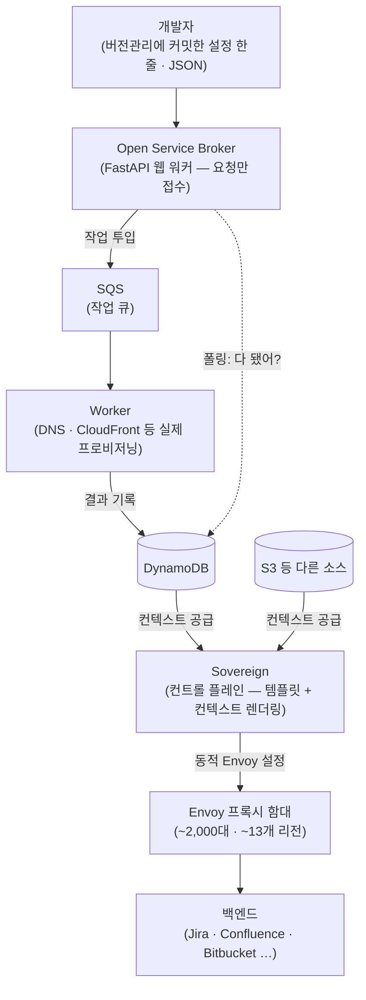
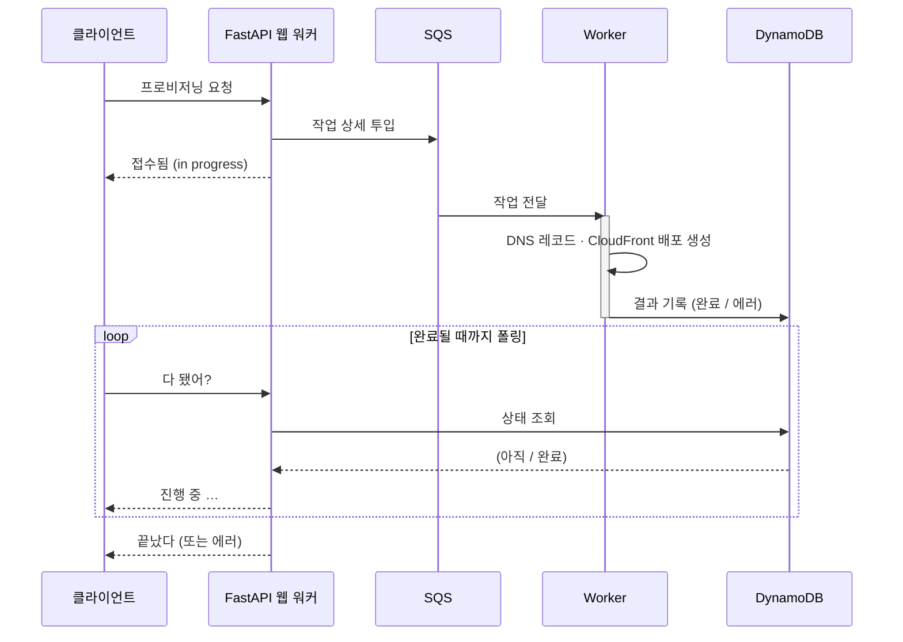

<figure class="post-figure post-figure--header">
<svg role="img" aria-label="한 엔지니어가 8년간 쌓아 올린 엣지 인프라 탑 — 아래에서부터 브로커, 컨트롤 플레인 Sovereign, 약 2,000대의 프록시 함대로 층층이 쌓인 탑 — 을 등지고, 배낭을 멘 채 떠나며 자신이 만든 것을 돌아보는 모습을 도트 플랫포머 풍으로 그린 한 장면" viewBox="0 0 640 300" xmlns="http://www.w3.org/2000/svg" shape-rendering="crispEdges">
  <title>자신이 쌓아 올린 엣지 인프라 탑을 등지고 떠나는 엔지니어</title>
  <!-- ground line (the level path leaving the tower) -->
  <rect x="24" y="252" width="592" height="8" fill="currentColor" opacity="0.22"/>
  <g fill="currentColor" opacity="0.16">
    <rect x="32" y="260" width="16" height="16"/><rect x="80" y="260" width="16" height="16"/>
    <rect x="128" y="260" width="16" height="16"/><rect x="176" y="260" width="16" height="16"/>
    <rect x="520" y="260" width="16" height="16"/><rect x="568" y="260" width="16" height="16"/>
  </g>

  <!-- THE INFRASTRUCTURE TOWER (right side) — 3 stacked layers he built -->
  <g>
    <!-- LAYER 3 (top): the proxy fleet — a row of small pixel proxies -->
    <g fill="var(--secondary-color)">
      <rect x="392" y="60" width="14" height="18"/><rect x="412" y="60" width="14" height="18"/>
      <rect x="432" y="60" width="14" height="18"/><rect x="452" y="60" width="14" height="18"/>
      <rect x="472" y="60" width="14" height="18"/><rect x="492" y="60" width="14" height="18"/>
      <rect x="512" y="60" width="14" height="18"/><rect x="532" y="60" width="14" height="18"/>
    </g>
    <rect x="384" y="82" width="168" height="6" fill="currentColor" opacity="0.4"/>
    <text x="468" y="50" text-anchor="middle" font-size="11" fill="currentColor" font-weight="700">프록시 함대 · ~2,000</text>

    <!-- LAYER 2 (middle): the control plane 'Sovereign' -->
    <rect x="404" y="100" width="128" height="44" fill="var(--bg-panel)" stroke="currentColor" stroke-width="3"/>
    <rect x="416" y="112" width="16" height="20" fill="var(--gold)"/>
    <rect x="438" y="112" width="16" height="20" fill="var(--gold)" opacity="0.7"/>
    <rect x="460" y="112" width="16" height="20" fill="var(--gold)" opacity="0.5"/>
    <text x="468" y="138" text-anchor="middle" font-size="11" fill="currentColor" font-weight="700">Sovereign</text>
    <text x="468" y="160" text-anchor="middle" font-size="10" fill="currentColor" opacity="0.7">컨트롤 플레인</text>

    <!-- LAYER 1 (base): the broker + queue/worker foundation -->
    <rect x="392" y="168" width="152" height="52" fill="var(--bg-panel)" stroke="currentColor" stroke-width="3"/>
    <g stroke="currentColor" stroke-width="2" opacity="0.5">
      <line x1="392" y1="194" x2="544" y2="194"/>
      <line x1="468" y1="168" x2="468" y2="220"/>
    </g>
    <text x="430" y="186" text-anchor="middle" font-size="10" fill="currentColor" font-weight="700">Broker</text>
    <text x="506" y="186" text-anchor="middle" font-size="10" fill="currentColor" font-weight="700">SQS</text>
    <text x="430" y="212" text-anchor="middle" font-size="10" fill="currentColor" font-weight="700">Worker</text>
    <text x="506" y="212" text-anchor="middle" font-size="10" fill="currentColor" font-weight="700">DynamoDB</text>
    <!-- tower base shadow -->
    <rect x="392" y="220" width="152" height="6" fill="currentColor" opacity="0.3"/>
    <text x="468" y="242" text-anchor="middle" font-size="11" fill="currentColor" opacity="0.85" font-weight="700">8년간 쌓아 올린 엣지 인프라</text>
  </g>

  <!-- THE ENGINEER walking away (left), back turned to the tower, looking back -->
  <g>
    <!-- backpack -->
    <rect x="120" y="190" width="14" height="30" fill="var(--accent-color)" opacity="0.85"/>
    <!-- orc-green head (looking back over shoulder, toward the tower → eyes face right) -->
    <rect x="130" y="168" width="24" height="24" fill="var(--secondary-color)"/>
    <rect x="146" y="176" width="4" height="4" fill="var(--bg-panel)"/>
    <rect x="138" y="176" width="4" height="4" fill="var(--bg-panel)"/>
    <!-- body -->
    <rect x="132" y="192" width="20" height="30" fill="currentColor"/>
    <!-- legs (mid-stride, walking left/away) -->
    <rect x="130" y="222" width="8" height="10" fill="currentColor"/>
    <rect x="146" y="222" width="8" height="10" fill="currentColor"/>
    <!-- a single reflective glance: dashed sightline back to the tower -->
    <g stroke="var(--gold)" stroke-width="3" stroke-linecap="round" opacity="0.7" stroke-dasharray="6 8">
      <line x1="158" y1="180" x2="384" y2="150"/>
    </g>
    <text x="142" y="252" text-anchor="middle" font-size="11" fill="currentColor" font-weight="700">떠나며 돌아보다</text>
  </g>
</svg>
<figcaption>8년간 층층이 쌓아 올린 엣지 인프라 탑 — 브로커, 컨트롤 플레인 Sovereign, 약 2,000대의 프록시 함대 — 을 등지고, 한 엔지니어가 배낭을 메고 떠나며 자신이 만든 것을 한 번 더 돌아본다.</figcaption>
</figure>

## 영상 정보

> - **제목**: I was laid off by Atlassian
> - **채널/발표자**: Vasilios Syrakis (개인 채널, 전 Atlassian 플랫폼 엔지니어 · 약 8년 재직)
> - **업로드**: 2026-05-10 · 길이 40분 6초 · 조회수 약 225만 회(정리 시점)
> - **형식**: 본인 1인 내레이션 + 화이트보드(scalardraw) 라이브 드로잉으로 시스템을 직접 그려 가며 설명하는 엔지니어링 워크스루
> - **영상 링크**: <https://www.youtube.com/watch?v=55pTFVoclvE>

`Articles` 카테고리는 읽고 볼 만한 외부 콘텐츠를 골라 핵심을 정리하고 내 관점으로 분석하는 공간이다. 이번엔 정리해고를 계기로 한 엔지니어가 **자기가 만든 시스템 전체를 처음부터 끝까지 그려 보이는 40분짜리 회고 영상**을 영상용 article 형식으로 정리했다.

> *정리 방식 메모: 이 영상에는 자동 생성 자막(en)만 있어 고유명사·철자에 일부 오인식이 섞여 있다(예: 발화 중 한 번 "Lyft"로 잘못 나오는 대목은 문맥상 Atlassian을 가리킨다). 발화를 충실히 따르되 명백한 자막 오류는 문맥으로 보정했고, 화이트보드에 그려진 아키텍처를 글로 옮겼다. 숫자(프록시 약 2,000대·약 13개 리전 등)는 발표자가 영상에서 말한 값을 그대로 옮긴 것이다.*

## 한 줄 요약 (TL;DR)

Atlassian에서 8년간 **엣지 로드밸런싱 플랫폼**을 만든 엔지니어가 정리해고를 계기로, 자신이 쌓아 올린 시스템을 화이트보드에 다시 그려 보인다 — 셀프서비스 프로비저닝을 위한 **오픈 서비스 브로커**, Envoy 프록시를 동적으로 설정하는 **컨트롤 플레인('Sovereign')**, 약 2,000대의 프록시를 찍어내는 **Packer/Salt AMI 파이프라인**, 그리고 인증·인가·DDoS를 백엔드 앞에서 처리하는 **사이드카 모델**. 후반부에서는 "만드는 것은 쉽고 바꿀 수 있게 유지하는 것이 어렵다"는 **유지보수론**과, 외교·갈등·멘토링 같은 비기술적 교훈을 담담하게 풀어낸다.

이 글 전체를 관통하는 척추는 하나다 — **개발자가 보낸 한 줄짜리 요청이, 브로커·큐·워커·컨트롤 플레인을 거쳐 약 2,000대의 프록시 설정으로 살아나기까지.** 아래 흐름이 이 글의 지도다.

## 왜 이 영상을 골랐나

대부분의 "해고당했습니다" 영상은 감정 토로나 커리어 조언으로 흐른다. 이 영상은 다르다. 발표자는 **자신이 만든 플랫폼의 아키텍처를 통째로 화이트보드에 다시 그리며**, 면접에서 약속한 한 가지 앱이 어떻게 8년에 걸쳐 회사 전체의 엣지 인프라로 자라났는지를 보여 준다. 그래서 이 영상은 세 가지를 한 번에 관통한다.

첫째, **플랫폼 엔지니어링의 실물.** 셀프서비스란 말은 흔하지만, 그 뒤에서 브로커·큐·워커·컨트롤 플레인·이미지 파이프라인이 어떻게 맞물리는지를 이렇게 구체적으로 그려 보이는 자료는 드물다. 둘째, **추상화와 유지보수의 현실.** "개발자는 작은 JSON만 보내고 우리가 나머지를 다 세팅한다"는 추상화가 어떻게 가치를 만드는지, 그리고 코드의 churn(요동치는 영역)이 어떻게 복잡도 증가의 냄새가 되는지를 8년 경험으로 말한다. 셋째, **엔지니어의 비기술적 성장.** 외교·갈등 관리·멘토링처럼 "잘 회자되지 않는" 역량을 정직하게 돌아본다.

이 위키의 [Designing Data-Intensive Applications 정리](/2026/06/19/designing-data-intensive-applications.html)(신뢰성·확장성·유지보수성), [잘못된 추상화(Sandi Metz)](/2026/06/22/the-wrong-abstraction.html), [내 소프트웨어의 북극성(Loris Cro)](/2026/06/22/my-software-north-star.html), 그리고 커리어를 다룬 [노동시장에서 살아남기](/2026/06/22/surviving-in-the-job-market.html) 사이를 잇기에 좋은 글감이라 골랐다.

## 핵심 내용

영상의 챕터 흐름을 따라, 화이트보드에 그려진 시스템을 단계별로 옮긴다.

### 시작점 — 면접에서 약속한 "단 하나의 앱"

8년 전 면접 이야기로 영상은 시작한다. HackerRank 코딩 퀴즈를 만점으로 통과한 뒤, 첫 기술 면접에서는 **Cloudflare의 custom domains 백서**를 10분간 읽고 내용을 설명하는 과제를 받았다(이어 마이크로서비스·컨테이너 등 아키텍처 질문). 두 번째 면접은 실제 Atlassian에서 일어난 인시던트(애플리케이션 문제가 DoS로 번진 사례)를 면접관에게 질문을 던져 가며 트러블슈팅하는 실습이었다. latency-based DNS가 어떻게 동작하는지를 묻는 질문에는 "Route 53이 클라이언트 실측 지연으로 삼각측량을 한다"고 답했지만, 실제로는 지오로케이션 DB 기반에 가깝다며 스스로 부정확했음을 인정한다.

결정적 장면은 가치(values) 면접이었다. 그는 면접관에게 **"12개월 뒤 돌아봤을 때, 이 사람을 뽑길 잘했다고 말하려면 제가 무엇을 해냈어야 할까요?"** 라고 되물었고, 면접관은 플랫폼 위에서 **셀프서비스 로드밸런서**(AWS ALB의 사내 버전 같은 것)를 만들어야 한다고 답한다. 당시 그는 그 프레임워크에 익숙하지 않았지만 "Python으로 웹앱은 자신 있다"고 했고, 그 자신감이 받아들여져 채용됐다. 입사 첫 과제는 스스로에게 부여한 것 — **면접에서 약속한 바로 그 앱을 짓는 일**이었다.

### 1단계 — 오픈 서비스 브로커(Open Service Broker)

첫 결과물은 **Open Service Broker(OSB)** 다. 플랫폼을 위한 리소스 프로비저닝을 중개하는 웹앱으로, Kubernetes 세계에서 프로비저닝 요청이 오르내리며 리소스를 파드/인스턴스에 바인딩하는 표준 스펙(GitHub의 OSB 스펙·OpenAPI 문서)을 따른다. catalog 엔드포인트가 사용 가능한 서비스/플랜의 메타데이터를 나열하고, put/patch/delete로 프로비저닝을 갱신·삭제한다. Atlassian에서는 콘솔 클릭이 아니라 **버전관리에 커밋된 설정 파일**을 빌드 서버가 업로드해 서비스를 배포하는 방식이었다.

구현 스택의 진화도 솔직히 공개한다. 처음에는 OpenAPI 문서로부터 API 핸들러를 생성해 주는 **Connexion** 라이브러리로 시작했다가, 순수 **Flask**로, 다시 **FastAPI**로 옮겨 갔다(현재도 FastAPI로 추정).

브로커의 동작 흐름은 단순하지만 중요하다. 클라이언트가 "프로비저닝해 줘"라고 요청하면 **FastAPI 웹 워커가 직접 처리하지 않고**, 작업 상세를 **SQS**에 던진다. 별도의 **워커**가 이를 비동기로 집어 들어 DNS 레코드 생성·CloudFront 배포 생성 등 실제 프로비저닝을 수행하고, 결과를 **DynamoDB**에 쓴다. 그동안 클라이언트는 "다 됐어? 다 됐어?" 하고 폴링하다가, 워커가 완료를 기록하면 웹 서버가 상태를 확인해 "끝났다(또는 에러)"고 응답한다. 동기 요청을 큐+워커로 비동기화한, 전형적이지만 견고한 패턴이다.

동기 요청을 큐+워커로 비동기화한 이 흐름을 시퀀스로 옮기면 다음과 같다.

### 2단계 — Envoy와 컨트롤 플레인 'Sovereign'

요구사항을 풀어가다 그는 더 큰 그림을 만났다. 한 아키텍트의 아이디어로, **라이선스 비용이 드는 엔터프라이즈 로드밸런서를 오픈소스·클라우드 네이티브 커머디티 프록시로 교체**하자는 것이었다. 선택된 기술은 **Envoy proxy**(Nginx와 비슷하되 더 현대적). 핵심은 Envoy가 **런타임에 설정을 동적으로 다시 읽어들이는 API**를 제공한다는 점이다. 그래서 프록시 수천 대를 미리 띄워 두고, 누군가 자기 서비스에 다른 설정이 필요할 때 프로비저닝 작업으로 변경을 밀어 넣으면 그 변화가 프록시까지 흘러가게 만들 수 있다.

이 변화를 흘려보내는 것이 그가 만든 **Envoy 관리 서버 = 컨트롤 플레인**이고, 그는 이를 오픈소스로 공개해 **'Sovereign'**(Bitbucket 공개 저장소)이라 이름 붙였다. Sovereign 역시 FastAPI 앱이지만 구조가 다르다. 입력으로 **템플릿(templates)**과 **컨텍스트(context)**를 받는다. 템플릿은 Envoy의 리소스 타입(clusters, routes, listeners 등)에 대응하고, 서버가 뜨면 이 템플릿과 컨텍스트를 읽어 프록시들에게 줄 API로 노출한다. Envoy가 설정을 요청하면 Sovereign은 **컨텍스트를 템플릿에 끼워 넣어 렌더링한 결과**를 돌려준다. 컨텍스트가 바뀌면 렌더링 결과도 바뀌므로, 프록시 설정이 시간에 따라 살아 움직인다.

그렇다면 컨텍스트는 어디서 오는가. 바로 앞의 브로커가 DynamoDB에 쓴 데이터, 그리고 변화하는 S3 버킷 같은 다른 소스들이다. Sovereign은 이 데이터들을 여러 곳에서 폴링해 템플릿에 먹이고, 템플릿 안의 로직이 유효한 Envoy 설정을 뱉어내며, 그 설정이 프록시에 도달하면 프록시의 동작이 바뀐다. **브로커 → 큐/워커 → DB → 컨트롤 플레인 → 프록시**로 이어지는 동적 설정의 파이프라인이 여기서 완성된다.

### 3단계 — 프록시 함대는 어디서 오는가: CloudFormation + Packer/Salt AMI

"그럼 그 프록시들은 대체 어디서 생겨나는가?" 이 질문이 다음 빌딩블록으로 이어진다. 프록시는 **CloudFormation 템플릿**(AWS의 IaC)으로 프로비저닝된다. VPC·서브넷·인터넷 게이트웨이·시큐리티 그룹·키페어·IAM 롤·오토스케일링 그룹(ASG)·NLB(L4 프록시)·ACM·Route 53 레코드 같은 "기본 building block"들을 조합한 템플릿으로, **약 2,000대의 프록시를 약 13개 리전에 걸쳐** 찍어낸다. EC2 인스턴스를 만드는 것은 ASG이고, ASG에는 **AMI**가 필요하다.

그 AMI는 CloudFormation이 "참조"할 뿐 직접 만들지는 않는다. AMI를 굽는 파이프라인이 따로 있다 — **HashiCorp Packer + Salt Stack**. Packer의 EC2 프로비저너로 dev 계정에 라이브 EC2를 띄우고, Salt Stack 설정(Puppet/Ansible/Chef 계열의 선언적 구성관리 도구)을 올려 프로비저닝 단계를 돌린 뒤, 그 머신을 스냅샷해 이미지로 굳힌다. 이 이미지에 들어가는 것들: **Envoy 설치·설정 상태**, 로깅 에이전트, 보안/하드닝, 네트워크 튜닝, 컨테이너, 트레이싱, 그리고 로깅·트레이싱·메트릭을 아우르는 옵저버빌리티 에이전트. CloudFormation은 이 AMI로 EC2들을 띄우고, 런타임 파라미터로 시크릿·키 등을 주입하면 프록시들이 설정을 받아 트래픽을 받기 시작한다. **"이것이 본질적으로 입사 후 첫 2년(약 24개월)의 작업이었다"** 고 그는 말한다.

### 4단계 — 마이그레이션: 플랫폼의 강제력으로 전사를 옮기다

토대가 깔린 뒤의 큰 과제는 둘이었다. 하나는 **대형 제품들이 이 플랫폼 컴포넌트를 쓸 수 있게 만드는 것**, 다른 하나는 **Atlassian 내 모든 마이크로서비스를 이 위로 이주시키는 것**이었다. 후자가 상대적으로 쉬웠던 이유는 **플랫폼이 그것을 강제할 수 있었기** 때문이다. 기존엔 플랫폼이 모든 서비스에 아주 기본적인 로드밸런싱을 제공했는데, 이를 바꿔 **"기본 로드밸런서로는 더 이상 서비스를 공개할 수 없게" 막고, 공개하려면 반드시 중앙 로드밸런싱 인프라를 명시적으로 설정**하게 했다. 이는 "이 서비스를 외부에 공개하겠다"는 의도를 명시적 신호로 바꾸는 것이기도 하다 — 예전엔 실수로, 제대로 보호되지 않은 채 서비스가 공개돼 있을 수도 있었으니까. 이 큰 전환으로 **Jira·Confluence·Bitbucket·Status Page** 등 다수 제품이 이 엣지 인프라 뒤로 들어왔다.

### 5단계 — 관심사를 앞단으로: 사이드카로 인증·인가·DDoS·레이트리밋

가장 큰 통찰은 여기서 나온다. 동적 설정이라는 토대 위에서 그들은 **요청 체인의 앞단에 로직을 중앙집중**시킬 기회를 만들었다. 고객 → NLB → Envoy → 백엔드로 요청이 흐를 때, **인증·인가·DDoS 방어·레이트리밋·액세스 로그** 같은 관심사를 백엔드 수천 개가 각자 처리하는 대신 **프록시 앞단에서 한 번에** 처리하는 것이다. "천 개 팀이 이걸 각자 구현한다면 엄청난 돈 낭비이고 기능 출시도 느려진다"는 논리다.

구현 방식은 둘로 나뉜다. **프록시 안에서 네이티브로** 처리되는 것 — 액세스 로그는 HCM(HTTP Connection Manager)의 네트워크 필터로, DDoS 방어는 CloudFront로(동료가 주도). 그리고 더 복잡한 것은 **사이드카 모델** — Envoy가 로컬에서 옆의 컨테이너 서비스와 통신하는 방식이다. 사이드카들은 AMI 프로비저닝 단계에서 미리 다운로드·설정되며, 일부는 다른 팀이, 일부는 본인 팀이 만들었다. **인증 사이드카는 본인이, 그것도 "주님의 언어(the Lord's language)" Rust로** 작성했다(인가·레이트리밋은 다른 팀). 이렇게 프록시는 자체 로직을 가진 사이드카들과 함께 **프로그래머블 프록시**가 되어, 관심사들을 백엔드에 닿기 전에 아주 짧은 시간 안에 해결한다.

이 모든 것 위에 후반에는 **컴플라이언스** 같은 비기술 요구가 들어왔는데, 새로 만드는 일이 아니라 기존 것을 특정 기준에 맞추는 "지루한 체크리스트 채우기"라 개인적으로는 가장 따분했다고 솔직히 말한다.

### 비기술 회고 — 유지보수, 외교, 멘토링

영상 후반은 8년간의 비기술적 성장을 다룬다. 본인이 꼽는 것은 외교·갈등 회피와 해결, 설득·제안·교육·멘토링 능력, 그리고 **유지보수**다.

**유지보수론이 백미다.** 무언가를 처음 만들 때는 온보딩·문서화·교육이 따라온다(어떤 로그가 무엇을 뜻하는지, 무엇이 깨지는지, SQS가 멈추면·프록시가 유효하지만 트래픽을 죽이는 설정을 받으면 어떻게 대응하는지). 하지만 진짜 어려움은 시간이 흐르며 사람이 들고 나는 데서 온다. 새 사람이 들어와 기존 코드베이스를 더 낫게 바꾸려 하고, 그 과정에서 **코드의 churn(요동치는 영역)**이 생긴다. 그는 churn이 어디서 일어날지가 어느 단계에 이르면 예측 가능해지며, **그 churn이 곧 냄새(smell)** — 그 부분의 크기·복잡도가 계속 커질 거라는 신호라고 본다. 그래서 그는 핵심을 이렇게 압축한다 — **"만드는 것은 쉽다. 바꾸는 것, 그리고 시간이 지나도 계속 바꿀 수 있게 유지하는 것이 어렵다."** 바꿀수록 것들이 결합(coupling)되어 한 곳을 건드리면 다른 곳이 영향받고, 그 엉킴을 푸는 작업이 점점 무거워진다. vibe-coded·AI 보조 앱들이 "만든 것을 잘 이해하지 못하는 사람들"과 함께 이 유지보수 부담을 어떻게 감당할지 그는 궁금해하면서도, LLM이 엉킴을 풀어 줄 가능성에 대해 "지나치게 낙관하진 않겠다"고 단서를 단다.

**외교와 갈등.** 다양한 매니저·동료에게 노출되며 어떤 이들과는 갈등을 겪었다고 인정한다. 성격이 안 맞으면 갈등은 어느 정도 불가피하지만, 자기 인식과 상대 이해, 심리에 대한 이해로 갈등을 **예측하고 관계가 작동하게 만들 책임**을 지려 했다고 말한다. 그 갈등이 한때 자기 퍼포먼스에 영향을 줬고, 그래서 진지하게 받아들여 배우고 바뀌었으며 다음엔 더 잘 다룰 수 있으리라 믿는다.

**멘토링.** 그는 "복잡한 것을 단순한 용어로 쪼개 멘탈 모델을 세워 주는" 일은 잘한다고 자평하지만, **멘토링은 그것과 다르다**고 구분한다. 마지막 해에 맡은 인턴은 최고 등급을 받아 사실상 입사 제안이 보장됐지만, 그는 "답을 주지 않으면서도 좌절하지 않게 하는 균형"을 잡았는지 확신하지 못한다 — 다른 동료들이 본인이 약한 영역을 도왔고, 정작 다리품은 인턴 본인이 팔았기 때문이다. **자신이 멘토링을 받아 본 적이 없어** 무엇을 기대해야 할지 모르겠다는 솔직함이 인상적이다. 반면 동료를 훈련시키고 함께 문제를 푸는 일은 재직 후반의 "주특기(bread and butter)"였고, "늘 도와줄 준비가 돼 있고 어려운 주제를 이해 가능하게 풀어 준다"는 피드백을 자랑스러워한다.

## 분석과 인사이트

여기부터는 영상 요약이 아니라 내 관점이다.

**첫째, "면접의 한 줄 약속"이 8년 플랫폼의 씨앗이 되는 구조가 인상적이다.** 그는 면접에서 "12개월 뒤 무엇을 해냈어야 하느냐"를 되물어 **채용의 성공 기준을 스스로 끌어냈다.** 그 답(셀프서비스 로드밸런서)이 첫 과제가 되고, 그 과제가 브로커 → 컨트롤 플레인 → AMI 파이프라인 → 마이그레이션 → 사이드카로 자라났다. 큰 플랫폼은 거대한 설계도에서 시작하는 게 아니라 **"단 하나의 앱"에서 출발해 필요를 풀어가며 자란다**는 것을 이 영상은 생생히 보여 준다.

**둘째, 이 아키텍처는 'Designing Data-Intensive Applications'의 세 미덕 — 신뢰성·확장성·유지보수성 — 의 살아 있는 사례다.** 동기 요청을 SQS+워커로 비동기화한 것은 신뢰성·확장성의 고전적 해법이고([DDIA 정리](/2026/06/19/designing-data-intensive-applications.html) 참고), 약 2,000대·13개 리전이라는 규모는 그 자체로 확장성 이야기다. 무엇보다 그가 후반부 내내 강조하는 것이 바로 세 번째 미덕인 **유지보수성**이라는 점이 의미심장하다.

**셋째, 'Sovereign'의 템플릿+컨텍스트 모델은 추상화의 양날을 동시에 보여 준다.** "개발자는 작은 JSON만 보내고 우리가 나머지를 다 세팅한다"는 추상화는 수천 팀의 중복 노동을 없애는 거대한 레버리지다. 하지만 그가 직접 토로하듯, Envoy의 라우트가 어떤 클러스터로도 보낼 수 있게 되는 순간 **"이 데이터가 그걸 검증하고 추상화해야 한다"**는 부담이 그 로직에 집중된다. 추상화는 복잡도를 없애는 게 아니라 **한 곳으로 모으는 것**이고, 그 한 곳이 곧 churn이 쌓이는 자리가 된다. 이 지점은 [잘못된 추상화(Sandi Metz)](/2026/06/22/the-wrong-abstraction.html)와 정확히 맞닿는다 — 잘 만든 추상화는 레버리지지만, 잘못된 추상화는 중복보다 비싸다.

**넷째, "만드는 것은 쉽고 바꿀 수 있게 유지하는 것이 어렵다"는 문장이 AI 코딩 시대에 더 무거워진다.** 그가 churn을 "냄새"로, 결합을 "엉킴"으로 부르는 직관은 8년의 운영에서 나온 것이다. vibe coding이 만드는 속도를 극적으로 높이는 지금, **만드는 비용이 0에 수렴할수록 "바꿀 수 있게 유지하는 비용"이 병목으로 부각된다.** 그의 신중한 낙관 — LLM이 엉킴을 풀어 줄 수도 있지만 단정하진 않겠다 — 은 정직한 균형 감각이다. 이 위키의 [내 소프트웨어의 북극성](/2026/06/22/my-software-north-star.html)이 "사용자 효용 → 정확성 → 유지보수성"으로 미덕을 줄 세운 것과도 통한다.

**다섯째, 비기술 회고의 정직함이 이 영상을 평범한 '해고 영상'과 가른다.** 그는 멘토링을 잘 못한다고, 멘토를 받아 본 적이 없어 모르겠다고 인정한다. 갈등이 자기 퍼포먼스를 갉아먹었다고 인정한다. 컴플라이언스 작업이 지루했다고 인정한다. 이 정직함은 [토스 회고(권한을 위임받은 개발자의 성장)](/2026/06/23/toss-retrospective-growth-leadership.html)나 [노동시장에서 살아남기](/2026/06/22/surviving-in-the-job-market.html)와 같은 결의 자기 객관화다. 해고는 통제 밖의 사건이지만, **"내가 무엇을 만들었고 무엇을 배웠는가"를 또렷이 말할 수 있다는 것** 자체가 한 엔지니어의 가장 든든한 자산임을 이 영상은 증명한다.

한 가지 균형추를 달자면, 이 회고는 본인 시점의 단일 서사라는 점은 감안해야 한다. 약 2,000대·13개 리전 같은 숫자나 마이그레이션의 매끄러움은 발표자의 기억과 관점에 기댄 것이고, 같은 플랫폼을 운영한 다른 팀·고객 입장에서는 다른 트레이드오프(중앙집중의 단일 장애점, 강제 마이그레이션의 마찰)가 보일 수 있다. 그럼에도 "한 엔지니어가 무엇을 만들 수 있는가"의 표본으로서 가치는 충분하다.

## 적용 포인트

- **면접에서 성공 기준을 역으로 물어보라.** "12개월 뒤 돌아봤을 때, 저를 뽑길 잘했다고 하려면 무엇을 해냈어야 할까요?" 이 한 질문이 입사 후 첫 과제와 방향을 또렷하게 만든다.
- **동기 요청을 큐+워커로 비동기화하라.** 외부 리소스 생성처럼 오래 걸리는 작업은 API가 직접 처리하지 말고 SQS 같은 큐에 던지고, 워커가 처리한 결과를 DB에 기록해 클라이언트가 폴링하게 하라.
- **횡단 관심사는 앞단으로 모아라.** 인증·인가·레이트리밋·DDoS·액세스 로그는 수백 개 백엔드가 각자 구현하는 대신, 프록시 앞단(네이티브 필터 또는 사이드카)에서 중앙집중하면 비용·일관성·속도를 동시에 얻는다.
- **추상화는 검증 책임이 어디로 모이는지 함께 설계하라.** "사용자는 작은 입력만 준다"는 추상화를 만들 때, 그 입력을 검증·정규화하는 로직이 곧 시스템의 가장 무거운(그리고 churn이 쌓이는) 지점이 됨을 미리 인지하라.
- **churn을 냄새로 읽어라.** 특정 영역이 반복적으로 바뀐다면, 그곳은 곧 크기·복잡도가 폭발할 후보다. 결합이 엉키기 전에 손대라 — 만드는 것보다 "계속 바꿀 수 있게 유지하는 것"이 본게임이다.
- **온보딩 자체를 시스템의 일부로 설계하라.** 어떤 로그가 무엇을 뜻하고, 무엇이 깨지며, 외부 의존성(큐·DB)이 멈추면 어떻게 대응하는지를 문서·런북으로 남겨야 사람이 바뀌어도 시스템이 산다.
- **자기 회고를 정직하게 기록하라.** 통제 밖의 해고가 닥쳐도, "무엇을 만들었고 무엇을 배웠는가"를 또렷이 말할 수 있으면 그것이 다음 자리로 가는 가장 강한 포트폴리오다.

## 마무리

이 영상의 진짜 가치는 "Atlassian에서 해고됐다"는 제목이 아니라, **한 엔지니어가 8년간 쌓아 올린 시스템을 처음부터 끝까지 또렷이 설명할 수 있다는 사실**에 있다. 면접에서 약속한 단 하나의 앱이 브로커·컨트롤 플레인·이미지 파이프라인·사이드카로 자라나는 과정은 플랫폼 엔지니어링의 살아 있는 교과서이고, "만드는 것은 쉽고 바꿀 수 있게 유지하는 것이 어렵다"는 한 줄은 AI 코딩 시대에 더 무겁게 울린다. 해고는 마침표가 아니라, 자신이 만든 것을 돌아보고 다음을 준비하는 쉼표일 수 있다는 것 — 이 차분한 회고가 그것을 보여 준다.

### 더 읽어보기

- [원문 영상 — I was laid off by Atlassian (Vasilios Syrakis)](https://www.youtube.com/watch?v=55pTFVoclvE) — 화이트보드로 직접 그리는 40분짜리 엣지 플랫폼 아키텍처 워크스루
- [Sovereign (Envoy 컨트롤 플레인, Bitbucket)](https://bitbucket.org/atlassian/sovereign) — 영상에서 소개한, 본인이 오픈소스로 공개한 컨트롤 플레인
- [Designing Data-Intensive Applications 정리](/2026/06/19/designing-data-intensive-applications.html) — 신뢰성·확장성·유지보수성이라는 렌즈로 이 아키텍처를 다시 보기
- [잘못된 추상화 (Sandi Metz)](/2026/06/22/the-wrong-abstraction.html) — 'Sovereign'의 템플릿+컨텍스트 추상화가 가진 양날의 검
- [내 소프트웨어의 북극성 (Loris Cro)](/2026/06/22/my-software-north-star.html) — 유지보수성을 미덕의 우선순위로 줄 세운 매니페스토
- [권한을 위임받은 개발자는 어떻게 성장하는가 (토스 회고)](/2026/06/23/toss-retrospective-growth-leadership.html) — 같은 결의 정직한 자기 회고
- [노동시장이라는 게임에서 살아남기 (Evan Moon)](/2026/06/22/surviving-in-the-job-market.html) — 해고·커리어를 경제학적 게임으로 보는 관점
- [SQLite 창시자 Richard Hipp 인터뷰](/2026/06/19/sqlite-richard-hipp-interview.html) — 자기 도구를 만들고 오래 유지보수한 엔지니어의 또 다른 회고
