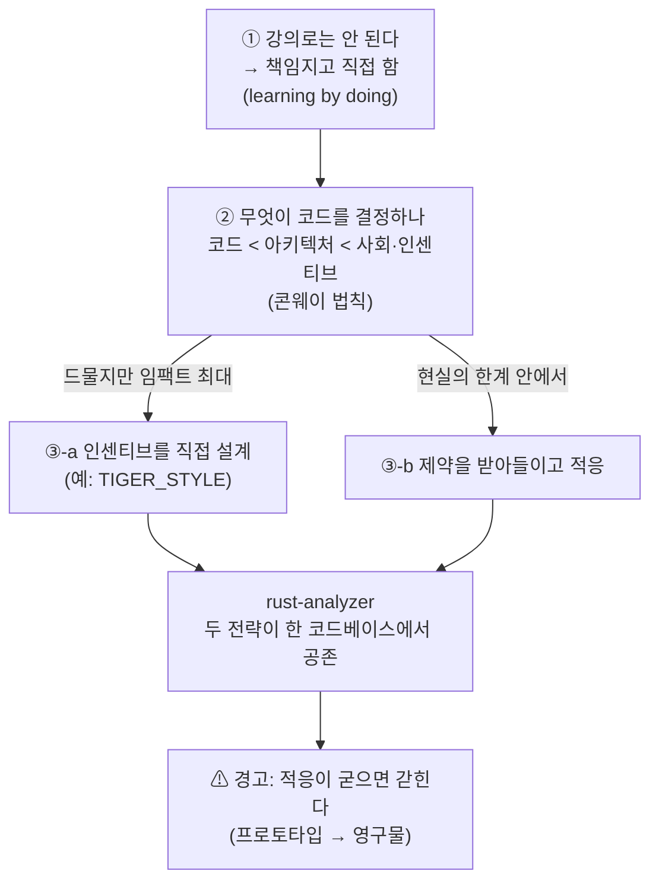
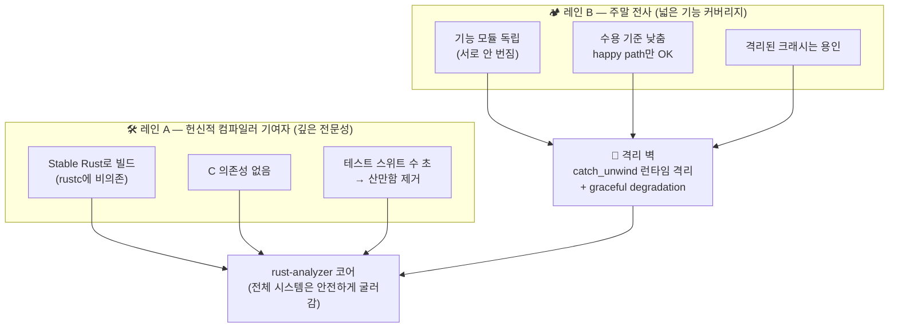

<figure class="post-figure post-figure--header">
<svg role="img" aria-label="왼쪽 강의실 칠판에 그려진 '아키텍처 패턴' 도식을 등지고, 오른쪽 실제 전장(코드 기지) 한가운데서 부족원들의 동선 화살표와 보상 깃발을 배치하며 진영을 설계하는 오크 지휘관 — 아키텍처는 강의가 아니라 조직을 설계하는 일이라는 헤더 삽화" viewBox="0 0 640 320" xmlns="http://www.w3.org/2000/svg">
  <title>아키텍처는 강의가 아니라 조직(인센티브)을 설계하는 일</title>
  <!-- caption strip -->
  <text x="320" y="28" text-anchor="middle" font-size="15" fill="currentColor" font-weight="700">패턴 카탈로그를 등지고, 조직을 설계한다</text>
  <text x="320" y="48" text-anchor="middle" font-size="11.5" fill="currentColor" opacity="0.6">강의실 칠판 → 등짐 · 실제 전장(코드 기지)에 동선과 보상을 배치</text>
  <line x1="24" y1="270" x2="616" y2="270" stroke="currentColor" stroke-width="1.5" opacity="0.4"/>

  <!-- LEFT: the abandoned classroom blackboard of "architecture patterns" -->
  <g transform="rotate(-7 132 170)" opacity="0.55">
    <rect x="56" y="92" width="152" height="120" fill="var(--bg-sunken)" stroke="currentColor" stroke-width="2"/>
    <text x="132" y="110" text-anchor="middle" font-size="9.5" fill="currentColor" opacity="0.8">아키텍처 패턴</text>
    <!-- generic boxes-and-arrows pattern diagram, ignored -->
    <g fill="none" stroke="currentColor" stroke-width="1.6">
      <rect x="74"  y="124" width="40" height="22"/>
      <rect x="150" y="124" width="40" height="22"/>
      <rect x="74"  y="170" width="40" height="22"/>
      <rect x="150" y="170" width="40" height="22"/>
      <line x1="114" y1="135" x2="150" y2="135"/>
      <line x1="94"  y1="146" x2="94"  y2="170"/>
      <line x1="170" y1="146" x2="170" y2="170"/>
    </g>
    <text x="94"  y="139" text-anchor="middle" font-size="7" fill="currentColor">MVC</text>
    <text x="170" y="139" text-anchor="middle" font-size="7" fill="currentColor">Layer</text>
    <text x="94"  y="185" text-anchor="middle" font-size="7" fill="currentColor">DI</text>
    <text x="170" y="185" text-anchor="middle" font-size="7" fill="currentColor">Repo</text>
    <!-- chalk easel legs -->
    <line x1="72" y1="212" x2="60" y2="244" stroke="currentColor" stroke-width="2"/>
    <line x1="192" y1="212" x2="204" y2="244" stroke="currentColor" stroke-width="2"/>
  </g>

  <!-- CENTER: the orc commander, BACK turned to the blackboard, facing the battlefield -->
  <g stroke="currentColor" stroke-width="2.5" fill="none" stroke-linecap="round" stroke-linejoin="round">
    <!-- head (faces right, toward the battlefield) -->
    <circle cx="278" cy="138" r="20" fill="var(--orc-green)" stroke="currentColor"/>
    <!-- black topknot -->
    <path d="M262,126 q-10,-12 4,-20 q6,8 14,8" fill="currentColor" stroke="currentColor"/>
    <!-- tusk hint + brow -->
    <path d="M292,146 q5,2 7,-2" />
    <path d="M268,132 q6,-3 12,0" />
    <!-- torso, turned toward the right (battlefield) -->
    <path d="M278,158 q4,30 -2,54" />
    <!-- pointing arm directing the battlefield -->
    <path d="M280,176 q26,-6 50,-16" />
    <!-- back arm, dismissing the blackboard behind -->
    <path d="M276,176 q-22,-2 -34,-14" />
    <!-- legs planted on the field -->
    <path d="M276,212 q-10,18 -16,28" />
    <path d="M278,212 q8,18 14,28" />
  </g>

  <!-- RIGHT: the real battlefield = the code base. Tribe movement lines + reward banners -->
  <!-- code-base ground tiles -->
  <g fill="var(--bg-sunken)" stroke="currentColor" stroke-width="1.4" opacity="0.5">
    <rect x="356" y="226" width="44" height="22"/>
    <rect x="404" y="226" width="44" height="22"/>
    <rect x="452" y="226" width="44" height="22"/>
    <rect x="500" y="226" width="44" height="22"/>
    <rect x="548" y="226" width="44" height="22"/>
  </g>
  <text x="474" y="263" text-anchor="middle" font-size="9.5" fill="currentColor" opacity="0.6">코드 기지 (the code base)</text>

  <!-- tribe members as small markers -->
  <g fill="var(--orc-green)" stroke="currentColor" stroke-width="1.6">
    <circle cx="404" cy="158" r="8"/>
    <circle cx="506" cy="150" r="8"/>
    <circle cx="566" cy="186" r="8"/>
  </g>

  <!-- movement / contribution lines the commander arranges -->
  <g stroke="var(--secondary-color)" stroke-width="2.2" fill="none" stroke-linecap="round" marker-end="url(#ah)">
    <path d="M340,168 q34,-8 56,-6"/>
    <path d="M416,160 q44,-6 82,-8"/>
    <path d="M512,156 q30,12 50,26"/>
  </g>
  <defs>
    <marker id="ah" markerWidth="9" markerHeight="9" refX="6" refY="3" orient="auto">
      <path d="M0,0 L7,3 L0,6 Z" fill="var(--secondary-color)"/>
    </marker>
  </defs>

  <!-- reward banners (incentives) staked on the field -->
  <g stroke="currentColor" stroke-width="2" fill="none">
    <line x1="440" y1="120" x2="440" y2="162"/>
    <path d="M440,120 l26,8 l-26,10 z" fill="var(--accent-color)" stroke="currentColor"/>
    <line x1="540" y1="118" x2="540" y2="156"/>
    <path d="M540,118 l24,7 l-24,9 z" fill="var(--gold)" stroke="currentColor"/>
  </g>
  <text x="478" y="116" text-anchor="middle" font-size="9" fill="currentColor" opacity="0.75">보상 · 인센티브</text>
</svg>
<figcaption>아키텍처는 강의실의 패턴 도식이 아니라, 실제 코드 기지 위에서 누가 어디로 움직이고 무엇으로 보상받는지를 — 즉 조직의 인센티브 구조를 — 설계하는 일이다.</figcaption>
</figure>

## 원문 정보

> - **제목**: Learning Software Architecture
> - **출처**: matklad (Aleksey Kladov) 개인 블로그 (matklad.github.io)
> - **발행**: 2026-05-12 · 약 8~10분 분량
> - **원문 링크**: <https://matklad.github.io/2026/05/12/software-architecture.html>

저자는 rust-analyzer와 IntelliJ Rust를 만든 사람이다. 즉 "대규모 IDE/컴파일러를 실제로 설계하고, 수많은 외부 기여자와 함께 굴려 온" 사람이 "아키텍처를 어떻게 배웠나"를 회고하는 글이다. 본 위키의 [Architecture-Essential 시리즈](/2026/06/19/architecture-essential-curriculum.html)가 책으로 정리한 이론과, 한 현역 메인테이너의 체득이 어디서 만나고 갈라지는지를 보기 좋아 Articles에 담는다.

## 한 줄 요약 (TL;DR)

아키텍처는 강의로 배우는 게 아니라 책임을 지고 직접 굴리며 배운다. 그리고 코드 품질을 결정하는 가장 큰 변수는 기술 지식이 아니라 **조직의 사회 구조와 인센티브**(콘웨이 법칙)다. 좋은 아키텍처는 그 제약과 *맞서는* 게 아니라 *맞물려* 돌아가도록 설계된다.

글 전체의 척추를 한 장으로 보면 이렇다. "직접 함"에서 출발해 "코드 < 아키텍처 < 사회"라는 위계로 올라서고, 거기서 두 갈래 적응 전략이 갈라진 뒤, 둘 다 rust-analyzer 한 케이스 안에서 만난다.

## 왜 이 글을 골랐나

본 위키의 Engineering 카테고리는 [GoF](/2026/06/19/gof-design-patterns.html), [DDD](/2026/06/19/domain-driven-design.html), [DDIA](/2026/06/19/designing-data-intensive-applications.html) 같은 정전(正典)을 책 단위로 정리해 두었다. 그 책들은 "무엇이 좋은 설계인가"를 정밀하게 답한다. 그런데 정작 현장에서 코드가 무너지는 이유는 패턴을 몰라서가 아닌 경우가 더 많다. 마감, 보상 체계, 누가 무엇을 책임지는가 하는 **사람과 조직의 문제**가 먼저고, 패턴은 그다음이다.

matklad의 글은 바로 그 우선순위를 뒤집어 말한다. 게다가 추상적 훈수가 아니라, 자신이 메인테이너로서 rust-analyzer의 디렉터리·테스트·기여 정책을 **어떤 인센티브를 노리고** 그렇게 짰는지를 구체적으로 까 보인다. "책이 말하는 이상"과 "메인테이너가 실제로 내리는 결정" 사이의 간극을 보여 주는, 짧지만 밀도 높은 회고다.

## 핵심 내용

원문은 두 개의 "메타 관찰" + 한 케이스 스터디 + 구체적 추천 자료로 구성된다.

### 메타 관찰 1 — 아키텍처는 강의가 아니라 책임에서 배운다

저자는 대학의 설계 강의가 대체로 이론에 그쳐 별 도움이 안 됐다고 말한다. 실제 배움은 IntelliJ Rust 프로젝트에서 **리더 역할(책임)**을 떠안으면서 일어났다. 결론은 낙관적이다. 소프트웨어 엔지니어링은 호기심 있는 사람이 제1원리에서 출발해 스스로 익힐 수 있을 만큼 열려 있는 분야라는 것. 즉 "정규 교육 부족"은 변명이 못 되고, 핵심은 **실제로 결정을 내리고 그 결과를 책임지는 자리에 서 보는 것**이다.

### 메타 관찰 2 — 콘웨이 법칙이 결정적이다

가장 중요한 주장이다. 소프트웨어 아키텍처는 그것을 만드는 **조직의 사회 구조를 그대로 반영**한다(콘웨이 법칙). 연구용 코드와 산업용 코드의 품질 차이도 능력 차이가 아니라 **인센티브 구조 차이**에서 온다. 가령 3개월 출판 마감에 쫓기는 박사 연구자와, 장기 유지보수를 책임지는 산업 팀은 애초에 다른 압력을 받는다 — 같은 사람이라도 다른 코드를 짜게 된다.

여기서 저자는 두 가지 적응 전략을 제시한다.

1. **인센티브 구조를 직접 설계한다** — 드물지만 임팩트가 가장 큰 기회다. (TIGER_STYLE 문서가 작동하는 사회적 맥락을 예로 든다.)
2. **제약을 받아들이고 적응한다** — 이상적 조건을 기다리는 대신, 현실의 한계 안에서 최선의 구조를 만든다.

이 둘을 가르는 인용이 글의 중심에 박혀 있다. neugierig의 말이다.

> "우리는 프로그래밍이 코드를 짜는 일인 것처럼 이야기하지만, 결국 코드보다 아키텍처가 더 중요해지고, 아키텍처보다 사회적 문제가 더 중요해진다."

### 케이스 스터디 — rust-analyzer는 기여자 유형에 맞춰 설계됐다

rust-analyzer의 아키텍처는 두 갈래 진입로로 읽으면 한눈에 들어온다. 왼쪽은 "깊게 파는 소수"를 위한 레인, 오른쪽은 "가볍게 들어오는 다수"를 위한 레인이고, 둘은 가운데 **격리 벽**(`catch_unwind` · 모듈 독립) 덕분에 한 코어로 합류하되 한쪽의 품질 문제가 다른 쪽으로 번지지 않는다.

rust-analyzer는 모순된 두 가지를 동시에 요구한다. **깊은 전문성**(컴파일러 개발)과 **넓은 기능 커버리지**(IDE 기능 전반). 저자는 이 둘을 한 사람에게 기대하는 대신, **서로 다른 기여자 유형이 각자의 자리에서 잘 굴러가도록** 아키텍처를 설계했다고 말한다.

핵심 컴파일러 작업(소수의 헌신적 기여자)을 위해:

- **Stable Rust로 빌드** — rustc 자체에 의존하지 않는다.
- **C 의존성 없음.**
- **테스트 스위트는 수 초 안에 끝난다.**
- 목적: 산만함을 제거해 깊게 파는 기여자를 끌어들인다.

기능 단위로 가볍게 기여하는 "주말 전사(weekend warriors)"를 위해:

- 기능을 런타임에서 `catch_unwind`로 **격리**한다.
- 기능 모듈이 독립적이라 한 기능의 품질 문제가 다른 곳으로 번지지 않는다.
- 수용 기준을 낮춘다 — "happy path가 동작하고 테스트되면 OK".
- 격리되어 사용자에게 보이지 않는다면 **크래시도 용인**한다.

즉 graceful degradation(우아한 성능 저하)과 모듈 격리를 통해, 낮은 품질 기준을 받아들여도 시스템 전체는 안전하게 굴러가도록 만든 것이다. 이는 **인센티브를 설계한** 쪽과 **제약을 받아들인** 쪽이 한 코드베이스 안에서 공존하는 사례다.

저자는 동시에 경고도 남긴다. 나쁜 인센티브에 적응하다 보면 프로젝트가 거기에 **갇힐** 수 있다. rust-analyzer 자체가 원래는 프로토타입 의도였는데 영구물이 되어 버렸다 — 임시방편으로 내린 편의적 결정이 어떻게 굳어 버리는지를 스스로 보여 주는 예다.

### 구체적 추천 자료

저자가 "아키텍처를 더 메타적으로 보게 해 준다"며 꼽은 목록.

- **Boundaries** (Gary Bernhardt) — 객체 수준 조언이 탄탄하면서 메타적 통찰도 있다.
- **How to Test** (저자 본인 글) — 통념적 테스트 지혜를 "주술 같은 만병통치약(shamanistic snake-oil)"이라며 정면으로 흔든다.
- **∅MQ(ZeroMQ) 가이드 6장 / Pieter Hintjens의 글** — 콘웨이 법칙적 사고와 "낙관적 머지(optimistic merging)"를 소개한다.
- **Reflections on a Decade of Coding** (Jamii) — 매우 메타적인 관점.
- **Ted Kaminski 블로그** — "소프트웨어 개발에 대한 가장 일관된 이론에 가깝다"고 평한다.
- **Software Engineering at Google**, Ousterhout의 **A Philosophy of Software Design** — 견실하지만 판을 뒤집을 정도는 아니다.

## 분석과 인사이트

여기서부터는 원문 요약이 아니라 내 해석이다.

**첫째, "코드 < 아키텍처 < 사회"라는 위계는 본 위키 정전들과 충돌하지 않고 보완한다.** [DDIA](/2026/06/19/designing-data-intensive-applications.html)나 [Software Architecture in Practice](/2026/06/19/software-architecture-in-practice.html)는 품질 속성·트레이드오프를 정밀하게 다루지만, 그 트레이드오프를 *누가 어떤 압력 아래서* 선택하는지는 책 밖의 문제다. matklad는 그 책 밖의 변수를 1순위로 끌어올린다. [The Software Architect Elevator](/2026/06/19/software-architect-elevator.html)가 "아키텍트는 임원실과 기계실을 오가며 조직과 기술을 잇는 사람"이라고 말한 것과 정확히 같은 지점이다 — 두 글 모두 콘웨이 법칙을 단순 트리비아가 아니라 **설계의 1차 변수**로 본다.

**둘째, rust-analyzer 케이스의 진짜 통찰은 "기여자를 페르소나로 설계했다"는 점이다.** 보통 우리는 "좋은 아키텍처 = 좋은 추상화"라고 배운다. 그런데 matklad는 아키텍처를 **인적 자원 배분의 도구**로 쓴다. `catch_unwind` 격리와 "happy path만 되면 OK"라는 낮춘 기준은 기술적으로는 "타협"처럼 보이지만, 인센티브 관점에서는 "주말 전사가 부담 없이 들어와 기여하게 만드는 진입로"다. 이건 [GOOS(테스트로 자라는 객체지향 소프트웨어)](/2026/06/19/growing-oo-software-guided-by-tests.html)가 강조한 "변경을 쉽게 만드는 설계"를, *사람의 동기*라는 축으로 한 단계 더 민 것이다.

**셋째, "How to Test를 주술 타파"로 부른 대목은 본 위키의 [TDD, 7년 후](/2026/06/19/tdd-seven-years-after.html)와 공명한다.** Kent Beck의 회고도, matklad의 도발도, "테스트는 무조건 많을수록 좋다"는 교리에서 빠져나와 *언제·무엇을* 테스트할지를 판단의 문제로 돌려놓는다. rust-analyzer가 "수 초짜리 테스트 스위트"를 인센티브 장치로 쓴 것 자체가, 테스트를 의례가 아니라 기여 경험을 좌우하는 설계 요소로 다룬 증거다.

**이견 한 가지.** "강의는 이론에 그쳐 쓸모없었다"는 일반화는 위험하다. matklad 같은 사람은 제1원리에서 스스로 길을 낼 수 있지만, 모두가 책임 있는 리더 자리부터 시작할 수 있는 건 아니다. 강의/책의 가치는 "혼자 1원리로 재발명할 시간을 절약"하는 데 있고, 그가 마지막에 추천 자료를 길게 단 것 자체가 "읽기"의 가치를 인정하는 셈이다. 정확히는 "강의가 무용"이 아니라 **"책임 없는 학습은 얕다"**가 맞는 결론이라고 본다. 그리고 그가 솔직하게 인정한 "프로토타입이 영구물로 굳었다"는 자기비판은, 인센티브 적응 전략이 곧 [잘못된 추상화의 매몰비용 함정](/2026/06/22/the-wrong-abstraction.html)으로 미끄러질 수 있다는 경고이기도 하다.

## 적용 포인트

- **아키텍처 결정 전에 인센티브를 먼저 그려라.** "이 구조가 *우리 팀의 보상·마감·책임 구조*와 맞물리나?"를 패턴 선택보다 먼저 묻는다. 콘웨이 법칙은 받아들일 제약이지, 무시할 디테일이 아니다.
- **기여자/팀원을 페르소나로 나눠 설계하라.** 깊게 파는 소수와 가볍게 들어오는 다수에게 *서로 다른 진입로와 품질 기준*을 의도적으로 깐다. 한 줄의 기준으로 모두를 묶지 않는다.
- **격리로 낮은 품질을 안전하게 받아들여라.** 모듈 경계·`catch_unwind` 같은 런타임 격리로 "이 부분이 깨져도 시스템과 사용자에게 안 번진다"를 보장하면, 비핵심 영역의 수용 기준을 낮춰 기여 속도를 높일 수 있다.
- **테스트를 의례가 아니라 경험으로 보라.** 수 초 안에 끝나는 빠른 스위트는 그 자체로 "또 기여하고 싶게" 만드는 인센티브다. *무엇을* 테스트할지, 그 피드백 루프가 *얼마나 빠른지*를 설계 요소로 다룬다.
- **"임시방편"에 만료일을 붙여라.** 편의적 결정은 굳는다. rust-analyzer가 프로토타입에서 영구물이 된 것처럼. "이건 임시"라고 부르는 구조에는 언제 갚을지를 함께 적어 둔다.

## 마무리

matklad의 메시지는 단순하다. 아키텍처를 잘하고 싶으면 패턴 카탈로그를 더 외우기 전에, *이 코드를 만드는 사람들이 어떤 압력과 보상 아래 있는가*를 먼저 보라는 것. 좋은 아키텍처는 그 사회적 현실과 맞서는 대신 그것과 *맞물려* 돌아가도록 설계된 것이다. 책으로 정리한 정전이 "무엇이 좋은 설계인가"를 가르친다면, 이 짧은 회고는 "그 좋은 설계가 *왜 현장에서 자주 좌초하는가*"의 답을 사람과 인센티브에서 찾는다. 둘은 경쟁하지 않는다 — 함께 읽을 때 비로소 그림이 완성된다.

### 더 읽어보기

- [원문 — Learning Software Architecture (matklad)](https://matklad.github.io/2026/05/12/software-architecture.html)
- [The Software Architect Elevator: 아키텍트의 역할](/2026/06/19/software-architect-elevator.html) — 콘웨이 법칙을 설계의 1차 변수로 보는 같은 시각
- [Software Architecture in Practice: 품질 속성의 공학](/2026/06/19/software-architecture-in-practice.html) — matklad가 1순위로 민 "사회 변수"의 반대쪽, 정밀한 기술적 트레이드오프
- [Architecture-Essential 커리큘럼](/2026/06/19/architecture-essential-curriculum.html) — 아키텍처 정전을 책 단위로 정리한 본편 시리즈
- [TDD, 7년 후: 회고와 현대적 관점](/2026/06/19/tdd-seven-years-after.html) — matklad의 "How to Test" 도발과 공명하는, 테스트 교리 다시 보기
- [GOOS: 테스트로 자라는 객체지향 소프트웨어](/2026/06/19/growing-oo-software-guided-by-tests.html) — "변경을 쉽게 만드는 설계"를 인적 동기 축으로 확장해 읽기
- [잘못된 추상화 (Sandi Metz)](/2026/06/22/the-wrong-abstraction.html) — 인센티브 적응이 매몰비용 함정으로 굳는 위험
- [내 소프트웨어의 북극성 (Loris Cro)](/2026/06/22/my-software-north-star.html) — 기술적 미덕을 "무엇을 위해" 추구하는지 다시 줄 세운 craft 에세이
