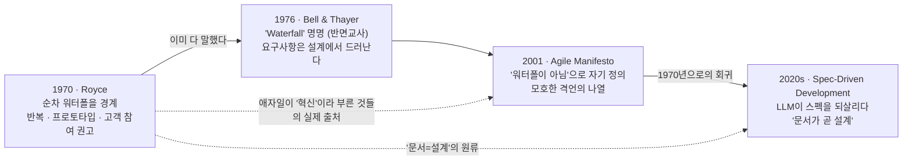

<figure class="post-figure post-figure--header">
<svg role="img" aria-label="오크 전투 캠프를 배경으로, 1970년 Royce의 반복 개발 도표와 2025년 LLM 스펙 문서가 같은 바닥선 위에 놓여 있고 그 둘을 하나의 큰 원형 화살표가 잇는다. 가운데에는 'AGILE'이라 적힌 깃발이 '역사의 쓰레기통'으로 던져지고 있다." viewBox="0 0 640 340" xmlns="http://www.w3.org/2000/svg" font-family="var(--font-body)">
  <title>한 바퀴 돌아온 원 — 1970 Royce와 2025 LLM 스펙은 같은 선상에 있고, 애자일 깃발은 역사의 쓰레기통으로</title>

  <!-- background canyon ramparts (Orgrimmar war-camp silhouette) -->
  <g opacity="0.16" fill="currentColor">
    <polygon points="0,300 0,150 32,120 48,150 78,110 96,150 96,300"/>
    <polygon points="544,300 544,150 562,120 580,150 610,112 640,150 640,300"/>
  </g>
  <!-- Horde banner poles (spiked) -->
  <g stroke="currentColor" stroke-width="3" fill="none" opacity="0.35">
    <line x1="20" y1="96" x2="20" y2="292"/>
    <line x1="620" y1="96" x2="620" y2="292"/>
  </g>
  <polygon points="20,100 56,110 20,132" fill="var(--accent-color)" opacity="0.7"/>
  <polygon points="620,100 584,110 620,132" fill="var(--accent-color)" opacity="0.7"/>

  <!-- the "full circle" arc: 1970 loops up and around, landing back on 2025 (same line) -->
  <path d="M132 196 C 150 70, 320 34, 490 70 C 560 84, 578 140, 560 190"
        fill="none" stroke="currentColor" stroke-width="3" stroke-dasharray="2 9"
        stroke-linecap="round" opacity="0.8"/>
  <polygon points="560,190 550,166 574,172" fill="currentColor" opacity="0.9"/>
  <text x="320" y="58" text-anchor="middle" font-size="15" fill="currentColor" opacity="0.75" style="font-style:italic">반세기, 한 바퀴</text>

  <!-- shared baseline: "same line" -->
  <line x1="48" y1="286" x2="592" y2="286" stroke="currentColor" stroke-width="3" opacity="0.5"/>

  <!-- LEFT: 1970 Royce document with an iteration loop -->
  <g>
    <rect x="66" y="176" width="96" height="102" fill="var(--bg-sunken)" stroke="currentColor" stroke-width="3"/>
    <!-- iteration loop (Royce's proposed cycle) -->
    <path d="M96 232 A 18 18 0 1 1 122 240" fill="none" stroke="var(--secondary-color)" stroke-width="3"/>
    <polygon points="122,240 112,232 126,228" fill="var(--secondary-color)"/>
    <!-- design/prototype lines -->
    <line x1="82" y1="196" x2="146" y2="196" stroke="currentColor" stroke-width="2" opacity="0.7"/>
    <line x1="82" y1="206" x2="132" y2="206" stroke="currentColor" stroke-width="2" opacity="0.7"/>
    <text x="114" y="304" text-anchor="middle" font-size="16" fill="currentColor" font-weight="700">1970</text>
  </g>

  <!-- RIGHT: 2025 LLM spec document -->
  <g>
    <rect x="478" y="176" width="96" height="102" fill="var(--bg-sunken)" stroke="currentColor" stroke-width="3"/>
    <!-- spec lines -->
    <line x1="494" y1="196" x2="558" y2="196" stroke="currentColor" stroke-width="2" opacity="0.7"/>
    <line x1="494" y1="208" x2="558" y2="208" stroke="currentColor" stroke-width="2" opacity="0.7"/>
    <line x1="494" y1="220" x2="540" y2="220" stroke="currentColor" stroke-width="2" opacity="0.7"/>
    <!-- LLM spark accent -->
    <polygon points="526,238 532,250 546,250 535,258 540,270 526,262 512,270 517,258 506,250 520,250"
             fill="var(--gold)" opacity="0.9"/>
    <text x="526" y="304" text-anchor="middle" font-size="16" fill="currentColor" font-weight="700">2025</text>
  </g>

  <!-- equals: the two ends of the circle sit on the same line -->
  <g stroke="var(--secondary-color)" stroke-width="3" opacity="0.85">
    <line x1="300" y1="248" x2="340" y2="248"/>
    <line x1="300" y1="260" x2="340" y2="260"/>
  </g>

  <!-- CENTER: dustbin of history, with the AGILE flag being tossed in -->
  <g>
    <!-- bin -->
    <polygon points="286,238 354,238 346,286 294,286" fill="var(--bg-light)" stroke="currentColor" stroke-width="3"/>
    <rect x="280" y="228" width="80" height="12" fill="var(--bg-light)" stroke="currentColor" stroke-width="3"/>
    <line x1="304" y1="248" x2="310" y2="278" stroke="currentColor" stroke-width="2" opacity="0.6"/>
    <line x1="320" y1="248" x2="320" y2="278" stroke="currentColor" stroke-width="2" opacity="0.6"/>
    <line x1="336" y1="248" x2="330" y2="278" stroke="currentColor" stroke-width="2" opacity="0.6"/>
    <!-- the AGILE flag, tilted mid-toss into the bin -->
    <g transform="rotate(34 320 210)">
      <line x1="320" y1="176" x2="320" y2="236" stroke="currentColor" stroke-width="3"/>
      <path d="M320 178 L 372 186 L 360 198 L 372 210 L 320 204 Z"
            fill="var(--accent-color)" stroke="currentColor" stroke-width="2"/>
      <text x="330" y="198" font-size="11" fill="var(--bg-panel)" font-weight="700">AGILE</text>
    </g>
  </g>
</svg>
<figcaption>한 바퀴 돌아온 원: 1970년 Royce의 반복 개발과 2025년 LLM 스펙은 같은 선상에 서 있고, '무엇이 아닌지'로만 정의된 애자일 깃발은 역사의 쓰레기통으로 향한다.</figcaption>
</figure>

## 원문 정보

> - **제목**: Saying Goodbye to Agile
> - **저자**: Lewis Campbell
> - **출처**: 개인 블로그 (lewiscampbell.tech) · 약 5분 분량
> - **원문 링크**: [lewiscampbell.tech/blog/260414.html](https://lewiscampbell.tech/blog/260414.html)

애자일이라는 방법론이 우리 업계에 남긴 것과 남기지 못한 것을 역사적 사료로 되짚는, 짧지만 도발적인 에세이다. 소프트웨어 엔지니어링의 **인물·역사·문화**를 다루는 Articles/Engineering-Culture에 담는다.

## 한 줄 요약 (TL;DR)

애자일은 자신이 **무엇인지**가 아니라 **무엇이 아닌지(워터폴이 아님)**로 정의됐는데, 정작 그 워터폴은 1970년 Royce의 논문에서 이미 반박됐고 반복 개발도 그때 함께 제안됐다. 그러니 애자일이 2001년에 '해방'이라며 들고 온 것들은 대부분 반세기 전 진지한 엔지니어들이 더 명료하게 써 둔 것이었고, LLM 시대에 스펙이 다시 부활한 지금 애자일은 역사의 쓰레기통으로 보내도 된다는 주장이다.

### 한눈에 보기 — 반세기, 한 바퀴

## 왜 이 글을 골랐나

이 위키에는 애자일과 그 실천법을 정면으로 다룬 글이 이미 여러 편 있다. Kent Beck의 [XP Explained 정리](/2026/06/19/extreme-programming-explained.html), [User Stories Applied](/2026/06/19/user-stories-applied.html), 그리고 [Process Essential 커리큘럼](/2026/06/19/process-essential-curriculum.html)까지 — 대체로 애자일 실천법을 **긍정적으로 소개**하는 글들이다. 이 에세이는 정확히 그 반대편에서, 애자일이라는 브랜드 자체가 과연 무엇을 새로 가져왔느냐를 사료로 따진다. 한쪽 진영의 글만 모아두면 위키가 균형을 잃는다. 반대 논거를 명료하게 정리해 두는 것 자체가 독자에게 유용하다.

또 하나. LLM 코딩이 다시 '스펙 쓰기'를 강제하면서, [의도 부채(Intent Debt)](/2026/06/21/intent-debt.html)나 [YAGNI 재해석](/2026/07/03/yagni-cost-was-never-typing.html) 같은 최근 담론이 모두 문서·명세의 가치를 재발견하는 방향으로 움직이고 있다. 이 에세이는 그 흐름에 "사실 새로운 게 아니라 1970년으로의 회귀"라는 역사적 좌표를 찍어준다. 지금 읽기에 시의적절하다.

## 핵심 내용

### 애자일은 정의된 적이 없다

글쓴이의 첫 번째 공격은 애자일의 **정의 불가능성**이다. 애자일을 비판하면 어김없이 "그건 진짜 애자일이 아니다(True Agile)"라는 반박이 돌아온다 — 데일리 스탠드업도, 애자일 코치도 선언문에는 없다는 것이다. 그런데 정작 그 근거로 지목되는 2001년 애자일 선언문(Agile Manifesto)을 펼쳐 보면 실질적인 지침이 거의 없다. 잘 봐줘야 "계약 협상보다 고객 협업" 같은 모호한 격언의 나열이고, 나쁘게 보면 "개발 후반의 요구사항 변경도 환영하라"처럼 상업적으로 실행 불가능한 구호다.

여기서 논리적 궁지가 생긴다. 애자일 업계는 '진짜 애자일'을 하지 않고 있고, 선언문 자체는 의미가 비어 있다면 — 도대체 애자일이란 무엇이었는가?

### 유령은 워터폴이었다

글쓴이의 답은 이렇다. 애자일은 언제나 **자신이 아닌 것**으로 정의됐고, 그 아닌 것이 바로 워터폴이었다. "애자일을 하지 않으면 워터폴을 하는 것이고, 워터폴은 작동하지 않는다" — 이 이분법이 애자일의 실질적 내용이었다는 것이다. 마르크스의 '유럽을 배회하는 유령' 구절을 패러디해 "소프트웨어를 배회하는 유령, 워터폴이라는 유령"이라고 비꼰다.

문제는 워터폴이 작동하지 않는다는 사실을 우리가 이미 **1970년부터** 알고 있었다는 점이다.

### Royce(1970)가 이미 다 말했다

흔히 '워터폴의 아버지'로 오해받는 Winston W. Royce의 1970년 논문이 결정적 증거로 등장한다. Royce는 순차적 워터폴이 왜 실패하는지를 설명하면서 대안으로 이런 것들을 권했다.

- 프로그램 **설계**에서 시작하라.
- 소프트웨어의 **프로토타입**을 만들어 정보를 모으고 요구사항을 다듬어라.
- **고객을 참여**시켜라 — 그 참여는 "공식적이고, 깊이 있고, 지속적이어야 한다".

글쓴이의 통렬한 지적: 이 세 가지는 훗날 모두 애자일의 '혁신'으로 포장됐지만, 실제로는 달 착륙 이듬해에 이미 쓰인 것들이다.

### Bell & Thayer(1976): 요구사항은 설계에서야 드러난다

Royce만이 아니었다. 'Waterfall'이라는 용어를 처음 만든 것으로 알려진 1976년 Bell & Thayer 논문 — 그것도 **하지 말아야 할 예시**로서 이 용어를 썼다 — 은 실증 연구 끝에 이렇게 결론짓는다. 소프트웨어 개발 프로젝트가 진행되는 동안 요구사항에서 발견되는 문제의 종류가 계속 바뀌었고, 개발자들은 흔히 **설계로 요구사항을 충족시키려 시도할 때에야** 요구사항의 결함을 발견했다는 것이다.

즉 반복적 개발도, "요구사항은 설계 과정에서 드러난다"는 통찰도 애자일 이전에 이미 확립돼 있었다. 워터폴은 선언문이 우리를 '해방'시키기 전의 최신 기술(state of the art)이 아니었고, 요구사항과 명세의 효용을 진지하게 의심한 사람도 없었다.

### Spec-Driven Development: 스펙이 돌아왔다

마지막 장은 현재로 넘어온다. 값싼 LLM이 프로그래밍 방식을 바꾸면서, 명백히 **긍정적인** 변화 하나가 따라왔다 — 소프트웨어 전문가들이 다시 **스펙을 쓰기 시작**했다는 것이다. LLM은 (많은 인간이 그렇듯) 모호함에 약하고, 문제를 명세하는 일이 올바른 코드를 만들어내는 효과적 도구로 판명되고 있다.

여기서 글쓴이는 선언문과 정면으로 대비시킨다. 애자일은 "포괄적 문서보다 작동하는 소프트웨어"라 했지만, Spec-Driven Development는 "포괄적 문서가 작동하는 소프트웨어를 만든다"고 말한다. 그리고 이것마저 새롭지 않다며 다시 Royce를 인용한다. 코딩이 시작되기 전까지 문서·명세·설계라는 세 단어는 **한 가지 것**을 가리킨다는 말 — 문서가 나쁘면 설계가 나쁜 것이고, 문서가 아직 없다면 설계도 아직 없으며 사람들이 설계에 대해 생각하고 말하고 있을 뿐이라는 것이다.

결론은 단호하다. 1970년과 1976년을 읽고 나면 2001년이 대체 무엇을 새로 가져왔는지 물을 수밖에 없다. 애자일은 모호하게 정의됐고, 반세기 전 진지한 엔지니어들이 더 말이 되는 논문으로 이미 풀어 둔 문제를 '해결책'으로 마케팅했다. 이제 애자일을 마땅한 자리 — 역사의 쓰레기통 — 로 보낼 때라는 것이다.

각주에서 글쓴이는 스토리 포인트도 없이 아폴로 유도 컴퓨터를 짜낸 프로그래머들을 비꼬고, Brooks의 "No Silver Bullet"과 Boehm의 나선형 모델(Spiral Model)을 언급하며 이 계보가 훨씬 길다는 것을 암시한다.

## 분석과 인사이트

**정직하게 짚자면, 이 글은 논쟁을 위한 글이다.** 사료를 무기로 쓰지만 학술적 균형을 노린 글은 아니다. 그래서 강한 지점과 무리한 지점이 함께 있다.

**강한 지점 — 역사적 사실 자체는 대체로 옳다.** Royce의 1970년 논문이 실은 순수 워터폴을 경계했다는 것, 반복·프로토타입·고객 참여를 권했다는 것은 소프트웨어 공학사에서 잘 알려진 사실이다. "애자일이 혁신이라 주장한 많은 것이 실은 재발견"이라는 명제는 방법론 역사를 아는 사람에게 새삼스럽지 않다. 이 글의 가치는 그 사실들을 하나의 날카로운 서사로 꿰어, "애자일은 반대항으로만 정의된 브랜드"라는 프레임을 선명하게 세운 데 있다.

**그러나 '허수아비'를 두 번 세운다.** 첫째, 글은 애자일을 '데일리 스탠드업·애자일 코치·스토리 포인트' 같은 **의례(ritual)의 산업화**와 등치시킨 뒤 그것을 때린다. 이 비판은 정당하다 — 실제로 상업화된 '애자일 산업'은 자주 공허하다. 하지만 그것으로 애자일의 실천 계보 전체를 매장하는 것은 다른 문제다. Kent Beck의 XP가 정착시킨 지속적 통합, 테스트 우선, 짧은 피드백 루프는 Royce의 세 줄짜리 권고가 **실제로 어떻게 굴러가는지**를 공학적으로 구현한 것이지, 그 권고의 단순 반복이 아니다. "1970년에 방향을 제시했다"와 "1970년에 실천 체계를 완성했다"는 전혀 다른 명제인데, 글은 이 둘을 슬쩍 겹쳐 놓는다.

둘째, **"워터폴 vs 애자일"이라는 이분법을 비판하면서 정작 "스펙이냐 애자일이냐"라는 새 이분법을 세운다.** Spec-Driven Development를 "포괄적 문서가 작동하는 소프트웨어를 만든다"로 정식화하며 선언문과 대립시키는데, 이건 선언문을 오독한 것에 가깝다. 애자일 선언문의 "over"는 "포괄적 문서를 버려라"가 아니라 "문서를 목적이 아니라 수단으로 두라"는 우선순위 진술이었다. 스펙을 다시 쓰는 것과 짧은 반복으로 검증하는 것은 애초에 대립하지 않는다. 실제로 LLM 시대의 좋은 워크플로는 **스펙을 쓰고 → 에이전트로 빠르게 구현하고 → 짧은 루프로 검증**하는, 스펙과 반복의 결합이다. 글은 스펙의 부활을 애자일의 패배로 읽지만, 나는 그것을 **애자일이 늘 말하던 피드백 루프에 명세라는 앞단이 복원된 것**으로 읽는다.

**그럼에도 이 글이 지금 유효한 이유**는, 우리 업계가 방법론을 **정체성(identity)**으로 소비해 온 관성을 정확히 찔러서다. "우리는 애자일 조직입니다"가 스탠드업의 개수와 보드의 색깔로 증명되는 순간, 방법론은 사고를 돕는 도구가 아니라 사고를 대체하는 의례가 된다. 글쓴이가 진짜로 매장하자는 것은 '반복 개발'이 아니라 **내용 없는 브랜드로서의 애자일**이다. 그 점에서는 전적으로 동의한다.

그리고 LLM이라는 새 변수는 이 오래된 논쟁에 실질적 무게를 더한다. 이 위키의 [의도 부채](/2026/06/21/intent-debt.html) 글이 말하듯, 에이전트가 코드를 대신 써주는 시대에 유일하게 위임 불가능한 것은 "무엇을 왜 만드는가"라는 **의도의 명세**다. 코드가 공짜가 되면 명세의 상대적 가치가 오른다. 반세기 전 Royce가 "문서가 곧 설계"라 한 말이, 아이러니하게도 코드 생성이 자동화된 지금 가장 문자 그대로 참이 되어간다.

## 적용 포인트

- **방법론을 정체성이 아니라 도구로 다뤄라.** "우리는 애자일/워터폴/무엇" 이라는 진영 선언 대신, "이 문제에 짧은 피드백 루프가 필요한가, 앞단 명세가 필요한가"를 그때그때 묻는다.
- **의례부터 세지 말고 원리부터 확인하라.** 스탠드업·스토리 포인트·번다운 차트가 있는지가 아니라, Royce의 세 원리 — 설계 우선, 프로토타입으로 요구사항 정제, 지속적 고객 참여 — 가 실제로 작동하는지를 점검한다.
- **스펙과 반복을 대립시키지 마라.** LLM 워크플로에서는 스펙을 쓴 뒤 에이전트로 빠르게 구현하고 짧은 루프로 검증한다. 명세는 반복의 적이 아니라 반복의 출발선이다.
- **요구사항은 설계에서 드러난다는 것을 받아들여라.** Bell & Thayer의 결론대로, 초반에 요구사항을 완벽히 못 박으려 애쓰기보다 설계·프로토타입을 통해 요구사항의 결함을 조기에 노출시키는 편이 낫다.
- **1차 사료를 직접 읽어라.** 브랜드가 재포장한 요약이 아니라 Royce(1970), Bell & Thayer(1976), Brooks의 "No Silver Bullet", Boehm의 Spiral Model 원문을 읽으면, 무엇이 진짜 새롭고 무엇이 재발견인지 스스로 판별할 수 있다.

## 마무리

이 에세이는 애자일이라는 브랜드를 사료로 해부해, 그것이 '무엇이 아닌지'로만 정의된 공허한 반대항이었고 그 반대항인 워터폴조차 1970년에 이미 반박됐음을 보여준다. 논쟁적 과장과 허수아비가 없진 않지만 — 반복 개발의 실천 체계를 세운 공까지 함께 매장하려는 지점은 무리다 — 핵심 통찰만큼은 값지다. 방법론은 사고를 돕기 위한 것이지 사고를 대체하는 의례가 아니라는 것, 그리고 LLM이 스펙을 되살린 지금 우리는 새로운 것을 발명하고 있는 게 아니라 반세기 전 진지한 엔지니어들이 써 둔 결론으로 돌아가고 있다는 것. 애자일에게 작별을 고하되, 버릴 것은 브랜드이지 그 안에 담겼던 오래된 지혜가 아니다.

### 더 읽어보기

- [원문 — Saying Goodbye to Agile (Lewis Campbell)](https://lewiscampbell.tech/blog/260414.html) — 이 글이 분석한 원문
- [XP Explained: 변화를 끌어안는 애자일](/2026/06/19/extreme-programming-explained.html) — 이 글이 비판하는 애자일의 '실천 계보' 쪽 반대 관점
- [User Stories Applied: 대화로서의 요구사항](/2026/06/19/user-stories-applied.html) — 요구사항을 반복적으로 다듬는 애자일식 접근
- [Process Essential 커리큘럼](/2026/06/19/process-essential-curriculum.html) — 요구사항·프로세스 방법론 전반의 지도
- [Intent Debt: 에이전트가 대신 갚아줄 수 없는 부채](/2026/06/21/intent-debt.html) — LLM 시대에 '의도의 명세'가 갖는 가치
- [YAGNI가 아낀 것은 타이핑이 아니었다](/2026/07/03/yagni-cost-was-never-typing.html) — 코드가 공짜가 된 시대에 문서·설계의 가치를 다시 묻는 글
