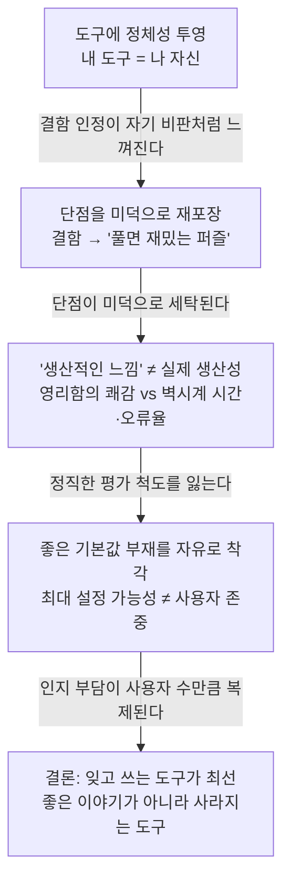

<figure class="post-figure post-figure--header">
<svg role="img" aria-label="왼쪽에는 화려한 광선과 반짝임으로 자기를 뽐내는 도구가, 오른쪽에는 손에 익어 배경으로 녹아든 흐릿한 도구가 매끄럽게 결과물을 뽑아내는 대비 — 자기를 드러내는 도구와 보이지 않는 도구" viewBox="0 0 760 300" xmlns="http://www.w3.org/2000/svg">
  <title>자기를 뽐내는 도구 vs 보이지 않는 도구</title>

  <!-- ===== 왼쪽: '재미있는' 도구 — 자기를 뽐낸다 ===== -->
  <!-- 방사형 광선 (뽐내기) -->
  <g stroke="var(--gold)" stroke-width="2.5" stroke-linecap="round" opacity="0.85">
    <line x1="202" y1="130" x2="238" y2="130"/>
    <line x1="195" y1="156" x2="226" y2="174"/>
    <line x1="176" y1="175" x2="194" y2="206"/>
    <line x1="150" y1="182" x2="150" y2="218"/>
    <line x1="124" y1="175" x2="106" y2="206"/>
    <line x1="105" y1="156" x2="74"  y2="174"/>
    <line x1="98"  y1="130" x2="62"  y2="130"/>
    <line x1="105" y1="104" x2="74"  y2="86"/>
    <line x1="124" y1="85"  x2="106" y2="54"/>
    <line x1="150" y1="78"  x2="150" y2="42"/>
    <line x1="176" y1="85"  x2="194" y2="54"/>
    <line x1="195" y1="104" x2="226" y2="86"/>
  </g>

  <!-- 반짝임 별 -->
  <g fill="var(--gold)">
    <path d="M150 34 l4 10 10 4 -10 4 -4 10 -4 -10 -10 -4 10 -4 z"/>
    <path d="M60 100 l3 7 7 3 -7 3 -3 7 -3 -7 -7 -3 7 -3 z"/>
    <path d="M240 168 l3 7 7 3 -7 3 -3 7 -3 -7 -7 -3 7 -3 z"/>
  </g>

  <!-- 도구(망치) — 또렷하게 -->
  <g stroke="currentColor" stroke-width="2.5" stroke-linejoin="round">
    <rect x="108" y="96"  width="84" height="26" rx="4" fill="var(--crimson)" opacity="0.9"/>
    <rect x="142" y="120" width="16" height="74" rx="4" fill="var(--bg-panel)"/>
  </g>
  <!-- 자기 과시 느낌표 -->
  <text x="214" y="112" font-size="30" font-weight="700" fill="var(--crimson)">!</text>

  <text x="150" y="252" font-size="13.5" text-anchor="middle" fill="currentColor" font-weight="700">‘재미있는’ 도구</text>
  <text x="150" y="272" font-size="11.5" text-anchor="middle" fill="currentColor" opacity="0.7">자기를 뽐낸다</text>

  <!-- ===== 가운데 구분선 ===== -->
  <line x1="380" y1="34" x2="380" y2="236" stroke="currentColor" stroke-width="1.5" stroke-dasharray="5 6" opacity="0.28"/>

  <!-- ===== 오른쪽: '보이지 않는' 도구 — 배경으로 사라진다 ===== -->
  <!-- 배경 격자 (도구가 녹아드는 배경) -->
  <g stroke="currentColor" stroke-width="1" opacity="0.09">
    <line x1="410" y1="90"  x2="750" y2="90"/>
    <line x1="410" y1="140" x2="750" y2="140"/>
    <line x1="410" y1="190" x2="750" y2="190"/>
    <line x1="470" y1="60"  x2="470" y2="230"/>
    <line x1="560" y1="60"  x2="560" y2="230"/>
    <line x1="650" y1="60"  x2="650" y2="230"/>
  </g>

  <!-- 매끄러운 이동 잔상 -->
  <g stroke="currentColor" stroke-width="2" stroke-linecap="round" stroke-dasharray="3 7" opacity="0.2">
    <line x1="470" y1="120" x2="560" y2="120"/>
    <line x1="470" y1="150" x2="560" y2="150"/>
    <line x1="470" y1="180" x2="560" y2="180"/>
  </g>

  <!-- 흐릿하게 사라지는 도구(같은 망치) -->
  <g stroke="currentColor" stroke-width="2" stroke-linejoin="round" stroke-dasharray="4 4" fill="none" opacity="0.34">
    <rect x="522" y="106" width="80" height="24" rx="4"/>
    <rect x="554" y="128" width="16" height="70" rx="4"/>
  </g>

  <!-- 결과물이 매끄럽게 흘러나온다 (실제 생산성) -->
  <g stroke="var(--orc-green)" stroke-width="3" stroke-linecap="round" opacity="0.85">
    <line x1="636" y1="118" x2="726" y2="118"/>
    <line x1="636" y1="140" x2="712" y2="140"/>
    <line x1="636" y1="162" x2="726" y2="162"/>
  </g>
  <!-- 완료 체크 -->
  <g stroke="var(--orc-green)" stroke-width="3" fill="none" stroke-linecap="round" stroke-linejoin="round">
    <circle cx="700" cy="196" r="15"/>
    <path d="M692 196 l6 6 11 -13"/>
  </g>

  <text x="580" y="252" font-size="13.5" text-anchor="middle" fill="currentColor" font-weight="700">‘보이지 않는’ 도구</text>
  <text x="580" y="272" font-size="11.5" text-anchor="middle" fill="currentColor" opacity="0.7">배경으로 사라진다</text>
</svg>
<figcaption>화려하게 자기를 드러내는 도구와, 손에 익어 존재를 잊은 채 결과물만 매끄럽게 흘려보내는 도구 — 저자가 가리키는 좋은 도구는 후자다.</figcaption>
</figure>

## 원문 정보

> - **제목**: Good Tools Are Invisible
> - **출처**: gingerBill (Bill Hall, Odin 프로그래밍 언어 창시자) — [gingerbill.org](https://www.gingerbill.org/)
> - **발행**: 2026-07-10 · 약 6분 분량
> - **원문 링크**: <https://www.gingerbill.org/article/2026/07/10/good-tools-are-invisible/>

시스템 프로그래밍 언어 Odin을 만든 저자가 "도구를 대하는 태도"에 관해 쓴 짧은 에세이다. 특정 기술이 아니라 엔지니어링 문화 — 우리가 왜 도구의 결함을 미덕으로 착각하는가 — 를 다루기에 Articles/Engineering-Culture에 담는다.

## 한 줄 요약 (TL;DR)

좋은 도구는 자기 존재를 드러내지 않고 배경으로 사라진다. 도구의 단점을 "재미있는 퍼즐"로 재포장하거나, 도구를 정체성으로 삼거나, "생산적인 느낌"을 실제 생산성으로 착각하는 순간 우리는 도구를 정직하게 평가할 능력을 잃는다.

### 한눈에 보기

이 글은 하나의 인과 사슬로 읽힌다. 도구에 자아를 걸수록 정직한 평가 능력을 잃고, 그 끝에서 저자는 "잊고 쓰는 도구"를 최선으로 제시한다.

## 왜 이 글을 골랐나

개발자 커뮤니티에는 도구를 둘러싼 부족(tribe) 신호가 넘친다. vim이냐 Sublime이냐, 터미널이냐 GUI냐, Linux 데스크톱이냐 — 그리고 이 논쟁은 종종 "생산성"이라는 말을 앞세우지만 실제로는 정체성 싸움이다. 저자는 시스템 언어를 직접 설계해 본 **도구 제작자**의 입장에서, 사용자가 흔히 빠지는 인지적 함정을 조목조목 지적한다.

이 지적은 특정 에디터를 넘어선다. 라이브러리를 고를 때, 프레임워크를 고를 때, 심지어 AI 코딩 에이전트를 평가할 때에도 우리는 "이걸 다루는 나는 좀 특별하다"는 감각에 쉽게 취한다. 저자의 프레임은 그 취기를 걷어내는 체크리스트가 된다. 사용자 효용을 기술적 화려함보다 앞에 둔다는 점에서 이 위키의 [내 소프트웨어의 북극성 (Loris Cro)](/2026/06/22/my-software-north-star.html)과도 정확히 같은 방향을 가리킨다.

## 핵심 내용

저자는 자신이 자주 마주치고 "밀어내야 하는" 습관 하나로 글을 연다. 도구의 결함을 가져다가 "풀면 재미있는 퍼즐 게임"으로 되파는 태도다. 그의 선언은 단호하다.

> "I don't want my tools to be 'fun'. I want my tools to be _invisible_."
> (나는 도구가 '재미있길' 바라지 않는다. 나는 도구가 _보이지 않길_ 바란다.)

### 텍스트 에디터 전쟁

대표 사례는 vim이다. 누군가 텍스트 리팩터링을 위해 매크로를 짜는 "재미"를 자랑했는데, 저자가 보기엔 그 작업은 다른 도구에서 훨씬 빨리 끝났을 일이다.

> "I could have done that in Sublime in a minute with multiple cursors, or just written a quick script."
> (Sublime의 멀티 커서로 1분이면 됐을 일이고, 아니면 그냥 짧은 스크립트를 짰을 것이다.)

저자는 Sublime Text를 15년째 쓴다. 이유는 낭만이 아니라 마찰의 부재다 — OS 표준 단축키, 멀티 커서, 최소한의 저항. 그는 Sublime에도 단점이 있음을 인정하지만, 그것을 **기능이 아니라 성가심**으로 취급한다. 이 구분이 글 전체의 핵심이다.

### 도구가 정체성이 될 때

문제는 도구 선택이 부족의 신호가 되는 순간 시작된다. 일단 정체성이 도구에 투영되면, 그 도구의 결함을 인정하는 일이 곧 자기 자신에 대한 비판처럼 느껴진다.

> "Once your identity is invested in a tool, admitting its flaws starts to feel like admitting something about yourself."
> (일단 당신의 정체성이 도구에 투자되면, 그 도구의 결함을 인정하는 것이 곧 당신 자신에 대한 무언가를 인정하는 것처럼 느껴지기 시작한다.)

그래서 사람들은 결함을 방어하고, 끝내는 결함을 **찬양**하기에 이른다. 단점이 미덕으로 세탁되는 심리적 메커니즘이다.

### '생산적인 느낌' 대 '실제 생산성'

저자는 어려운 문제를 영리하게 풀었을 때의 **만족감**과 실제 **산출물**을 구분한다. 매크로를 조립하는 쾌감은 진짜지만, 그것이 곧 생산성은 아니다. 정직한 척도는 벽시계 시간(wall-clock time)과 오류율이지, 영리함이 주는 도파민이 아니다.

### 터미널 UI 대 GUI

TUI가 본질적으로 우월하다는 통념도 그는 반박한다. 대다수 프로그래머는 터미널 안에서만 일하지 않는다. GUI의 키보드 내비게이션이 형편없는 것은 **본질적 한계가 아니라 설계 선택**의 결과다. 즉 GUI 제작자가 키보드 조작을 충분히 우선하지 않았을 뿐이다.

### 데스크톱 Linux는 왜 대중화되지 못했나

저자는 설정 파일을 만지작거리는 재미가 일부 사용자에게 매력적이지만, 그것이 주류 채택을 가로막는다고 본다. 그 자신도 예전엔 그 단계를 거쳤음을 인정하면서, 이제는 "그냥 되는(just work)" 시스템을 선호한다. 결론은 **최대 설정 가능성이 아니라 좋은 기본값**이다.

> "Maximal configurability shouldn't be a tool's goal, it should be an option for when it's actually necessary."
> (최대한의 설정 가능성은 도구의 목표가 아니라, 정말 필요할 때를 위한 선택지여야 한다.)

그리고 좋은 기본값이 왜 중요한지를 사용자 존중의 언어로 정리한다.

> "Good defaults are a form of respect for the user's time: the toolmaker does the thinking once so a thousand users don't each have to."
> (좋은 기본값은 사용자의 시간에 대한 존중이다. 제작자가 한 번 고민해 두면, 수천 명의 사용자가 각자 고민하지 않아도 된다.)

### '가파른 학습 곡선'이 정말 기능인가?

마지막으로 저자는 "진입 장벽이 헌신하지 않는 사용자를 걸러 준다"는 논리를 겨냥한다. 학습 곡선은 **미덕이 아니라 비용**이다. 그 비용은 진짜 생산성으로 회수되어야 하며, 이미 치른 노력을 정당화하기 위한 매몰 비용(sunk cost) 논리로 회수되어선 안 된다.

## 분석과 인사이트

원문의 주장을 넘어, 내가 인상 깊게 본 지점과 이견을 구분해 정리한다.

**가장 강한 대목은 '정체성 투영' 진단이다.** 도구 논쟁이 유독 감정적으로 격화되는 이유를 정확히 짚는다. 우리는 도구를 평가하는 게 아니라 자기 자신을 방어하고 있다. 이 렌즈를 끼면 커뮤니티의 수많은 "성전(holy war)"이 갑자기 이해된다 — 그건 기술 비교가 아니라 자아 방어였다. [디자인 패턴이라는 용어를 향한 반론 (purplesyringa)](/2026/07/06/design-patterns-are-jargon.html)이 용어의 부족 신호를 지적한 것과 같은 결의 통찰이다.

**'생산적인 느낌 ≠ 생산성' 구분은 측정 문제로 이어진다.** 저자가 옳게 지적하듯, 영리함의 쾌감은 자기 보고(self-report)로 과대평가되기 쉽다. 이는 [YAGNI가 아낀 것은 타이핑이 아니었다 (Kent Beck)](/2026/07/03/yagni-cost-was-never-typing.html)에서 "비용은 타이핑이 아니라 이해와 결정"이라 말한 것과 통한다. 화면에서 벌어지는 곡예의 양이 아니라, 작업이 끝난 시각과 남은 오류가 척도다.

**다만 한 가지 균형은 짚어 둘 만하다.** "보이지 않음"은 대체로 옳은 북극성이지만, 도구가 완전히 투명해지려면 먼저 그 도구가 사용자의 작업 모델과 일치해야 한다. 어떤 전문가에게는 vim의 모달 편집이 실제로 벽시계 시간을 줄이는 진짜 생산성일 수 있다 — 저자가 경계하는 것은 vim 자체가 아니라 **결함을 미덕으로 재포장하는 서사**다. 이 구분을 놓치면 글이 "GUI 우월론"으로 오독되기 쉽다. 저자도 "정말로 필요할 때의 설정 가능성"과 "진짜 생산성으로 회수되는 학습 곡선"을 명시적으로 열어 둔다. 즉 이 글의 적은 특정 도구가 아니라 **정직하지 못한 평가**다.

**도구 제작자의 관점이라는 점이 이 글에 무게를 준다.** 좋은 기본값을 "제작자가 한 번 고민해 두는 일"로 정의한 문장은, 라이브러리·프레임워크·플랫폼을 설계하는 사람 모두에게 그대로 적용된다. 기본값을 미루고 설정으로 떠넘기는 것은 자유를 주는 게 아니라 **인지 부담을 사용자 수만큼 복제**하는 것이다.

## 적용 포인트

- **도구를 평가할 때 "재미"와 "산출"을 분리하라.** "이거 다루는 게 재밌다"는 신호가 뜨면, 같은 작업을 다른 도구로 얼마나 빨리 끝낼 수 있는지 실제로 재 본다.
- **정체성 점검:** 어떤 도구의 단점을 방어하고 있다면, 지금 도구를 옹호하는 것인지 자기 자신을 옹호하는 것인지 자문한다.
- **생산성은 벽시계 시간과 오류율로 측정하라.** 영리함의 쾌감이 아니라 "작업이 끝난 시각"과 "남은 버그"를 본다.
- **도구를 만든다면 좋은 기본값부터.** 설정 가능성은 "정말 필요한 소수"를 위한 옵션으로 두고, 다수를 위한 판단은 제작자가 한 번 끝내 둔다.
- **학습 곡선을 비용으로 회계처리하라.** "진입 장벽이 아무나 못 오게 한다"는 것은 이득이 아니다. 그 비용이 진짜 생산성으로 회수되는지, 아니면 매몰 비용을 정당화할 뿐인지 구분한다.
- **팀 도구 선택 시 "이야기"가 아니라 "사라짐"을 기준으로.** 가장 좋은 스토리를 가진 도구가 아니라, 쓰고 있다는 사실을 잊게 하는 도구를 고른다.

## 마무리

저자의 결론 문장이 글 전체를 압축한다.

> "The best tool isn't the one with the best story. It's the one you forget you're using."
> (최고의 도구는 가장 좋은 이야기를 가진 도구가 아니다. 쓰고 있다는 사실을 잊게 되는 도구다.)

도구는 목적이 아니라 수단이다. 그런데 우리는 종종 수단에 정체성을 걸고, 그 결함을 미덕으로 포장하고, 영리함의 쾌감을 생산성으로 착각한다. gingerBill의 처방은 단순하다 — 이야기가 아니라 정직한 평가로 도구를 판단하라. 그리고 만드는 쪽이라면, 사용자가 당신의 도구를 **잊고 쓸 수 있게** 하는 것을 최고의 성취로 삼아라.

### 더 읽어보기

- [원문 — Good Tools Are Invisible (gingerBill)](https://www.gingerbill.org/article/2026/07/10/good-tools-are-invisible/)
- [내 소프트웨어의 북극성: 기술적 탁월함보다 사용자 효용이 먼저다 (Loris Cro)](/2026/06/22/my-software-north-star.html) — 도구/소프트웨어의 목적을 사용자 효용에 두는 같은 방향의 주장
- [디자인 패턴이라는 용어를 향한 반론 (purplesyringa)](/2026/07/06/design-patterns-are-jargon.html) — 용어와 도구에 실리는 부족 신호를 짚는 통찰
- [YAGNI가 아낀 것은 타이핑이 아니었다 (Kent Beck)](/2026/07/03/yagni-cost-was-never-typing.html) — '생산적인 느낌'이 아니라 실제 비용/가치로 판단하기
