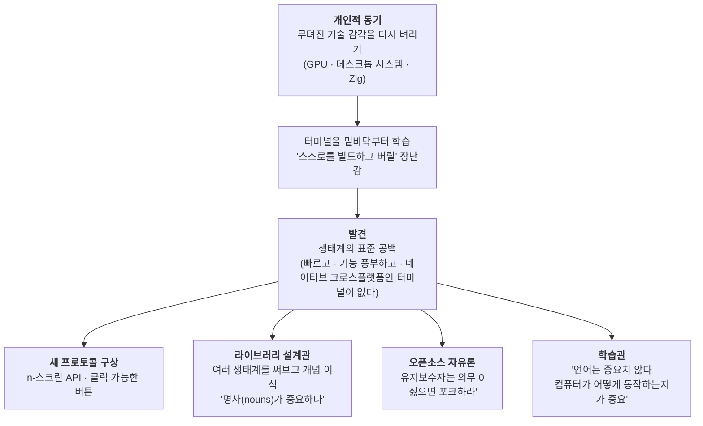
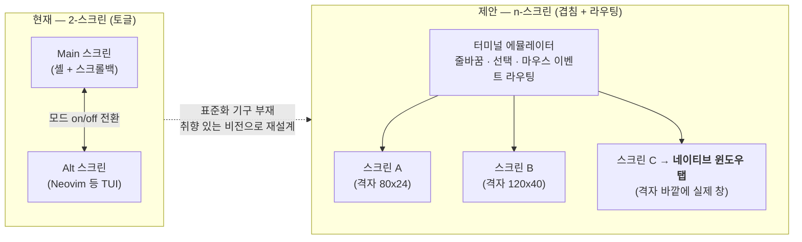
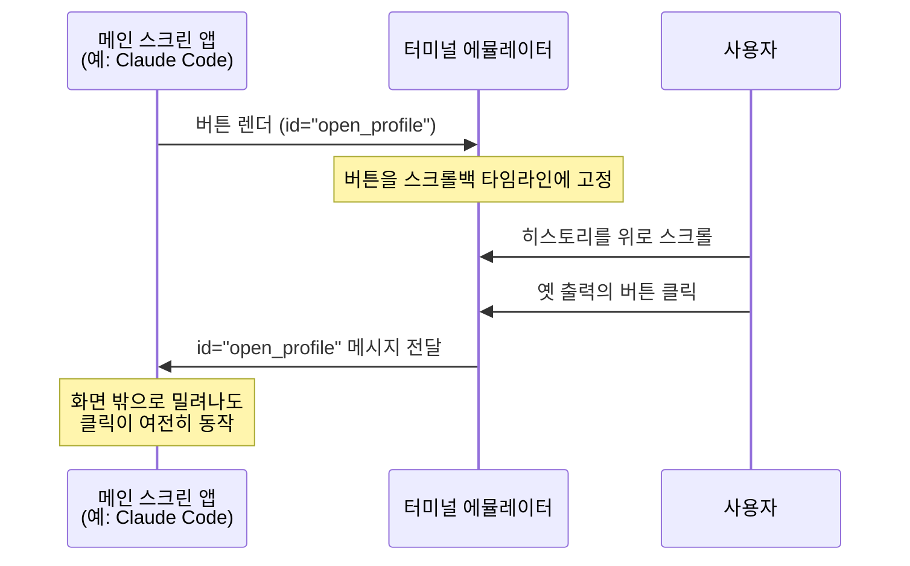

<figure class="post-figure post-figure--header">
<svg role="img" aria-label="오르그리마르 대장간 장면. 왼쪽 땅에는 Vagrant·Terraform·Vault라 적힌 낡은 CLI 도구 두루마리들이 내려놓여 있다. 뒤로는 HashiCorp를 상징하는 깃발 두 개가 나부낀다. 가운데 모루 위로 새로 벼려낸 'Ghostty' 터미널이 방패처럼 들어올려져 있고, 방패 면에는 모노스페이스 격자와 깜빡이는 프롬프트 커서가 빛난다. 오른쪽에는 Zig 룬(⚡)이 새겨진 대장장이 망치가 모루 곁에 세워져 있어, 도구 제작자가 다시 손을 벼리는 귀환을 상징한다." viewBox="0 0 680 300" xmlns="http://www.w3.org/2000/svg">
  <title>도구 제작자의 귀환 — 낡은 CLI 도구를 내려놓고 새로 벼려낸 Ghostty 터미널을 들다</title>

  <!-- ground line -->
  <line x1="20" y1="252" x2="660" y2="252" stroke="currentColor" stroke-width="1.5" opacity="0.4"/>

  <!-- ===== back banners (HashiCorp legacy) ===== -->
  <g opacity="0.9">
    <line x1="112" y1="70" x2="112" y2="252" stroke="currentColor" stroke-width="2.5"/>
    <path d="M112 74 L152 82 L112 104 Z" fill="var(--secondary-color)" stroke="currentColor" stroke-width="1.5"/>
    <line x1="588" y1="80" x2="588" y2="252" stroke="currentColor" stroke-width="2.5"/>
    <path d="M588 84 L548 92 L588 114 Z" fill="var(--secondary-color)" stroke="currentColor" stroke-width="1.5"/>
    <text x="600" y="96" font-size="8" fill="currentColor" opacity="0.7">HashiCorp</text>
  </g>

  <!-- ===== old CLI tools set down (left) ===== -->
  <g>
    <rect x="42" y="212" width="46" height="40" rx="2" fill="var(--bg-light)" stroke="currentColor" stroke-width="1.6"/>
    <text x="65" y="236" text-anchor="middle" font-size="7" fill="currentColor" font-weight="700">Vagrant</text>
    <rect x="70" y="222" width="46" height="30" rx="2" fill="var(--bg-light)" stroke="currentColor" stroke-width="1.6"/>
    <text x="93" y="241" text-anchor="middle" font-size="7" fill="currentColor" font-weight="700">Terraform</text>
    <rect x="30" y="230" width="42" height="22" rx="2" fill="var(--bg-sunken)" stroke="currentColor" stroke-width="1.6"/>
    <text x="51" y="245" text-anchor="middle" font-size="7" fill="currentColor" font-weight="700">Vault</text>
    <text x="72" y="200" text-anchor="middle" font-size="8.5" fill="currentColor" opacity="0.7">내려놓은 CLI 도구</text>
  </g>

  <!-- ===== anvil (center) ===== -->
  <g>
    <path d="M300 236 L444 236 L438 250 L306 250 Z" fill="var(--steel)" stroke="currentColor" stroke-width="1.6"/>
    <rect x="352" y="250" width="40" height="10" fill="var(--steel)" stroke="currentColor" stroke-width="1.6"/>
    <path d="M300 236 L288 228 L300 226 Z" fill="var(--steel)" stroke="currentColor" stroke-width="1.4"/>
  </g>

  <!-- ===== Ghostty terminal-shield (raised, glowing) ===== -->
  <g>
    <!-- glow halo -->
    <path d="M372 46 L468 60 L468 140 Q468 186 372 214 Q276 186 276 140 L276 60 Z" fill="var(--gold)" opacity="0.18"/>
    <!-- shield body -->
    <path d="M372 54 L460 66 L460 138 Q460 180 372 206 Q284 180 284 138 L284 66 Z" fill="var(--bg-panel)" stroke="var(--gold)" stroke-width="3"/>
    <!-- monospace grid screen -->
    <rect x="304" y="84" width="136" height="70" rx="2" fill="var(--bg-sunken)" stroke="var(--accent-color)" stroke-width="2"/>
    <g stroke="currentColor" stroke-width="0.7" opacity="0.28">
      <line x1="321" y1="84" x2="321" y2="154"/><line x1="338" y1="84" x2="338" y2="154"/>
      <line x1="355" y1="84" x2="355" y2="154"/><line x1="372" y1="84" x2="372" y2="154"/>
      <line x1="389" y1="84" x2="389" y2="154"/><line x1="406" y1="84" x2="406" y2="154"/>
      <line x1="423" y1="84" x2="423" y2="154"/>
      <line x1="304" y1="101" x2="440" y2="101"/><line x1="304" y1="118" x2="440" y2="118"/>
      <line x1="304" y1="135" x2="440" y2="135"/>
    </g>
    <!-- prompt + blinking cursor -->
    <text x="312" y="114" font-size="12" fill="var(--secondary-color)" font-weight="700">&#187;</text>
    <rect x="326" y="105" width="9" height="12" fill="var(--accent-color)"/>
    <!-- name plate -->
    <text x="372" y="184" text-anchor="middle" font-size="15" fill="currentColor" font-weight="700">Ghostty</text>
  </g>

  <!-- ===== Zig-runed forge hammer (right of anvil) ===== -->
  <g>
    <line x1="486" y1="120" x2="486" y2="248" stroke="currentColor" stroke-width="4"/>
    <rect x="466" y="104" width="40" height="26" rx="2" fill="var(--steel)" stroke="currentColor" stroke-width="1.8"/>
    <text x="486" y="122" text-anchor="middle" font-size="13" fill="var(--gold)" font-weight="700">&#9889;</text>
    <text x="486" y="150" text-anchor="middle" font-size="8.5" fill="currentColor" opacity="0.8">Zig</text>
  </g>
</svg>
<figcaption>도구 제작자의 귀환 — 낡은 CLI 도구를 내려놓고, Zig로 벼려낸 Ghostty 터미널을 다시 손에 들다</figcaption>
</figure>

## 원문 정보

> - **제목**: Interview With Mitchell Hashimoto
> - **출처**: Alex Alejandre 개인 블로그 ([alexalejandre.com](https://alexalejandre.com/))
> - **발행**: 2026-07 · 약 12분 분량
> - **원문 링크**: <https://alexalejandre.com/interviews/interview-with-mitchell-hashimoto/>

Vagrant·Packer·Consul·Terraform·Vault·Nomad·Waypoint을 만든 HashiCorp 창업자가, 지금은 터미널 에뮬레이터 Ghostty를 만든다. "팔 것이 없는" 두 사람이 나눈 이 인터뷰는 인프라 거물의 비즈니스담이 아니라, 한 엔지니어가 무뎌진 기술 감각을 다시 벼리는 이야기다. 인물·문화·인터뷰를 담는 Engineering-Culture에 딱 맞는 글이라 정리·분석한다.

## 한 줄 요약 (TL;DR)

Mitchell Hashimoto는 HashiCorp를 떠난 뒤 GPU·데스크톱 시스템 프로그래밍과 Zig를 익히려는 개인적 동기로 Ghostty를 시작했고, 그 과정에서 터미널 생태계의 표준 공백을 발견해 n-스크린·클릭 가능한 버튼 같은 새 프로토콜을 구상한다. 그의 일관된 축은 "오픈소스는 안정성이나 유지보수 의무가 아니라 자유(사용·수정·포크)에 관한 것"이라는 자유론과, "언어는 중요하지 않다, 컴퓨터가 어떻게 동작하는지가 중요하다"는 학습관이다.

## 왜 이 글을 골랐나

이 위키에는 이미 SQLite 창시자 [Richard Hipp 인터뷰](/2026/06/19/sqlite-richard-hipp-interview.html)와 Zig 재단 Loris Cro의 [소프트웨어 북극성](/2026/06/22/my-software-north-star.html)이 있다. 이 인터뷰는 그 두 글과 같은 계보에 있다. "공짜 강아지(free puppy)" 풀 리퀘스트를 거절하는 Hipp, 기술적 미덕보다 사용자 효용을 앞세우는 Cro, 그리고 "유지보수자는 사용자에게 아무 의무가 없다"고 잘라 말하는 Hashimoto는 서로 다른 언어로 같은 이야기를 한다.

특히 인상적인 건 이 인터뷰가 **비즈니스가 아니라 크래프트(craft)에 대한 것**이라는 점이다. 인프라 유니콘을 세운 사람이 "무뎌진 기술 감각을 다시 갈고 싶어서" 터미널 에뮬레이터를 밑바닥부터 다시 배운다. 도구 제작자가 다시 도구 사용자로 돌아가려는 이 태도 자체가, 시니어 엔지니어에게 던지는 질문이다.

이 인터뷰의 척추는 "개인적 긁적임이 어떻게 생태계급 통찰과 철학으로 확장되는가"다. 아래 한 장으로 그 흐름을 따라갈 수 있다.

## 핵심 내용

### Ghostty는 '팔 것'이 아니라 개인적 긁적임에서 시작됐다

Hashimoto는 15년간 CLI 애플리케이션(요즘의 TUI가 아니라)을 만들며 커서 이동·색 입히기 같은 것을 "우연히" 익혔다고 말한다. HashiCorp를 떠나면서 그가 다시 갈고 싶었던 건 세 가지였다. **(1) pre-AI 시대의 GPU 프로그래밍, (2) 분산 시스템에서 소홀했던 데스크톱·단일 노드 시스템 프로그래밍(캐시 지역성·벡터 연산), (3) Zig를 직접 다뤄보기.** 분산 쪽에선 네트워크 비용이 지배적이라 캐시 지역성을 걱정할 일이 없었다는 회고가 흥미롭다.

목표는 소박했다. "터미널 안에서 vim과 컴파일러를 돌려 그것이 스스로를 빌드하게 만든 뒤, 버리는 것." 그런데 배울수록 자신이 원하는 니치 — **빠르고, 기능이 풍부하며, 네이티브하게 크로스플랫폼인** 터미널 — 를 채우는 물건이 없다는 걸 깨달았다. Discord의 친구 단체 채팅방이 그대로 Ghostty 커뮤니티가 됐고, 공개하면 "부당한 관심"이 쏠릴 걸 알아 오랫동안 비공개 베타로 운영했다.

### 터미널을 '극한까지' 밀어붙이는 데엔 반대한다

터미널이 브라우저나 옛 Java 런타임처럼 무엇이든 담는 애플리케이션 플랫폼이 될 수 있다는 주장에 그는 선을 긋는다. 브라우저는 브라우저가 잘하는 게 있고, 데스크톱은 데스크톱이, **텍스트 기반(모노스페이스 격자) 애플리케이션은 그것대로 고유하게 잘하는 게 있다.** 텍스트 앱은 구현이 빠르고, 상호작용이 쉽고, 보안 모델이 명확해야 한다.

핵심은 **조합 가능성(composition)**이다. 대부분의 CLI 도구는 stdin/stdout을 넘어 함수처럼 쓸 수 있는 메커니즘을 갖는다("한 가지만 잘하라"는 UNIX 철학의 극단). 더 나은 터미널 애플리케이션의 세계는 곧 더 나은 자동화·스크립트화의 세계다. 그가 지목하는 근본 문제는 **PTY의 인밴드 시그널링** — 이스케이프 시퀀스가 섞인 비구조화 바이트 스트림 — 이다. Nushell이 또 다른 레이어로 이를 고치려 하지만, 그는 더 근본적인 개선이 필요하다며 구조화 데이터를 제대로 다루는 PowerShell을 (많은 이가 MS 생태계를 싫어함에도) 긍정적으로 인용한다.

### 두 개의 새 프로토콜: n-스크린과 클릭 가능한 버튼

아래 도식은 그가 지목하는 현재의 **2-스크린 모델**과 제안하는 **n-스크린 모델**을 나란히 놓은 것이다.

버튼 프로토콜은 별개의 문제를 겨눈다 — 지금의 마우스 프로토콜은 **현재 화면의 셀 클릭만** 알려주고 스크롤백으로 넘어간 히스토리는 놓친다. OSC 8(하이퍼링크)처럼 클릭 시 지정한 메시지를 프로그램에 보내는 버튼에 `open_profile` 같은 ID를 붙이면, 사용자가 히스토리를 스크롤해도 클릭이 살아있다.

그의 설계 태도는 **"직접 발명하기 전에 수십 년의 선행 기술을 먼저 조사한다"**는 것이다. 클립보드 접근을 개선하려면 모든 플랫폼의 클립보드 매니저 문서를 뒤져 업계가 어디에 안착했는지 본다. DOM/JS, AppKit·Cocoa·SwiftUI, Win32·WinUI, GTK·Qt — 각 플랫폼의 프레임워크가 어떻게 동작하는지가 그의 길잡이별이다. 아직 커스텀 프로토콜은 하나도 도입하지 않았다.

그럼에도 "소리치는" 두 프로토콜이 있다.

- **n-스크린 API**: 지금 터미널은 메인 스크린(스크롤백 있는 셸)과 alt 스크린(Neovim 등 TUI)의 두 개뿐이고, 모드를 켜고 끄며 전환한다. 대신 백그라운드에 무제한의 스크린을 만들어 서로 다른 격자 크기로 겹치고, 줄바꿈·선택·마우스 이벤트 라우팅을 에뮬레이터가 처리한다. 스크린을 독립 윈도우로 지정하면 격자 바깥에 네이티브 창으로 렌더링된다 — **"Neovim 탭이 네이티브 윈도우 탭으로 동시에 열리는" 모습**을 상상하면 된다.
- **버튼 프로토콜**: 지금의 마우스 프로토콜은 현재 화면의 셀 클릭만 알려주고, 스크롤백으로 넘어간 히스토리는 놓친다. OSC 8(하이퍼링크)과 비슷하게, 클릭 시 지정한 메시지를 프로그램에 보내는 버튼을 만들자는 것이다. `open_profile` 같은 ID를 붙이면 사용자가 히스토리를 스크롤해도 여전히 동작한다. 이건 스크롤백을 가진 **메인 스크린 애플리케이션(예: Claude Code)**에 영향을 준다("AI를 논하려는 게 아니라, 그냥 인기 있는 메인 스크린 앱일 뿐"이라고 못박는다).

전체 PTY 프로토콜을 Wayland로 대체하는 실험("터미널은 눈을 가늘게 뜨면 그냥 윈도잉 서버다")도 해봤지만 버렸다. 근본 문제는 **더 이상 표준화 기구가 없다**는 것이다. 지난 20년의 표준화는 "가장 인기 있는 터미널이 하는 대로"였고, 그 결과 취향 있는 비전을 밀어붙이는 주체 없이 잡탕 기능만 쌓였다.

### 유지보수자는 사용자에게 아무 의무도 없다

인터뷰의 철학적 심장부다. 그는 "오픈소스 유지보수자는 사용자에게 **0의 의무**를 진다"고 공개적으로 말한다. 라이선스 첫 줄이 "as is, no warranty"이고, 그게 계약이다 — 공짜 소프트웨어를 받는 대신 요구할 수 없다. 다만 좋은 소프트웨어를 만들고 싶은 개인적 욕구 때문에 문제를 고칠 뿐이다.

- 어떤 날은 아침부터 남의 이슈를 고치고, 어떤 날은 이슈·토론·PR을 하나도 읽지 않고 자신이 원하는 것에 집중한다. "하늘에 완벽한 도시를 짓다 돌아와 보면 현실은 참상일 수 있으니, 가끔은 그걸 치워야 한다."
- 모든 이슈만 파면 안정적이되 정체된 소프트웨어가 되고, 모든 PR을 받으면 비전 없이 변한다. "몇 년에 한 명꼴로만 진짜 이해한다. 대부분의 기여는 각자의 특정 가려움을 긁을 뿐이다." 그는 한 영상에서 서로 다른 3~4개의 기능 요청을 **하나의 다른 기능으로 한꺼번에 해결**하며 닫은 적이 있다. 어렵기 때문이 아니라 남의 프로젝트에 그만한 정성을 쏟는 사람이 드물기 때문이라고 말한다. 1년간 틈틈이(컴퓨터 앞이 아닐 때) 생각하다, 앉아서 "이걸 풀겠다" 결심하니 한 시간 걸렸다고.
- **기능 풍부함(feature-rich)과 비대함(bloat)은 다르다.** Ghostty의 검색 기능이 미니멀리즘을 해친다는 비판에, 그는 "쓰지 않는 것에 비용을 치르지 않게" 아키텍처를 짰다고 답한다 — 디스크와 상주 메모리는 쓰되, 안 쓰면 아무 코드도 실행되지 않는 "공짜 기능"이라는 것.
- 그래도 정 싫으면 **"포크해서 직접 유지보수하라."** "내가 그 플래그를 유지하길 바란다면, 나는 당신이 그걸 제거한 포크를 유지하길 요구할 수 있다." 사람들에게 "포크해"라고 말하면 흔히 화를 내지만, 스스로 쉽게 할 수 있는 일을 남에게 구걸하며 자기 주체성을 내던지는 건 **무력한 태도**라고 본다. 그는 훨씬 더 많은 포크(개인용이든 유지보수되는 것이든)가 있어야 한다고 늘 믿어왔다.

그는 이 엔틀먼트(entitlement) 문화의 책임 일부가 **벤처 투자를 받은 오픈소스**에 있다고 자책한다. 웹사이트·유료 지원 인력을 갖춘 세련되고 자금 넉넉한 프로젝트가 한 세대에게 "오픈소스=제품"이라는 기대를 심었지만, 그건 생태계의 아주 작은 부분일 뿐이다. **오픈소스의 핵심은 안정성이 아니라 자유와 권리** — 원하는 대로 쓰고, 수정하고, 포크할 권리 — 다. 보장과 "비난할 권리"를 원하면 소프트웨어를 사서 벤더-고객 관계를 맺으라. "더 많은 사람이 포크한다면, 만드는 이들에 대한 공감도 커질 것이다."

### Zig에 대한 애정, 그리고 AI가 마이그레이션의 고통을 덜어준다

Zig에는 컴파일러 패치를 기여하며 들어갔고 커뮤니티 문화·철학을 잘 안다. 그래서 1.0이 없다는 것에도 화나지 않는다("내가 뭘 선택했는지 알고 있었다"). 0.15의 writer 인터페이스 변경처럼 큰 파괴적 변경이 있어도 "API가 정말 훨씬 나아졌다"고 평한다. BDFL Andrew Kelley가 컴파일 속도를 위해 언어 기능마저 제거하는 것을 "경이롭다"고 말한다 — lib-ghostty(터미널 전체)를 즉시 빌드할 수 있는데도 Andrew는 그 밀리초조차 느리다고 여긴다는 것.

여기서 그는 **자칭 "AI 하이프 마스터가 아니"**라고 선을 그으면서도 중요한 관찰을 남긴다. 신경망은 패턴 매칭·패턴 채우기에 능하다. 언어 마이그레이션 같은 변경에서, 여러 맥락으로 방법을 보여준 뒤 "나머지 올빼미를 그려라"고 시키니 diff가 거대함에도 **90%가 그가 부엌에 있는 동안 자동으로 끝났다.** 이는 "상태 A에서 B로 가는 법을 설명할 수 있다면 하위 호환성의 의미가 훨씬 줄어드는" 미래를 암시한다. Zig의 엄격한 반(反)AI 정책을 생각하면 아이러니하지만, **AI가 파괴적 변경이 하위 사용자에게 주는 고통을 무디게 한다**는 것이다.

### 라이브러리 설계: 여러 생태계를 써보고 개념을 이식하라

Ghostty는 lib-ghostty를 쓰고, 그의 라이브러리가 쓰기 좋다는 평을 받는다. 비결은 "그냥 신경 쓰기"를 넘어 **여러 커뮤니티의 라이브러리를 많이 써보는 것**이다. 대학 때 Prolog·Haskell·Clojure·Java로 토이 프로젝트를 만들며(전문 Java 개발자였던 적은 없다) 빌드 시스템·에르고노믹스·웹 프레임워크를 배웠다. 각 생태계는 서로 다른 문화를 갖고, 그 문화가 관심사 분리와 API 모양에 스며든다. 오랫동안 Java가 도처에 쓰던 빌더 패턴을 Ruby에 시험해보니 꽤 괜찮았다 — 이런 **개념 이식**이 그의 설계법이다: 가장 즐거웠던 개념을 가져와, 비슷한 취향의 사람도 즐기길 바란다.

그는 **"명사(nouns)가 중요하다"**고 강조한다. Docker의 문제는 배포·런타임 관심사가 인간의 작업 흐름을 침범한다는 것이고, Vagrant가 설정·CLI 모두 오로지 **개발** 중심 명사로 설계된 건 의도된 좋은 선택이었다.

### "도구 제작자의 딜레마"와 오늘의 기술 스택

그는 자신을 평생 도구 제작자로 규정하며 **도구 제작자의 딜레마**를 경계한다: 문제를 잘 아는 이가 이상적 도구를 만들지만, 남들이 그걸 좋아하기 시작하면 도구 사용자가 아닌 "땅에서 붕 뜬 도구 제작자"가 된다. 터미널은 그 안에서 살아 도구 사용자지만, TUI 개발 관점에선 부족하다고 인정하며 rockorager 같은 왕성한 TUI 제작자 메인테이너에게 기댄다.

오늘의 기술 스택에 대해선 "…괜찮다"고 뜸을 들인다. TypeScript·React 커뮤니티엔 좋은 점도 많지만 churn과 복잡도, 불명확한 추상화 계층에는 문화적으로 동의하지 않는다 — 그래도 싸우지 않고 주류를 따라 커뮤니티·채용에 협조한다. HTTP/1 → HTTP/2 → HTTP/3의 **비선형적 복잡도 증가**를 예로 들며, "짧은 편지를 쓸 시간이 없어 긴 편지를 썼다"는 격언으로 업계 전반이 더 단순할 수 있었던 걸 복잡하게 만들고 있다고 진단한다(AI가 이를 가속한다고 덧붙인다).

### 원칙, 그리고 서로 다른 부족(tribe)들의 인터넷

HashiCorp의 원칙 문서든 Ghostty의 개발 방향이든, 그에겐 전부 "그냥 나 자신의 반영"이라 지키기 쉽다. 자기답지 않은 원칙을 세울 때 문제가 생긴다(새해 결심 문제). Ghostty의 "크로스플랫폼 코어 + 사과 없는 네이티브 GUI" 같은 선택은 그것을 가치 있게 여기는 사람만 모이게 하고, 그는 **인터넷이 부족들의 집합인 것을 좋아한다.**

가장 짜증나는 건 언어들이 "이 기능도 없으니 쓸모없다"는 식의 **최소공통분모**로 수렴하는 것이다. 그는 특정 언어가 특정 기능을 결여하는 걸 오히려 좋아한다 — **제약이 창의성과 문화를 낳기 때문**이다. 유명한 대목: "사람들이 화내겠지만 그대로 실어도 된다. 나는 Rust **문화**를 좋아하지 않는다." 언어와 철학은 정말 훌륭하고 그들도 좋은 사람들이지만, 그 커뮤니티 곁에 있고 싶지 않을 뿐이라는 것("나는 축구도 안 좋아한다"). 좋고 나쁨을 이분법으로 보는 인터넷의 태도가 기술을 "순응적인 회색 웅덩이"로 만든다고 본다. 반대로 Zig의 양극화된, "사과 없이 이상한(unapologetically weird)" 태도는 존중하기에 재정적으로 지원하고 기술을 쓴다.

### C를 어떻게 배울까 — 언어는 중요하지 않다

마지막 질문에 대한 답이 이 인터뷰의 학습관을 압축한다. **"중요한 건 컴퓨터가 어떻게 동작하는지 배우는 것이고, 언어는 그 이해에 이르는 수단일 뿐이다."** 그의 C 사용 정점은 대학의 파일 시스템·운영체제 수업이었고, C는 저수준 시스템에 가까이 접하는 메커니즘이었을 뿐이다. 고수준 추상화와 웹 개발의 시대에도 CPU 스케줄링·메모리·캐시 계층·파일 시스템·디스크 접근의 기초를 이해하는 건 여전히 중요하다. syscall 바로 위에서 작업할 때(C든 Zig든 Rust든) 무슨 일이 일어나는지 이해하게 되지만, Python·JS·Ruby의 `file open` API는 너무 많은 걸 감춘다.

또 다른 학습법은 **고수준 언어가 어떻게 구현됐는지 읽는 것**이다. "표준 라이브러리 함수를 당연하게 여기지 마라. 어떤 사람이 그걸 짰고, 당신도 짤 수 있다. 어떻게 동작하는가? stdlib를 읽어라. **언어는 쉽고, 언어는 중요하지 않다. 근본적인 이해가 중요하다.**"

## 분석과 인사이트

**여기서 원문 요약을 넘어 내 관점을 밝힌다.**

**"기술 재연마를 위한 프로젝트"라는 프레이밍이 신선하다.** 대부분의 사이드 프로젝트는 "이런 문제를 풀겠다"는 문제 지향으로 시작한다. Hashimoto는 반대로 **배우고 싶은 기술 세 가지(GPU·데스크톱 시스템·Zig)를 먼저 정하고, 그 셋을 동시에 만족시킬 학습 매개로 터미널을 골랐다.** 결과물(Ghostty)이 유명해진 건 부산물이다. 시니어가 정체를 피하는 한 가지 처방이 여기 있다 — 도구 제작자의 딜레마를 자각하고, 의도적으로 자신이 서툰 영역으로 내려가는 것.

**"의무 0" 자유론은 냉정해 보이지만 실은 생태계 건강론이다.** [Richard Hipp의 '공짜 강아지' PR론](/2026/06/19/sqlite-richard-hipp-interview.html)과 정확히 같은 자리에 선다. Hipp은 "공짜로 강아지를 받으면 평생 먹여야 한다"며 PR 병합의 영구 비용을 말하고, Hashimoto는 "내가 겪지 않는 버그의 PR은 병합하지 않는다"고 같은 논리를 편다. 두 사람 다 오픈소스를 **제품이 아니라 자유**로 정의한다. 흥미로운 건 Hashimoto가 이 엔틀먼트 문화의 책임을 **벤처 오픈소스(그 자신이 몸담았던 HashiCorp를 포함한)**에 돌리는 자기비판이다. "포크해"라는 말이 무례가 아니라 **주체성의 회복**이라는 재프레이밍은, [성당·시장·윈체스터 하우스](/2026/06/22/cathedral-bazaar-winchester-mystery-house.html)가 그린 "AI 시대의 폭발적 개인 포크"와도 맞닿는다.

**다만 "포크하라"는 처방엔 현실적 마찰이 있다.** 포크는 권리이지 능력이 아니다. C/Zig 코드베이스를 포크해 검색 기능을 걷어내고 계속 리베이스할 수 있는 사용자는 극소수다. Hashimoto의 논리는 원칙적으로 옳지만, "쉽게 할 수 있는 일"이라는 전제는 그의 실력 수준에서만 참이다. 그가 스스로 지적한 **"몇 년에 한 명만 진짜 이해한다"**는 통계가, 역설적으로 "포크하라"가 대다수에겐 실질적 선택지가 아님을 보여준다. 그럼에도 방향은 맞다 — 무력한 요구보다 유지 가능한 포크가 건강하다.

**AI에 대한 균형 감각이 이 인터뷰의 신뢰도를 높인다.** "나는 AI 하이프 마스터가 아니"라면서도, 데모는 "완전히 쓰레기 코드로 sloppify"해 방향만 검증하고 좋으면 정성 들여 다시 시작한다는 워크플로는 매우 구체적이다. 6주 된 아기 때문에 하루 3시간만 컴퓨터 앞에 있는 그가 "컴퓨터 밖에서 아이디어를 나 자신에게 배송한다"는 표현은, [짧은 목줄(short leash) AI 코딩론](/2026/07/06/short-leash-ai-coding.html)이 말하는 "검증하는 인간이 최종 책임을 진다"와 정확히 같은 규율이다. **"읽고 이해한 코드만 배송하라"**는 그의 원칙은 AI 시대에도 변하지 않는 프로의 하한선이다.

**"언어는 중요하지 않다"는 조언은 이 위키의 방향과 공명한다.** Rust·Zig·C 어느 언어를 배울지 묻는 질문에 그는 언어 대신 CPU 스케줄링·메모리·캐시 계층·파일 시스템을 말한다. 이는 [C++의 40년사](/2026/06/19/story-of-cpp.html)나 시스템 프로그래밍 심화가 지향하는 지점과 같다 — 언어는 갈아탈 수 있어도 "syscall 바로 위에서 무슨 일이 일어나는가"의 이해는 이식된다. "stdlib를 읽어라, 어떤 인간이 그걸 짰고 당신도 짤 수 있다"는 말은 학습자에게 주는 가장 값진 한 줄이다.

**한 가지 유보.** "제약이 창의성과 문화를 낳는다"며 Rust **문화**를 좋아하지 않는다고 공개적으로 말하는 건 솔직하고, 부족 다양성 옹호로서 일관된다. 다만 이런 발언은 소비될 때 "언어 문화의 좋고 나쁨"이라는 그가 비판한 바로 그 이분법으로 회수되기 쉽다. 그의 진짜 메시지 — **서로 다른 곳이 다르게 느껴져야 하고, 모든 곳이 모두를 환영할 필요는 없다** — 는 취향의 선언이지 서열의 선언이 아니다. 이 구분을 놓치면 인용이 왜곡된다.

## 적용 포인트

- **정체를 느끼면 '문제'가 아니라 '배우고 싶은 기술'에서 사이드 프로젝트를 시작하라.** 익히고 싶은 역량 2~3개를 먼저 정하고, 그것을 동시에 요구하는 학습 매개를 골라라.
- **자기 프로젝트의 원칙은 '자기다운' 것으로 써라.** 자기답지 않은 원칙은 새해 결심처럼 지켜지지 않는다.
- **기능 요청은 개별로 받지 말고 상류(upstream)를 물어라.** "왜 애초에 이 문제에 도달했는가"를 이해하면, 3~4개 요청을 하나의 우아한 기능으로 닫을 수 있다.
- **"쓰지 않으면 비용이 없게" 기능을 설계하라.** feature-rich와 bloat의 경계는 아키텍처로 긋는다 — 안 쓰면 코드가 실행되지 않게.
- **라이브러리 설계 감각은 '안 쓸 언어'를 써보며 기른다.** 다른 생태계의 즐거웠던 개념(빌더 패턴 등)을 자기 언어로 이식하라. **명사(nouns)를 먼저 설계하라.**
- **AI는 '방향 검증용 쓰레기 데모'와 '마이그레이션 자동화'에 쓰되, 배송하는 코드는 반드시 읽고 이해하라.**
- **언어보다 컴퓨터를 배워라.** CPU 스케줄링·메모리·캐시 계층·파일 시스템·syscall을 이해하고, 당연하게 여기던 stdlib 함수의 구현을 직접 읽어라.
- **오픈소스에 무언가를 요구하기 전에, 포크해서 유지할 수 있는지 자문하라.** 보장이 필요하면 값을 지불해 벤더-고객 관계를 맺어라.

## 마무리

이 인터뷰의 매력은 인프라 거물의 성공담이 아니라, 한 시니어 엔지니어가 무뎌진 손을 다시 벼리며 터미널이라는 낡은 땅에서 취향 있는 비전을 찾는 과정에 있다. n-스크린·버튼 프로토콜 같은 구체적 구상, "유지보수자는 아무 의무도 없다"는 냉정하지만 일관된 자유론, Zig에 대한 애정과 균형 잡힌 AI관, 그리고 "언어는 중요하지 않다, 컴퓨터가 어떻게 동작하는지가 중요하다"는 학습관까지 — 도구를 만드는 사람이라면 오래 곱씹을 대목이 많다. 결국 그가 반복하는 한 문장으로 요약된다: 좋은 소프트웨어를 만들려면 **자기 소프트웨어의 사용자가 되어, 사람들이 즐겁게 쓸 무언가를 정성껏 만들어라.**

### 더 읽어보기

- [원문 — Interview With Mitchell Hashimoto (Alex Alejandre)](https://alexalejandre.com/interviews/interview-with-mitchell-hashimoto/)
- [SQLite 창시자 Richard Hipp 인터뷰: 26년, 자작 도구, 그리고 AI](/2026/06/19/sqlite-richard-hipp-interview.html) — '공짜 강아지 PR'과 '의무 0' 자유론이 정확히 겹치는 또 다른 유지보수자 인터뷰
- [내 소프트웨어의 북극성 (Loris Cro)](/2026/06/22/my-software-north-star.html) — 같은 Zig 진영에서 나온, 기술적 미덕보다 사용자 효용을 앞세우는 매니페스토
- [성당, 시장, 그리고 윈체스터 미스터리 하우스 (Drew Breunig)](/2026/06/22/cathedral-bazaar-winchester-mystery-house.html) — "더 많은 포크"가 그리는 AI 시대의 개인 자작 도구 폭발
- [짧은 목줄로 AI 코딩하기](/2026/07/06/short-leash-ai-coding.html) — "읽고 이해한 코드만 배송한다"는 그의 AI 규율과 같은 결
- [C++의 이야기: 40년 언어사](/2026/06/19/story-of-cpp.html) — "언어보다 저수준 이해"라는 학습관이 향하는 시스템 프로그래밍의 뿌리
