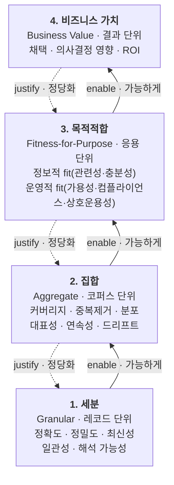

<figure class="post-figure post-figure--header">
<svg role="img" aria-label="데이터 품질을 네 칸짜리 사다리로 그린 그림. 맨 아래 흐르는 데이터 레코드 위로 사다리가 서 있고, 아래에서 위로 1칸 세분(Granular), 2칸 집합(Aggregate), 3칸 목적적합(Fitness), 4칸 비즈니스 가치(Value) 순으로 쌓인다. 아래 칸일수록 '측정 쉬움(legible)', 위 칸일수록 '가치 있음'으로 대비된다. 왼쪽에는 아래에서 위로 향하는 'enable(가능하게)' 화살표가, 오른쪽에는 위에서 아래로 향하는 'justify(정당화)' 화살표가 있어, 아래 칸이 위 칸을 가능하게 하고 위 칸이 아래 칸을 정당화함을 보여준다. 한 칸이라도 건너뛰면 사다리는 무너진다." viewBox="0 0 680 400" xmlns="http://www.w3.org/2000/svg">
  <title>데이터 품질의 4단 사다리 — 세분 · 집합 · 목적적합 · 비즈니스 가치</title>

  <!-- top / bottom polarity tags -->
  <text x="340" y="24" text-anchor="middle" font-size="12" fill="var(--accent-color)" font-weight="700">↑ 가치 있음 (justify 대상)</text>
  <text x="340" y="392" text-anchor="middle" font-size="12" fill="currentColor" font-weight="700" opacity="0.8">↓ 측정 쉬움 · legible (enable 기반)</text>

  <!-- ladder rails -->
  <line x1="150" y1="40" x2="150" y2="330" stroke="currentColor" stroke-width="3" opacity="0.45"/>
  <line x1="530" y1="40" x2="530" y2="330" stroke="currentColor" stroke-width="3" opacity="0.45"/>

  <!-- Rung 4 — Business value (top, the prize) -->
  <rect x="176" y="42" width="328" height="52" rx="3" fill="var(--bg-panel)" stroke="var(--accent-color)" stroke-width="3"/>
  <text x="340" y="66" text-anchor="middle" font-size="14" fill="currentColor" font-weight="700">4. 비즈니스 가치</text>
  <text x="340" y="84" text-anchor="middle" font-size="9.5" fill="currentColor" opacity="0.8">Business Value — 채택 · 의사결정 영향 · ROI</text>

  <!-- Rung 3 — Fitness-for-purpose -->
  <rect x="176" y="112" width="328" height="52" rx="3" fill="var(--bg-panel)" stroke="var(--secondary-color)" stroke-width="2.5"/>
  <text x="340" y="136" text-anchor="middle" font-size="14" fill="currentColor" font-weight="700">3. 목적적합</text>
  <text x="340" y="154" text-anchor="middle" font-size="9.5" fill="currentColor" opacity="0.8">Fitness — 정보적 fit · 운영적 fit</text>

  <!-- Rung 2 — Aggregate -->
  <rect x="176" y="182" width="328" height="52" rx="3" fill="var(--bg-light)" stroke="currentColor" stroke-width="2"/>
  <text x="340" y="206" text-anchor="middle" font-size="14" fill="currentColor" font-weight="700">2. 집합</text>
  <text x="340" y="224" text-anchor="middle" font-size="9.5" fill="currentColor" opacity="0.8">Aggregate — 커버리지 · 분포 · 드리프트</text>

  <!-- Rung 1 — Granular (bottom, most legible) -->
  <rect x="176" y="252" width="328" height="52" rx="3" fill="var(--bg-light)" stroke="currentColor" stroke-width="2"/>
  <text x="340" y="276" text-anchor="middle" font-size="14" fill="currentColor" font-weight="700">1. 세분</text>
  <text x="340" y="294" text-anchor="middle" font-size="9.5" fill="currentColor" opacity="0.8">Granular — 정확도 · 최신성 · 일관성</text>

  <!-- flowing data records at the base -->
  <g opacity="0.7">
    <rect x="196" y="330" width="34" height="14" rx="2" fill="var(--bg-panel)" stroke="currentColor" stroke-width="1.4"/>
    <rect x="242" y="330" width="34" height="14" rx="2" fill="var(--bg-panel)" stroke="currentColor" stroke-width="1.4"/>
    <rect x="288" y="330" width="34" height="14" rx="2" fill="var(--bg-panel)" stroke="currentColor" stroke-width="1.4"/>
    <rect x="334" y="330" width="34" height="14" rx="2" fill="var(--bg-panel)" stroke="currentColor" stroke-width="1.4"/>
    <rect x="380" y="330" width="34" height="14" rx="2" fill="var(--bg-panel)" stroke="currentColor" stroke-width="1.4"/>
    <rect x="426" y="330" width="34" height="14" rx="2" fill="var(--bg-panel)" stroke="currentColor" stroke-width="1.4"/>
    <text x="340" y="360" text-anchor="middle" font-size="9" fill="currentColor" opacity="0.75">데이터 레코드가 흘러 들어온다</text>
  </g>

  <!-- enable arrow (bottom -> top, left) -->
  <defs>
    <marker id="dq-up" markerWidth="9" markerHeight="9" refX="4.5" refY="8" orient="auto"><path d="M0,8 L4.5,0 L9,8 Z" fill="var(--secondary-color)"/></marker>
    <marker id="dq-down" markerWidth="9" markerHeight="9" refX="4.5" refY="8" orient="auto"><path d="M0,8 L4.5,0 L9,8 Z" fill="var(--accent-color)"/></marker>
  </defs>
  <line x1="96" y1="320" x2="96" y2="60" stroke="var(--secondary-color)" stroke-width="3" marker-end="url(#dq-up)"/>
  <text x="80" y="196" text-anchor="middle" font-size="12" fill="var(--secondary-color)" font-weight="700" transform="rotate(-90 80 196)">enable · 가능하게</text>

  <!-- justify arrow (top -> bottom, right) -->
  <line x1="584" y1="60" x2="584" y2="320" stroke="var(--accent-color)" stroke-width="3" marker-end="url(#dq-down)"/>
  <text x="600" y="196" text-anchor="middle" font-size="12" fill="var(--accent-color)" font-weight="700" transform="rotate(90 600 196)">justify · 정당화</text>
</svg>
<figcaption>데이터 품질의 4단 사다리 — 아래 칸이 위 칸을 가능하게 하고(enable), 위 칸이 아래 칸을 정당화한다(justify). 한 칸도 건너뛸 수 없다.</figcaption>
</figure>

## 원문 정보

> - **제목**: On Data Quality — The Fundamentals (연재 1편: Basics)
> - **출처**: Pivotal · Abraham Thomas ([pivotal.substack.com](https://pivotal.substack.com))
> - **발행**: 2026-06-27
> - **원문 링크**: <https://pivotal.substack.com/p/on-data-quality-1-basics>

데이터 엔지니어링의 오래된 난제인 "데이터 품질이란 무엇인가"를 정의부터 다시 세우는 개념 에세이다. 우리 위키의 Data-Engineering 계열 심화(품질·거버넌스, dbt 테스트)와 정확히 맞닿아 있어 Articles에 담는다.

## 한 줄 요약 (TL;DR)

데이터는 내재된 품질을 갖지 않는다. 품질은 **유스케이스에 전적으로 의존해 창발하는 현상**이며, `세분(granular) → 집합(aggregate) → 목적적합(fitness-for-purpose) → 비즈니스 가치(business value)`라는 4단 사다리로 봐야 한다. 아래 칸은 위 칸을 **가능하게** 하고, 위 칸은 아래 칸을 **정당화**한다.

아래는 이 글의 척추를 한 장으로 옮긴 것이다. 네 층위를 세로로 쌓고, 각 칸의 대표 속성과 판정 단위를 붙였다. 왼쪽 화살표는 아래가 위를 **가능하게(enable)** 하는 방향, 오른쪽 화살표는 위가 아래를 **정당화(justify)** 하는 방향이다.

두 실패 양식이 이 사다리의 양 끝에서 나온다. 아래 칸("legible")만 다지고 4번 칸을 비우면 **발사 실패(Failure to Launch)**, 기초를 건너뛰고 결과만 좇으면 **접지 실패(Failure to Ground)**.

## 왜 이 글을 골랐나

데이터 품질 논의는 대부분 "결측치 몇 %, 중복 몇 건" 같은 **측정 가능한 하위 지표**에서 시작하고 거기서 끝난다. 그런데 현장에서 벌어지는 진짜 다툼("이 데이터 품질이 좋냐 나쁘냐")은 대개 이해관계자들이 **서로 다른 층위에서 말하고 있기 때문에** 생긴다. 이 글은 그 혼란을 하나의 조직 원리로 정리한다.

특히 우리 위키의 [데이터 품질·거버넌스·관측가능성](/2026/06/25/data-quality-governance.html) 포스트가 "파이프라인이 돈다 ≠ 데이터가 맞다"의 **엔지니어링 도구**(Great Expectations, dbt tests, 관측가능성 5축)를 다뤘다면, 이 글은 그 위에 얹을 **사고 프레임**을 준다. 도구를 어느 층위에 겨눠야 하는지를 알려 주는 지도다.

## 핵심 내용

### 표준은 빈약하다 (Standards Are Poor)

저자는 두 ISO 표준을 비판하며 출발한다.

- **ISO 8000**은 품질 데이터를 "명시된 요구사항을 충족하는 데이터"로 정의한다. 저자는 이를 "완벽하게 정확하지만 완전히 쓸모없다(perfectly accurate and completely useless)"고 일축한다. 동어반복일 뿐 실행 가능한 통찰이 없다는 것이다.
- **ISO 25012**는 정확성·완전성·일관성 등 15개 품질 속성을 나열한다. 틀린 말은 아니지만 **불완전하다** — 하위 층위의 관심사만 다루고 실제 비즈니스 가치와 연결하지 못한다.

두 표준 모두 품질의 **맥락 의존성**을 무시한다는 점에서 실패한다.

### 소박한 주장 (A Modest Assertion)

핵심 명제는 이렇다.

> "데이터는 내재된 품질을 갖지 않는다. 품질은 순수하게 창발하는 현상이며, 유스케이스에 전적으로 조건 지어진다."

여기서 저자의 정의가 나온다: **"데이터 품질이란 데이터의 가치를 높이는 그 무엇이다(Data quality is that which increases data value)."** 데이터의 가치가 쓰임에 전적으로 달려 있으니, 품질 역시 특정 응용·결과와 떼어 놓고 평가할 수 없다.

### 게임의 층위들 — 4단 사다리

품질을 네 개의 상호 의존적 층위로 나눈다.

#### 1. 세분 품질 (Granular Quality) — 레코드 단위

개별 레코드 하나하나를 본다. **정확도(accuracy), 정밀도(precision), 최신성(recency), 일관성(consistency), 해석 가능성(interpretability)** 등. 다른 레코드를 들여다볼 필요 없이 **단독으로** 판정되는 속성이다.

#### 2. 집합 품질 (Aggregate Quality) — 코퍼스 단위

데이터 묶음 전체의 성질을 본다. **커버리지, 중복 제거(deduplication), 세분도(granularity), 대표성과 균형, 레코드 간 일관성, 분포, 볼륨, 연속성(continuity), 조인 가능성(joinability), 드리프트(drift)** 등. 개별 레코드는 멀쩡해도 집합으로 보면 편향·누락·표류가 드러난다.

#### 3. 목적적합 품질 (Fitness-for-Purpose Quality) — 응용 단위

데이터와 **특정 용도의 정렬**을 본다. 두 갈래로 나뉜다.

- **정보적 적합(informational fit)**: 관련성(relevance), 충분성(sufficiency)
- **운영적 적합(operational fit)**: 가용성(availability), 컴플라이언스(compliance), 상호운용성(interoperability)

#### 4. 비즈니스 가치 품질 (Business-Outcome Quality) — 결과 단위

데이터가 **실제로 비즈니스에 가치를 전달하는가**를 본다. 채택(adoption), 의사결정에 미친 영향, 측정 가능한 ROI로 잰다.

### 품질은 사다리다 — 그리고 칸을 건너뛰면 안 된다

이 프레임의 핵심 은유.

> "품질은 사다리다. 아래 칸은 위 칸을 가능하게 하고, 위 칸은 아래 칸을 정당화한다."

층위들은 **순서가 있고 서로 의존한다.** 저자는 두 가지 실패 양식을 든다.

- **발사 실패 (Failure to Launch)**: 아래 칸에만 몰두한다. 세분·집합·목적 층위에서 흠 하나 없는 품질을 구축하지만 **비즈니스 가치는 0.** 하위 칸이 "legible"(측정 가능하고 손대기 쉬움)하기 때문에 흔히 빠지는 함정이다.
- **접지 실패 (Failure to Ground)**: 반대로 기초 작업을 건너뛰고 곧장 비즈니스 결과만 좇는다. 목표가 잘 정의돼 있고 피드백 주기가 충분히 빠르면 통하지만, **대개 지속 가능하지 않다 — 기초가 중요하다.**

저자가 든 예시: 매출 데이터가 완벽하게 수집되고 사용자 요구에도 정렬돼 있어도, **보너스 구조가 바뀌면 영업 담당자가 지표를 게이밍**해 의도한 결과를 무너뜨린다. 상위 층위(비즈니스 맥락)의 변화가 하위 층위의 완벽함을 무의미하게 만드는 장면이다.

### 잠깐 숨 고르기 (Taking a Breather)

결론은 네 가지로 정리된다. ① 데이터 품질은 내재적으로 존재하지 않는다. ② 품질은 상호 연결된 층위로 작동한다. ③ 품질은 상호 의존적 사다리다. ④ 실무자는 한 층위에 갇히지 말아야 한다.

그리고 연재 2편을 예고한다: **AI가 데이터 품질에 대한 우리의 직관을 어떻게 바꾸는가** — "멋지고, 뻔하지 않고, 흥미로운" 방식들이 온다고.

## 분석과 인사이트

여기서부터는 원문 요약이 아니라 내 관점이다.

**"품질 = 가치를 높이는 것"이라는 정의는 도발적이지만 정확하다.** 데이터 엔지니어가 흔히 저지르는 실수는 품질을 **파이프라인 내부의 속성**으로 보는 것이다. 그러나 이 글의 정의를 받아들이면, 아무도 쓰지 않는 완벽한 테이블은 "품질이 나쁜" 데이터다. 불편하지만 옳은 결론이다. 이는 [데이터 품질·거버넌스](/2026/06/25/data-quality-governance.html)에서 다룬 "파이프라인이 돈다 ≠ 데이터가 맞다"를 한 단계 더 밀어붙인 것 — "데이터가 맞다 ≠ 데이터가 가치 있다"까지 간다.

**사다리 은유의 진짜 값어치는 '진단 도구'라는 점이다.** 품질 논쟁이 평행선을 달릴 때, 대개 원인은 데이터 자체가 아니라 **당사자들이 서로 다른 칸에 서 있다**는 것이다. 데이터 팀은 세분·집합(정확도·커버리지)을 말하는데, 비즈니스는 4번 칸(ROI·채택)을 말한다. "이 데이터 좋아요?"라는 질문에 먼저 "어느 층위에서요?"라고 되물을 수 있게 해 준다.

**두 실패 양식은 조직의 성향과 대응된다.** '발사 실패'는 엔지니어링이 강하지만 제품/비즈니스 연결이 약한 조직의 병이고, '접지 실패'는 성장 압박이 큰 스타트업이 데이터 부채를 쌓는 방식이다. 흥미로운 건 하위 칸이 "legible"하다는 통찰이다. 우리는 **측정하기 쉬운 것을 개선하려는 경향**이 있어서, 비즈니스 가치처럼 재기 어려운 상위 칸을 자연히 방치한다. dbt tests·Great Expectations로 세분/집합 검증을 촘촘히 짜 놓고도 정작 "이 지표가 결정을 바꿨나"는 묻지 않는 것 — 전형적인 발사 실패다.

**이견 하나.** 사다리가 "칸을 건너뛰면 안 된다"고 하지만, 실무의 초기 단계에서는 **의도적으로 상위 칸부터 검증**하는 게 낫기도 하다. 저자도 "목표가 잘 정의되고 피드백이 빠르면 접지 실패가 통한다"고 인정한다. 즉 사다리는 최종 상태의 구조이지, 반드시 아래부터 쌓아 올리는 시공 순서는 아니다. MVP는 종종 4번 칸(가치 가설)부터 찍고 내려온다.

**단, 이건 개념 프레임이지 측정 방법론은 아니다.** 각 칸을 어떻게 계량하고, 층위 간 트레이드오프를 어떻게 조정하는지는 이 1편의 범위 밖이다. 특히 4번 칸(ROI·의사결정 영향)의 측정은 데이터 품질에서 가장 어려운 미해결 문제로 남는다.

## 적용 포인트

- **품질 논쟁이 나면 먼저 "어느 칸이냐"를 정렬하라.** 세분/집합/목적적합/비즈니스 중 어디를 말하는지 합의하지 않은 채로는 결론이 안 난다.
- **품질 지표 대시보드에 4번 칸을 반드시 넣어라.** 정확도·커버리지·드리프트만 보고 있다면 발사 실패 궤도다. "이 데이터셋을 쓴 의사결정 수 / 채택률"을 함께 추적하라.
- **dbt tests·Great Expectations는 1~2번 칸의 도구임을 인지하라.** ([dbt 테스트·문서화](/2026/07/12/dbt-essential-curriculum.html)) 이들은 세분·집합 품질을 지키지만, 목적적합·비즈니스 가치는 자동 검증되지 않는다 — 사람이 유스케이스로 채워야 한다.
- **상위 층위의 변화가 하위의 완벽함을 무효화할 수 있음을 경계하라.** 보너스·정책·인센티브가 바뀌면 지표 게이밍이 생긴다. 품질 리뷰에 "이 데이터를 만드는 사람의 인센티브가 바뀌었나"를 넣어라.
- **신규 데이터 자산은 가치 가설(4번 칸)부터 스케치하고 내려오라.** 그다음 그 유스케이스가 요구하는 만큼만 아래 칸을 다진다. "완벽한 기초"에 대한 무한 투자를 막는다.

## 마무리

"데이터 품질은 내재된 속성이 아니라 유스케이스에 조건 지어진 창발 현상"이라는 명제는, 데이터 엔지니어링을 **파이프라인 정합성**에서 **가치 전달**로 관점 이동시킨다. 4단 사다리는 그 이동을 실무에서 다룰 수 있게 만드는 조직 원리다 — 어느 칸에서 말하는지 정렬하고, 한 칸에 갇히지 않으며, 아래는 위를 가능하게 하고 위는 아래를 정당화한다는 것. 다음 편의 "AI가 이 직관을 어떻게 바꾸는가"가 특히 기대된다. AI 학습 데이터의 품질은 정확히 이 사다리의 어느 칸에서 판정되어야 하는지가 지금 가장 뜨거운 질문이기 때문이다.

### 더 읽어보기

- [원문 — On Data Quality (1): Basics (Pivotal, Abraham Thomas)](https://pivotal.substack.com/p/on-data-quality-1-basics)
- [데이터 품질·거버넌스·관측가능성: 믿을 수 있는 데이터 만들기](/2026/06/25/data-quality-governance.html) — 이 글의 사다리를 실제로 지키는 엔지니어링 도구(검증·리니지·관측가능성 5축)
- [Data Engineering Essential 커리큘럼](/2026/06/25/data-engineering-essential-curriculum.html) — 데이터 엔지니어링 전체 지도에서 품질이 놓이는 자리
- [dbt Essential 커리큘럼](/2026/07/12/dbt-essential-curriculum.html) — 세분·집합 품질을 코드로 검증하는 dbt tests·문서화 실무
