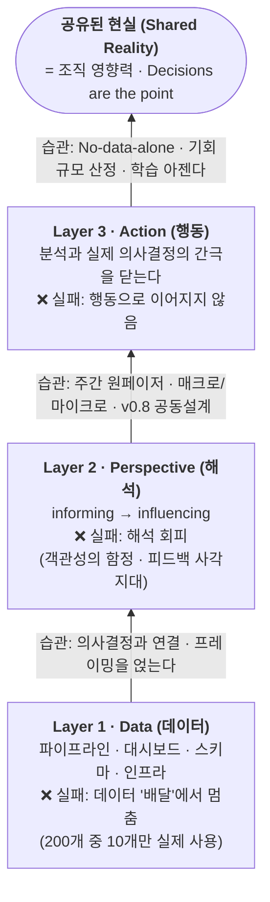

<figure class="post-figure post-figure--header">
<svg role="img" aria-label="정교하게 쌓아 올린 '데이터'라는 튼튼한 성벽 앞에서 의사결정권자가 등을 돌린 채 걸어가는 그림. 왼쪽에는 대시보드와 파이프라인 벽돌로 완벽하게 쌓은 데이터 성벽이 깃발을 꽂은 채 서 있고, 그 위에는 '기술 100%'라는 표시가 붙어 있다. 성벽과 사람 사이는 끊어진 다리로 갈라져 있고, 그 틈에 '빠진 층 · Perspective(해석)'이라는 글자가 놓여 있다. 오른쪽에는 서류가방을 든 의사결정권자가 성벽을 등지고 오른쪽으로 걸어가며, 그 아래에는 '영향력 0'이라 적혀 있다. 완벽한 기술이 조직 영향력으로 이어지지 못하는 데이터 팀의 역설을 한 장으로 담았다." viewBox="0 0 680 300" xmlns="http://www.w3.org/2000/svg">
  <title>완벽한 데이터 성벽 앞에서 등을 돌리는 의사결정권자 — 기술 100% · 영향력 0의 역설</title>

  <!-- ground line -->
  <line x1="20" y1="252" x2="660" y2="252" stroke="currentColor" stroke-width="1.5" opacity="0.45"/>

  <!-- ===== LEFT: the perfect DATA wall ===== -->
  <!-- brick wall -->
  <g stroke="var(--gold)" stroke-width="2">
    <rect x="46" y="110" width="196" height="142" fill="var(--bg-light)"/>
    <!-- brick rows -->
    <line x1="46" y1="140" x2="242" y2="140" opacity="0.7"/>
    <line x1="46" y1="170" x2="242" y2="170" opacity="0.7"/>
    <line x1="46" y1="200" x2="242" y2="200" opacity="0.7"/>
    <line x1="46" y1="230" x2="242" y2="230" opacity="0.7"/>
    <line x1="112" y1="110" x2="112" y2="140" opacity="0.5"/>
    <line x1="178" y1="110" x2="178" y2="140" opacity="0.5"/>
    <line x1="80" y1="140" x2="80" y2="170" opacity="0.5"/>
    <line x1="146" y1="140" x2="146" y2="170" opacity="0.5"/>
    <line x1="212" y1="140" x2="212" y2="170" opacity="0.5"/>
    <line x1="112" y1="170" x2="112" y2="200" opacity="0.5"/>
    <line x1="178" y1="170" x2="178" y2="200" opacity="0.5"/>
    <line x1="80" y1="200" x2="80" y2="230" opacity="0.5"/>
    <line x1="146" y1="200" x2="146" y2="230" opacity="0.5"/>
    <line x1="212" y1="200" x2="212" y2="230" opacity="0.5"/>
  </g>
  <!-- crenellations -->
  <g fill="var(--bg-light)" stroke="var(--gold)" stroke-width="2">
    <rect x="46" y="94" width="30" height="18"/>
    <rect x="105" y="94" width="30" height="18"/>
    <rect x="164" y="94" width="30" height="18"/>
    <rect x="212" y="94" width="30" height="18"/>
  </g>
  <!-- bar-chart icon carved on the wall -->
  <g stroke="var(--secondary-color)" stroke-width="0" fill="var(--secondary-color)">
    <rect x="88" y="196" width="14" height="26"/>
    <rect x="108" y="182" width="14" height="40"/>
    <rect x="128" y="204" width="14" height="18"/>
    <rect x="148" y="172" width="14" height="50"/>
  </g>
  <!-- flag of "완벽" -->
  <line x1="242" y1="60" x2="242" y2="96" stroke="currentColor" stroke-width="2.5"/>
  <path d="M242 62 L286 70 L242 82 Z" fill="var(--accent-color)"/>
  <text x="256" y="76" text-anchor="middle" font-size="9" fill="var(--bg-panel)" font-weight="700">✓</text>
  <text x="144" y="278" text-anchor="middle" font-size="12" fill="currentColor" font-weight="700">완벽한 데이터 성벽 · 기술 100%</text>

  <!-- ===== MIDDLE: the broken / missing bridge ===== -->
  <g stroke="var(--accent-color)" stroke-width="2.5" stroke-dasharray="6 5" fill="none">
    <path d="M256 236 L316 236"/>
    <path d="M400 236 L462 236"/>
  </g>
  <!-- gap posts -->
  <line x1="316" y1="236" x2="316" y2="252" stroke="var(--accent-color)" stroke-width="2"/>
  <line x1="400" y1="236" x2="400" y2="252" stroke="var(--accent-color)" stroke-width="2"/>
  <text x="358" y="176" text-anchor="middle" font-size="12" fill="var(--accent-color)" font-weight="700">빠진 층</text>
  <text x="358" y="194" text-anchor="middle" font-size="10.5" fill="currentColor" opacity="0.85">Perspective (해석)</text>
  <text x="358" y="228" text-anchor="middle" font-size="18" fill="var(--accent-color)" font-weight="700">?</text>

  <!-- ===== RIGHT: the decision-maker walking away (back turned) ===== -->
  <g fill="currentColor" opacity="0.9">
    <!-- head (back of head) -->
    <circle cx="516" cy="118" r="17"/>
    <!-- body / suit -->
    <path d="M498 140 Q516 132 534 140 L540 200 L492 200 Z"/>
    <!-- back arm swinging -->
    <path d="M500 150 L482 186 L490 190 L508 156 Z"/>
    <!-- legs mid-stride -->
    <path d="M500 200 L488 244 L498 246 L510 206 Z"/>
    <path d="M524 200 L540 242 L530 246 L516 206 Z"/>
  </g>
  <!-- briefcase in the far hand -->
  <rect x="474" y="184" width="20" height="15" fill="var(--bg-light)" stroke="currentColor" stroke-width="2"/>
  <!-- walking-away arrow -->
  <line x1="556" y1="150" x2="628" y2="150" stroke="var(--secondary-color)" stroke-width="2.5" marker-end="url(#hdr-arrow)"/>
  <text x="516" y="278" text-anchor="middle" font-size="12" fill="currentColor" font-weight="700">의사결정권자, 등을 돌리다 · <tspan fill="var(--accent-color)">영향력 0</tspan></text>

  <defs>
    <marker id="hdr-arrow" viewBox="0 0 10 10" refX="8" refY="5" markerWidth="7" markerHeight="7" orient="auto-start-reverse">
      <path d="M0 0 L10 5 L0 10 z" fill="var(--secondary-color)"/>
    </marker>
  </defs>
</svg>
<figcaption>완벽하게 쌓아 올린 데이터 성벽(기술 100%)과, 그 앞에서 등을 돌려 걸어가는 의사결정권자(영향력 0). 둘 사이를 잇지 못한 '빠진 층'이 Perspective(해석)다.</figcaption>
</figure>

## 원문 정보

> - **제목**: Why Technically Excellent Data Teams Still Fail
> - **출처**: Goutham Budati, Practical Data Community ([practicaldatacommunity.substack.com](https://practicaldatacommunity.substack.com))
> - **발행**: 2026-06-11 · 약 12~15분 분량
> - **원문 링크**: <https://practicaldatacommunity.substack.com/p/why-technically-excellent-data-teams>

데이터 팀의 실패는 대부분 기술이 아니라 '해석과 의사결정'의 층에서 일어난다는 진단. 데이터 직군의 문화·실무 관점에서 Articles에 담는다.

## 한 줄 요약 (TL;DR)

데이터 팀은 파이프라인·대시보드 같은 **산출물(output)의 양**을 최적화하지만, 조직이 원하는 것은 **의사결정에 대한 영향력**이다. 그 사이를 잇는 빠진 층이 **Perspective(해석)** 이며, 데이터 → 해석 → 행동(Data → Perspective → Action)으로 일하는 습관을 만들 때 비로소 기술적 탁월함이 조직 영향력으로 전환된다.

## 왜 이 글을 골랐나

아래에서 위로, 이 글의 척추는 한 장으로 요약된다. 각 층에는 그 층에 주저앉을 때의 **실패 모드**가 붙어 있고, 위로 올라가는 화살표에는 그 층을 넘기는 **핵심 습관**이 붙어 있다.

"200개의 대시보드를 만들었지만 실제 의사결정에 쓰이는 것은 10개뿐"이라는 문장은 데이터 직군이라면 누구나 뜨끔한다. 이 위키에는 이미 데이터를 다루는 관점의 글이 여럿 있다 — [데이터 품질은 '사다리'다](/2026/07/18/on-data-quality-basics.html)가 데이터의 *유스케이스 적합성*을 이야기했고, [데이터가 당신의 유일한 해자다](/2026/07/20/data-is-your-only-moat.html)와 [The Untrainable](/2026/06/23/the-untrainable.html)이 데이터·도메인 전문성의 *경쟁 우위*를 논했다. 이 글은 그 사이의 빠진 고리 — "잘 만든 데이터가 왜 의사결정으로 이어지지 않는가"라는 **조직 영향력의 문제** — 를 정면으로 다룬다. AI가 인프라 작업을 자동화할수록 남는 가치가 무엇인가라는 질문과도 곧장 연결된다.

## 핵심 내용

저자는 광고 대행사에서 리포팅을 자동화하던 경험에서 이 프레임을 얻었다. **정확한 대시보드보다, 그 데이터를 해석한 예측 모델(forecasting)이 의사결정을 훨씬 강하게 움직였다**는 관찰이 출발점이다. 그는 데이터 업무를 세 개의 층으로 나눈다.

### Layer One: Data (데이터)

인프라·파이프라인·스키마·대시보드 — 모든 것의 토대다. 여기서의 치명적 실패 모드는 **데이터 '배달'에서 멈추고 의사결정과 연결하지 않는 것**이다. 200개 중 10개만 쓰이는 대시보드가 그 증거다.

> "Accurate data without framing hands the hardest interpretive work to the person with the least capability."
> (프레이밍 없는 정확한 데이터는, 가장 어려운 해석 작업을 그 일을 가장 못하는 사람에게 떠넘긴다.)

### Layer Two: Perspective (해석)

데이터 팀이 **알리는 것(informing)에서 영향을 주는 것(influencing)으로 넘어가는** 지점. 저자가 지목하는 '빠진 층'이다. 2026 AI & Data Leadership Executive Benchmark Survey에서 **선임 데이터·AI 리더의 93%가 AI 도입의 핵심 장벽으로 '문화와 변화 관리'를 꼽았고, 기술을 꼽은 사람은 7%뿐**이었다 — 15년 설문 역사상 가장 극단적으로 갈린 결과다. 병목은 기술이 아니라 해석과 채택이라는 뜻이다.

이 층을 가로막는 두 가지 함정:

- **객관성의 함정(objectivity trap)**: 데이터 직군은 "해석은 내 일이 아니다"라며 판단을 회피하고, 그 결과 이해관계자가 알아서 추측하게 만든다.
- **피드백 사각지대(feedback blind spot)**: 엔지니어는 자신의 산출물이 실제로 어떻게 쓰이는지 거의 보지 못한다.

**해석을 습관으로 만드는 방법:**

- **주간 원페이저(Weekly one-pager)**: ① 사실 요약 한 문단, ② 비즈니스적 함의 한 문단, ③ 구체적 다음 행동 1~2개. 저자는 "대부분의 사람이 멈추는 마지막 섹션이, 가장 중요한 일이 시작되는 곳"이라고 말한다. 매달 한 명에게 공유해 피드백을 받아 의사결정 직관을 키운다.
- **매크로와 마이크로(Macros and micros)**: 조직 건강을 나타내는 소수의 핵심 지표(macro)와, 그것을 움직이는 입력 지표(micro)를 짝지어 본다. "비즈니스 전체가 합의한 탄탄한 노스스타 지표"가 전제다.
- **버전 0.8에서의 공동 설계(Co-design at version 0.8)**: 완성 전에 산출물을 이해관계자에게 열고, 마지막 20%를 함께 다듬는다. 이렇게 하면 산출물이 '주인의식(commitment)'으로 바뀐다. 한 이해관계자가 낸 100개의 질문 목록이 몇 년치 개발 로드맵이자 스코프 통제 장치가 된 사례를 든다.

> "The narrative is the deliverable." · "Writing is thinking. An AI tool can clean up your prose. It cannot develop your perspective."
> (내러티브가 곧 산출물이다. 글쓰기가 곧 사고다. AI는 문장을 다듬을 순 있어도, 당신의 관점을 대신 길러 주지는 못한다.)

### Layer Three: Action (행동)

가장 어려운 층. 분석과 조직의 실제 의사결정 사이의 간극을 닫아야 한다.

- **No-data-alone 규칙**: 모든 분석에는 반드시 추천 행동이 붙는다. 이 하나의 제약이 일의 범위를 처음부터 바꿔, 탐색적 분석이 아니라 의사결정에 관련된 지표를 겨냥하게 만든다.
- **기회 규모 산정과 옹호(Opportunity sizing & advocacy)**: 기회의 가치와 우선순위에 **의견 있는 숫자**를 내놓는다. 구체적 숫자는 이해관계자가 반박할 수 있게 해 주고, 모호한 권고보다 훨씬 안정적으로 의사결정을 이끈다.
- **학습 아젠다(Learning agenda)**: 어떤 권고가 실제 행동으로 이어졌고 어떤 것은 무시됐는지 추적한다. 몇 달에 걸쳐 갱신된 숫자를 들고 다시 찾아가는 지속적 옹호가, 그 권고에 대한 진짜 확신을 증명한다.

### Org Structure (조직 구조)

<figure class="post-figure">
<svg role="img" aria-label="하나의 비즈니스 도메인에 두 역할이 짝을 이루는 구조도. 위쪽 큰 상자는 하나의 비즈니스 도메인을 나타내고, 그 안에 애널리틱스 엔지니어(시스템 견고성 — 파이프라인·인프라)와 애널리스트(내러티브·이해관계자 관계 — 해석·옹호) 두 카드가 나란히 놓여 양방향 화살표로 짝을 이룬다. 아래쪽에는 두 역할을 각각 혼자 둔 상자가 빨간 사선으로 지워져 있어, 어느 한쪽만으로는 작동하지 않음을 보여 준다." viewBox="0 0 680 340" xmlns="http://www.w3.org/2000/svg">
  <title>비즈니스 도메인마다 애널리틱스 엔지니어 + 애널리스트의 짝 — 어느 한쪽만으로는 작동하지 않는다</title>

  <!-- ===== working pair: one domain ===== -->
  <rect x="60" y="26" width="560" height="150" rx="6" fill="none" stroke="var(--gold)" stroke-width="2.5"/>
  <text x="340" y="50" text-anchor="middle" font-size="12.5" fill="currentColor" font-weight="700">하나의 비즈니스 도메인</text>

  <!-- analytics engineer card -->
  <rect x="90" y="66" width="220" height="92" rx="5" fill="var(--bg-light)" stroke="var(--secondary-color)" stroke-width="2.5"/>
  <text x="200" y="92" text-anchor="middle" font-size="12" fill="currentColor" font-weight="700">애널리틱스 엔지니어</text>
  <text x="200" y="114" text-anchor="middle" font-size="10.5" fill="currentColor" opacity="0.9">시스템 견고성</text>
  <text x="200" y="134" text-anchor="middle" font-size="9.5" fill="currentColor" opacity="0.75">파이프라인 · 스키마 · 인프라</text>

  <!-- analyst card -->
  <rect x="370" y="66" width="220" height="92" rx="5" fill="var(--bg-light)" stroke="var(--accent-color)" stroke-width="2.5"/>
  <text x="480" y="92" text-anchor="middle" font-size="12" fill="currentColor" font-weight="700">애널리스트</text>
  <text x="480" y="114" text-anchor="middle" font-size="10.5" fill="currentColor" opacity="0.9">내러티브 · 이해관계자 관계</text>
  <text x="480" y="134" text-anchor="middle" font-size="9.5" fill="currentColor" opacity="0.75">해석 · 옹호 · 의사결정 연결</text>

  <!-- pair link (bidirectional) -->
  <line x1="310" y1="112" x2="370" y2="112" stroke="currentColor" stroke-width="2.5" marker-start="url(#sec-arrow)" marker-end="url(#sec-arrow)"/>
  <circle cx="340" cy="112" r="13" fill="var(--bg-panel)" stroke="var(--gold)" stroke-width="2"/>
  <text x="340" y="116" text-anchor="middle" font-size="12" fill="currentColor" font-weight="700">＋</text>
  <text x="340" y="150" text-anchor="middle" font-size="9" fill="currentColor" opacity="0.7">짝 (pair)</text>

  <!-- verdict -->
  <text x="340" y="206" text-anchor="middle" font-size="12" fill="var(--accent-color)" font-weight="700">어느 한 역할도 단독으로는 작동하지 않는다</text>

  <!-- ===== solo roles struck out ===== -->
  <g>
    <rect x="120" y="230" width="180" height="66" rx="5" fill="var(--bg-light)" stroke="currentColor" stroke-width="1.6" opacity="0.7"/>
    <text x="210" y="258" text-anchor="middle" font-size="11" fill="currentColor" font-weight="700" opacity="0.75">엔지니어만</text>
    <text x="210" y="278" text-anchor="middle" font-size="9.5" fill="currentColor" opacity="0.7">견고하지만 해석이 없다</text>
    <line x1="120" y1="230" x2="300" y2="296" stroke="var(--accent-color)" stroke-width="2.5"/>
    <line x1="300" y1="230" x2="120" y2="296" stroke="var(--accent-color)" stroke-width="2.5"/>
  </g>
  <g>
    <rect x="380" y="230" width="180" height="66" rx="5" fill="var(--bg-light)" stroke="currentColor" stroke-width="1.6" opacity="0.7"/>
    <text x="470" y="258" text-anchor="middle" font-size="11" fill="currentColor" font-weight="700" opacity="0.75">애널리스트만</text>
    <text x="470" y="278" text-anchor="middle" font-size="9.5" fill="currentColor" opacity="0.7">이야기하지만 토대가 약하다</text>
    <line x1="380" y1="230" x2="560" y2="296" stroke="var(--accent-color)" stroke-width="2.5"/>
    <line x1="560" y1="230" x2="380" y2="296" stroke="var(--accent-color)" stroke-width="2.5"/>
  </g>

  <defs>
    <marker id="sec-arrow" viewBox="0 0 10 10" refX="8" refY="5" markerWidth="7" markerHeight="7" orient="auto-start-reverse">
      <path d="M0 0 L10 5 L0 10 z" fill="currentColor"/>
    </marker>
  </defs>
</svg>
<figcaption>이상적 구성은 도메인마다 애널리틱스 엔지니어(시스템 견고성) + 애널리스트(내러티브·이해관계자 관계)의 짝이다 — 어느 한쪽만으로는 작동하지 않는다.</figcaption>
</figure>

이상적 구성은 비즈니스 도메인마다 **애널리틱스 엔지니어 1명(시스템 견고성) + 애널리스트 1명(내러티브·이해관계자 관계)** 의 짝이다. 어느 한 역할도 단독으로는 제대로 작동하지 않는다. 초기 단계 회사에서는 인프라 부담이 압도적일 때, 주간 리뷰·월간 데모로 **해석을 공유할 시간을 보호**하는 것으로 대신한다.

### The Rhythm That Compounds (복리로 쌓이는 리듬)

운영을 꾸준히 반복하면, 어떤 파이프라인·알림·인프라 투자가 실제로 중요한지에 대한 이해가 복리로 쌓인다. 데이터 팀의 진짜 임무는 다음과 같다.

> "The data team's job is to build a shared reality: a common, reliable understanding of what is happening and what it means."
> (데이터 팀의 일은 '공유된 현실'을 짓는 것이다 — 무슨 일이 벌어지고 있고 그것이 무엇을 의미하는지에 대한, 공통되고 신뢰할 수 있는 이해.)

## 분석과 인사이트

**원문 요약과 구분해 내 관점을 적는다.**

- **가장 강한 지점은 '해석을 회피하는 것도 하나의 선택'이라는 통찰이다.** "데이터는 스스로 말하지 않는다. 누군가는 반드시 해석한다"는 문장은, 데이터 직군이 자주 숨는 '객관성' 뒤에 사실은 책임 회피가 있음을 찌른다. 해석을 안 하면 해석이 사라지는 게 아니라, 가장 준비 안 된 사람(대개 비전문 이해관계자)에게 넘어갈 뿐이다. 이건 SQL 실력의 문제가 아니라 직업 정체성의 문제다.

- **'버전 0.8 공동 설계'는 과소평가된 실무 기법이다.** 엔지니어는 완성해서 보여 주려는 본능이 강하지만, 완성품은 피드백이 아니라 반응만 부른다. 미완성 상태로 열어 이해관계자를 마지막 20%에 참여시키면 산출물이 '우리 것'이 된다. 이는 [Agile을 넘어서려는 최근 논의](/2026/07/03/saying-goodbye-to-agile.html)의 '작게, 자주, 함께' 정신과 같은 뿌리다.

- **AI와의 연결이 이 글의 시의성이다.** 93%가 병목을 문화·변화 관리로 지목했다는 통계는, AI가 인프라(Layer One)를 빠르게 자동화하는 지금 **가치가 위 두 층으로 이동한다**는 신호다. 파이프라인 구축은 commodity가 되고, 해석과 옹호 — 벤치마크할 수 없는 도메인 판단 — 가 남는 해자가 된다. 이는 [The Untrainable](/2026/06/23/the-untrainable.html)과 [데이터가 당신의 유일한 해자다](/2026/07/20/data-is-your-only-moat.html)가 각각 '측정 불가능한 일'과 '데이터 플라이휠'로 짚은 결론과 정확히 맞물린다.

- **이견/한계**: 3층 모델은 깔끔하지만, 조직이 데이터 팀을 '티켓 처리 부서'로 취급하는 구조에서는 개인의 습관만으로 층을 넘기 어렵다. 원문은 개인·팀 실무에 초점을 두고 있어, **경영진이 데이터 팀에 의사결정 권한과 자리를 주는 조직 설계**의 문제는 상대적으로 덜 다룬다. 'No-data-alone 규칙'도 실행 권한이 없는 팀에서는 무력할 수 있다. 습관은 필요조건이지 충분조건은 아니다.

- **[On Data Quality](/2026/07/18/on-data-quality-basics.html)와의 궁합**: 그 글이 "품질은 유스케이스에 따라 창발한다"고 했다면, 이 글은 그 유스케이스(=의사결정)를 데이터 팀이 직접 정의하고 이끌어야 한다고 말한다. 두 글을 겹쳐 읽으면 "무엇을 위한 데이터인가"라는 질문이 품질과 영향력 양쪽의 축임이 드러난다.

## 적용 포인트

- **주간 원페이저를 시작한다.** 사실 한 문단 → 함의 한 문단 → 다음 행동 1~2개. 세 번째 섹션을 절대 비우지 않는다.
- **모든 분석 산출물에 '추천 행동'을 강제한다(No-data-alone).** 분석을 시작하기 전에 "이걸로 어떤 결정을 바꾸려 하는가"를 먼저 적는다.
- **대시보드를 세지 말고, 실제로 의사결정에 쓰이는 대시보드의 비율을 센다.** 이 비율을 팀의 핵심 지표로 삼는다.
- **완성 전(버전 0.8)에 이해관계자를 초대**해 마지막 20%를 함께 다듬는다. 완성품 발표를 줄인다.
- **기회에는 의견 있는 숫자를 붙인다.** "영향이 클 것"이 아니라 "약 X만큼"이라고 말해 반박 가능하게 만든다.
- **학습 아젠다를 기록한다.** 어떤 권고가 채택/무시됐는지 추적하고, 갱신된 숫자로 다시 옹호한다.
- **도메인마다 엔지니어+애널리스트 짝을 맞춘다.** 여의치 않으면 최소한 주간 리뷰·월간 데모로 해석 공유 시간을 사수한다.

## 마무리

이 글의 힘은 데이터 팀의 실패를 기술 부족이 아니라 **해석과 행동의 부재**로 재정의한 데 있다. 파이프라인은 완벽한데 조직은 데이터 팀을 필요로 하지 않는 역설은, Layer One에서 멈췄기 때문이다. AI가 하부 인프라를 삼켜 가는 시대일수록 남는 가치는 위쪽 — 데이터를 의미로, 의미를 결정으로 옮기는 능력 — 에 있다. "Decisions are the point. Everything else is how you get there(의사결정이 핵심이다. 나머지는 전부 그리로 가는 방법일 뿐이다)."

### 더 읽어보기

- [원문 — Why Technically Excellent Data Teams Still Fail (Goutham Budati)](https://practicaldatacommunity.substack.com/p/why-technically-excellent-data-teams)
- [데이터 품질은 '사다리'다: On Data Quality (1) 기본기](/2026/07/18/on-data-quality-basics.html) — 데이터 품질도 결국 유스케이스(의사결정) 적합성이라는 자매 논지
- [데이터가 당신의 유일한 해자다](/2026/07/20/data-is-your-only-moat.html) — 데이터 플라이휠이 해자가 되는 이유
- [The Untrainable: 벤치마크할 수 없는 일에 가치가 남는다](/2026/06/23/the-untrainable.html) — AI가 자동화 못 하는 도메인 판단의 가치
- [Lean Analytics, 다시 보기](/2026/06/24/lean-analytics-revisited.html) — AI 시대 제품·비즈니스 지표가 흔들리는 방식
- [Agile에 작별을 고하며](/2026/07/03/saying-goodbye-to-agile.html) — '작게, 자주, 함께' 다듬는 협업의 뿌리
