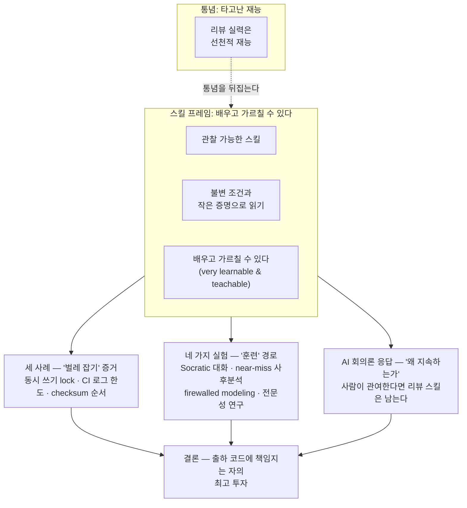

<figure class="post-figure post-figure--header">
  <svg role="img" aria-label="오크 전쟁 지휘관이 훈련장에서 방패 표면에 새겨진 전술 문서(PR diff · 코드 리뷰 노트)를 막대기로 짚어 후배 전사들에게 가르친다. 막대기는 표면의 잘못된 단계에 붉은 X로 표시된 곳을 가리키고, 오른쪽에는 배우는 젊은 전사들이 서 있다. '리뷰는 타고나는 재능이 아니라 훈련하고 길러지는 스킬'이라는 한 컷." viewBox="0 0 680 340" xmlns="http://www.w3.org/2000/svg">
    <title>훈련장의 지휘관 — PR diff 위 잘못된 단계를 막대기로 짚어 후배 전사들에게 리뷰를 가르친다</title>

    <!-- 훈련장 바닥 -->
    <path d="M8 270 Q170 262 340 268 Q520 274 672 268" fill="none" stroke="currentColor" stroke-width="2" opacity="0.5"/>
    <path d="M8 288 H672" stroke="currentColor" stroke-width="1" opacity="0.2"/>

    <!-- ===== 오른쪽: 배우는 후배 전사들 (젊은 전사, 지휘관을 향함) ===== -->
    <!-- 후배 1 -->
    <circle cx="618" cy="204" r="14" fill="var(--bg-light)" stroke="currentColor" stroke-width="2"/>
    <circle cx="623" cy="202" r="1.8" fill="currentColor"/>
    <polygon points="612,216 616,216 614,223" fill="currentColor"/>
    <path d="M602 226 L634 226 L640 268 L596 268 Z" fill="var(--bg-panel)" stroke="currentColor" stroke-width="2"/>
    <!-- 후배 2 -->
    <circle cx="652" cy="210" r="12" fill="var(--bg-light)" stroke="currentColor" stroke-width="2"/>
    <circle cx="656" cy="208" r="1.8" fill="currentColor"/>
    <polygon points="647,220 651,220 649,226" fill="currentColor"/>
    <path d="M638 228 L666 228 L672 268 L632 268 Z" fill="var(--bg-panel)" stroke="currentColor" stroke-width="2"/>

    <!-- ===== 왼쪽: 오크 전쟁 지휘관 (훈련장, 막대기를 듦) ===== -->
    <path d="M162 100 Q170 80 178 100" fill="none" stroke="currentColor" stroke-width="2"/>
    <circle cx="170" cy="96" r="4" fill="var(--secondary-color)"/>
    <circle cx="170" cy="140" r="26" fill="var(--bg-light)" stroke="currentColor" stroke-width="2"/>
    <path d="M156 130 L184 138" stroke="var(--accent-color)" stroke-width="2.4" stroke-linecap="round"/>
    <circle cx="180" cy="138" r="2.4" fill="currentColor"/>
    <polygon points="162,150 166,150 164,158" fill="currentColor"/>
    <polygon points="177,150 181,150 179,158" fill="currentColor"/>
    <path d="M138 172 L202 172 L216 258 L126 258 Z" fill="var(--bg-panel)" stroke="currentColor" stroke-width="2"/>
    <path d="M138 172 Q130 164 142 160" fill="none" stroke="currentColor" stroke-width="2"/>
    <path d="M202 172 Q210 164 198 160" fill="none" stroke="currentColor" stroke-width="2"/>
    <!-- 막대기를 든 팔 -->
    <path d="M196 184 L234 180" fill="none" stroke="currentColor" stroke-width="6" stroke-linecap="round"/>
    <ellipse cx="236" cy="179" rx="6" ry="7" fill="var(--bg-light)" stroke="currentColor" stroke-width="2"/>

    <!-- ===== 중앙-오른쪽: 전술판 (방패 표면의 PR diff / 리뷰 노트) ===== -->
    <line x1="470" y1="250" x2="484" y2="270" stroke="currentColor" stroke-width="2"/>
    <line x1="590" y1="250" x2="576" y2="270" stroke="currentColor" stroke-width="2"/>
    <rect x="398" y="108" width="190" height="146" rx="8" fill="var(--bg-panel)" stroke="var(--gold)" stroke-width="2.4"/>
    <text x="493" y="132" text-anchor="middle" font-size="12.5" fill="var(--gold)" font-weight="700">전술판 · PR diff</text>
    <line x1="410" y1="142" x2="576" y2="142" stroke="var(--border-color)" stroke-width="1.2" opacity="0.7"/>
    <text x="414" y="162" font-size="10" fill="var(--secondary-color)" font-weight="700">① 동시 쓰기 → flock retry</text>
    <text x="414" y="184" font-size="10" fill="currentColor" opacity="0.85">② CI 로그 → --progress-seconds</text>
    <text x="414" y="206" font-size="10" fill="var(--accent-color)" font-weight="700">③ checksum보다 먼저 tarball</text>
    <!-- 잘못된 단계 표시 (붉은 X) -->
    <path d="M565 200 l8 8 M573 200 l-8 8" stroke="var(--accent-color)" stroke-width="2.4" stroke-linecap="round"/>
    <text x="493" y="238" text-anchor="middle" font-size="9.5" fill="currentColor" opacity="0.6">표면 아래 계층을 봐라</text>

    <!-- ===== 막대기 (지휘관 손 → 잘못된 단계의 X) ===== -->
    <line x1="240" y1="178" x2="566" y2="204" stroke="var(--border-strong)" stroke-width="3.5" stroke-linecap="round"/>
    <circle cx="240" cy="178" r="4" fill="var(--steel)"/>
    <text x="228" y="300" font-size="10" fill="currentColor" opacity="0.7" font-weight="700">훈련장 지휘관</text>
  </svg>
  <figcaption>지휘관이 훈련장에서 전술판(PR diff · 리뷰 노트)의 잘못된 단계를 막대기로 짚어 후배 전사들에게 가르친다. 리뷰는 타고난 재능이 아니라 훈련으로 길러지는 스킬이다.</figcaption>
</figure>

## 원문 정보

> - **제목**: Reviewing code is a skill
> - **출처**: typesanitizer.com (개인 블로그) — [typesanitizer.com](https://typesanitizer.com/)
> - **발행**: 2026년 중반 (사이트는 정확한 일자 대신 상대 시각·글 목록만 표기하며, 본문이 2025–2026 담론을 아우름) · 장문(약 8–10분 분량)
> - **원문 링크**: <https://typesanitizer.com/blog/code-review.html>

방금 [antirez의 '코드를 보지 마라'](/2026/08/12/control-the-ideas-not-the-code.html)를 위키에 담았는데, 이 글은 그 논쟁의 정확한 정반대편에 선다 — "코드 리뷰는 타고난 재능이 아니라 가르치고 배울 수 있는 스킬이며, 그 상한은 아직 모른다"는 선언이다. 같은 질문(리뷰에 시간을 쏟을 가치가 있나)에 두 극단의 답을 나란히 두면 스펙트럼 전체가 보인다. Articles/Engineering-Culture에 담는다.

## 한 줄 요약 (TL;DR)

코드 리뷰는 벌레 잡기, 설계 결함, 인식의 확대, 코드 이해 **네 가지 목적** 모두에서 향상될 수 있는 **관찰 가능한 스킬**이다. 리뷰어가 벌레를 잡는 능력은 타고난 재능이 아니라 "불변 조건(invariant)과 작은 증명(little proofs)으로 생각하기" 같은 **배우고 가르칠 수 있는 습관**에서 나온다. 저자는 심리적 안전이 전제될 때 조직이 쓸 실험(Socratic 대화, near-miss 사후분석, firewalled modeling, 전문성 연구)을 제안하고, AI 회의론에 대응하면서 "배에 올린 코드에 책임지겠다면 리뷰 실력 향상에 투자하는 것이 최고의 투자 중 하나"라고 결론짓는다.

## 왜 이 글을 골랐나

이 위키의 AI 코딩 담론은 리뷰의 가치를 놓고 갈린다. [Short Leash](/2026/07/06/short-leash-ai-coding.html)는 "diff를 매번 직접 검토하라"고 하고, 30분 전에 쓴 [antirez 글](/2026/08/12/control-the-ideas-not-the-code.html)은 "라인 단위 리뷰는 대체로 무의미하다"고 한다. 그 가운데서 이 글은 리뷰를 **폐기 대상이나 기본 자세가 아니라, 개발자가 가장 잘 투자할 수 있는 기술**로 재규정한다. 흔한 반자동의 "리뷰는 중요하다"는 문구를 넘어, 리뷰의 **스킬성(learnability)과 훈련법**까지 구체적으로 들어간다. 담론의 균형을 잡는 데도, 실무 지침으로도 값진 글이다.

## 핵심 내용

### 세 개의 '거의-도입된 버그'

저자가 직접 리뷰에서 잡아낸 세 사례가 본문의 무게추다. 모두 "리뷰가 벌레를 실제로 막았다"는 증거다.

- **Git 설정 파일의 동시 쓰기.** `~/.gitconfig`에 백그라운드·포그라운드가 동시에 쓰면서 **비결정성**과 **lock 실패**가 우려됐다. 단순 재시도나 완전 직렬화가 아니라, **retry를 곁들인 별도의 `flock`** 으로 조정해야 했다. 표면적인 코드가 멀쩡해 보여도 **동시성 주문(ordering)** 을 보는 리뷰가 필요했다.
- **CI 업로드 로그 한도.** `aws` CLI의 기본 progress 로그(256KB마다 한 줄)가 다중 버킷 업로드 때 10MB 로그 한도를 넘겼다. 제안한 `--no-progress` 대신 `--progress-seconds`로 고쳤는데, **CI에 설치된 CLI 버전엔 그 플래그가 없어서 버전 업그레이드**까지 따라와야 했다. "수정이 배포 환경의 실제 버전과 맞는가"를 보는 리뷰의 가치다.
- **checksum 순서.** 새 작업이 checksum sidecar 파일보다 **먼저 tarball을 업로드**했다. 그 사이 작업이 죽으면 fail-closed 무결성 검사 때문에 장애가 났다. 결국 읽기 경로 검사는 도입하지 않기로 했다.

세 사례의 공통점은 하나다 — 표면의 코드는 멀쩡해 보이는데, 벌레는 전부 **표면 아래 계층**(동시성 주문 · 배포 환경의 실제 버전 · 부수 효과의 순서)에 숨어 있었다.

<figure class="post-figure">
  <svg role="img" aria-label="전장 단면도 — 위에는 멀쩡해 보이는 코드(표면), 아래 지하층에 세 개의 벌레가 숨어 있다. 각각 동시성 주문(Git 설정 동시 쓰기), 배포 환경의 실제 버전(CI 로그 한도), 부수 효과의 순서(checksum보다 먼저 올라간 tarball). 리뷰가 표면 아래 계층을 들여다보는 장면." viewBox="0 0 660 300" xmlns="http://www.w3.org/2000/svg">
    <title>세 사례의 공통점 — 벌레는 모두 표면 아래 계층에 숨어 있다</title>

    <!-- ===== 표면: 멀쩡해 보이는 코드 ===== -->
    <text x="330" y="22" text-anchor="middle" font-size="12" fill="currentColor" font-weight="700">표면 — 멀쩡해 보이는 코드</text>
    <path d="M14 34 Q180 26 330 32 Q490 38 646 30" fill="none" stroke="currentColor" stroke-width="2" opacity="0.7"/>
    <path d="M20 46 H640" stroke="currentColor" stroke-width="1.2" opacity="0.35"/>
    <!-- 표면 위에 놓인 멀쩡한 블록들 -->
    <rect x="70" y="50" width="150" height="26" rx="6" fill="var(--bg-light)" stroke="var(--secondary-color)" stroke-width="1.6"/>
    <text x="145" y="67" text-anchor="middle" font-size="10.5" fill="var(--secondary-color)" font-weight="700">diff가 멀쩡해 보인다</text>
    <rect x="400" y="50" width="170" height="26" rx="6" fill="var(--bg-light)" stroke="var(--secondary-color)" stroke-width="1.6"/>
    <text x="485" y="67" text-anchor="middle" font-size="10.5" fill="var(--secondary-color)" font-weight="700">표면만 보면 벌레가 안 보인다</text>

    <!-- ===== 표면 아래: 지층 ===== -->
    <path d="M14 92 Q180 86 330 90 Q490 96 646 88" fill="none" stroke="currentColor" stroke-width="2.2" opacity="0.8"/>
    <rect x="14" y="96" width="632" height="3" fill="var(--border-color)" opacity="0.6"/>

    <text x="330" y="120" text-anchor="middle" font-size="11.5" fill="var(--accent-color)" font-weight="700">표면 아래 계층 — 리뷰가 들여다보는 곳</text>

    <!-- 세 벌레 구덩이 -->
    <!-- 벌레 1: 동시성 주문 -->
    <path d="M120 132 L120 210 Q120 218 112 218 H88 Q80 218 80 210 L80 132" fill="none" stroke="currentColor" stroke-width="2" opacity="0.55"/>
    <path d="M88 218 v8 M112 218 v8" stroke="currentColor" stroke-width="1.4" opacity="0.4"/>
    <text x="100" y="150" text-anchor="middle" font-size="12" fill="currentColor" font-weight="700">벌레 ①</text>
    <path d="M86 176 l14 4 M100 180 l-4 -12" stroke="var(--accent-color)" stroke-width="2" stroke-linecap="round"/>
    <text x="100" y="206" text-anchor="middle" font-size="9.5" fill="currentColor" opacity="0.85">동시 쓰기 lock</text>

    <!-- 벌레 2: 배포 환경 실제 버전 -->
    <path d="M330 132 L330 210 Q330 218 322 218 H298 Q290 218 290 210 L290 132" fill="none" stroke="currentColor" stroke-width="2" opacity="0.55"/>
    <path d="M298 218 v8 M322 218 v8" stroke="currentColor" stroke-width="1.4" opacity="0.4"/>
    <text x="310" y="150" text-anchor="middle" font-size="12" fill="currentColor" font-weight="700">벌레 ②</text>
    <path d="M296 176 l14 4 M310 180 l-4 -12" stroke="var(--accent-color)" stroke-width="2" stroke-linecap="round"/>
    <text x="310" y="206" text-anchor="middle" font-size="9.5" fill="currentColor" opacity="0.85">CI 로그 한도</text>

    <!-- 벌레 3: 부수 효과의 순서 -->
    <path d="M540 132 L540 210 Q540 218 532 218 H508 Q500 218 500 210 L500 132" fill="none" stroke="currentColor" stroke-width="2" opacity="0.55"/>
    <path d="M508 218 v8 M532 218 v8" stroke="currentColor" stroke-width="1.4" opacity="0.4"/>
    <text x="520" y="150" text-anchor="middle" font-size="12" fill="currentColor" font-weight="700">벌레 ③</text>
    <path d="M506 176 l14 4 M520 180 l-4 -12" stroke="var(--accent-color)" stroke-width="2" stroke-linecap="round"/>
    <text x="520" y="206" text-anchor="middle" font-size="9.5" fill="currentColor" opacity="0.85">checksum 순서</text>

    <!-- 아래 설명줄 -->
    <path d="M14 272 H646" stroke="currentColor" stroke-width="1" opacity="0.25"/>
    <text x="330" y="266" text-anchor="middle" font-size="10.5" fill="currentColor" opacity="0.75">동시성 주문 · 배포 환경의 실제 버전 · 부수 효과의 순서 — 셋 다 표면 아래에서 벌레가 났다.</text>
  </svg>
  <figcaption>세 사례의 공통점 — 코드 표면은 멀쩡할지라도 벌레는 모두 표면 아래 계층(동시성 주문 · 배포 환경의 실제 버전 · 부수 효과의 순서)에 숨어 있다.</figcaption>
</figure>

### 리뷰가 스킬인 이유

저자의 배경이 핵심 논지를 뒷받침한다. 물리학 박사 과정에서 Jupyter notebook으로 일하던 그는 2018년에야 "사람들이 코드를 전부 리뷰한다"는 사실에 충격을 받고 테스팅·리뷰를 발견했고, 2019년에 그만두고 엔지니어가 됐다. 자기 PR에 **30–100 SLOC당 1개 꼴의 댓글 밀도**를 기록하며, 그 실력을 "타고난 재능이 아니라 스스로 만든 것"이라 말한다.

왜 자기가 벌레를 잡는가를 그는 세 가지에서 찾는다.
- **도입된 버그를 개인적으로 받아들인다** (bug를 '내 것'으로 느낀다).
- **불변 조건과 작은 증명(little proofs)으로 생각한다.**
- 디버깅·성능 문헌을 읽는다.

그중 "작은 증명" 습관은 특히 **"매우 배우고 가르칠 수 있다(very learnable and teachable)"**고 강조한다. 이것이 "리뷰는 재능"이라는 통념을 깨는 축이다.

### 리뷰 실력이 '목적'마다 다른 게 좋다

리뷰는 목적이 여럿이다 — 벌레 잡기, 설계 결함, 인식(awareness) 확대, 코드 이해. **같은 리뷰가 모든 목적을 극대화하지 못한다.** 어떤 리뷰는 설계를 보는 데 집중하고, 어떤 리뷰는 팀 인식을 퍼뜨리기 위한 것이다. 따라서 "리뷰를 잘한다"는 것은 목적에 따라 다른 능력이고, 조직은 목적별로 기대를 가다듬을 수 있다.

### "mad scientist" 모자 — 조직에 권하는 실험

심리적 안전(psychological safety)이 먼저 깔려야 한다는 전제 아래, 저자는 네 가지 실험을 제안한다.

1. **무작위화된 과정중심 Socratic 대화.** 시니어가 주니어에게 "왜 그렇게 했지?"식으로 의도를 묻되, 결과가 아니라 **추리 과정을** 검사한다. "왜 그렇게 안 했어?" 역사적으로 불가능한 반사실(counterfactual) 질문은 피한다.
2. **가벼운 near-miss 사후분석.** PR 작성자가 잡은 버그를 짧은 클립으로 녹화해 팀 레트로에 올린다. 가상의 영향이 얼마였을지를 추측하는 것은 의도적으로 피한다.
3. **Firewalled modeling.** 모델러가 **코드를 보지 않은 채** (Alloy 같은 도구로) 공식 모델을 세우고, 프로그래머와 짝지어 테스트를 만든다. 동시성·프로세스 의미론·접근 통제에 유용하다.
4. **전문성 연구.** 리뷰 이상치(아웃라이어) 리뷰어를 분석·인터뷰해, applied cognitive task analysis로 암묵지를 끄집어낸다.

### AI 회의론에 대한 응답

저자는 조건부를 인정한다 — "**사람이 여전히 소프트웨어 개발에 관여한다면**, 리뷰 스킬은 가치가 있다." 그 반박으로는 ① 낮은 수준 추상화에 대한 편안함이 유리하다, ② 소프트웨어 개발은 젊고 인간 상한선은 미지다, ③ 소셜 미디어의 공언보다 **경험 보고(experience reports)·사례 연구·자기 관찰**로 견해를 세우라는 점을 든다.

연구 근거로는 Google의 2018년 코드 리뷰 연구(교육·규범 유지·게이트키핑·사고 예방의 네 주제)와 ICSE 2013 연구(결함 검출 너머 지식 전이·팀 인식 향상·대안 해결책 창출)를 인용한다.

### 마지막 문단

> "if you're going to be responsible for the code you ship... investing in getting better at reviewing code is one of the best things you can do as a software developer."

출하하는 코드에 책임진다면, **리뷰 실력을 키우는 것이 소프트웨어 개발자가 할 수 있는 최고의 투자 중 하나**라는 것이다. 글은 Yaksha·Yudhishtira 대화를 빌려 "무엇이 가장 칭송할 만한가? — 스킬"로 끝맺는다.

이 글의 논지를 한 장으로 옮기면 이렇다 — "리뷰는 재능"이라는 통념을 "리뷰는 스킬" 프레임으로 뒤집고, 세 갈래의 증거(벌레 잡기 · 훈련 · 왜 계속하나)가 한 결론으로 수렴한다.

## 분석과 인사이트

**1. 이 글은 30분 전에 쓴 [antirez 글](/2026/08/12/control-the-ideas-not-the-code.html)과 완벽한 대극이다 — 그리고 둘 다 놓치는 지점은 없다.** 이것이 가장 큰 가치다. antirez는 "아이디어를 이미 통제하는 사람"과 "라인 리뷰가 무의미한 대량 생성"의 세계에서 "코드를 안 봐도 된다"고 한다. typesanitizer는 "리뷰는 평생 키울 스킬"이라고 한다. 갈라지는 변수는 역시 **스킬 수준**이다 — antirez는 코드를 볼 필요가 없는 사람이고, 이 글의 저자는 리뷰 실력을 키워서 벌레를 잡는 사람이다. 두 글이 서로의 반박이 아니라 서로의 다른 좌표라는 사실이, 그동안 이 위키의 [Short Leash](/2026/07/06/short-leash-ai-coding.html) 분석에서 세웠던 "코드를 봐야 하는가는 스킬의 함수"라는 프레임을 세 번이나 재확인한다.

**2. '잘 리뷰한다'는 단일 능력이 아니라 목적별 능력이다.** 목적(벌레·설계·인식·이해)마다 리뷰가 다르게 최적화된다는 점은 실무상 참신하다. 흔한 팀 리뷰 문화는 "리뷰 = 벌레 잡기" 하나로 뭉치는 경향이 있는데, 이 글이 말하는 대로 **어떤 리뷰는 인식 확산을**, **어떤 리뷰는 설계를** 목표로 한다고 나누면, "이 리뷰가 느리다/빠르다"고 가치를 재는 기준도 달라져야 한다. 이건 리뷰 프로세스를 설계할 때 곧장 쓸 수 있는 렌즈다.

**3. 세 사례가 글을 살린다.** "동시 쓰기 lock", "배포 환경의 CLI 버전에 없는 플래그", "checksum보다 먼저 올라간 tarball" — 셋 다 추상적 주장이 아니라 **실제 코드에서 스킬이 어떻게 작동하는지**를 보여준다. 특히 checksum 순서 사례는 "리뷰가 도입하지 않기로 한 것을 방향 전환시킨" 경우라, 리뷰의 가치가 "결함만 잡는 것"이 아니라 **"무엇을 만들지/만들지 않을지 이끄는 판단"**에 있다는 점을 드러낸다.

**4. 실험 네 가지 중 'firewalled modeling'이 가장 유망하다.** 코드를 보지 않고 모델을 만들어 프로그래머와 짝지어 테스트를 뽑는 방식은, 리뷰를 '코드 대 코드'가 아니라 '**모델 대 코드**'로 재구성한다. 동시성·프로세스 의미론·접근 통제처럼 **상태 공간이 벌레를 키우는** 영역에서 리뷰의 한계(인간 기억이 추적 못 함)를 도구로 보완하는 아이디어다. 다만 조직 도입의 실패율이 높은 이유를 정직하게 짚자면, 이 실험들은 전부 **심리적 안전** 위에만 성립한다 — near-miss 사후분석이 "실수 공개 = 두들겨맞기" 문화에서는 입을 막게 되는 식의 현실적 함정을, 글은 촉발 조건(전제)으로 인정하고 넘어간다.

**5. 유보할 지점.** 첫째, 사례의 외적 타당성은 알 수 없다 — 저자 스스로 "이건 내 경험 보고다"라고 전제하고, AI 응답에서도 "소셜 미디어 공언 대신 경험 보고로 견해를 세워라"고 하며 스스로 같은 함정에 노출돼 있다. 둘째, "작은 증명" 습관이 가르칠 수 있다는 주장은 설득력 있지만, **그 가르침을 조직 차원에서 실제로 작동시키는 실증 데이터**는 이 글에 없다 — 실험은 제안에 그친다. 셋째, AI 회의론 응답의 반박 ③("경험 보고로 견해를 세워라")은 **리뷰 스킬에 대한 대규모 실증이 아직 없다는 사실 자체를** 인정하는 우회로다. AI가 리뷰의 '스킬 상한'을 얼마나 올리거나 넘는지는 미결이다.

**6. 무엇보다 이 글이 옳은 결론 하나.** "출하에 책임지는 자의 리뷰 투자"는, AI가 코드를 쏟아내는 지금일수록 무게가 실린다 — [antirez](/2026/08/12/control-the-ideas-not-the-code.html)가 "아이디어를 통제하라"고 한 바로 그 통제의 한 소재가 결국 **리뷰라는 스킬**이기 때문이다.

## 적용 포인트

- **리뷰를 스킬로 보고 훈련하라.** "나는 못 태어났어"를 버리고, '도입된 버그를 내 일로 받아들이기', 특히 **불변 조건과 작은 증명으로 읽는 습관**을 의식적으로 연습한다.
- **리뷰의 목적을 명시하라.** PR마다 "이 리뷰는 벌레가 목표인가, 설계가 목표인가, 팀 인식이 목표인가"를 정하고, 그 목적에 맞게 깊이와 시간을 배분한다. 목적을 섞으면 어떤 리뷰도 반쪽이 된다.
- **리뷰에서 '표면 아래 계층'을 보라.** 멀쩡히 보이는 코드에서도 **동시성 주문, 배포 환경의 실제 버전·설정, 업로드·검사 같은 부수 효과의 순서**를 따진다 — 세 사례 전부가 이 계층에서 벌레가 났다.
- **만든다고 다가 아니다.** 리뷰의 역할을 "결함 제거"에서 "**무엇을 만들고 만들지 않을지 이끄는 판단**"으로 확장한다 — checksum 사례처럼 리뷰는 방향 전환도 한다.
- **조직 실험이라면 심리적 안전부터.** near-miss 사후분석·Socratic 대화는 실수가 처벌받는 문화에선 작동하지 않는다. 먼저 실수를 정보로 받는 문화를 세우고, 그 위에 가벼운 실험(클립 한 개 레트로 등)부터 시작한다.
- **AI 시대에도 리뷰 스킬은 남는다.** "사람이 여전히 개발에 관여한다면"이라는 전제 안에서, 판단·통제의 핵심 소재로서 리뷰 실력에 투자하는 것이 여전히 최선의 투자다.

## 마무리

'Reviewing code is a skill'은 리뷰를 **선언의 대상이 아니라 훈련의 대상**으로 옮겨 놓는다. 타고난 재능이라는 미신 대신, 세 개의 실사례와 네 개의 실험 제안으로 "가르치고 배울 수 있는 힘"을 구체화한다는 점이 이 글의 가장 큰 공헌이다. 물론 사례의 외적 타당성과 실험의 실증은 미완이고, AI가 리뷰 스킬의 상한을 어디로 옮길지는 여전히 열려 있다. 하지만 "출하에 책임지는 자의 최고 투자"라는 결론은, [antirez의 반대편 글](/2026/08/12/control-the-ideas-not-the-code.html)과 나란히 놓을 때 비로소 온전히 보인다 — 리뷰를 할지 말지가 아니라, **자신의 스킬 좌표에서 리뷰를 어떻게 쓸지**가 진짜 질문이다.

### 더 읽어보기

- [원문 — Reviewing code is a skill (typesanitizer.com)](https://typesanitizer.com/blog/code-review.html) — 이 글이 분석한 원문
- [코드가 아니라 아이디어를 통제하라 (antirez)](/2026/08/12/control-the-ideas-not-the-code.html) — "라인 리뷰는 대체로 무의미"라는 정반대 극단, 스펙트럼의 반대편
- [짧은 목줄(Short Leash) 방법](/2026/07/06/short-leash-ai-coding.html) — "권한 프롬프트 diff를 매번 검토하라"는 AI 코딩 맥락의 리뷰 처방
- [XP Explained: 변화를 끌어안는 애자일](/2026/06/19/extreme-programming-explained.html) — 짝 프로그래밍·페어 사고라는 인적 리뷰의 원류
- [Do Not Roll Your Own](/2026/06/23/do-not-roll-your-own.html) — 표면이 깨질 때의 대가, 리뷰도 같은 표면에서 실력을 발휘한다
