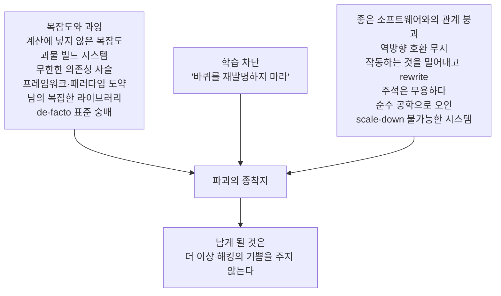

<figure class="post-figure post-figure--header">
<svg role="img" aria-label="오크 전쟁 지휘관이 전장 한복판에서 도끼를 내려놓고 바라본다. 왼쪽에는 단 하나의 단순함 깃발이 휘날리고, 오른쪽에는 기계 장치·꼬인 전선·로켓 발사기 같은 과잉 무기로 어지럽게 '과잉 무장'된 벽이 서 있다. 파괴의 원인은 오로지 복잡도로 포화된 우리 자신이고, 기쁨은 단순함 쪽에 남아 있다." viewBox="0 0 680 340" xmlns="http://www.w3.org/2000/svg">
  <title>전쟁 지휘관이 도끼를 내려놓고, 복잡도로 포화된 과잉 무장 벽(오른쪽)을 응시한다 — 반대편에는 단 하나의 단순함 깃발</title>
  <defs>
    <marker id="dw-head" markerWidth="12" markerHeight="12" refX="8" refY="4" orient="auto">
      <path d="M0 0 L9 4 L0 8 z" fill="var(--accent-color)"/>
    </marker>
  </defs>

  <!-- 전장 지면 -->
  <path d="M0 268 Q170 254 340 260 Q510 266 680 254" fill="none" stroke="currentColor" stroke-width="2" opacity="0.5"/>
  <line x1="0" y1="284" x2="680" y2="284" stroke="currentColor" stroke-width="1" opacity="0.22"/>

  <!-- ===== 왼쪽: 단 하나의 단순함 깃발 ===== -->
  <g>
    <line x1="80" y1="118" x2="80" y2="252" stroke="currentColor" stroke-width="3" stroke-linecap="round"/>
    <path d="M86 126 L152 141 L86 158 Z" fill="var(--accent-color)"/>
    <path d="M86 168 L132 178 L86 188 Z" fill="currentColor" opacity="0.35"/>
    <text x="80" y="278" text-anchor="middle" font-size="11" font-weight="700" fill="currentColor" opacity="0.8">단 하나의 깃발 — 단순함</text>
    <text x="80" y="296" text-anchor="middle" font-size="9" fill="currentColor" opacity="0.6">단순한 것은 어디서나 단순해야</text>
  </g>

  <!-- ===== 가운데: 오크 전쟁 지휘관 (도끼를 내려놓고 벽을 응시) ===== -->
  <g>
    <!-- 상투 -->
    <path d="M288 122 Q296 100 306 122" fill="none" stroke="currentColor" stroke-width="2.5"/>
    <circle cx="298" cy="116" r="4" fill="var(--secondary-color)"/>
    <!-- 머리 -->
    <circle cx="298" cy="150" r="27" fill="var(--bg-light)" stroke="currentColor" stroke-width="2.5"/>
    <!-- 크림슨 전투 문양 -->
    <path d="M276 140 L314 148" stroke="var(--accent-color)" stroke-width="2.6" stroke-linecap="round"/>
    <!-- 눈 (오른쪽 벽을 향함) -->
    <circle cx="309" cy="147" r="2.6" fill="currentColor"/>
    <!-- 엄니 -->
    <polygon points="286,171 291,171 288,180" fill="currentColor"/>
    <polygon points="303,171 308,171 305,180" fill="currentColor"/>
    <!-- 몸통/갑옷 -->
    <path d="M266 186 L330 186 L342 262 L254 262 Z" fill="var(--bg-panel)" stroke="currentColor" stroke-width="2.5"/>
    <path d="M298 186 L298 262" stroke="currentColor" stroke-width="1.4" opacity="0.4"/>
    <!-- 어깨 견장 -->
    <path d="M266 186 Q257 178 269 173" fill="none" stroke="currentColor" stroke-width="2.5"/>
    <path d="M330 186 Q339 178 327 173" fill="none" stroke="currentColor" stroke-width="2.5"/>
    <!-- 내려놓은 도끼 (벽 쪽을 향함) -->
    <line x1="330" y1="254" x2="398" y2="247" stroke="currentColor" stroke-width="3" stroke-linecap="round"/>
    <path d="M398 243 l14 3 l-14 10 z" fill="var(--steel)"/>
    <!-- 시선 화살표: 눈 → 과잉 무장 벽 -->
    <line x1="317" y1="146" x2="408" y2="150" stroke="var(--accent-color)" stroke-width="2.5" stroke-dasharray="4 4" marker-end="url(#dw-head)"/>
    <text x="298" y="306" text-anchor="middle" font-size="10" font-weight="700" fill="currentColor" opacity="0.75">전쟁 지휘관 — 도끼를 내려놓고 응시한다</text>
  </g>

  <!-- ===== 오른쪽: 과잉 무장 벽 (복잡도로 포화) ===== -->
  <g>
    <!-- 벽 실루엣 (기계 장치로 삐죽삐죽) -->
    <path d="M424 258 L430 148 L458 136 L470 164 L496 126 L520 164 L548 118 L570 148 L596 130 L616 166 L636 148 L654 174 L660 216 L656 258 Z" fill="var(--bg-sunken)" stroke="currentColor" stroke-width="2.5"/>
    <!-- 꼬인 전선 -->
    <path d="M440 208 q12 -18 24 0 q12 18 24 0 q12 -18 24 0" fill="none" stroke="currentColor" stroke-width="1.6" opacity="0.7"/>
    <path d="M498 186 q14 -22 20 -6 q6 16 18 -8" fill="none" stroke="currentColor" stroke-width="1.6" opacity="0.7"/>
    <!-- 로켓 발사기 통 -->
    <rect x="470" y="158" width="16" height="46" rx="6" fill="none" stroke="var(--accent-color)" stroke-width="2"/>
    <polygon points="478,156 486,156 487,164 469,164" fill="var(--accent-color)"/>
    <!-- 기어 -->
    <circle cx="530" cy="198" r="12" fill="none" stroke="currentColor" stroke-width="2"/>
    <circle cx="556" cy="228" r="9" fill="none" stroke="currentColor" stroke-width="2"/>
    <circle cx="530" cy="198" r="3.5" fill="currentColor"/>
    <circle cx="556" cy="228" r="3" fill="currentColor"/>
    <!-- 쌓인 받침대 -->
    <line x1="440" y1="236" x2="588" y2="236" stroke="currentColor" stroke-width="2"/>
    <line x1="452" y1="222" x2="576" y2="222" stroke="currentColor" stroke-width="1.4" opacity="0.5"/>
    <!-- 리벳 -->
    <circle cx="446" cy="248" r="2" fill="currentColor"/>
    <circle cx="602" cy="248" r="2" fill="currentColor"/>
    <text x="544" y="286" text-anchor="middle" font-size="11" font-weight="700" fill="currentColor" opacity="0.8">과잉 무장 벽 · 복잡도</text>
    <text x="544" y="302" text-anchor="middle" font-size="9" fill="currentColor" opacity="0.6">파괴의 원인은 오로지 우리 자신</text>
  </g>
</svg>
<figcaption>지휘관은 복잡도로 가득 찬 과잉 무장 벽(오른쪽)을 응시하고, 반대쪽에는 단 하나의 단순함 깃발이 휘날린다. 파괴의 원인은 오로지 복잡도로 포화된 우리 자신이지만, 기쁨은 단순함 쪽에 남아 있다.</figcaption>
</figure>

## 원문 정보

> - **제목**: We are destroying software
> - **출처**: antirez (Salvatore Sanfilippo, Redis 창시자) — [antirez.com](https://antirez.com/)
> - **발행**: 게시 시점 기준 약 549일 전 (antirez.com은 정확한 일자 대신 상대 시각만 표기) · 매우 짧은 분량
> - **원문 링크**: <https://antirez.com/news/145>

사흘 전(2026-08-12) 같은 [antirez의 에세이](/2026/08/12/control-the-ideas-not-the-code.html)를 담았는데, 이 글은 그보다 더 오래되고 더 조악하게 단단한 뼈다귀 같은 선언문이다. AI의 등장이 아니라 **소프트웨어 공학의 복잡도 위기 자체**를 향해 겨누고 있다 — Articles/Engineering-Culture에 담아 그 논지를 뜯어본다.

## 한 줄 요약 (TL;DR)

복잡도를 자각하지 못한 채 기능을 추가하고 성능을 덕지덕지 바르고, 괴물 같은 빌드 시스템과 무한한 의존성 사슬을 만들고, '바퀴를 재발명하지 마라'는 주입식 조언으로 신입의 학습을 막으면서, 우리는 소프트웨어를 조금씩 파괴하고 있다. antirez는 그 파괴의 나열을 14개의 단문으로 읊조리다가, 마지막에 남는 것이 더 이상 **해킹의 기쁨(joy of hacking)**을 주지 않을 것이라는 경고로 끝맺는다.

## 왜 이 글을 골랐나

이 위키는 이미 antirez의 최근 글인 [코드가 아니라 아이디어를 통제하라](/2026/08/12/control-the-ideas-not-the-code.html)를 담았고, [바퀴를 재발명하지 마라](/2026/06/23/do-not-roll-your-own.html)라는 동명 화두를 정면으로 다룬 글도 있다. 이 에세이는 그 두 지점을 **한 사람이 이어 붙인 원류**다. '재발명이 학습의 첫걸음'이라는 문장은 do-not-roll-your-own의 골격이고, 그게 AI 시대에 '아이디어 통제'로 귀결되는 사고의 밑바닥이기도 하다. 짧지만 소프트웨어 장인정신 담론의 미니멀리즘 교과서라서 골랐다.

## 핵심 내용

이 글은 장이나 단락이 없다. **14개의 선언문**이 연속으로 이어질 뿐이다. 모두 같은 문형을 쓴다 — "We are destroying software by [어떤 방식]."

### 복잡도와 과잉

첫 선언이 핵심을 관통한다. 우리는 **복잡도를 계산에 넣지 않은 채** 기능을 추가하거나 어떤 지표를 최적화함으로써 소프트웨어를 파괴한다. 그 뒤에는 구체적인 과잉이 줄줄이 따른다.

- **복잡한 빌드 시스템.** 도구가 도구를 낳고, 쌓인 산더미 위에서 무언가가 돌아간다.
- **터무니없는 의존성 사슬(dependency chain).** 모든 것을 부풀리고(fat) 부서지기 쉽게(fragile) 만든다.
- **장황한 언어·패러다임·프레임워크에의 도약.** 새로운 것마다 덥석 뛰어든다.
- **기존의 복잡한 라이브러리를 쓰는 일 vs 직접 만드는 일**의 어려움을 늘 과소평가한다.
- **de-facto 표준이 우리가 우리 유스케이스에 맞춰 짠 것보다 낫다고** 늘 생각한다.

### 학습과 재발명

> "We are destroying software telling new programmers: 'Don't reinvent the wheel!'. But, reinventing the wheel is how you learn how things work, and is the first step to make new, different wheels."

**'바퀴를 재발명하지 마라'고 주입하는 것**은 파괴다. 바퀴를 다시 만드는 것이야말로 사물이 어떻게 돌아가는지 배우는 길이고, **새롭고 다른 바퀴**를 만들기 위한 첫 단계다. 장인 예법을 배울 길을 막는 조언은 학습의 등불을 끄는 것과 같다.

### 좋은 소프트웨어와의 관계

- **역방향 API 호환을 더 이상 신경 쓰지 않는 것**, 그리고 **작동하는 것을 밀어내고 다시 쓰는 것(rewrite)** — 둘 다 파괴적이다.
- **주석은 무용하다고 주장하는 것**도 파괴다.
- 소프트웨어를 **순수한 공학(engineering) 학문으로 오인하는 것** — 곧 장인정신·취향·인간적 고려를 빼 버리는 것.
- **규모를 줄일 수 없는(scaling down) 시스템을 만들면** 단순한 일이 어떤 시스템에서도 단순해지지 않는다. 단순한 것은 어디서나 단순해야 한다.
- **될 수 있는 한 잘 설계된 코드가 아니라, 될 수 있는 한 빨리 코드를 생산**하려 드는 것.

### 마지막 문장

> "We are destroying software, and what will be left will no longer give us the joy of hacking."

우리가 파괴하는데, **남게 될 것은 더 이상 우리에게 해킹의 기쁨을 주지 않을 것이다.** 선언문 14개가 한 방향으로 모이는 종착지 — 복잡도는 단지 버그의 원인이 아니라, 이 일을 하는 이유마저 앗아간다는 것.

선언문 14개는 세 축으로 모였다가, 마지막에 남는 것은 해킹의 기쁨의 소멸이다.

## 분석과 인사이트

**1. 글의 형식이 곧 메시지다.** 14개의 단문이 장황한 비판서보다 강한 이유는, 이 문형 자체가 '반-복잡도'를 체현하기 때문이다. antirez는 복잡도로 훼손되는 것을 열거하면서 정작 글은 한 치의 부풀림 없이 뼈만 남긴다. 이 에세이를, 대체로 [다른 아티클들이](/2026/07/03/saying-goodbye-to-agile.html) 에세이를 갈래로 나눠 해체하는 것과 다르게, **선언문 14개를 거의 그대로 전달**한 이유가 여기 있다 — 이 글의 내용은 어떤 재가공도 정밀하지 않고, 짧은 채로 두는 것 자체가 옳은 형식이다.

**2. '바퀴 재발명'은 실용과 교육을 낚아챈다.** "재발명하는 것이 새 바퀴를 만드는 첫걸음"이라는 문장은 이 위키의 [Do Not Roll Your Own](/2026/06/23/do-not-roll-your-own.html) 정리와 놓이면 흥미로운 긴장을 이룬다. 그 글은 "됐다면 이미 있는 걸 쓰는 것이 옳다"는 **실용적 결론**을 내쪽에 두고, antirez는 "그래도 만들어 봐야 배운다"는 **교육적 결론**을 내쪽에 둔다. 둘은 모순이 아니다 — 프로덕션에서는 남의 바퀴, 학습실에서는 직접 만든 바퀴. 지적인 긴장을 만드는 지점은, 이 글 제목이 다르지 않다는 것 — "재발명하지 마라"는 조언이 **학습실 바깥으로 나가면** 자작과 실용 사이의 경계가 어디인가를 늘 다시 묻게 만든다는 점이다.

**3. "scale down" 한 단어가 이 글의 진짜 주제다.** 열거된 파괴의 대부분은 사실 같은 병의 증상이다 — **농도는 다르지만 모두 '자기 통제권'의 상실**이다. 빌드 시스템이 괴물이 되는 건 스스로 만들 수 없어서 남의 것을 쌓기 때문이고, 의존성이 부풀고 부서지는 것도 선별 능력의 상실이며, 프레임워크 도약·표준 숭배도 자기 판단을 안 씀로 위임하는 것이다. "단순한 것은 어떤 시스템에서도 단순해야 한다"는 문장은 그 자기 주권의 선언이다 — 복잡도는 내 선택의 결과이며, 내가 통제권을 되찾는 순간 줄어들 수 있다.

<figure class="post-figure">
<svg role="img" aria-label="같은 통제권(지휘관의 손에 쥔 고삐)에서 네 갈래의 파괴 증상이 뻗어 나오다가, 통제권을 되찾는 손이 각 증상을 하나씩 단순함으로 되돌린다. '자기 통제권의 상실'이 파괴를 묶는 하나의 병이라는 그림." viewBox="0 0 640 300" xmlns="http://www.w3.org/2000/svg">
  <title>열거된 파괴들은 모두 같은 병 — 자기 통제권의 상실 — 의 증상이고, 통제권을 되찾으면 복잡도는 줄어들 수 있다</title>
  <defs>
    <marker id="sd-head" markerWidth="10" markerHeight="10" refX="7" refY="3" orient="auto">
      <path d="M0 0 L7 3 L0 6 z" fill="var(--accent-color)"/>
    </marker>
  </defs>

  <!-- 중심: 통제권 (지휘관의 손에 쥔 고삐) -->
  <g>
    <circle cx="80" cy="150" r="38" fill="var(--bg-light)" stroke="var(--gold)" stroke-width="2.4"/>
    <circle cx="80" cy="150" r="22" fill="var(--bg-panel)" stroke="currentColor" stroke-width="1.6" opacity="0.6"/>
    <text x="80" y="146" text-anchor="middle" font-size="11" font-weight="700" fill="currentColor">자기</text>
    <text x="80" y="162" text-anchor="middle" font-size="11" font-weight="700" fill="currentColor">통제권</text>
  </g>

  <!-- 증상 가지: 통제권 상실 → 각 파괴 -->
  <g stroke="currentColor" stroke-width="1.6" opacity="0.55">
    <path d="M118 132 Q168 104 214 92" fill="none"/>
    <path d="M122 150 Q172 150 214 150" fill="none"/>
    <path d="M118 168 Q168 196 214 208" fill="none"/>
    <path d="M120 182 Q164 224 214 236" fill="none"/>
  </g>

  <!-- 증상 라벨 (왼쪽 가지 끝) -->
  <g font-size="10.5" font-weight="700" fill="currentColor">
    <text x="222" y="88" text-anchor="middle">괴물 빌드 시스템</text>
    <text x="222" y="122" text-anchor="middle">무한한 의존성 사슬 · 표준 숭배</text>
    <text x="222" y="146" text-anchor="middle">프레임워크 도약 · rewrite</text>
    <text x="222" y="234" text-anchor="middle">scale-down 부재</text>
  </g>

  <!-- 모두 '한 병'의 증상 -->
  <text x="170" y="272" text-anchor="middle" font-size="10.5" fill="var(--secondary-color)" font-weight="700">같은 병 — '자기 통제권의 상실' — 의 증상</text>

  <!-- 단순함 방향: 왼쪽 아래 반원형 화살표 (되찾으면 줄어든다) -->
  <path d="M118 176 A 120 120 0 0 0 80 268" fill="none" stroke="var(--secondary-color)" stroke-width="2.6" stroke-dasharray="6 5" marker-end="url(#sd-head)"/>
  <text x="30" y="284" text-anchor="middle" font-size="10.5" font-weight="700" fill="var(--secondary-color)">통제권을 되찾는 손 → 복잡도는 줄어든다</text>
</svg>
<figcaption>열거된 파괴의 대부분은 같은 병 — '자기 통제권의 상실' — 의 증상이고, 복잡도는 내 선택이다. 통제권을 되찾는 순간 단순함은 되살아난다.</figcaption>
</figure>

**4. 이 위키의 AI 담론과 연결되는 원류.** 최근 글 [코드가 아니라 아이디어를 통제하라](/2026/08/12/control-the-ideas-not-the-code.html)에서 antirez는 "이미 소프트웨어는 썩어 있었다"며 지난 10년의 slop을 경악 없이 지나쳐 온 걸 반문했다. 이 에세이는 그 질문의 **건강검진 데이터**다. AI 이전에도 우리는 복잡도 선별을 멈췄고, 재발명을 범죄로 만들었고, 공학으로만 오인했다 — 그 상태에 AI 코드가 덧대질 때 부풀림과 취약성이 가속되는 것은 자연스럽다. '코드가 공짜'가 되면 위험한 것은 바로 이 복잡도에 대한 경계 없음이다.

**5. 유보할 지점 — '복잡도가 곧 악'이라는 등식의 지나침.** antirez의 선언은 명료하지만 이분법적이다. 실세계의 대규모 시스템은 순수 장인의 자작 위에 세워질 수 없고, **복잡도는 때로 옳은 대가(tax)다** — 적어도 정당하게 지불하는 그것은. 역방향 호환성 유지는 의존성 보존을 의미하고, 그것도 나름의 미덕이다. 이 글은 '방향'으로는 거의 전적으로 옳지만, '절대량'으로는 지나치게 낙관적이다 — 매몰 비용·팀 규모·유지보수 인력 같은 세속적 제약을 문장 밖으로 밀어둔다.

## 적용 포인트

- **복잡도 선반 위에 얹고 물어라.** 새 기능·새 의존성·새 최적화마다 "이것이 내가 통제하는 단순함의 예산 안에 들어오나?" — antirez의 첫 선언은 지표 최적화조차 그 비용을 세라는 요구다.
- **빌드 시스템과 의존성 사슬을 가끔 들여다보라.** 쌓인 산더미를 하나씩 내려서 직접 만든 작은 파이프가 감당할 수 있는 만큼 줄이는 실험 — 'scale down'의 구체적 습관.
- **신입에게 재발명을 권하라.** 프로덕션 코드가 아닌 **학습실 컴퓨터 위에서** 인터프리터·해시테이블·미니 DB를 직접 짜게 해서 '사물이 어떻게 도는지'를 체험시키고, 그 경험이 새 도구를 고르는 안목으로 이어지게 한다.
- **rewrite 요구에 항상 '왜 지금'을 묻자.** 작동하는 것을 밀어내고 다시 쓰는 충동 앞에서, 교체가 가져올 것과 잃을 것(호환·도메인 지식)을 명시적으로 저울질한다.
- **'주석은 무용하다'는 유행에 동조하지 마라.** 미래의 나와 다른 사람을 위해 **의도(왜)를 적는 주석**은 여전히 1급 산출물이다.
- **기쁨을 지표로 삼아라.** 마지막 문장을 되새기며 — 이 시스템을 만지는 일이 여전히 기쁨을 주는가? 그렇지 않다면 그것은 단지 복잡도에 내주는 몫이다.

## 마무리

'우리는 소프트웨어를 파괴하고 있다'는 논쟁적 에세이가 아니라, **무게를 실은 14개의 경고등**이다. 복잡도에 대한 경계, 학습으로서의 재발명, 자기 통제권의 회복, 그리고 마지막에 남는 해킹의 기쁨 — 이 여섯 단어는 소프트웨어 장인정신의 오래된 회복탄력성을 한 사람의 목소리로 압축한 것이다. 정량적 근거는 없고 이분법적 과장도 있지만, AI가 코드를 무료로 쏟아내는 지금, 이 글의 '복잡도는 내 선택이다'라는 선언은 그 어느 때보다 실행 불가능하지 않다 — 오히려 위험할 만큼 조건이 맞아 있다.

### 더 읽어보기

- [원문 — We are destroying software (antirez)](https://antirez.com/news/145) — 이 글이 분석한 원문
- [코드가 아니라 아이디어를 통제하라 (antirez)](/2026/08/12/control-the-ideas-not-the-code.html) — 같은 저자의 최신 에세이, "이미 소프트웨어는 썩어 있었다"는 진단의 그늘
- [Do Not Roll Your Own — 바퀴 재발명의 실용론](/2026/06/23/do-not-roll-your-own.html) — "재발명하지 마라"의 반대편(실용) 결론과 나란히 읽기
- [The Wrong Abstraction](/2026/06/22/the-wrong-abstraction.html) — 추상화가 복잡도를 숨기는 대가 (duplication vs abstraction?)
- [애자일에게 작별을](/2026/07/03/saying-goodbye-to-agile.html) — 소프트웨어 공학의 '진짜 새것 vs 재발견'을 다루는 같은 카테고리 글
