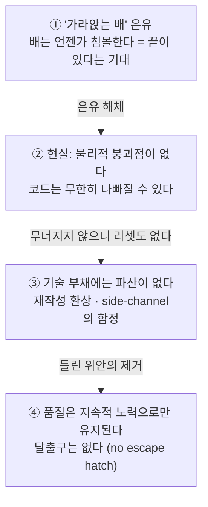

<figure class="post-figure post-figure--header">
<svg role="img" aria-label="기울어진 채 가라앉는 배(레거시 코드베이스) 위에서 선원들이 여전히 일하고 있다. 수면 아래로는 간접 계층 추가, 성능 저하, haunted graveyard 같은 퇴화의 층이 점점 흐려지며 끝없이 이어진다. 바다에는 바닥이 없어 배는 영원히 가라앉기만 할 뿐, 침몰이라는 끝은 오지 않는다." viewBox="0 0 680 360" xmlns="http://www.w3.org/2000/svg">
  <title>'가라앉는 배' 은유의 반전 — 바닥 없는 바다, 끝나지 않는 침하</title>

  <!-- ===== 물: 수면과 물빛 ===== -->
  <rect x="0" y="150" width="680" height="210" fill="var(--secondary-color)" opacity="0.07"/>
  <path d="M0 150 q17 -9 34 0 t34 0 t34 0 t34 0 t34 0 t34 0 t34 0 t34 0 t34 0 t34 0 t34 0 t34 0 t34 0 t34 0 t34 0 t34 0 t34 0 t34 0 t34 0 t34 0" fill="none" stroke="var(--secondary-color)" stroke-width="2.2" opacity="0.9"/>
  <path d="M0 162 q17 -7 34 0 t34 0 t34 0 t34 0 t34 0 t34 0 t34 0 t34 0 t34 0 t34 0 t34 0 t34 0 t34 0 t34 0 t34 0 t34 0 t34 0 t34 0 t34 0 t34 0" fill="none" stroke="var(--secondary-color)" stroke-width="1.4" opacity="0.35"/>
  <text x="20" y="142" font-size="9.5" fill="currentColor" opacity="0.55">수면</text>

  <!-- ===== 배: 기울어진 채 가라앉는 중, 갑판 위 선원은 일하는 중 ===== -->
  <g transform="rotate(14 340 130)">
    <!-- hull -->
    <path d="M250 120 L430 120 L410 152 Q340 166 270 152 Z" fill="var(--bg-light)" stroke="currentColor" stroke-width="2"/>
    <line x1="250" y1="120" x2="430" y2="120" stroke="currentColor" stroke-width="2.4"/>
    <!-- mast + crimson flag -->
    <line x1="352" y1="120" x2="352" y2="48" stroke="currentColor" stroke-width="2.4"/>
    <polygon points="352,48 388,58 352,68" fill="var(--accent-color)"/>
    <!-- crew 1: bailing water (bucket) -->
    <circle cx="298" cy="103" r="5" fill="none" stroke="currentColor" stroke-width="1.6"/>
    <line x1="298" y1="108" x2="298" y2="120" stroke="currentColor" stroke-width="1.6"/>
    <line x1="292" y1="113" x2="308" y2="110" stroke="currentColor" stroke-width="1.6"/>
    <rect x="306" y="105" width="9" height="7" fill="none" stroke="currentColor" stroke-width="1.4"/>
    <circle cx="322" cy="99" r="1.6" fill="var(--secondary-color)" opacity="0.7"/>
    <circle cx="328" cy="93" r="1.4" fill="var(--secondary-color)" opacity="0.5"/>
    <!-- crew 2 -->
    <circle cx="392" cy="103" r="5" fill="none" stroke="currentColor" stroke-width="1.6"/>
    <line x1="392" y1="108" x2="392" y2="120" stroke="currentColor" stroke-width="1.6"/>
    <line x1="386" y1="112" x2="399" y2="114" stroke="currentColor" stroke-width="1.6"/>
  </g>
  <text x="163" y="66" text-anchor="middle" font-size="11" fill="currentColor" font-weight="700" opacity="0.8">레거시 코드베이스</text>
  <path d="M208 72 Q 240 84 262 96" fill="none" stroke="currentColor" stroke-width="1.2" opacity="0.45"/>
  <text x="540" y="66" text-anchor="middle" font-size="10" fill="var(--secondary-color)" font-weight="700">그래도 갑판 위의 일은 계속된다</text>
  <path d="M488 72 Q 452 82 420 92" fill="none" stroke="var(--secondary-color)" stroke-width="1.2" opacity="0.6"/>

  <!-- ===== 수면 아래: 끝없이 이어지는 깊이 (바닥 없음) ===== -->
  <line x1="60" y1="200" x2="620" y2="200" stroke="currentColor" stroke-width="1.2" stroke-dasharray="6 6" opacity="0.35"/>
  <line x1="85" y1="240" x2="595" y2="240" stroke="currentColor" stroke-width="1.2" stroke-dasharray="6 6" opacity="0.24"/>
  <line x1="110" y1="280" x2="570" y2="280" stroke="currentColor" stroke-width="1.2" stroke-dasharray="6 6" opacity="0.14"/>
  <line x1="135" y1="316" x2="545" y2="316" stroke="currentColor" stroke-width="1.2" stroke-dasharray="6 6" opacity="0.07"/>
  <text x="600" y="194" text-anchor="end" font-size="10" fill="currentColor" opacity="0.55">간접 계층 +1</text>
  <text x="576" y="234" text-anchor="end" font-size="10" fill="currentColor" opacity="0.4">성능 저하</text>
  <text x="552" y="274" text-anchor="end" font-size="10" fill="currentColor" opacity="0.26">haunted graveyard</text>
  <path d="M330 190 l10 8 l10 -8" fill="none" stroke="currentColor" stroke-width="2" opacity="0.5"/>
  <path d="M330 230 l10 8 l10 -8" fill="none" stroke="currentColor" stroke-width="2" opacity="0.34"/>
  <path d="M330 270 l10 8 l10 -8" fill="none" stroke="currentColor" stroke-width="2" opacity="0.18"/>
  <text x="340" y="348" text-anchor="middle" font-size="12" fill="var(--accent-color)" font-weight="700">바닥 없음 — 코드에는 '침몰'이라는 끝이 오지 않는다</text>
</svg>
<figcaption>'가라앉는 배' 은유의 반전 — 바다에 바닥이 없어 배는 영원히 가라앉기만 한다. 침하를 늦추는 것은 갑판 위에서 물을 퍼내는 지속적인 노력뿐이다.</figcaption>
</figure>

## 원문 정보

> - **제목**: There's No Limit to How Bad Code Can Get
> - **출처**: Zach Kehs ([zachkehs.com](https://zachkehs.com))
> - **발행**: 2026-09-04 · 짧은 에세이 (약 5분 분량)
> - **원문 링크**: <https://zachkehs.com/blog/theres_no_limit_to_how_bad_code_can_get/>

레거시 코드베이스를 두고 흔히 쓰는 "가라앉는 배" 은유를 정면으로 해체하는 소프트웨어 엔지니어링 에세이라, 코드 품질 담론을 모아 온 `Engineering-Culture`에 담는다.

## 한 줄 요약 (TL;DR)

물리 세계의 배는 결국 침몰해서 끝이 나지만, 소프트웨어에는 그런 자연적 붕괴점이 없다 — 코드는 언제나 지금보다 더 나빠질 수 있고, 기술 부채에는 파산(bankruptcy)이라는 리셋 장치가 없으므로, 품질은 "언젠가 무너지면 고치겠지"가 아니라 지속적인 노력으로만 유지된다.

## 왜 이 글을 골랐나

"이 코드베이스는 가라앉는 배야"라는 말은 개발자들 사이에서 거의 관용구다. 그런데 이 은유에는 은근한 위안이 숨어 있다. *배는 언젠가 가라앉는다* — 즉, 상황이 충분히 나빠지면 시스템이 스스로 무너지면서 강제로 리셋될 것이고, 그때 우리는 새 배를 만들면 된다는 기대다. Kehs는 이 기대가 틀렸다고 말한다. 소프트웨어는 물리 법칙의 제약을 받지 않기 때문에, 무너지지 않은 채로 무한히 나빠질 수 있다.

이 관점은 이 위키에서 다뤄 온 두 갈래의 논의와 정확히 맞물린다. 하나는 [antirez의 "우리는 소프트웨어를 파괴하고 있다"](/2026/08/12/we-are-destroying-software.html)가 고발한 복잡도 포화의 문화이고, 다른 하나는 [Sandi Metz의 "잘못된 추상화"](/2026/06/22/the-wrong-abstraction.html)가 짚은 매몰비용의 함정이다. Kehs의 에세이는 이 둘 사이에 "왜 그런 상태가 영원히 지속될 수 있는가"라는 구조적 설명을 끼워 넣는다.

글의 척추는 네 단계의 인과 사슬이다.

## 핵심 내용

### 가라앉는 배에 올라타다 (Boarding a sinking ship)

글은 저자의 초기 커리어 경험담으로 시작한다. Amazon의 주문 처리 시스템에서 일하던 시절, 저자가 보기에 24명 정도의 엔지니어면 충분했을 일에 조직은 수백 명 규모로 불어나 있었다 — 누적된 복잡도와 기술 부채가 그만큼의 인력을 집어삼키고 있었던 것이다.

개발자들은 이런 코드베이스를 "가라앉는 배"라고 부른다. 그런데 저자는 이 은유가 근본적으로 오해를 낳는다고 지적한다. 은유는 **종착점**을 암시한다. 배는 결국 침몰하고, 침몰은 상황을 강제로 종결시킨다. 이 프레임 안에서는 "충분히 나빠지면 어차피 무너질 테니, 그때 해결되겠지"라는 헛된 희망이 자란다. 하지만 소프트웨어는 물리적 구조물과 달리, 개입을 강제하는 내재적 한계점(breaking point)이 없다.

### 그래서, 어디서 끝나는가? (Where does it end?)

저자는 여기서 중요한 구분을 짚는다. 나쁜 소프트웨어 때문에 **비즈니스**는 망할 수 있다. 그러나 **코드 자체**는 결코 바닥에 닿지 않는다. 가라앉는 것은 회사이지, 소프트웨어가 아니다.

> "The code can *always* get worse. There can *always* be a new layer of indirection or a reduction in performance."

코드는 언제나 더 나빠질 수 있다. 간접 계층(layer of indirection)은 언제나 하나 더 쌓일 수 있고, 성능은 언제나 조금 더 떨어질 수 있다. 저자가 드는 끝없는 퇴화의 예시들:

- **Haunted graveyards(유령 묘지)** — 아무도 제대로 이해하지 못해서, 건드리기를 두려워하는 코드 구역
- 제거되지 않고 계속 추가되기만 하는 **간접 계층들**
- 시스템 전반에 걸쳐 지속적으로 누적되는 **성능 저하**

<figure class="post-figure">
<svg role="img" aria-label="왼쪽: 물리 구조물인 다리는 하중이 임계점에 도달하면 가운데가 부러지며 붕괴해 상황이 강제로 종결된다. 오른쪽: 소프트웨어 시스템은 간접 계층이 아래로 끝없이 쌓이며 점점 흐려지는데도 상단의 RUNNING 표시등은 여전히 켜져 있다 — 붕괴점이 없어 무한한 부패가 가능하다." viewBox="0 0 680 310" xmlns="http://www.w3.org/2000/svg">
  <title>임계점에서 붕괴하는 물리 구조물 vs 무한히 계층이 쌓여도 동작하는 소프트웨어</title>
  <defs>
    <marker id="cd-head" markerWidth="9" markerHeight="9" refX="7" refY="3" orient="auto">
      <path d="M0 0 L7 3 L0 6 z" fill="currentColor"/>
    </marker>
  </defs>

  <!-- ===== LEFT: 물리 구조물 — 임계점에서 붕괴 ===== -->
  <text x="160" y="24" text-anchor="middle" font-size="12" fill="currentColor" font-weight="700">물리 구조물 — 임계점에서 붕괴</text>
  <text x="160" y="44" text-anchor="middle" font-size="10" fill="currentColor" opacity="0.65">하중 (누적 복잡도)</text>
  <line x1="160" y1="52" x2="160" y2="92" stroke="currentColor" stroke-width="2.4" marker-end="url(#cd-head)"/>
  <!-- piers -->
  <rect x="48" y="162" width="24" height="88" fill="var(--bg-light)" stroke="currentColor" stroke-width="1.8"/>
  <rect x="248" y="162" width="24" height="88" fill="var(--bg-light)" stroke="currentColor" stroke-width="1.8"/>
  <!-- broken deck -->
  <line x1="60" y1="162" x2="148" y2="182" stroke="currentColor" stroke-width="5"/>
  <line x1="260" y1="162" x2="172" y2="182" stroke="currentColor" stroke-width="5"/>
  <!-- crack -->
  <polyline points="146,180 154,168 160,190 166,170 174,180" fill="none" stroke="var(--accent-color)" stroke-width="2.2"/>
  <rect x="150" y="204" width="8" height="6" fill="currentColor" opacity="0.45" transform="rotate(18 154 207)"/>
  <rect x="164" y="216" width="7" height="5" fill="currentColor" opacity="0.3" transform="rotate(-14 167 218)"/>
  <text x="160" y="240" text-anchor="middle" font-size="10" fill="var(--accent-color)" font-weight="700">임계점 (breaking point)</text>
  <line x1="30" y1="250" x2="290" y2="250" stroke="currentColor" stroke-width="1.4" opacity="0.5"/>
  <text x="160" y="282" text-anchor="middle" font-size="11" fill="currentColor" font-weight="700" opacity="0.8">붕괴 = 강제 종결, 그리고 새 출발</text>

  <!-- ===== 가운데 구분선 ===== -->
  <line x1="340" y1="40" x2="340" y2="290" stroke="currentColor" stroke-width="1.2" stroke-dasharray="5 7" opacity="0.3"/>
  <rect x="328" y="152" width="24" height="20" fill="var(--bg-panel)"/>
  <text x="340" y="167" text-anchor="middle" font-size="12" fill="currentColor" font-weight="700" opacity="0.6">vs</text>

  <!-- ===== RIGHT: 소프트웨어 — 무한 부패, 그래도 동작 ===== -->
  <text x="515" y="24" text-anchor="middle" font-size="12" fill="currentColor" font-weight="700">소프트웨어 — 무한 부패, 그래도 동작</text>
  <rect x="425" y="40" width="180" height="38" rx="6" fill="var(--bg-light)" stroke="currentColor" stroke-width="2"/>
  <circle cx="449" cy="59" r="7" fill="var(--orc-green)" stroke="currentColor" stroke-width="1.2"/>
  <text x="464" y="64" font-size="13" fill="var(--secondary-color)" font-weight="700">RUNNING</text>
  <!-- layer stack, fading downward -->
  <rect x="435" y="92" width="160" height="26" fill="var(--bg-light)" stroke="currentColor" stroke-width="1.6" opacity="0.85"/>
  <text x="515" y="109" text-anchor="middle" font-size="10" fill="currentColor" opacity="0.85">간접 계층 +1</text>
  <rect x="435" y="124" width="160" height="26" fill="var(--bg-light)" stroke="currentColor" stroke-width="1.6" opacity="0.62"/>
  <text x="515" y="141" text-anchor="middle" font-size="10" fill="currentColor" opacity="0.62">간접 계층 +2</text>
  <rect x="435" y="156" width="160" height="26" fill="var(--bg-light)" stroke="currentColor" stroke-width="1.6" opacity="0.42"/>
  <text x="515" y="173" text-anchor="middle" font-size="10" fill="currentColor" opacity="0.42">간접 계층 +3</text>
  <rect x="435" y="188" width="160" height="26" fill="var(--bg-light)" stroke="currentColor" stroke-width="1.6" opacity="0.26"/>
  <text x="515" y="205" text-anchor="middle" font-size="10" fill="currentColor" opacity="0.26">성능 저하 −1</text>
  <rect x="435" y="220" width="160" height="26" fill="var(--bg-light)" stroke="currentColor" stroke-width="1.6" opacity="0.13"/>
  <text x="515" y="237" text-anchor="middle" font-size="10" fill="currentColor" opacity="0.15">haunted graveyard</text>
  <line x1="415" y1="92" x2="415" y2="240" stroke="currentColor" stroke-width="1.4" stroke-dasharray="4 5" opacity="0.5" marker-end="url(#cd-head)"/>
  <text transform="rotate(-90 404 168)" x="404" y="168" text-anchor="middle" font-size="9.5" fill="currentColor" opacity="0.6">계층은 계속 쌓인다</text>
  <text x="515" y="262" text-anchor="middle" font-size="15" fill="currentColor" opacity="0.4">⋮</text>
  <text x="515" y="284" text-anchor="middle" font-size="11" fill="var(--accent-color)" font-weight="700">붕괴점 없음 → 무한한 부패 (indefinite decay)</text>
</svg>
<figcaption>물리 구조물은 임계점에서 붕괴해 상황을 강제로 끝내지만, 소프트웨어는 계층이 무한히 쌓여도 계속 동작한다 — 파국적 실패 대신 무한한 부패.</figcaption>
</figure>

물리 구조물이라면 진작 붕괴했을 상태에 도달해도 소프트웨어는 계속 동작한다. 그래서 파국적 실패 대신 **무한한 부패(indefinite decay)**가 가능해진다. 저자는 소프트웨어가 기능 개선 없이도 얼마나 복잡해질 수 있는지를 보여주는 아트 프로젝트로 *Enterprise FizzBuzz*를 언급한다.

### 기술 부채에는 파산이 없다 (Technical debt has no bankruptcy)

금융 부채에는 파산이라는 최후의 리셋이 있다. 기술 부채에는 그런 장치가 없다.

> "Technical debt has no bankruptcy, no clean reset."

전면 재작성(full rewrite)은 현실에서 거의 성립하지 않는다. 큰 조직에서 그나마 가능한 차선책은 새로운 유스케이스를 위해 최소 기능만 갖춘 별도의 **side-channel** 시스템을 만드는 것인데 — 이 경우에도 레거시 시스템은 계속 유지·운영해야 한다. (저자는 이를 Strangler Fig 패턴과 대비되는 접근으로 언급한다.)

인센티브 문제도 짚는다. 승진을 동기로 한 재설계(re-architecture) 시도는 실패하기 쉽다 — 엔지니어는 불완전한 정보와 정치적 압력 속에서 일하기 때문이다.

결국 잘못된 멘털 모델이 잘못된 의사결정을 낳는다. "나중에 재작성이라는 탈출구가 있다"고 믿으면 지금의 개선을 미루게 된다. 저자의 결론은 단호하다 — 탈출구는 없다(there is no escape hatch).

> "Software will only stay high quality if we put in the effort to stop the sinking."

## 분석과 인사이트

### "바닥이 있다"는 믿음 자체가 부채를 키운다

이 글의 가장 날카로운 통찰은 기술적 지적이 아니라 **심리적 지적**이다. 팀이 코드 품질 개선을 미루는 논리의 밑바닥에는 종종 "어차피 이대로 가면 못 버티니까, 그때 크게 갈아엎겠지"라는 암묵적 기대가 깔려 있다. Kehs는 그 기대의 전제 — 시스템이 스스로 한계에 도달한다는 것 — 를 부순다. 소프트웨어는 한계에 도달하지 않는다. 도달하는 것은 회사의 인내심, 채용 예산, 시장에서의 속도뿐이다. 즉 코드가 무너지기 전에 비즈니스가 먼저 대가를 치른다. 이건 "품질은 도덕의 문제가 아니라 비용의 문제"라는 [리팩터링의 경제적 이점](/2026/08/03/refactoring-economic-benefit.html) 글의 정량적 논증과 같은 결론에 다른 길로 도착한 셈이다.

### 파산 없는 부채는 은유의 수명이 다했다는 뜻

"기술 부채"라는 은유 자체도 이 글 앞에서는 반쯤 깨진다. Ward Cunningham의 원래 은유에서 부채는 이자를 갚으며 관리하는 것이었지만, 현실의 조직은 부채 은유에서 **파산 가능성**까지 함께 수입해 버렸다 — 최악의 경우 리셋하면 된다는 안도감 말이다. Kehs의 반론은 그 안도감을 제거한다. 갚지 않은 이자는 탕감되지 않고, 원금은 영원히 남는다. 부채라기보다는 차라리 **엔트로피**에 가깝다: 방치하면 늘기만 하고, 줄이는 방향의 일은 언제나 에너지를 요구한다.

### Side-channel의 함정 — 재작성의 가장 흔한 실패 모드

저자가 지적한 side-channel 패턴은 실무에서 정말 자주 보이는 형태다. "레거시는 못 고치겠으니 새 시스템을 옆에 세운다" — 그러나 레거시는 폐기되지 않고, 조직은 이제 시스템 두 개를 유지한다. Strangler Fig 패턴이 성공하는 조건은 *레거시를 점진적으로 교살(strangle)해서 결국 제거하는 것*인데, side-channel은 교살 없이 증식만 한다. 이는 [잘못된 추상화](/2026/06/22/the-wrong-abstraction.html)에서 본 매몰비용 역학의 시스템 버전이다: 이미 존재하는 것을 되돌리는 결정은 언제나 새로 쌓는 결정보다 정치적으로 비싸다.

### 동의하기 어려운 지점 — 붕괴가 아예 없지는 않다

한 가지 유보를 달자면, 소프트웨어에도 준(準)-붕괴점은 존재한다. 보안 사고, 규제 위반, 핵심 인력의 연쇄 이탈로 인한 "아무도 배포 못 하는 상태" 같은 사건은 물리적 침몰에 상당히 가까운 강제 개입 지점이 된다. 다만 이런 사건들조차 코드를 리셋해 주지는 않는다는 점에서, 저자의 핵심 주장 — 리셋은 없다 — 은 여전히 유효하다. 붕괴는 일어날 수 있지만, 붕괴가 청소를 해 주지는 않는다.

## 적용 포인트

- **"어차피 곧 갈아엎을 것"이라는 말이 나오면 경계하라.** 그 말은 개선을 미루는 면죄부로 쓰이는 중일 가능성이 높다. 재작성 계획이 실재한다면 일정·예산·레거시 폐기 조건이 문서로 존재해야 한다.
- **품질 유지 작업을 별도 프로젝트가 아니라 상시 운영 비용으로 취급하라.** 파산이 없다는 것은 일시불 상환이 불가능하다는 뜻이고, 남는 선택지는 정기 상환뿐이다.
- **Side-channel을 만들 때는 레거시 폐기 시한을 함께 결정하라.** 폐기 계획 없는 신규 시스템은 부채를 줄이는 게 아니라 부채의 표면적을 늘린다. Strangler Fig가 되려면 "교살"이 실제로 일어나야 한다.
- **Haunted graveyard를 방치하지 말고 목록화하라.** 아무도 못 건드리는 코드 구역을 팀이 명시적으로 인지하는 것이 상환의 첫 단계다 — 두려움은 문서화되는 순간 작업 항목이 된다.
- **재설계 제안을 평가할 때 제안자의 인센티브를 함께 보라.** 승진 사이클에 맞춘 빅뱅 재설계는 저자가 지적한 실패 패턴 그대로다. 점진적이고 되돌릴 수 있는 개선을 우선하라.

## 마무리

이 에세이의 힘은 새로운 기법이 아니라 **틀린 위안을 제거하는 데** 있다. "배는 언젠가 가라앉는다"는 은유가 주던 묘한 안도감 — 최악에는 끝이 있고, 끝은 새 출발이라는 — 을 걷어내고 나면, 남는 결론은 하나뿐이다. 코드 품질에는 자동 복원 장치가 없으므로, 침몰을 멈추는 유일한 방법은 지금 물을 퍼내는 것이다. 기술 부채를 "언젠가 청산할 것"이 아니라 "영원히 관리할 것"으로 다시 정의하는 것, 그것이 이 짧은 글이 요구하는 멘털 모델의 교체다.

### 더 읽어보기

- [원문 — There's No Limit to How Bad Code Can Get](https://zachkehs.com/blog/theres_no_limit_to_how_bad_code_can_get/)
- [우리는 소프트웨어를 파괴하고 있다 — antirez의 단순함 선언](/2026/08/12/we-are-destroying-software.html) — 복잡도 포화가 어떻게 문화로 굳어지는지에 대한 격렬한 고발
- [잘못된 추상화: 중복보다 더 비싼 죄 (Sandi Metz)](/2026/06/22/the-wrong-abstraction.html) — 잘못 쌓인 것을 되돌리지 못하게 만드는 매몰비용의 역학
- [리팩터링의 경제적 이점: 토큰 비용 83% 절감](/2026/08/03/refactoring-economic-benefit.html) — "품질은 비용 문제"라는 같은 결론의 정량적 버전
- [리팩터링: 코드 설계를 개선하는 기술 (Martin Fowler)](/2026/06/19/refactoring-improving-design.html) — 침몰을 멈추는 실제 도구, 점진적 개선의 교과서
