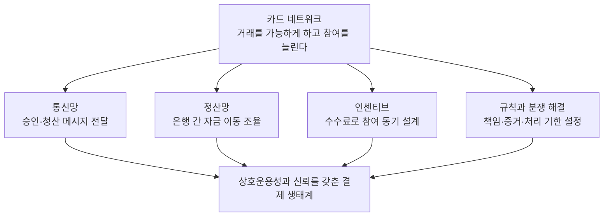

<figure class="post-figure post-figure--header">
<svg role="img" aria-labelledby="card-network-title card-network-desc" viewBox="0 0 600 340" xmlns="http://www.w3.org/2000/svg">
  <title id="card-network-title">카드 네트워크는 두 세계를 연결한다</title>
  <desc id="card-network-desc">카드회원과 발급사, 가맹점과 매입사가 카드 네트워크로 연결된다. 다리를 떠받치는 네 기둥은 통신, 정산, 인센티브, 규칙이다.</desc>
  <g fill="var(--bg-light)" stroke="currentColor" stroke-width="2">
    <path d="M40 90 L120 50 L200 90 Z"/>
    <path d="M400 90 L480 50 L560 90 Z"/>
    <path d="M54 100 H186 V172 H54 Z M414 100 H546 V172 H414 Z"/>
    <path d="M200 145 Q300 55 400 145" fill="none" stroke="var(--secondary-color)" stroke-width="5"/>
    <path d="M190 172 H410" fill="none" stroke-width="5"/>
    <path d="M210 174 V264 M270 174 V264 M330 174 V264 M390 174 V264" stroke="var(--border-color)" stroke-width="12"/>
    <path d="M190 268 H410" stroke-width="5"/>
  </g>
  <g fill="currentColor" text-anchor="middle" font-size="21" font-weight="700">
    <text x="120" y="132">발급사</text>
    <text x="480" y="132">매입사</text>
    <text x="300" y="140">카드 네트워크</text>
  </g>
  <g fill="currentColor" text-anchor="middle" font-size="19">
    <text x="120" y="212">카드회원</text>
    <text x="480" y="212">가맹점</text>
  </g>
  <rect x="92" y="285" width="416" height="42" fill="var(--bg-light)" stroke="var(--border-color)" stroke-width="2"/>
  <text x="300" y="312" text-anchor="middle" font-size="20" fill="var(--secondary-color)" font-weight="700">통신 · 정산 · 인센티브 · 규칙</text>
</svg>
<figcaption>카드 네트워크의 가치는 연결선만이 아니다. 메시지·자금·보상·책임이 함께 움직여야 거래가 성립한다. 결제 처리업체 등 세부 중개 역할은 생략한 개념도다.</figcaption>
</figure>

<strong>원문 정보</strong>: <a href="https://tautology.town/2026/06/01/card-networks.html" target="_blank" rel="noopener">What do Visa and Mastercard do? An intro to card networks</a> by tautology.town 필자 (2026-06-01) 
<strong>TL;DR</strong>: Visa와 Mastercard의 핵심 사업은 카드 발급이 아니라, 발급 측과 가맹점 측이 함께 거래할 수 있는 네트워크를 운영하는 일이다. 승인 메시지를 전달하고, 은행 간 정산을 조율하며, 수수료로 참여를 유도하고, 규칙과 분쟁 절차로 책임을 나눈다. 
개발자에게 중요한 결론은 하나다. <strong>결제 승인, 거래금액 확정, 실제 자금 이동, 분쟁 종결은 서로 다른 사건</strong>이며, 빠른 API만으로 신뢰할 수 있는 결제 시스템이 완성되지는 않는다.

원문과 사이트 소개에서 실명을 확인할 수 없어 저자는 **tautology.town 필자**로 표기한다. 필자는 결제업에서 수년간 일했으며 Visa에 더 익숙하다고 **스스로 소개**한다. 확인된 소속이나 공인된 자격을 뜻하지 않는다. 원문에 읽기 시간은 따로 표시되어 있지 않다.

## 왜 이 아티클을 골랐나

결제 버튼을 누르면 몇 초 안에 성공 메시지가 뜬다. 이 화면만 보면 결제는 카드번호를 보내고 돈을 받는 단일 작업처럼 보인다. 하지만 성공 알림 뒤에는 서로 다른 회사의 판단, 나중에 도착하는 거래 데이터, 은행 간 자금 이동, 수개월 뒤 제기될 수도 있는 분쟁이 있다.

이 글의 장점은 익숙한 브랜드에서 출발해 **기술 인프라와 금융 인프라, 경제적 유인과 운영 규칙을 하나의 시스템으로 설명한다**는 점이다. 카드 네트워크가 무엇을 하는지 이해하면 결제 연동뿐 아니라, 여러 참여자가 서로를 완전히 신뢰하지 않아도 거래할 수 있는 플랫폼의 설계 문제까지 보인다.

다만 원문은 **미국 신용카드 거래와 Visa를 중심으로 한 입문 해설**이다. 한국의 카드사·VAN·PG 구분에 그대로 대입하거나, 모든 국가·카드 상품의 규칙으로 일반화해서는 안 된다. 아래에서는 원문의 네 가지 역할을 따라 요약하되, 오해하기 쉬운 부분은 **보충 설명**으로 표시한다. 이어지는 「분석과 인사이트」는 이 글의 해석과 실무 제안이다.

## 핵심 내용 요약

원문이 꼽는 카드 네트워크의 네 가지 일은 **메시지 전달 → 은행 간 정산 조율 → 인센티브 설계 → 규칙 집행과 분쟁 처리**다. 이는 모든 거래가 순서대로 거치는 네 단계라기보다, 같은 거래를 성립시키는 네 가지 기능이다.

### 먼저 구분할 것: issuer·acquirer·processor·network

카드에 Visa 로고가 있다고 해서 Visa가 카드 이용자에게 돈을 빌려준 것은 아니다. 결제창에 표시된 회사가 모든 금융 책임을 지는 것도 아니다.

| 역할 | 주로 상대하는 쪽 | 핵심 책임 |
|---|---|---|
| **Issuer — 카드 발급기관** | 카드회원 | 카드를 발급하고 계정을 관리한다. 승인 여부를 판단하며, 신용카드라면 신용공여와 이용자의 미상환 위험을 다룬다. |
| **Acquirer — 가맹점 매입기관** | 가맹점 | 가맹점의 카드 수납을 지원하고 가맹점 심사·위험 관리·대금 지급에 관한 금융 관계를 맡는다. |
| **Processor — 결제 처리업체** | 가맹점 또는 발급기관·매입기관 | 결제창·단말 연동, 메시지 처리, API 등 기술적 처리를 제공한다. 가맹점 측 처리업체뿐 아니라 발급 측 처리업체도 있다. |
| **Card network — 카드 네트워크** | 발급기관과 매입기관 등 참여자 | 거래 메시지를 연결하고 정산을 조율하며, 수수료 체계·운영 규칙·분쟁 절차를 정한다. Visa와 Mastercard가 원문의 중심 사례다. |

**보충 설명:** 이것은 회사 목록이 아니라 **역할의 구분**이다. 한 회사가 여러 역할을 겸하거나 은행과 제휴해 일부 역할을 제공할 수 있다. 원문도 현대 결제업체가 가맹점 모집·심사까지 묶어 제공하면서 경계가 흐려졌다고 설명한다. 그렇다고 기술적으로 메시지를 처리하는 책임과, 네트워크에 대해 금융 의무를 지는 책임이 같아지는 것은 아니다. 상표나 API 제공자 이름만으로 계약 구조를 확정하지 말아야 한다.

### 1. 통신망 운영: 승인 메시지는 돈 자체가 아니다

첫 번째 역할은 참여 기관 사이에서 거래 메시지를 전달하는 것이다. 원문은 데이터센터, 통신 회선, 물리적 보안과 재해 대응을 소개하며 카드 네트워크가 실제 통신 인프라이기도 하다는 점을 강조한다.

일반적인 승인 요청은 가맹점의 결제 처리 경로와 매입기관 측을 거쳐 네트워크로 들어가고, 발급기관으로 전달된다. 발급기관은 계정 상태, 한도, 위험 등을 판단해 승인 또는 거절을 응답한다. 원문은 카드번호인 **PAN(Primary Account Number)**과 발급기관을 식별하는 앞부분 **BIN(Bank Identification Number)**을 주소와 라우팅에 비유한다. 이 비유의 요지는 카드번호가 금액을 옮기는 장치가 아니라 **어디에 요청을 전달할지 식별하는 정보**라는 것이다.

여기서 가장 중요한 구분은 다음과 같다.

| 개념 | 판단하는 질문과 완료의 의미 |
|---|---|
| **Authorization — 승인** | **이 거래를 허용할 수 있는가?** 발급기관이 승인·거절을 판단하고, 승인 시 보통 가용 한도나 잔액에 임시 보류가 걸린다. 가맹점 계좌에 돈이 들어왔다는 뜻은 아니다. |
| **Clearing — 청산** | **최종적으로 누구에게 얼마의 지급 의무가 있는가?** 최종 거래 데이터를 교환·처리하고 수수료 등을 반영해 정산에 필요한 의무를 계산한다. 은행 간 자금 이동이 완료됐다는 뜻은 아니다. |
| **Settlement — 자금 정산** | **계산된 의무를 실제 자금으로 이행했는가?** 정산 은행·계좌 등 금융 인프라를 통해 참여자 사이의 자금 의무를 이행한다. 이후 환불이나 분쟁이 불가능해졌다는 뜻은 아니다. |

원문은 식당의 팁을 예로 든다. 처음 승인받은 금액과 나중에 확정해 제출하는 금액이 다를 수 있다는 것이다. 가맹점 관점에서 거래금액을 확정해 청구로 넘기는 요청을 흔히 **capture**라고 부른다.

**보충 설명:** capture와 clearing은 밀접하지만 완전히 같은 경계의 작업은 아니다. 전자는 가맹점이 처리업체에 내리는 청구 확정 요청이고, 후자는 그 이후 기관 사이에서 최종 거래를 처리하는 과정이다. 처리업체 API에서 capture가 성공했다고 해서 clearing과 settlement까지 끝난 것으로 해석해서는 안 된다. 상품·처리 방식에 따라 기능이 결합될 수 있으므로, 위 표 역시 모든 거래가 반드시 별도 메시지 세 개로 처리된다는 뜻은 아니다.

<figure class="post-figure">
<svg role="img" aria-labelledby="card-lifecycle-title card-lifecycle-desc" viewBox="0 0 540 470" xmlns="http://www.w3.org/2000/svg">
  <title id="card-lifecycle-title">승인, 청산, 정산은 서로 다른 사건이다</title>
  <desc id="card-lifecycle-desc">승인은 가용 금액을 확보하는 단계, 청산은 최종 거래 내역과 채무를 계산하는 단계, 정산은 참여 금융기관 사이에서 실제 자금을 이동하는 단계다. 가맹점 입금 시점은 별도 계약에 따른다.</desc>
  <g fill="var(--bg-light)" stroke="var(--border-color)" stroke-width="2">
    <rect x="30" y="20" width="480" height="105"/>
    <rect x="30" y="165" width="480" height="105"/>
    <rect x="30" y="310" width="480" height="105"/>
  </g>
  <g fill="none" stroke="var(--secondary-color)" stroke-width="3">
    <path d="M270 130 V155 M260 145 L270 155 L280 145"/>
    <path d="M270 275 V300 M260 290 L270 300 L280 290"/>
  </g>
  <g fill="var(--secondary-color)" font-size="23" font-weight="700">
    <text x="52" y="58">01 승인 · Authorization</text>
    <text x="52" y="203">02 청산 · Clearing</text>
    <text x="52" y="348">03 정산 · Settlement</text>
  </g>
  <g fill="currentColor" font-size="21">
    <text x="52" y="96">승인 여부 판단 · 가용 금액 확보</text>
    <text x="52" y="241">최종 거래 내역 교환 · 채권·채무 계산</text>
    <text x="52" y="386">참여 금융기관 사이 실제 자금 이동</text>
  </g>
  <text x="270" y="454" text-anchor="middle" font-size="19" fill="currentColor">승인 성공 ≠ 정산 완료 ≠ 가맹점 입금 완료</text>
</svg>
<figcaption>원문이 설명하는 승인·청산 분리 흐름의 개념도. 승인 후 취소·만료될 수도 있어 모든 승인이 정산으로 이어지지는 않는다. 처리 방식에 따라 기능이 결합될 수 있으며, 가맹점 입금 주기는 매입사·처리업체 계약에 따라 다르다.</figcaption>
</figure>

### 2. 금융망 조율: 순액 정산은 효율을 만들지만 위험을 없애지는 않는다

거래 데이터가 전달됐다고 돈이 저절로 이동하지는 않는다. 네트워크는 참여 기관과의 금융 관계를 이용해 받을 돈을 모으고 지급할 돈을 전달하는 **settlement를 조율**한다.

원문이 강조하는 방식은 **net settlement, 순액 정산**이다. 개별 거래마다 총액을 따로 송금하는 대신, 정산 주기의 지급·수취 의무를 모아 상계한 뒤 차액을 이동시킨다. 원문은 이를 하루 단위로 설명하지만, 실제 주기·마감 시각·통화별 일정은 해당 네트워크와 계약을 확인해야 한다. **순액화는 송금해야 할 금액과 횟수를 줄이는 방법이지, 개별 거래 기록을 생략하는 방법이 아니다.**

또한 네트워크 참여 기관 사이의 settlement와 **가맹점 계좌로 대금을 지급하는 payout**은 구분해야 한다. 가맹점 지급 시점에는 매입기관·처리업체의 계약, 지급 주기, 보류금 등이 개입할 수 있다. 네트워크에서 정산됐다는 사실만으로 가맹점 입금 시각이 결정되지는 않는다.

국경을 넘으면 이 조율의 가치가 더 커진다. 원문은 Visa를 서로 다른 국가의 은행 시스템을 연결하는 **어댑터**로 설명한다. 각 참여자가 모든 상대국의 은행 관계와 정산 경로를 직접 구축하지 않아도, 네트워크의 연결망을 활용할 수 있기 때문이다.

하지만 여러 통화와 은행 시스템을 연결하면 돈이 들어오는 시각과 나가는 시각이 어긋날 수 있다.

- **유동성 위험**: 받을 돈이 있어도 지급 시한에 필요한 통화·자금을 확보하지 못할 수 있다.
- **상대방 미지급 위험**: 참여 기관이 자신의 정산 의무를 이행하지 못할 수 있다.

원문은 이 차이를 보여주기 위해 Visa의 **2024 회계연도 공시**를 인용한다. 그 인용에 따르면 2024년 9월 30일 기준, 금융기관 고객의 정산 불이행 시 일일 정산을 지원하기 위해 확보한 가용 유동성은 **112억 달러**였고, 해당 회계연도의 **최대 일일 정산 익스포저는 1,374억 달러**였다. 두 숫자는 각각 유동성 확보액과 미정산 거래에 대한 노출 규모로, 같은 항목이 아니다. 현재 보유액이나 확정 손실액으로 읽어서도 안 된다.

**보충 설명 — 환전과 DCC는 다르다.** 원문이 국제 정산의 환전 기능에 연결한 링크는 실제로는 [Visa의 DCC 안내](https://www.visa.com/en-us/personal/travel/dynamic-currency-conversion)다. **DCC(Dynamic Currency Conversion)**는 해외 가맹점이나 ATM이 거래 시점에 카드회원의 본국 통화로 결제하도록 제안하는 서비스다. 현지 통화 결제 후 네트워크·발급기관 경로에서 이뤄지는 통화 변환이나, 은행 간 정산용 환전과 같은 절차가 아니다. Visa는 DCC 제공 시 양쪽 통화의 금액, 적용 환율, 추가 수수료 등을 제시하고 소비자에게 선택권을 주도록 안내한다. 따라서 해외 결제를 분석할 때는 **거래 통화·청구 통화·정산 통화와 환전 주체**를 나눠 봐야 한다.

### 3. 인센티브 설계: 100달러의 배분이 참여자의 행동을 만든다

원문에서 가장 직관적인 부분은 가맹점 수수료가 누구에게 돌아가는지 풀어보는 대목이다.

**다음은 원문 발행 시점인 2026년 6월의 글에서 미국 신용카드 거래를 설명하기 위해 사용한 단순화된 예시다. 현재의 확정 요율, 시장 전체의 검증된 평균, 한국에 적용되는 수수료표가 아니다.**

| 100달러 구매대금의 귀속 | 금액 | 예시에서의 의미 |
|---|---:|---|
| **Merchant — 가맹점** | **97.50달러** | 총 구매대금에서 가맹점 수수료 2.50달러를 뺀 금액 |
| **Issuer — 발급기관** | **2.00달러** | Interchange fee, 교환수수료 |
| **Processor — 처리업체** | **0.35달러** | 원문이 처리업체 몫으로 단순화한 부분 |
| **Network — 네트워크** | **0.15달러** | Network assessment fee, 네트워크 수수료 |

가맹점이 부담하는 전체 수수료 비율이 **MDR(Merchant Discount Rate)**다. 이 예시의 MDR은 **2.5%**이고, 그 안에서 **2% + 0.35% + 0.15%**가 나뉜다. Interchange는 MDR에 추가되는 별도 2%가 아니라 **그 구성 요소**다. 이 표는 경제적 귀속을 설명하는 것이지, 매 거래마다 네 번의 실시간 송금이 실행된다는 뜻도 아니다.

원문의 놀라운 지점은 **네트워크보다 발급기관의 몫이 크다**는 것이다. 필자는 신용공여와 위험 부담을 그 배경으로 설명한다. 발급기관에 교환수수료 수입이 생기면 더 많은 고객을 확보하고 리워드를 제공할 유인이 생긴다. 카드 사용자가 늘면 가맹점의 카드 수납 가치도 높아지고, 가맹점이 늘면 카드가 더 쓸모 있어지는 **양면시장**의 순환이다.

네트워크가 정하는 interchange 체계와 네트워크 수수료는 카드 종류, 업종, 보안 방식, 거래 데이터 등과 연결된다. 원문은 안전한 결제 방식을 유도하거나 기업의 카드 지출을 늘리는 데 수수료가 쓰인다고 설명한다. 발급 업무를 기술적으로 쉽게 해주는 **issuing processor**의 성장도 발급 측 수익 기회와 연결해 해석한다. 단, 가맹점이 계약하는 최종 MDR 전체를 네트워크가 단독으로 정한다는 뜻은 아니다.

여기에는 두 가지 중요한 단서가 있다.

- **발급기관의 2달러는 순이익이 아니다.** 리워드, 자금 조달, 운영, 신용손실 등 비용을 고려하기 전의 수수료 수입이다. 이 배분표만으로 각 사업의 수익성이나 위험 대비 보상이 적절한지 판단할 수 없다.
- **소비자 보호와 최종 손실 부담은 별개다.** 원문은 분실·도난 거래에 대한 zero-liability 보호를 강조하지만, 이를 모든 사기 손실을 발급기관이 무조건 부담한다는 뜻으로 읽으면 안 된다. 거래 방식, 인증, 규칙 준수, 분쟁 사유와 증거에 따라 발급 측 또는 가맹점·매입 측의 책임이 달라질 수 있다. 소비자에 대한 보호에도 정책상 적용 조건이 있다.

**보충 설명 — EU의 ‘0.3%’는 모든 카드의 전체 수수료가 아니다.** 원문은 EU interchange 상한을 0.3%로 압축한다. 그러나 [EU 규정 2015/751의 제1·3·4조](https://eur-lex.europa.eu/legal-content/EN/TXT/HTML/?uri=CELEX%3A32015R0751)는 적용 대상 소비자 카드에 대해 **debit는 기본 0.2%, credit는 0.3%** 상한을 구분한다. 지급인·수취인 측 결제서비스 제공자의 역내 소재라는 범위가 있고, 상업용 카드 등은 해당 상한 조항의 적용 대상에서 제외된다. 국내 debit 거래에 대한 별도 산정 방식 등 세부 규정도 있다. 이 상한은 **interchange**에 대한 것이며 전체 MDR 상한이 아니다.

원문이 연결한 [영국 PSR의 IFR 설명](https://www.psr.org.uk/our-work/card-payments/the-ifr/)도 소비자 debit·선불카드 0.2%, credit 0.3%를 구분한다. 다만 이 페이지는 현재 **영국에 편입된 UK IFR**를 설명하며, 영국의 가맹점·매입기관·발급기관이라는 적용 조건을 명시한다. 영국과 EU 사이 거래에 양쪽 IFR 상한이 자동 적용된다고 볼 수도 없다. 따라서 원문의 “상한이 낮아 리워드가 약하고 대체 결제가 발달한다”는 설명은 **인센티브에 관한 해석**이지, 유럽 전체의 카드 상품과 결제 문화를 단일 원인으로 입증한 결론은 아니다.

### 4. 규칙과 분쟁 처리: 거래를 허용하는 것만큼 책임을 나누는 일이 중요하다

네트워크는 메시지 형식만 맞추는 곳이 아니다. 원문은 Visa의 공개 규칙을 예로 들며 브랜드 사용, 제출 데이터, 처리 기한, 지원 기능, 준수 의무까지 네트워크가 정한다고 설명한다. 참여자는 규칙 위반에 따른 비용이나 제재를 감수해야 한다. **상호운용성에는 기술 규격뿐 아니라 행동 규칙도 포함된다.**

카드회원과 가맹점의 관계에는 **chargeback, 거래에 대한 이의 제기와 대금 반환 절차**가 있다. 본인이 하지 않은 결제뿐 아니라, 상품 미수령이나 약속과 다른 상품 등도 규칙에 따른 분쟁 사유가 될 수 있다. 가맹점이 자발적으로 처리하는 환불과는 경로가 다르다.

원문이 설명하는 기본 구조는 다음과 같다.

1. 카드회원이 발급기관에 문제를 제기한다.
2. 발급 측과 매입 측이 정해진 사유·기한·형식에 따라 분쟁을 처리하고 증거를 교환한다.
3. 한쪽이 책임을 수용하거나 절차 안에서 해결되면 끝난다.
4. 해결되지 않은 일부 사안은 네트워크의 **arbitration, 중재 판단**으로 올라간다.

즉, Visa가 모든 민원을 처음부터 직접 조사하고 판정하는 것은 아니다. 대부분의 문제는 참여 기관들이 규칙에 따라 처리하며, 네트워크는 해결되지 않은 분쟁의 판단 장치도 제공한다.

원문은 중재 검토 **600달러**, 이의 제기 **1,000달러**, 가맹점의 분쟁 처리 비용 **15~30달러**를 제시하며, 비용 때문에 당사자가 끝까지 다투기보다 환불하거나 손실을 수용할 유인이 있다고 설명한다. **이 역시 원문이 제시한 당시의 설명용 비용 사례**다. 현재 모든 네트워크·지역·계약에 적용되는 확정 가격으로 사용하면 안 된다. 중요한 것은 액수가 아니라 **증거 제출 비용과 패소 부담이 분쟁 해결 행동을 바꾼다**는 구조다.

필자는 이 제도를 공정성보다 효율성에 초점이 맞춰진 장치로 평가한다. 다만 네트워크의 기관 간 분쟁 절차를 소비자의 모든 법적 권리를 대체하는 보편적 강제중재와 동일시해서는 안 된다. 또한 카드의 분쟁 절차가 유용하다는 사실이 다른 결제 수단에는 법률·계약에 따른 보호나 구제 절차가 전혀 없다는 뜻도 아니다.

## 분석과 인사이트

**이 절부터는 원문의 직접 요약이 아니라, 앞의 구조를 소프트웨어·플랫폼 운영에 연결한 해석과 제안이다.**

### 1. 결제 상태는 하나의 `paid` 값으로 표현하기 어렵다

주문 서비스의 “결제 완료”와 재무 담당자의 “입금 완료”는 서로 다른 사건일 수 있다. 이를 같은 필드에 넣으면 고객에게는 성공을 알렸는데 운영자는 돈의 위치를 설명하지 못하는 상황이 생긴다. [DDD의 바운디드 컨텍스트](/2026/06/19/domain-driven-design.html)가 다루는 **같은 단어라도 경계에 따라 의미가 달라지는 문제**가 결제에서 특히 선명하게 드러난다.

실무 모델에서는 최소한 다음 질문을 분리하는 편이 좋다.

| 상태의 관점 | 기록하고 판단할 질문 |
|---|---|
| **승인** | 얼마가 승인됐으며, 취소되거나 만료됐는가? 응답을 아직 모르는가? |
| **청구·clearing** | 얼마를 capture 요청했으며, 외부에서 최종 처리된 금액은 얼마인가? |
| **자금·지급** | 기관 간 정산과 가맹점 지급 중 어디까지 확인됐는가? |
| **환불·분쟁** | 어느 거래에 얼마의 조정이 생겼으며, 대응 기한과 현재 책임 판단은 무엇인가? |

이것들을 반드시 하나의 긴 상태 열거형으로 만들 필요는 없다. 승인·지급·분쟁은 겹쳐 진행될 수 있고 부분 환불처럼 금액의 일부만 바뀌는 사건도 있기 때문이다. **상태와 금액, 사건의 식별자를 함께 모델링하는 것**이 핵심이다.

특히 타임아웃은 거절이 아니다. 요청이 전달되지 않았을 수도 있지만, 외부에서는 승인됐고 응답만 유실됐을 수도 있다. 이는 [DDIA의 부분 실패](/2026/06/19/designing-data-intensive-applications.html)가 결제에서 금전적 사고로 이어지는 지점이다. 결과 불명 상태를 인정하고 외부 거래 식별자, 제공되는 멱등성 기능, 상태 조회와 후속 통지를 통해 확인해야 한다. 단순히 새 거래로 다시 결제하는 것은 복구가 아니라 중복 청구가 될 수 있다.

### 2. 대사는 사후 보고서가 아니라 결제의 완결성 장치다

내부 DB에 성공이 기록됐다는 사실과 외부 세계에서 돈이 맞게 움직였다는 사실은 다르다. API 응답, 처리업체 거래 내역, 정산 보고서, 실제 은행 입금은 각각 다른 관찰이다. **대사(reconciliation)는 이 관찰들을 맞춰 누락·중복·금액 차이를 설명하는 과정**이어야 한다.

가맹점 관점이라면 같은 지급 묶음의 총 거래금액에서 환불·분쟁 조정·수수료·보류금 증감을 반영한 예상 지급액을 만들고, 실제 입금과 연결할 수 있어야 한다. 순액 하나만 맞았다고 끝내면 서로 반대 방향의 두 오류가 가려질 수 있다. 거래 단위 연결과 지급 묶음 단위 확인을 함께 해야 하는 이유다.

국경 간 결제에서는 금액만 비교해서도 안 된다. 통화, 환율 적용 주체, 적용일, 수수료, 정산 기준일을 함께 봐야 한다. 내부 주문번호 하나에 모든 것을 매달기보다 **원거래·승인·capture·조정·지급 내역을 추적할 수 있는 참조 관계**를 남기는 편이 낫다. 차이가 나면 데이터를 억지로 일치시키는 대신, 미해결 차이의 사유·담당자·기한을 드러내야 한다.

### 3. 분쟁 대응에 필요한 것은 많은 로그가 아니라 연결된 증거다

네트워크의 분쟁 절차는 사건이 발생한 뒤 “누가 어떤 근거를 제출할 수 있는가”에 의존한다. 따라서 증거 보존은 고객지원팀의 뒷정리가 아니라 제품 설계의 일부다.

예를 들어 구매 당시의 상품 설명과 약관 버전, 주문·결제 연결 정보, 적절한 인증 결과 참조, 배송·서비스 제공 사실, 취소·환불 요청과 대응 이력이 하나의 거래에 연결되어야 한다. 현재 상품 페이지가 바뀌었거나 고객지원 대화가 흩어져 있으면, 정상적으로 제공한 거래도 설명하기 어려워진다. **사건 당시의 조건을 재구성할 수 있어야 한다.**

그렇다고 카드번호나 민감 인증정보를 무차별적으로 로그에 쌓자는 뜻은 아니다. 필요한 증거만 최소화해 보존하고, 결제 토큰·외부 참조값을 활용하며, 접근 통제와 보존·삭제 기준을 함께 정해야 한다. 증거의 양보다 출처·시각·변경 이력·원거래와의 연결성이 중요하다.

### 4. 플랫폼의 경쟁력과 공정성은 별도의 질문이다

원문의 네 가지 역할은 카드 네트워크의 경쟁력이 단순한 전송 속도에 있지 않음을 보여준다. 참여자가 늘수록 유용해지는 연결망, 은행과의 관계, 유동성 대응, 위험 배분과 분쟁 규칙이 함께 있어야 결제가 성립한다. 새 결제 수단이 더 싼 API를 제공하더라도, 소비자 보호와 가맹점 수납 동기까지 자동으로 따라오는 것은 아니다.

동시에 **참여가 늘고 거래가 빨리 해결된다는 사실만으로 모든 참여자에게 공정한 구조라고 결론 내릴 수는 없다.** 발급 측 리워드는 가맹점 비용과 연결되고, 분쟁의 빠른 종결은 경제적으로 다툴 수 없는 소액 가맹점의 포기일 수도 있다. 반대로 분쟁을 지나치게 어렵게 만들면 소비자가 네트워크를 신뢰하지 않는다.

이를 일반적인 플랫폼 운영에 적용하면 질문이 바뀐다. “누가 수수료를 많이 내는가?”뿐 아니라 **누가 성장을 유도하고, 누가 손실을 부담하며, 누가 규칙을 바꿀 수 있는가?**를 함께 물어야 한다. 규칙을 배포하는 주체와 예외를 심사하는 주체, 이의 제기 경로까지 설계되어야 거버넌스가 완성된다.

## 적용 포인트 (우리는 무엇을 배울 것인가)

- **연동 전에 책임 지도를 만든다**: 계약상 issuer·acquirer·processor·network 역할과 가맹점 대금 지급 주체를 확인한다. API 제공자가 누구인지만으로 금융 책임을 추정하지 않는다.
- **성공의 의미를 단계별로 적는다**: 승인, capture 접수, 외부 거래 처리, 정산, 가맹점 지급을 구분한다. 고객 화면과 운영 화면이 서로 다른 “완료”를 말한다면 용어와 조건부터 명확히 한다.
- **결과 불명과 재처리를 설계한다**: 타임아웃을 실패로 단정하지 않고, 같은 거래의 조회·통지·멱등 처리를 어떻게 연결할지 정한다. 뒤늦은 응답과 중복 이벤트를 새로운 매출로 세지 않게 한다.
- **출시 범위에 대사를 포함한다**: 거래·조정·수수료·지급 내역과 실제 입금을 연결하고, 미확인 차이가 담당자 없이 남지 않게 한다. 다중 통화라면 환율과 기준일도 비교 대상에 넣는다.
- **분쟁에 필요한 증거와 기한을 제품에서 다룬다**: 거래 당시의 조건과 이행 사실을 최소한의 데이터로 추적하고, 분쟁 사유별 제출 기한·접근 권한·보존 정책을 운영에 연결한다.
- **수수료표를 숫자 하나로 비교하지 않는다**: MDR의 구성, 카드·지역·거래 방식, 환전, 분쟁 비용과 지급 조건을 함께 본다. 이 글의 미국 예시나 IFR 상한을 계약의 확정 요율 대신 사용하지 않는다.

이 아티클을 읽고 남겨둘 문장은 **“카드 네트워크는 돈을 보내는 통로인 동시에, 서로 다른 참여자가 돈을 주고받을 조건을 만드는 제도다”**이다. 좋은 결제 시스템을 만드는 일도 같다. 요청을 빨리 처리하는 것에서 끝나지 않고, 나중에 금액과 책임을 설명할 수 있어야 한다.

## 더 읽어보기

- [원문 — What do Visa and Mastercard do? An intro to card networks](https://tautology.town/2026/06/01/card-networks.html) — 이 글이 소개·분석한 아티클. 미국 중심의 예시와 필자의 관점은 원문 발행 시점을 기준으로 읽는다.
- [Domain-Driven Design: 도메인 중심 사고](/2026/06/19/domain-driven-design.html) — 발급·청구·정산·분쟁에서 같은 단어의 의미가 달라지는 문제를 모델 경계로 다루기.
- [Designing Data-Intensive Applications: 분산 데이터 시스템](/2026/06/19/designing-data-intensive-applications.html) — 부분 실패, 트랜잭션 경계, 로그 기반 재처리를 이해하기 위한 기술적 배경.
- [EU Regulation 2015/751](https://eur-lex.europa.eu/legal-content/EN/TXT/HTML/?uri=CELEX%3A32015R0751) — 제1조의 적용 범위·제외 대상, 제3·4조의 소비자 debit·credit interchange 상한.
- [Payment Systems Regulator — The IFR](https://www.psr.org.uk/our-work/card-payments/the-ifr/) — 영국에 적용되는 IFR의 상한과 관할 조건. 전체 MDR이나 모든 국제 거래의 수수료표가 아니다.
- [Visa — Dynamic Currency Conversion](https://www.visa.com/en-us/personal/travel/dynamic-currency-conversion) — DCC의 제공 방식, 환율·추가 비용 고지, 소비자의 선택권. 은행 간 정산용 환전과 구분해 읽는다.
