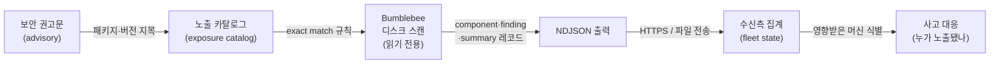
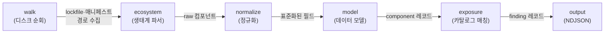

<figure class="post-figure post-figure--header">
<svg role="img" aria-label="오크 정찰병이 손전등으로 막사 창고의 보급품 상자를 비추며, 오염된 상자에는 표식을 남기는 읽기 전용 정찰 장면" viewBox="0 0 640 280" xmlns="http://www.w3.org/2000/svg">
  <!-- ground line -->
  <line x1="0" y1="236" x2="640" y2="236" stroke="currentColor" stroke-width="2" opacity="0.35"/>

  <!-- storehouse / warehouse shelving in the back -->
  <g stroke="currentColor" stroke-width="2" fill="none" opacity="0.4">
    <rect x="404" y="92" width="208" height="144"/>
    <line x1="404" y1="140" x2="612" y2="140"/>
    <line x1="404" y1="188" x2="612" y2="188"/>
    <line x1="508" y1="92" x2="508" y2="236"/>
  </g>

  <!-- supply crates on the shelves (the on-disk packages / inventory) -->
  <g stroke="currentColor" stroke-width="2" fill="var(--bg-panel)" opacity="0.7">
    <rect x="416" y="104" width="32" height="28"/>
    <rect x="456" y="104" width="32" height="28"/>
    <rect x="520" y="104" width="32" height="28"/>
    <rect x="564" y="104" width="32" height="28"/>
    <rect x="416" y="152" width="32" height="28"/>
    <rect x="456" y="152" width="32" height="28"/>
    <rect x="564" y="152" width="32" height="28"/>
    <rect x="416" y="200" width="32" height="28"/>
    <rect x="520" y="200" width="32" height="28"/>
    <rect x="564" y="200" width="32" height="28"/>
  </g>

  <!-- the torch beam: a translucent cone from the scout's lantern across the crates -->
  <polygon points="196,150 612,96 612,236 196,182" fill="var(--gold)" opacity="0.16"/>

  <!-- TAINTED crate(s) caught in the beam: flagged with an accent X mark -->
  <g>
    <rect x="520" y="152" width="32" height="28" fill="var(--accent-color)" opacity="0.22" stroke="var(--accent-color)" stroke-width="2"/>
    <path d="M524 156 L548 176 M548 156 L524 176" stroke="var(--accent-color)" stroke-width="3" stroke-linecap="round"/>
  </g>
  <g>
    <rect x="456" y="200" width="32" height="28" fill="var(--accent-color)" opacity="0.22" stroke="var(--accent-color)" stroke-width="2"/>
    <path d="M460 204 L484 224 M484 204 L460 224" stroke="var(--accent-color)" stroke-width="3" stroke-linecap="round"/>
  </g>
  <!-- flag tag dangling from a tainted crate -->
  <line x1="536" y1="152" x2="536" y2="138" stroke="var(--accent-color)" stroke-width="2"/>
  <polygon points="536,134 558,140 536,146" fill="var(--accent-color)"/>

  <!-- THE ORC SCOUT (reads the disk, marks the tainted — read-only recon, no attack) -->
  <g stroke="currentColor" stroke-width="2.5" stroke-linejoin="round" stroke-linecap="round" fill="none">
    <!-- body / cloak -->
    <path d="M96 236 L108 168 Q120 150 140 152 L156 156 L168 176 L160 236" fill="var(--secondary-color)" opacity="0.85"/>
    <!-- head with tusked jaw + topknot -->
    <circle cx="132" cy="120" r="24" fill="var(--secondary-color)" opacity="0.9"/>
    <path d="M120 132 q12 10 24 0" />
    <path d="M122 134 l-3 8 M142 134 l3 8" stroke-width="3"/>  <!-- tusks -->
    <path d="M132 96 q-4 -22 8 -30 q-2 16 4 24" fill="currentColor" opacity="0.6"/> <!-- topknot -->
    <!-- arm holding the lantern out toward the crates -->
    <path d="M150 178 L196 158" />
  </g>

  <!-- the lantern / flashlight (read-only torch) -->
  <g stroke="currentColor" stroke-width="2.5" fill="var(--gold)" opacity="0.95">
    <rect x="190" y="146" width="20" height="22" rx="3"/>
    <line x1="200" y1="146" x2="200" y2="138" stroke="currentColor" stroke-width="2"/>
  </g>
  <circle cx="200" cy="157" r="5" fill="var(--gold-bright)" stroke="none"/>

  <!-- title scroll text rendered as shapes-free: leave caption to figcaption -->
</svg>
<figcaption>읽기 전용 정찰: Bumblebee는 공격이 아니라 막사 창고(개발자 머신 디스크)를 손전등으로 비춰 이미 들어와 있는 오염된 보급품(노출된 패키지)에 표식만 남긴다.</figcaption>
</figure>

## 원문 정보

> - **프로젝트**: Bumblebee — Supply-Chain Inventory Scanner
> - **소유자/출처**: Perplexity (`perplexityai/bumblebee`, github.com)
> - **설명**: "Read-only developer endpoint scanner for on-disk package, extension, and developer-tool metadata, built to check exposure to known software supply-chain compromises."
> - **언어 / 라이선스**: Go (Go 1.25+) · Apache License 2.0
> - **메타데이터**: ★ 약 4.6k · fork 약 416 · 생성 2026-05-20 · 최근 푸시 2026-06-18 · 최신 릴리스 v0.1.2
> - **토픽**: `golang`, `package-inventory`, `supply-chain-security`
> - **저장소 링크**: <https://github.com/perplexityai/bumblebee>

이 글은 외부 아티클이 아니라 **오픈소스 프로젝트**를 Articles에 담는 경우다. README와 저장소 구조를 기준으로 "이게 무엇을 하는 도구이고, 어떻게 동작하며, 왜 지금 나왔는가"를 정리한다. (수치·인용은 README와 GitHub 메타데이터에서 확인한 것만 사용했고, 명시되지 않은 배경은 추정하지 않았다.)

## 한 줄 요약 (TL;DR)

Bumblebee는 **개발자 노트북의 디스크 상태를 읽어서**(읽기 전용) 설치된 패키지·확장·개발 도구 메타데이터를 인벤토리로 수집하고, 보안 권고문 기반의 **노출 카탈로그(exposure catalog)**와 대조해 "지금 이 머신이 알려진 공급망 침해에 노출돼 있는가"를 답하는 단일 Go 바이너리다. 패키지 매니저를 실행하지 않고 lockfile·매니페스트만 파싱하며, 결과는 NDJSON으로 떨어진다.

### 한눈에 보기

## 왜 이 글을 골랐나

2020년대 중반의 공급망 공격은 더 이상 "빌드 서버"만의 문제가 아니다. npm·PyPI 같은 레지스트리에 악성 버전이 올라오고, 에디터 확장·브라우저 확장, 그리고 최근에는 **MCP(Model Context Protocol) 서버 설정**까지 개발자 로컬에 광범위하게 흩어진다. 사고가 터지면 보안팀이 가장 먼저 던지는 질문은 단순하다 — "그래서 **우리 중 누가** 그 버전을 깔아놨나?"

이 위키는 그동안 보안 쪽에서 [CLI 인증을 제대로 하는 법](/2026/06/20/cli-authentication-the-right-way.html)이나 [LLM이 바꾸는 사회공학의 경제학](/2026/06/20/the-future-of-the-con-is-already-here.html)처럼 '공격면'을 다뤄왔다. Bumblebee는 같은 보안 카테고리에서 **사고가 난 뒤의 대응(response) 도구**라는, 한 칸 다른 자리를 차지한다. 게다가 LLM 회사인 Perplexity가 만든 도구이면서 MCP 인벤토리를 1급 시민으로 취급한다는 점에서, AI 도구 확산이 만들어낸 새 공급망 표면을 정면으로 겨냥한다.

## 핵심 내용

### 무엇을 푸는 도구인가 — SBOM·EDR 사이의 빈 칸

README는 도구의 좌표를 명확히 잡는다. SBOM은 "무엇이 출하됐나(what shipped)"를, EDR은 "무엇이 실행됐고 네트워크를 건드렸나(what ran or touched the network)"를 답한다. 하지만 공급망 대응은 다른 뷰가 필요하다는 것이다 — *"messy local state across lockfiles, package-manager metadata, extension manifests, and supported developer-tool configs."* 즉 **개발자 머신의 어지러운 로컬 상태**를 그 자체로 조사 대상으로 삼는다.

핵심 질문을 README는 이렇게 정의한다: *"when an advisory names a package, extension, or version, which developer machines show a match in their on-disk metadata right now?"*

### 세 가지 스캔 프로파일

운영 맥락에 따라 스캔 범위를 다르게 잡는다.

- **baseline** — 공용/사용자 패키지 루트, 언어 툴체인, 확장 등 흔한 위치를 가볍게. 정기 인벤토리용.
- **project** — `~/code` 같이 설정된 개발 디렉터리를 대상으로. 워크스페이스 정기 인벤토리용.
- **deep** — 홈 디렉터리 등 명시적 경로까지 훑는, 사고 조사용 온디맨드 스캔.

### 지원 생태계

README 기준으로 npm(여러 lockfile 포맷), pnpm, Yarn, Bun, PyPI, Go modules, RubyGems, Composer, Homebrew(formula/cask), 그리고 **에디터·브라우저 확장**과 **MCP 설정**, **agent skills**까지 폭넓게 열거된다. 이 마지막 묶음 — 확장과 MCP·에이전트 스킬 — 이 전통적 SBOM 도구와 차별되는 지점이다.

### 동작 모델과 출력

- **읽기 전용 + 의존성 0**: 패키지 매니저를 실행하지 않고 lockfile·매니페스트·메타데이터만 파싱한다. Go 표준 라이브러리 외 외부 의존성이 없는 **단일 정적 바이너리**다.
- **원샷 스캐너**: 한 번 실행하면 한 번 스캔하고 종료한다. 주기 관리(cadence)는 cron·systemd 같은 외부 러너에 위임한다.
- **NDJSON 레코드**: 컴포넌트 레코드에는 패키지 메타데이터와 confidence 등급(high/medium/low)이, finding 레코드에는 노출 카탈로그 매칭이 담긴다. 각 실행은 상태 추적용 summary 레코드로 마무리된다.
- **함대(fleet) 집계**: 각 레코드는 `profile`과 루트별 `root_kind`를 들고 있어, 수신측이 머신 집단(population)을 분리해 관리할 수 있다. 전송은 `docs/transport.md`(HTTPS/파일 출력), 수신측 현재상태 모델은 `docs/state-model.md`에 문서화돼 있다.

### 노출 카탈로그(exposure catalog)

카탈로그는 ecosystem/name/version을 **정확히(exact) 매칭**하는 최소 JSON 포맷이다. 저장소의 `threat_intel/` 디렉터리에는 공개 위협 인텔리전스 리포팅을 토대로 유지되는 카탈로그가 들어 있다. 운영자는 새 권고문이 나오면 카탈로그를 갱신하고 다시 돌리는 흐름을 그릴 수 있다.

### 보안상 주의 — MCP env 값 처리

README가 명시적으로 짚는 부분: MCP 호스트 설정의 `env` 블록은 환경 값·자격증명을 담을 수 있는데, Bumblebee는 서버 인벤토리에 필요한 만큼만 이 설정을 파싱하고 *"does not emit those values in its records"* — 즉 민감 값은 레코드에 내보내지 않는다. 인벤토리 도구가 스스로 데이터 유출원이 되지 않게 한 설계다.

### 저장소 구조

- `cmd/bumblebee/` — CLI 엔트리포인트 (`go install .../cmd/bumblebee@latest`)
- `internal/` — `ecosystem`, `endpoint`, `exposure`, `model`, `normalize`, `osv`, `output`, `scanner`, `walk` 로 책임이 갈린다. (생태계 파서 / 엔드포인트 / 노출 매칭 / 데이터 모델 / 정규화 / OSV / 출력 / 스캐너 / 파일 워크)
- `threat_intel/` — 유지되는 노출 카탈로그
- `docs/` — `deployment-macos.md`, `inventory-sources.md`(가장 큰 문서), `state-model.md`, `transport.md`, `schema/`
- `tools/`, `.goreleaser.yaml`, `SECURITY.md`, `CONTRIBUTING.md`

## 분석과 인사이트

여기부터는 README 요약이 아니라 내 관점이다.

**1) "스캐너가 아니라 인벤토리"라는 포지셔닝이 영리하다.** 보통 보안 도구는 '탐지(detection)'를 내세우지만, Bumblebee는 탐지보다 **인벤토리 + 매칭**에 무게를 둔다. 탐지는 카탈로그(위협 인텔)에 위임하고, 도구는 "디스크에 무엇이 있나"라는 변하지 않는 사실 수집에 집중한다. 덕분에 새 공급망 사고가 터질 때마다 도구를 고칠 필요 없이 **카탈로그만 갱신**하면 된다. 관심사 분리(separation of concerns)가 운영 민첩성으로 직결되는 좋은 사례다.

**2) "패키지 매니저를 실행하지 않는다"는 제약이 곧 강점이다.** `npm ls`나 `pip list`를 부르는 순간 스캐너는 네트워크·실행 부작용·악성 postinstall 트리거의 위험을 떠안는다. lockfile과 매니페스트만 읽는 읽기 전용 설계는 사고 대응 도구가 갖춰야 할 **"피해를 키우지 않는다"**는 원칙에 충실하다. 의존성 0의 단일 정적 바이너리라는 점도 같은 맥락 — 침해 의심 머신에 추가 공급망 표면을 들이지 않는다.

**3) MCP·agent skills를 인벤토리에 넣은 것이 시그널이다.** 이건 단순 기능 추가가 아니라 **위협 모델의 갱신**이다. 에이전트형 AI 도구가 개발 워크플로에 박히면서, "내 머신에 어떤 MCP 서버가 설정돼 있나"가 lockfile만큼이나 중요한 공급망 질문이 됐다. LLM 회사가 만든 도구가 이 표면을 1급으로 다룬다는 점은, 앞으로의 공급망 보안이 패키지 레지스트리를 넘어 **AI 도구 설정**까지 포함해야 함을 보여준다. ([에이전트 시스템을 만드는 쪽](/2026/06/19/reliable-agentic-ai-systems.html)과 그것을 점검하는 쪽이 같은 MCP 표면을 공유한다.)

**4) 약한 고리는 '카탈로그의 신선도'와 'exact match'다.** 도구가 정확 매칭에 의존하므로, 노출 판단의 품질은 결국 카탈로그가 얼마나 빨리·정확히 갱신되느냐에 달려 있다. 버전 범위·전이 의존성(transitive)·리네이밍된 악성 패키지처럼 exact match를 비껴가는 케이스는 운영자의 카탈로그 관리 역량에 책임이 넘어간다. 도구가 "탐지 로직을 안 갖는" 설계의 대가다.

**5) 원샷 + 외부 스케줄러는 옳은 선택이다.** 데몬으로 상주하지 않고 cron/systemd에 주기를 맡기는 건, 도구를 단순하게 유지하고 함대 운영을 기존 인프라(설정 관리, MDM)에 얹게 한다. 출력을 NDJSON 스트림으로 표준화하고 수신측 상태 모델을 따로 문서화한 점도, "수집은 단순하게, 집계는 수신측에서"라는 유닉스적 분업이다.

## 적용 포인트

- **사고 대응 플레이북에 '엔드포인트 노출 매칭' 단계를 넣어라.** 권고문이 떴을 때 "빌드/CI에 그 버전이 있나"뿐 아니라 "**개발자 노트북에** 남아 있나"를 묻는 절차를 별도로 둔다. Bumblebee는 그 자리에 바로 들어간다.
- **노출 카탈로그를 위협 인텔 운영의 산출물로 관리하라.** 새 공급망 권고문 → 카탈로그 JSON 갱신 → 재스캔, 을 반복 가능한 루틴으로 만든다. `threat_intel/`을 출발점으로 사내 카탈로그를 버전 관리한다.
- **AI 도구 설정(MCP/에이전트 스킬)을 인벤토리 대상에 포함하라.** lockfile만 보던 자산 관리 범위를 에디터·브라우저 확장과 MCP 설정까지 넓힌다 — 새 공급망 표면이다.
- **읽기 전용·무의존성 원칙을 자작 보안 도구에도 적용하라.** 침해 의심 머신을 조사할 때 패키지 매니저 실행이나 외부 의존성 설치는 피한다. Bumblebee의 설계가 좋은 본보기다.
- **먼저 `bumblebee selftest`로 검증하고 baseline부터.** 도입 시 임베디드 픽스처 기반 셀프테스트로 동작을 확인한 뒤, baseline 프로파일로 함대 전반의 가벼운 정기 인벤토리를 깔고, 사고 시 deep로 전환하는 단계적 운영을 권한다.

## 마무리

Bumblebee는 화려한 탐지 엔진이 아니라, **사고가 났을 때 가장 답하기 어려운 단순한 질문 — "지금 누가 노출돼 있나" — 을 빠르게 답하기 위한 정직한 인벤토리 도구**다. 탐지를 카탈로그에 위임하고 도구 자신은 읽기 전용·무의존성·원샷으로 단순함을 지킨 설계, 그리고 MCP·에이전트 스킬까지 공급망 표면으로 끌어들인 시야가 인상적이다. AI 도구가 개발 환경에 깊숙이 들어온 시대에, 공급망 보안의 '대응' 쪽이 어떻게 진화하고 있는지를 보여주는 깔끔한 레퍼런스다.

### 더 읽어보기

- [Bumblebee — perplexityai/bumblebee (GitHub)](https://github.com/perplexityai/bumblebee) — 원 저장소, README와 `docs/`
- [CLI 인증, 제대로 하는 법](/2026/06/20/cli-authentication-the-right-way.html) — 같은 Security 카테고리, 개발자 도구의 보안 기본값을 다룬 글
- [사기의 미래는 이미 와 있다](/2026/06/20/the-future-of-the-con-is-already-here.html) — LLM이 바꾸는 공격면(공격) ↔ Bumblebee의 대응(방어)이라는 대조
- [신뢰할 수 있는 에이전트형 AI 시스템 만들기](/2026/06/19/reliable-agentic-ai-systems.html) — MCP·에이전트를 '만드는' 쪽의 관점, Bumblebee가 점검하는 표면과 맞닿아 있다
