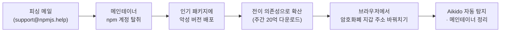
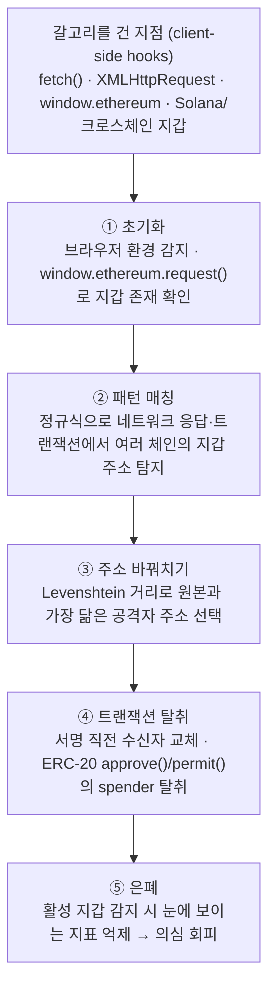

<figure class="post-figure post-figure--header">
<svg role="img" aria-label="오르그리마르 보급 창고 장면. 왼쪽에는 위조 인장이 찍힌 피싱 메일이 못으로 박혀 있고, 가운데에는 18개의 보급 상자(npm 패키지)가 쌓여 있는데 그중 세 개가 독에 물들어 붉게 변한 채 해골 표식을 달고 있다. 그 오염된 상자에서 뻗어 나온 붉은 촉수가 오른쪽의 금화 자루로 이어져 지갑 주소를 몰래 바꿔치기한다. 주간 20억 다운로드의 보급선을 단 한 방울의 독이 오염시키는 구도." viewBox="0 0 720 290" xmlns="http://www.w3.org/2000/svg">
  <title>한 통의 피싱 메일이 20억 다운로드의 보급선을 오염시키는 공급망 침해</title>
  <defs>
    <marker id="npmTendril" viewBox="0 0 10 10" refX="8" refY="5" markerWidth="6.5" markerHeight="6.5" orient="auto-start-reverse">
      <path d="M0,0 L10,5 L0,10 z" fill="var(--accent-color)"/>
    </marker>
    <marker id="npmFlow" viewBox="0 0 10 10" refX="8" refY="5" markerWidth="7" markerHeight="7" orient="auto-start-reverse">
      <path d="M0,0 L10,5 L0,10 z" fill="currentColor"/>
    </marker>
  </defs>

  <text x="360" y="30" text-anchor="middle" font-family="var(--font-body)" font-size="16" font-weight="800" fill="currentColor">한 방울의 독, 주간 20억+ 다운로드의 보급선</text>

  <!-- ============ Zone A: forged phishing mail, nailed to the door ============ -->
  <circle cx="115" cy="72" r="4" fill="currentColor"/>
  <line x1="115" y1="76" x2="115" y2="92" stroke="currentColor" stroke-width="1.5" opacity="0.5"/>
  <rect x="58" y="92" width="114" height="84" rx="4" fill="currentColor" opacity="0.06"/>
  <rect x="58" y="92" width="114" height="84" rx="4" fill="none" stroke="currentColor" stroke-width="2"/>
  <path d="M58 96 L115 138 L172 96" fill="none" stroke="currentColor" stroke-width="2"/>
  <line x1="74" y1="152" x2="128" y2="152" stroke="currentColor" stroke-width="2" opacity="0.45"/>
  <line x1="74" y1="162" x2="110" y2="162" stroke="currentColor" stroke-width="2" opacity="0.45"/>
  <!-- forged (cracked) wax seal -->
  <circle cx="150" cy="160" r="13" fill="var(--accent-color)" opacity="0.85"/>
  <path d="M150 149 L146 160 L153 162 L149 171" fill="none" stroke="var(--bg-panel)" stroke-width="1.6"/>
  <text x="115" y="246" text-anchor="middle" font-family="var(--font-body)" font-size="12.5" font-weight="700" fill="currentColor">위조 명령서 · 피싱 메일</text>

  <!-- flow arrow: mail -> warehouse -->
  <line x1="178" y1="122" x2="205" y2="122" stroke="currentColor" stroke-width="2" opacity="0.55" marker-end="url(#npmFlow)"/>

  <!-- ============ Zone B: warehouse crate wall (18 npm packages) ============ -->
  <g fill="currentColor" fill-opacity="0.07" stroke="currentColor" stroke-width="1.8">
    <rect x="210" y="80" width="38" height="38" rx="3"/>
    <rect x="254" y="80" width="38" height="38" rx="3"/>
    <rect x="298" y="80" width="38" height="38" rx="3"/>
    <rect x="386" y="80" width="38" height="38" rx="3"/>
    <rect x="430" y="80" width="38" height="38" rx="3"/>
    <rect x="254" y="124" width="38" height="38" rx="3"/>
    <rect x="298" y="124" width="38" height="38" rx="3"/>
    <rect x="342" y="124" width="38" height="38" rx="3"/>
    <rect x="386" y="124" width="38" height="38" rx="3"/>
    <rect x="210" y="168" width="38" height="38" rx="3"/>
    <rect x="254" y="168" width="38" height="38" rx="3"/>
    <rect x="298" y="168" width="38" height="38" rx="3"/>
    <rect x="342" y="168" width="38" height="38" rx="3"/>
    <rect x="386" y="168" width="38" height="38" rx="3"/>
    <rect x="430" y="168" width="38" height="38" rx="3"/>
  </g>
  <!-- crate lid seams (normal) -->
  <g stroke="currentColor" stroke-width="1.3" opacity="0.3">
    <line x1="210" y1="92" x2="248" y2="92"/>
    <line x1="254" y1="92" x2="292" y2="92"/>
    <line x1="298" y1="92" x2="336" y2="92"/>
    <line x1="386" y1="92" x2="424" y2="92"/>
    <line x1="430" y1="92" x2="468" y2="92"/>
    <line x1="254" y1="136" x2="292" y2="136"/>
    <line x1="298" y1="136" x2="336" y2="136"/>
    <line x1="342" y1="136" x2="380" y2="136"/>
    <line x1="386" y1="136" x2="424" y2="136"/>
    <line x1="210" y1="180" x2="248" y2="180"/>
    <line x1="254" y1="180" x2="292" y2="180"/>
    <line x1="298" y1="180" x2="336" y2="180"/>
    <line x1="342" y1="180" x2="380" y2="180"/>
    <line x1="386" y1="180" x2="424" y2="180"/>
    <line x1="430" y1="180" x2="468" y2="180"/>
  </g>
  <!-- poisoned crates (3): crimson fill + skull rune -->
  <g>
    <rect x="342" y="80" width="38" height="38" rx="3" fill="var(--accent-color)" fill-opacity="0.16" stroke="var(--accent-color)" stroke-width="2"/>
    <line x1="342" y1="92" x2="380" y2="92" stroke="var(--accent-color)" stroke-width="1.3" opacity="0.55"/>
    <circle cx="361" cy="99" r="7.5" fill="var(--accent-color)"/>
    <circle cx="358" cy="98" r="1.9" fill="var(--bg-panel)"/>
    <circle cx="364" cy="98" r="1.9" fill="var(--bg-panel)"/>
    <rect x="360" y="101.5" width="2" height="4" rx="1" fill="var(--bg-panel)"/>
  </g>
  <g>
    <rect x="210" y="124" width="38" height="38" rx="3" fill="var(--accent-color)" fill-opacity="0.16" stroke="var(--accent-color)" stroke-width="2"/>
    <line x1="210" y1="136" x2="248" y2="136" stroke="var(--accent-color)" stroke-width="1.3" opacity="0.55"/>
    <circle cx="229" cy="143" r="7.5" fill="var(--accent-color)"/>
    <circle cx="226" cy="142" r="1.9" fill="var(--bg-panel)"/>
    <circle cx="232" cy="142" r="1.9" fill="var(--bg-panel)"/>
    <rect x="228" y="145.5" width="2" height="4" rx="1" fill="var(--bg-panel)"/>
  </g>
  <g>
    <rect x="430" y="124" width="38" height="38" rx="3" fill="var(--accent-color)" fill-opacity="0.16" stroke="var(--accent-color)" stroke-width="2"/>
    <line x1="430" y1="136" x2="468" y2="136" stroke="var(--accent-color)" stroke-width="1.3" opacity="0.55"/>
    <circle cx="449" cy="143" r="7.5" fill="var(--accent-color)"/>
    <circle cx="446" cy="142" r="1.9" fill="var(--bg-panel)"/>
    <circle cx="452" cy="142" r="1.9" fill="var(--bg-panel)"/>
    <rect x="448" y="145.5" width="2" height="4" rx="1" fill="var(--bg-panel)"/>
  </g>
  <text x="339" y="246" text-anchor="middle" font-family="var(--font-body)" font-size="12.5" font-weight="700" fill="currentColor">npm 보급 창고 · 18개 패키지</text>

  <!-- ============ Zone C: black tendril swapping the coin pouch ============ -->
  <path d="M468 141 C 506 116, 524 176, 578 150" fill="none" stroke="var(--accent-color)" stroke-width="3" opacity="0.85" marker-end="url(#npmTendril)"/>
  <path d="M468 150 C 502 168, 528 128, 578 158" fill="none" stroke="var(--accent-color)" stroke-width="2" opacity="0.45"/>
  <!-- coin pouch (crypto wallet) -->
  <path d="M588 152 Q612 140 636 152 L644 196 Q612 214 580 196 Z" fill="var(--gold)" fill-opacity="0.85" stroke="currentColor" stroke-width="2"/>
  <path d="M596 152 Q612 160 628 152" fill="none" stroke="currentColor" stroke-width="2"/>
  <circle cx="612" cy="184" r="9" fill="none" stroke="currentColor" stroke-width="2"/>
  <line x1="612" y1="178" x2="612" y2="190" stroke="currentColor" stroke-width="2"/>
  <!-- swap arrows over the neck (address swapped) -->
  <g fill="none" stroke="var(--accent-color)" stroke-width="2.2" opacity="0.9">
    <path d="M596 137 q16 -11 32 0" marker-end="url(#npmTendril)"/>
    <path d="M628 147 q-16 11 -32 0" marker-end="url(#npmTendril)"/>
  </g>
  <text x="612" y="246" text-anchor="middle" font-family="var(--font-body)" font-size="12.5" font-weight="700" fill="currentColor">지갑 주소 바꿔치기</text>
</svg>
<figcaption>겉보기엔 멀쩡한 보급 상자 무더기(npm 패키지) 속 몇 개에 발린 독 — 한 통의 피싱 메일이 20억 다운로드의 보급선을 오염시켜, 브라우저에서 암호화폐 지갑 주소를 몰래 공격자 것으로 바꿔치기한다.</figcaption>
</figure>

## 원문 정보

> - **제목**: npm debug and chalk packages compromised
> - **출처**: Aikido Security · Charlie Eriksen (aikido.dev)
> - **발행**: 2025-09-08 (최종 갱신 2026-03-17)
> - **원문 링크**: <https://www.aikido.dev/blog/npm-debug-and-chalk-packages-compromised>

이 글을 Articles의 `Security`에 담는 이유: 이건 특정 도구 소개가 아니라 **실제로 터진 공급망 사고의 해부(incident writeup)**다. JavaScript 생태계에서 가장 많이 쓰이는 유틸리티들이 한꺼번에 감염된 사건이라, "내 프로젝트가 안전한가"라는 질문을 모든 개발자에게 던진다.

## 한 줄 요약 (TL;DR)

2025년 9월 8일, `debug`·`chalk`를 포함해 주간 다운로드를 합치면 **20억 회가 넘는 18개 npm 패키지**가 악성 버전으로 교체됐다. 공격자는 **피싱 메일**로 메인테이너의 npm 계정을 탈취한 뒤, 브라우저에서 실행되며 **암호화폐 지갑 주소를 몰래 공격자 주소로 바꿔치기하는 코드**를 심었다. Aikido의 자동 탐지가 배포 약 2시간 만에 잡아냈고 메인테이너가 곧바로 정리에 나섰지만, 그 짧은 창(window) 동안 수많은 빌드에 오염된 버전이 흘러 들어갈 수 있었다.

## 왜 이 글을 골랐나

이 사고 전체를 관통하는 척추는 **한 통의 메일에서 시작해 20억 다운로드로 번지는 하나의 인과 사슬**이다.

이 사고가 특히 무서운 이유는 표적이 **화려한 라이브러리가 아니라 아무도 신경 쓰지 않는 기반 유틸리티**였다는 점이다. `chalk`(터미널 색 출력), `debug`(디버그 로깅), `ansi-styles`, `strip-ansi` 같은 패키지는 직접 설치한 기억조차 없이, 다른 수만 개 패키지의 **전이 의존성(transitive dependency)**으로 딸려 들어온다. 즉 이건 "위험한 패키지를 잘못 골랐다"의 문제가 아니라, **정상적으로 잘 관리되던 패키지가 어느 날 갑자기 무기가 되는** 종류의 위협이다.

이 위키는 그동안 보안 쪽에서 [LLM이 바꾸는 사회공학의 경제학](/2026/06/20/the-future-of-the-con-is-already-here.html)처럼 '공격면'을, [공급망 사고가 났을 때 어느 머신이 노출됐나를 답하는 Bumblebee](/2026/06/25/perplexity-bumblebee.html)처럼 '대응 도구'를 다뤄왔다. 이 글은 그 둘을 잇는 **실제 사건 그 자체**다 — 피싱(사회공학)이 어떻게 공급망 침해로 이어지고, 왜 Bumblebee 같은 인벤토리 도구가 필요해지는지를 한 사건 안에서 보여준다.

## 핵심 내용

원문의 사실관계를 순서대로 정리한다. (수치·주소·타임스탬프는 Aikido 원문에 명시된 것만 사용했다.)

### 무엇이 감염됐나 — 18개 패키지, 주간 20억 다운로드

침해된 패키지와 악성 버전, 주간 다운로드 수는 다음과 같다. **여기 적힌 버전이 곧 오염된 버전**이라는 점이 실무적으로 가장 중요하다.

| 패키지 | 악성 버전 | 주간 다운로드 |
| --- | --- | --- |
| debug | 4.4.2 | 357.6M |
| ansi-styles | 6.2.2 | 371.41M |
| strip-ansi | 7.1.1 | 261.17M |
| ansi-regex | 6.2.1 | 243.64M |
| supports-color | 10.2.1 | 287.1M |
| wrap-ansi | 9.0.1 | 197.99M |
| color-convert | 3.1.1 | 193.5M |
| color-name | 2.0.1 | 191.71M |
| chalk | 5.6.1 | 299.99M |
| slice-ansi | 7.1.1 | 59.8M |
| is-arrayish | 0.3.3 | 73.8M |
| color-string | 2.1.1 | 27.48M |
| simple-swizzle | 0.2.3 | 26.26M |
| error-ex | 1.3.3 | 47.17M |
| has-ansi | 6.0.1 | 12.1M |
| supports-hyperlinks | 4.1.1 | 19.2M |
| chalk-template | 1.1.1 | 3.9M |
| backslash | 0.2.1 | 0.26M |

합산 주간 다운로드는 **20억 회를 넘는다**. 다만 이 숫자는 어디까지나 해당 패키지들의 **평시 도달 범위(잠재적 폭발 반경)**이지, 짧은 감염 창 동안 실제로 내려받아진 악성 버전의 수는 아니다. 원문도 실제 감염·피해 규모를 정량화하지는 않는다.

### 공격 벡터: `npmjs.help` 피싱

시작점은 정교한 기술 취약점이 아니라 **한 통의 이메일**이었다. 메인테이너는 `support@npmjs.help`에서 온, 공식 npm 지원을 사칭한 피싱 메일을 받았다. 이 도메인 `npmjs.help`는 공격 3일 전인 **9월 5일에 등록**됐다 — 계획된 작전이었다는 신호다. 메인테이너는 사고 후 이렇게 밝혔다: *"피싱에 당했다. support at npmjs dot help 에서 온 이메일이었다."* 이 한 번의 계정 탈취가 인기 패키지들에 대한 직접 배포 권한으로 이어졌다.

### 페이로드: 브라우저 안의 '주소 바꿔치기 도둑'

악성코드가 브라우저 안에서 밟는 다섯 단계와, 그 밑에 갈고리를 건 API·지갑 인터페이스는 다음과 같다.

심어진 코드는 서버가 아니라 **웹 브라우저에서 클라이언트 사이드로 실행되는 인터셉터**다. 핵심 자바스크립트 API와 지갑 인터페이스에 갈고리를 걸어(`fetch()`, `XMLHttpRequest`, `window.ethereum`, Solana 지갑, 크로스체인 지갑 라이브러리) 네트워크 트래픽과 암호화폐 트랜잭션을 가로챈다. 동작은 다섯 단계로 요약된다.

1. **초기화** — 페이지 로드 시 브라우저 환경을 감지하고 `window.ethereum.request()`로 이더리움 지갑의 존재를 확인한다.
2. **패턴 매칭** — 정규식으로 모든 네트워크 응답과 트랜잭션 데이터에서 여러 블록체인의 지갑 주소를 찾아낸다.
3. **주소 바꿔치기** — 정당한 수신 주소를 공격자 주소로 교체하는데, 이때 **Levenshtein 거리(편집 거리) 알고리즘**으로 원래 주소와 **시각적으로 가장 닮은** 공격자 주소를 골라 사용자가 눈으로 알아채기 어렵게 만든다.
4. **트랜잭션 탈취** — 서명 직전에 트랜잭션 파라미터를 조작한다. 이더리움에서는 `eth_sendTransaction`의 수신자와 토큰 승인(approval) 대상을, Solana에서는 트랜잭션 명령과 수신 계정을 다시 쓴다. 특히 ERC-20의 `approve()`·`permit()` 호출을 가로채 **spender(인출 권한을 갖는 주소)를 공격자 것으로 바꾼다** — 한 번 승인되면 이후 지속적으로 자금을 빼갈 수 있는, 가장 악질적인 수법이다.
5. **은폐** — 활성 지갑이 감지되면 눈에 보이는 지표를 억제해 사용자의 의심을 피한다.

### 표적이 된 체인과 주소

악성코드는 단일 체인이 아니라 광범위한 통화를 노렸다. 이더리움(`0x…`), 비트코인 레거시(`1…`)와 SegWit(`bc1q…`), 트론(`T…`), 라이트코인(`ltc1…`, `m/M…`), 비트코인 캐시(`bitcoincash:…`), 그리고 Solana(base58)다. 난독화를 푼 코드에는 체인별로 공격자 주소가 대량 박혀 있었다 — 비트코인 약 40개, 이더리움 64개, Solana 20개, 트론 40개, 라이트코인 39개, 비트코인 캐시 40개. 다중 체인 지원과 닮은꼴 주소 선택까지 갖춘 설계는, 블록체인에 대한 깊은 이해를 가진 **조직화된 위협 행위자**의 작품임을 시사한다.

### 타임라인

<figure class="post-figure">
<svg role="img" aria-label="사고 타임라인. 9월 5일 피싱 도메인 npmjs.help 등록, 약 3일 뒤 9월 8일 13:16 UTC Aikido 자동 탐지, 15:15 UTC 메인테이너 인지·정리 시작, 16:58 UTC proto-tinker-wc 2차 침해 탐지 순으로 이어진다. 13:16 탐지에서 15:15 대응까지의 간격은 약 2시간으로 강조되어 있다." viewBox="0 0 720 230" xmlns="http://www.w3.org/2000/svg">
  <title>사고 타임라인 — 탐지에서 대응까지 약 2시간</title>

  <!-- axis (broken to compress the ~3-day gap) -->
  <g stroke="currentColor" stroke-width="2" opacity="0.5">
    <line x1="50" y1="150" x2="188" y2="150"/>
    <line x1="212" y1="150" x2="690" y2="150"/>
  </g>
  <!-- axis break slashes -->
  <g stroke="currentColor" stroke-width="1.6" opacity="0.55">
    <line x1="184" y1="158" x2="196" y2="142"/>
    <line x1="200" y1="158" x2="212" y2="142"/>
  </g>
  <text x="200" y="137" text-anchor="middle" font-family="var(--font-body)" font-size="11" fill="var(--text-light)">≈ 3일</text>

  <!-- highlighted "detect -> respond ≈ 2h" bracket over p2..p3 -->
  <path d="M305 100 L305 90 L470 90 L470 100" fill="none" stroke="var(--accent-color)" stroke-width="2"/>
  <text x="387" y="80" text-anchor="middle" font-family="var(--font-body)" font-size="13" font-weight="800" fill="var(--accent-color)">탐지 → 대응 ≈ 2시간</text>

  <!-- markers -->
  <g font-family="var(--font-body)">
    <!-- p1: 9/5 domain registered -->
    <line x1="100" y1="150" x2="100" y2="140" stroke="currentColor" stroke-width="1.5" opacity="0.5"/>
    <circle cx="100" cy="150" r="7" fill="currentColor"/>
    <text x="100" y="127" text-anchor="middle" font-size="11.5" font-weight="700" fill="currentColor">9월 5일</text>
    <text x="100" y="176" text-anchor="middle" font-size="11" fill="var(--text-light)">피싱 도메인</text>
    <text x="100" y="191" text-anchor="middle" font-size="11" fill="var(--text-light)">npmjs.help 등록</text>

    <!-- p2: 9/8 13:16 detection -->
    <line x1="305" y1="150" x2="305" y2="140" stroke="currentColor" stroke-width="1.5" opacity="0.5"/>
    <circle cx="305" cy="150" r="7" fill="currentColor"/>
    <text x="305" y="127" text-anchor="middle" font-size="11.5" font-weight="700" fill="currentColor">9월 8일 13:16 UTC</text>
    <text x="305" y="176" text-anchor="middle" font-size="11" fill="var(--text-light)">Aikido 인텔리전스</text>
    <text x="305" y="191" text-anchor="middle" font-size="11" fill="var(--text-light)">자동 탐지</text>

    <!-- p3: 9/8 15:15 response -->
    <line x1="470" y1="150" x2="470" y2="140" stroke="currentColor" stroke-width="1.5" opacity="0.5"/>
    <circle cx="470" cy="150" r="7" fill="currentColor"/>
    <text x="470" y="127" text-anchor="middle" font-size="11.5" font-weight="700" fill="currentColor">9월 8일 15:15 UTC</text>
    <text x="470" y="176" text-anchor="middle" font-size="11" fill="var(--text-light)">메인테이너 인지</text>
    <text x="470" y="191" text-anchor="middle" font-size="11" fill="var(--text-light)">· 정리 시작</text>

    <!-- p4: 9/8 16:58 second breach -->
    <line x1="635" y1="150" x2="635" y2="140" stroke="currentColor" stroke-width="1.5" opacity="0.5"/>
    <circle cx="635" cy="150" r="11" fill="none" stroke="var(--accent-color)" stroke-width="2"/>
    <circle cx="635" cy="150" r="7" fill="currentColor"/>
    <text x="635" y="127" text-anchor="middle" font-size="11.5" font-weight="700" fill="currentColor">9월 8일 16:58 UTC</text>
    <text x="635" y="176" text-anchor="middle" font-size="11" fill="var(--text-light)">2차 침해 탐지</text>
    <text x="635" y="191" text-anchor="middle" font-size="11" fill="var(--text-light)">proto-tinker-wc</text>
  </g>
</svg>
<figcaption>탐지는 사람이 아니라 Aikido의 자동 패턴 인식이 해냈고, 탐지(13:16)에서 메인테이너 인지·정리(15:15)까지는 약 2시간 — 같은 날 16:58에는 동일 행위자로 추정되는 2차 침해가 또 잡혔다.</figcaption>
</figure>

- **9월 5일** — 피싱 도메인 `npmjs.help` 등록.
- **9월 8일 13:16 UTC** — Aikido의 인텔리전스가 npm에 푸시된 악성 버전을 탐지.
- **9월 8일 15:15 UTC** — 메인테이너가 Bluesky를 통해 침해를 인정하고 정리를 시작.
- **9월 8일 16:58 UTC** — `proto-tinker-wc@0.1.87`에서 2차 침해가 탐지됨 — 동일 행위자의 조율된 캠페인으로 추정.

### 탐지와 대응

탐지는 사람이 아니라 Aikido의 **자동 악성 패턴 인식 인텔리전스 피드**가 해냈다. 탐지에서 메인테이너 인지까지 약 2시간이라는 빠른 대응에도 불구하고, 원문 발행 시점에는 `simple-swizzle`이 여전히 정리되지 않은 상태였다고 한다. 원문이 제시하는 완화책은 다음과 같다: (1) 의존성이 위 표의 악성 버전과 겹치는지 인벤토리 점검, (2) `npm cache clean --force`, (3) `node_modules/`와 lockfile을 지우고 깨끗하게 재설치, (4) 버전을 고정한 `package-lock.json` 강제, (5) 스캐닝 도구(Aikido 무료 티어, 또는 설치 시점을 감싸는 SafeChain 래퍼) 사용.

## 분석과 인사이트

여기부터는 원문 요약이 아니라 내 관점이다.

**1) 진짜 취약점은 코드가 아니라 사람이었다.** 이 사고에 제로데이도, 정교한 익스플로잇도 없었다. **가짜 도메인 하나와 사칭 메일 한 통**이 20억 다운로드짜리 폭발 반경으로 번졌다. 공급망 보안 논의는 자꾸 SBOM·서명·격리 같은 기술적 통제로 흐르지만, 이번 침해의 뿌리는 [LLM이 사기의 단가를 무너뜨리고 있다는 그 사회공학](/2026/06/20/the-future-of-the-con-is-already-here.html)과 정확히 같은 자리에 있다. 메인테이너 계정의 **피싱 저항성(하드웨어 키 기반 2FA 등)**이 없으면, 그 아래 붙은 수억 개의 다운로드는 전부 한 통의 메일에 인질로 잡혀 있는 셈이다.

**2) 폭발 반경과 실제 피해는 다르다 — 하지만 그게 위안이 되진 않는다.** 악성 페이로드는 **브라우저에서, 암호화폐 지갑이 있을 때만** 작동한다. 즉 이 패키지들을 CI 빌드나 서버 사이드 Node.js에서만 쓴다면 지갑 탈취라는 최종 목적은 발동하지 않는다. 실제 금전 피해가 20억이라는 숫자에 비해 작았을 가능성이 큰 이유다(원문은 피해액을 명시하지 않는다). 그러나 이건 **이번 페이로드가 우연히 브라우저·크립토를 노렸기 때문**일 뿐이다. 같은 침해 경로에 postinstall 스크립트로 CI 시크릿을 빼가는 페이로드가 실렸다면 이야기는 완전히 달라진다. "우리는 서버에서만 써서 괜찮았다"는 결과론이지 방어가 아니다.

**3) Levenshtein 거리로 '닮은꼴 주소'를 고른 디테일이 이 공격의 성숙도를 말해준다.** 단순히 주소를 바꾸는 게 아니라, 사용자가 트랜잭션 확인 화면에서 주소의 앞뒤 몇 글자만 훑어보는 습관까지 계산에 넣었다. 이는 [Bumblebee 글에서 지적한 것](/2026/06/25/perplexity-bumblebee.html)과 같은 교훈을 반대편에서 보여준다 — 공격자는 **사람의 검증 휴리스틱이 어디서 게으른지**를 정확히 안다.

**4) 방어가 자동화되어 있었다는 점이 유일하게 희망적이다.** 사람의 눈이 아니라 자동 패턴 인식이 2시간 만에 잡아냈다. 공급망의 배포 속도가 사람의 감시 속도를 이미 추월한 시대에, **탐지도 배포 파이프라인 속도로 자동화**되어야 함을 보여준다. 문제는 탐지가 빨라도 배포는 즉각적이라, 그 사이의 짧은 창을 완전히 막을 수는 없다는 점이다. 그래서 결국 **개인 개발자 수준의 방어(lockfile 고정, 설치 지연)**가 마지막 안전망으로 남는다.

**5) 2차 침해(`proto-tinker-wc`)는 이게 일회성이 아니라 캠페인임을 말한다.** 같은 날 다른 패키지가 또 뚫렸다는 건, 인기 npm 계정들이 조직적으로 노려지는 표적 목록에 올라 있다는 뜻이다. `chalk`/`debug`가 이번에 뚫렸다면, 다음은 당신이 매일 쓰는 다른 어떤 것이다.

## 적용 포인트

- **지금 당장 표의 악성 버전이 lockfile에 있는지 검색하라.** `package-lock.json`(또는 pnpm/yarn lock)에서 위 18개 패키지의 정확한 악성 버전 문자열을 grep한다. 있으면 원문 권고대로 캐시 정리 → `node_modules`·lock 삭제 → 알려진 안전 버전으로 재설치한다.
- **버전을 고정하고, `npm ci`로 재현 가능한 설치를 하라.** `^`/`~` 범위 지정은 편하지만, 메인테이너 계정이 뚫리면 **다음 `npm install`이 곧바로 악성 버전을 끌어온다.** lockfile 고정 + `npm ci`는 이번 유형 공격의 자동 확산을 끊는 가장 값싼 방어다.
- **설치를 지연시켜라(cooldown).** 방금 릴리스된 버전을 즉시 당겨오지 말고, 며칠의 '숙성 기간'을 두는 정책(예: `--before` 핀, 프록시 레지스트리의 격리 기간)을 쓰면 탐지·철회가 일어날 그 짧은 창을 우회할 수 있다.
- **메인테이너라면 피싱 저항성 2FA를 켜라.** SMS/TOTP를 넘어 **하드웨어 보안 키(WebAuthn) 기반 2FA**를 npm 계정에 적용한다. 이번 공격의 시작점을 원천 차단하는 유일한 통제다. `npmjs.com`을 사칭한 도메인(`npmjs.help` 등)을 항상 의심하라.
- **사고 대응 플레이북에 '엔드포인트 노출 매칭'을 넣어라.** 권고문이 뜨면 CI뿐 아니라 **개발자 노트북에 그 버전이 남아 있는지**까지 물어야 한다. [Bumblebee 같은 읽기 전용 인벤토리 스캐너](/2026/06/25/perplexity-bumblebee.html)가 정확히 그 자리에 들어간다.
- **개발자 도구의 인증 기본값을 점검하라.** 계정·토큰 관리 전반에서 [안전한 기본값(예: CLI의 Device Flow)](/2026/06/20/cli-authentication-the-right-way.html)을 채택했는지 확인한다.

## 마무리

이 사고의 교훈은 역설적이다. JavaScript 생태계에서 가장 **지루하고 신뢰받던** 유틸리티들이, 바로 그 신뢰 때문에 최고의 공격 벡터가 됐다. 한 통의 피싱 메일이 20억 다운로드의 폭발 반경으로 번지는 구조에서, 우리가 통제할 수 있는 건 완벽한 예방이 아니라 **확산을 늦추는 규율**이다 — 버전 고정, 설치 지연, 자동 탐지, 그리고 사고가 났을 때 "누가 노출됐나"를 빠르게 답하는 인벤토리. 공급망 보안은 결국 "믿을 수 있는 패키지를 고르는 문제"가 아니라, **"믿던 것이 배신했을 때 얼마나 빨리 알아채고 격리하느냐"**의 문제다.

### 더 읽어보기

- [원문 — npm debug and chalk packages compromised (Aikido Security)](https://www.aikido.dev/blog/npm-debug-and-chalk-packages-compromised) — 침해 패키지 표, IoC, 페이로드 분석 전체
- [공급망 사고가 났을 때 '누가 노출됐나'를 답하는 스캐너, Bumblebee](/2026/06/25/perplexity-bumblebee.html) — 바로 이런 사고의 '대응(response)' 도구
- [사기의 미래는 이미 와 있다 — LLM이 바꾸는 사회공학의 경제학](/2026/06/20/the-future-of-the-con-is-already-here.html) — 이번 침해의 진짜 시작점인 '피싱'을 다룬 글
- [CLI 인증, 제대로 하는 법](/2026/06/20/cli-authentication-the-right-way.html) — 개발자 계정·토큰의 안전한 기본값이라는 같은 문제의식
