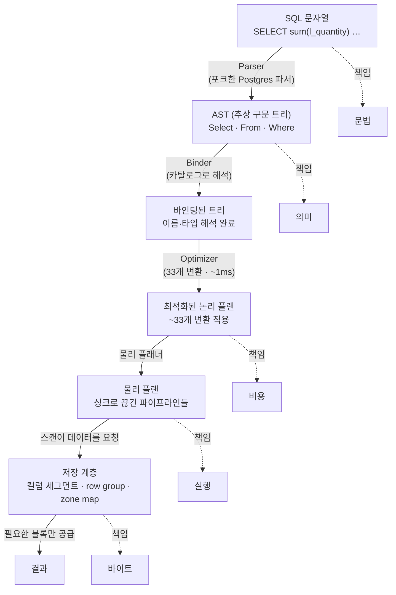

<figure class="post-figure post-figure--header">
<svg role="img" aria-label="왼쪽은 전통적 데이터베이스 — 클라이언트와 서버가 서로 다른 프로세스로 나뉘어, 그 사이를 TCP·직렬화(ODBC·JDBC) 관문이 가로막고 값이 한 행·한 값씩 줄지어 통과하는 병목. 오른쪽은 DuckDB — 클라이언트와 엔진이 같은 프로세스 메모리 안에 있어, 함수 호출 한 번으로 컬럼 버퍼 전체를 zero-copy로 그대로 공유한다." viewBox="0 0 680 360" xmlns="http://www.w3.org/2000/svg" shape-rendering="crispEdges">
  <!-- ===== 왼쪽: 전통적 DB — 프로세스 경계 + 직렬화 관문 ===== -->
  <text x="168" y="28" font-size="15" font-weight="700" fill="currentColor" text-anchor="middle">전통적 DB — 서버 경계</text>

  <!-- 클라이언트 프로세스 -->
  <rect x="40" y="50" width="110" height="86" fill="var(--bg-light)" stroke="currentColor" stroke-width="2"/>
  <text x="95" y="78" font-size="11" font-weight="700" fill="currentColor" text-anchor="middle">클라이언트</text>
  <text x="95" y="96" font-size="9" fill="var(--text-light)" text-anchor="middle">프로세스 A</text>
  <text x="95" y="122" font-size="9" fill="var(--text-light)" text-anchor="middle">앱 메모리</text>

  <!-- 서버 프로세스 -->
  <rect x="246" y="50" width="110" height="86" fill="var(--bg-light)" stroke="currentColor" stroke-width="2"/>
  <text x="301" y="78" font-size="11" font-weight="700" fill="currentColor" text-anchor="middle">DB 서버</text>
  <text x="301" y="96" font-size="9" fill="var(--text-light)" text-anchor="middle">프로세스 B</text>
  <text x="301" y="122" font-size="9" fill="var(--text-light)" text-anchor="middle">행 저장</text>

  <!-- 직렬화 / TCP 관문 (성문) -->
  <rect x="172" y="56" width="52" height="74" fill="var(--bg-sunken)" stroke="var(--accent-color)" stroke-width="3"/>
  <text x="198" y="48" font-size="10" font-weight="700" fill="var(--accent-color)" text-anchor="middle">관문</text>
  <text x="198" y="86" font-size="9" fill="var(--accent-color)" text-anchor="middle">TCP</text>
  <text x="198" y="100" font-size="9" fill="var(--accent-color)" text-anchor="middle">직렬화</text>
  <text x="198" y="114" font-size="8" fill="var(--accent-color)" text-anchor="middle">ODBC/JDBC</text>

  <!-- 값이 한 줄씩 통과 (줄선 점들) -->
  <g fill="var(--accent-color)">
    <circle cx="158" cy="160" r="5"/>
    <circle cx="178" cy="160" r="5"/>
    <circle cx="198" cy="160" r="5"/>
    <circle cx="218" cy="160" r="5"/>
    <circle cx="238" cy="160" r="5"/>
  </g>
  <line x1="150" y1="160" x2="246" y2="160" stroke="var(--accent-color)" stroke-width="1" stroke-dasharray="3 3"/>
  <text x="198" y="184" font-size="10" fill="var(--text-light)" text-anchor="middle">값마다 함수 호출 · 한 줄씩 통과</text>

  <text x="168" y="214" font-size="13" font-weight="700" fill="var(--accent-color)" text-anchor="middle">복사 · 직렬화 · 대역폭 병목</text>

  <!-- ===== 가운데 구분 ===== -->
  <line x1="368" y1="44" x2="368" y2="320" stroke="currentColor" stroke-width="1" stroke-dasharray="4 5" opacity="0.5"/>

  <!-- ===== 오른쪽: DuckDB — 같은 프로세스, zero-copy ===== -->
  <text x="520" y="28" font-size="15" font-weight="700" fill="currentColor" text-anchor="middle">DuckDB — 같은 프로세스</text>

  <!-- 하나의 프로세스 박스가 클라이언트 + 엔진을 감싼다 -->
  <rect x="400" y="50" width="240" height="120" rx="6" fill="var(--bg-light)" stroke="var(--secondary-color)" stroke-width="4"/>
  <text x="520" y="70" font-size="10" font-weight="700" fill="var(--secondary-color)" text-anchor="middle">하나의 프로세스 메모리</text>

  <!-- 클라이언트 -->
  <rect x="416" y="84" width="92" height="68" fill="var(--bg-panel)" stroke="var(--secondary-color)" stroke-width="2"/>
  <text x="462" y="110" font-size="11" font-weight="700" fill="currentColor" text-anchor="middle">클라이언트</text>
  <text x="462" y="128" font-size="9" fill="var(--text-light)" text-anchor="middle">pandas·Arrow</text>

  <!-- DuckDB 엔진 -->
  <rect x="532" y="84" width="92" height="68" fill="var(--bg-panel)" stroke="var(--secondary-color)" stroke-width="2"/>
  <text x="578" y="110" font-size="11" font-weight="700" fill="currentColor" text-anchor="middle">DuckDB</text>
  <text x="578" y="128" font-size="9" fill="var(--text-light)" text-anchor="middle">엔진(라이브러리)</text>

  <!-- 함수 호출 한 번 = 공유 컬럼 버퍼 (양방향 화살표, 복사 없음) -->
  <g stroke="var(--secondary-color)" stroke-width="3" fill="none">
    <path d="M508 118 L532 118"/>
  </g>
  <polygon points="532,118 524,114 524,122" fill="var(--secondary-color)"/>
  <polygon points="508,118 516,114 516,122" fill="var(--secondary-color)"/>

  <!-- 공유되는 컬럼 버퍼 (같은 버퍼를 가리킴) -->
  <g fill="var(--secondary-color)">
    <rect x="438" y="186" width="14" height="40"/>
    <rect x="456" y="186" width="14" height="40"/>
    <rect x="474" y="186" width="14" height="40"/>
    <rect x="492" y="186" width="14" height="40"/>
  </g>
  <text x="468" y="246" font-size="10" fill="var(--text-light)" text-anchor="middle">컬럼 버퍼 — 복사 없이 그대로 가리킴</text>
  <line x1="462" y1="152" x2="468" y2="184" stroke="var(--secondary-color)" stroke-width="1" stroke-dasharray="3 3"/>
  <line x1="578" y1="152" x2="520" y2="184" stroke="var(--secondary-color)" stroke-width="1" stroke-dasharray="3 3"/>

  <text x="520" y="214" font-size="13" font-weight="700" fill="var(--secondary-color)" text-anchor="middle">함수 호출 한 번 · zero-copy</text>

  <!-- ===== 하단 한 줄 대비 ===== -->
  <text x="168" y="300" font-size="11" fill="var(--text-light)" text-anchor="middle">성문 통관 줄서기</text>
  <text x="520" y="300" font-size="11" fill="var(--text-light)" text-anchor="middle">같은 막사 안 직거래</text>
</svg>
<figcaption>전통적 DB는 클라이언트와 서버가 다른 프로세스라, 결과가 TCP·직렬화(ODBC·JDBC) 관문을 값 단위로 줄지어 통과한다. DuckDB는 서버가 아니라 같은 프로세스 안의 라이브러리 — 함수 호출 한 번으로 컬럼 버퍼를 zero-copy로 공유해 그 관문 자체를 없앤다.</figcaption>
</figure>

## 원문 정보

> - **제목**: DuckDB Internals: Why is DuckDB Fast? (Part 1)
> - **출처**: Greybeam, 글쓴이 Kyle Cheung ([greybeam.ai](https://www.greybeam.ai/))
> - **발행**: 2026-05-04 · 약 18분 분량
> - **원문 링크**: <https://www.greybeam.ai/blog/duckdb-internals-part-1>

DuckDB는 "분석용 SQLite"라 불리는 인프로세스 OLAP 엔진이다. 이 글은 그 빠름의 근거를 마케팅 문구가 아니라 컴파일·실행·저장 계층의 설계 결정으로 풀어내며, 데이터베이스 엔진 내부를 다루는 위키의 `Systems-Programming` 갈래에 자연스럽게 들어맞는다.

## 한 줄 요약 (TL;DR)

DuckDB의 속도는 한 가지 비결이 아니라 **인프로세스 실행(직렬화·네트워크 제거) + 컬럼 압축 저장 + zone map 기반 블록 스킵 + 파이프라인/모젤(morsel) 단위 병렬 실행**이라는 일관된 설계 결정의 누적이다. 1부는 그중 SQL 컴파일과 저장 계층을 다루고, 벡터화 실행 본체는 2부로 넘긴다.

## 왜 이 글을 골랐나

데이터베이스가 "왜 빠른가"를 설명하는 글은 흔하지만, 대개 벤치마크 그래프 한 장으로 끝난다. 이 글은 반대로 **느림의 원인을 먼저 해부하고**(클라이언트로 결과를 보내는 직렬화 비용, 값마다 발생하는 함수 호출 오버헤드), 각 병목을 어떤 설계로 제거했는지 단계별로 짚는다. 그 결과 "DuckDB가 빠르다"가 아니라 "이런 결정을 했기 때문에 빠를 수밖에 없다"는 인과가 남는다.

또 이 위키에는 이미 [PostgreSQL 아키텍처 심층 분석](/2025/12/06/postgresql-architecture-deep-dive.html)이 있다. PostgreSQL은 멀티프로세스 클라이언트/서버 모델의 행(row) 기반 OLTP 엔진이고, DuckDB는 인프로세스 라이브러리형 컬럼 기반 OLAP 엔진이다. 같은 "Parser → Planner → Executor" 골격을 공유하면서도 정반대 지점을 최적화한 두 엔진을 나란히 두면, 데이터베이스 설계의 트레이드오프 지형이 훨씬 또렷해진다. 그 비교를 위한 좋은 한 축이라서 골랐다.

## 핵심 내용

원문은 "DuckDB란 무엇인가 → 인프로세스 실행 → SQL에서 논리 플랜으로 → 물리 플랜 → 저장 계층 → (2부 예고) 실행"의 순서로 흐른다. 같은 흐름을 따라 정리한다.

아래 도표가 이 글 전체의 척추다. SQL 한 줄이 결과가 되기까지, 각 단계마다 책임이 **문법 → 의미 → 비용 → 실행 → 바이트**로 한 칸씩 옮겨간다.

### 쿼리가 프로세스 안에서 실행된다

DuckDB의 가장 근본적인 이점은 **서버가 아니라 라이브러리**라는 점에서 나온다. 전통적인 데이터베이스는 결과를 ODBC·JDBC 같은 와이어 프로토콜로 직렬화해 TCP로 클라이언트에 전송한다. 여기서 두 가지 병목이 생긴다. 하나는 **대역폭** — 기가비트 이더넷이면 초당 약 125 MB가 천장이다. 다른 하나는 **값 단위 오버헤드** — ODBC·JDBC는 결과를 한 행, 한 값씩 돌려주기 때문에 모든 행의 모든 필드마다 별도의 함수 호출이 발생한다.

DuckDB는 같은 프로세스 안에서 직접 함수를 호출해 이 계층 자체를 없앤다. pandas 데이터프레임을 쿼리할 때는 **replacement scan**과 **zero-copy 접근**을 활용해, 물리적 메모리 레이아웃이 맞아떨어지는 경우 같은 버퍼를 그대로 공유한다. 이 접근이 가장 깔끔하게 구현되는 형식이 Arrow다. 데이터를 복사해서 넘기는 대신, 이미 메모리에 있는 컬럼 버퍼를 가리키기만 하면 되는 것이다.

### SQL에서 논리 플랜으로: 파싱, 바인딩, 최적화

**파싱(Parsing).** DuckDB는 **포크한 Postgres 파서**로 SQL 문자열을 추상 구문 트리(AST)로 바꾼다. 이 단계에서 나오는 것은 순수한 문법 구조다 — SELECT 문, 컬럼 참조, 함수 호출, 조인, 리터럴. 원문은 `SELECT sum(l_quantity) FROM lineitem WHERE ...` 같은 쿼리가 `Select(expressions=[Sum(...)], from_=From(Table(...)), where=Where(...))` 형태의 트리로 펼쳐지는 예를 든다. 아직 이 단계는 `lineitem`이 실제로 존재하는지조차 모른다.

**바인딩(Binding).** AST의 모든 이름을 카탈로그에 대조해 해석한다. `l_quantity` 같은 식별자가 어떤 테이블의 어떤 컬럼인지, 타입이 무엇인지 확정하고 타입 검사를 수행한다. "그런 컬럼 없음" 같은 오류가 표면화되는 곳이 바로 여기다. 파싱이 **문법**을 본다면 바인딩은 **의미**를 본다.

**최적화(Optimization).** 가장 흥미로운 단계다. DuckDB의 옵티마이저는 하나의 거대한 블랙박스가 아니라 **33개의 작고 개별적으로 들여다볼 수 있는 변환(transformation)**으로 쪼개져 있다. 원문이 강조하는 대표적인 것들은 다음과 같다.

- **Filter pushdown**: WHERE 조건을 스캔에 최대한 가깝게 끌어내려, 데이터를 일찍 쳐낸다.
- **Subquery unnesting**: 상관 서브쿼리를 조인으로 다시 쓴다. "Unnesting Arbitrary Queries" 논문의 기법을 사용한다.
- **Dynamic join-filter pushdown**: 해시 조인의 빌드(build) 쪽에서 계산한 min/max 경계를 프로브(probe) 쪽 스캔으로 되밀어 넣는다. 서로 다른 값이 50개 미만이면 IN 리스트로 변환한다.
- **Join order optimization**: 동적 계획법(DPhyp 또는 DPccp)으로 조인 순서를 탐색한다. 연결된 쌍 → 삼중 → 사중으로 점진적으로 조합을 넓히며 최적의 순서를 찾는다.

원문에 따르면 이 모든 최적화는 보통 **약 1밀리초**에 끝난다. 33개 변환의 이름을 전부 나열할 필요는 없지만, "옵티마이저 = 검사 가능한 작은 패스들의 파이프라인"이라는 구조 자체가 이 엔진의 성격을 잘 드러낸다.

### 물리 플랜: 파이프라인과 싱크

논리 플랜은 **물리 연산자(physical operator)**들로 번역되고, 이들은 **파이프라인(pipeline)**으로 묶인다. 파이프라인은 일종의 조립 라인이다. 데이터가 스트리밍 작업대들(WHERE 필터, 프로젝션, 해시 조인의 프로브 쪽)을 차례로 통과하는데, 각 작업대는 **그 행 하나의 정보만으로** 처리를 끝낼 수 있다 — 전체 입력을 다 봐야 할 필요가 없다.

반대로 **전체 입력을 봐야만 동작하는 연산자**(ORDER BY, GROUP BY, 해시 조인의 빌드 쪽)는 파이프라인을 끊고 새 파이프라인을 시작하는데, 이런 지점을 **파이프라인 브레이커(pipeline breaker)** 또는 **싱크(sink)**라 한다. 결국 물리 플랜은 싱크로 연결된 파이프라인들의 연속이 된다.

싱크의 실행은 세 단계로 진행되고, 이 구조가 DuckDB 병렬성의 핵심이다.

1. **Sink 단계**: 각 스레드가 **공유 없이** 로컬 상태(자기만의 해시 테이블, 정렬된 런)에 기록한다. 락이 필요 없으므로 병렬화가 자유롭다.
2. **Combine 단계**: 스레드 로컬 결과들을 전역 상태로 병합한다. 이 병합 자체도 코어 전반에 걸쳐 병렬화된다.
3. **Finalize 단계**: 완성된 전역 상태가 다음 파이프라인의 입력이 된다.

여기서 원문이 못 박는 중요한 포인트가 있다. **DuckDB의 병렬성은 전역 쿼리 차원의 계획을 시도하지 않는다. 한 번에 하나의 파이프라인을 병렬화할 뿐이다.** 병렬성이 로컬에 머문다는 이 단순함이, 락 경쟁을 피하면서 멀티코어를 채우는 비결이다.

### 저장 계층: row group과 zone map

**DuckDB 네이티브 포맷.** 데이터는 하나의 `.duckdb`(또는 `.db`) 파일에 들어가며, 고정 크기 블록(기본 256 KB, 16 KB까지 설정 가능) 단위로 관리된다. 블록 헤더에는 메타데이터와 함께 손상 탐지용 체크섬이 들어간다. 핵심은 **컬럼 저장**이다 — 각 컬럼이 서로 분리되어 저장된다. 한 레코드 전체가 연속으로 붙어 있는 행 저장(row store)과 정반대다.

컬럼은 다시 **최대 122,880행짜리 row group**으로 쪼개진다. 각 row group의 컬럼 세그먼트는 보통 256 KB 블록 하나에 대응한다. 그리고 각 row group마다 **zone map**이 붙는데, 여기에는 그 구간의 **최소·최대값과 null 개수**가 들어간다. 술어(predicate)를 평가할 때 이 zone map을 보고 "이 구간에는 조건에 맞는 값이 있을 수 없다"고 판단되면 블록 전체를 건너뛴다.

다만 zone map의 효과는 **컬럼의 정렬 상태에 달려 있다.** 정렬됐거나 타임스탬프 순서로 들어온 컬럼은 구간마다 값의 범위가 좁아 스킵이 잘 먹지만, 무작위로 흩어진 값은 모든 구간의 min/max가 넓게 겹쳐 스킵 효과가 사라진다. 즉 같은 데이터라도 어떤 순서로 적재하느냐가 스캔 성능을 좌우한다.

<figure class="post-figure">
<svg role="img" aria-label="같은 WHERE x = 350 술어를 두 컬럼에 평가하는 비교. 위쪽 정렬된 컬럼은 세 row group의 min/max 구간이 좁고 겹치지 않아, 350을 포함하는 한 블록만 읽고 나머지 두 블록은 zone map을 보고 건너뛴다. 아래쪽 무작위 컬럼은 세 구간의 min/max가 모두 0부터 999까지 넓게 겹쳐, 어느 블록도 건너뛰지 못하고 세 블록을 전부 읽는다." viewBox="0 0 680 400" xmlns="http://www.w3.org/2000/svg" shape-rendering="crispEdges">
  <!-- 공통 술어 -->
  <text x="340" y="26" font-size="14" font-weight="700" fill="currentColor" text-anchor="middle">술어: WHERE x = 350</text>

  <!-- ===== 위: 정렬된 컬럼 — 스킵 잘 먹음 ===== -->
  <text x="40" y="64" font-size="13" font-weight="700" fill="var(--secondary-color)">정렬된 컬럼 — 구간이 안 겹친다</text>

  <!-- row group 1: 0–199 (skip) -->
  <rect x="40" y="78" width="180" height="56" fill="var(--bg-sunken)" stroke="currentColor" stroke-width="2" stroke-dasharray="4 4"/>
  <text x="130" y="100" font-size="11" fill="var(--text-light)" text-anchor="middle">row group 1</text>
  <text x="130" y="118" font-size="11" font-weight="700" fill="currentColor" text-anchor="middle">min 0 · max 199</text>
  <text x="130" y="152" font-size="11" font-weight="700" fill="var(--secondary-color)" text-anchor="middle">건너뜀 ✕</text>

  <!-- row group 2: 200–399 (read) -->
  <rect x="250" y="78" width="180" height="56" fill="var(--bg-light)" stroke="var(--secondary-color)" stroke-width="4"/>
  <text x="340" y="100" font-size="11" fill="var(--text-light)" text-anchor="middle">row group 2</text>
  <text x="340" y="118" font-size="11" font-weight="700" fill="currentColor" text-anchor="middle">min 200 · max 399</text>
  <text x="340" y="152" font-size="11" font-weight="700" fill="var(--secondary-color)" text-anchor="middle">읽음 — 350 포함</text>

  <!-- row group 3: 400–599 (skip) -->
  <rect x="460" y="78" width="180" height="56" fill="var(--bg-sunken)" stroke="currentColor" stroke-width="2" stroke-dasharray="4 4"/>
  <text x="550" y="100" font-size="11" fill="var(--text-light)" text-anchor="middle">row group 3</text>
  <text x="550" y="118" font-size="11" font-weight="700" fill="currentColor" text-anchor="middle">min 400 · max 599</text>
  <text x="550" y="152" font-size="11" font-weight="700" fill="var(--secondary-color)" text-anchor="middle">건너뜀 ✕</text>

  <text x="340" y="180" font-size="13" font-weight="700" fill="var(--secondary-color)" text-anchor="middle">3블록 중 1블록만 읽음 — 스캔량 ⅓</text>

  <!-- 구분선 -->
  <line x1="40" y1="206" x2="640" y2="206" stroke="currentColor" stroke-width="1" stroke-dasharray="4 5" opacity="0.5"/>

  <!-- ===== 아래: 무작위 컬럼 — 스킵 안 먹음 ===== -->
  <text x="40" y="244" font-size="13" font-weight="700" fill="var(--accent-color)">무작위 컬럼 — 구간이 다 겹친다</text>

  <!-- 세 블록 모두 0–999 → 전부 읽음 -->
  <rect x="40" y="258" width="180" height="56" fill="var(--bg-light)" stroke="var(--accent-color)" stroke-width="4"/>
  <text x="130" y="280" font-size="11" fill="var(--text-light)" text-anchor="middle">row group 1</text>
  <text x="130" y="298" font-size="11" font-weight="700" fill="currentColor" text-anchor="middle">min 0 · max 999</text>
  <text x="130" y="332" font-size="11" font-weight="700" fill="var(--accent-color)" text-anchor="middle">읽음 — 350 있을 수도</text>

  <rect x="250" y="258" width="180" height="56" fill="var(--bg-light)" stroke="var(--accent-color)" stroke-width="4"/>
  <text x="340" y="280" font-size="11" fill="var(--text-light)" text-anchor="middle">row group 2</text>
  <text x="340" y="298" font-size="11" font-weight="700" fill="currentColor" text-anchor="middle">min 0 · max 999</text>
  <text x="340" y="332" font-size="11" font-weight="700" fill="var(--accent-color)" text-anchor="middle">읽음 — 350 있을 수도</text>

  <rect x="460" y="258" width="180" height="56" fill="var(--bg-light)" stroke="var(--accent-color)" stroke-width="4"/>
  <text x="550" y="280" font-size="11" fill="var(--text-light)" text-anchor="middle">row group 3</text>
  <text x="550" y="298" font-size="11" font-weight="700" fill="currentColor" text-anchor="middle">min 0 · max 999</text>
  <text x="550" y="332" font-size="11" font-weight="700" fill="var(--accent-color)" text-anchor="middle">읽음 — 350 있을 수도</text>

  <text x="340" y="360" font-size="13" font-weight="700" fill="var(--accent-color)" text-anchor="middle">스킵 0블록 — 3블록 전부 읽음 · 스캔량 그대로</text>

  <text x="340" y="388" font-size="11" fill="var(--text-light)" text-anchor="middle">같은 데이터 · 같은 술어 — 적재 순서만 다르다</text>
</svg>
<figcaption>zone map은 공짜가 아니다. 정렬된 컬럼은 row group마다 min/max가 좁고 겹치지 않아 술어에 안 맞는 블록을 통째로 건너뛰지만(스캔량 ⅓), 무작위로 적재된 컬럼은 모든 구간의 min/max가 0~999로 넓게 겹쳐 한 블록도 못 건너뛴다. 같은 데이터라도 적재 순서가 스캔 성능을 가른다.</figcaption>
</figure>

**Parquet.** Parquet 역시 컬럼 지향이고 row group·컬럼 단위로 통계를 저장한다. DuckDB는 파일의 **푸터(footer)만 읽어** 스키마와 통계를 파악한 뒤, 어떤 row group이 술어를 만족할 수 있는지 가린다. 원격 파일이라면 필요한 바이트만 골라 HTTP 요청을 보내므로, WHERE 절로 가지치기를 잘해두면 성능 차이가 극적이다. 컬럼 청크는 압축을 풀자마자 곧장 실행 파이프라인으로 흘러 들어간다.

**CSV.** 스키마가 없는 CSV를 위해 DuckDB는 세 단계 **스니퍼(sniffer)**를 돌린다. ① **방언 감지** — 후보 구분자·인용 문자·이스케이프·줄바꿈 스타일을 시험해 가장 일관된 행과 가장 많은 컬럼을 만드는 조합을 고른다(예: `DuckDB|OLAP database|Amsterdam, Netherlands|True`에서 도시 이름 안의 쉼표에 속지 않고 `|`를 구분자로 잡아낸다). ② **타입 감지** — 표본(기본 20,480행)을 우선순위 순서(NULL → BOOLEAN → TIME → DATE → TIMESTAMP → TIMESTAMPTZ → BIGINT → DOUBLE → VARCHAR)로 변환 시도하며, 실패하면 VARCHAR로 떨어진다. ③ **헤더 감지** — 첫 행이 나머지와 다른 모양이면 컬럼 이름으로, 아니면 기본 이름을 생성한다.

## 분석과 인사이트

> 여기서부터는 원문 요약이 아니라 내 해석이다.

**"빠름"의 정체는 병목 제거의 합이다.** 이 글이 잘 설계된 이유는 빠름을 단일 마법으로 포장하지 않는다는 데 있다. 네트워크 직렬화, 값 단위 함수 호출, 불필요한 블록 읽기, 락 경쟁 — 각각이 독립된 병목이고, DuckDB는 인프로세스 실행·벡터화(2부)·zone map·로컬 상태 병렬성으로 하나씩 제거한다. 성능 엔지니어링의 교과서적 태도다. "어디가 느린가"를 먼저 측정하고 그 지점만 친다는 점에서, 위키의 [Python Profiling](/2025/10/26/python-profiling.html) 글이 강조하는 "추측하지 말고 측정하라"와 같은 정신이다.

**인프로세스라는 결정이 모든 것을 정한다.** DuckDB가 라이브러리라는 선택은 단순한 배포 편의가 아니다. 서버 경계를 없앴기 때문에 직렬화도, 와이어 프로토콜도, zero-copy를 가로막는 복사도 사라진다. 이는 [SQLite 창시자 Richard Hipp 인터뷰](/2026/06/19/sqlite-richard-hipp-interview.html)에서 본 "임베디드 인프로세스 DB"의 OLAP 버전이라 볼 수 있다. SQLite가 트랜잭션 처리에서 같은 길을 갔다면, DuckDB는 분석 워크로드에서 그 길을 간다. 반대로 [PostgreSQL 아키텍처](/2025/12/06/postgresql-architecture-deep-dive.html)는 멀티프로세스 서버 모델을 택했기에 동시 접속·격리·네트워크 확장성을 얻는 대신 그 경계 비용을 떠안는다. **둘 중 무엇이 옳다가 아니라, 워크로드가 다르면 최적화 지점이 정반대가 된다**는 것이 핵심이다.

**옵티마이저를 33개의 작은 패스로 쪼갠 설계가 인상적이다.** 거대한 비용 모델 하나가 아니라, 개별적으로 켜고 끄고 들여다볼 수 있는 변환들의 파이프라인이라는 점은 컴파일러의 패스 구조를 빼닮았다. 디버깅 가능성과 점진적 개선 가능성을 동시에 사는 구조다. 새 최적화를 추가하는 일이 "거대한 모델을 다시 균형 맞추기"가 아니라 "패스 하나를 끼워 넣기"가 되기 때문이다.

**모젤(morsel) 단위 병렬성의 영리함.** "전역 쿼리 계획을 짜지 않고 한 번에 한 파이프라인만 병렬화한다"는 결정은 처음 들으면 소박해 보이지만, 사실은 동시성 설계의 정수다. 각 스레드가 로컬 상태에만 쓰고 나중에 병합하는 구조는 락 경쟁을 원천 차단한다. 이는 위키의 [Wait-free 알고리즘 강연 정리](/2026/06/24/wait-free-algorithms-cpp.html)가 다룬 "공유 지점에서의 경쟁을 어떻게 피하는가"라는 질문에 대한, 데이터베이스 차원의 또 다른 답이다. 또 Python의 [GIL](/2025/10/22/python-gil.html)이 진짜 병렬성을 막아 분석 워크로드에서 한계를 보이는 것과 대비하면, DuckDB가 C++로 멀티코어를 정직하게 채우는 설계가 왜 중요한지 분명해진다.

**zone map은 공짜가 아니다.** 가장 실무적으로 와닿는 대목이다. zone map의 블록 스킵 효과가 컬럼 정렬 상태에 좌우된다는 사실은, "데이터를 어떤 순서로 적재하느냐"가 쿼리 성능을 직접 바꾼다는 뜻이다. 인덱스를 따로 만들지 않아도, 자주 필터링하는 컬럼(특히 시간) 기준으로 정렬해 적재하기만 해도 스캔량이 급감한다. 이는 컬럼 저장과 OLAP의 본질을 다룬 [Designing Data-Intensive Applications 정리](/2026/06/19/designing-data-intensive-applications.html)의 "정렬된 컬럼 저장" 논의와 그대로 맞닿는다.

**아쉬운 점 / 유보.** 1부는 의도적으로 저장과 컴파일에 집중하고, 정작 "왜 빠른가"의 가장 큰 조각인 **벡터화 실행**을 2부로 미룬다. 그래서 이 글만으로는 절반의 그림이다. 또 MVCC·스냅샷 격리는 도입부에서 언급만 되고 본문에서 깊이 다루지 않으므로, 동시 쓰기 시나리오의 정확한 동작은 원문 시리즈의 후속 편이나 공식 문서로 보강해야 한다.

## 적용 포인트

- **분석 쿼리는 네트워크 경계를 넘기지 마라.** pandas/Arrow 데이터를 외부 DB로 보내 집계하는 대신, DuckDB로 같은 프로세스 안에서 처리하면 직렬화·전송 비용이 통째로 사라진다.
- **자주 필터링하는 컬럼(특히 타임스탬프) 기준으로 정렬해 적재하라.** zone map의 블록 스킵 효과는 정렬 상태에 비례한다. 인덱스를 만들기 전에 적재 순서부터 점검할 것.
- **Parquet에는 WHERE 가지치기를 적극 활용하라.** DuckDB는 푸터 통계로 row group을 가려 읽으므로, 원격 Parquet일수록 술어 가지치기가 곧 비용 절감(읽는 바이트 수 감소)이다.
- **`EXPLAIN`/`EXPLAIN ANALYZE`로 파이프라인과 싱크 경계를 읽어라.** 어디서 파이프라인이 끊기는지(정렬·집계·조인 빌드)를 보면 병렬화가 막히는 지점과 메모리 압력 지점을 짚을 수 있다.
- **CSV는 스니퍼에만 의존하지 말고 타입·구분자를 명시하라.** 표본 기반 추론은 빠르지만 경계 케이스에서 틀릴 수 있다. 대용량 적재 전 `read_csv`의 타입 옵션을 고정하면 재현성과 속도를 함께 얻는다.
- **"엔진 하나로 다 한다"는 가정을 버려라.** 원문 결론처럼, OLTP는 PostgreSQL, 단일 노드 OLAP는 DuckDB처럼 워크로드별 최적 엔진을 고르는 편이 점점 더 합리적이다.

## 마무리

DuckDB의 빠름은 영업 문구가 아니라 설계 결정의 인과로 설명된다. 서버 경계를 없앤 인프로세스 실행, 검사 가능한 33개 패스로 쪼갠 옵티마이저, 로컬 상태 기반의 파이프라인 병렬성, 그리고 row group·zone map으로 안 읽을 데이터를 안 읽는 컬럼 저장 — 1부는 이 토대를 깐다. 제목 그대로 "Part 1"이며, 정작 가장 큰 조각인 **벡터화 실행은 2부, 그리고 동시성/추가 주제는 3부**로 이어지는 세 편짜리 시리즈다. 그러니 이 글은 "왜 빠른가"의 출발선이고, 진짜 실행 엔진의 속살은 다음 편에서 봐야 한다. 단일 노드 분석의 성능을 다루는 사람이라면, 후속 편이 공개되는 대로 이어 읽기를 권한다.

### 더 읽어보기

- [원문 — DuckDB Internals: Why is DuckDB Fast? (Part 1)](https://www.greybeam.ai/blog/duckdb-internals-part-1) — Kyle Cheung, Greybeam (벡터화 실행은 2부, 동시성/추가 주제는 3부 예정)
- [PostgreSQL 아키텍처 심층 분석](/2025/12/06/postgresql-architecture-deep-dive.html) — 같은 Parser→Planner→Executor 골격, 정반대(멀티프로세스·행 저장·OLTP) 최적화
- [Designing Data-Intensive Applications 정리](/2026/06/19/designing-data-intensive-applications.html) — 컬럼 저장과 OLAP/OLTP 트레이드오프의 이론적 배경
- [Lock-free로도 부족할 때: C++ Wait-free 알고리즘 입문](/2026/06/24/wait-free-algorithms-cpp.html) — 공유 지점 경쟁 회피라는 같은 문제의 다른 답
- [SQLite 창시자 Richard Hipp 인터뷰](/2026/06/19/sqlite-richard-hipp-interview.html) — DuckDB의 사촌격, 임베디드 인프로세스 DB의 원형
- [Python GIL](/2025/10/22/python-gil.html) — 진짜 병렬성의 제약을 보면 DuckDB의 멀티코어 활용이 왜 중요한지 드러난다
