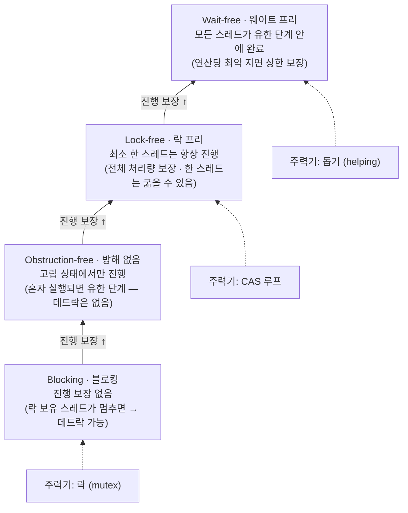
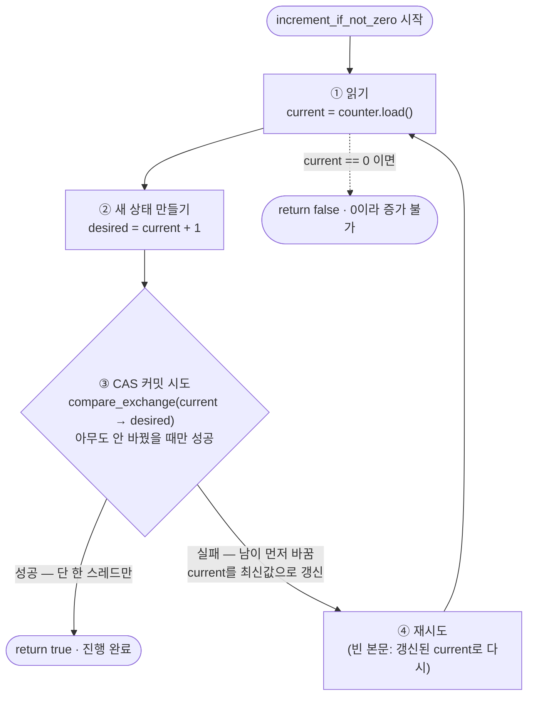
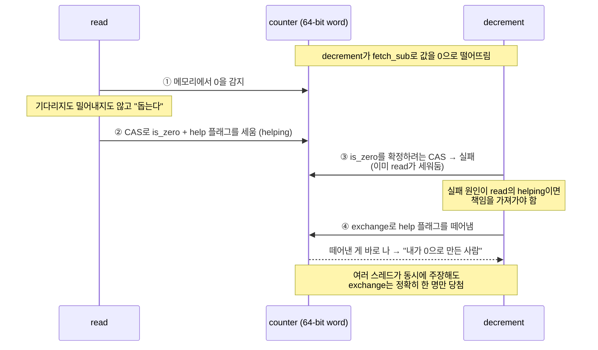

<figure class="post-figure post-figure--header">
<svg role="img" aria-label="왼쪽은 lock-free의 경쟁 구도 — 세 스레드가 같은 CAS 관문으로 몰려 한 스레드만 통과하고 나머지는 부딪혀 되돌아간다(clobber). 오른쪽은 wait-free의 협력 구도 — 앞선 작업을 대신 끝내주는 돕기(helping)로 모든 스레드가 통과한다. 가운데 sticky counter는 최상위 비트의 is_zero·help 플래그로 0을 봉인한다." viewBox="0 0 640 300">
  <title>경쟁(CAS clobber) 대 협력(helping), 그리고 sticky counter의 비트 플래그</title>

  <!-- ===== LEFT: competitive CAS — one passes, rest clobbered ===== -->
  <text x="105" y="30" text-anchor="middle" font-family="var(--font-body)" font-size="15" font-weight="700" fill="currentColor">경쟁 · CAS</text>
  <text x="105" y="48" text-anchor="middle" font-family="var(--font-body)" font-size="11" fill="var(--text-light)">한 스레드만 통과</text>

  <!-- the single CAS gate -->
  <rect x="178" y="70" width="14" height="150" fill="var(--steel)"/>
  <text x="185" y="245" text-anchor="middle" font-family="var(--font-body)" font-size="11" fill="var(--text-light)">CAS 관문</text>

  <!-- winner thread: passes through -->
  <circle cx="60" cy="105" r="13" fill="none" stroke="var(--secondary-color)" stroke-width="3"/>
  <line x1="74" y1="105" x2="172" y2="105" stroke="var(--secondary-color)" stroke-width="3"/>
  <polygon points="172,105 162,100 162,110" fill="var(--secondary-color)"/>
  <circle cx="215" cy="105" r="13" fill="none" stroke="var(--secondary-color)" stroke-width="3"/>
  <line x1="198" y1="105" x2="202" y2="105" stroke="var(--secondary-color)" stroke-width="3"/>
  <text x="60" y="109" text-anchor="middle" font-family="var(--font-body)" font-size="11" font-weight="700" fill="var(--secondary-color)">T1</text>

  <!-- losers: collide and bounce back (clobbered) -->
  <circle cx="60" cy="150" r="13" fill="none" stroke="var(--accent-color)" stroke-width="3"/>
  <text x="60" y="154" text-anchor="middle" font-family="var(--font-body)" font-size="11" font-weight="700" fill="var(--accent-color)">T2</text>
  <path d="M74 150 H150 M150 150 q14 -16 -2 -24 M150 150 q14 16 -2 24" fill="none" stroke="var(--accent-color)" stroke-width="3"/>
  <line x1="138" y1="138" x2="154" y2="162" stroke="var(--accent-color)" stroke-width="3"/>
  <line x1="154" y1="138" x2="138" y2="162" stroke="var(--accent-color)" stroke-width="3"/>

  <circle cx="60" cy="195" r="13" fill="none" stroke="var(--accent-color)" stroke-width="3"/>
  <text x="60" y="199" text-anchor="middle" font-family="var(--font-body)" font-size="11" font-weight="700" fill="var(--accent-color)">T3</text>
  <path d="M74 195 H150" fill="none" stroke="var(--accent-color)" stroke-width="3"/>
  <line x1="138" y1="183" x2="154" y2="207" stroke="var(--accent-color)" stroke-width="3"/>
  <line x1="154" y1="183" x2="138" y2="207" stroke="var(--accent-color)" stroke-width="3"/>

  <!-- ===== CENTER: sticky counter word with stolen top-bit flags ===== -->
  <g transform="translate(320,118)">
    <rect x="-22" y="0" width="22" height="34" fill="var(--accent-color)"/>
    <text x="-11" y="22" text-anchor="middle" font-family="var(--font-body)" font-size="13" font-weight="700" fill="var(--bg-panel)">Z</text>
    <rect x="0" y="0" width="22" height="34" fill="var(--secondary-color)"/>
    <text x="11" y="22" text-anchor="middle" font-family="var(--font-body)" font-size="13" font-weight="700" fill="var(--bg-panel)">H</text>
    <rect x="22" y="0" width="78" height="34" fill="none" stroke="currentColor" stroke-width="2"/>
    <text x="61" y="22" text-anchor="middle" font-family="var(--font-body)" font-size="11" fill="currentColor">62-bit value</text>
    <text x="50" y="-12" text-anchor="middle" font-family="var(--font-body)" font-size="11.5" font-weight="700" fill="currentColor">sticky counter</text>
    <text x="-11" y="50" text-anchor="middle" font-family="var(--font-body)" font-size="9.5" fill="var(--text-light)">is_zero</text>
    <text x="11" y="50" text-anchor="middle" font-family="var(--font-body)" font-size="9.5" fill="var(--text-light)">help</text>
  </g>

  <!-- ===== RIGHT: collaborative helping — all pass ===== -->
  <text x="535" y="30" text-anchor="middle" font-family="var(--font-body)" font-size="15" font-weight="700" fill="currentColor">협력 · 돕기</text>
  <text x="535" y="48" text-anchor="middle" font-family="var(--font-body)" font-size="11" fill="var(--text-light)">모두 통과</text>

  <!-- helping chain: each thread finishes the one ahead, then passes -->
  <g stroke="var(--secondary-color)" stroke-width="3" fill="none">
    <circle cx="455" cy="105" r="13"/>
    <line x1="469" y1="105" x2="567" y2="105"/>
    <circle cx="455" cy="150" r="13"/>
    <line x1="469" y1="150" x2="567" y2="150"/>
    <circle cx="455" cy="195" r="13"/>
    <line x1="469" y1="195" x2="567" y2="195"/>
  </g>
  <g fill="var(--secondary-color)">
    <polygon points="567,105 557,100 557,110"/>
    <polygon points="567,150 557,145 557,155"/>
    <polygon points="567,195 557,190 557,200"/>
    <circle cx="585" cy="105" r="5"/>
    <circle cx="585" cy="150" r="5"/>
    <circle cx="585" cy="195" r="5"/>
  </g>
  <g font-family="var(--font-body)" font-size="11" font-weight="700" fill="var(--secondary-color)" text-anchor="middle">
    <text x="455" y="109">T1</text>
    <text x="455" y="154">T2</text>
    <text x="455" y="199">T3</text>
  </g>
  <!-- "help" hand-off arcs between the lanes -->
  <path d="M500 118 q14 16 0 28" fill="none" stroke="var(--gold)" stroke-width="2" stroke-dasharray="3 3"/>
  <path d="M500 163 q14 16 0 28" fill="none" stroke="var(--gold)" stroke-width="2" stroke-dasharray="3 3"/>
  <text x="535" y="245" text-anchor="middle" font-family="var(--font-body)" font-size="11" fill="var(--text-light)">앞선 일을 대신 끝냄</text>
</svg>
<figcaption>왼쪽 — lock-free의 CAS 경쟁: 한 스레드만 관문을 통과하고 나머지는 부딪혀(clobber) 되돌아간다. 오른쪽 — wait-free의 돕기(helping): 앞선 작업을 대신 끝내주어 모든 스레드가 통과한다. 가운데 sticky counter는 최상위 두 비트(is_zero · help)를 훔쳐 0을 봉인한다.</figcaption>
</figure>

## 영상 정보

> - **제목**: Introduction to Wait-free Algorithms in C++ Programming
> - **연사**: Daniel Anderson (Carnegie Mellon University 조교수 / 병렬 알고리즘 PhD, SPAA Best Paper 수상)
> - **출처**: CppCon 2024 (공식 YouTube 채널, <youtube.com>)
> - **업로드**: 2024-12-10 · 길이 약 65분 · 자동 생성(ASR) 자막 기반 정리
> - **슬라이드**: "When Lock-Free Still Isn't Enough" ([CppCon2024 GitHub](https://github.com/CppCon/CppCon2024))
> - **영상 링크**: <https://www.youtube.com/watch?v=kPh8pod0-gk>

`Articles` 카테고리는 읽고 들을 만한 외부 콘텐츠를 골라 핵심을 정리하고 내 관점으로 분석하는 공간이다. 이번엔 이 위키에 처음 추가하는 `Systems-Programming` 서브카테고리의 첫 글로, 저수준 동시성의 가장 단단한 영역인 **wait-free 알고리즘**을 다룬 강연을 정리했다.

> *정리 방식 메모: 이 영상은 사람이 만든 자막이 아니라 **자동 생성(ASR) 자막**을 기반으로 한다. 발화를 그대로 옮기기보다 강연의 논리 흐름(정의 → CAS 루프 → 한계 → 돕기 → sticky counter 예제 → 벤치마크)을 따라 재구성했다. 코드는 슬라이드에 나온 개념을 의사코드 수준으로 옮긴 것이며, 정확한 시그니처는 원문 슬라이드를 참고하길 권한다.*

## 한 줄 요약 (TL;DR)

`lock-free`는 "락을 안 쓴다"는 뜻이 아니라 **"매 순간 최소 한 스레드는 진행한다"** 는 *진행 보장(progress guarantee)* 이다. 그래서 운 나쁜 한 스레드는 이론상 영원히 굶을 수 있다. `wait-free`는 한 단계 더 강한 보장으로 **"모든 스레드가 유한한 단계 안에 끝난다"** 를 약속한다. lock-free의 주력 도구가 무한 반복할 수 있는 **CAS 루프**라면, wait-free의 주력 도구는 경쟁 대신 **앞선 작업을 대신 끝내주는 '돕기(helping)'** 다. 강연은 이 차이를 `sticky counter`(0에서 멈추는 원자적 카운터, `weak_ptr::lock`이 실제로 쓰는 구조) 하나로 끝까지 끌고 간다.

### 한눈에 보기: 진행 보장의 사다리

이 글의 척추는 단 하나, **진행 보장(progress guarantee)의 위계**다. 아래에서 위로 올라갈수록 더 많은 스레드에게 더 강한 진행을 약속하고, 그만큼 **최악 지연(worst-case latency) 보장**이 단단해진다. 이 강연은 이 사다리를 한 칸씩 올라가는 이야기다.



위로 갈수록 "어느 스레드까지 진행을 약속하느냐"가 넓어진다 — 아무에게도 안 함(Blocking) → 혼자일 때만(Obstruction-free) → 최소 한 명(Lock-free) → 전원(Wait-free). lock-free의 주력기가 **CAS 루프**라면, 마지막 한 칸을 더 오르는 주력기가 **돕기(helping)**다. 글 전체가 sticky counter 하나로 이 마지막 칸을 어떻게 오르는지 보여준다.

## 왜 이 영상을 골랐나

동시성 자료는 대부분 "락을 어떻게 잘 쓰느냐" 혹은 "lock-free가 빠르다" 수준에서 멈춘다. 이 강연이 좋은 건 **용어를 진짜로 정의하고 시작한다**는 점이다. 많은 사람이 `lock-free`를 "코드에 mutex가 없으면 lock-free"로 오해하는데, 연사는 이를 "Ctrl+F로 mutex를 찾아 0개면 lock-free?"라고 농담하며 정면으로 부순다. lock-free·wait-free는 코드의 외형이 아니라 **진행 보장이라는 이론적 성질**로 정의된다는 것 — 이 출발점 하나만 제대로 잡아도 동시성 코드를 보는 눈이 달라진다.

또 하나, 이 글은 이 위키의 동시성 deep-dive들과 자연스럽게 이어진다. 파이썬에서 [GIL](/2025/10/22/python-gil.html)이 사실상 하나의 거대한 락으로 동시성을 "없애서" 안전을 사는 방식이라면, 이 강연은 정반대 극단 — **락을 완전히 걷어내고 진행을 보장하는** 영역을 보여준다. [Rust의 소유권](/2026/01/05/rust-ownership.html)과 [스마트 포인터·동시성](/2026/01/09/rust-smart-pointers-concurrency-and-projects.html)에서 다룬 `Arc`의 참조 카운트가 바로 이 강연의 예제(`weak_ptr::lock`)와 같은 문제를 풀고 있다는 점도 흥미롭다. 저수준 동시성을 언어를 가로질러 보고 싶을 때 좋은 글감이라 골랐다.

## 핵심 내용

강연의 흐름을 따라, 용어 정의 → CAS 루프 → wait-free의 정의 → sticky counter 예제 → 돕기 기법 → 벤치마크 순으로 정리한다.

### 출발점: 진행 보장이라는 어휘

연사는 동시성 알고리즘을 "락이 있냐 없냐"가 아니라 **얼마나 진행을 보장하느냐**로 분류한다. 위계는 아래에서 위로 네 단계다.

- **Blocking(블로킹)**: 진행 보장이 전혀 없다. 락을 쥔 스레드가 점심 먹으러 가버리면(스케줄에서 내려가면) 다른 스레드는 그저 기다린다. 최악의 경우 데드락.
- **Obstruction-free(방해 없음)**: **고립 상태에서는** 진행한다. 혼자 실행되면 유한 단계 안에 끝난다 — 사실상 "데드락은 없다"는 보장. 실무에서 자주 언급되진 않는다.
- **Lock-free(락 프리)**: **항상 최소 한 스레드는 진행한다.** 시스템 전체의 처리량은 보장되지만, 특정 한 스레드는 다른 스레드들에 계속 밀려 영원히 굶을(starve) 수 있다.
- **Wait-free(웨이트 프리)**: **모든 스레드가 유한한 단계 안에 끝난다.** 어떤 경쟁 상황에서도 어느 연산도 무한정 막히지 않는다. 사실상 연산당 이론적 최악 지연(worst-case latency)의 상한을 준다.

여기서 핵심은 lock-free의 정의가 직관과 다르다는 것이다. "락을 안 쓴다"가 아니라 "최소 한 스레드는 진행한다"이다. 그래서 *lock-free한 락*도 존재할 수 있고, mutex 없이 변수를 빙빙 도는 스핀 루프는 lock-free가 아니다. lock-free는 **평균 지연**은 좋게 하지만 **꼬리 지연(tail latency)** 은 보장하지 못한다. 모든 연산의 낮은 지연을 약속하려면 wait-free가 필요하다.

### 예제: sticky counter — 0에서 멈추는 카운터

강연 전체를 끌고 가는 예제는 **sticky counter**다. 정의는 단순하다.

- `increment_if_not_zero`: 카운터가 0이 아니면 1 증가시키고 성공을 반환. 0이면 증가시키지 않고 "0이라 못 했다"를 반환.
- `decrement`: 1 감소시키고, 그 결과 0이 되면 "내가 0으로 만든 사람"이라고 알려줌(참조 카운팅에서 해제 책임자를 가리는 데 필요).
- `read`: 현재 값 읽기.
- 전제조건: 0인 상태에서 `decrement`를 부르지 않는다(음수 금지) — 이건 라이브러리가 강제하지 않고 **API 사용자가 지켜야 할 계약**이다.

연사는 이게 인위적 예제가 아니라고 강조한다. C++11 이후 표준 라이브러리라면 어딘가에 이미 들어 있다 — 바로 **`weak_ptr::lock`** 이다. `weak_ptr`는 참조 카운트를 소유하지 않으므로, `lock()`으로 `shared_ptr`로 승격하려면 참조 카운트를 증가시켜야 하는데, **카운트가 이미 0이면(객체가 소멸됐으면) 증가시키면 안 되고 null을 반환**해야 한다. 정확히 "0이 아니면 증가"다.

### 1단계: 락으로 만든 스레드 안전 버전 — 왜 불만인가

단순한 `if (counter > 0) counter++;`는 스레드 안전하지 않다. 한 스레드가 `if` 조건을 통과하고 잠든 사이 다른 스레드가 카운터를 0으로 떨어뜨리면, 깨어난 스레드는 0이 된 카운터를 증가시켜버린다.

mutex와 `lock_guard`로 감싸면 올바르고 스레드 안전해진다. 하지만 연사가 싫어하는 구현이다. 락을 쥔 스레드가 스케줄에서 내려가면(점심 가면) 다른 스레드는 **할 일이 있어도 아무 진행을 못 한다.** 이게 blocking의 정의 그대로다. 연사의 정리: "락은 동시성 문제 대부분을 효과적으로 푼다 — 동시성 자체를 제거함으로써." (물론 올바르게·신중히 쓰면 락도 충분히 빠를 수 있다는 단서를 단다. 그리고 반복해서 강조한다 — **성능은 추측하지 말고 측정하라.**)

### 2단계: CAS 루프로 만든 lock-free 버전

락을 걷어내려면 원자적 연산이 필요하다. 카운터를 `std::atomic`에 넣는 것만으로는 부족하고, 원자적 연산을 실제로 써야 한다.

`increment_if_not_zero`의 주력 도구는 **compare-exchange(CAS, 이론에서는 compare-and-swap)** 다. "값이 내 예상과 같으면, 원하는 값으로 바꿔라." 0이 아닐 때만 증가시켜야 하므로 **CAS 루프**가 된다.

```cpp
// 의사코드: increment_if_not_zero (lock-free)
int current = counter.load();
while (current != 0) {
    // current가 그대로면 current+1로 교체, 아니면 current에 실제 값을 적재
    if (counter.compare_exchange_weak(current, current + 1))
        return true;          // 성공
    // 실패하면 compare_exchange가 current를 최신 값으로 갱신해 줌 → 다시 시도
}
return false;                  // 0이었다 → 증가 불가
```

여기서 lock-free 입문자가 자주 오해하는 지점이 두 개 나온다.

- **빈 루프 본문이 버그가 아니다.** `compare_exchange`는 실패하면 기댓값 변수에 *현재 실제 값을 적재*해 준다. 그래서 "읽고-시도하고-실패하면 갱신된 값으로 재시도"가 한 함수 안에서 일어난다. 본문이 비어 보이는 건 그래서다.
- `decrement`는 CAS 루프가 필요 없다. 조건 없이 그냥 1을 빼면 되므로 **`fetch_sub`** 를 쓴다. 단, `fetch_sub`는 **연산 전의(예전) 값**을 반환한다. "내가 0으로 만들었나?"는 `fetch_sub(1) == 1`로 확인한다(1이었다가 1을 빼면 0).

아래는 이 CAS 루프의 4단계 사이클이다. 여러 스레드가 같은 루프를 돌면, CAS 커밋 지점에서 **단 한 명만 성공하고 나머지는 갱신된 값을 들고 1단계로 되돌아간다.** 이 "한 명은 항상 진행한다"가 lock-free의 본질이자, 동시에 wait-free가 되지 못하는 이유다.



핵심은 ③에서 갈라지는 두 화살표다. **성공 가지는 정확히 한 스레드만** 탄다 — 내 CAS가 실패한다는 건 *오직 다른 누군가의 CAS가 성공했기 때문*이다. 그래서 시스템 전체로는 누군가 항상 ④가 아니라 "완료"로 빠진다(= lock-free). 하지만 운 나쁜 한 스레드는 매번 ③→④ 루프에 갇혀 영원히 "완료"에 닿지 못할 수 있다(= wait-free 아님).

이 CAS 루프가 lock-free의 99%를 차지하는 "주력기"다. 상태를 읽고, 새 상태를 만들고, **아무도 안 바꿨을 때만** CAS로 커밋하고, 누가 먼저 바꿨으면 다시 시도한다. 왜 이게 lock-free인가? 내 연산이 실패하는 건 **오직 다른 누군가의 연산이 성공했기 때문**이다. 즉 누군가는 항상 진행한다. 하지만 wait-free는 아니다 — 운 나쁜 한 스레드가 매번 지면 그 스레드는 이론상 영원히 성공하지 못한다.

### 3단계: wait-free의 조건 — 무한 CAS 루프를 없애라

wait-free 알고리즘은 **무한 반복할 수 있는 CAS 루프를 가져선 안 된다.** 이게 CAS를 금지한다는 뜻은 아니다. CAS는 여전히 강력한 도구이고, **유한한 횟수**로 쓰는 건 괜찮다. 금지되는 건 횟수에 상한이 없는 반복이다.

도구 상자는 원자적 **read-modify-write(RMW)** 연산들이다. 공통 테마는 **"값을 바꾸되, 바뀌기 전의 값을 항상 알려준다"** 는 것.

- `compare_exchange` (weak/strong): 예상과 같으면 교체. `weak`는 일부 아키텍처(예: ARM)에서 효율을 위해 *가짜 실패(spurious failure)* 를 허용한다.
- `fetch_add` / `fetch_sub`: 더하거나 빼고, **예전 값**을 반환.
- `exchange`: 저장하되, **무엇을 덮어썼는지** 알려줌.

이 "예전 값을 항상 안다"가 wait-free 설계의 토대가 된다.

### 4단계: 핵심 전환 — 경쟁에서 '돕기(helping)'로

CAS 루프의 문제는 스레드들이 **서로를 밀어낸다(clobber)** 는 것이다. 한 스레드의 성공이 다른 스레드의 실패가 된다. wait-free를 원하면 이 구도를 뒤집어야 한다.

**큰 아이디어: 경쟁(competitive) 대신 협력(collaborative).** 어떤 연산이 진행 중인 다른 연산을 발견하면, 그를 밀어내고 내 일을 하는 대신 **그의 일을 대신 끝내주고(help) 나서** 내 일을 한다. 그러면 아무도 나 때문에 막히지 않는다. 이것이 wait-free 설계의 주력기 — CAS 루프에 대응하는 — 인 **돕기(helping)** 다.

물론 말처럼 쉽지 않다. 임의의 CAS 루프를 helping으로 기계적으로 바꿀 수는 없다. helping을 하려면 **스레드가 "다른 연산이 진행 중"임을 감지할 수 있어야** 하는데, 평범한 CAS 루프에는 그런 신호가 없다. 그래서 대개 **알고리즘 전체를 새로 설계**해야 한다.

### 5단계: 비트를 훔쳐 신호를 만든다

sticky counter에서 진짜 어려운 지점은 **카운터가 0인지에 대해 스레드들이 합의하는 것**이다. 카운터가 10억이면 누가 증가·감소해도 아무 문제 없다. 모든 갈등은 "0이냐 아니냐"에서 생긴다 — 한 스레드가 0으로 떨어뜨린 직후 다른 스레드가 1로 되살리면 "0인 줄 몰랐다"는 사고가 난다.

<figure class="post-figure">
<svg role="img" aria-label="64비트 정수의 비트 레이아웃. 최상위 bit63은 is_zero 플래그, bit62는 help 플래그, 하위 bit61부터 0까지 62비트가 실제 카운터 값이다. is_zero가 켜지면 하위 62비트가 무엇이든 카운터는 0으로 취급된다. fetch_add는 하위 비트만 더하므로 상위의 플래그는 그대로 켜진 채 유지된다." viewBox="0 0 640 280">
  <title>64비트 sticky counter의 비트 레이아웃과 fetch_add의 무해함</title>

  <text x="320" y="26" text-anchor="middle" font-family="var(--font-body)" font-size="14" font-weight="700" fill="currentColor">상위 2비트를 훔쳐 신호를 만든다 (64-bit)</text>

  <!-- ===== bit layout row ===== -->
  <!-- bit 63: is_zero -->
  <rect x="40" y="50" width="70" height="56" fill="var(--accent-color)" stroke="var(--border-strong)" stroke-width="2"/>
  <text x="75" y="74" text-anchor="middle" font-family="var(--font-body)" font-size="12" font-weight="700" fill="var(--bg-panel)">is_zero</text>
  <text x="75" y="92" text-anchor="middle" font-family="var(--font-body)" font-size="11" fill="var(--bg-panel)">bit 63</text>

  <!-- bit 62: help -->
  <rect x="110" y="50" width="70" height="56" fill="var(--secondary-color)" stroke="var(--border-strong)" stroke-width="2"/>
  <text x="145" y="74" text-anchor="middle" font-family="var(--font-body)" font-size="12" font-weight="700" fill="var(--bg-panel)">help</text>
  <text x="145" y="92" text-anchor="middle" font-family="var(--font-body)" font-size="11" fill="var(--bg-panel)">bit 62</text>

  <!-- bits 61..0: value -->
  <rect x="180" y="50" width="420" height="56" fill="none" stroke="currentColor" stroke-width="2"/>
  <text x="390" y="74" text-anchor="middle" font-family="var(--font-body)" font-size="12" font-weight="700" fill="currentColor">실제 카운터 값 (62-bit)</text>
  <text x="390" y="92" text-anchor="middle" font-family="var(--font-body)" font-size="11" fill="var(--text-light)">bit 61 ‥‥‥‥‥‥‥‥‥‥‥‥‥‥‥‥‥‥‥‥‥‥ bit 0</text>

  <!-- brackets / labels -->
  <text x="145" y="128" text-anchor="middle" font-family="var(--font-body)" font-size="11" fill="var(--text-light)">훔친 플래그 2비트</text>

  <!-- ===== "is_zero on ⇒ counter is 0" rule ===== -->
  <rect x="40" y="158" width="560" height="38" fill="none" stroke="var(--border-color)" stroke-width="1.5" stroke-dasharray="5 4"/>
  <rect x="52" y="168" width="18" height="18" fill="var(--accent-color)"/>
  <text x="61" y="182" text-anchor="middle" font-family="var(--font-body)" font-size="12" font-weight="700" fill="var(--bg-panel)">1</text>
  <text x="84" y="182" font-family="var(--font-body)" font-size="12.5" fill="currentColor">is_zero가 켜지면 → 하위 62비트가 무엇이든 카운터는</text>
  <text x="488" y="182" font-family="var(--font-body)" font-size="12.5" font-weight="700" fill="var(--accent-color)">0으로 취급</text>

  <!-- ===== fetch_add doesn't disturb flags ===== -->
  <text x="40" y="230" font-family="var(--font-body)" font-size="12.5" fill="currentColor">fetch_add(1)</text>
  <!-- arrow staying within low bits -->
  <path d="M190 224 H560" fill="none" stroke="var(--gold)" stroke-width="2.5"/>
  <polygon points="560,224 550,219 550,229" fill="var(--gold)"/>
  <path d="M190 224 H560" fill="none" stroke="var(--gold)" stroke-width="2.5" stroke-dasharray="4 3"/>
  <text x="375" y="218" text-anchor="middle" font-family="var(--font-body)" font-size="11" fill="var(--text-light)">하위 비트에만 더해짐</text>
  <!-- flags untouched markers -->
  <text x="75" y="228" text-anchor="middle" font-family="var(--font-body)" font-size="16" font-weight="700" fill="var(--accent-color)">🔒</text>
  <text x="145" y="228" text-anchor="middle" font-family="var(--font-body)" font-size="16" font-weight="700" fill="var(--secondary-color)">🔒</text>
  <text x="320" y="258" text-anchor="middle" font-family="var(--font-body)" font-size="11.5" fill="var(--text-light)">→ 상위 플래그는 그대로 켜진 채, 0 상태가 깨지지 않는다</text>
</svg>
<figcaption>64비트 한 워드를 [is_zero · help · 62-bit value]로 쪼갠다. is_zero를 세우면 하위 62비트가 무엇이든 카운터는 0으로 봉인되고, fetch_add는 하위 비트에만 더해지므로 상위 플래그를 건드리지 않아 0 상태가 유지된다.</figcaption>
</figure>

해법은 **정수의 상위 비트 2개를 훔치는 것**. 64비트 중 62비트면 카운터 값으로 충분하다.

- **최상위 비트 = `is_zero` 플래그.** "지금부터 이 카운터는 0이다"를 모두에게 선언하는 비트. 비트값을 전부 0으로 만드는 게 아니라, 이 플래그를 세움으로써 **모든 스레드가 동시에 "0"에 합의**하게 한다. 이 비트가 켜져 있으면 하위 62비트가 무엇이든 카운터는 0으로 취급된다.
- **두 번째 비트 = `help` 플래그.** helping이 일어났음을 표시하는 비트(뒤에서 등장).

이 플래그가 마법을 부린다. `decrement`가 `fetch_sub` 후 값이 0이 되면, 그 0 상태를 **CAS로 `is_zero` 플래그를 세워 "확정"** 하려 한다. 이때 동시에 `increment`가 `fetch_add`로 1을 더해 끼어들 수 있는데, **`fetch_add`가 돌려준 값에 `is_zero` 비트가 켜져 있으면** 그 increment는 "아, 이건 0으로 확정된 카운터구나"를 알고 *증가를 못 한 것으로 처리(false 반환)* 한다. 최상위 비트에 플래그를 숨겼기 때문에 `fetch_add`가 비트를 더해도 **플래그는 그대로 켜진 채**라, 0 상태가 깨지지 않는다.

### 6단계: linearizability — "순서를 내가 정한다"

`decrement`가 0을 확정하려는 CAS가 실패하면? 그건 그 사이 `increment`가 끼어들어 카운터를 실제로 1로 만들었다는 뜻이다. 메모리상으로는 분명 0이었다가 1이 됐다. 그런데 연사는 태연히 말한다 — "그럼 **increment가 먼저 일어났고**(카운터를 1→2로), 그 다음 decrement가 일어났다(2→1)고 치겠다."

이게 **linearizability(선형화 가능성)** 다. 두 연산이 시간상 겹쳐 실행됐다면, 외부 관찰자는 어느 쪽이 먼저인지 증명할 수 없다. 그러니 겹친 연산들의 출력이 *어떤 순차 실행으로도 나올 수 있는 출력*과 같기만 하면, 알고리즘은 올바르다(linearizable). 메모리 내부의 0을 직접 들여다보지 못하는 한, 아무도 "거짓말"임을 증명할 수 없다.

문제는 `read`를 다시 넣을 때 생긴다. read가 메모리의 0을 직접 보고 0을 반환했는데, 잠시 후 다시 읽으니 1이라면 — 관찰자는 "0 다음 1"이라는 불가능한 순서를 목격하고 거짓말을 증명해버린다. 그래서 **read 연산을 추가하는 것이 이 문제의 진짜 난이도**다(강연은 read 없는 단순 버전을 먼저 완성하고 read를 나중에 붙인다).

### 7단계: read도 '돕는다', 그리고 책임 소재

read가 메모리에서 0을 보면, 그건 **누군가 막 `is_zero`를 확정하려는 중**이라는 신호다. 여기서 read는 기다리거나(블로킹) 밀어내는(clobber) 대신 — **그 decrement를 대신 끝내준다(help).** read가 직접 `is_zero` CAS를 쳐서 0을 확정해 버리는 것이다. 이로써 read는 비일관적인 0을 반환하지 않는다.

그런데 버그를 고치니 새 버그가 생긴다. read가 decrement를 도와 0을 확정해 버리면, 정작 **어떤 decrement도 "내가 0으로 만들었다"고 책임지지 않는다.** 참조 카운팅에서 이 책임자는 곧 **메모리를 해제할 사람**이라, 아무도 책임지지 않으면 객체가 영영 해제되지 않는다.

아래 시퀀스가 마지막 퍼즐이다. `read`가 0을 보면 밀어내거나 기다리지 않고 **decrement를 대신 끝내준다(help).** 그러면 책임자가 사라지는 새 버그가 생기는데, `exchange`가 `help` 플래그를 떼어내며 **정확히 한 스레드에게만** "0으로 만든 책임"을 넘겨 이를 해결한다.



핵심은 ④다. `exchange`는 "내가 무엇을 덮어썼는지" 알려주므로, **`help` 플래그를 실제로 떼어낸 단 한 스레드만** 책임을 가져간다. 여러 스레드가 0↔1을 오가며 동시에 책임을 주장해도 당첨은 정확히 한 명 — 참조 카운팅에서 이 한 명이 곧 **메모리를 해제할 사람**이다.

여기서 아껴둔 **두 번째 비트 `help` 플래그**가 등장한다. read가 도와줄 때 `help` 플래그를 함께 세운다. decrement가 `is_zero` CAS에 실패했을 때, 실패 원인은 둘 중 하나다.

- **increment 때문**이면 → linearizability를 들어 "increment가 먼저"라고 치고 끝낸다.
- **read의 helping 때문**이면 → decrement는 "내가 0으로 만든 사람"이라는 **책임을 가져가려 시도**한다. 방법은 `exchange`로 `help` 플래그를 떼어내는 것. `exchange`는 "무엇을 덮어썼는지" 알려주므로, **`help` 플래그를 실제로 떼어낸 단 한 스레드만** 책임을 가져간다. 여러 스레드가 0↔1을 오가며 동시에 책임을 주장해도, `exchange`가 정확히 한 명만 당첨시킨다.

이것이 최종 올바른 알고리즘이다. 핵심은 처음부터 끝까지 하나 — **진행 중인 다른 연산을 발견하면, 밀어내거나 기다리는 대신 돕는다.** 그리고 도운 뒤에는 올바른 반환값(누가 0으로 만들었는가)까지 책임지게 한다.

### 8단계: 벤치마크 — wait-free가 항상 빠른 건 아니다

연사는 작년 강연에서 만든 atomic `shared_ptr`에 이 카운터의 wait-free 버전과 lock-free 버전을 각각 넣고 `load` 지연을 비교한다(28코어 단일 소켓 머신). 결과의 교훈이 분명하다.

- **read-heavy 워크로드**(스레드들이 `load`를 도배): wait-free가 전반적으로 더 낮은 지연. `load`가 카운터 increment를 많이 유발해 **경쟁이 심하기** 때문이다.
- **load 50% / store 50%**: 격차가 좁아지고, 일부 구간에선 역전도 보인다.
- **load 10% / store 90%**(고스레드): **lock-free가 앞선다.** 경쟁이 적으면 CAS 루프가 한 번에 성공하는데, 그땐 lock-free가 보통 더 빠르다.

결론: **어느 쪽이 빠른지는 워크로드에 달렸다.** read/write 비율, 코어·스레드 수에 따라 답이 갈린다. 그러니 한 번의 벤치마크로 결론 내고 출시하지 말 것. "성능은 추측하지 말라 — 단, *가설*은 세워라"가 강연이 반복하는 메시지다. 알고리즘을 이론적으로 분석해 가설을 세우고, 여러 워크로드로 *측정해* 검증하라.

### 보너스: Q&A에서 나온 좋은 질문들

- **"언제 다 됐다고 확신하나?"** — wait-free 설계는 락 프로그래밍처럼 "끝난 줄 알았는데 또 이상한 엣지 케이스"의 연속이다. 진짜 답은 **정확성 증명**이다. 형식 검증(theorem solver)으로 증명하거나, 종이 위에서 **linearizability 증명**(연산이 어느 시점에 선형화되는지 — 예: decrement는 `fetch_sub`가 아니라 CAS 시점에 선형화된다 — 를 짚는다)을 쓴다. 현실적으로는 수천 스레드로 하루 종일 돌리는 **스트레스 테스트**가 버그의 *존재*는 잡지만, *부재*는 증명하지 못한다는 단서가 붙는다.
- **"ARM에서 `compare_exchange_strong`이 루프면 wait-free인가?"** — wait-free는 추상 기계 모델에서 정의된다. 실제 하드웨어가 그 가정을 만족하는지는 별개 문제다(이론은 실제 컴퓨터를 신경 쓰지 않는다는, 다소 허탈한 답).
- **Fedor의 지적("정의가 일관적이지 않다")** — 락을 쥔 스레드가 *스케줄에서 내려가도* "진행 없음"으로 친다면, 같은 논리로 wait-free 스레드도 내려갈 수 있으니 wait-free도 성립 못 하지 않나? 연사는 "진행"의 정의에 **'스케줄되어 실제로 실행 중일 때'** 라는 단서가 필요함을 인정한다. 그 관점에서 blocking은 *진짜 데드락*일 때만 막힌다.

## 분석과 인사이트

여기서부터는 강연 요약과 구분되는 내 관점이다.

**1) 이 강연의 가장 큰 가치는 "정의를 먼저 한다"는 태도다.** lock-free를 "mutex 없음"으로 이해하면 평생 잘못된 멘탈 모델을 갖게 된다. 진행 보장은 *코드의 외형*이 아니라 *최악의 경우 어느 스레드까지 진행을 약속하느냐*는 계약이다. 이건 동시성에만 국한된 교훈이 아니다. 시스템 설계에서 "평균"이 아니라 **꼬리(tail)** 를 보장 단위로 삼는 사고 — SLO를 p50이 아니라 p99로 잡는 것과 정확히 같은 사고방식이다. lock-free는 좋은 평균 지연을, wait-free는 보장된 꼬리 지연을 준다.

**2) 'helping'은 동시성을 넘어선 일반적 패턴이다.** "경쟁하는 대신, 앞선 작업의 상태를 읽어 대신 완성시킨다"는 발상은 분산 시스템에서도 반복된다. 예컨대 멈춘 코디네이터의 트랜잭션을 다른 참가자가 *recovery* 로 끝까지 굴려버리는 것, 락이 걸린 레코드를 보고 그 트랜잭션을 *대신 정리(roll forward)* 하는 스토리지 엔진의 동작이 같은 골격이다. 이 위키의 [Designing Data-Intensive Applications 정리](/2026/06/19/designing-data-intensive-applications.html)에서 다룬 합의·복제 메커니즘과 같은 사고 — **"막힌 작업을 누가 대신 끝내 시스템을 전진시킬 것인가"** — 가 메모리 한 워드 안에서 벌어지는 셈이다.

**3) 언어를 가로지르면 같은 문제가 보인다.** 이 예제(`weak_ptr::lock`)는 [Rust의 `Arc`](/2026/01/09/rust-smart-pointers-concurrency-and-projects.html)가 푸는 문제와 정확히 같다. Rust는 [소유권](/2026/01/05/rust-ownership.html)으로 *컴파일 타임*에 데이터 레이스를 차단하지만, `Arc`의 참조 카운트 자체는 결국 런타임에 원자적으로 관리되어야 한다 — 즉 Rust도 이 강연이 다룬 lock-free/wait-free 카운팅 문제에서 자유롭지 않다. 반대편 극단인 파이썬은 [GIL](/2025/10/22/python-gil.html)로 사실상 동시성을 직렬화해 이 문제를 회피해 왔고, free-threaded 빌드로 GIL을 걷어내는 순간 바로 이런 원자적 참조 카운팅의 비용과 정면으로 마주하게 된다. 같은 문제가 언어마다 "컴파일러가 막는다 / 거대한 락으로 회피한다 / wait-free로 정면돌파한다"로 갈린다는 게 흥미롭다.

**4) 그러나 wait-free는 만능이 아니다 — 강연이 정직한 지점.** 벤치마크에서 store-heavy 워크로드는 lock-free가 이긴다. 경쟁이 적으면 CAS 루프는 사실상 한 번에 끝나고, 그땐 단순한 게 빠르다. helping은 **경쟁이 심할 때만** 값을 한다. 그리고 그 대가로 알고리즘 복잡도가 폭발한다 — read 하나 추가하는 데 비트 두 개를 훔치고 linearizability를 동원하고 책임 소재까지 설계해야 했다. **"이론적 최악 지연 보장"이 실제로 필요한 곳**(HFT처럼 꼬리 지연이 돈인 도메인 — 연사의 소속 HRT가 그렇다)이 아니라면, lock-free나 잘 짜인 락이 더 현명한 선택일 수 있다. 추상화 비용을 정당화할 수 있을 때만 가장 강한 보장으로 올라가는 것 — 이건 [The Wrong Abstraction](/2026/06/22/the-wrong-abstraction.html)이 말하는 균형 감각과도 통한다.

**5) "측정하라, 단 가설을 세워라"가 진짜 엔지니어링 태도다.** 흔한 "추측하지 말고 측정하라"는 자칫 "이론은 무의미하니 무작정 벤치마크나 돌려라"로 오독되기 쉽다. 연사의 표현은 더 정밀하다 — *추측해서 출시하지 말되, 이론으로 가설은 세워라.* 진행 보장 분석은 "어떤 워크로드에서 wait-free가 이길 것"이라는 검증 가능한 가설을 준다. 이론은 측정을 대체하는 게 아니라 **무엇을 측정할지** 알려준다.

## 적용 포인트

- **"lock-free"를 "mutex 없음"과 동의어로 쓰지 말 것.** 코드 리뷰·설계 논의에서 동시성 자료구조를 평가할 때, "이건 어떤 *진행 보장*을 주는가(blocking / obstruction-free / lock-free / wait-free)"를 명시적으로 묻는다.
- **꼬리 지연이 SLO인지 먼저 확인하라.** 평균 지연만 중요하면 lock-free(혹은 잘 짠 락)로 충분하다. **모든** 연산의 상한이 필요할 때(저지연·실시간)만 wait-free의 복잡도를 감수한다.
- **CAS 루프의 "빈 본문"을 버그로 오해하지 말 것.** `compare_exchange`는 실패 시 기댓값을 최신 값으로 갱신해 준다. 또한 `fetch_sub`/`fetch_add`/`exchange`가 **연산 전 값**을 반환한다는 점(`fetch_sub(1)==1`이면 방금 0이 됨)을 항상 기억한다.
- **`weak`와 `strong` compare-exchange를 구분하라.** 반복문 안이라면 spurious failure를 허용하는 `weak`가 ARM 등에서 더 효율적이다. 단발 시도라면 `strong`.
- **새 알고리즘을 만든다면 linearization point부터 짚어라.** "이 연산은 정확히 어느 원자적 명령에서 선형화되는가"를 종이 위에서 먼저 정의하면, 정확성 추론과 스트레스 테스트 설계가 동시에 쉬워진다.
- **wait-free 자료구조가 정말 필요해지면 직접 짜기 전에 검증된 라이브러리를 먼저 찾아라.** 강연이 보여주듯 read 하나 추가에도 미묘한 버그가 줄줄이 따라온다. 스트레스 테스트는 버그의 *존재*만 잡지 *부재*는 증명하지 못한다.

## 마무리

이 강연은 "lock-free면 충분하지 않을 때 무엇을 하는가"라는 한 문장으로 요약된다. 답은 **진행 보장을 한 단계 끌어올리는 것**이고, 그 도구는 경쟁을 협력으로 바꾸는 **돕기(helping)** 다. 0에서 멈추는 작은 카운터 하나를 wait-free로 만드는 데 비트 두 개를 훔치고, linearizability로 순서를 재서술하고, 책임 소재까지 설계해야 했다는 사실이, 가장 강한 보장이 공짜가 아님을 정직하게 보여준다. 그래도 핵심 발상은 단순하고 아름답다 — **밀어내지 말고, 막힌 일을 대신 끝내주고 나서 내 일을 하라.** 동시성 코드를 "락이 있나 없나"가 아니라 "어떤 진행을 보장하나"로 보기 시작하는 것만으로도, 이 65분은 값을 한다.

### 더 읽어보기

- [원문 영상 — Introduction to Wait-free Algorithms in C++ Programming (CppCon 2024, Daniel Anderson)](https://www.youtube.com/watch?v=kPh8pod0-gk) — 이 글이 정리한 강연
- [Python GIL](/2025/10/22/python-gil.html) — 거대한 락으로 동시성을 직렬화해 안전을 사는 정반대 극단, free-threaded 빌드와 원자적 참조 카운팅
- [Rust 스마트 포인터, 동시성, 그리고 프로젝트](/2026/01/09/rust-smart-pointers-concurrency-and-projects.html) — `Arc`의 원자적 참조 카운트가 바로 이 강연의 예제와 같은 문제를 푼다
- [Rust 소유권(Ownership) 시스템](/2026/01/05/rust-ownership.html) — 데이터 레이스를 컴파일 타임에 막는 또 다른 접근
- [Asyncio Eventloop Optimization](/2025/11/10/asyncio-eventloop-optimization.html) — 단일 스레드 협력적 동시성으로 경쟁 자체를 회피하는 모델
- [C++의 이야기 — CultRepo 다큐멘터리 정리](/2026/06/19/story-of-cpp.html) — 이 강연의 무대인 C++ 언어의 40년 역사
- [Designing Data-Intensive Applications 정리](/2026/06/19/designing-data-intensive-applications.html) — "막힌 작업을 누가 대신 전진시키나"라는 helping의 발상이 분산 시스템에서 반복되는 곳
