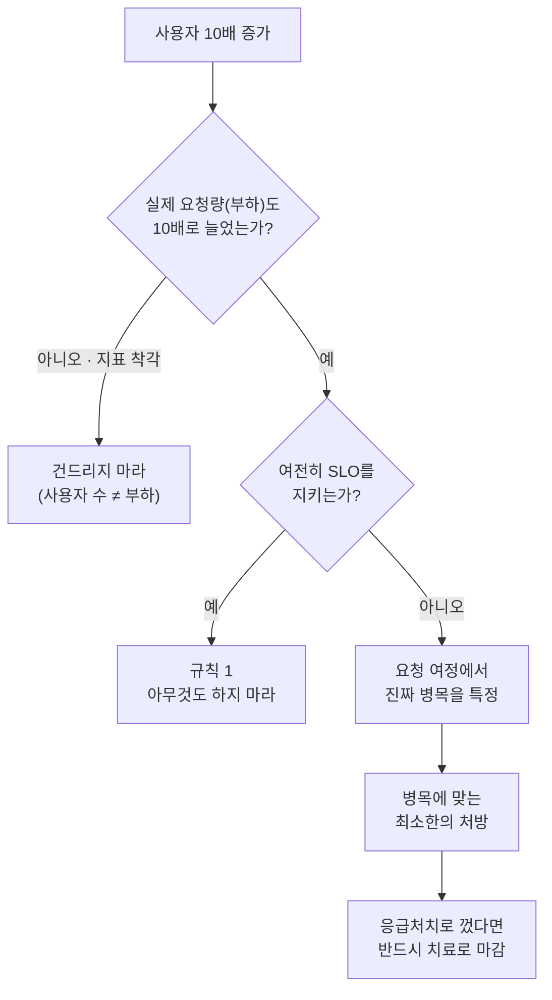
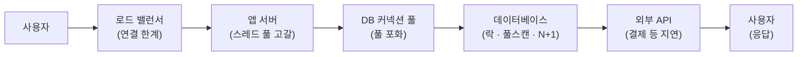

<figure class="post-figure post-figure--header">
<svg role="img" aria-label="사용자가 10배로 불어난 뒤 두 갈래로 갈리는 대응을 대비시킨 그림. 왼쪽에는 여러 명의 사용자 아이콘이 무리 지어 있고 곱하기 10 배지가 붙어 있으며, 화살표가 '트래픽 급증' 상자로 이어진다. 거기서 두 갈래로 갈린다. 위쪽 갈래에서는 한 개발자가 두 손을 들고 서버 랙을 잔뜩 쌓아 사재기하며 경고 표시와 가위표가 붙어 있다 — 성급한 증설. 아래쪽 갈래에서는 다른 개발자가 청진기로 로드 밸런서·앱 서버·커넥션 풀·데이터베이스·외부 API로 이어지는 요청 경로를 짚어 진짜 병목을 진단하고 체크 표시가 붙어 있다 — 측정 후 진단." viewBox="0 0 680 300" xmlns="http://www.w3.org/2000/svg">
  <title>증설 전에 측정하라 — 성급한 서버 사재기 vs 요청 경로 진단</title>
  <defs>
    <marker id="mbs-arrow" viewBox="0 0 10 10" refX="8" refY="5" markerWidth="7" markerHeight="7" orient="auto-start-reverse">
      <path d="M0,0 L10,5 L0,10 z" fill="currentColor"/>
    </marker>
    <marker id="mbs-arrow-g" viewBox="0 0 10 10" refX="8" refY="5" markerWidth="7" markerHeight="7" orient="auto-start-reverse">
      <path d="M0,0 L10,5 L0,10 z" fill="var(--secondary-color)"/>
    </marker>
  </defs>

  <!-- ===== LEFT: user crowd ×10 ===== -->
  <g fill="currentColor">
    <g><circle cx="52" cy="118" r="7"/><path d="M41,150 Q52,128 63,150 Z"/></g>
    <g><circle cx="86" cy="108" r="7"/><path d="M75,140 Q86,118 97,140 Z"/></g>
    <g><circle cx="120" cy="118" r="7"/><path d="M109,150 Q120,128 131,150 Z"/></g>
    <g><circle cx="52" cy="162" r="7"/><path d="M41,194 Q52,172 63,194 Z"/></g>
    <g><circle cx="86" cy="152" r="7"/><path d="M75,184 Q86,162 97,184 Z"/></g>
    <g><circle cx="120" cy="162" r="7"/><path d="M109,194 Q120,172 131,194 Z"/></g>
  </g>
  <!-- ×10 badge -->
  <circle cx="140" cy="96" r="17" fill="var(--bg-light)" stroke="var(--accent-color)" stroke-width="2.5"/>
  <text x="140" y="101" text-anchor="middle" font-size="13" fill="var(--accent-color)" font-weight="700">×10</text>
  <text x="86" y="222" text-anchor="middle" font-size="12" fill="currentColor" font-weight="700">사용자 10배</text>

  <!-- users -> pivot -->
  <line x1="150" y1="151" x2="190" y2="151" stroke="currentColor" stroke-width="2.5" marker-end="url(#mbs-arrow)"/>

  <!-- pivot node -->
  <rect x="196" y="131" width="72" height="40" rx="4" fill="var(--bg-panel)" stroke="var(--gold)" stroke-width="2.5"/>
  <text x="232" y="147" text-anchor="middle" font-size="10" fill="currentColor" font-weight="700">트래픽</text>
  <text x="232" y="161" text-anchor="middle" font-size="10" fill="currentColor" font-weight="700">급증</text>

  <!-- fork arrows -->
  <path d="M268,144 C 332,118 352,66 408,60" fill="none" stroke="currentColor" stroke-width="2.5" opacity="0.9" marker-end="url(#mbs-arrow)"/>
  <path d="M268,158 C 332,186 352,226 408,230" fill="none" stroke="var(--secondary-color)" stroke-width="2.5" marker-end="url(#mbs-arrow-g)"/>

  <!-- ===== UPPER branch: panic-buy servers (wrong) ===== -->
  <!-- panic developer, arms up -->
  <circle cx="432" cy="46" r="9" fill="currentColor"/>
  <path d="M419,82 Q432,56 445,82 Z" fill="currentColor"/>
  <line x1="424" y1="60" x2="412" y2="42" stroke="currentColor" stroke-width="2.5" stroke-linecap="round"/>
  <line x1="440" y1="60" x2="452" y2="42" stroke="currentColor" stroke-width="2.5" stroke-linecap="round"/>
  <!-- stacked server racks -->
  <g>
    <rect x="486" y="30" width="78" height="16" rx="2" fill="var(--bg-light)" stroke="currentColor" stroke-width="1.8"/>
    <circle cx="494" cy="38" r="2" fill="var(--accent-color)"/><line x1="502" y1="38" x2="556" y2="38" stroke="currentColor" stroke-width="1.4" opacity="0.6"/>
    <rect x="486" y="50" width="78" height="16" rx="2" fill="var(--bg-light)" stroke="currentColor" stroke-width="1.8"/>
    <circle cx="494" cy="58" r="2" fill="var(--accent-color)"/><line x1="502" y1="58" x2="556" y2="58" stroke="currentColor" stroke-width="1.4" opacity="0.6"/>
    <rect x="486" y="70" width="78" height="16" rx="2" fill="var(--bg-light)" stroke="currentColor" stroke-width="1.8"/>
    <circle cx="494" cy="78" r="2" fill="var(--accent-color)"/><line x1="502" y1="78" x2="556" y2="78" stroke="currentColor" stroke-width="1.4" opacity="0.6"/>
  </g>
  <!-- warning + cross -->
  <path d="M596,32 L610,58 L582,58 Z" fill="none" stroke="var(--accent-color)" stroke-width="2.5" stroke-linejoin="round"/>
  <text x="596" y="55" text-anchor="middle" font-size="14" fill="var(--accent-color)" font-weight="700">!</text>
  <text x="524" y="108" text-anchor="middle" font-size="11.5" fill="currentColor" font-weight="700" opacity="0.75">일단 서버부터 사재기?</text>

  <!-- divider -->
  <line x1="400" y1="150" x2="668" y2="150" stroke="currentColor" stroke-width="1" stroke-dasharray="3 5" opacity="0.35"/>

  <!-- ===== LOWER branch: diagnose the path (right) ===== -->
  <!-- diagnosing developer, arm reaching to stethoscope -->
  <circle cx="432" cy="212" r="9" fill="currentColor"/>
  <path d="M419,248 Q432,222 445,248 Z" fill="currentColor"/>
  <path d="M440,226 Q464,224 470,232" fill="none" stroke="var(--secondary-color)" stroke-width="2.5" stroke-linecap="round"/>
  <!-- request-path pipeline (mini) -->
  <g>
    <rect x="486" y="222" width="30" height="24" rx="3" fill="var(--bg-light)" stroke="currentColor" stroke-width="1.6"/>
    <rect x="524" y="222" width="30" height="24" rx="3" fill="var(--bg-light)" stroke="currentColor" stroke-width="1.6"/>
    <rect x="562" y="222" width="30" height="24" rx="3" fill="var(--bg-light)" stroke="currentColor" stroke-width="1.6"/>
    <rect x="600" y="222" width="30" height="24" rx="3" fill="var(--bg-panel)" stroke="var(--accent-color)" stroke-width="2.5"/>
    <line x1="516" y1="234" x2="524" y2="234" stroke="currentColor" stroke-width="1.6"/>
    <line x1="554" y1="234" x2="562" y2="234" stroke="currentColor" stroke-width="1.6"/>
    <line x1="592" y1="234" x2="600" y2="234" stroke="var(--accent-color)" stroke-width="1.8"/>
  </g>
  <!-- stethoscope head over the bottleneck segment -->
  <circle cx="615" cy="234" r="10" fill="none" stroke="var(--secondary-color)" stroke-width="2.5"/>
  <path d="M470,232 Q490,236 606,234" fill="none" stroke="var(--secondary-color)" stroke-width="1.6" opacity="0.55"/>
  <!-- check mark -->
  <path d="M648,220 l6,7 l11,-15" fill="none" stroke="var(--secondary-color)" stroke-width="3" stroke-linecap="round" stroke-linejoin="round"/>
  <text x="540" y="272" text-anchor="middle" font-size="11.5" fill="currentColor" font-weight="700">요청 경로부터 진단</text>
</svg>
<figcaption>사용자 10배는 증상일 뿐 — 반사적으로 서버를 사재기할 것인가, 요청 경로에서 진짜 병목을 먼저 진단할 것인가.</figcaption>
</figure>

## 원문 정보

> - **제목**: 사용자가 10배 늘었다. 일단 서버부터 사면 되나요?
> - **출처**: velog · 코헤(@gusdudco6) ([velog.io](https://velog.io/@gusdudco6/HTTP429))
> - **발행**: 2026-07 · 약 8분 분량
> - **원문 링크**: <https://velog.io/@gusdudco6/HTTP429>

트래픽이 튀는 순간 우리가 가장 먼저 손대는 곳이 대개 가장 나중에 손대야 할 곳이라는, 백엔드 확장성의 흔한 함정을 짚는 글이라 Articles에 담는다. (URL 슬러그는 `HTTP429`지만, 실제 내용은 rate limiting이 아니라 사용자 급증 대응 전략이다.)

## 한 줄 요약 (TL;DR)

사용자가 10배 늘었다고 서버를 10배로 늘리는 것은 진단 없는 처방이다. 먼저 **실제 부하가 정말 늘었는지**와 **서비스가 여전히 목표(SLO)를 지키는지**를 측정하고, 문제가 있다면 요청 여정에서 **진짜 병목**을 찾아 거기에 맞는 해법을 고르라는 것이 핵심이다.

## 왜 이 글을 골랐나

"트래픽이 늘면 서버를 늘린다"는 반사 신경은 거의 모든 주니어 백엔드 개발자가 처음 배우는 오답이다. 이 글이 좋은 이유는 결론("함부로 늘리지 마라")이 아니라 **순서**를 제시하기 때문이다. 측정 → 상태 정의(SLO) → 병목 특정 → 처방이라는 흐름은, 성능 문제를 감이 아니라 데이터로 다루게 만드는 사고의 척추다.

이 위키의 [PostgreSQL 아키텍처 심층 분석](/2025/12/06/postgresql-architecture-deep-dive.html)이나 [Python Profiling](/2025/10/26/python-profiling.html), [DuckDB는 왜 빠른가](/2026/06/24/duckdb-internals-why-fast.html)이 "무엇이 왜 느린가"를 다룬다면, 이 글은 그보다 한 단계 위 — "어디를 측정하고 어디를 고칠지 어떻게 정하는가"라는 의사결정의 층을 다룬다.

이 글의 척추는 "증설하라/마라"가 아니라 **측정 → 상태 정의 → 병목 특정 → 처방**으로 이어지는 의사결정의 순서다. 한눈에 보면 이렇다.



## 핵심 내용

### 사용자 증가 ≠ 서버 증설

글의 출발점은 두 지표의 분리다. **사용자 수**와 **실제 요청량(부하)**은 다른 숫자다. 가입자가 10배가 되어도 동시에 요청을 던지는 양은 별로 안 늘 수 있고, 반대로 사용자 수는 그대로여도 특정 기능 때문에 부하가 폭증할 수도 있다. 사용자 수만 보고 인프라를 결정하는 것은 잘못된 지표로 의사결정을 하는 셈이다.

그리고 기술을 하나 추가할 때마다 **유지보수 부담과 새로운 장애 지점**이 함께 붙는다. 증설은 공짜가 아니다.

### 규칙 1: 아무것도 하지 마라

시스템이 이미 늘어난 부하를 감당하고 있다면, 가장 좋은 대응은 **아무것도 하지 않는 것**이다. 문제가 없는데 복잡성을 더하는 것은 순수한 손해다. 이 판단을 내리려면 "문제가 없다"를 객관적으로 정의할 수 있어야 하고, 그게 다음 절의 SLO다.

### 상태를 정의하라 — SLO

SLO(Service Level Objective)는 서비스 품질을 **측정 가능한 목표**로 못 박은 것이다. 원문이 든 예:

- "대부분의 요청은 500ms 안에 응답해야 한다"
- 결제 요청은 거의 실패하지 않아야 한다
- 월간 가동률 최소치
- 중요한 데이터는 유실되지 않아야 한다

핵심 통찰은 **서비스마다 중요한 지표가 다르다**는 것이다. SNS 피드가 조금 늦는 것은 참을 만하지만, 결제 처리가 지연되면 중복 결제 같은 실질적 피해가 난다. SLO가 있어야 "지금 손대야 하는가"에 답할 수 있다.

### 병목을 특정하라 — 요청의 여정

요청은 여러 구간을 지난다:

```
사용자 → 로드 밸런서 → 앱 서버 → DB 커넥션 풀 → 데이터베이스 → 외부 API → 사용자
```

각 구간이 잠재적 실패 지점이고, **엉뚱한 병목을 고치면 노력이 낭비된다.** 원문의 예: 실제로는 외부 결제 API가 느린데 우리 쪽에 인덱스를 추가하고 있으면, 내 서버는 억울하게 누명을 쓴 채 문제는 그대로다.

요청이 지나는 각 구간은 저마다 대기·포화가 생길 수 있는 **잠재적 병목**이다. 어느 구간이 좁아졌는지를 짚어야, 엉뚱한 곳을 고치는 낭비를 피한다.



### CPU 지표는 거짓말을 한다

CPU 사용률이 낮다고 시스템이 건강한 것은 아니다. 원문은 대기 큐 관점으로 설명한다:

> "실제 로직은 100ms 만에 끝나더라도 요청이 3초 동안 기다렸다면 사용자가 느끼는 응답 시간은 3.1초다."

CPU가 30%여도 요청이 다른 곳에서 줄을 서고 있으면 성능 문제다. 대기를 만드는 지점들:

- 애플리케이션 **스레드 풀** 고갈
- **DB 커넥션 풀** 고갈
- **메시지 큐** 적체
- **DB 락**
- 네트워크 제약

즉 "CPU가 한가하다 → 여유가 있다"는 추론이 성립하지 않는다. 병목은 계산이 아니라 **대기**에 있는 경우가 많다.

### 데이터베이스를 의심하라

원문은 인프라를 늘리기 전에 DB부터 체계적으로 뜯어보라고 한다.

**1) 쿼리가 정당한가:**

- 20건 보여주려고 100만 건을 가져와 앱에서 거르고 있지 않은가
- 인덱스 조회 대신 풀 테이블 스캔을 하고 있지 않은가
- 반복문 안에서 N+1 쿼리가 터지고 있지 않은가
- 같은 데이터를 반복해서 조회하고 있지 않은가

**2) 최적화 점검:**

> "쿼리는 필요한 데이터만 조회하는가? 실행 계획은 어떻게 되어 있는가? 인덱스를 제대로 사용하는가?"

**3) 비즈니스 로직으로 푸는 법:** 페이지네이션, 통계 배치 처리, 혹은 최종 일관성(eventual consistency)을 수용하는 식으로 — **인프라 복잡성을 늘리지 않고** 문제를 없앨 수 있는 경우가 많다.

### 응급처치와 치료를 구분하라

원문은 대응을 두 단계로 나눈다.

**1단계 — 응급처치:** 서버 추가, 트래픽 제한, 기능 비활성화. 급한 불을 끄는 조치.

**2단계 — 치료:** 병목 분석, 쿼리 최적화, 인덱싱, 캐싱, 아키텍처 재설계. 근본 원인 제거.

> "서버 한 대를 추가해서 장애가 사라졌다면 급한 불은 껐을 수 있다. 하지만 비효율적인 쿼리가 그대로라면 사용자가 또 늘었을 때 같은 문제가 반복된다."

응급처치를 치료로 착각하는 순간, 같은 장애가 다음 트래픽 스파이크 때 그대로 돌아온다.

### 확장 기술은 만병통치약이 아니다

Redis(캐싱), Kafka(메시지 큐), 리드 레플리카(분산), 샤딩(데이터 분할) — 모두 유용하지만 원문은 **성급한 도입을 경계**한다. 각 기술은 새로운 실패 모드를 데려온다: Redis가 죽는 상황, 캐시와 DB의 불일치, 서버가 늘면서 커넥션 풀이 곳곳에서 고갈되는 상황.

특히 날카로운 예: DB 커넥션 한계를 방치한 채 앱 서버만 늘리면 **부하가 오히려 악화**된다. 서버마다 자기 커넥션 풀을 들고 오니, 서버를 늘릴수록 DB가 받는 압력이 배가되기 때문이다.

## 분석과 인사이트

원문 요약은 여기까지고, 아래는 내 관점이다.

**가장 값진 것은 "규칙 1: 아무것도 하지 마라"다.** 엔지니어는 문제 앞에서 무언가 하고 싶어 한다. 하지만 SLO를 지키고 있다면 개입은 순손실이다. 이 절제를 강제하는 장치가 SLO이고, 그래서 SLO는 목표라기보다 **개입 여부를 판정하는 게이트**로 읽는 편이 실무적이다.

**"CPU 지표는 거짓말을 한다"는 절이 이 글의 기술적 핵심이다.** 대부분의 백엔드 성능 문제는 계산량(CPU)이 아니라 대기(큐잉)에서 온다. 스레드 풀·커넥션 풀·큐·락은 전부 "줄 서는 지점"이고, 여기서 리틀의 법칙(대기 길이 = 도착률 × 대기시간)이 지배한다. 그래서 관측해야 할 것은 사용률보다 **큐 길이, 대기 시간, 풀 포화도, p99 지연**이다. CPU 대시보드만 보는 팀이 흔히 놓치는 지점이다. 이 대기의 메커니즘은 [Asyncio Eventloop Optimization](/2025/11/10/asyncio-eventloop-optimization.html)에서 이벤트 루프가 왜 블로킹에 취약한지와 정확히 같은 이야기다.

**"앱 서버를 늘리면 DB 압력이 배가된다"는 반직관적 결론이 특히 좋다.** 수평 확장(scale-out)은 상태가 없는(stateless) 계층에서만 공짜에 가깝다. 커넥션 풀·DB 같은 공유 자원 뒤에서는 서버 증설이 오히려 하류 병목을 증폭한다. 이 지점을 이해하지 못하면 오토스케일링이 장애를 키운다. 대규모 작업을 뒤로 밀어내는 [Django·Celery 분산처리](/2025/11/10/django-와-celery-를-이용한-대규모-작업-분산처리.html) 같은 비동기화가, 무작정 앞단을 늘리는 것보다 나은 이유이기도 하다.

**아쉬운 점**은 구체적인 수치나 관측 도구가 거의 없다는 것이다. "측정하라"고 하지만 무엇을 어떤 도구로(예: p99 지연, APM, 슬로우 쿼리 로그, `EXPLAIN ANALYZE`) 보는지는 독자의 몫으로 남는다. 원문은 훌륭한 **사고 프레임**이되, 실행 매뉴얼은 아니다. 실행 계획을 읽는 구체적 방법은 [PostgreSQL 아키텍처 심층 분석](/2025/12/06/postgresql-architecture-deep-dive.html) 쪽에서 보완하면 좋다.

## 적용 포인트

- **증설 버튼을 누르기 전에 SLO부터 확인하라.** SLO를 지키고 있으면 아무것도 하지 않는 것이 최선이다.
- **"사용자 N배"가 아니라 "요청량·부하 N배"를 측정하라.** 가입자 수는 인프라 결정 지표가 아니다.
- **CPU 사용률만 보지 말고 큐를 보라.** 스레드 풀·커넥션 풀 포화도, 큐 길이, p99 지연을 대시보드에 올려라.
- **인프라를 늘리기 전에 슬로우 쿼리부터 잡아라.** `EXPLAIN`으로 실행 계획을 확인하고, N+1·풀스캔·과다 조회를 먼저 제거하라.
- **응급처치와 치료를 장부에 따로 적어라.** 서버 추가로 불을 껐다면, 근본 원인(쿼리·아키텍처)을 고치는 티켓을 반드시 남겨라.
- **수평 확장 전에 하류 공유 자원을 점검하라.** 앱 서버를 늘리기 전에 DB 커넥션 한계부터 확인하지 않으면 병목이 증폭된다.
- **Redis·Kafka·샤딩은 도입 비용(운영·장애 모드)을 먼저 계산하라.** 새 기술은 새 실패 지점이다.

## 마무리

이 글의 진짜 주제는 "서버를 사지 마라"가 아니라 **"진단 없이 처방하지 마라"**다. 사용자 급증은 증상이지 진단이 아니다. SLO로 상태를 정의하고, 요청 여정에서 진짜 병목을 특정하고, 그 병목에 맞는 최소한의 처방을 고르는 것 — 이 순서를 지키는 팀만이 트래픽이 튈 때마다 서버를 사재기하는 악순환에서 벗어난다. 확장성은 장비의 문제이기 전에 **측정과 절제의 문제**다.

### 더 읽어보기

- [원문 — 사용자가 10배 늘었다. 일단 서버부터 사면 되나요? (코헤, velog)](https://velog.io/@gusdudco6/HTTP429)
- [PostgreSQL 아키텍처 심층 분석](/2025/12/06/postgresql-architecture-deep-dive.html) — 실행 계획·스토리지·프로세스 구조로 "왜 느린가"를 파고드는 DB 내부
- [Python Profiling](/2025/10/26/python-profiling.html) — 병목 지점을 감이 아니라 도구로 찾는 프로파일링 실전
- [Asyncio Eventloop Optimization](/2025/11/10/asyncio-eventloop-optimization.html) — 대기(블로킹)가 어떻게 처리량을 갉아먹는가
- [Django·Celery 대규모 작업 분산처리](/2025/11/10/django-와-celery-를-이용한-대규모-작업-분산처리.html) — 앞단 증설 대신 무거운 작업을 비동기로 밀어내는 접근
- [DuckDB는 왜 빠른가](/2026/06/24/duckdb-internals-why-fast.html) — 성능이 "장비"가 아니라 "설계"에서 나오는 사례
