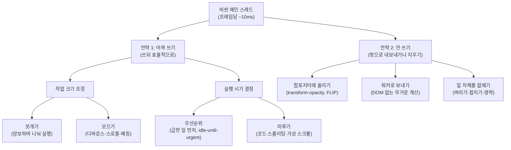

<figure class="post-figure post-figure--header">
<svg role="img" aria-label="하나뿐인 비싼 작업대에 작업이 밀려드는 모습을 그린 삽화. 왼쪽에는 JS 실행, 스타일 계산, 레이아웃, 페인트, 이벤트 처리라고 적힌 작업 상자들이 세로로 길게 줄 서 있고, 화살표가 가운데의 큰 작업대 — 메인 스레드 — 로 이어진다. 작업대 위에는 프레임당 약 10밀리초라는 빠듯한 예산 배지가 붙어 있고 한 명의 일꾼이 혼자 일하고 있다. 오른쪽에는 한가한 두 개의 작은 작업대 — 컴포지터 스레드와 웹 워커 — 가 있고, 줄에서 빠져나온 transform·opacity 상자와 무거운 계산 상자가 초록 점선 화살표를 따라 각각 옮겨지고 있다." viewBox="0 0 680 300" xmlns="http://www.w3.org/2000/svg">
  <title>하나뿐인 비싼 작업대(메인 스레드)와 한가한 작업대(컴포지터·워커)로의 이관</title>
  <defs>
    <marker id="emt-h-arrow" viewBox="0 0 10 10" refX="8" refY="5" markerWidth="7" markerHeight="7" orient="auto-start-reverse">
      <path d="M0,0 L10,5 L0,10 z" fill="currentColor"/>
    </marker>
    <marker id="emt-h-arrow-g" viewBox="0 0 10 10" refX="8" refY="5" markerWidth="7" markerHeight="7" orient="auto-start-reverse">
      <path d="M0,0 L10,5 L0,10 z" fill="var(--secondary-color)"/>
    </marker>
  </defs>

  <!-- ===== LEFT: task queue ===== -->
  <text x="78" y="30" text-anchor="middle" font-size="12" fill="currentColor" font-weight="700">대기 줄</text>
  <g>
    <rect x="24" y="42" width="108" height="26" rx="3" fill="var(--bg-light)" stroke="currentColor" stroke-width="1.8"/>
    <text x="78" y="59" text-anchor="middle" font-size="11" fill="currentColor">JS 실행</text>
    <rect x="24" y="76" width="108" height="26" rx="3" fill="var(--bg-light)" stroke="currentColor" stroke-width="1.8"/>
    <text x="78" y="93" text-anchor="middle" font-size="11" fill="currentColor">스타일 계산</text>
    <rect x="24" y="110" width="108" height="26" rx="3" fill="var(--bg-light)" stroke="currentColor" stroke-width="1.8"/>
    <text x="78" y="127" text-anchor="middle" font-size="11" fill="currentColor">레이아웃</text>
    <rect x="24" y="144" width="108" height="26" rx="3" fill="var(--bg-light)" stroke="currentColor" stroke-width="1.8"/>
    <text x="78" y="161" text-anchor="middle" font-size="11" fill="currentColor">페인트</text>
    <rect x="24" y="178" width="108" height="26" rx="3" fill="var(--bg-light)" stroke="currentColor" stroke-width="1.8"/>
    <text x="78" y="195" text-anchor="middle" font-size="11" fill="currentColor">이벤트 처리</text>
  </g>
  <text x="78" y="226" text-anchor="middle" font-size="14" fill="currentColor" opacity="0.6">⋮</text>

  <!-- queue -> main workbench -->
  <line x1="138" y1="123" x2="216" y2="150" stroke="currentColor" stroke-width="2.5" marker-end="url(#emt-h-arrow)"/>

  <!-- ===== CENTER: the one expensive workbench (main thread) ===== -->
  <!-- price badge -->
  <rect x="252" y="58" width="132" height="30" rx="4" fill="var(--bg-panel)" stroke="var(--accent-color)" stroke-width="2.5"/>
  <text x="318" y="78" text-anchor="middle" font-size="12" fill="var(--accent-color)" font-weight="700">프레임당 ~10ms</text>
  <line x1="318" y1="88" x2="318" y2="104" stroke="var(--accent-color)" stroke-width="1.6" stroke-dasharray="3 3"/>
  <!-- worker figure -->
  <circle cx="318" cy="122" r="10" fill="currentColor"/>
  <path d="M303,162 Q318,132 333,162 Z" fill="currentColor"/>
  <line x1="308" y1="140" x2="290" y2="156" stroke="currentColor" stroke-width="2.5" stroke-linecap="round"/>
  <line x1="328" y1="140" x2="346" y2="156" stroke="currentColor" stroke-width="2.5" stroke-linecap="round"/>
  <!-- bench top + legs -->
  <rect x="234" y="162" width="168" height="14" rx="2" fill="var(--bg-light)" stroke="currentColor" stroke-width="2.2"/>
  <line x1="248" y1="176" x2="244" y2="210" stroke="currentColor" stroke-width="3"/>
  <line x1="388" y1="176" x2="392" y2="210" stroke="currentColor" stroke-width="3"/>
  <!-- tasks piled on the bench -->
  <rect x="252" y="148" width="26" height="14" rx="2" fill="var(--bg-panel)" stroke="currentColor" stroke-width="1.6"/>
  <rect x="352" y="148" width="26" height="14" rx="2" fill="var(--bg-panel)" stroke="currentColor" stroke-width="1.6"/>
  <text x="318" y="234" text-anchor="middle" font-size="12.5" fill="currentColor" font-weight="700">메인 스레드</text>
  <text x="318" y="252" text-anchor="middle" font-size="11" fill="currentColor" opacity="0.75">하나뿐인 비싼 작업대</text>

  <!-- ===== RIGHT: idle benches (compositor / worker) ===== -->
  <!-- offload boxes in flight -->
  <rect x="416" y="66" width="112" height="24" rx="3" fill="var(--bg-panel)" stroke="var(--secondary-color)" stroke-width="2"/>
  <text x="472" y="82" text-anchor="middle" font-size="10.5" fill="var(--secondary-color)" font-weight="700">transform·opacity</text>
  <path d="M410,140 C 400,104 404,86 414,80" fill="none" stroke="var(--secondary-color)" stroke-width="2" stroke-dasharray="4 4"/>
  <line x1="528" y1="78" x2="560" y2="78" stroke="var(--secondary-color)" stroke-width="2.2" stroke-dasharray="4 4" marker-end="url(#emt-h-arrow-g)"/>

  <rect x="424" y="196" width="96" height="24" rx="3" fill="var(--bg-panel)" stroke="var(--secondary-color)" stroke-width="2"/>
  <text x="472" y="212" text-anchor="middle" font-size="10.5" fill="var(--secondary-color)" font-weight="700">무거운 계산</text>
  <path d="M412,172 C 404,190 410,200 420,206" fill="none" stroke="var(--secondary-color)" stroke-width="2" stroke-dasharray="4 4"/>
  <line x1="520" y1="208" x2="556" y2="208" stroke="var(--secondary-color)" stroke-width="2.2" stroke-dasharray="4 4" marker-end="url(#emt-h-arrow-g)"/>

  <!-- compositor bench (idle, small) -->
  <rect x="568" y="66" width="88" height="10" rx="2" fill="var(--bg-light)" stroke="currentColor" stroke-width="2"/>
  <line x1="578" y1="76" x2="575" y2="100" stroke="currentColor" stroke-width="2.5"/>
  <line x1="646" y1="76" x2="649" y2="100" stroke="currentColor" stroke-width="2.5"/>
  <circle cx="640" cy="46" r="7" fill="none" stroke="currentColor" stroke-width="2"/>
  <path d="M630,66 Q640,50 650,66 Z" fill="none" stroke="currentColor" stroke-width="2"/>
  <text x="612" y="122" text-anchor="middle" font-size="11.5" fill="currentColor" font-weight="700">컴포지터</text>

  <!-- worker bench (idle, small) -->
  <rect x="568" y="196" width="88" height="10" rx="2" fill="var(--bg-light)" stroke="currentColor" stroke-width="2"/>
  <line x1="578" y1="206" x2="575" y2="230" stroke="currentColor" stroke-width="2.5"/>
  <line x1="646" y1="206" x2="649" y2="230" stroke="currentColor" stroke-width="2.5"/>
  <circle cx="640" cy="176" r="7" fill="none" stroke="currentColor" stroke-width="2"/>
  <path d="M630,196 Q640,180 650,196 Z" fill="none" stroke="currentColor" stroke-width="2"/>
  <text x="612" y="252" text-anchor="middle" font-size="11.5" fill="currentColor" font-weight="700">워커</text>

  <text x="612" y="274" text-anchor="middle" font-size="10.5" fill="currentColor" opacity="0.7">한가한 작업대</text>
</svg>
<figcaption>메인 스레드는 모든 작업이 줄 서는 하나뿐인 비싼 작업대 — 일부는 한가한 작업대(컴포지터·워커)로 옮길 수 있다</figcaption>
</figure>

## 원문 정보

> - **제목**: 브라우저의 메인 스레드는 비싸다
> - **출처**: kciter (개인 블로그, [kciter.so](https://kciter.so))
> - **발행**: 2026-07-12 · 약 15~20분 분량
> - **원문 링크**: <https://kciter.so/posts/the-expensive-main-thread/>

프론트엔드 글이지만 본질은 단일 스레드 런타임의 스케줄링·성능 엔지니어링 문제라서 `Articles/Systems-Programming`에 담는다. 원문은 한국어다.

## 한 줄 요약 (TL;DR)

브라우저 메인 스레드는 자바스크립트 실행과 렌더링 파이프라인, 이벤트 처리를 혼자 떠맡는 단일 스레드이므로 프레임당 예산(약 10ms)이 극도로 빠듯한 "비싼 자원"이다. 성능 최적화의 핵심은 이 자원을 **아껴 쓰는** 네 가지 기법(쪼개기·모으기·우선순위·미루기)과 아예 **안 쓰는** 세 가지 기법(컴포지터에 올리기·워커로 보내기·일 자체를 없애기)으로 정리된다.

## 왜 이 글을 골랐나

글 전체를 관통하는 분류 체계를 한 장으로 그리면 이렇다.

프론트엔드 성능 이야기는 흔히 번들 크기 줄이기나 네트워크 최적화에서 멈춘다. 이 글은 한 단계 아래로 내려가 "코드가 느려서가 아니라 그 코드가 하필 메인 스레드를 붙잡고 있어서 문제"라는 관점 전환을 보여준다.

이 관점은 프론트엔드에 국한되지 않는다. 단일 이벤트 루프에 모든 것이 걸려 있는 구조는 [Python asyncio 이벤트 루프](/2025/11/10/asyncio-eventloop-optimization.html)에서도, [GIL이 만드는 단일 실행 제약](/2025/10/22/python-gil.html)에서도 똑같이 나타난다. "희소한 실행 자원을 어떻게 배분하는가"라는 스케줄링 문제의 브라우저판 사례 연구로 읽을 가치가 충분하다. 또한 개별 기법의 나열이 아니라 **일관된 분류 체계**(아껴 쓰기 vs 안 쓰기)로 기법들을 묶어낸 구성이 좋아서 골랐다.

## 핵심 내용

### 메인 스레드는 무슨 일을 하나

원문은 먼저 메인 스레드의 부하를 해부한다. 메인 스레드는 자바스크립트 실행뿐 아니라 화면을 그리는 렌더링 파이프라인 — `requestAnimationFrame` 콜백 → 스타일 계산 → 레이아웃 → 페인트 — 까지 담당한다. 60Hz 디스플레이 기준 한 프레임에 약 16.6ms가 주어지지만, 브라우저 내부 작업을 빼면 실제 가용 예산은 약 10ms에 불과하다.

<figure class="post-figure">
<svg role="img" aria-label="16.6밀리초 프레임 예산의 해부와 롱 태스크를 대비한 타임라인 그림. 위쪽에는 60헤르츠 기준 한 프레임인 16.6밀리초 막대가 그려져 있고, 그 안에 JS 실행, rAF 콜백, 스타일 계산, 레이아웃, 페인트가 차례로 들어찬 약 10밀리초의 가용 예산과, 나머지 약 6.6밀리초를 차지하는 브라우저 내부 작업 구간이 구분되어 있다. 아래쪽에는 같은 축 위에 프레임 경계선이 16.6밀리초 간격으로 그어져 있고, 50밀리초가 넘는 붉은 롱 태스크 막대 하나가 프레임 세 개를 통째로 집어삼켜 각 경계마다 놓친 프레임 표시가 붙어 있으며, INP와 TBT 지표가 악화된다는 설명이 달려 있다." viewBox="0 0 680 320" xmlns="http://www.w3.org/2000/svg">
  <title>16.6ms 프레임 예산의 해부 — 가용 예산 ~10ms vs 프레임을 집어삼키는 롱 태스크</title>

  <!-- ===== TOP: one frame anatomy ===== -->
  <text x="60" y="30" font-size="12.5" fill="currentColor" font-weight="700">한 프레임 (60Hz) = 16.6ms</text>

  <!-- frame bar: usable 10ms (x60..x361), browser internal 6.6ms (x361..x560) -->
  <rect x="60" y="44" width="500" height="34" fill="none" stroke="currentColor" stroke-width="2"/>
  <!-- pipeline segments inside usable budget -->
  <rect x="60" y="44" width="96" height="34" fill="var(--bg-light)" stroke="currentColor" stroke-width="1.4"/>
  <text x="108" y="65" text-anchor="middle" font-size="10.5" fill="currentColor">JS 실행</text>
  <rect x="156" y="44" width="52" height="34" fill="var(--bg-light)" stroke="currentColor" stroke-width="1.4"/>
  <text x="182" y="61" text-anchor="middle" font-size="9.5" fill="currentColor">rAF</text>
  <text x="182" y="72" text-anchor="middle" font-size="9.5" fill="currentColor">콜백</text>
  <rect x="208" y="44" width="55" height="34" fill="var(--bg-light)" stroke="currentColor" stroke-width="1.4"/>
  <text x="235" y="61" text-anchor="middle" font-size="9.5" fill="currentColor">스타일</text>
  <text x="235" y="72" text-anchor="middle" font-size="9.5" fill="currentColor">계산</text>
  <rect x="263" y="44" width="52" height="34" fill="var(--bg-light)" stroke="currentColor" stroke-width="1.4"/>
  <text x="289" y="65" text-anchor="middle" font-size="9.5" fill="currentColor">레이아웃</text>
  <rect x="315" y="44" width="46" height="34" fill="var(--bg-light)" stroke="currentColor" stroke-width="1.4"/>
  <text x="338" y="65" text-anchor="middle" font-size="9.5" fill="currentColor">페인트</text>
  <!-- browser internal work -->
  <rect x="361" y="44" width="199" height="34" fill="var(--bg-sunken)" stroke="currentColor" stroke-width="1.4" opacity="0.85"/>
  <text x="460" y="65" text-anchor="middle" font-size="10" fill="currentColor" opacity="0.8">브라우저 내부 작업</text>

  <!-- budget braces -->
  <path d="M60,92 L60,100 L361,100 L361,92" fill="none" stroke="var(--secondary-color)" stroke-width="2"/>
  <text x="210" y="118" text-anchor="middle" font-size="11.5" fill="var(--secondary-color)" font-weight="700">실제 가용 예산 ≈ 10ms</text>
  <path d="M365,92 L365,100 L560,100 L560,92" fill="none" stroke="currentColor" stroke-width="1.6" opacity="0.7"/>
  <text x="462" y="118" text-anchor="middle" font-size="10.5" fill="currentColor" opacity="0.75">≈ 6.6ms</text>

  <!-- ===== divider ===== -->
  <line x1="40" y1="146" x2="640" y2="146" stroke="currentColor" stroke-width="1" stroke-dasharray="3 5" opacity="0.35"/>

  <!-- ===== BOTTOM: long task swallowing frames ===== -->
  <text x="60" y="176" font-size="12.5" fill="currentColor" font-weight="700">롱 태스크 (50ms+)</text>

  <!-- frame boundary ticks every 16.6ms (150px per frame) -->
  <g stroke="currentColor" stroke-width="1.4" stroke-dasharray="4 4" opacity="0.6">
    <line x1="60" y1="190" x2="60" y2="262"/>
    <line x1="210" y1="190" x2="210" y2="262"/>
    <line x1="360" y1="190" x2="360" y2="262"/>
    <line x1="510" y1="190" x2="510" y2="262"/>
  </g>
  <g font-size="9.5" fill="currentColor" opacity="0.7">
    <text x="60" y="278" text-anchor="middle">0ms</text>
    <text x="210" y="278" text-anchor="middle">16.6ms</text>
    <text x="360" y="278" text-anchor="middle">33.3ms</text>
    <text x="510" y="278" text-anchor="middle">50ms</text>
  </g>

  <!-- the long task bar: 0 -> ~56ms -->
  <rect x="60" y="204" width="504" height="34" fill="none" stroke="var(--accent-color)" stroke-width="2.5"/>
  <rect x="64" y="208" width="496" height="26" fill="var(--accent-color)" opacity="0.18"/>
  <text x="312" y="226" text-anchor="middle" font-size="11.5" fill="var(--accent-color)" font-weight="700">하나의 작업이 메인 스레드를 50ms+ 점유</text>

  <!-- dropped frame marks -->
  <g font-size="12" fill="var(--accent-color)" font-weight="700">
    <text x="210" y="200" text-anchor="middle">✕</text>
    <text x="360" y="200" text-anchor="middle">✕</text>
    <text x="510" y="200" text-anchor="middle">✕</text>
  </g>
  <text x="586" y="200" font-size="10" fill="var(--accent-color)">✕ = 놓친 프레임</text>

  <text x="312" y="304" text-anchor="middle" font-size="11" fill="currentColor" opacity="0.8">그동안 어떤 입력·렌더링도 처리 불가 → INP · TBT 악화</text>
</svg>
<figcaption>16.6ms 중 실제 가용 예산은 약 10ms — 50ms를 넘는 롱 태스크 하나가 프레임 여러 개를 통째로 집어삼킨다</figcaption>
</figure>

단일 스레드 이벤트 루프 모델이므로 한 작업이 실행되는 동안 다른 어떤 것도 처리할 수 없다. 메인 스레드를 50ms 이상 점유하는 작업을 **롱 태스크**라 부르며, 이것이 INP(Interaction to Next Paint)와 TBT(Total Blocking Time) 같은 성능 지표를 악화시키는 주범이다.

### 전략 1 — 비싼 자원을 아껴 쓰기

첫 번째 축은 메인 스레드를 쓰되 시간을 효율적으로 배분하는 기법 넷이다. 원문은 이를 다시 **작업 크기 조정**(쪼개기·모으기)과 **실행 시기 결정**(우선순위·미루기)으로 나눈다.

**쪼개기(Task Splitting).** 긴 작업을 작은 조각으로 나눠 중간중간 메인 스레드에 제어권을 돌려준다. 개수 기반 양보(N개 처리마다 `setTimeout(0)`으로 양보)와 시간 기반 양보(`performance.now()`로 5ms 예산을 재며 일하다 `requestAnimationFrame`으로 다음 프레임에 재개) 두 패턴을 제시한다. 다만 너무 잘게 쪼개면 양보 오버헤드가 실제 작업보다 커지고, `JSON.parse` 같은 원자적 동작은 애초에 쪼갤 수 없다는 한계도 함께 짚는다.

**모으기(Task Batching).** 반대로 반복되는 작은 작업은 묶어서 처리량을 높인다. 디바운스(마지막 이벤트 후 일정 시간 지나면 실행 — 타이핑 후 검색)와 스로틀(일정 간격당 1회 — 스크롤), DOM 조작을 문자열로 모아 한 번에 반영하는 DOM 배칭, 그리고 실시간 소켓 틱을 쌓아두고 `requestAnimationFrame`으로 프레임당 한 번만 렌더링하는 시각적 갱신 배칭을 다룬다. 마크다운 에디터에서 입력마다 2,000줄을 파싱하던 것을 디바운스 300ms로 개선하는 예제가 실려 있다.

**우선순위(Prioritization).** 사용자에게 중요한 일을 먼저 처리한다. `MessageChannel` 기반의 우선순위 큐를 직접 구현해 급한 작업을 큐 맨 앞에 끼워 넣는 코드를 보여주고, 한가할 때 미리 처리하되 사용자가 필요로 하는 순간 즉시 우선순위를 끌어올리는 **idle-until-urgent** 패턴을 소개한다.

**미루기(Deferral).** 지금 하지 않아도 되는 일은 나중으로 보낸다. 코드 스플리팅, `IntersectionObserver`(`rootMargin: '400px'`)로 뷰포트 근처만 채우는 가상 스크롤, 화면 밖 애니메이션·캐러셀을 멈추는 배경 작업 제어가 여기에 속한다.

### 전략 2 — 비싼 자원을 안 쓰기

두 번째 축은 메인 스레드 밖으로 일을 내보내거나 일 자체를 지우는 기법 셋이다.

**컴포지터에 올리기.** `transform`과 `opacity`는 메인 스레드를 거치지 않고 컴포지터 스레드에서 처리되지만, `top`/`left`/`width`/`height`는 레이아웃을 유발한다. 복잡한 위치 이동 애니메이션은 **FLIP**(First–Last–Invert–Play) 기법으로 처리한다: 변경 전 위치를 측정하고(First), 실제 레이아웃 변경은 단 한 번만 수행한 뒤(Last), `transform`으로 이전 위치로 되돌렸다가(Invert), `transform` 애니메이션으로 원위치시킨다(Play). 읽기와 쓰기를 번갈아 하며 레이아웃을 반복 계산시키는 **레이아웃 스래싱**을 피해 "읽기 전부 → 쓰기 전부" 순서로 배치하라는 조언도 이어진다.

<figure class="post-figure">
<svg role="img" aria-label="FLIP 기법의 4단계를 메인 스레드와 컴포지터 스레드 두 레인에 배치한 그림. 위쪽 메인 스레드 레인에는 세 단계가 차례로 놓여 있다. 1단계 First는 작은 화면 안에서 상자가 왼쪽 위 A 위치에 있고 점선 눈금으로 변경 전 위치를 측정한다. 2단계 Last는 상자가 오른쪽 아래 B 위치로 옮겨져 있으며 레이아웃 변경을 단 한 번만 수행한다. 3단계 Invert는 B 위치의 점선 잔상에서 붉은 화살표를 따라 상자를 transform으로 다시 A 위치로 되돌린다. 아래쪽 컴포지터 스레드 레인에는 4단계 Play가 있고, A 위치의 점선 잔상에서 초록 화살표를 따라 상자가 B 위치로 transform 애니메이션되며, 이 단계는 메인 스레드를 거치지 않는다." viewBox="0 0 680 330" xmlns="http://www.w3.org/2000/svg">
  <title>FLIP 4단계 — First·Last·Invert는 메인 스레드, Play는 컴포지터 스레드</title>
  <defs>
    <marker id="emt-f-arrow" viewBox="0 0 10 10" refX="8" refY="5" markerWidth="7" markerHeight="7" orient="auto-start-reverse">
      <path d="M0,0 L10,5 L0,10 z" fill="currentColor"/>
    </marker>
    <marker id="emt-f-arrow-r" viewBox="0 0 10 10" refX="8" refY="5" markerWidth="7" markerHeight="7" orient="auto-start-reverse">
      <path d="M0,0 L10,5 L0,10 z" fill="var(--accent-color)"/>
    </marker>
    <marker id="emt-f-arrow-g" viewBox="0 0 10 10" refX="8" refY="5" markerWidth="7" markerHeight="7" orient="auto-start-reverse">
      <path d="M0,0 L10,5 L0,10 z" fill="var(--secondary-color)"/>
    </marker>
  </defs>

  <!-- ===== lanes ===== -->
  <rect x="100" y="34" width="568" height="162" fill="var(--bg-light)" opacity="0.55"/>
  <rect x="100" y="204" width="568" height="116" fill="var(--bg-light)" opacity="0.55"/>
  <line x1="100" y1="200" x2="668" y2="200" stroke="currentColor" stroke-width="1.2" stroke-dasharray="4 5" opacity="0.5"/>
  <g font-size="11" fill="currentColor" font-weight="700">
    <text x="52" y="108" text-anchor="middle">메인</text>
    <text x="52" y="124" text-anchor="middle">스레드</text>
    <text x="52" y="252" text-anchor="middle">컴포지터</text>
    <text x="52" y="268" text-anchor="middle">스레드</text>
  </g>

  <!-- ===== step 1: First ===== -->
  <rect x="118" y="58" width="104" height="82" rx="3" fill="var(--bg-panel)" stroke="currentColor" stroke-width="1.8"/>
  <rect x="126" y="66" width="22" height="22" fill="currentColor"/>
  <!-- measuring guides -->
  <line x1="137" y1="92" x2="137" y2="134" stroke="currentColor" stroke-width="1.2" stroke-dasharray="3 3" opacity="0.6"/>
  <line x1="152" y1="77" x2="216" y2="77" stroke="currentColor" stroke-width="1.2" stroke-dasharray="3 3" opacity="0.6"/>
  <text x="140" y="84" font-size="9.5" fill="currentColor" opacity="0.8" dx="14">A</text>
  <text x="170" y="160" text-anchor="middle" font-size="11.5" fill="currentColor" font-weight="700">① First</text>
  <text x="170" y="178" text-anchor="middle" font-size="10" fill="currentColor" opacity="0.8">변경 전 위치 측정</text>

  <line x1="226" y1="99" x2="254" y2="99" stroke="currentColor" stroke-width="2.2" marker-end="url(#emt-f-arrow)"/>

  <!-- ===== step 2: Last ===== -->
  <rect x="258" y="58" width="104" height="82" rx="3" fill="var(--bg-panel)" stroke="currentColor" stroke-width="1.8"/>
  <rect x="332" y="112" width="22" height="22" fill="currentColor"/>
  <text x="326" y="128" font-size="9.5" fill="currentColor" opacity="0.8" text-anchor="end">B</text>
  <text x="310" y="160" text-anchor="middle" font-size="11.5" fill="currentColor" font-weight="700">② Last</text>
  <text x="310" y="178" text-anchor="middle" font-size="10" fill="currentColor" opacity="0.8">레이아웃 변경 1회</text>

  <line x1="366" y1="99" x2="394" y2="99" stroke="currentColor" stroke-width="2.2" marker-end="url(#emt-f-arrow)"/>

  <!-- ===== step 3: Invert ===== -->
  <rect x="398" y="58" width="104" height="82" rx="3" fill="var(--bg-panel)" stroke="currentColor" stroke-width="1.8"/>
  <rect x="472" y="112" width="22" height="22" fill="none" stroke="currentColor" stroke-width="1.4" stroke-dasharray="3 3" opacity="0.6"/>
  <rect x="406" y="66" width="22" height="22" fill="currentColor"/>
  <path d="M472,114 C 448,96 440,90 432,84" fill="none" stroke="var(--accent-color)" stroke-width="2.2" marker-end="url(#emt-f-arrow-r)"/>
  <text x="450" y="160" text-anchor="middle" font-size="11.5" fill="currentColor" font-weight="700">③ Invert</text>
  <text x="450" y="178" text-anchor="middle" font-size="10" fill="currentColor" opacity="0.8">transform으로 A로 복귀</text>

  <!-- Invert -> Play (crossing lanes) -->
  <path d="M502,120 C 540,140 548,190 552,216" fill="none" stroke="var(--secondary-color)" stroke-width="2.2" stroke-dasharray="4 4" marker-end="url(#emt-f-arrow-g)"/>

  <!-- ===== step 4: Play (compositor lane) ===== -->
  <rect x="538" y="222" width="104" height="82" rx="3" fill="var(--bg-panel)" stroke="var(--secondary-color)" stroke-width="2"/>
  <rect x="546" y="230" width="22" height="22" fill="none" stroke="currentColor" stroke-width="1.4" stroke-dasharray="3 3" opacity="0.6"/>
  <rect x="612" y="276" width="22" height="22" fill="var(--secondary-color)"/>
  <path d="M572,246 C 592,258 600,266 608,274" fill="none" stroke="var(--secondary-color)" stroke-width="2.2" marker-end="url(#emt-f-arrow-g)"/>
  <text x="470" y="252" text-anchor="end" font-size="11.5" fill="currentColor" font-weight="700">④ Play</text>
  <text x="470" y="270" text-anchor="end" font-size="10" fill="currentColor" opacity="0.8">transform 애니메이션 A→B</text>
  <text x="470" y="288" text-anchor="end" font-size="10" fill="var(--secondary-color)" font-weight="700">메인 스레드를 거치지 않음</text>
</svg>
<figcaption>FLIP — 측정(First)·레이아웃 변경 1회(Last)·되돌리기(Invert)까지만 메인 스레드에서, 애니메이션(Play)은 컴포지터에서</figcaption>
</figure>

**워커로 보내기.** DOM 접근이 필요 없는 무거운 계산은 Web Worker로 오프로드한다. 대용량 데이터는 Transferable 객체(`ArrayBuffer` 소유권 이전)로 직렬화 비용을 줄인다. 적용 조건이 명확하다: DOM이 불필요하고, 계산이 충분히 무겁고, `postMessage` 통신 비용이 계산 절감 효과보다 작을 것.

**일 자체를 없애기.** 원문이 가장 큰 이득이 나온다고 강조하는 지점이다. 실시간 로그처럼 흘러가는 데이터는 오래된 것부터 **버리고**, 최신값만 의미 있는 업데이트는 **합치고**(배압 해소), 반복 계산은 메모이제이션으로 **생략한다**. 관통하는 질문은 하나다 — "이 일이 지금, 여기서, 꼭 일어나야 할까?"

### 결론 — 정답이 아니라 트레이드오프

원문은 모든 경우에 통하는 해답은 없으며, 각 기법의 트레이드오프(양보 오버헤드, 배칭 지연, 워커 통신 비용)를 이해하고 상황에 맞게 고르는 감각이 핵심이라고 맺는다. 그 감각은 브라우저 내부 동작에 대한 깊은 이해와 실험·경험의 축적에서 온다.

## 분석과 인사이트

**"느린 코드"에서 "잘못 배치된 코드"로 문제를 재정의한 것이 이 글의 가장 큰 기여다.** 같은 100ms짜리 계산도 워커에서 돌면 무해하고 메인 스레드에서 돌면 프레임 6개를 집어삼킨다. 성능 문제를 코드의 속성이 아니라 **실행 위치와 타이밍의 속성**으로 보는 순간, 최적화의 선택지가 "더 빠른 알고리즘"에서 "스케줄링·오프로드·제거"로 확장된다. 이는 [증설 전에 측정하라](/2026/07/18/measure-before-you-scale.html)가 백엔드에서 보여준 태도 — 처방 전에 병목의 정체부터 규명하기 — 와 정확히 같은 계열이다.

**이 글은 사실상 OS 스케줄러 교과서의 브라우저 번역판이다.** 쪼개기는 선점형 스케줄링의 타임 슬라이스를 협조적(cooperative) 양보로 흉내 내는 것이고, 우선순위 큐와 idle-until-urgent는 우선순위 스케줄링과 지연 승격, 워커 오프로드는 멀티코어 활용이다. 단일 스레드 런타임(브라우저, Node.js, asyncio)에서는 커널이 해주던 선점을 애플리케이션 코드가 직접 수행해야 한다는 것 — 이것이 이 글에서 뽑아낼 일반 원리다. [Python GIL](/2025/10/22/python-gil.html)을 다룰 때 본 "하나의 실행권을 두고 벌어지는 경쟁"이 브라우저에서는 프레임 예산이라는 더 빡빡한 마감과 함께 재현된다.

**동의하는 지점: "가장 큰 이득은 일을 지우는 데서 나온다."** 쪼개기·모으기·우선순위는 같은 총량의 일을 재배열할 뿐이지만, 버리기·합치기·생략하기는 총량 자체를 줄인다. 실무에서도 정교한 스케줄링 코드 한 뭉치보다 "이 갱신, 프레임당 한 번이면 충분한데?"라는 질문 하나가 더 큰 개선을 만드는 경우가 많다.

**아쉬운 지점 하나.** 원문이 직접 구현한 `MessageChannel` 우선순위 큐와 양보 패턴은 원리 이해에는 훌륭하지만, 실무라면 표준화가 진행 중인 `scheduler.postTask()`/`scheduler.yield()` 같은 플랫폼 API나 프레임워크(React의 동시성 스케줄러 등)가 이미 같은 일을 해준다는 맥락이 더 보강되면 좋았겠다. 다만 프레임워크가 해주는 일의 내부를 직접 만들어보는 것이야말로 이 글의 교육적 가치이기도 하다 — 원리를 아는 사람만이 프레임워크가 못 덮는 구멍(거대한 `JSON.parse`, 레이아웃 스래싱)을 알아본다.

## 적용 포인트

- **성능 이슈를 보면 "무엇이 느린가"보다 "무엇이 메인 스레드(이벤트 루프)를 얼마나 점유하는가"부터 프로파일링한다.** 브라우저라면 Performance 패널의 롱 태스크(50ms+), 백엔드 asyncio라면 루프 블로킹 시간이 같은 신호다.
- **루프 안에서 DOM 읽기와 쓰기를 섞고 있다면 즉시 분리한다.** 읽기 전부 → 쓰기 전부. 레이아웃 스래싱은 가장 흔하고 가장 고치기 쉬운 낭비다.
- **애니메이션은 `transform`/`opacity`로만 구성하는 것을 기본값으로 삼고**, 위치 이동이 필요하면 FLIP 패턴을 적용한다.
- **고빈도 이벤트(스크롤·입력·소켓 틱)에는 배칭을 기본 장착한다.** 디바운스/스로틀, 그리고 시각적 갱신은 `requestAnimationFrame`으로 프레임당 1회.
- **DOM이 필요 없는 무거운 계산(파싱, 이미지 처리, 대량 변환)은 워커 후보로 검토한다.** 단, 통신·직렬화 비용이 절감분보다 작은지 먼저 따진다.
- **최적화 착수 전에 "이 일을 아예 안 할 수 있나?"를 먼저 묻는다.** 버리기·합치기·생략하기가 가능하면 스케줄링 기법보다 항상 우선한다.

## 마무리

이 글은 프론트엔드 성능 최적화를 기법의 나열이 아니라 "비싼 단일 자원의 배분"이라는 하나의 문제로 통합해서 보여준다. 브라우저 메인 스레드라는 구체적 무대를 다루지만, 얻어갈 것은 보편적이다 — 단일 실행권 위에서 돌아가는 모든 런타임에서 성능이란 결국 스케줄링이고, 최고의 스케줄링은 스케줄할 일 자체를 줄이는 것이다. 프레임워크가 가려둔 이 아래층을 한 번 직접 들여다본 경험은, 프레임워크로 돌아간 뒤에도 계속 남는다.

### 더 읽어보기

- [원문 — 브라우저의 메인 스레드는 비싸다](https://kciter.so/posts/the-expensive-main-thread/)
- [Asyncio Eventloop Optimization](/2025/11/10/asyncio-eventloop-optimization.html) — 같은 단일 이벤트 루프 문제를 Python asyncio에서 다룬 포스트
- [Python GIL 완벽 이해](/2025/10/22/python-gil.html) — 하나의 실행권을 두고 벌어지는 경쟁이라는 같은 구조의 다른 사례
- [사용자가 10배 늘었다, 서버부터 사면 될까 — 증설 전에 측정하라](/2026/07/18/measure-before-you-scale.html) — 처방 전에 병목부터 규명하는 같은 계열의 성능 아티클
