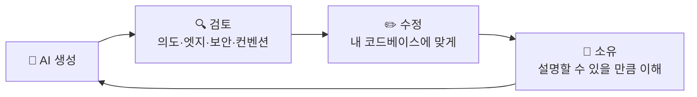
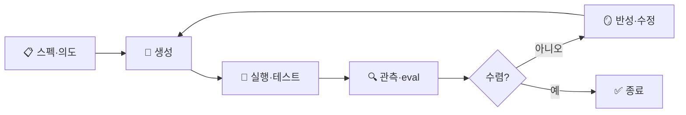

## Introduction

[바이브 코딩 너머 개발자 생존법](https://ebook-product.kyobobook.co.kr/dig/epd/ebook/E000012177517) 독서 기록이다. 이 책을 읽는 시점에서 Vibe Coding 은 이미 미래의 트렌드가 아니게 되었다. 전문 개발자 라면 Vibe Coding 을 넘어 Spec Driven Development 를 지향하고 있는 시점 이다. Vibe Coding 에 대한 다양한 시점과 의견도 궁금하지만, Agent coding 의 태동기인 지금 Vibe coding 이 어떻게 진화하는지 비교해보는 것도 좋을 것이다.

e-book 으로 읽었으며, 2026년 첫 책이다.

## 바이브 코딩

### 시작하며: 바이브 코딩은 무엇인가

- Andrej Karpathy 가 처음 사용한 용어로 사용자가 바라는 기능을 설명하는 프롬프트를 작성하면, LLM 이 남은 부분을 채워가는 코딩 방식.
- `Vibe Coding` 은 명확하고 체계적인 `AI 보조 엔지니어링` 에 비해 즉흥적이고 실험적인 방식.
- 어떻게 Vibe Coding 이 가능해졌을까?
  - 최신 coding agent 의 성능 향상
  - 코딩 워크플로에 모델을 원활하게 통합하는 새로운 개발자 툴 등장 (Cursor, Claude Code 등)

- 개발자들의 생산성을 크게 높여줄 수 있지만 잘못 쓰면 잠재적으로 버그나 위험요소를 내재할 수 있다.
- Vibe Coding 은 초기 계획 단계를 중요하게 여기지 않는 경향이 있다.

- Agent Coding 은 시작 단계에는 간결하더라도 반드시 계획을 수립해 제작할 항목과 제약 조건, 수용 기준 등을 명확하게 정의하는 것이 좋다.
  - 그리고 이러한 의견은 SDD 까지 이어지게 된다 ㅎㅎ
- AI 는 spec 에 제시된 제약 조건을 준수하며 창의력 발휘
- 결과는 spec 에 맞춰 개발한 MVP
- AI Engineering 과 Vibe Coding 의 목표를 잘 구분하여 활용하자.
- Vibe Coding 을 선택하는 이유들
  - 뜻밖의 결과를 경험하고 싶을 때
  - 낮선 라이브러리, 프로그래밍 기법 등
  - 불필요하고 지루하다고 생각되는 단계를 건너뛸 수 있음
- 마법은 실재하지만, 모든것을 해결해 주지 않는다.

#### 프롬프트: 지시에서 설명으로

- 모호한 프롬프트는 LLM 을 혼란에 빠지게 한다.
- 프롬프트 작성 능력 -> 새로운 프로그래밍 소양.
- Prompt: AI 는 수많은 언어와 코드를 학습해 얻은 통계적 패턴을 활용해 프롬프트의 의도를 `추론`한다.
- Context: AI 시스템은 한줄짜리 프롬프트에 의존하지 않는다. 다른 컨텍스트 정보를 함께 반영해 종합 판단.
- Generating Code: 모델이 사용자의 의도를 파악하거나 최선의 추정 마친 후 코드 생성.
  - 모델 내에서는 토큰을 하나씩 순차적으로 처리하며, 학습 과정에서 획득한 확률 정보를 토대로 이과정 수행.
- Human Supervisor 를 통한 검증: AI 는 배포를 대신하지 않으며 사람의 개입 필요.

#### 바이브 코딩의 이상적인 활용 사례

- 제로 투 원 프로덕트 개발
- 코드 통합
- 현대 프레임워크 활용
- 반복적인 코드 생성
- AI 보조 엔지니어링이 우선인 상황에서는 코드 생성기가 아닌 assistance 로 활용하는게 좋겠음.
  - 조직의 핵심 업무에 중대한 미션 크리티컬 시스템은 개발 초기부터 철저한 엔지니어링 원칙을 적용해야.

#### AI 가 여전히 어려움을 겪는 영역

- 매우 복잡한 시스템, 창의적인 디자인 등을 언급했으나, 2026년 1월 기준 쓸데없는 걱정이 되었다.
- 프롬프트의 모호함도 언급했는데, 이를 개선할 수 있는 다양한 도구와 표준 등이 논의 및 사용되고 있다. (github speckit 등)
- 다만 `과도한 의존에 따른 기술 퇴화` 영억은 나름 고민해볼만 한 부분이다.

### 프롬프트 작성의 비법: AI 와의 효과적인 소통법

- 프롬프트 엔지니어링 효과적으로 하는 방법은?
- AI 를 사이에 두고 자연어로 프로그래밍 하는 것. (AI Interpreter)

#### 프롬프트 어떻게 작성할까

- LLM 은 주어진 입력에만 반응하며 애매한 프롬프트에는 사용자의 지시와 관련 없는 결과를 제공할 수 있음.
- 주니어 개발자에게 세세한 지시를 정리한 문서처럼 작성
- 재현성을 확보하고 미래에 대비하기 위해 컨텍스트를 별도 저장하여 참고하도록 하기

## 실무에 AI 도입하기

> *아래부터는 책 목차(절 제목)를 바탕으로 내가 예상해서 정리한 메모다. 실제 독서 내용과 대조하며 다듬을 것.*

### 70% 문제: 효과적인 AI 보조 워크플로

- Addy Osmani 가 말한 그 유명한 `70% 문제`. AI 는 초안의 70% 를 순식간에 만들어 준다. 문제는 남은 30%.
- 그 30% 가 진짜 일이다: 엣지 케이스, 에러 처리, 프로덕션 하드닝, 디버깅, 통합. 정확히 시니어의 영역.
- 비개발자가 특히 이 벽에 부딪힌다. `two steps forward, two steps back` — 버그 하나 고치려다 새 버그를 만들고, 원인을 모른 채 빙빙 돈다.

- 효과적인 워크플로로 가는 법:
  - 작게 쪼개서 시킨다 (small, verifiable steps). 한 번에 거대한 요구를 던지지 않기.
  - 컨텍스트를 충분히 준다 — 관련 파일, 제약, 기대 동작, 예시.
  - 매 단계 검증(실행·테스트·리뷰) 후 다음으로. AI 는 운전자가 아니라 페어 파트너.
- 개인 메모: 결국 이 70/30 비율을 줄이는 방향이 SDD 다. 30% 의 고통을 스펙·수용 기준으로 앞단에 당겨오는 것.

### 70%를 넘어서: 인간 역할의 극대화

- 남은 30% 가 곧 인간의 자리다. AI 가 70% 를 자동화할수록, 사람의 가치는 `생성`에서 `판단·설계·검증`으로 이동한다.
- `knowledge paradox`: AI 는 경험 많은 개발자를 더 크게 돕는다. 무엇이 틀렸는지 알아보는 눈이 있어야 AI 의 결과를 걸러낼 수 있기 때문.
  - 역설적으로 주니어에겐 `crutch`(목발) 가 되어 성장을 정체시킬 위험이 있다. 모르고도 돌아가니까.
- 사람이 극대화해야 할 것: 문제 정의, 아키텍처 결정, 코드 리뷰·비판, 트레이드오프 판단, 도메인 지식.
- AI 를 `지렛대(leverage)` 로 쓰는 사람과 `의존(dependency)` 하는 사람의 격차는 점점 벌어진다. 이 책 제목의 "생존법" 이 가리키는 지점.

### 생성된 코드의 이해: 검토, 수정, 소유

- 핵심 원칙 한 줄: `trust but verify` → **검토(review) · 수정(modify) · 소유(own)**.
- 내가 이해하지 못하는 코드는 머지하지 않는다. AI 가 썼더라도 책임은 사람에게 남는다. "AI 가 짠 거라 몰라요" 는 변명이 안 된다.

- 리뷰 체크리스트: 의도대로 동작하나? 엣지 케이스는? 보안 구멍은? 성능은? 우리 컨벤션을 따르나? 환각된 API/라이브러리는 아닌가? 불필요하게 복잡하지 않나?
- `소유` 까지 가야 끝. 생성된 코드를 자기 것이라 말할 수 있을 만큼 읽고 다듬는다. 이건 [Testing-Refactoring Essential](/2026/06/19/testing-refactoring-essential-curriculum.html) 에서 다룬 "테스트로 감싸고 안전하게 다듬기" 와 같은 근육이다.

### AI 기반 프로토타입 제작: 툴 및 기법

- 프로토타이핑은 AI 의 가장 강력한 영역. 제로 투 원, 빠른 검증, 버려도 아깝지 않은 실험.
- 툴(책 시점 기준): `v0`, `bolt.new`, `Lovable`, `Claude Artifacts`, `Cursor` 등. 자연어 → 동작하는 UI 까지 분 단위.
- 기법:
  - 레퍼런스(이미지·와이어프레임·예시 화면)를 함께 준다.
  - 범위를 좁게 시작하고, 마음에 안 들면 빠르게 버리고 다시.
  - "동작하는 데모" 가 목표지 "프로덕션 코드" 가 목표가 아님을 분명히.
- 함정: **프로토타입은 프로덕션이 아니다.** 검증용으로 쓰고, 살릴 거면 다시 엔지니어링한다. 데모를 그대로 배포하려는 순간 70% 문제로 직행.

### AI 를 활용한 웹 어플리케이션 구축

- 실제 웹앱에서의 활용 패턴: 스캐폴딩, 컴포넌트 생성, API 연동 코드, 테스트 작성, 보일러플레이트 제거.
- AI 가 특히 강한 영역은 잘 학습된 생태계 — `React`, `Next.js`, `Tailwind` 처럼 레퍼런스가 방대한 스택.
- 주의 지점:
  - 인증·결제·데이터 처리 같은 민감 영역은 사람이 철저히 검토. 환각된 의존성·취약 패턴 주의.
  - 상태 관리, 컴포넌트 간 일관성, 전체 아키텍처는 여전히 사람의 설계 몫. AI 는 조각을 잘 만들지만 전체 정합성은 책임지지 않는다.
- 개인 메모: "조각 생성은 AI, 통합·일관성은 사람" 이라는 분업이 핵심.

## 신뢰와 자율성

### 보안, 신뢰성, 유지보수성

- AI 생성 코드의 보안 리스크:
  - 알려진 취약 패턴 재생산 (SQL injection, XSS 등), 하드코딩된 시크릿, 부실한 입력 검증.
  - 오래되거나 취약한 의존성 추천, 그리고 환각된 패키지명을 노린 `slopsquatting` 위험.
- 신뢰성: 엣지 케이스·에러 처리를 빼먹는 경향. 테스트로 방어선을 친다.
- 유지보수성: 일관성 없는 스타일, 과한 추상화/중복, 맥락 없는 코드가 쌓이면 그대로 기술 부채.
- 대응책: 보안 린팅/SAST, 의존성 스캔, 테스트 커버리지, 그리고 사람이 지키는 코드 리뷰 게이트. 고전 엔지니어링 원칙([Architecture](/2026/06/19/architecture-essential-curriculum.html)·테스트)이 AI 시대에 오히려 더 중요해진다.

### 바이브 코딩의 윤리적 쟁점

- 학습 데이터·라이선스: 생성 코드의 출처와 저작권이 모호하다. 카피레프트 코드가 섞여 들어올 가능성, 어트리뷰션 문제.
- 편향과 취약성의 확산: 학습 데이터의 나쁜 패턴이 그대로 재생산되어 퍼진다.
- 일자리·기술 격차: 주니어의 진입 경로가 좁아지고, 성장 사다리가 흔들린다.
- 책임 소재: AI 가 만든 버그·사고의 책임은 누구에게? 결론은 늘 같다 — **배포 버튼을 누른 사람.**

### 백그라운드 코딩 에이전트

- 동기식 페어링을 넘어 **비동기 에이전트** 로. 이슈를 던지면 백그라운드에서 브랜치를 만들고 PR 까지 올린다 (Claude Code background, Devin 류, Copilot agent 등).
- 여러 작업을 병렬로 돌리는 `fleet`/오케스트레이션. 사람은 코더가 아니라 **리뷰어·오케스트레이터** 가 된다.
- 자율성이 커질수록 거버넌스가 핵심: 권한 경계, PR 게이트, 검증 루프. 마침 같은 위키의 [내 홈랩 AI Dev Platform](/2026/06/19/homelab-ai-dev-platform.html) 글이 이 "경계 설계 + 사람 머지" 를 구체적 셋업으로 보여준다.
- 신뢰 없이는 자율도 없다 — [신뢰할 수 있는 Agentic AI 시스템](/2026/06/19/reliable-agentic-ai-systems.html) 이 말한 harness engineering 과 같은 이야기.

### 코드 생성을 넘어서: AI 보조 엔지니어링이 나아갈 미래

- 진화의 방향: `vibe coding` → `AI-assisted engineering` → `spec-driven development`.
- 스펙·계획·수용 기준을 앞단에 두는 흐름(SDD, GitHub Spec Kit 등). 즉흥에서 규율로.
- AI 는 코드 생성기를 넘어 설계·테스트·리뷰·운영 전반의 파트너로 확장된다.
- 개발자의 정체성도 이동한다: "코드를 치는 사람" 에서 "의도를 설계하고 에이전트를 지휘하는 사람" 으로.
- 마무리 메모: 이 책의 메시지를 한 줄로 압축하면 — **바이브 코딩은 출발점이고, 생존법은 그 너머의 엔지니어링 규율이다.** 마법은 실재하지만, 마법만으로는 프로덕션을 책임질 수 없다.

## 덧붙임 (본문 외): SDD 다음은 `loop engineering`?

> *여기서부터는 책 내용이 아니라, 다 읽고 난 뒤의 내 생각이다.*

이 책은 `vibe coding → AI-assisted engineering → SDD` 로 이어지는 흐름을 그린다. 그런데 SDD 가 자리를 잡고 나면 그 다음은 뭘까? 나는 **`loop engineering`(루프 엔지니어링)** 이 다음 트렌드가 될 거라고 본다.

- SDD 가 **"무엇을 만들지" 입력(스펙)을 정밀화**하는 일이라면, loop engineering 은 **"어떻게 반복해서 수렴시킬지" 과정(루프)을 설계**하는 일이다.
- 에이전트가 한 번의 생성으로 끝나지 않고 길게 자율적으로 돌수록, 진짜 레버리지는 프롬프트 한 줄이 아니라 `생성 → 실행·테스트 → 관측 → 반성 → 수정` 으로 도는 루프 자체를 어떻게 짜느냐에서 나온다.

- 루프를 설계할 때 던져야 할 질문들:
  - **종료 조건(stopping criteria)**: 루프를 언제 멈추나? 수렴 판정, 테스트 통과, eval 점수 임계값.
  - **피드백 신호**: 무엇을 다시 물리나? — 테스트 결과, CI 로그, eval, 린트. 핵심은 *기계가 읽을 수 있는* 신호여야 한다는 점. ([내 홈랩 AI Dev Platform](/2026/06/19/homelab-ai-dev-platform.html) 글이 한계로 짚은 "CI 로그를 API 로 못 읽는다" 가 정확히 이 지점이다.)
  - **가드레일**: 루프가 발산하지 않게 — 재시도 한계, 토큰·비용 예산, 사람 개입 지점.
  - **관측성**: 각 반복의 trace 를 남겨 어디서 틀어졌는지 디버깅 가능하게.
- 사람의 역할도 한 번 더 이동한다. `스펙 작성자` → `루프 설계자·감독자`. 무엇을 만들지를 적는 것을 넘어, 루프의 조건과 경계를 설계하는 일로.
- 사실 앞서 정리한 [신뢰할 수 있는 Agentic AI 시스템](/2026/06/19/reliable-agentic-ai-systems.html) 의 harness engineering(상태 영속화·실패 복구·세 종류의 reflection·eval)이 이미 loop engineering 의 초기 형태다. SDD 가 입력을 잡았다면, 이쪽은 *루프를 잡는다.*

한 줄 정리: **SDD 가 "정확한 한 번" 을 위한 것이라면, loop engineering 은 "수렴하는 여러 번" 을 위한 것이다.**

> *덧붙임의 덧붙임*: 이건 내 추측이었는데, 마침 이 책의 저자 Addy Osmani 가 같은 키워드로 글을 썼다 — [Loop Engineering 정리](/2026/06/19/loop-engineering.html). 추측이 현장의 언어로 어떻게 정리되는지 거기서 대조해 볼 수 있다.
