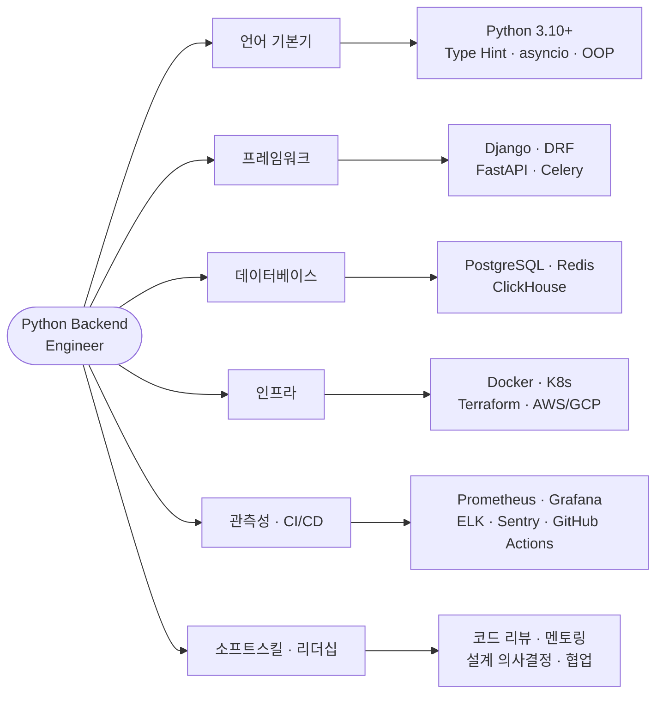

<figure class="post-figure post-figure--header">
<svg role="img" aria-label="Python Backend Engineer 직무 기술서를 한 장으로 요약한 그림. 왼쪽에는 Junior에서 Mid, Senior, Lead로 한 단씩 올라가는 네 칸짜리 성장 계단이 있고 각 칸 위에 역할 초점(기능 구현, 서비스 운영, 시스템 설계, 기술 전략)이 적혀 있다. 오른쪽에는 직무가 요구하는 역량을 쌓아 올린 탑이 있는데, 아래에서 위로 언어 기본기, 프레임워크와 DB, 인프라와 운영, 그리고 꼭대기에 리더십·소프트스킬이 놓여 있다." viewBox="0 0 680 300" xmlns="http://www.w3.org/2000/svg">
  <title>Python Backend Engineer 직무 기술서 — 레벨 성장 계단(Junior→Lead)과 요구 역량 스택</title>

  <!-- ===== LEFT: level growth staircase ===== -->
  <text x="176" y="24" text-anchor="middle" font-size="12" fill="currentColor" font-weight="700" opacity="0.75">레벨 성장 계단</text>

  <!-- Junior -->
  <rect x="40" y="206" width="76" height="48" rx="3" fill="var(--bg-light)" stroke="currentColor" stroke-width="1.8"/>
  <text x="78" y="227" text-anchor="middle" font-size="10" fill="currentColor" font-weight="700">Junior</text>
  <text x="78" y="242" text-anchor="middle" font-size="8" fill="currentColor" opacity="0.8">기능 구현</text>

  <!-- Mid -->
  <rect x="116" y="166" width="76" height="88" rx="3" fill="var(--bg-light)" stroke="currentColor" stroke-width="1.8"/>
  <text x="154" y="187" text-anchor="middle" font-size="10" fill="currentColor" font-weight="700">Mid</text>
  <text x="154" y="202" text-anchor="middle" font-size="8" fill="currentColor" opacity="0.8">서비스 운영</text>

  <!-- Senior -->
  <rect x="192" y="126" width="76" height="128" rx="3" fill="var(--bg-light)" stroke="var(--accent-color)" stroke-width="2"/>
  <text x="230" y="147" text-anchor="middle" font-size="10" fill="currentColor" font-weight="700">Senior</text>
  <text x="230" y="162" text-anchor="middle" font-size="8" fill="currentColor" opacity="0.8">시스템 설계</text>

  <!-- Lead -->
  <rect x="268" y="86" width="76" height="168" rx="3" fill="var(--bg-panel)" stroke="var(--gold)" stroke-width="2.5"/>
  <text x="306" y="107" text-anchor="middle" font-size="10" fill="currentColor" font-weight="700">Lead</text>
  <text x="306" y="122" text-anchor="middle" font-size="8" fill="currentColor" opacity="0.8">기술 전략</text>

  <!-- rising arrows between steps -->
  <line x1="118" y1="200" x2="132" y2="180" stroke="var(--secondary-color)" stroke-width="2" marker-end="url(#jd-arrow)"/>
  <line x1="194" y1="160" x2="208" y2="140" stroke="var(--secondary-color)" stroke-width="2" marker-end="url(#jd-arrow)"/>
  <line x1="270" y1="120" x2="284" y2="100" stroke="var(--secondary-color)" stroke-width="2" marker-end="url(#jd-arrow)"/>
  <text x="176" y="276" text-anchor="middle" font-size="9.5" fill="currentColor" opacity="0.8" font-weight="700">책임 범위가 한 단씩 ↑</text>

  <!-- divider -->
  <line x1="396" y1="40" x2="396" y2="262" stroke="currentColor" stroke-width="1" opacity="0.25"/>

  <!-- ===== RIGHT: competency stack tower ===== -->
  <text x="540" y="24" text-anchor="middle" font-size="12" fill="currentColor" font-weight="700" opacity="0.75">요구 역량 스택</text>

  <!-- top: leadership / soft skills -->
  <rect x="446" y="48" width="188" height="36" rx="3" fill="var(--bg-panel)" stroke="var(--gold)" stroke-width="2.5"/>
  <text x="540" y="64" text-anchor="middle" font-size="9.5" fill="currentColor" font-weight="700">리더십 · 소프트스킬</text>
  <text x="540" y="77" text-anchor="middle" font-size="7.5" fill="currentColor" opacity="0.8">멘토링 · 의사결정 · 커뮤니케이션</text>

  <!-- infra / ops -->
  <rect x="446" y="90" width="188" height="36" rx="3" fill="var(--bg-light)" stroke="var(--accent-color)" stroke-width="2"/>
  <text x="540" y="106" text-anchor="middle" font-size="9.5" fill="currentColor" font-weight="700">인프라 · 운영</text>
  <text x="540" y="119" text-anchor="middle" font-size="7.5" fill="currentColor" opacity="0.8">Docker · K8s · CI/CD · 관측성</text>

  <!-- framework / db -->
  <rect x="446" y="132" width="188" height="36" rx="3" fill="var(--bg-light)" stroke="currentColor" stroke-width="1.8"/>
  <text x="540" y="148" text-anchor="middle" font-size="9.5" fill="currentColor" font-weight="700">프레임워크 · DB</text>
  <text x="540" y="161" text-anchor="middle" font-size="7.5" fill="currentColor" opacity="0.8">Django · FastAPI · PostgreSQL · Redis</text>

  <!-- base: language fundamentals -->
  <rect x="446" y="174" width="188" height="40" rx="3" fill="var(--bg-light)" stroke="currentColor" stroke-width="1.8"/>
  <text x="540" y="192" text-anchor="middle" font-size="9.5" fill="currentColor" font-weight="700">언어 기본기</text>
  <text x="540" y="205" text-anchor="middle" font-size="7.5" fill="currentColor" opacity="0.8">Python · Type Hint · asyncio · OOP</text>

  <!-- foundation label -->
  <line x1="446" y1="222" x2="634" y2="222" stroke="currentColor" stroke-width="1" opacity="0.3"/>
  <text x="540" y="276" text-anchor="middle" font-size="9.5" fill="currentColor" opacity="0.8" font-weight="700">기본기 위에 역량을 쌓아 올림</text>

  <defs>
    <marker id="jd-arrow" markerWidth="8" markerHeight="8" refX="6" refY="4" orient="auto">
      <path d="M0,0 L8,4 L0,8 z" fill="var(--secondary-color)"/>
    </marker>
  </defs>
</svg>
<figcaption>이 직무 기술서의 한 장 요약 — 왼쪽은 <strong>레벨 성장 계단</strong>(Junior→Mid→Senior→Lead로 책임 범위가 한 단씩 넓어지며 초점이 기능 구현에서 기술 전략으로 이동), 오른쪽은 <strong>요구 역량 스택</strong>(언어 기본기를 토대로 프레임워크·DB, 인프라·운영, 그리고 리더십·소프트스킬을 쌓아 올림). 아래로 갈수록 모든 레벨의 공통 토대, 위로 갈수록 상위 레벨에서 두드러지는 역량입니다.</figcaption>
</figure>

## 🧩 Python Backend Engineer — 직무 기술서 (Job Description)

## 🧠 개요 (Overview)

Python Backend Engineer는 Python 기반의 서버 애플리케이션과 API 서비스를 설계·구현·운영하는 역할을 담당합니다.
비즈니스 로직을 안정적으로 전달하기 위해 도메인 설계, 데이터베이스 최적화, 인프라 자동화, 성능 및 보안 관리를 수행하며,
조직의 기술 방향과 품질 기준을 이끌어갑니다.

## ⚙️ 공통 기술 스택 (Common Tech Stack)

- **언어**: Python (3.10+), Type Hint, asyncio
- **프레임워크**: Django, DRF, FastAPI, Celery
- **데이터베이스**: PostgreSQL, Redis, ClickHouse
- **인프라**: Docker, Kubernetes(EKS/ECS), Terraform, AWS/GCP
- **관측성**: Prometheus, Grafana, ELK, Sentry
- **CI/CD**: GitHub Actions, ArgoCD, Jenkins
- **기타**: REST/GraphQL, gRPC, OAuth2, OpenAPI, pytest

### 🗺️ 한눈에 보기 (역량 카테고리 맵)

위 기술 스택을 직무가 요구하는 **여섯 가지 역량 카테고리**로 묶으면 이렇게 정리됩니다. 아래 레벨별 책임은 결국 이 카테고리들을 얼마나 깊고 넓게 다루느냐의 차이입니다.

## 🧩 레벨별 역할 및 책임 (Role & Responsibility by Level)

### 1. Junior Backend Engineer (1–3년차)

**Focus**: 기능 구현 중심 / 코드 품질 및 기본기 확립

**주요 업무**

- Django/FastAPI 기반 API 및 비즈니스 로직 구현
- ORM, Serializer, Viewset 등 기본 구성요소 작성
- pytest 기반 단위 테스트 및 간단한 CI 파이프라인 유지
- RESTful API 및 DB schema 설계 보조
- 코드 리뷰 피드백 반영 및 문서화 참여

**핵심 역량**

- Python 문법 및 OOP 구조 이해
- ORM, 쿼리, 캐시 등의 기본 원리 숙지
- Git, Docker, REST API 등 개발 표준 도구 활용
- 팀 내 협업 및 커뮤니케이션 기본 역량

### 2. Mid Backend Engineer (3–6년차)

**Focus**: 시스템 통합 / 안정적 서비스 운영 / 기술적 자율성 확보

**주요 업무**

- 서비스 모듈 단위 아키텍처 설계 및 개선
- Django/FastAPI + Celery 기반의 비동기 Job 구성
- PostgreSQL 성능 최적화 및 인덱스 설계
- CI/CD 파이프라인 자동화, 환경별 배포 관리
- Prometheus/Sentry 기반 로그·메트릭 수집 및 장애 대응
- 주니어 리뷰 및 기술적 가이드 제공

**핵심 역량**

- 비즈니스 요구사항을 구조화하여 설계로 전환
- ORM 최적화 및 쿼리 플랜 분석
- RESTful 표준 설계, 인증/인가 구조 이해
- AWS/GCP 환경에서의 서비스 운영 경험

### 3. Senior Backend Engineer (6–10년차)

**Focus**: 시스템 설계 / 성능 최적화 / 기술 리더십

**주요 업무**

- 대규모 트래픽 환경에서의 서버 아키텍처 설계
- DDD, CQRS 기반의 도메인 중심 설계 주도
- 비동기 Job Orchestration (Celery/Ray/Kafka 등) 설계 및 운영
- Observability 체계 수립 및 성능 병목 제거
- Multi-tenant 및 Plugin 기반 아키텍처 설계
- 주니어·미드 레벨 기술 멘토링 및 리뷰 리드
- 기술 의사결정 및 표준화 문서(ADR, RFC) 작성

**핵심 역량**

- 서비스 전체 구조를 이해하고 trade-off 판단 가능
- PostgreSQL internals, WAL, Replication, PITR 이해
- Kubernetes, Helm, Terraform을 통한 Infra 관리
- DDD, Event Driven, Microservice 설계 경험
- 조직 내 기술 품질 기준 수립 및 리더십 발휘

### 4. Lead Backend Engineer (10년차 이상)

**Focus**: 기술 전략 / 조직적 영향력 / 품질과 성장의 문화화

**주요 업무**

- 서비스 전반의 기술 방향 및 백엔드 로드맵 수립
- 대규모 시스템 설계 (Resilience, Scalability, Fault-tolerance)
- 플랫폼 단위 구조 설계 (Plugin System, Multi-tenant Framework 등)
- 기술 의사결정 리뷰, 성능/보안/품질 표준화 주도
- Backend Chapter 운영, OKR 설정 및 성장 코칭
- 사내 기술 브랜딩, 기술 세션 주관, 외부 컨퍼런스 발표

**핵심 역량**

- SLA/SLO 기반 시스템 설계 및 거버넌스 관리
- 복잡한 도메인의 Context Mapping 및 Boundary 설계
- 기술 리스크 관리 및 조직적 학습 구조화
- 기술·조직 간 Alignment 리딩 및 커뮤니케이션 리더십
- 기업 기술 전략 수립 및 실천 능력

## 📈 성장 경로 (Career Progression)

| 단계          | 역할 초점                 | 전환 목표                          |
| ------------- | ------------------------- | ---------------------------------- |
| Junior → Mid  | 코드 품질 → 서비스 운영   | 기능 단위 책임 수행 및 자율적 개발 |
| Mid → Senior  | 운영 효율화 → 시스템 설계 | 구조적 사고와 기술적 의사결정 참여 |
| Senior → Lead | 기술 설계 → 기술 전략     | 조직 내 기술 리더십과 영향력 확장  |

## 🧭 평가 항목 (Performance Dimensions)

| 카테고리       | 주요 지표 (KPI / 지표 예시)                    |
| -------------- | ---------------------------------------------- |
| 기술 품질      | 코드 리뷰 통과율, 버그 발생률, 테스트 커버리지 |
| 운영 안정성    | 장애 MTTR, 성능 SLA 충족률                     |
| 생산성         | 기능 릴리즈 속도, PR 처리 시간                 |
| 협업 및 리더십 | 리뷰 참여도, 멘토링 세션, 기술 공유 세션       |
| 지식 성장      | 신기술 도입 제안, 기술문서 작성 수, 발표 참여  |

## 🧩 역할 가치 (Role Impact)

- **Junior**: 팀의 실행력을 보강하고, 코드 품질 향상에 기여
- **Mid**: 서비스 안정성과 유지보수성 확보
- **Senior**: 시스템의 확장성과 기술 품질의 기준 확립
- **Lead**: 기술 전략과 조직 성장을 동시에 리딩

## 💬 비전 문구 (Role Vision Statement)

"우리는 코드 한 줄로 비즈니스의 신뢰를 만들고,
구조 한 단계로 조직의 확장성을 설계한다."

— Python Backend Chapter Vision
