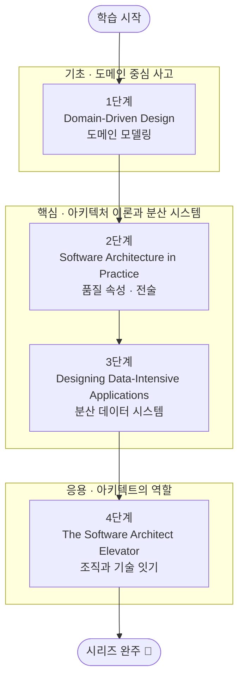

## 소개

소프트웨어 아키텍처는 단순히 "큰 그림을 그리는 일"이 아닙니다. 시스템의 변경 비용, 확장 가능성, 신뢰성, 그리고 팀이 함께 일하는 방식까지 결정하는, 코드보다 더 오래 살아남는 의사결정의 집합입니다. 기능은 언제든 다시 만들 수 있지만, 잘못된 아키텍처 결정은 수년간 조직 전체를 발목 잡습니다. 그래서 시니어로 성장하려는 엔지니어에게 아키텍처적 사고는 선택이 아니라 필수 역량입니다.

이 시리즈는 검증된 4권의 고전을 뼈대로 삼습니다. 도메인 중심 사고를 정립하는 Eric Evans의 *Domain-Driven Design*, 아키텍처를 학문으로 체계화한 Bass·Clements·Kazman의 *Software Architecture in Practice*, 현대 분산 데이터 시스템의 교과서인 Martin Kleppmann의 *Designing Data-Intensive Applications*, 그리고 기술과 조직을 잇는 아키텍트의 역할을 다룬 Gregor Hohpe의 *The Software Architect Elevator* 입니다. 각 책이 하나의 단계가 되어, 기초 → 핵심 → 응용으로 자연스럽게 이어집니다.

이 글은 `Architecture-Essential` 시리즈의 **마스터 로드맵**입니다. 각 단계의 핵심 항목을 정복할 때마다 체크박스를 채우고 상세 포스트를 연결하는 **도장깨기** 방식으로 진행하며, 학습이 진행될 때마다 진행률을 갱신합니다.

## 학습 흐름

4단계는 아래 순서대로 진행하는 것을 권장합니다. **기초**(도메인 중심 사고)로 문제 공간을 보는 눈을 기르고, **핵심**(아키텍처 이론·분산 시스템 실전)으로 설계 역량을 정복한 뒤, **응용**(아키텍트의 역할·소프트스킬)으로 기술과 조직을 잇는 단계로 마무리합니다.

## 학습 진행 현황

> 완료한 항목에는 상세 포스트 링크가 연결됩니다. 학습이 진행될 때마다 체크박스와 진행률을 갱신합니다.

- 현재 완료한 항목: **21개**
- 전체 항목: **21개**
- 진행률: **100%** 🎉

## 1단계: Domain-Driven Design — 도메인 중심 사고

Eric Evans의 *Domain-Driven Design: Tackling Complexity in the Heart of Software* 는 소프트웨어의 복잡성이 기술이 아니라 **도메인**에 있다고 선언하며, 도메인을 코드로 옮기는 사고법을 정립한 책입니다. 모든 아키텍처 결정의 출발점인 "무엇을 만드는가"에 대한 언어와 모델을 다룹니다.

- [x] **유비쿼터스 언어 (Ubiquitous Language)**: 개발자와 도메인 전문가가 공유하는 단일 언어를 코드·대화·문서에 일관되게 사용 — [[상세](/2026/06/19/domain-driven-design.html)]
- [x] **도메인 모델 (Domain Model)**: 엔티티(Entity)·값 객체(Value Object)·애그리거트(Aggregate)로 도메인 지식을 구조화 — [[상세](/2026/06/19/domain-driven-design.html)]
- [x] **바운디드 컨텍스트 (Bounded Context)**: 모델이 유효한 경계를 명확히 긋고 컨텍스트 간 관계를 정의 — [[상세](/2026/06/19/domain-driven-design.html)]
- [x] **컨텍스트 맵 (Context Map)**: 여러 바운디드 컨텍스트의 통합 패턴(Shared Kernel, ACL 등)을 지도로 표현 — [[상세](/2026/06/19/domain-driven-design.html)]
- [x] **전술적 설계 (Tactical Design)**: Repository·Factory·Domain Service로 모델의 무결성을 유지 — [[상세](/2026/06/19/domain-driven-design.html)]

## 2단계: Software Architecture in Practice — 아키텍처 이론과 품질 속성

Bass·Clements·Kazman의 *Software Architecture in Practice, 4th ed.* 는 아키텍처를 직관이 아닌 **공학**으로 다룹니다. "좋은 아키텍처"를 측정 가능한 품질 속성으로 정의하고, 이를 달성하는 전술(Tactics)을 체계적으로 제시합니다.

- [x] **품질 속성 (Quality Attributes)**: 가용성·성능·보안·수정 가능성 등 비기능 요구사항을 1차 시민으로 다루기 — [[상세](/2026/06/19/software-architecture-in-practice.html)]
- [x] **품질 속성 시나리오 (QA Scenarios)**: 자극·응답·측정으로 요구사항을 정량적이고 검증 가능하게 기술 — [[상세](/2026/06/19/software-architecture-in-practice.html)]
- [x] **아키텍처 전술 (Tactics)**: 각 품질 속성을 달성하기 위한 설계 결정 카탈로그 활용 — [[상세](/2026/06/19/software-architecture-in-practice.html)]
- [x] **아키텍처 패턴 (Architectural Patterns)**: Layered·Microservices·Event-Driven 등 패턴과 전술의 관계 — [[상세](/2026/06/19/software-architecture-in-practice.html)]
- [x] **아키텍처 평가 (ATAM)**: 트레이드오프 분석으로 설계 위험을 조기에 식별하기 — [[상세](/2026/06/19/software-architecture-in-practice.html)]
- [x] **아키텍처 문서화 (Views & Beyond)**: 이해관계자별 관점(View)으로 아키텍처를 소통 가능하게 기록 — [[상세](/2026/06/19/software-architecture-in-practice.html)]

## 3단계: Designing Data-Intensive Applications — 분산 데이터 시스템 실전

Martin Kleppmann의 *Designing Data-Intensive Applications* 는 현대 백엔드 아키텍처의 핵심인 분산 데이터 시스템을 신뢰성·확장성·유지보수성이라는 세 축으로 꿰뚫습니다. 이론과 실제 시스템의 동작을 잇는 가장 실전적인 교과서입니다.

- [x] **세 가지 관심사**: 신뢰성(Reliability)·확장성(Scalability)·유지보수성(Maintainability)의 의미와 트레이드오프 — [[상세](/2026/06/19/designing-data-intensive-applications.html)]
- [x] **데이터 모델과 스토리지 엔진**: 관계형·문서·그래프 모델, LSM-Tree와 B-Tree의 차이 — [[상세](/2026/06/19/designing-data-intensive-applications.html)]
- [x] **복제와 파티셔닝 (Replication & Partitioning)**: 단일 리더·다중 리더·리더리스 복제와 샤딩 전략 — [[상세](/2026/06/19/designing-data-intensive-applications.html)]
- [x] **트랜잭션과 격리 수준 (Transactions)**: ACID의 실제 의미, 격리 수준과 동시성 이상 현상 — [[상세](/2026/06/19/designing-data-intensive-applications.html)]
- [x] **분산 시스템의 난제**: 부분 실패, 시계 문제, 합의(Consensus)와 CAP 정리 — [[상세](/2026/06/19/designing-data-intensive-applications.html)]
- [x] **배치와 스트림 처리 (Batch & Stream)**: 데이터 통합과 이벤트 기반 아키텍처의 기초 — [[상세](/2026/06/19/designing-data-intensive-applications.html)]

## 4단계: The Software Architect Elevator — 아키텍트의 역할과 소프트스킬

Gregor Hohpe의 *The Software Architect Elevator* 는 아키텍트가 임원실(비즈니스)과 기계실(코드) 사이의 "엘리베이터"를 오르내리며 양쪽을 잇는 존재임을 강조합니다. 기술 역량만으로는 채울 수 없는 아키텍트의 조직적·전략적 역할을 다룹니다.

- [x] **아키텍트 엘리베이터 (The Elevator)**: 비즈니스 전략과 기술 구현을 오가며 양쪽을 통역하는 역할 — [[상세](/2026/06/19/software-architect-elevator.html)]
- [x] **의사결정과 트레이드오프 소통**: 옵션을 제시하고 결정의 근거와 비용을 이해관계자에게 설명하기 — [[상세](/2026/06/19/software-architect-elevator.html)]
- [x] **조직과 아키텍처 (Conway의 법칙)**: 시스템 구조와 조직 구조의 상호작용을 설계에 반영 — [[상세](/2026/06/19/software-architect-elevator.html)]
- [x] **기술 리더십과 변화 주도**: 표준·플랫폼·문화를 통해 조직의 엔지니어링 수준을 끌어올리기 — [[상세](/2026/06/19/software-architect-elevator.html)]

## 핵심 포인트

- **순서가 곧 사고의 토대입니다**: 도메인을 먼저 이해(1단계)해야 무엇을 위한 아키텍처인지 알 수 있습니다. 문제 공간을 건너뛴 설계는 정교한 오답이 됩니다.
- **품질 속성으로 말하세요**: "좋은 아키텍처"는 모호한 직관이 아니라 가용성·성능·수정 가능성 같은 측정 가능한 목표로 정의되어야 합니다.
- **분산은 트레이드오프의 연속입니다**: 확장성을 얻으면 일관성·복잡성의 대가를 치릅니다. 정답이 아니라 합리적 선택을 찾는 훈련을 하세요.
- **아키텍처는 결국 사람의 일입니다**: 가장 우아한 설계도 조직이 받아들이지 못하면 무의미합니다. 소통과 리더십은 기술만큼 중요한 역량입니다.
- **모든 단계는 서로를 보강합니다**: DDD의 바운디드 컨텍스트는 분산 시스템의 서비스 경계로, 품질 속성은 아키텍트의 의사결정 근거로 이어집니다.

## 추천 학습 순서

위에 제시한 1 → 2 → 3 → 4단계 순서를 권장합니다. 먼저 *Domain-Driven Design* 으로 "무엇을, 왜 만드는가"를 보는 도메인 중심 사고를 기릅니다. 이 토대가 있어야 이후의 설계 결정이 목적을 잃지 않습니다. 다음으로 *Software Architecture in Practice* 로 아키텍처를 품질 속성과 전술이라는 공학적 언어로 다루는 법을 익히고, 그 위에서 *Designing Data-Intensive Applications* 로 분산 데이터 시스템의 실전 트레이드오프를 체득합니다. 마지막으로 *The Software Architect Elevator* 로 기술 역량을 조직과 비즈니스에 연결하는 아키텍트의 소프트스킬을 완성합니다. 이론(2단계)과 실전(3단계)은 병행해도 좋지만, 도메인 사고(1단계)를 가장 먼저, 조직적 역할(4단계)을 가장 나중에 두는 흐름은 유지하길 권합니다.

## 결론

소프트웨어 아키텍처는 하루아침에 익힐 수 있는 기술이 아니라, 도메인을 읽는 눈·품질을 정의하는 언어·분산 시스템의 트레이드오프·조직을 움직이는 리더십이 겹겹이 쌓여 만들어지는 종합 역량입니다. 이 4권은 그 각각의 층을 단단히 다져 줄 검증된 안내서입니다.

이 커리큘럼을 나침반 삼아 한 단계씩 정복하고, 항목을 완료할 때마다 체크박스를 채우며 진행 상황을 시각적으로 확인해 보세요. 책을 읽는 데서 멈추지 말고, 실제 프로젝트의 경계를 다시 긋고 품질 시나리오를 작성하며 배운 것을 코드와 조직에 적용할 때 비로소 아키텍처적 사고가 체화됩니다.

### 다음 학습 (Next Learning)

- [OO-Design Essential Curriculum](/2026/06/19/oo-design-essential-curriculum.html) — 객체 설계 기초가 DDD·아키텍처의 토대
- [Process Essential Curriculum](/2026/06/19/process-essential-curriculum.html) — 아키텍처를 떠받치는 프로세스·요구사항
- [Testing-Refactoring Essential Curriculum](/2026/06/19/testing-refactoring-essential-curriculum.html) — 진화하는 아키텍처를 지키는 테스트·리팩터링
