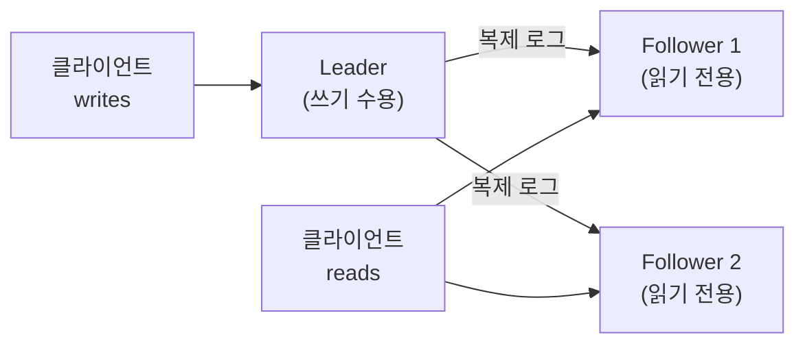
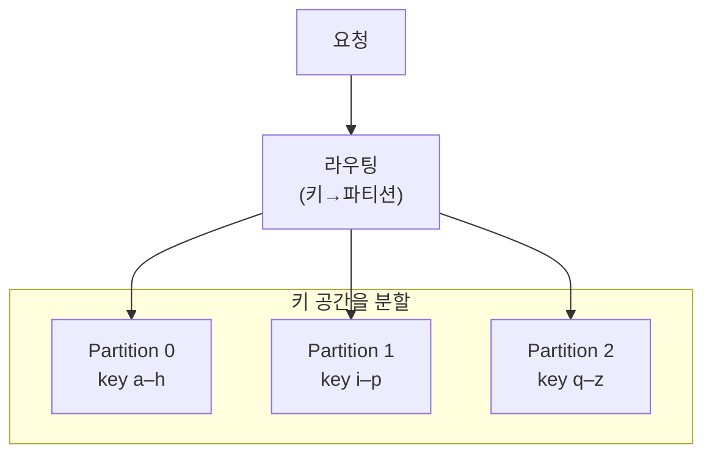
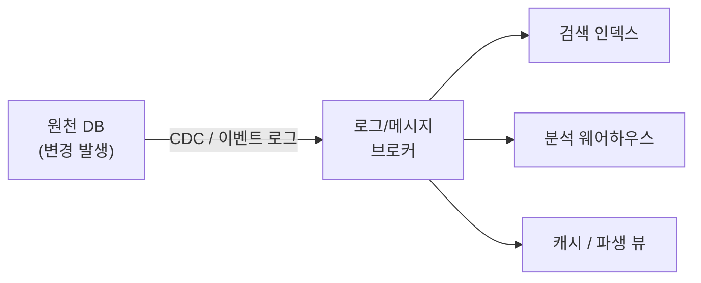

<figure class="post-figure post-figure--header">
<svg role="img" aria-label="DDIA의 척추를 한 장으로 묶은 그림. 맨 위에는 데이터 시스템을 평가하는 세 관심사 — 신뢰성, 확장성, 유지보수성 — 이 나란히 놓이고, 그 아래로 책이 다루는 메커니즘 계층(스토리지 엔진, 복제와 파티셔닝, 트랜잭션 격리, 합의와 CAP, 배치와 스트림)이 한 단씩 쌓인다. 모든 계층은 양쪽 끝의 두 저울추 — 일관성과 가용성 — 사이에서 트레이드오프로 저울질된다." viewBox="0 0 680 320" xmlns="http://www.w3.org/2000/svg">
  <title>DDIA의 척추 — 세 관심사(신뢰성·확장성·유지보수성)가 메커니즘 계층을 평가하고, 모든 결정은 일관성↔가용성 트레이드오프로 저울질된다</title>

  <!-- ===== TOP: three concerns ===== -->
  <text x="340" y="22" text-anchor="middle" font-size="12" fill="currentColor" font-weight="700" opacity="0.75">세 관심사 — 시스템의 "좋음"을 재는 축</text>
  <rect x="120" y="34" width="128" height="40" rx="3" fill="var(--bg-light)" stroke="var(--accent-color)" stroke-width="2"/>
  <text x="184" y="52" text-anchor="middle" font-size="11" fill="currentColor" font-weight="700">신뢰성</text>
  <text x="184" y="67" text-anchor="middle" font-size="7.5" fill="currentColor" opacity="0.8">fault-tolerant</text>
  <rect x="276" y="34" width="128" height="40" rx="3" fill="var(--bg-light)" stroke="var(--accent-color)" stroke-width="2"/>
  <text x="340" y="52" text-anchor="middle" font-size="11" fill="currentColor" font-weight="700">확장성</text>
  <text x="340" y="67" text-anchor="middle" font-size="7.5" fill="currentColor" opacity="0.8">p95·p99 부하 기술</text>
  <rect x="432" y="34" width="128" height="40" rx="3" fill="var(--bg-light)" stroke="var(--accent-color)" stroke-width="2"/>
  <text x="496" y="52" text-anchor="middle" font-size="11" fill="currentColor" font-weight="700">유지보수성</text>
  <text x="496" y="67" text-anchor="middle" font-size="7.5" fill="currentColor" opacity="0.8">운영·단순·진화</text>

  <!-- arrows: concerns evaluate the layers below -->
  <line x1="184" y1="76" x2="184" y2="96" stroke="var(--secondary-color)" stroke-width="2" marker-end="url(#ddia-arrow)"/>
  <line x1="340" y1="76" x2="340" y2="96" stroke="var(--secondary-color)" stroke-width="2" marker-end="url(#ddia-arrow)"/>
  <line x1="496" y1="76" x2="496" y2="96" stroke="var(--secondary-color)" stroke-width="2" marker-end="url(#ddia-arrow)"/>

  <!-- ===== MIDDLE: mechanism stack ===== -->
  <text x="340" y="113" text-anchor="middle" font-size="11" fill="currentColor" font-weight="700" opacity="0.7">메커니즘 계층 — 책이 트레이드오프로 푸는 것들</text>
  <g font-weight="700">
    <rect x="160" y="124" width="360" height="28" rx="3" fill="var(--bg-panel)" stroke="currentColor" stroke-width="1.8"/>
    <text x="340" y="142" text-anchor="middle" font-size="10" fill="currentColor">스토리지 엔진 — LSM-Tree ↔ B-Tree</text>
    <rect x="160" y="158" width="360" height="28" rx="3" fill="var(--bg-panel)" stroke="currentColor" stroke-width="1.8"/>
    <text x="340" y="176" text-anchor="middle" font-size="10" fill="currentColor">복제 · 파티셔닝 — 같은 데이터 ↔ 다른 데이터</text>
    <rect x="160" y="192" width="360" height="28" rx="3" fill="var(--bg-panel)" stroke="currentColor" stroke-width="1.8"/>
    <text x="340" y="210" text-anchor="middle" font-size="10" fill="currentColor">트랜잭션 격리 — 직렬성 비용 ↔ 허용 이상</text>
    <rect x="160" y="226" width="360" height="28" rx="3" fill="var(--bg-panel)" stroke="currentColor" stroke-width="1.8"/>
    <text x="340" y="244" text-anchor="middle" font-size="10" fill="currentColor">합의 · CAP — 부분 실패를 견디는 동의</text>
    <rect x="160" y="260" width="360" height="28" rx="3" fill="var(--bg-light)" stroke="var(--gold)" stroke-width="2"/>
    <text x="340" y="278" text-anchor="middle" font-size="10" fill="currentColor">배치 · 스트림 — 이벤트 로그가 진실의 원천</text>
  </g>

  <!-- ===== SIDES: the two weighing pans every decision swings between ===== -->
  <g font-weight="700">
    <rect x="20" y="160" width="118" height="92" rx="4" fill="var(--bg-panel)" stroke="var(--gold)" stroke-width="2"/>
    <text x="79" y="200" text-anchor="middle" font-size="12" fill="currentColor">일관성</text>
    <text x="79" y="218" text-anchor="middle" font-size="8" font-weight="400" fill="currentColor" opacity="0.8">Consistency</text>
    <rect x="542" y="160" width="118" height="92" rx="4" fill="var(--bg-panel)" stroke="var(--gold)" stroke-width="2"/>
    <text x="601" y="200" text-anchor="middle" font-size="12" fill="currentColor">가용성</text>
    <text x="601" y="218" text-anchor="middle" font-size="8" font-weight="400" fill="currentColor" opacity="0.8">Availability</text>
  </g>
  <!-- balance beam connecting the two pans through the stack -->
  <line x1="138" y1="206" x2="160" y2="206" stroke="var(--secondary-color)" stroke-width="2.5"/>
  <line x1="520" y1="206" x2="542" y2="206" stroke="var(--secondary-color)" stroke-width="2.5"/>
  <text x="340" y="306" text-anchor="middle" font-size="9.5" fill="currentColor" opacity="0.8" font-weight="700">모든 메커니즘은 일관성 ↔ 가용성 사이에서 저울질된다</text>

  <defs>
    <marker id="ddia-arrow" markerWidth="8" markerHeight="8" refX="6" refY="4" orient="auto">
      <path d="M0,0 L8,4 L0,8 z" fill="var(--secondary-color)"/>
    </marker>
  </defs>
</svg>
<figcaption>DDIA의 척추 한 장 요약 — 맨 위 <strong>세 관심사</strong>(신뢰성·확장성·유지보수성)가 시스템의 "좋음"을 재는 축이고, 그 아래 <strong>메커니즘 계층</strong>(스토리지 엔진 → 복제·파티셔닝 → 트랜잭션 격리 → 합의·CAP → 배치·스트림)이 차례로 쌓인다. 어느 결정이든 결국 양쪽의 두 저울추 <strong>일관성 ↔ 가용성</strong> 사이를 오가는 트레이드오프다.</figcaption>
</figure>

## 들어가며

이 글은 `Architecture-Essential` 시리즈의 **3단계**입니다. 전체 흐름은 [Architecture Essential Curriculum](/2026/06/19/architecture-essential-curriculum.html)에서 확인할 수 있습니다.

2단계 [Software Architecture in Practice: 품질 속성의 공학](/2026/06/19/software-architecture-in-practice.html)에서는 availability, scalability, performance 같은 품질 속성을 "측정 가능한 시나리오"로 다루는 법을 배웠습니다. 다만 그 단계는 다소 추상적이었습니다. "availability 99.99%를 만족하라"는 요구가 실제 시스템에서 무엇을 의미하는지 — 복제본을 몇 개 두고, 리더가 죽으면 누가 어떻게 승격하며, 그 사이 클라이언트가 보는 데이터는 일관적인지 — 는 데이터 계층의 구체적인 메커니즘을 알아야 답할 수 있습니다.

Martin Kleppmann의 *Designing Data-Intensive Applications*(이하 DDIA)는 바로 그 다리를 놓는 책입니다. 데이터베이스 내부 이론(스토리지 엔진, 트랜잭션, 합의 알고리즘)을 PostgreSQL·Cassandra·Kafka·ZooKeeper 같은 **실제 시스템**과 연결해 설명하기 때문에, 현대 백엔드 엔지니어의 정전(canon)으로 불립니다. 이 단계의 목표는 책을 요약하는 것이 아니라, 분산 데이터 시스템을 설계할 때 반복적으로 마주치는 **트레이드오프의 구조**를 손에 익히는 것입니다.

이 기술적 깊이를 갖추고 나면, 4단계 [The Software Architect Elevator: 아키텍트의 역할](/2026/06/19/software-architect-elevator.html)에서는 시선을 조직으로 돌립니다. 기술 판단을 조직의 의사결정으로 번역하는 일이 아키텍트의 본업이기 때문입니다.

<div class="post-summary-box" markdown="1">

### 📌 이 글에서 다루는 내용

#### 🔍 핵심 주제

- **세 가지 관심사**: 신뢰성·확장성·유지보수성의 의미와 서로 맞물린 트레이드오프
- **데이터 모델과 스토리지 엔진**: 관계형·문서·그래프 모델, LSM-Tree와 B-Tree의 구조적 차이
- **복제와 파티셔닝**: 단일 리더·다중 리더·리더리스 복제와 샤딩 전략의 선택 기준
- **트랜잭션과 격리 수준**: ACID의 실제 의미, 격리 수준별로 허용되는 동시성 이상 현상
- **분산 시스템의 난제**: 부분 실패, 신뢰할 수 없는 시계, 합의(Consensus)와 CAP 정리의 한계
- **배치와 스트림 처리**: 데이터 통합과 이벤트 기반 아키텍처의 기초

</div>

## 세 가지 관심사: Reliability, Scalability, Maintainability

왜 이 셋부터 시작할까요? 데이터 집약적 시스템의 "좋음"은 단일 지표로 잡히지 않기 때문입니다. DDIA는 모든 설계 판단을 이 세 축 위에서 본다는 공통 언어를 먼저 깝니다.

- **Reliability(신뢰성)**: 하드웨어 결함, 소프트웨어 버그, 사람의 실수가 있어도 시스템이 기대대로 동작하는 것. 핵심은 "결함(fault)은 일어난다"를 전제하고 **fault-tolerant**하게 만드는 것입니다. 결함이 시스템 전체 장애(failure)로 번지지 않게 격리합니다.
- **Scalability(확장성)**: 부하가 늘어도 성능을 유지하는 능력. 여기서 중요한 것은 부하와 성능을 **숫자로 기술**하는 것입니다. 평균 응답시간이 아니라 p95·p99 같은 백분위(percentile)로 봐야 tail latency가 드러납니다.
- **Maintainability(유지보수성)**: operability(운영 편의), simplicity(우발적 복잡도 제거), evolvability(변경 용이성). 시스템의 비용 대부분은 초기 개발이 아니라 **지속적 유지보수**에서 발생합니다.

트레이드오프는 명확합니다. 신뢰성을 위해 복제본을 늘리면 일관성 유지 비용과 운영 복잡도가 오르고(유지보수성 ↓), 확장을 위해 파티셔닝하면 트랜잭션 경계가 깨지며 신뢰성 보장이 어려워집니다. 2단계의 품질 속성 트레이드오프가 데이터 계층에서 구체적 형태로 나타나는 셈입니다.

## 데이터 모델과 스토리지 엔진

### 데이터 모델: 관계형 · 문서 · 그래프

왜 모델이 여럿일까요? 데이터 간 관계의 형태가 다르기 때문입니다. 모델 선택은 "내 데이터의 관계가 어떤 모양인가"라는 질문에 대한 답입니다.

| 모델 | 강점 | 약점 | 잘 맞는 형태 |
|---|---|---|---|
| 관계형(Relational) | 다대다(join) 처리, 강한 스키마 | 객체-관계 임피던스 불일치 | 정규화된 정형 데이터 |
| 문서(Document) | locality, 스키마 유연성 | join 취약, 깊은 중첩 갱신 비용 | 트리형 1:N, 자기완결 문서 |
| 그래프(Graph) | 복잡한 다대다, 가변 깊이 탐색 | 운영·쿼리 학습 곡선 | 소셜 그래프, 추천, 경로 |

문서 모델은 "schema-on-read", 관계형은 대체로 "schema-on-write"입니다. 데이터가 강하게 연결될수록 관계형/그래프가, 자기완결적 트리일수록 문서가 유리합니다.

### 스토리지 엔진: LSM-Tree vs B-Tree

모델 아래에는 디스크에 어떻게 읽고 쓰는지를 결정하는 스토리지 엔진이 있습니다. 두 계열의 차이는 **쓰기를 어디에 어떻게 쌓는가**에서 갈립니다.

| 구분 | LSM-Tree | B-Tree |
|---|---|---|
| 쓰기 방식 | append-only 로그 → SSTable, 백그라운드 compaction | 고정 크기 페이지 in-place 갱신 |
| 쓰기 성능 | 순차 쓰기로 높은 throughput | 페이지당 random write, WAL 동반 |
| 읽기 성능 | 여러 SSTable 탐색(블룸필터로 완화) | 페이지 추적으로 예측 가능 |
| 쓰기 증폭 | compaction 비용, 변동성 있음 | WAL + 페이지 쓰기로 상대적 안정 |
| 공간 효율 | 압축 좋음, 단편화 적음 | 페이지 단편화 가능 |
| 대표 사례 | RocksDB, Cassandra, LevelDB | PostgreSQL, MySQL(InnoDB) |

```sql
-- B-Tree: 인덱스 페이지를 제자리에서 갱신 (random I/O)
UPDATE accounts SET balance = balance - 100 WHERE id = 42;

-- LSM-Tree: 갱신도 새 키-값을 로그에 append, 이후 compaction이 옛 값을 정리
-- → 쓰기는 순차적이지만 읽기 시 여러 세그먼트를 병합 조회
```

규칙처럼 외울 점: **쓰기가 많으면 LSM, 읽기가 많고 예측 가능한 지연이 중요하면 B-Tree**가 기본 출발점입니다. 다만 compaction 튜닝(LSM)이나 페이지 분할 비용(B-Tree)처럼 운영상의 함정은 각자 다릅니다.

## 복제와 파티셔닝

### 복제(Replication): 같은 데이터를 여러 노드에

복제는 availability(노드가 죽어도 서비스 지속), latency(사용자 근처에서 읽기), read scalability를 위해 합니다. 핵심 트레이드오프는 **쓰기를 어디서 받느냐**입니다.



| 방식 | 쓰기 처리 | 장점 | 대가 |
|---|---|---|---|
| 단일 리더(Single-leader) | 리더 한 곳만 | 쓰기 충돌 없음, 단순 | 리더 장애 시 failover, 쓰기 SPOF |
| 다중 리더(Multi-leader) | 여러 리더 | 멀티 DC, 오프라인 쓰기 | 쓰기 충돌 → conflict resolution 필요 |
| 리더리스(Leaderless) | 모든 복제본 | 높은 가용성, 무중단 | quorum 읽기/쓰기, read repair, 최종 일관성 |

복제는 동기/비동기 선택도 따라옵니다. 동기 복제는 강한 내구성을 주지만 한 노드만 느려도 전체 쓰기가 막힙니다. 그래서 현실은 보통 **반동기(semi-synchronous)** — 한두 개 follower만 동기로 둡니다. 비동기 복제에서는 복제 지연(replication lag)으로 "내가 방금 쓴 글이 안 보이는" read-your-writes 위반이 생기므로, 읽기 일관성 보장이 별도 과제가 됩니다.

복제 지연이 왜 위험한지, 한 사용자의 쓰기와 읽기를 시간 축에 펼쳐 보면 또렷해집니다.

<figure class="post-figure">
<svg role="img" aria-label="비동기 복제의 read-your-writes 위반을 시간 축으로 그린 그림. 위쪽 가로선은 리더로, 사용자가 시각 t1에 글을 쓰면 그 값이 곧바로 반영된다. 아래쪽 가로선은 비동기 팔로워로, 복제 로그가 지연되어 도착하므로 t1과 t2 사이의 구간에서는 아직 옛 값을 갖고 있다. 사용자가 이 지연 구간 중 t2에 팔로워에서 읽으면 방금 쓴 자신의 글이 보이지 않는다. 지연이 끝나는 t3 이후에야 팔로워가 최신값을 갖는다." viewBox="0 0 640 280" xmlns="http://www.w3.org/2000/svg">
  <title>비동기 복제의 replication lag — 지연 구간 안에서 팔로워를 읽으면 "방금 쓴 글"이 사라진다(read-your-writes 위반)</title>

  <text x="320" y="22" text-anchor="middle" font-size="12" fill="currentColor" font-weight="700" opacity="0.75">복제 지연과 read-your-writes 위반 (시간 →)</text>

  <!-- time axis ticks -->
  <line x1="150" y1="44" x2="150" y2="232" stroke="currentColor" stroke-width="1" stroke-dasharray="3 4" opacity="0.4"/>
  <line x1="340" y1="44" x2="340" y2="232" stroke="var(--accent-color)" stroke-width="1.4" stroke-dasharray="3 4" opacity="0.7"/>
  <line x1="500" y1="44" x2="500" y2="232" stroke="currentColor" stroke-width="1" stroke-dasharray="3 4" opacity="0.4"/>
  <text x="150" y="40" text-anchor="middle" font-size="9" fill="currentColor" opacity="0.8" font-weight="700">t1 쓰기</text>
  <text x="340" y="40" text-anchor="middle" font-size="9" fill="var(--accent-color)" font-weight="700">t2 읽기</text>
  <text x="500" y="40" text-anchor="middle" font-size="9" fill="currentColor" opacity="0.8" font-weight="700">t3 복제 완료</text>

  <!-- LEADER lane -->
  <line x1="40" y1="78" x2="610" y2="78" stroke="currentColor" stroke-width="2"/>
  <text x="40" y="68" font-size="10" fill="currentColor" font-weight="700">Leader</text>
  <circle cx="150" cy="78" r="6" fill="var(--secondary-color)" stroke="currentColor" stroke-width="1.5"/>
  <rect x="160" y="86" width="116" height="22" rx="3" fill="var(--bg-light)" stroke="currentColor" stroke-width="1.5"/>
  <text x="218" y="101" text-anchor="middle" font-size="8.5" fill="currentColor" font-weight="700">새 값 즉시 반영</text>

  <!-- replication arrow leader -> follower (delayed) -->
  <path d="M150,84 C150,150 470,150 500,176" fill="none" stroke="var(--gold)" stroke-width="2" stroke-dasharray="5 4" marker-end="url(#lag-arrow)"/>
  <text x="316" y="150" text-anchor="middle" font-size="8.5" fill="currentColor" opacity="0.85" font-weight="700">복제 로그가 지연되어 도착</text>

  <!-- FOLLOWER lane -->
  <line x1="40" y1="182" x2="610" y2="182" stroke="currentColor" stroke-width="2"/>
  <text x="40" y="172" font-size="10" fill="currentColor" font-weight="700">Follower (async)</text>
  <!-- stale span band between t1 and t3 -->
  <rect x="150" y="190" width="350" height="22" rx="3" fill="var(--bg-light)" stroke="var(--accent-color)" stroke-width="1.8"/>
  <text x="325" y="205" text-anchor="middle" font-size="8.5" fill="currentColor" font-weight="700">아직 옛 값 (stale)</text>
  <circle cx="500" cy="182" r="6" fill="var(--secondary-color)" stroke="currentColor" stroke-width="1.5"/>
  <rect x="510" y="190" width="96" height="22" rx="3" fill="var(--bg-light)" stroke="currentColor" stroke-width="1.5"/>
  <text x="558" y="205" text-anchor="middle" font-size="8.5" fill="currentColor" font-weight="700">최신값 도달</text>

  <!-- the violating read at t2 -->
  <circle cx="340" cy="182" r="7" fill="var(--accent-color)" stroke="currentColor" stroke-width="1.5"/>
  <text x="340" y="245" text-anchor="middle" font-size="9" fill="var(--accent-color)" font-weight="700">여기서 읽으면</text>
  <text x="340" y="259" text-anchor="middle" font-size="9" fill="var(--accent-color)" font-weight="700">방금 쓴 글이 안 보임</text>

  <defs>
    <marker id="lag-arrow" markerWidth="8" markerHeight="8" refX="6" refY="4" orient="auto">
      <path d="M0,0 L8,4 L0,8 z" fill="var(--gold)"/>
    </marker>
  </defs>
</svg>
<figcaption>비동기 복제의 함정 — 리더는 <strong>t1</strong>에 쓴 값을 즉시 갖지만, 복제 로그가 지연되어 팔로워는 <strong>t1~t3</strong> 구간 동안 옛 값(stale)을 들고 있다. 사용자가 이 지연 구간 안 <strong>t2</strong>에 팔로워에서 읽으면 "방금 쓴 자신의 글"이 사라진다 — 이것이 read-your-writes 위반이며, 읽기 일관성을 별도로 보장해야 하는 이유다.</figcaption>
</figure>

리더리스(Dynamo 계열)에서는 `w + r > n` quorum 조건으로 일관성을 노립니다. n개 복제본 중 쓰기 w개, 읽기 r개의 응답을 요구하면 겹치는 노드가 최신값을 보장하지만, 동시 쓰기 충돌은 버전 벡터(version vector)로 감지하고 애플리케이션이 병합해야 합니다.

### 파티셔닝(Partitioning/Sharding): 데이터를 쪼개기

복제는 같은 데이터를 여러 곳에, 파티셔닝은 **다른 데이터를** 여러 곳에 둡니다. 단일 노드 용량과 처리량의 한계를 넘기 위해서입니다.



샤딩 전략은 두 갈래입니다.

- **키 범위(range) 분할**: 범위 스캔에 유리하지만, 특정 구간에 쓰기가 몰리면 hot spot이 생깁니다(예: 타임스탬프 키).
- **해시(hash) 분할**: 부하를 고르게 흩뿌리지만 범위 스캔을 잃습니다. 노드 증감 시 재배치를 줄이려 consistent hashing을 씁니다.

여기에 **rebalancing**(노드 추가/제거 시 데이터 이동)과 **secondary index**(문서 기준 vs 텀 기준) 설계가 따라옵니다. 핵심은 hot spot 회피와 scatter/gather 비용 사이의 균형입니다.

## 트랜잭션과 격리 수준

### ACID의 실제 의미

트랜잭션은 "여러 읽기·쓰기를 하나의 논리 단위로 묶어 부분 실패를 감춰주는" 추상화입니다. ACID는 마케팅에 닳은 단어지만, 실제로는 다음을 뜻합니다.

- **Atomicity**: 부분 실패가 없음 — 전부 반영되거나 전부 취소(abort). "동시성"이 아니라 "중단 가능성"에 관한 것입니다.
- **Consistency**: 애플리케이션이 정의한 불변식 유지 — 사실상 DB가 아니라 앱의 책임.
- **Isolation**: 동시 실행 트랜잭션이 서로를 간섭하지 않는 정도. 현실에선 직렬화(serializable)가 비싸서 **격리 수준**으로 타협합니다.
- **Durability**: 커밋된 데이터는 손실되지 않음 — WAL과 복제로 보장.

### 격리 수준과 동시성 이상 현상

왜 격리에 "수준"이 있을까요? 완전한 직렬성은 비싸기 때문입니다. 약한 격리는 성능을 얻는 대신 특정 이상 현상을 허용합니다.

| 격리 수준 | dirty read | non-repeatable read | phantom | lost update | write skew |
|---|---|---|---|---|---|
| Read Committed | 방지 | 허용 | 허용 | 허용 | 허용 |
| Snapshot/Repeatable Read | 방지 | 방지 | 대체로 방지 | 구현 따라 | 허용 |
| Serializable | 방지 | 방지 | 방지 | 방지 | 방지 |

대표적인 두 함정을 코드로 보겠습니다.

```sql
-- Lost update: 두 트랜잭션이 같은 값을 읽고 각자 갱신 → 한쪽이 사라짐
-- T1, T2 모두 balance=100을 읽고 +50 → 결과가 200이 아닌 150이 될 수 있음
-- 해결: 원자적 갱신 또는 SELECT ... FOR UPDATE
UPDATE accounts SET balance = balance + 50 WHERE id = 1;  -- atomic, 안전
```

```sql
-- Write skew: 각자 다른 행을 보고 결정하지만, 합쳐진 불변식이 깨짐
-- 규칙: "최소 1명의 의사는 on-call이어야 한다"
-- T1, T2가 각각 "다른 의사가 on-call이니 나는 빠져도 돼"라고 판단 → 둘 다 빠짐
-- 스냅샷 격리로도 못 막음 → Serializable(SSI) 또는 명시적 락 필요
```

규칙처럼 기억할 점: **lost update는 같은 객체, write skew는 여러 객체에 걸친 불변식**입니다. 분산 환경에서는 직렬성 보장 비용이 더 커지므로(2PC 등), 어떤 이상까지 감수할지를 의식적으로 선택해야 합니다.

두 함정의 구조적 차이를 한 장으로 대비하면 이렇습니다.

<figure class="post-figure">
<svg role="img" aria-label="lost update와 write skew의 구조적 차이를 좌우로 대비한 그림. 왼쪽 lost update는 두 트랜잭션 T1과 T2가 같은 하나의 객체를 읽고 각자 갱신해, 한쪽의 갱신이 다른 쪽에 덮여 사라진다. 오른쪽 write skew는 T1과 T2가 서로 다른 객체를 읽고 각자 안전하다고 판단해 갱신하지만, 두 객체에 걸친 공통 불변식이 함께 깨진다." viewBox="0 0 640 300" xmlns="http://www.w3.org/2000/svg">
  <title>Lost update vs Write skew — 같은 객체에서의 덮어쓰기 손실(왼쪽) 대 여러 객체에 걸친 불변식 위반(오른쪽)</title>

  <!-- ===== LEFT: lost update — one shared object ===== -->
  <text x="160" y="22" text-anchor="middle" font-size="12" fill="currentColor" font-weight="700" opacity="0.8">Lost update — 같은 객체</text>
  <rect x="44" y="46" width="74" height="34" rx="3" fill="var(--bg-light)" stroke="currentColor" stroke-width="1.8"/>
  <text x="81" y="67" text-anchor="middle" font-size="10" fill="currentColor" font-weight="700">T1</text>
  <rect x="200" y="46" width="74" height="34" rx="3" fill="var(--bg-light)" stroke="currentColor" stroke-width="1.8"/>
  <text x="237" y="67" text-anchor="middle" font-size="10" fill="currentColor" font-weight="700">T2</text>
  <!-- single shared object -->
  <rect x="118" y="180" width="82" height="44" rx="3" fill="var(--bg-panel)" stroke="var(--gold)" stroke-width="2.5"/>
  <text x="159" y="200" text-anchor="middle" font-size="10" fill="currentColor" font-weight="700">balance</text>
  <text x="159" y="215" text-anchor="middle" font-size="8" fill="currentColor" opacity="0.8">하나의 행</text>
  <!-- both read the same object -->
  <line x1="92" y1="80" x2="135" y2="178" stroke="var(--secondary-color)" stroke-width="1.8" stroke-dasharray="4 3" marker-end="url(#tx-arrow)"/>
  <line x1="226" y1="80" x2="183" y2="178" stroke="var(--secondary-color)" stroke-width="1.8" stroke-dasharray="4 3" marker-end="url(#tx-arrow)"/>
  <text x="96" y="130" text-anchor="middle" font-size="8" fill="currentColor" opacity="0.85" font-weight="700">read</text>
  <text x="224" y="130" text-anchor="middle" font-size="8" fill="currentColor" opacity="0.85" font-weight="700">read</text>
  <!-- both write back, one overwrites the other -->
  <line x1="150" y1="180" x2="105" y2="92" stroke="var(--accent-color)" stroke-width="2" marker-end="url(#tx-arrow-x)"/>
  <line x1="168" y1="180" x2="213" y2="92" stroke="var(--accent-color)" stroke-width="2" marker-end="url(#tx-arrow-x)"/>
  <text x="160" y="252" text-anchor="middle" font-size="9" fill="var(--accent-color)" font-weight="700">한쪽 갱신이 덮여 사라짐</text>
  <text x="160" y="270" text-anchor="middle" font-size="8" fill="currentColor" opacity="0.8">→ 원자적 갱신 / FOR UPDATE</text>

  <!-- divider -->
  <line x1="320" y1="36" x2="320" y2="276" stroke="currentColor" stroke-width="1" opacity="0.3"/>

  <!-- ===== RIGHT: write skew — two different objects, shared invariant ===== -->
  <text x="480" y="22" text-anchor="middle" font-size="12" fill="currentColor" font-weight="700" opacity="0.8">Write skew — 여러 객체</text>
  <rect x="364" y="46" width="74" height="34" rx="3" fill="var(--bg-light)" stroke="currentColor" stroke-width="1.8"/>
  <text x="401" y="67" text-anchor="middle" font-size="10" fill="currentColor" font-weight="700">T1</text>
  <rect x="522" y="46" width="74" height="34" rx="3" fill="var(--bg-light)" stroke="currentColor" stroke-width="1.8"/>
  <text x="559" y="67" text-anchor="middle" font-size="10" fill="currentColor" font-weight="700">T2</text>
  <!-- two distinct objects -->
  <rect x="356" y="140" width="80" height="40" rx="3" fill="var(--bg-panel)" stroke="currentColor" stroke-width="1.8"/>
  <text x="396" y="164" text-anchor="middle" font-size="9" fill="currentColor" font-weight="700">의사 A</text>
  <rect x="524" y="140" width="80" height="40" rx="3" fill="var(--bg-panel)" stroke="currentColor" stroke-width="1.8"/>
  <text x="564" y="164" text-anchor="middle" font-size="9" fill="currentColor" font-weight="700">의사 B</text>
  <!-- each reads/writes its own object -->
  <line x1="401" y1="80" x2="398" y2="138" stroke="var(--secondary-color)" stroke-width="1.8" marker-end="url(#tx-arrow)"/>
  <line x1="559" y1="80" x2="562" y2="138" stroke="var(--secondary-color)" stroke-width="1.8" marker-end="url(#tx-arrow)"/>
  <!-- shared invariant spanning both -->
  <rect x="356" y="208" width="248" height="34" rx="3" fill="var(--bg-light)" stroke="var(--gold)" stroke-width="2.5"/>
  <text x="480" y="225" text-anchor="middle" font-size="9" fill="currentColor" font-weight="700">불변식: 최소 1명은 on-call</text>
  <text x="480" y="237" text-anchor="middle" font-size="7.5" fill="currentColor" opacity="0.8">두 객체에 걸쳐 있음</text>
  <line x1="396" y1="180" x2="430" y2="206" stroke="var(--accent-color)" stroke-width="1.8" stroke-dasharray="4 3"/>
  <line x1="564" y1="180" x2="530" y2="206" stroke="var(--accent-color)" stroke-width="1.8" stroke-dasharray="4 3"/>
  <text x="480" y="270" text-anchor="middle" font-size="9" fill="var(--accent-color)" font-weight="700">각자는 안전, 합쳐서 깨짐 → Serializable</text>

  <defs>
    <marker id="tx-arrow" markerWidth="8" markerHeight="8" refX="6" refY="4" orient="auto">
      <path d="M0,0 L8,4 L0,8 z" fill="var(--secondary-color)"/>
    </marker>
    <marker id="tx-arrow-x" markerWidth="8" markerHeight="8" refX="6" refY="4" orient="auto">
      <path d="M0,0 L8,4 L0,8 z" fill="var(--accent-color)"/>
    </marker>
  </defs>
</svg>
<figcaption>두 동시성 이상의 구조 대비 — <strong>왼쪽 lost update</strong>는 두 트랜잭션이 <strong>같은 하나의 객체</strong>를 읽고 각자 갱신해 한쪽이 덮여 사라진다(원자적 갱신·락으로 해결). <strong>오른쪽 write skew</strong>는 <strong>서로 다른 객체</strong>를 보고 각자 안전하다 판단하지만, 두 객체에 <strong>걸친 공통 불변식</strong>이 함께 깨진다 — 스냅샷 격리로도 못 막아 Serializable이 필요하다.</figcaption>
</figure>

## 분산 시스템의 난제

단일 노드의 직관은 분산에서 깨집니다. DDIA는 "분산 시스템에서 잘못될 수 있는 모든 것은 잘못된다"는 비관을 기본자세로 가르칩니다.

### 부분 실패(Partial Failure)와 신뢰할 수 없는 시계

- **부분 실패**: 일부 노드만 죽거나, 네트워크가 메시지를 잃거나 지연시키거나 순서를 뒤바꿉니다. 결정적으로, "노드가 죽었는지 느린 건지" 구별할 수 없습니다. 타임아웃은 추측일 뿐이며, 이로부터 합의의 어려움이 시작됩니다.
- **시계 문제**: time-of-day clock은 NTP 동기화로 뒤로 점프할 수 있어 순서 판단에 위험합니다. "last write wins"를 wall clock으로 구현하면 시계 오차로 쓰기가 조용히 소실됩니다. 경과 시간 측정엔 monotonic clock을, 인과 순서엔 논리 시계/버전 벡터를 써야 합니다.
- **프로세스 일시정지**: GC stop-the-world나 VM 마이그레이션이 노드를 수 초간 멈출 수 있어, "리더라고 믿는 동안 이미 리더가 아닌" 상황이 생깁니다 → fencing token으로 방어.

### 합의(Consensus)

여러 노드가 하나의 값에 **동의**하게 만드는 것이 합의입니다. 리더 선출, 분산 락, 멤버십, 원자적 커밋이 모두 합의로 환원됩니다. Paxos·Raft·ZAB 같은 알고리즘은 quorum 기반 투표로 "split-brain 없이 단 하나의 결정"을 보장합니다. 현실에서는 ZooKeeper·etcd가 이 어려움을 캡슐화해 제공하므로, 직접 구현하기보다 빌려 쓰는 것이 정석입니다.

### CAP 정리 — 그리고 그 한계

CAP는 흔히 "Consistency, Availability, Partition tolerance 중 둘만"으로 알려졌지만, 이 요약은 오해를 부릅니다. 정확히는 **네트워크 분단(P)이 발생한 순간, 강한 일관성(linearizability)과 가용성 중 하나를 포기해야 한다**는 정리입니다.

- 분단은 선택지가 아니라 현실이므로 "P를 버린다"는 실제로 불가능합니다.
- 여기서 C는 linearizability라는 **매우 좁은** 정의이며, A도 "모든 비장애 노드가 응답"이라는 엄격한 정의입니다.
- 따라서 CAP는 다양한 일관성 모델(causal, read-your-writes 등)이나 latency 트레이드오프를 설명하지 못합니다. 이 한계 때문에 **PACELC**(분단 시 A/C, 그렇지 않을 때 Latency/Consistency)가 보완 모델로 제시됩니다.

규칙처럼 기억할 점: CAP은 슬로건이 아니라 좁은 정리입니다. "우리 DB는 CP/AP"라는 라벨에 기대지 말고, **어떤 일관성 보장을, 어떤 장애 상황에서** 제공하는지를 구체적으로 물어야 합니다.

## 배치와 스트림 처리

데이터는 한 시스템에 머물지 않습니다. 검색 인덱스, 분석 웨어하우스, 캐시, 추천 모델로 끊임없이 흘러야 하고, 이 **데이터 통합(data integration)** 문제가 마지막 주제입니다.



| 구분 | 배치(Batch) | 스트림(Stream) |
|---|---|---|
| 입력 | 유한, 경계 있음 | 무한, 끝없이 도착 |
| 지연 | 분~시간 | 초~밀리초 |
| 모델 | MapReduce, 데이터플로 | 이벤트 스트림, 윈도우 |
| 사례 | Hadoop, Spark | Kafka Streams, Flink |
| 재처리 | 입력 재실행 용이 | 로그 재생(replay)으로 |

핵심 통찰은 **로그(append-only event log)를 진실의 원천으로 삼는 것**입니다. 데이터베이스의 변경을 이벤트로 포착(CDC, change data capture)하면, 모든 파생 데이터(인덱스·캐시·뷰)는 이 이벤트 로그를 결정적으로 재생해 만들어지는 함수가 됩니다. 이것이 event sourcing과 이벤트 기반 아키텍처의 기초입니다. 배치와 스트림은 대립이 아니라 "유한 vs 무한 입력"의 차이일 뿐이며, 같은 데이터플로 사고로 통합됩니다.

## 마무리

DDIA는 분산 데이터 시스템을 **세 관심사(신뢰성·확장성·유지보수성)** 위에서 바라보고, 모든 메커니즘을 트레이드오프로 환원합니다. 스토리지 엔진은 LSM(쓰기 친화)과 B-Tree(읽기 예측성)의 선택이고, 복제는 단일/다중/리더리스 사이에서 충돌 처리 비용과 가용성을 저울질하며, 파티셔닝은 hot spot과 scatter/gather를 균형 잡는 일입니다. 트랜잭션 격리는 직렬성 비용을 줄이는 대신 lost update·write skew 같은 이상을 의식적으로 허용·차단하는 결정이고, 분산의 난제(부분 실패·시계·합의)는 CAP의 좁은 정리 너머로 일관성과 가용성을 구체적으로 명세하게 만듭니다. 마지막으로 배치/스트림은 이벤트 로그를 진실의 원천으로 삼아 파생 데이터를 통합하는 사고를 줍니다.

여기까지가 분산 데이터 시스템의 **기술적 깊이**입니다. 그런데 현실의 아키텍트는 이 판단을 혼자 내리지 않습니다. "어떤 일관성을 포기할 것인가"는 결국 조직이 어떤 위험을 감수할지에 대한 합의이기도 합니다. 다음 4단계에서는 이 기술 판단을 조직의 언어로 번역하고, 경영진과 엔지니어 사이를 오르내리는 아키텍트의 **조직적 역할**로 시선을 옮깁니다.

### 다음 학습

- [Architecture Essential Curriculum](/2026/06/19/architecture-essential-curriculum.html) — 전체 로드맵과 진행 현황
- (다시 보기) [Software Architecture in Practice: 품질 속성의 공학](/2026/06/19/software-architecture-in-practice.html) — DDIA가 구체화한 availability·scalability의 출발점
- (다음 단계) [The Software Architect Elevator: 아키텍트의 역할](/2026/06/19/software-architect-elevator.html) — 기술 깊이에서 조직적 역할로
