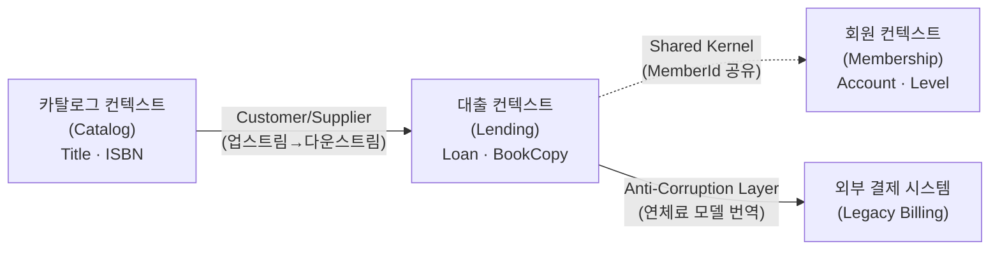

## 들어가며

이 글은 `Architecture-Essential` 시리즈의 **1단계**입니다. 전체 학습 지도는 [Architecture Essential Curriculum](/2026/06/19/architecture-essential-curriculum.html)에서 확인할 수 있습니다.

아키텍처를 이야기할 때 우리는 흔히 프레임워크, 메시지 큐, 캐시 전략 같은 기술 결정부터 떠올립니다. 하지만 그 모든 결정은 **"우리가 무엇을 만들고 있는가"**라는 질문에 답한 다음에야 의미를 가집니다. 그래서 이 시리즈는 기술이 아니라 **도메인 중심 사고(domain-centric thinking)**에서 출발합니다. 어떤 데이터베이스를 고를지, 서비스를 어떻게 쪼갤지 결정하기 전에, 먼저 풀려는 문제의 구조를 정확히 이해해야 하기 때문입니다. 도메인을 잘못 이해한 채 내린 아키텍처 결정은 아무리 정교해도 잘못된 문제를 빠르게 푸는 도구가 될 뿐입니다.

이 출발점의 고전이 Eric Evans의 *Domain-Driven Design: Tackling Complexity in the Heart of Software* (2003)입니다. 이 책의 핵심 주장은 단순하지만 강력합니다. **소프트웨어의 본질적 복잡성은 기술이 아니라 도메인 자체에 있다(complexity lives in the heart of the software — the domain)**는 것입니다. 동시성, 분산, 성능 같은 기술적 복잡성도 분명 어렵지만, 정작 프로젝트를 무너뜨리는 것은 "대출 연장은 며칠까지 가능한가", "연체 중인 회원도 예약을 걸 수 있는가" 같은 **도메인 규칙의 복잡성**입니다. DDD는 이 복잡성을 정면으로 다루기 위해, 도메인 지식을 코드 구조에 직접 새겨 넣는 방법론입니다.

이번 단계에서는 그 토대가 되는 다섯 가지 개념 — 유비쿼터스 언어, 도메인 모델, 바운디드 컨텍스트, 컨텍스트 맵, 전술적 설계 — 를 하나의 작은 도메인(**도서 대출**)을 따라가며 정리합니다. 여기서 "무엇을 만들 것인가(도메인 모델)"를 충분히 다진 뒤, 2단계 [Software Architecture in Practice: 품질 속성의 공학](/2026/06/19/software-architecture-in-practice.html)에서 "그것을 어떤 품질로 어떻게 만들 것인가(품질 속성과 아키텍처 공학)"로 넘어갑니다.

<div class="post-summary-box" markdown="1">

### 📌 이 글에서 다루는 내용

#### 🔍 핵심 주제

- **유비쿼터스 언어 (Ubiquitous Language)**: 개발자와 도메인 전문가가 코드·대화·문서에서 똑같이 쓰는 단일 언어
- **도메인 모델 (Domain Model)**: 엔티티·값 객체·애그리거트로 도메인 지식을 구조화하는 방법
- **바운디드 컨텍스트 (Bounded Context)**: 모델이 유효한 경계를 긋고 컨텍스트 간 관계를 정의하기
- **컨텍스트 맵 (Context Map)**: 여러 컨텍스트의 통합 패턴(Shared Kernel, ACL 등)을 지도로 표현하기
- **전술적 설계 (Tactical Design)**: Repository·Factory·Domain Service로 모델의 무결성을 지키기

</div>

## 유비쿼터스 언어: 번역 비용을 없애는 단일 언어

**왜 필요한가.** 소프트웨어 프로젝트가 실패하는 가장 흔한 지점은 코드가 아니라 **번역**입니다. 도메인 전문가는 "회원이 책을 빌린다"고 말하지만, 개발자는 코드에 `UserBookMapping`이나 `tx_record` 같은 이름을 붙입니다. 대화와 코드 사이에 끊임없는 번역이 끼어들고, 번역할 때마다 의미가 미묘하게 어긋나면서 버그와 오해가 쌓입니다.

**개념.** 유비쿼터스 언어(Ubiquitous Language)는 도메인 전문가와 개발자가 **회의, 문서, 그리고 코드에서 똑같은 단어를 똑같은 의미로** 쓰자는 약속입니다. 도서 대출 도메인이라면 `Loan`(대출), `Member`(회원), `BookCopy`(개별 장서), `Reservation`(예약), `overdue`(연체) 같은 용어를 팀 전체가 공유합니다. 핵심은 이 언어가 **코드에까지 일관되게 침투**해야 한다는 점입니다. 대화에서는 "대출"이라 하면서 코드에서는 `Rental`이라 부른다면 그건 유비쿼터스 언어가 아닙니다.

**예시.** 아래 코드는 도메인 전문가가 쓰는 말을 그대로 옮긴 클래스명과 메서드명을 보여줍니다. 주석이 아니라 **이름 자체가 도메인 규칙을 설명**한다는 점에 주목하세요.

```python
class Member:
    def borrow(self, copy: "BookCopy") -> "Loan":
        # "연체 중인 회원은 대출할 수 없다" — 도메인 전문가의 문장이
        # 그대로 코드의 분기 조건이 된다.
        if self.has_overdue_loans():
            raise CannotBorrowError("연체 중인 회원은 대출할 수 없습니다")
        return Loan.open(member=self, copy=copy)
```

`UserBookMapping.create()`가 아니라 `member.borrow(copy)`라고 읽히는 코드는 도메인 전문가가 봐도 의미를 이해할 수 있습니다. 언어가 어긋나기 시작하면 그것은 보통 **모델이 도메인과 어긋났다는 신호**이므로, 유비쿼터스 언어는 모델의 건강을 재는 리트머스 시험지이기도 합니다.

## 도메인 모델: 엔티티·값 객체·애그리거트

**왜 필요한가.** 유비쿼터스 언어로 잡은 개념들을 코드 구조로 옮기려면, 각 개념이 어떤 **성질**을 갖는지 구분해야 합니다. 똑같이 "객체"라도 식별자로 추적해야 하는 것과 값 자체가 전부인 것은 다루는 방식이 완전히 다릅니다. DDD의 전술적 빌딩 블록인 엔티티·값 객체·애그리거트가 이 구분을 제공합니다.

### 엔티티 (Entity): 식별자로 추적되는 것

엔티티는 **고유한 식별자(identity)**를 가지며, 속성이 바뀌어도 같은 것으로 취급되는 객체입니다. 회원은 이름이 바뀌어도 같은 회원이고, 대출은 반납일이 갱신되어도 같은 대출입니다. 동등성은 속성이 아니라 **ID로 판단**합니다.

```python
from dataclasses import dataclass, field
from datetime import date, timedelta

class Loan:
    """대출 — 식별자(loan_id)로 추적되는 엔티티."""

    def __init__(self, loan_id: str, member_id: str, copy_id: str, due_date: date):
        self.loan_id = loan_id          # 식별자: 두 Loan이 같은지 판단하는 기준
        self.member_id = member_id
        self.copy_id = copy_id
        self.due_date = due_date
        self.returned = False

    def __eq__(self, other) -> bool:
        # 동등성은 속성이 아니라 식별자로 결정된다.
        return isinstance(other, Loan) and self.loan_id == other.loan_id

    def __hash__(self) -> int:
        return hash(self.loan_id)
```

### 값 객체 (Value Object): 값 그 자체인 것

값 객체는 **식별자가 없고**, 속성 값이 같으면 같은 것으로 취급됩니다. 화폐 금액, 날짜 구간, 주소 같은 것들이 전형적입니다. 값 객체는 **불변(immutable)**으로 만드는 것이 원칙입니다 — 5,000원이라는 연체료 자체가 "바뀐다"는 건 말이 안 되고, 다른 금액이 필요하면 새 값 객체를 만들면 됩니다.

```python
@dataclass(frozen=True)  # frozen=True → 불변 값 객체
class Money:
    """연체료 같은 금액을 표현하는 값 객체. ID가 없고 값으로 비교된다."""
    amount: int
    currency: str = "KRW"

    def __add__(self, other: "Money") -> "Money":
        if self.currency != other.currency:
            raise ValueError("통화가 다른 금액은 더할 수 없습니다")
        return Money(self.amount + other.amount, self.currency)


@dataclass(frozen=True)
class LoanPeriod:
    """대출 기간을 표현하는 값 객체."""
    start: date
    days: int

    @property
    def due_date(self) -> date:
        return self.start + timedelta(days=self.days)
```

`Money(5000) == Money(5000)`은 항상 참입니다. 식별자가 없으니 "어느 5,000원인지"는 의미가 없기 때문입니다. 값 객체를 적극적으로 도입하면 도메인 규칙(통화 일치, 기간 계산)이 흩어지지 않고 한곳에 모입니다.

### 애그리거트 (Aggregate): 불변식을 지키는 일관성 경계

**왜 필요한가.** 엔티티와 값 객체가 늘어나면, "어디까지가 하나로 묶여 함께 저장·검증되어야 하는가"라는 질문이 생깁니다. 예를 들어 "한 회원은 동시에 5권까지만 대출할 수 있다"는 규칙은 개별 `Loan` 하나만 봐서는 지킬 수 없습니다. 여러 객체에 걸친 이런 규칙을 **불변식(invariant)**이라 부릅니다.

애그리거트는 이 불변식을 지키는 **일관성의 경계**입니다. 묶음을 대표하는 하나의 엔티티를 **애그리거트 루트(Aggregate Root)**로 두고, 외부에서는 오직 루트를 통해서만 내부에 접근합니다. 루트가 게이트키퍼 역할을 하며 불변식을 보장합니다.

```python
class MemberLoans:
    """애그리거트 루트: '회원의 대출 묶음' 전체의 일관성을 책임진다."""

    MAX_ACTIVE_LOANS = 5  # 불변식: 동시 대출은 5권까지

    def __init__(self, member_id: str):
        self.member_id = member_id
        self._loans: list[Loan] = []  # 내부 엔티티는 외부에 직접 노출하지 않는다

    def open_loan(self, loan_id: str, copy_id: str, period: LoanPeriod) -> Loan:
        active = [l for l in self._loans if not l.returned]
        # 불변식 검사는 반드시 루트를 통과한다 → 규칙이 한곳에서 강제된다
        if len(active) >= self.MAX_ACTIVE_LOANS:
            raise CannotBorrowError("동시 대출 한도(5권)를 초과했습니다")
        loan = Loan(loan_id, self.member_id, copy_id, period.due_date)
        self._loans.append(loan)
        return loan
```

외부 코드가 `member_loans._loans.append(...)`처럼 내부를 직접 건드리면 한도 검사를 우회할 수 있습니다. 그래서 내부 컬렉션은 숨기고 `open_loan()`이라는 루트 메서드만 공개합니다. **애그리거트는 트랜잭션 일관성의 단위**이기도 합니다 — 보통 한 트랜잭션에서는 하나의 애그리거트만 변경하는 것을 원칙으로 삼습니다.

## 바운디드 컨텍스트: 모델이 유효한 경계

**왜 필요한가.** 도메인이 커지면 같은 단어가 부서마다 다른 의미를 갖기 시작합니다. 도서관 시스템에서 "책(Book)"은 **대출** 영역에서는 "물리적 장서 한 권(BookCopy)"이지만, **카탈로그** 영역에서는 "ISBN으로 식별되는 서지 정보"이고, **구매** 영역에서는 "주문 단위의 상품"입니다. 이 모든 의미를 하나의 거대한 `Book` 클래스에 욱여넣으면, 누구의 요구도 제대로 만족시키지 못하는 비대한 모델이 됩니다.

**개념.** 바운디드 컨텍스트(Bounded Context)는 **하나의 모델이 명확하고 일관된 의미를 갖는 경계**입니다. 경계 안에서는 유비쿼터스 언어가 단 하나의 뜻을 갖고, 경계를 넘으면 다른 모델·다른 언어가 적용됩니다. 도서관 시스템을 다음과 같이 나눌 수 있습니다.

- **대출 컨텍스트(Lending)**: `Member`, `Loan`, `BookCopy`, `overdue` — "누가 어떤 장서를 빌렸는가"
- **카탈로그 컨텍스트(Catalog)**: `Title`, `Author`, `ISBN` — "어떤 책이 존재하는가"
- **회원 컨텍스트(Membership)**: `Account`, `MembershipLevel` — "누가 회원인가"

각 컨텍스트는 자기만의 모델을 갖고, "책"이라는 단어가 컨텍스트마다 다른 코드를 가리켜도 괜찮습니다. 오히려 그것이 건강한 신호입니다. 경계를 분명히 그으면, 한 컨텍스트의 모델을 단순하고 일관되게 유지할 수 있습니다.

## 컨텍스트 맵: 컨텍스트 간 통합 패턴

**왜 필요한가.** 바운디드 컨텍스트를 나눴으면, 이제 그들이 **어떻게 협력하는가**를 명시해야 합니다. 컨텍스트는 결국 데이터를 주고받아야 하는데, 그 관계가 명시되지 않으면 경계가 슬그머니 무너지고 모델이 다시 뒤섞입니다. 컨텍스트 맵(Context Map)은 이 관계를 한눈에 보여주는 지도입니다.

**주요 통합 패턴.**

- **Shared Kernel**: 두 컨텍스트가 작은 공통 모델을 **공유**한다. 변경하려면 양쪽 팀이 합의해야 한다. 결합이 강하므로 정말 안정적인 핵심에만 쓴다.
- **Customer/Supplier**: 한 컨텍스트(Customer)가 다른 컨텍스트(Supplier)에 의존하고, Supplier가 Customer의 요구를 우선 반영해 줄 책임을 진다. 업스트림-다운스트림 관계가 있다.
- **Anti-Corruption Layer (ACL)**: 외부/레거시 컨텍스트의 모델이 내 모델을 오염시키지 못하도록, 사이에 **번역 계층**을 둔다. 외부 개념을 내 유비쿼터스 언어로 변환해서 받아들인다.



이 지도는 단순한 그림이 아니라 **팀 간 계약**입니다. 대출 컨텍스트가 카탈로그의 다운스트림이라는 것은 "서지 정보는 카탈로그가 진실의 원천(source of truth)이고, 대출은 그것을 받아 쓴다"는 뜻입니다. 레거시 결제 시스템과는 ACL을 두어, 그쪽의 지저분한 데이터 구조가 우리의 깔끔한 `Money`·`Loan` 모델로 새어 들어오는 것을 막습니다.

## 전술적 설계: Repository·Factory·Domain Service

**왜 필요한가.** 지금까지 만든 도메인 모델(엔티티·값 객체·애그리거트)은 순수한 도메인 규칙만 담고 있어야 합니다. 그런데 실제 시스템에서는 객체를 저장소에서 꺼내고(조회), 복잡하게 생성하고, 어느 한 객체에 속하지 않는 연산을 수행해야 합니다. 이런 책임을 도메인 모델 안에 섞으면 모델이 인프라 코드로 더러워집니다. 전술적 설계 패턴은 이 책임들을 깔끔하게 분리해 모델의 무결성을 지킵니다.

### Repository: 애그리거트의 컬렉션처럼

Repository는 애그리거트를 저장·조회하는 책임을 추상화합니다. 도메인 코드는 SQL이나 ORM을 모른 채, **메모리 속 컬렉션을 다루듯** 애그리거트를 가져오고 저장합니다. 인터페이스는 도메인 계층에, 구현은 인프라 계층에 둡니다.

```python
from abc import ABC, abstractmethod

class MemberLoansRepository(ABC):
    """도메인 계층이 의존하는 추상 인터페이스 (인프라 세부사항을 모른다)."""

    @abstractmethod
    def get(self, member_id: str) -> MemberLoans:
        """애그리거트 루트를 통째로 복원한다."""
        ...

    @abstractmethod
    def save(self, member_loans: MemberLoans) -> None:
        """애그리거트 단위로 저장한다 (일관성 경계 = 저장 단위)."""
        ...
```

Repository는 **애그리거트 단위로** 작동한다는 점이 중요합니다. 내부 엔티티 `Loan`을 따로 꺼내는 `LoanRepository`를 만들면 애그리거트의 일관성 경계가 깨집니다. 항상 루트(`MemberLoans`)를 통째로 다룹니다.

### Factory: 복잡한 생성을 캡슐화

애그리거트를 만드는 과정이 복잡하거나 불변식 초기화가 필요하면, 생성 로직을 Factory로 분리합니다. 클라이언트가 내부 구조를 몰라도 **유효한 상태의** 애그리거트를 얻게 보장합니다.

```python
class MemberLoansFactory:
    @staticmethod
    def for_new_member(member_id: str) -> MemberLoans:
        # 신규 회원의 대출 묶음을 항상 유효한 초기 상태로 생성한다.
        return MemberLoans(member_id=member_id)
```

### Domain Service: 어디에도 속하지 않는 연산

어떤 도메인 연산은 특정 엔티티나 값 객체 하나에 자연스럽게 속하지 않습니다. 예를 들어 "회원이 이 장서를 대출할 수 있는지" 판단하려면 **대출 묶음, 장서 상태, 예약 대기열**을 함께 봐야 합니다. 이런 연산은 Domain Service로 표현합니다 — 상태를 갖지 않고 도메인 규칙만 수행하는 객체입니다.

```python
class LendingService:
    """여러 애그리거트에 걸친 도메인 규칙을 수행하는 도메인 서비스."""

    def __init__(self, loans_repo: MemberLoansRepository):
        self._loans_repo = loans_repo

    def lend(self, member_id: str, copy: "BookCopy", period: LoanPeriod) -> Loan:
        member_loans = self._loans_repo.get(member_id)
        if not copy.is_available():
            raise CannotBorrowError("이미 대출 중인 장서입니다")
        # 불변식 검사는 여전히 애그리거트 루트 내부에서 일어난다
        loan = member_loans.open_loan(
            loan_id=new_id(), copy_id=copy.copy_id, period=period
        )
        self._loans_repo.save(member_loans)
        return loan
```

`LendingService`는 Repository로 애그리거트를 불러오고, 규칙을 조율하고, 다시 저장합니다. 하지만 핵심 불변식(대출 한도)은 여전히 애그리거트 루트가 지킵니다. 서비스는 **조율자**이지 규칙의 소유자가 아니라는 점이 중요합니다. 이렇게 책임을 나누면 도메인 모델은 순수하게 남고, 인프라와 복잡한 절차는 바깥 계층이 떠맡습니다.

## 마무리

DDD의 출발점은 기술이 아니라 **도메인**입니다. 핵심을 다시 정리하면 다음과 같습니다.

- **유비쿼터스 언어**로 대화·문서·코드의 번역 비용을 없애고,
- 그 언어를 **도메인 모델**(엔티티·값 객체·애그리거트)로 구조화해 불변식을 코드에 새기고,
- **바운디드 컨텍스트**로 모델이 유효한 경계를 그어 의미의 충돌을 막고,
- **컨텍스트 맵**으로 컨텍스트 간 통합 패턴(Shared Kernel, ACL, Customer/Supplier)을 팀 간 계약으로 명시하고,
- **전술적 설계**(Repository·Factory·Domain Service)로 모델의 순수성과 무결성을 지킵니다.

여기까지가 **"무엇을 만들 것인가"** — 도메인 모델을 또렷하게 세우는 단계였습니다. 모델이 분명해지면 비로소 다음 질문이 의미를 갖습니다. 이 시스템은 얼마나 빨라야 하고, 얼마나 견고해야 하며, 얼마나 쉽게 바뀌어야 하는가? 2단계에서는 이렇게 **"어떤 품질로, 어떻게 만들 것인가"**로 시선을 옮겨, 품질 속성(quality attributes)을 공학적으로 다루는 방법을 배웁니다.

### 다음 학습

- [Architecture Essential Curriculum](/2026/06/19/architecture-essential-curriculum.html) — 전체 학습 지도에서 현재 위치 확인하기
- [Software Architecture in Practice: 품질 속성의 공학](/2026/06/19/software-architecture-in-practice.html) — 2단계: 도메인 모델 위에 품질 속성과 아키텍처 공학을 얹기
