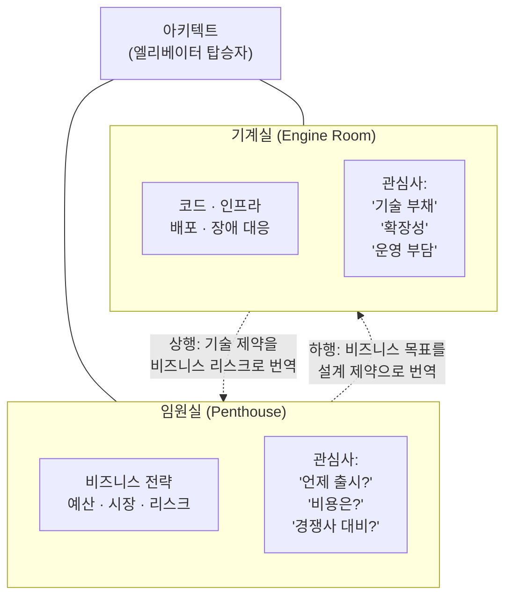
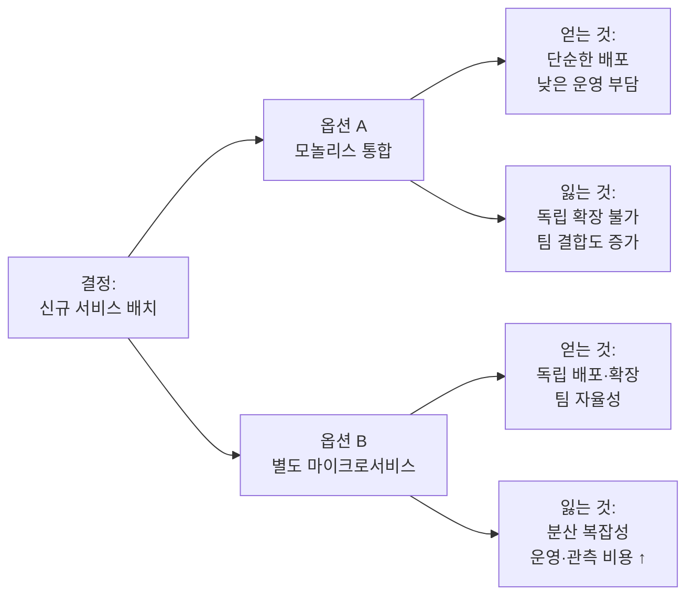
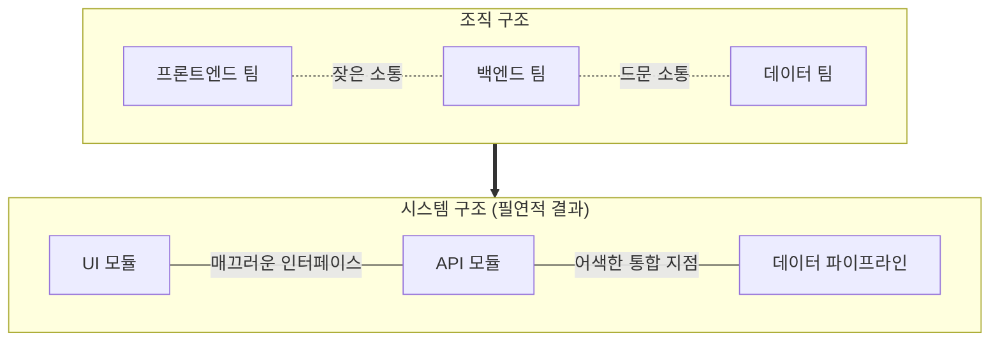
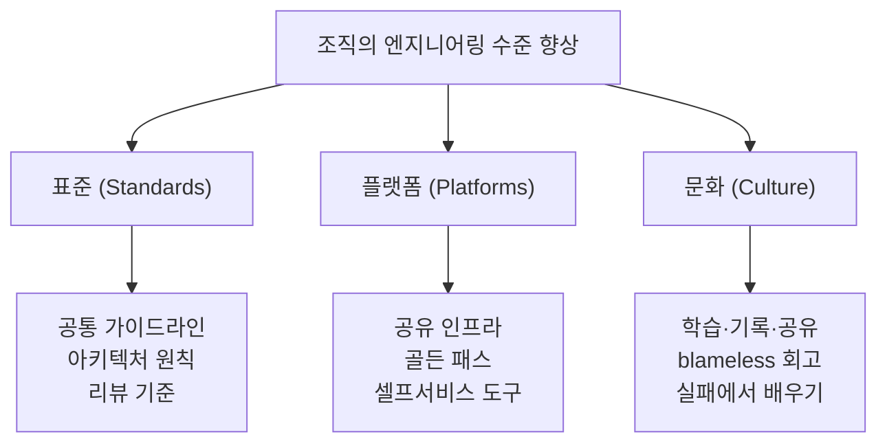

<figure class="post-figure post-figure--header">
<svg role="img" aria-label="아키텍트 엘리베이터 은유를 한 장으로 담은 건물 단면도. 맨 위층은 임원실(penthouse)로 비즈니스 전략·예산·리스크를 다루고, 맨 아래층은 기계실(engine room)로 코드·인프라·운영을 다룬다. 두 층 사이를 수직 엘리베이터 샤프트가 관통하고, 그 안의 엘리베이터 칸에 아키텍트가 타고 있다. 샤프트를 따라 두 방향 화살표가 흐른다. 아래로 내려가는 화살표는 비즈니스 목표를 설계 제약으로 번역하고, 위로 올라가는 화살표는 기술 제약을 비즈니스 리스크로 번역한다. 가운데 중간 관리 계층은 정보를 걸러내는 필터로 표시된다." viewBox="0 0 680 320" xmlns="http://www.w3.org/2000/svg">
  <title>아키텍트 엘리베이터 — 임원실과 기계실 사이를 오르내리며 양쪽 언어를 통역하는 아키텍트</title>

  <!-- ===== building outer frame ===== -->
  <rect x="40" y="28" width="600" height="264" rx="6" fill="none" stroke="currentColor" stroke-width="2" opacity="0.55"/>

  <!-- ===== PENTHOUSE (top floor) ===== -->
  <rect x="40" y="28" width="600" height="68" rx="6" fill="var(--bg-light)" stroke="var(--gold)" stroke-width="2"/>
  <rect x="40" y="62" width="600" height="34" fill="var(--bg-light)" opacity="0"/>
  <text x="84" y="56" font-size="13" fill="currentColor" font-weight="700">임원실 (Penthouse)</text>
  <text x="84" y="76" font-size="10.5" fill="currentColor" opacity="0.82">비즈니스 전략 · 예산 · 시장 · 리스크</text>
  <text x="84" y="90" font-size="9" fill="currentColor" opacity="0.65">관심사: &#39;언제 출시?&#39; · &#39;비용은?&#39; · &#39;경쟁사 대비?&#39;</text>

  <!-- ===== ENGINE ROOM (bottom floor) ===== -->
  <rect x="40" y="224" width="600" height="68" rx="6" fill="var(--bg-light)" stroke="var(--accent-color)" stroke-width="2"/>
  <text x="84" y="252" font-size="13" fill="currentColor" font-weight="700">기계실 (Engine Room)</text>
  <text x="84" y="272" font-size="10.5" fill="currentColor" opacity="0.82">코드 · 인프라 · 배포 · 장애 대응</text>
  <text x="84" y="286" font-size="9" fill="currentColor" opacity="0.65">관심사: &#39;기술 부채&#39; · &#39;확장성&#39; · &#39;운영 부담&#39;</text>

  <!-- ===== middle management filter layer (the lossy floors) ===== -->
  <text x="120" y="162" text-anchor="middle" font-size="9.5" fill="currentColor" opacity="0.6" font-weight="700">중간 계층</text>
  <text x="120" y="176" text-anchor="middle" font-size="8" fill="currentColor" opacity="0.5">정보가 걸러지고</text>
  <text x="120" y="187" text-anchor="middle" font-size="8" fill="currentColor" opacity="0.5">왜곡되는 층들</text>
  <g stroke="currentColor" stroke-width="1.4" opacity="0.3">
    <line x1="60" y1="118" x2="180" y2="118"/>
    <line x1="60" y1="146" x2="180" y2="146"/>
    <line x1="60" y1="174" x2="180" y2="174"/>
    <line x1="60" y1="202" x2="180" y2="202"/>
  </g>
  <g stroke="currentColor" stroke-width="1.4" opacity="0.3">
    <line x1="500" y1="118" x2="620" y2="118"/>
    <line x1="500" y1="146" x2="620" y2="146"/>
    <line x1="500" y1="174" x2="620" y2="174"/>
    <line x1="500" y1="202" x2="620" y2="202"/>
  </g>

  <!-- ===== elevator shaft (the spine) ===== -->
  <rect x="300" y="96" width="80" height="128" fill="var(--bg-panel)" stroke="currentColor" stroke-width="2" opacity="0.95"/>

  <!-- down arrow: business goal -> design constraint -->
  <line x1="316" y1="104" x2="316" y2="214" stroke="var(--secondary-color)" stroke-width="2.5" marker-end="url(#el-down)"/>
  <!-- up arrow: tech constraint -> business risk -->
  <line x1="364" y1="216" x2="364" y2="106" stroke="var(--accent-color)" stroke-width="2.5" marker-end="url(#el-up)"/>

  <!-- elevator car with the architect mid-ride -->
  <rect x="320" y="142" width="40" height="36" rx="3" fill="var(--bg-light)" stroke="var(--gold)" stroke-width="2.5"/>
  <!-- architect figure: head + shoulders -->
  <circle cx="340" cy="154" r="5" fill="none" stroke="currentColor" stroke-width="2"/>
  <path d="M331 170 q9 -11 18 0" fill="none" stroke="currentColor" stroke-width="2"/>
  <text x="340" y="196" text-anchor="middle" font-size="9.5" fill="currentColor" font-weight="700">아키텍트</text>

  <!-- translation labels along the shaft -->
  <text x="246" y="150" text-anchor="end" font-size="9" fill="currentColor" opacity="0.85" font-weight="700">하행 ↓</text>
  <text x="246" y="163" text-anchor="end" font-size="8.5" fill="currentColor" opacity="0.7">비즈니스 목표를</text>
  <text x="246" y="174" text-anchor="end" font-size="8.5" fill="currentColor" opacity="0.7">설계 제약으로</text>

  <text x="434" y="150" text-anchor="start" font-size="9" fill="currentColor" opacity="0.85" font-weight="700">↑ 상행</text>
  <text x="434" y="163" text-anchor="start" font-size="8.5" fill="currentColor" opacity="0.7">기술 제약을</text>
  <text x="434" y="174" text-anchor="start" font-size="8.5" fill="currentColor" opacity="0.7">비즈니스 리스크로</text>

  <defs>
    <marker id="el-down" markerWidth="9" markerHeight="9" refX="4.5" refY="7" orient="auto">
      <path d="M0,0 L9,0 L4.5,8 z" fill="var(--secondary-color)"/>
    </marker>
    <marker id="el-up" markerWidth="9" markerHeight="9" refX="4.5" refY="1" orient="auto">
      <path d="M4.5,0 L9,8 L0,8 z" fill="var(--accent-color)"/>
    </marker>
  </defs>
</svg>
<figcaption>이 글의 척추가 되는 <strong>아키텍트 엘리베이터</strong> 은유 — 위층 <strong>임원실</strong>(전략·예산·리스크)과 아래층 <strong>기계실</strong>(코드·인프라·운영) 사이를 중간 계층이 정보를 걸러내며 갈라놓는다. 아키텍트는 한 층에 머무는 거주민이 아니라 샤프트를 오르내리는 탑승자다. 내려갈 때는 비즈니스 목표를 설계 제약으로, 올라갈 때는 기술 제약을 비즈니스 리스크로 <strong>통역</strong>한다.</figcaption>
</figure>

## 들어가며

이 글은 `Architecture-Essential` 시리즈의 **4단계이자 마지막**입니다. 전체 학습 지도는 [Architecture Essential Curriculum](/2026/06/19/architecture-essential-curriculum.html)에서 다시 확인할 수 있습니다.

3단계 [Designing Data-Intensive Applications: 분산 데이터 시스템](/2026/06/19/designing-data-intensive-applications.html)에서는 복제, 파티셔닝, 합의, 트랜잭션 같은 **깊은 기술 시스템**을 다뤘습니다. 거기서 우리는 "기계실(engine room)"의 언어, 즉 일관성 모델과 장애 시나리오를 정밀하게 다루는 법을 배웠습니다. 하지만 아무리 정교한 분산 시스템을 설계해도, 그 결정을 **왜** 내렸는지를 비즈니스 의사결정권자에게 설명하지 못한다면 그 아키텍처는 조직 안에서 살아남지 못합니다. 기술적 탁월함과 조직적 영향력은 별개의 근육입니다.

이번 단계의 교재는 Gregor Hohpe의 *The Software Architect Elevator*입니다. 이 책의 핵심 은유는 제목 그대로 **엘리베이터**입니다. 좋은 아키텍트는 건물의 한 층에만 머무르지 않습니다. 최상층의 **임원실(penthouse)**, 즉 비즈니스 전략과 예산이 결정되는 곳과, 지하의 **기계실(engine room)**, 즉 실제 코드와 인프라가 돌아가는 곳 사이를 엘리베이터를 타고 끊임없이 오르내립니다. 그리고 그 엘리베이터 안에서 **양쪽의 언어를 통역**합니다. 임원에게는 기술적 제약을 비즈니스 리스크로 번역하고, 엔지니어에게는 비즈니스 목표를 설계 제약으로 번역합니다.

많은 조직에서 이 엘리베이터는 **고장 나 있습니다**. 임원실은 기계실에서 무슨 일이 벌어지는지 모르고, 기계실은 위에서 왜 그런 결정을 내렸는지 모릅니다. 아키텍트의 가장 중요한 역할은 이 단절된 두 층을 다시 연결하는 것입니다. 이 글은 그 연결을 어떻게 만드는지 — 트레이드오프 소통, 조직 구조(Conway의 법칙), 기술 리더십 — 를 다루며 `Architecture-Essential` 시리즈 전체를 마무리합니다.

### 📌 이 글에서 다루는 내용

#### 🔍 핵심 주제

- **아키텍트 엘리베이터 (The Elevator)**: 비즈니스 전략과 기술 구현을 오가며 양쪽을 통역하는 역할
- **의사결정과 트레이드오프 소통**: 옵션을 제시하고 결정의 근거와 비용을 이해관계자 언어로 설명하기
- **조직과 아키텍처 (Conway의 법칙)**: 시스템 구조와 조직 구조의 상호작용을 설계에 반영하기
- **기술 리더십과 변화 주도**: 표준·플랫폼·문화를 통해 조직의 엔지니어링 수준을 끌어올리기

## 아키텍트 엘리베이터: 층 사이를 오가는 통역사

대부분의 조직은 수직적으로 층층이 나뉘어 있습니다. 위로 갈수록 추상적인 전략과 돈이, 아래로 갈수록 구체적인 코드와 운영이 있습니다. 문제는 정보가 이 층 사이를 지날 때마다 **왜곡되고 손실된다**는 점입니다. 중간 관리 계층은 종종 번역기보다는 필터처럼 작동합니다.

아키텍트 엘리베이터의 핵심은, 아키텍트가 **한 층의 거주민이 아니라 모든 층을 오가는 이동자**라는 데 있습니다. 엘리베이터를 타고 위로 올라가면 비즈니스의 언어로 말하고, 아래로 내려오면 기술의 언어로 말합니다. 그리고 가장 중요한 일은 엘리베이터 안에서 일어납니다 — **번역**입니다.

구체적인 상황을 생각해 봅시다. 기계실에서는 "결제 모듈의 기술 부채 때문에 신규 결제 수단 추가가 점점 어려워진다"고 느낍니다. 이걸 그대로 임원실에 들고 가면 "기술 부채? 그건 너희가 알아서 할 일"이라는 반응이 돌아옵니다. 통역이 필요합니다. 아키텍트는 이렇게 번역합니다 — "현재 구조로는 신규 결제 수단 하나를 붙이는 데 6주가 걸립니다. 경쟁사는 2주면 붙입니다. 리팩터링에 한 분기를 투자하면 이후 출시 주기가 1주로 줄어듭니다." 같은 사실이지만, 이제 임원실이 **결정할 수 있는 언어**가 되었습니다.

엘리베이터를 타지 않는 아키텍트는 두 가지 함정에 빠집니다. **임원실에만 머무는 아키텍트**는 현실과 동떨어진 PowerPoint 아키텍처를 그립니다. 코드를 모르니 실현 불가능한 약속을 하고, 기계실의 신뢰를 잃습니다. 반대로 **기계실에만 머무는 아키텍트**는 기술적으로는 옳지만 비즈니스 맥락이 없는 결정을 내리고, 그 가치를 위로 전달하지 못해 영향력을 잃습니다. 좋은 아키텍트는 두 층 모두에서 신뢰받아야 하며, 그 신뢰는 **양쪽 언어를 진짜로 구사할 때만** 생깁니다.

## 의사결정과 트레이드오프 소통

아키텍처는 본질적으로 **트레이드오프의 학문**입니다. 2단계에서 다룬 품질 속성(가용성, 성능, 보안, 유지보수성)은 서로 충돌하며, 하나를 얻으면 다른 하나를 내줘야 합니다. 그래서 아키텍트의 산출물은 "정답"이 아니라 **잘 설명된 선택**입니다.

Hohpe가 강조하는 것은, 아키텍트가 **결정을 대신 내려주는 사람이 아니라 결정을 가능하게 만드는 사람**이라는 점입니다. 이해관계자에게 "이게 정답입니다"라고 통보하는 대신, **옵션과 그 결과를 명료하게 펼쳐 보여** 그들이 자신의 맥락에서 책임 있게 선택하도록 돕습니다. 좋은 트레이드오프 소통은 세 가지를 반드시 담습니다.

| 구성 요소 | 내용 | 빠지면 생기는 문제 |
|---|---|---|
| **옵션 (Options)** | 가능한 선택지를 2~3개로 정리 | 단일안만 제시하면 "강요"로 느껴지고 검토가 막힘 |
| **근거 (Rationale)** | 각 옵션이 어떤 품질 속성을 얻고 잃는지 | 근거 없는 추천은 권위에만 기대게 되고 나중에 흔들림 |
| **비용 (Cost)** | 시간·돈·운영 부담·리스크를 정량화 | 비용이 가려지면 비현실적 기대가 의사결정을 오염시킴 |

예를 들어 "신규 서비스를 모놀리스에 넣을지, 별도 마이크로서비스로 뺄지"를 결정해야 한다고 합시다. 나쁜 소통은 "마이크로서비스가 요즘 표준이니 그렇게 가죠"입니다. 좋은 소통은 이렇게 펼칩니다.

여기에 비용을 덧붙입니다 — "옵션 B는 초기 인프라 구축에 약 3주, 그리고 분기마다 운영·모니터링 인력 0.3명이 추가로 듭니다. 트래픽이 현재 수준이라면 옵션 A로 시작하고, 월 사용자가 임계치를 넘으면 분리하는 것이 비용 대비 합리적입니다." 이제 이해관계자는 **트레이드오프를 보고** 결정할 수 있습니다.

핵심은 **상대의 언어로 비용을 환산**하는 것입니다. 엔지니어에게는 "운영 복잡도"가 비용이지만, 임원에게는 같은 것이 "월 운영비"와 "장애 시 매출 손실"입니다. 트레이드오프를 청중에 맞게 번역하지 못하면, 아무리 정확한 분석도 의사결정에 닿지 못합니다. 그리고 내려진 결정은 반드시 **ADR(Architecture Decision Record)** 같은 형태로 근거와 함께 기록해 둬야, 6개월 뒤 "왜 이렇게 했지?"라는 질문에 조직이 답할 수 있습니다.

## 조직과 아키텍처: Conway의 법칙

1967년 Melvin Conway는 이렇게 관찰했습니다.

> "시스템을 설계하는 조직은, 그 조직의 의사소통 구조를 그대로 복제한 설계를 만들어낸다."

이것이 **Conway의 법칙(Conway's Law)**입니다. 처음엔 농담처럼 들리지만, 실제로 시스템의 모듈 경계는 놀라울 만큼 정확하게 **조직도의 경계**를 따라갑니다. 두 팀이 자주 대화하지 않으면, 그 두 팀이 만든 컴포넌트 사이의 인터페이스도 어색하고 단절됩니다. 세 팀이 하나의 컴파일러를 만들면 그 컴파일러는 세 개의 패스(pass)를 갖게 된다는 농담이 괜히 나온 게 아닙니다.

아키텍트에게 Conway의 법칙이 주는 교훈은 두 가지입니다. 첫째, **조직 구조를 무시한 아키텍처는 실패한다**는 것입니다. 아무리 깔끔한 마이크로서비스 경계를 그려도, 그 경계가 팀 경계와 어긋나면 모든 변경이 여러 팀의 조율을 요구하게 되어 시스템은 다시 진흙덩어리로 돌아갑니다.

둘째, 이 법칙을 **역으로 이용**할 수 있다는 것입니다. 이것이 **역콘웨이 전략(Inverse Conway Maneuver)**입니다. 원하는 시스템 아키텍처가 있다면, 먼저 **그 아키텍처를 닮은 조직 구조를 만든다**는 발상입니다. 모듈 경계가 깨끗한 시스템을 원하면, 그 모듈을 소유하는 작고 자율적인 팀(예: *Team Topologies*의 stream-aligned team)을 먼저 구성합니다. 그러면 조직이 자연스럽게 그런 시스템을 빚어냅니다.

| 접근 | 발상의 방향 | 결과 |
|---|---|---|
| **순방향 (방치)** | 조직 → 시스템 (그대로 굳어짐) | 기존 부서 경계가 우연히 아키텍처가 됨 |
| **역콘웨이 전략** | 원하는 시스템 → 그에 맞는 조직 설계 | 의도한 아키텍처가 조직을 통해 자라남 |

따라서 아키텍트의 작업 대상은 코드만이 아닙니다. **팀의 경계, 소유권, 소통 경로**를 설계하는 것 역시 아키텍처 작업입니다. "이 두 서비스가 자꾸 강하게 결합된다"는 기술 문제의 근본 원인이 "두 서비스를 한 팀이 시간에 쫓기며 같이 만든다"는 조직 문제일 때가 많습니다. 엘리베이터를 타고 임원실까지 올라가 조직 구조를 함께 논의할 수 있어야 하는 이유가 여기에 있습니다.

## 기술 리더십과 변화 주도

마지막으로, 아키텍트는 개별 결정을 넘어 **조직 전체의 엔지니어링 수준**을 끌어올리는 사람입니다. 한 사람이 모든 코드를 작성할 수는 없습니다. 대신 아키텍트는 **레버리지(leverage)**를 통해 영향력을 곱합니다 — 한 번의 좋은 결정이 수백 명의 일상에 영향을 미치도록 만드는 것입니다. Hohpe는 이를 권한(authority)이 아니라 **영향력(influence)**으로 이끄는 리더십이라 표현합니다.

변화를 주도하는 세 가지 지렛대는 표준, 플랫폼, 문화입니다.

**표준(Standards)**은 "매번 처음부터 고민하지 않게" 해줍니다. 좋은 표준은 규칙의 강요가 아니라, 검증된 기본값을 제공해 사람들이 **중요한 결정에만 집중**하도록 돕습니다. 다만 표준이 통제의 도구가 되면 오히려 회피의 대상이 됩니다. 표준은 "이걸 따르면 더 쉽다"고 느껴질 때 비로소 채택됩니다.

**플랫폼(Platforms)**은 표준을 코드로 굳힌 것입니다. "마이크로서비스는 이런 모니터링을 갖춰야 한다"는 표준이 있다면, 그 모니터링이 기본 탑재된 서비스 템플릿(골든 패스, golden path)을 제공하는 것이 플랫폼입니다. 올바른 길이 동시에 **가장 쉬운 길**이 되도록 만드는 것 — 이것이 변화를 강제가 아닌 자연스러운 흐름으로 만드는 비결입니다.

**문화(Culture)**는 가장 느리지만 가장 깊은 지렛대입니다. 아키텍처 결정을 기록하고(ADR), 장애를 비난 없이 회고하며(blameless postmortem), 학습을 공유하는 습관이 자리 잡으면 조직은 아키텍트 한 사람에게 의존하지 않고도 스스로 좋은 결정을 내리게 됩니다. Hohpe가 말하는 진짜 성공한 아키텍트는, 자신이 자리를 비워도 조직이 더 나은 결정을 계속 내리도록 **시스템과 문화를 남긴 사람**입니다.

여기서 중요한 점은 변화 주도가 곧 **저항 관리**라는 사실입니다. 기존 방식에 익숙한 팀에게 새 표준이나 플랫폼은 위협으로 느껴집니다. 아키텍트는 변화를 통보하는 대신, 작은 성공 사례를 만들고(파일럿 팀), 그 결과를 가시화하며, 얼리어답터를 옹호자로 전환시켜 변화가 **조직 안에서 퍼지도록** 합니다. 이것 역시 엘리베이터를 오가는 일입니다 — 위로는 변화의 비즈니스 가치를 설득하고, 아래로는 변화의 실질적 이득을 증명합니다.

## 마무리

이번 4단계에서는 아키텍트의 **조직적 역할**을 다뤘습니다. **아키텍트 엘리베이터**는 임원실과 기계실을 오가며 양쪽 언어를 통역하는 일이고, **트레이드오프 소통**은 옵션·근거·비용을 이해관계자의 언어로 펼쳐 책임 있는 결정을 가능하게 하는 일이며, **Conway의 법칙**은 조직 구조와 시스템 구조가 거울처럼 맞물린다는 통찰과 그것을 역으로 이용하는 전략이었습니다. 마지막으로 **기술 리더십**은 표준·플랫폼·문화라는 지렛대로 조직 전체의 엔지니어링 수준을 끌어올리는 일이었습니다. 아키텍처는 박스와 화살표를 넘어, 결국 **사람과 소통의 구조를 설계하는 일**임을 확인했습니다.

🎉 이로써 `Architecture-Essential` 시리즈 네 단계를 모두 완주했습니다. 네 권의 책은 하나의 여정으로 이어집니다. **Eric Evans의 *Domain-Driven Design***(1단계)에서 우리는 소프트웨어가 결국 **도메인의 모델**이며, 비즈니스 언어를 코드에 정직하게 새기는 것이 출발점임을 배웠습니다. **Len Bass의 *Software Architecture in Practice***(2단계)에서는 그 모델을 **품질 속성의 공학**으로 다루는 법 — 가용성·성능·보안 같은 -ility들을 전술과 트레이드오프로 설계하는 법을 익혔습니다. **Martin Kleppmann의 *Designing Data-Intensive Applications***(3단계)에서는 그 설계를 **분산 시스템의 가혹한 현실** 속에서 검증했습니다. 복제·파티셔닝·합의가 부딪히는 기계실의 진실을 마주했습니다. 그리고 이번 **Gregor Hohpe의 *The Software Architect Elevator***(4단계)는 그 모든 기술적 결정을 **조직이라는 인간 시스템** 안에서 살아 움직이게 하는 법을 가르쳤습니다. 도메인에서 출발해 품질로, 분산의 현실로, 그리고 조직으로 — 이 네 층을 오르내릴 수 있을 때 비로소 아키텍트가 됩니다. 결국 아키텍처란 박스와 화살표가 아니라 **사람과 트레이드오프에 관한 것**입니다.

### 다음 학습

이 단계가 `Architecture-Essential` 시리즈의 마지막입니다. 시리즈를 완주한 것을 축하합니다. 더 넓은 학습으로 이어가려면 아래를 참고하세요.

- 전체 로드맵 다시 보기: [Architecture Essential Curriculum](/2026/06/19/architecture-essential-curriculum.html)
- 이전 단계 다시 보기 (3단계): [Designing Data-Intensive Applications: 분산 데이터 시스템](/2026/06/19/designing-data-intensive-applications.html)
- 자매 커리큘럼 — 객체지향 설계로 깊이 파기: [OO-Design Essential Curriculum](/2026/06/19/oo-design-essential-curriculum.html)
- 자매 커리큘럼 — 개발 프로세스와 협업으로 확장: [Process Essential Curriculum](/2026/06/19/process-essential-curriculum.html)
