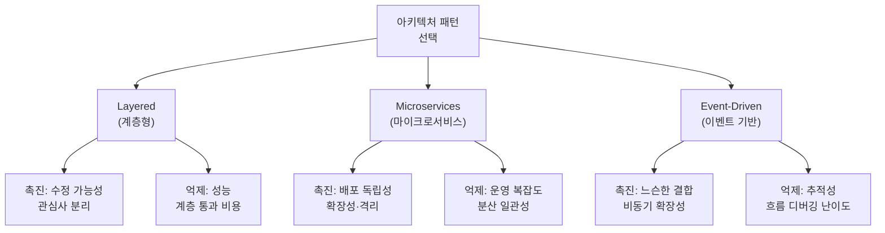

## 들어가며

이 글은 `Architecture-Essential` 시리즈의 **2단계**입니다. 전체 학습 경로는 [Architecture Essential Curriculum](/2026/06/19/architecture-essential-curriculum.html)에서 확인할 수 있습니다.

1단계 [Domain-Driven Design: 도메인 중심 사고](/2026/06/19/domain-driven-design.html)에서는 "무엇을 만들 것인가"를 도메인 모델과 Bounded Context로 분해했습니다. 도메인을 잘 나누면 시스템의 **기능적 책임**이 또렷해집니다. 그런데 현장에서 아키텍처가 무너지는 지점은 대개 기능이 아니라 **비기능**입니다. "이 기능은 맞는데 응답이 3초 걸린다", "장애가 나면 복구에 한 시간 걸린다", "권한 모델을 바꾸려니 코드 절반을 손대야 한다" 같은 문제 말입니다.

이번 단계는 바로 그 비기능 영역을 정면으로 다룹니다. 텍스트는 Len Bass, Paul Clements, Rick Kazman의 *Software Architecture in Practice, 4th ed.* 입니다. 이 책의 핵심 주장은 단순합니다. **아키텍처는 예술이 아니라 공학이며, 공학이 되려면 품질을 측정할 수 있어야 한다.** 막연한 "확장성 좋게", "안정적으로" 대신, 자극과 응답과 측정값으로 품질을 정량화하고, 그 품질을 달성하는 설계 결정을 카탈로그(전술)로 다루며, 설계의 트레이드오프를 평가(ATAM)하고, 이해관계자별 관점(View)으로 문서화합니다.

이렇게 정량화된 품질 사고는 3단계 [Designing Data-Intensive Applications: 분산 데이터 시스템](/2026/06/19/designing-data-intensive-applications.html)에서 실제 분산 데이터 시스템의 가용성·일관성·지연시간 문제로 곧장 이어집니다. 즉, 2단계는 "품질을 어떻게 설계하고 평가하는가"라는 일반 공학 언어를 익히는 자리입니다.

<div class="post-summary-box" markdown="1">

### 📌 이 글에서 다루는 내용

#### 🔍 핵심 주제

- **품질 속성 (Quality Attributes)**: 가용성·성능·보안·수정 가능성 같은 비기능 요구사항을 1차 시민으로 다루는 사고법
- **품질 속성 시나리오 (QA Scenarios)**: 자극·응답·측정으로 요구사항을 정량적이고 검증 가능하게 기술하는 6요소 템플릿
- **아키텍처 전술 (Tactics)**: 각 품질 속성을 달성하기 위한 검증된 설계 결정 카탈로그
- **아키텍처 패턴 (Architectural Patterns)**: Layered·Microservices·Event-Driven 등 패턴과 전술의 관계
- **아키텍처 평가 (ATAM)**: 트레이드오프·민감점·위험점 분석으로 설계 위험을 조기에 식별하는 방법
- **아키텍처 문서화 (Views & Beyond)**: 모듈·C&C·할당 뷰로 이해관계자와 소통 가능하게 기록하기

</div>

## 품질 속성: 비기능 요구사항을 1차 시민으로

기능 요구사항은 "시스템이 **무엇을** 하는가"를 말합니다. 품질 속성(Quality Attribute, QA)은 "그 일을 **얼마나 잘** 하는가"를 말합니다. 가용성(Availability), 성능(Performance), 보안(Security), 수정 가능성(Modifiability), 테스트 용이성(Testability), 사용성(Usability) 등이 대표적입니다.

이 책의 출발점은 **품질 속성이 아키텍처를 결정한다**는 통찰입니다. 기능은 대부분 어떤 구조 위에서도 구현할 수 있습니다. 하지만 "초당 5만 건을 99.99% 가용성으로 처리하라"는 요구는 구조 자체를 강제합니다. 따라서 품질 속성은 부차적 비기능 항목이 아니라, 설계 결정을 가장 강하게 끌어당기는 **1차 시민(first-class citizen)**으로 다뤄야 합니다.

품질 속성을 다룰 때 흔한 실패 패턴은 두 가지입니다.

- **모호함**: "시스템은 빨라야 한다" — 무엇이 얼마나 빨라야 하는지 검증 불가능합니다.
- **분류 논쟁**: "이건 성능 문제인가 가용성 문제인가" — 라벨 다툼은 가치가 없습니다.

책의 처방은 라벨에 집착하지 말고 **시나리오**로 구체화하라는 것입니다. 시나리오는 모호함과 분류 논쟁을 동시에 해소합니다.

## 품질 속성 시나리오: 6요소로 정량화하기

품질 속성 시나리오는 비기능 요구사항을 검증 가능한 문장으로 바꾸는 표준 템플릿입니다. 6개 요소로 구성됩니다.

| 요소 | 영문 | 의미 |
| --- | --- | --- |
| 자극원 | Source | 자극을 만들어내는 주체 (사용자, 외부 시스템, 내부 컴포넌트 등) |
| 자극 | Stimulus | 시스템에 도달하는 사건 (요청 폭주, 노드 다운, 변경 요구 등) |
| 환경 | Environment | 자극이 발생하는 조건 (정상 운영, 과부하, 장애 상태 등) |
| 아티팩트 | Artifact | 자극을 받는 대상 (전체 시스템, 특정 모듈, 데이터 저장소 등) |
| 응답 | Response | 시스템이 보이는 반응 (로그 기록, 페일오버, 거절 등) |
| 응답 측정 | Response Measure | 응답을 정량적으로 판정하는 기준 (시간, 비율, 비용 등) |

핵심은 **응답 측정**입니다. 측정값이 있어야 "달성했다/못 했다"를 객관적으로 말할 수 있습니다.

다음은 가용성(Availability) 시나리오의 구체적 예시입니다.

```text
[가용성 QA 시나리오]
자극원(Source)        : 내부 클러스터의 한 서버 노드
자극(Stimulus)        : 노드가 응답 불능 상태로 전환됨 (crash)
환경(Environment)     : 정상 운영 중, 평균 트래픽 부하
아티팩트(Artifact)    : 결제 처리 서비스
응답(Response)        : 헬스체크가 장애를 감지하고, 트래픽을
                        정상 노드로 자동 페일오버하며, 운영팀에 알림
응답 측정(Response Measure):
                        - 장애 감지까지 5초 이내
                        - 자동 복구(페일오버) 완료까지 30초 이내
                        - 해당 시간 동안 손실 요청 0건 (재시도로 보장)
                        - 월간 가용성 99.99% 유지
```

성능(Performance) 시나리오도 같은 골격으로 작성합니다.

```text
[성능 QA 시나리오]
자극원(Source)        : 외부 사용자 (모바일 클라이언트)
자극(Stimulus)        : 초당 5,000건의 상품 조회 요청 도착
환경(Environment)     : 피크 타임(프로모션) 부하 상태
아티팩트(Artifact)    : 상품 카탈로그 조회 API
응답(Response)        : 요청을 처리하고 응답을 반환
응답 측정(Response Measure):
                        - p95 응답 지연 200ms 이하
                        - p99 응답 지연 500ms 이하
                        - 처리량 5,000 req/s에서 에러율 0.1% 미만
```

이 두 예시만 봐도, "빠르게/안정적으로"가 얼마나 무력한 표현이었는지 드러납니다. 시나리오는 설계자·테스터·이해관계자 모두가 같은 합격선을 공유하게 만듭니다. 실무에서는 이 시나리오들을 **아키텍처 백로그**로 모아 우선순위를 매기고, 각 시나리오를 만족시키는 설계 결정을 추적합니다.

## 아키텍처 전술: 품질을 달성하는 설계 결정 카탈로그

시나리오가 "목표"라면, 전술(Tactic)은 그 목표를 달성하기 위한 **검증된 설계 결정 단위**입니다. 패턴이 여러 결정을 묶은 큰 구조라면, 전술은 그보다 작은 원자적 결정입니다. 책은 품질 속성별로 전술을 카탈로그화합니다. 대표적인 매핑은 다음과 같습니다.

| 품질 속성 | 전술 범주 | 대표 전술 |
| --- | --- | --- |
| 가용성 (Availability) | 결함 감지 | ping/echo, heartbeat, 예외 감지, 타임아웃 |
| 가용성 (Availability) | 결함 복구 | redundancy(active/passive), 페일오버, rollback, 재시작 |
| 가용성 (Availability) | 결함 예방 | 트랜잭션, 서비스 격리(bulkhead), circuit breaker |
| 수정 가능성 (Modifiability) | 응집/결합 관리 | encapsulation, 모듈 분리, 책임 재할당 |
| 수정 가능성 (Modifiability) | 바인딩 시점 연기 | 지연 바인딩(late binding), 설정 파라미터, 플러그인 |
| 성능 (Performance) | 자원 수요 관리 | 이벤트 비율 제한, 우선순위 부여, 계산량 절감 |
| 성능 (Performance) | 자원 관리 | 병렬 처리, 자원 풀(pool), 캐시(caching), 큐잉 |
| 보안 (Security) | 공격 저항 | 인증·인가, 데이터 암호화, 접근 제한 |
| 보안 (Security) | 공격 탐지·복구 | 침입 탐지, 감사 로그, 상태 복원 |
| 테스트 용이성 (Testability) | 입출력 제어 | 의존성 주입, 기록/재생(record/playback), 인터페이스 분리 |

전술의 가치는 **재사용 가능한 어휘**라는 데 있습니다. "가용성을 올리자"는 추상적이지만, "결제 서비스에 active/passive redundancy와 circuit breaker를 적용하자"는 구체적이고 토론 가능합니다. 위 가용성 시나리오의 "5초 내 감지 / 30초 내 복구"는 heartbeat(감지) + 자동 페일오버(복구)라는 전술 조합으로 직접 연결됩니다.

다만 모든 전술에는 대가가 따릅니다. 캐시는 성능을 올리지만 일관성과 메모리를 희생합니다. redundancy는 가용성을 올리지만 비용과 복잡도를 늘립니다. 이 **상충**을 다루는 것이 바로 평가 단계의 역할입니다.

## 아키텍처 패턴: 전술의 묶음

패턴(Pattern)은 반복되는 설계 문제에 대한 검증된 구조적 해법으로, 여러 전술을 한데 묶은 큰 단위입니다. 패턴은 특정 품질 속성을 본질적으로 촉진하거나 억제합니다.



- **Layered**: 책임을 계층으로 나눠 수정 가능성과 이식성을 높입니다. 대신 계층을 가로지르는 호출이 성능 비용을 만듭니다.
- **Microservices**: 서비스를 독립 배포·확장 단위로 쪼개 가용성과 확장성을 높입니다. 대신 네트워크 호출, 분산 트랜잭션, 운영 복잡도가 따라옵니다.
- **Event-Driven**: 컴포넌트를 이벤트로 느슨하게 연결해 확장성과 진화 가능성을 높입니다. 대신 전체 흐름 추적과 디버깅이 어려워집니다.

패턴 선택은 곧 **어떤 품질을 우선하고 어떤 품질을 양보할지** 결정하는 일입니다. 그래서 패턴은 시나리오·전술과 분리해 고를 수 없으며, 늘 트레이드오프와 함께 평가되어야 합니다.

## 아키텍처 평가(ATAM): 위험을 조기에 드러내기

ATAM(Architecture Tradeoff Analysis Method)은 설계가 품질 속성 요구를 만족하는지, 그리고 그 과정에서 어떤 상충이 발생하는지를 **코드 작성 전에** 분석하는 평가 방법입니다. 핵심 산출물은 네 가지입니다.

| 산출물 | 영문 | 의미 |
| --- | --- | --- |
| 민감점 | Sensitivity Point | 특정 결정이 하나의 품질 속성에 크게 영향을 주는 지점 |
| 트레이드오프점 | Tradeoff Point | 하나의 결정이 둘 이상의 품질 속성에 동시에, 상반되게 영향을 주는 지점 |
| 위험 | Risk | 품질 목표 달성을 위협하는, 정당화되지 않은 결정 |
| 비위험 | Non-Risk | 근거가 충분해 안전하다고 판단되는 결정 |

예를 들어 결제 서비스에 캐시를 도입한다고 합시다. 캐시 만료 시간(TTL)은 **민감점**입니다. 짧게 잡으면 일관성이 좋아지고 길게 잡으면 성능이 좋아지므로 성능 시나리오 결과가 이 값에 민감하게 반응합니다. 동시에 이 결정은 성능을 올리고 일관성을 떨어뜨리므로 **트레이드오프점**이기도 합니다. 만약 "TTL을 10분으로 두지만 금액 데이터에도 적용한다"면, 잘못된 잔액을 보여줄 수 있어 **위험**이 됩니다.

ATAM의 진짜 가치는 이런 위험을 **다이어그램과 토론으로 미리 드러낸다**는 데 있습니다. 이해관계자들이 모여 우선순위가 높은 시나리오를 두고 "이 결정은 어떤 품질에 어떻게 작용하는가"를 따지면, 값비싼 재작업이 발생하기 전에 설계 결함이 노출됩니다. 평가 과정은 대략 (1) 품질 속성 유틸리티 트리 작성 → (2) 시나리오 우선순위 부여 → (3) 아키텍처 접근법 분석 → (4) 민감점·트레이드오프·위험 도출 순으로 진행됩니다.

## 아키텍처 문서화(Views & Beyond): 관점으로 소통하기

아무리 좋은 설계도 전달되지 않으면 소용없습니다. 책은 아키텍처를 단일 그림이 아니라 **여러 뷰(View)의 집합**으로 기록하라고 말합니다. 뷰는 특정 이해관계자의 관심사에 맞춰 시스템을 투영한 것입니다. 크게 세 갈래로 나뉩니다.

| 뷰 범주 | 영문 | 보여주는 것 | 주요 이해관계자 |
| --- | --- | --- | --- |
| 모듈 뷰 | Module View | 코드 단위의 정적 구조, 의존 관계, 책임 | 개발자, 유지보수 담당 |
| 컴포넌트-커넥터 뷰 | C&C View | 런타임 요소와 상호작용(프로세스, 통신) | 성능·가용성 분석가 |
| 할당 뷰 | Allocation View | 소프트웨어가 인프라·팀·파일에 매핑되는 방식 | 운영, 배포, 조직 설계 |

같은 시스템이라도 모듈 뷰는 "수정 가능성"을 논할 때, C&C 뷰는 "성능·가용성"을 논할 때, 할당 뷰는 "배포·운영"을 논할 때 쓰입니다. 즉, **품질 속성마다 자연스럽게 잘 맞는 뷰가 다릅니다.** 위 가용성·성능 시나리오를 검증하려면 C&C 뷰가, 수정 가능성 전술(encapsulation, 지연 바인딩)을 보이려면 모듈 뷰가 가장 효과적입니다.

"Beyond"가 가리키는 것은 뷰들을 묶는 정보입니다. 뷰 간 매핑, 설계 근거(rationale), 용어 사전, 변경 이력 같은 것들이 여기 속합니다. 특히 **설계 근거**는 ATAM에서 도출한 트레이드오프와 위험 판단을 기록하는 자리로, 미래의 유지보수자가 "왜 이렇게 결정했는가"를 추적할 수 있게 해 줍니다.

## 마무리

이번 단계의 핵심은 한 문장으로 압축됩니다. **아키텍처는 측정 가능한 품질 속성을 중심으로 설계·평가·문서화하는 공학이다.** 우리는 비기능 요구를 1차 시민으로 끌어올리고(품질 속성), 그것을 6요소로 정량화하며(QA 시나리오), 검증된 설계 결정으로 달성하고(전술), 그 결정을 묶은 구조를 고르며(패턴), 트레이드오프를 미리 드러내고(ATAM), 관점별로 소통 가능하게 기록(Views & Beyond)했습니다.

이 모든 도구는 추상적인 연습이 아닙니다. 3단계 [Designing Data-Intensive Applications: 분산 데이터 시스템](/2026/06/19/designing-data-intensive-applications.html)에서는 바로 이 품질 속성 언어 — 가용성, 일관성, 지연시간, 확장성 — 를 실제 분산 데이터 시스템의 복제·파티셔닝·합의 문제에 그대로 적용하게 됩니다. 즉, 여기서 익힌 "시나리오로 정량화하고 트레이드오프로 평가한다"는 사고가, 다음 단계에서 다룰 진짜 분산 환경의 어려운 결정들을 정리하는 틀이 됩니다.

### 다음 학습

- [Architecture Essential Curriculum](/2026/06/19/architecture-essential-curriculum.html) — 전체 학습 경로와 진행 현황 확인
- (다시 보기) 1단계: [Domain-Driven Design: 도메인 중심 사고](/2026/06/19/domain-driven-design.html) — 기능적 책임을 도메인으로 분해하기
- (다음 단계) 3단계: [Designing Data-Intensive Applications: 분산 데이터 시스템](/2026/06/19/designing-data-intensive-applications.html) — 품질 속성을 실제 분산 데이터 시스템에 적용하기
