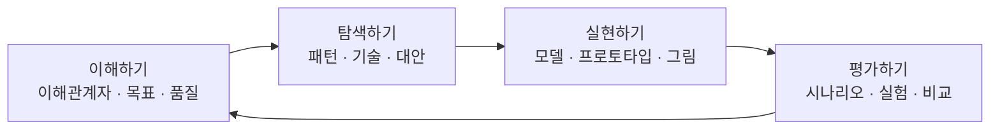

<figure class="post-figure post-figure--header">
<svg role="img" aria-label="아키텍처 디자인 스튜디오를 한 장으로 담은 그림. 가운데 원탁 위에 생각-실행-확인의 작은 삼각형이 돌고, 원탁을 둘러싼 네 칸이 이해하기·탐색하기·실현하기·평가하기 마인드셋이다. 오른쪽에는 은빛 도구상자가 네 칸 서랍으로 열려 38가지 팀 활동을 담는다." viewBox="0 0 680 320" xmlns="http://www.w3.org/2000/svg">
  <title>Design It! — 네 마인드셋 순환, 생각-실행-확인, 은빛 도구상자, 팀 디자인 스튜디오</title>

  <!-- ===== LEFT: workshop table + four mindsets ===== -->
  <text x="210" y="22" text-anchor="middle" font-size="12" fill="currentColor" font-weight="700" opacity="0.75">디자인 마인드셋</text>

  <!-- outer cycle ring -->
  <circle cx="210" cy="168" r="118" fill="none" stroke="currentColor" stroke-width="1.4" opacity="0.28"/>
  <circle cx="210" cy="168" r="72" fill="var(--bg-panel)" stroke="currentColor" stroke-width="1.8"/>

  <!-- four mindset cards -->
  <rect x="168" y="36" width="84" height="36" rx="3" fill="var(--bg-light)" stroke="var(--secondary-color)" stroke-width="2"/>
  <text x="210" y="58" text-anchor="middle" font-size="10" fill="currentColor" font-weight="700">이해하기</text>

  <rect x="300" y="150" width="84" height="36" rx="3" fill="var(--bg-light)" stroke="currentColor" stroke-width="1.8"/>
  <text x="342" y="172" text-anchor="middle" font-size="10" fill="currentColor" font-weight="700">탐색하기</text>

  <rect x="168" y="264" width="84" height="36" rx="3" fill="var(--bg-light)" stroke="var(--accent-color)" stroke-width="2"/>
  <text x="210" y="286" text-anchor="middle" font-size="10" fill="currentColor" font-weight="700">평가하기</text>

  <rect x="36" y="150" width="84" height="36" rx="3" fill="var(--bg-light)" stroke="var(--gold)" stroke-width="2"/>
  <text x="78" y="172" text-anchor="middle" font-size="10" fill="currentColor" font-weight="700">실현하기</text>

  <!-- cycle arrows (clockwise: understand → explore → evaluate → make → understand) -->
  <path d="M252,72 Q318,90 338,148" fill="none" stroke="var(--secondary-color)" stroke-width="1.8" marker-end="url(#di-arrow)"/>
  <path d="M338,188 Q318,246 252,264" fill="none" stroke="var(--secondary-color)" stroke-width="1.8" marker-end="url(#di-arrow)"/>
  <path d="M168,264 Q102,246 82,188" fill="none" stroke="var(--secondary-color)" stroke-width="1.8" marker-end="url(#di-arrow)"/>
  <path d="M82,148 Q102,90 168,72" fill="none" stroke="var(--secondary-color)" stroke-width="1.8" marker-end="url(#di-arrow)"/>

  <!-- inner think-do-check triangle -->
  <polygon points="210,128 248,196 172,196" fill="none" stroke="var(--gold)" stroke-width="2"/>
  <text x="210" y="152" text-anchor="middle" font-size="8" fill="currentColor" font-weight="700">생각</text>
  <text x="232" y="190" text-anchor="middle" font-size="8" fill="currentColor" font-weight="700">실행</text>
  <text x="188" y="190" text-anchor="middle" font-size="8" fill="currentColor" font-weight="700">확인</text>

  <!-- ===== RIGHT: silver toolbox ===== -->
  <text x="534" y="22" text-anchor="middle" font-size="12" fill="currentColor" font-weight="700" opacity="0.75">은빛 도구상자</text>
  <rect x="430" y="40" width="208" height="236" rx="6" fill="var(--bg-panel)" stroke="var(--gold)" stroke-width="2.2"/>
  <rect x="430" y="40" width="208" height="28" rx="6" fill="var(--bg-light)" stroke="var(--gold)" stroke-width="2.2"/>
  <rect x="430" y="54" width="208" height="14" fill="var(--bg-light)"/>
  <text x="534" y="58" text-anchor="middle" font-size="10" fill="currentColor" font-weight="700">38가지 팀 활동</text>

  <rect x="444" y="82" width="180" height="40" rx="3" fill="var(--bg-light)" stroke="currentColor" stroke-width="1.5"/>
  <text x="534" y="98" text-anchor="middle" font-size="9.5" fill="currentColor" font-weight="700">문제 이해하기 · 1–10</text>
  <text x="534" y="113" text-anchor="middle" font-size="8" fill="currentColor" opacity="0.75">공감 지도 · QA 레이다 · 이해관계자 맵</text>

  <rect x="444" y="130" width="180" height="40" rx="3" fill="var(--bg-light)" stroke="currentColor" stroke-width="1.5"/>
  <text x="534" y="146" text-anchor="middle" font-size="9.5" fill="currentColor" font-weight="700">해결책 찾기 · 11–19</text>
  <text x="534" y="161" text-anchor="middle" font-size="8" fill="currentColor" opacity="0.75">이벤트 스토밍 · 라운드 로빈 · 개념도</text>

  <rect x="444" y="178" width="180" height="40" rx="3" fill="var(--bg-light)" stroke="currentColor" stroke-width="1.5"/>
  <text x="534" y="194" text-anchor="middle" font-size="9.5" fill="currentColor" font-weight="700">손에 잡히게 · 20–29</text>
  <text x="534" y="209" text-anchor="middle" font-size="8" fill="currentColor" opacity="0.75">ADR · 인셉션 덱 · 가지 않은 길</text>

  <rect x="444" y="226" width="180" height="40" rx="3" fill="var(--bg-light)" stroke="var(--accent-color)" stroke-width="1.8"/>
  <text x="534" y="242" text-anchor="middle" font-size="9.5" fill="currentColor" font-weight="700">대안 평가하기 · 30–38</text>
  <text x="534" y="257" text-anchor="middle" font-size="8" fill="currentColor" opacity="0.75">리스크 스토밍 · 시나리오 훑어보기</text>

  <defs>
    <marker id="di-arrow" markerWidth="8" markerHeight="8" refX="6" refY="4" orient="auto">
      <path d="M0,0 L8,4 L0,8 z" fill="var(--secondary-color)"/>
    </marker>
  </defs>
</svg>
<figcaption>이 책의 척추 — 가운데 <strong>생각-실행-확인</strong>이 빠르게 돌고, 바깥 네 칸 <strong>이해하기 · 탐색하기 · 실현하기 · 평가하기</strong>가 그 위에 마인드셋을 얹는다. 오른쪽 <strong>은빛 도구상자</strong>는 마인드셋마다 꺼내 쓰는 38가지 팀 활동이다. 아키텍처는 혼자 그리는 그림이 아니라, 원탁 위에서 함께 돌리는 순환이다.</figcaption>
</figure>

## 들어가며

이 글은 `Architecture-Essential` 시리즈의 **5단계**입니다. 전체 학습 지도는 [Architecture Essential Curriculum](/2026/06/19/architecture-essential-curriculum.html)에서 다시 확인할 수 있습니다.

4단계 [The Software Architect Elevator: 아키텍트의 역할](/2026/06/19/software-architect-elevator.html)에서는 임원실과 기계실을 오가며 **양쪽 언어를 통역**하는 아키텍트를 그렸습니다. 통역은 필요하지만, 통역만으로는 구조가 생기지 않습니다. 화이트보드 앞에 팀이 모여 박스를 그리고, 품질 속성 시나리오를 다듬고, 대안을 비교해야 합니다. 그 현장의 핸드북이 이번 단계입니다.

교재는 마이클 킬링(Michael Keeling)의 *Design It!: From Programmer to Software Architect* — 한국어판 제목은 **『개발자에서 아키텍트로』**입니다. 머리말을 쓴 사람은 [Just Enough Software Architecture](https://www.georgefairbanks.com/)의 조지 페어뱅크스입니다. 페어뱅크스가 놀란 지점이 이 책의 위치를 정확히 찍습니다. 킬링은 아키텍처 커뮤니티와 애자일 커뮤니티의 간극을 메우려 했지만, 책 본문에서 "애자일"을 거의 꺼내지 않습니다. 대신 **디자인 싱킹**과 **팀 활동**으로 민첩함과 규율을 한 순환 안에 넣습니다.

앞선 네 권이 "무엇을 보는가"를 가르쳤다면, 이 책은 **"팀과 함께 어떻게 설계하는가"**를 가르칩니다. 2단계 [Software Architecture in Practice](/2026/06/19/software-architecture-in-practice.html)의 품질 속성·시나리오·Views는 여기서 워크숍의 재료가 됩니다. 킬링의 문장 하나가 시리즈 전체를 한 줄로 접습니다. **아키텍트에게 최고의 팀은 아키텍트로 채워진 팀이다.**

### 📌 이 글에서 다루는 내용

#### 🔍 핵심 주제

- **아키텍트의 여섯 가지 책임**: 문제 정의, 분리와 위임, 큰 그림, 트레이드오프, 기술 부채, 팀의 설계 역량
- **디자인 싱킹 (HART + 네 마인드셋)**: 인간중심·모호함·재디자인·촉각, 그리고 이해하기·탐색하기·실현하기·평가하기
- **위험 주도 설계와 설계 최적점**: 만족스러운(satisfying) 설계, 베임의 초기 설계 투자
- **ASR (Architecturally Significant Requirements)**: 제약, 품질 속성 시나리오 6요소, 영향력 있는 기능, 콘웨이 법칙
- **분기-융합과 의사결정 매트릭스**: 대안을 벌리고, 품질로 접고, 결정은 미룰 수 있을 때까지 미루기
- **은빛 도구상자**: 마인드셋별로 꺼내 쓰는 38가지 팀 활동

## 아키텍트가 하는 일, 아키텍처가 가리키는 것

킬링은 아키텍트가 된 순간을 "반강제"로 기억합니다. 고객 미팅에서 동료가 갑자기 "마이클은 이 프로젝트의 아키텍트입니다"라고 소개한 뒤, 창창한 미래와 덜컥 겁이 동시에 왔다는 이야기입니다. 코딩 실력은 출발점이지 도착점이 아닙니다. 아키텍트는 프로그램 매니저도 아니고, 알고리즘만 짜는 사람도 아닙니다. 비즈니스·기술·사용자가 겹치는 자리에 서서 다음 여섯 가지를 집니다.

| 책임 | 하는 일 | 빠지면 |
|---|---|---|
| **문제 정의** | 기능 옆에 품질 속성과 제약을 요구사항으로 세운다 | 기능만 모인 백로그가 아키텍처를 암묵적으로 결정한다 |
| **분리와 위임** | 시스템을 책임 단위로 나누고 포지션을 맡긴다 | 아이들 축구처럼 모두가 공을 따라다닌다 |
| **큰 그림** | 사용자·팀·하드웨어·목적 안에서 작은 결정의 파급을 본다 | 국소 최적화가 시스템을 비틀린다 |
| **트레이드오프** | 가용성을 올리면 비용이 오르는 식의 맞교환을 고른다 | "둘 다"를 약속하고 둘 다 놓친다 |
| **기술 부채** | 현재 설계와 바람직한 설계의 간극을 보이게 하고 갚을 시점을 고른다 | 부채가 전략이 아니라 방치가 된다 |
| **팀의 설계 역량** | 함께 설계하고, 가르치고, 비평한다 | 멋진 그림이 팀 밖에서 죽어 문서가 된다 |

여섯 번째가 이 책의 중심입니다. 아키텍처를 혼자 완성해 내려보내는 사람은 상아탑에 있습니다. 설계는 사회적 활동이고, 구성원의 설계 근육이 커질수록 아키텍트 한 사람에게 몰리는 병목이 줄어듭니다.

그렇다면 아키텍처 자체는 무엇인가. 킬링의 정의는 [SAIP](/2026/06/19/software-architecture-in-practice.html)와 같은 뿌리입니다. **소프트웨어를 어떻게 구성할지, 필요한 품질 속성을 어떻게 증진할지에 대한 중요한 결정과 구별되는 특징의 집합.** "중요하다"는 말은 품질·일정·비용에 영향을 주거나, 한번 박으면 되돌리기 비싸거나, 여러 사람을 움직이게 만든다는 뜻입니다.

구조는 요소(element)와 관계(relation)입니다. 벽돌과 시멘트. SAIP가 가리키는 세 타입을 그대로 가져옵니다.

- **모듈**: 설계·코딩 시점. 클래스, 패키지, 레이어. 파일이 있으면 존재한다.
- **컴포넌트와 커넥터 (C&C)**: 런타임. 프로세스, 스레드, 구독, 호출. 실행이 멈추면 사라진다.
- **자원 할당**: 모듈과 C&C를 서버·팀·컨테이너에 매핑한다.

모듈과 컴포넌트를 섞어 부르면 정적 의존성과 런타임 호출이 한 그림에 엉킵니다. 일반 명사로 쌓아 올리는 블록을 말할 때는 **요소**라고만 하는 편이 낫습니다.

## 디자인 싱킹: 아키텍처를 인간 쪽으로 당기기

아키텍처는 언제나 TBD입니다. 백지든 레거시든, 원하는 구조는 아직 발견되지 않았습니다. 킬링이 여기에 끌어오는 도구가 **디자인 싱킹**입니다. 마법 프로세스라기보다, 문제·해결책·영향받는 사람을 대하는 태도입니다.

마이넬과 라이퍼의 네 원칙을 앞글자로 **HART**라 부릅니다.

1. **Human (인간중심)**: 모든 디자인은 사회적이다. 사용자는 물론 코딩하는 사람, 테스트하는 사람, 일정을 쥐는 사람까지 이해관계자다. 팀과 분리된 아키텍트는 허구다.
2. **Ambiguity (모호함)**: 확정 전까지 모호함을 유지하라. 루스 말란의 *minimalist architecture* — 가장 위험한 품질만 아키텍처로 박고, 나머지는 하위 설계자에게 맡긴다. 엔지니어링에서 모호함은 위험이지만, **너무 일찍 정확한 것**도 위험이다.
3. **Redesign (재디자인)**: 모든 디자인은 다시 디자인한 것이다. 크리스토퍼 알렉산더의 패턴 언어. 바닥부터 새로 만드는 데 쓰는 시간보다, 이미 있는 설계를 갈고닦는 시간이 더 길다.
4. **Tangibility (촉각)**: 손에 잡히는 디자인이 대화를 이끌어낸다. 코드만으로는 품질과 근거를 토론하기 어렵다. 스케치, 프로토타입, 메타포, 동작하는 조각.

이 태도 위에서 실제 작업은 네 가지 **디자인 마인드셋**을 오갑니다. 순서는 고정이 아닙니다. 막히는 지점에 맞는 상자를 엽니다.

각 마인드셋을 돌릴 때마다 **생각 → 실행 → 확인**이 한 바퀴입니다. 생각에서 배울 질문과 가장 큰 위험을 고르고, 실행에서 손에 잡히는 산출물을 만들며, 확인에서 비판적으로 본 뒤 다음 질문을 정합니다. 한 바퀴는 몇 분일 수도, 며칠일 수도 있습니다. 짧을수록 좋습니다.

책의 예시가 이 순환을 잘 보여 줍니다. 이해관계자가 새 제약을 던져 성능 위험이 생겼을 때, 팀은 먼저 **이해하기**로 성능 시나리오를 적고, **평가하기**로 부하 스크립트를 돌리며 100ms 저하를 확인하고, **실현하기**로 일회용 프로토타입을 만들어 이해관계자에게 직접 체험시킵니다. 숫자로는 작아 보이던 100ms가, 손에 잡히자 "받아들일 수 없다"로 바뀝니다. 촉각의 원칙이 요구사항을 다시 쓰게 만든 순간입니다.

## 만족스러운 설계, 위험이 이끄는 계획

이상적으로는 문제를 온전히 정의한 뒤 최적 아키텍처를 고릅니다. 허버트 사이먼이 말한 **결박된 합리성(bounded rationality)** 때문에 현실은 그렇게 움직이지 않습니다. 시간·돈·지식의 한계 안에서 아키텍트는 최적(optimal)이 아니라 **만족스러운(satisfying)** 설계를 찾습니다. "이 정도면 괜찮다"가 목표입니다.

그 찾기를 돕는 습관은 다섯입니다. 실험을 값싸게 돌릴 것, 위험을 다음 설계의 나침반으로 쓸 것, 이해관계자와 제약을 줄여 문제를 단순화할 것, 빨리 실패해 빨리 배울 것, 그리고 **문제와 해결책을 동시에 생각**할 것. 알렉산더의 관찰 — 문제는 마음속 해결책으로 정의된다 — 이 여기 붙어 있습니다. 해결 공간을 탐험하지 않으면 문제 공간도 보이지 않습니다.

설계를 **얼마나** 앞에 둘 것인가는 베임(Barry Boehm)의 연구가 뼈대를 줍니다. 프로젝트 일정을 결정하는 큰 덩어리는 개발, 선행 설계, 재작업입니다. 설계를 줄이면 재작업이 늘고, 설계를 늘리면 재작업은 줄지만 전체는 다시 늘어납니다. 두 곡선의 합이 최저인 지점이 **설계 최적점(design sweet spot)**입니다.

규모가 클수록 최적점은 오른쪽으로 갑니다. 1,000만 줄 급에서는 초기 설계에 30%대를 쓰는 편이 이득이고, 1만 줄 급에서는 5%면 충분하며 코드를 다시 쓰는 편이 빠를 수도 있습니다. 다만 요구사항이 자주 바뀌면, 아무리 잘 세운 선행 설계도 발이 묶입니다. 그때는 변화에 묶일 결정을 미루고 가벼운 문서에 머무릅니다.

무엇을 **먼저** 설계할지는 위험이 고릅니다. 조건과 결과를 적은 위험 목록이 다음 마인드셋을 고르는 입력입니다. 위험이 줄면 능동적 설계에서 수동적 설계로 전환합니다 — 모든 것을 앞에서 닫지 말라는 뜻입니다.

설계 계획에 넣을 최소 항목은 판단 근거, 산출물 형식, 마일스톤, 위험, 개괄 스케치입니다. 공식 일정표일 필요는 없습니다. 인셉션 덱 한 장으로도 충분합니다.

## ASR: 아키텍처를 움직이게 하는 요구사항만 가려내기

이해관계자와 공감하는 일이 설계의 입구입니다. 사용자는 중요하지만, 만들고 유지하는 사람, 심지어 영향받는 줄도 모르는 사람도 이해관계자입니다. **이해관계자 맵**은 그 네트워크를 보이게 합니다. 누가 돈을 내는가, 누가 쓰는가, 화살표가 몰리는 허브는 어디인가, 이해가 충돌하는 쌍은 누구인가.

비즈니스 목표는 그 맵 위에서 우선순위의 북극성이 됩니다. 좋은 선언문은 **주체 · 결과 · 맥락** 세 조각을 가집니다. 시스템은 대개 3~5개의 목표만 기억합니다. 그 이상이 되면 아무도 외우지 못합니다.

그다음이 **ASR (Architecturally Significant Requirements)** 입니다. 모든 요구사항이 아키텍처를 바꾸지는 않습니다. 아키텍처를 움직이는 것은 대략 네 갈래입니다.

**제약**은 이미 결정되어 협상하기 어려운 조건입니다. 기술 제약(.NET으로 간다)은 대체로 받아들이고 녹입니다. 비즈니스 제약(7월 박람회 론칭)은 패턴·증분 배포·익숙한 기술·자동화 같은 아키텍처 선택으로 받을 수도 있고, 범위나 외주로 아키텍처 밖에서 풀 수도 있습니다. 초기에 팀이 스스로 박은 못은 제약이 아닙니다. 옮기기 힘든 버팀목일 뿐입니다. 주어진 제약과 스스로 만든 제약을 구분하지 못하면, 옮길 수 있는 결정까지 성스러운 돌이 됩니다.

**품질 속성**은 단어가 아닙니다. "확장성" 네 글자로는 설계할 수 없습니다. 의미를 부여하는 장치가 **품질 속성 시나리오**이고, 구성은 SAIP의 6요소와 같습니다.

| 요소 | 역할 |
|---|---|
| **자극원** | 자극을 만드는 사람 또는 시스템 |
| **자극** | 시스템이 반응하게 하는 사건 |
| **산출물** | 반응하는 시스템 또는 그 일부 |
| **반응** | 밖으로 드러나는 동작 |
| **반응 측정** | 성공을 가르는 구체적 기준 |
| **주변 상황** | 시나리오가 도는 환경. "이상 없음"도 적는다 |

원시 시나리오(raw scenario)에서 시작해 요리합니다. 측정할 수 없으면 테스트할 수 없고, 테스트할 수 없으면 명료하지 않습니다. 이해관계자가 숫자를 못 내놓을 때는 **허수아비 반응**으로 대화를 엽니다. "마이그레이션에 9개월이면요? 6개월은요?" 틀린 숫자를 던져야 진짜 숫자가 나옵니다.

**기능 요구사항** 전부가 ASR은 아닙니다. 아키텍처를 해체하게 만드는 것, 이른바 영향력 있는 기능만 가립니다. 간단한 계산기에 "폰을 잃어버려도 계산 기록을 보게 해 달라"가 들어오는 순간 로컬 앱이 원격 스토리지·오프라인·가용성·스키마 동기화 문제로 점프합니다. 덧셈 기능은 중요하지만 구조를 바꾸지 않습니다. 기록 기능은 구조를 바꿉니다.

**콘웨이 법칙**은 요구사항 옆에 앉는 또 하나의 힘입니다. 팀 셋이면 컴포넌트도 셋이 됩니다. 의사소통 경계가 모듈 경계로 굳습니다. 4단계 Elevator에서 조직 설계로 다룬 그 법칙을, 킬링은 ASR을 모으는 단계에서 이미 설계 입력으로 넣으라고 합니다. 최고의 소프트웨어를 원하면 팀부터 다시 짜라는 뜻입니다.

이 재료를 한곳에 모은 산출물이 **ASR 워크북**입니다. 제약을 단순화하고, 시나리오를 우선순위와 함께 적고, 영향력 있는 기능과 콘웨이 압력을 한 묶음으로 둡니다. 백로그의 모든 스토리가 아니라, 아키텍처를 실제로 구부리는 것만.

## 분기한 뒤 융합한다, 결정은 미룬다

설계에서 중요한 사항을 찾았으면, 먼저 **분기(diverge)** 합니다. 한 안을 깊게 파기 전에 여러 안을 펼칩니다. 그다음 **융합(converge)** 합니다. 제약을 받아들이고, 품질 속성을 끌어올리는 구조를 고르고, 요소에 역할을 할당합니다.

패턴은 재디자인의 원칙을 실행하는 출발점입니다. 웹의 데이터 앱이라면 3계층, 발행/구독, 서비스 지향이 모두 기능을 구현할 수 있습니다. 가리는 것은 기능이 아니라 품질입니다. 3계층은 설명·테스트·배포가 쉽지만 가용성·확장성에서 빨리 천장에 닿습니다. 발행/구독은 느슨한 결합을 주지만 순서 보장이 어색합니다. SOA는 확장·가용성에 강하나 인프라 복잡도가 큽니다. 틀린 패턴이 아니라 **더 나은 / 더 나쁜** 패턴이 있을 뿐입니다.

그 비교를 한 장에 올리는 도구가 **의사결정 매트릭스**입니다. 행에 품질 속성, 열에 대안, 칸에 "매우 높임 ~ 매우 낮춤". 라이언하트 사례에서 가용성·성능·확장성을 3계층/발행-구독/SOA에 올려 보면, 승자가 표 안에서 드러나는 경우가 많습니다. 드러나지 않으면 아직 시나리오가 흐리거나, 실제로 차이가 없는 결정입니다. 차이가 없는 결정은 아키텍처가 아닙니다.

변화에 대응하는 디자인의 핵심 문장은 이겁니다. **결정은 미룰 수 있을 때까지 미룬다.** 아키텍처에 영향을 주지 않는 선택은 하위 설계자에게 남깁니다. 지금 닫지 않아도 품질이 안 무너지는 결정은, 닫는 자체가 부채입니다.

패턴 카탈로그는 7장이 짧게 훑습니다. 레이어, 포트와 어댑터, 파이프와 필터, SOA, 발행/구독, 공유 데이터, 멀티 계층, 숙련된 전문가, 오픈소스 공헌, 그리고 **큰 진흙 공(Big Ball of Mud)**. 진흙 공도 패턴입니다. 실패의 이름일 뿐 아니라, 일정과 지식의 제약 아래에서 자주 도달하는 구조입니다. 이름을 붙이면 관리할 수 있습니다.

모델을 코드에 새기는 8장의 조언은 [DDD](/2026/06/19/domain-driven-design.html)와 맞닿습니다. 아키텍처 용어를 식별자에 쓰고, 폴더와 모듈이 패턴을 드러내게 하고, 요소 사이 관계를 제어하며, 설명문은 힌트일 뿐 모델의 대체물이 아니게 둡니다. 코드가 모델이면 다이어그램은 그 모델의 다른 뷰입니다.

## 디자인 스튜디오, 뷰, 문서, 평가

9장의 **아키텍처 디자인 스튜디오**는 마인드셋을 팀 워크숍으로 올리는 운영술입니다. 준비 → 시작 → 중간 반복. 참가자는 다양할수록 좋고, 규모는 대화가 죽지 않을 만큼. tell-show-tell로 기대치를 맞추고, 마감을 걸며, 원격이면 도구만 바꾸지 운영 원칙은 유지합니다. 스케치 연습이 워밍업입니다. 손에 잡히지 않는 아키텍처는 대화가 되지 않습니다.

시각화(10장)는 한 장의 만능 그림이 아닙니다. 요소-역할 뷰, 확대/축소하는 구체화 뷰, 품질이 어디서 충족되는지 보여주는 품질 속성 뷰, 뷰 사이 요소를 잇는 매핑 뷰, 아이디어용 카툰, 필요한 커스텀 뷰. 범례, 패턴 강조, 일관성, 설명문. SAIP의 Views & Beyond를 화이트보드 문법으로 내린 장입니다.

문서화(11장)는 가치 자체가 목적이 아닙니다. 상황에 맞는 서술 방법을 고릅니다.

- **원시 부족적**: 대화와 머릿속. 빠르고, 사라진다.
- **공동체적**: 위키, 다이어그램, ADR. 팀이 함께 고친다.
- **형식적**: 템플릿과 뷰 패킷. 감사·인수·규제.
- **시간 소모적**: 쓰는 동안 시스템이 바뀌어 문서가 거짓이 된다.

독자가 누구인지가 형식을 고릅니다. 이해보다 양이 많으면 실패한 문서입니다. 결정의 근거에는 반드시 **가지 않은 길**을 남깁니다. 6개월 뒤 "왜 이 안이 아닌가"에 답하려면, 버린 안과 버린 이유가 있어야 합니다.

평가(12장)는 설계가 끝난 뒤의 의식이 아닙니다. 대상(모델·프로토타입·문서·코드)을 정하고, 루브릭을 정의하고, 통찰을 뽑습니다. 워크숍이든 격식 없는 리뷰든, **평가 피라미드**로 비용과 가치를 맞춥니다. 아래층은 싸고 자주(스케치 비교, 온전성 검사), 위층은 비싸고 드물게(본격 ATAM에 가까운 평가). 빨리, 자주, 지속해서. 2단계 SAIP의 ATAM이 "큰 평가"라면, 이 장은 그 평가를 일상 루프에 넣는 법입니다.

## 은빛 도구상자: 막힐 때 꺼내는 38가지

3부는 처방전입니다. 이론을 다시 풀지 않고, 지금 필요한 마인드셋의 서랍을 엽니다.

**문제를 이해하고 싶을 때 (1–10).** 하나만 고르기, 공감 지도, GQM, 이해관계자 인터뷰, 가정 나열, 품질 속성 레이다 차트, 미니 품질 속성 워크숍, 관점 매드 립, 허수아비 반응, 이해관계자 맵. 레이다 차트는 품질 사이 상대 강도를 한눈에 보여 주고, 매드 립은 비즈니스 목표를 문장 틀에 끼워 넣게 합니다.

**해결책을 찾고 싶을 때 (11–19).** 아키텍처 의인화, 플립북, 컴포넌트-역할 카드, 개념도, 나눠서 정복하기, 이벤트 스토밍, 그룹 포스터, 라운드 로빈 설계, 화이트보드 토론. 이벤트 스토밍은 [DDD](/2026/06/19/domain-driven-design.html)의 도메인 이벤트를 방 안의 활동으로 내립니다. 라운드 로빈은 한 사람이 그림을 독점하지 못하게 돌립니다.

**손에 잡히는 설계를 만들고 싶을 때 (20–29).** ADR, 아키텍처 하이쿠, 콘텍스트 다이어그램, 인기 독서 목록, 인셉션 덱, 모듈식 분해 다이어그램, 가지 않은 길, 프로토타이핑, 시퀀스 다이어그램, 시스템 메타포. Elevator가 말한 "옵션·근거·비용"은 여기서 ADR과 가지 않은 길로 기록됩니다.

**설계 대안을 평가하고 싶을 때 (30–38).** 아키텍처 브리핑, 코드 리뷰, 의사결정 매트릭스, 관측하기, 질문-코멘트-우려사항, 리스크 스토밍, 온전성 검사, 시나리오 훑어보기, 스케치하고 비교하기. 리스크 스토밍은 이벤트 스토밍의 평가 쌍둥이입니다. 시나리오 훑어보기는 QA 시나리오를 설계 위에 실제로 굴려 보는 일입니다.

38개를 외울 필요는 없습니다. 마인드셋을 고른 뒤 서랍을 열고, 한 활동을 짧게 돌리고, 생각-실행-확인으로 다음을 고르면 됩니다. 도구상자의 목적은 아키텍트를 영웅으로 만드는 것이 아니라, **팀 누구나 설계에 손을 얹게** 하는 것입니다.

## 아키텍트에게 힘 실어주기 — 권한을 쥐는 일에서 넘기는 일로

마지막 13장은 4단계 Elevator의 리더십과 직접 맞물립니다. 아키텍처 사고력을 팀으로 확산하는 안전한 훈련이 있습니다. **짝 설계**, 도움닫기, 가이드레일, 정보 공유 모임. 설계 권한은 언제까지 쥐고, 언제 넘기는가. 위임 포커는 그 경계를 카드로 드러내는 게임입니다.

권한을 너무 오래 쥐면 팀이 설계하지 못합니다. 너무 일찍 넘기면 품질 속성이 무너집니다. 가이드레일은 그 사이의 레일 — 최소주의 아키텍처가 남긴 빈칸을 팀이 채워도 시스템이 깨지지 않게 하는 제약입니다. 성공한 아키텍트는 자신이 자리를 비워도 팀이 더 나은 결정을 이어 가도록 **사람 안의 아키텍트**를 늘린 사람입니다.

라이언하트 사례는 책 전체를 관통하는 연습장입니다. 시 정부의 RFP 시스템, 시장과 예산집행부와 부서들과 지역 사업자. 이해관계자 맵에서 시작해 ASR 워크북으로, 패턴 매트릭스로, 스튜디오와 평가로 닫힙니다. 이론이 한 프로젝트의 시간 순서 위에서 어떻게 붙는지 보여주는 뼈대입니다.

## 마무리

이번 5단계에서는 아키텍처를 **팀과 함께 돌리는 순환**으로 다뤘습니다. 아키텍트의 책임은 큰 그림을 그리는 데 그치지 않고 팀의 설계 역량을 키우는 데까지 닿습니다. **HART**와 네 마인드셋이 그 순환의 철학과 상자이고, **생각-실행-확인**이 상자 안의 템포입니다. 베임의 최적점과 위험 목록이 얼마나·무엇을 앞에 둘지 정하고, **ASR**이 아키텍처를 실제로 구부리는 요구만 남깁니다. 분기한 대안은 매트릭스로 융합되고, 닫지 않아도 되는 결정은 미뤄집니다. 스튜디오·뷰·문서·평가는 그 결정을 손에 잡히게 하고, **38가지 활동**이 막히는 순간 서랍을 엽니다.

`Architecture-Essential`의 다섯 권은 이렇게 이어집니다. **Evans의 DDD**가 도메인 언어를 코드에 새기는 눈을 주고, **Bass의 SAIP**가 품질을 측정 가능한 공학으로 만들며, **Kleppmann의 DDIA**가 그 공학을 분산의 현실에 밀어넣고, **Hohpe의 Elevator**가 그 결정을 조직의 언어로 통역합니다. 킬링의 *Design It!*은 그 네 층을 오가는 사람이 **팀과 함께 화이트보드 앞에서 무엇을 하는가**를 훈련합니다. 아키텍처는 돌판에 새긴 십계명이 아닙니다. 일주일 단위로 반복할 수 있는 사회적 활동입니다.

### 다음 학습

이 단계가 `Architecture-Essential` 시리즈의 실전 마무리입니다.

- 전체 로드맵: [Architecture Essential Curriculum](/2026/06/19/architecture-essential-curriculum.html)
- 이전 단계 (4단계): [The Software Architect Elevator: 아키텍트의 역할](/2026/06/19/software-architect-elevator.html)
- 품질 속성·시나리오·ATAM의 공학 언어: [Software Architecture in Practice](/2026/06/19/software-architecture-in-practice.html)
- 도메인 이벤트와 모델: [Domain-Driven Design: 도메인 중심 사고](/2026/06/19/domain-driven-design.html)
- 자매 커리큘럼 — 프로세스와 협업: [Process Essential Curriculum](/2026/06/19/process-essential-curriculum.html)
