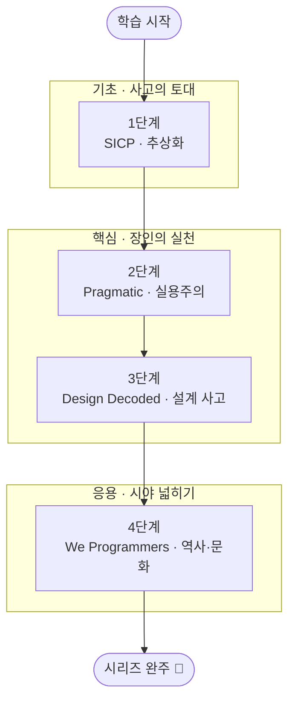

## 소개

좋은 코드를 빠르게 만들어 내는 능력은 프레임워크나 언어 문법이 아니라, 추상화를 다루는 사고력과 매일의 작은 실천 습관에서 나옵니다. 도구는 몇 년이면 낡지만 "어떻게 생각하고 어떻게 일하는가"라는 장인정신(Craftsmanship)은 경력 전체를 관통합니다. 이 분야가 필수인 이유는 분명합니다. 같은 문제를 받아도 장인은 더 단순하고, 더 바꾸기 쉽고, 더 오래가는 해법을 내놓기 때문입니다.

이 커리큘럼은 그 토대를 4권의 고전으로 쌓아 올립니다. 프로그래밍의 본질과 추상화를 다루는 *Structure and Interpretation of Computer Programs*(SICP), 실용주의 장인의 실천 습관을 모은 *The Pragmatic Programmer* 20주년판, 전문가가 설계를 사고하는 방식을 정리한 *Software Design Decoded*, 그리고 Ada에서 AI까지 프로그래밍의 역사와 문화를 조망하는 *We Programmers*입니다. 기초로 사고의 토대를 다지고, 핵심으로 매일의 실천과 전문가의 사고법을 익히고, 응용(교양)으로 시야를 넓히는 흐름입니다.

이 글은 `Craftsmanship-Essential` 시리즈의 **마스터 로드맵**입니다. 각 단계의 핵심 항목을 정복할 때마다 체크박스를 채우고 상세 포스트를 연결하는 **도장깨기** 방식으로 진행 상황을 추적합니다.

## 학습 흐름

4단계는 아래 순서대로 진행하는 것을 권장합니다. **기초**(추상화·프로그래밍의 본질)로 사고의 토대를 다지고, **핵심**(실용주의 실천·전문가의 설계 사고)으로 장인의 일하는 법을 익힌 뒤, **응용(교양)**(역사·문화)으로 시야를 넓히는 흐름입니다.

## 학습 진행 현황

> 완료한 항목에는 상세 포스트 링크가 연결됩니다. 학습이 진행될 때마다 체크박스와 진행률을 갱신합니다.

- 현재 완료한 항목: **0개**
- 전체 항목: **19개**
- 진행률: **0%**

## 1단계: Structure and Interpretation of Computer Programs (SICP) — 추상화와 프로그래밍의 본질

Abelson & Sussman의 SICP는 "프로그램은 사람이 읽기 위해 쓰고, 기계가 실행하는 것은 부수적"이라는 관점에서 추상화의 힘을 가르칩니다. 언어 문법이 아니라 복잡성을 통제하는 사고 도구를 익히는 단계입니다.

- [ ] **프로시저 추상화(Procedural Abstraction)**: 함수로 과정을 캡슐화하고, 블랙박스로 합성하기
- [ ] **재귀와 반복(Recursion & Iteration)**: 재귀적 과정·반복적 과정과 프로세스의 형태(shape) 이해
- [ ] **고차 함수(Higher-Order Procedures)**: 함수를 인자·반환값으로 다루며 패턴을 추상화
- [ ] **데이터 추상화(Data Abstraction)**: 생성자·선택자와 추상화 장벽(abstraction barrier)
- [ ] **상태·환경·평가 모델(State & Evaluation)**: 환경 모델, 대입(assignment)과 상태가 만드는 복잡성
- [ ] **메타순환 평가기(Metacircular Evaluator)**: 평가가 곧 데이터라는 통찰과 언어로 언어 만들기

## 2단계: The Pragmatic Programmer (20th Anniversary Edition) — 실용주의 장인정신

Andrew Hunt & David Thomas의 책은 추상적 이상이 아니라 매일 반복하는 작은 실천 습관으로 장인정신을 정의합니다. "깨진 창문을 방치하지 마라" 같은 원칙을 일하는 방식으로 체화하는 단계입니다.

- [ ] **DRY와 직교성(Orthogonality)**: 지식의 중복 제거와 결합도 낮추기
- [ ] **깨진 창문 이론 & 충분히 좋은 소프트웨어**: 작은 부패를 방치하지 않는 태도와 실용적 품질 기준
- [ ] **예광탄과 프로토타이핑(Tracer Bullets)**: 끝에서 끝까지 빠르게 연결하고 학습하기
- [ ] **계약에 의한 설계와 방어적 코딩**: assertion, 단언, 일찍 죽기(crash early)
- [ ] **리팩터링·테스트·자동화 습관**: 코드를 정원처럼 가꾸고 반복 작업을 도구로 처리
- [ ] **지식 포트폴리오와 평범한 장인정신**: 꾸준한 학습 투자와 책임지는 직업윤리

## 3단계: Software Design Decoded — 전문가가 설계를 사고하는 66가지 방식

Marian Petre & André van der Hoek는 실제 전문가 설계자들을 관찰해 그들이 "무엇을 다르게 생각하는가"를 66개의 짧은 통찰로 정리했습니다. 정답 절차가 아니라 사고 습관을 체득하는 단계입니다.

- [ ] **문제 재구성(Reframing the Problem)**: 주어진 문제를 의심하고 더 나은 문제로 바꾸기
- [ ] **스케치와 외부화(Sketching)**: 생각을 종이·화이트보드로 꺼내 함께 추론하기
- [ ] **트레이드오프와 제약 다루기**: 제약을 적으로 보지 않고 설계의 지렛대로 활용
- [ ] **시뮬레이션과 멘탈 모델**: 머릿속에서 시나리오를 돌려 설계를 검증하기
- [ ] **협업·소통으로서의 설계**: 설계를 대화·합의·공유된 이해로 다루기

## 4단계: We Programmers — Ada에서 AI까지, 프로그래밍의 역사와 문화

이 책은 Ada Lovelace에서 현대 AI 시대까지 프로그래머라는 직업의 계보를 따라가며, 우리가 선 자리를 역사적·문화적 맥락에서 비춰 줍니다. 기술 습득을 넘어 직업적 정체성과 시야를 넓히는 교양 단계입니다.

- [ ] **프로그래밍의 계보(Ada to AI)**: 선구자들의 발자취와 패러다임의 변천
- [ ] **장인정신의 문화와 직업윤리**: 세대를 잇는 가치와 책임의 전통

## 핵심 포인트

- **도구가 아니라 사고를 배운다**: SICP의 추상화는 어떤 언어를 쓰든 복잡성을 통제하는 보편 기술입니다.
- **장인정신은 습관의 총합**: Pragmatic의 작은 실천(DRY, 깨진 창문, 예광탄)을 매일 반복할 때 비로소 실력이 됩니다.
- **설계는 절차가 아니라 사고법**: Design Decoded는 정답 프로세스 대신 전문가의 사고 습관을 모방하게 합니다.
- **맥락이 시야를 넓힌다**: We Programmers로 역사를 알면 현재의 유행을 상대화하고 본질을 분별할 수 있습니다.
- **순서가 곧 효율**: 추상화(기초) → 실천·설계(핵심) → 역사·문화(응용)의 흐름이 학습 효과를 극대화합니다.
- **도장깨기로 누적된다**: 각 단계의 항목을 하나씩 정복하며 진행률을 시각화해 동기를 유지합니다.

## 추천 학습 순서

먼저 **1단계 SICP**로 추상화와 프로그래밍의 본질이라는 토대를 다지길 권합니다. 사고의 기준이 서야 이후의 실천과 설계 조언이 단순한 격언이 아니라 원리로 이해되기 때문입니다. 이어 **2단계 The Pragmatic Programmer**로 매일의 실천 습관을 몸에 익히고, **3단계 Software Design Decoded**로 전문가의 설계 사고법을 확장합니다. 두 책은 "실천"과 "사고"라는 서로 다른 축이라 핵심 묶음으로 함께 다룹니다. 마지막으로 **4단계 We Programmers**는 교양에 가깝지만, 앞 단계를 마친 뒤 읽어야 역사 속 통찰이 자신의 경험과 맞물려 더 깊게 와닿습니다.

## 결론

소프트웨어 장인정신은 한 권의 책이나 한 번의 깨달음으로 완성되지 않습니다. 추상화로 생각하는 힘, 매일 반복하는 작은 실천, 설계를 대하는 사고 습관, 그리고 직업의 역사를 아는 시야가 겹겹이 쌓일 때 비로소 장인의 토대가 됩니다.

이 로드맵을 따라 4권의 고전을 도장깨기로 정복하고 나면, 새로운 언어와 프레임워크가 무엇이든 흔들리지 않는 단단한 기초를 갖추게 될 것입니다. 한 항목씩, 한 단계씩 채워 나가며 시리즈 완주에 도전해 보세요.

### 다음 학습 (Next Learning)

- [OO-Design Essential Curriculum](/2026/06/19/oo-design-essential-curriculum.html) — 장인정신을 객체지향 설계로 구체화
- [Testing-Refactoring Essential Curriculum](/2026/06/19/testing-refactoring-essential-curriculum.html) — 장인의 핵심 도구, 테스트·리팩터링
- [Process Essential Curriculum](/2026/06/19/process-essential-curriculum.html) — 개인 기량을 팀 프로세스로 확장
