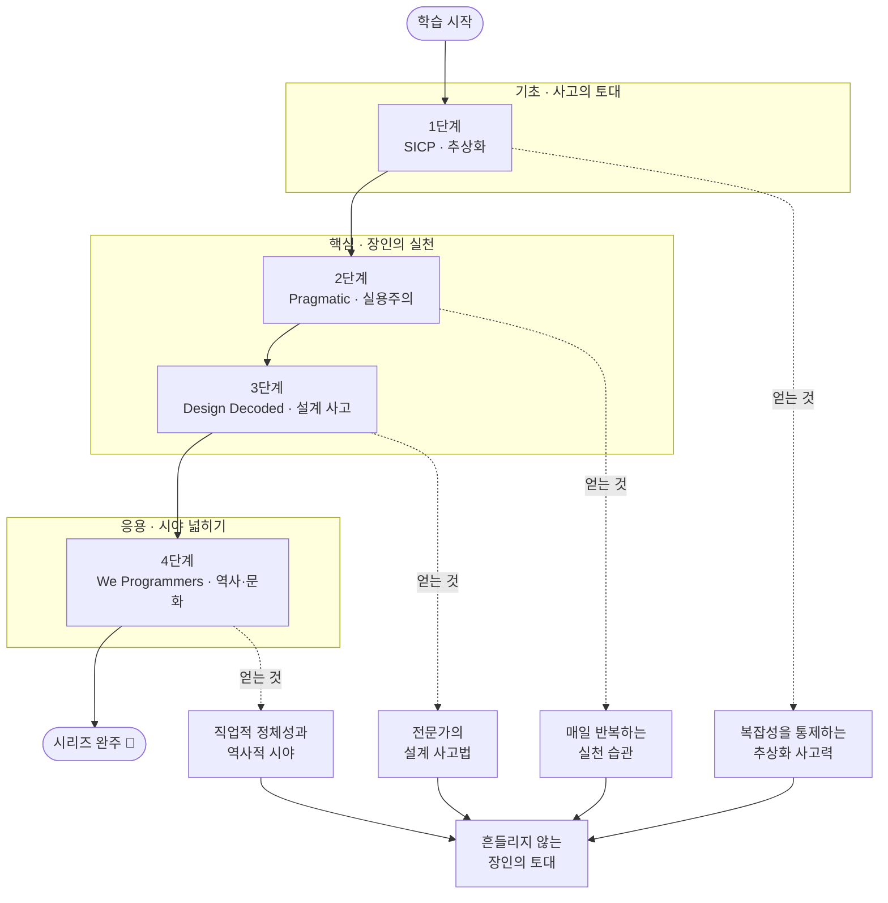

<figure class="post-figure post-figure--header">
<svg role="img" aria-label="소프트웨어 장인정신 학습 여정을 대장간 장면으로 묘사한 그림. 왼쪽부터 오른쪽으로 네 개의 모루가 한 단씩 높아지는 계단으로 놓여 있다. 1단계 모루에는 추상화를 뜻하는 겹친 상자(SICP·기초)가, 2단계 모루에는 매일의 실천을 뜻하는 망치(Pragmatic), 3단계 모루에는 설계 사고를 뜻하는 펼친 컴퍼스(Design Decoded), 4단계 모루에는 직업의 역사를 뜻하는 두루마리(We Programmers)가 놓인다. 세 단계 묶음 — 기초·핵심·응용 — 이 위쪽 띠로 표시되고, 맨 오른쪽 위에는 완주를 뜻하는 별이 빛난다." viewBox="0 0 680 300" xmlns="http://www.w3.org/2000/svg">
  <title>장인정신 학습 여정 — 추상화(기초) → 실천·설계(핵심) → 역사·문화(응용)</title>

  <!-- ===== top phase band ===== -->
  <text x="100" y="26" text-anchor="middle" font-size="11" fill="currentColor" font-weight="700" opacity="0.7">기초 · 사고의 토대</text>
  <line x1="38" y1="34" x2="162" y2="34" stroke="currentColor" stroke-width="1.5" opacity="0.3"/>
  <text x="346" y="26" text-anchor="middle" font-size="11" fill="currentColor" font-weight="700" opacity="0.7">핵심 · 장인의 실천</text>
  <line x1="208" y1="34" x2="484" y2="34" stroke="currentColor" stroke-width="1.5" opacity="0.3"/>
  <text x="592" y="26" text-anchor="middle" font-size="11" fill="currentColor" font-weight="700" opacity="0.7">응용 · 시야 넓히기</text>
  <line x1="530" y1="34" x2="654" y2="34" stroke="currentColor" stroke-width="1.5" opacity="0.3"/>

  <!-- ===== ground line ===== -->
  <line x1="20" y1="270" x2="660" y2="270" stroke="currentColor" stroke-width="1.5" opacity="0.35"/>

  <!-- progress arrow connecting the four stages -->
  <path d="M70 210 C 180 170, 250 160, 300 142 S 470 100, 600 70" fill="none" stroke="var(--gold)" stroke-width="2" stroke-dasharray="5 5" opacity="0.8"/>

  <!-- ===== STAGE 1: SICP — abstraction (stacked boxes) ===== -->
  <rect x="46" y="226" width="108" height="14" rx="2" fill="var(--bg-sunken)" stroke="currentColor" stroke-width="1.5"/>
  <rect x="62" y="240" width="76" height="30" rx="2" fill="var(--bg-light)" stroke="currentColor" stroke-width="1.8"/>
  <text x="100" y="259" text-anchor="middle" font-size="8" fill="currentColor" opacity="0.7">모루 ①</text>
  <!-- abstraction = nested boxes -->
  <rect x="74" y="180" width="52" height="40" rx="2" fill="var(--bg-light)" stroke="var(--secondary-color)" stroke-width="2"/>
  <rect x="84" y="190" width="32" height="20" rx="1.5" fill="var(--bg-panel)" stroke="currentColor" stroke-width="1.5"/>
  <rect x="92" y="196" width="16" height="8" rx="1" fill="none" stroke="currentColor" stroke-width="1.3"/>
  <text x="100" y="162" text-anchor="middle" font-size="10.5" fill="currentColor" font-weight="700">SICP</text>
  <text x="100" y="174" text-anchor="middle" font-size="8.5" fill="currentColor" opacity="0.8">추상화</text>

  <!-- ===== STAGE 2: Pragmatic — daily practice (hammer) ===== -->
  <rect x="226" y="218" width="108" height="14" rx="2" fill="var(--bg-sunken)" stroke="currentColor" stroke-width="1.5"/>
  <rect x="242" y="232" width="76" height="38" rx="2" fill="var(--bg-light)" stroke="currentColor" stroke-width="1.8"/>
  <text x="280" y="255" text-anchor="middle" font-size="8" fill="currentColor" opacity="0.7">모루 ②</text>
  <!-- hammer -->
  <rect x="262" y="168" width="40" height="16" rx="2" fill="var(--bg-light)" stroke="var(--accent-color)" stroke-width="2"/>
  <rect x="277" y="184" width="10" height="28" rx="2" fill="var(--bg-sunken)" stroke="currentColor" stroke-width="1.5"/>
  <text x="282" y="150" text-anchor="middle" font-size="10.5" fill="currentColor" font-weight="700">Pragmatic</text>
  <text x="282" y="162" text-anchor="middle" font-size="8.5" fill="currentColor" opacity="0.8">실천</text>

  <!-- ===== STAGE 3: Design Decoded — design sense (compass) ===== -->
  <rect x="406" y="206" width="108" height="14" rx="2" fill="var(--bg-sunken)" stroke="currentColor" stroke-width="1.5"/>
  <rect x="422" y="220" width="76" height="50" rx="2" fill="var(--bg-light)" stroke="currentColor" stroke-width="1.8"/>
  <text x="460" y="249" text-anchor="middle" font-size="8" fill="currentColor" opacity="0.7">모루 ③</text>
  <!-- compass (open caliper) -->
  <circle cx="460" cy="150" r="5" fill="none" stroke="currentColor" stroke-width="1.8"/>
  <line x1="458" y1="154" x2="446" y2="194" stroke="var(--secondary-color)" stroke-width="2.4"/>
  <line x1="462" y1="154" x2="474" y2="194" stroke="var(--secondary-color)" stroke-width="2.4"/>
  <text x="460" y="134" text-anchor="middle" font-size="10" fill="currentColor" font-weight="700">Design Decoded</text>
  <text x="460" y="146" text-anchor="middle" font-size="8.5" fill="currentColor" opacity="0.8">설계 사고</text>

  <!-- ===== STAGE 4: We Programmers — history (scroll) ===== -->
  <rect x="538" y="194" width="108" height="14" rx="2" fill="var(--bg-sunken)" stroke="currentColor" stroke-width="1.5"/>
  <rect x="554" y="208" width="76" height="62" rx="2" fill="var(--bg-light)" stroke="currentColor" stroke-width="1.8"/>
  <text x="592" y="243" text-anchor="middle" font-size="8" fill="currentColor" opacity="0.7">모루 ④</text>
  <!-- scroll -->
  <rect x="572" y="150" width="40" height="36" rx="3" fill="var(--bg-panel)" stroke="var(--gold)" stroke-width="2"/>
  <line x1="580" y1="160" x2="604" y2="160" stroke="currentColor" stroke-width="1.3" opacity="0.7"/>
  <line x1="580" y1="168" x2="604" y2="168" stroke="currentColor" stroke-width="1.3" opacity="0.7"/>
  <line x1="580" y1="176" x2="596" y2="176" stroke="currentColor" stroke-width="1.3" opacity="0.7"/>
  <!-- completion star -->
  <path d="M610 96 l4 9 10 1 -7.5 7 2 10 -8.5 -5 -8.5 5 2 -10 -7.5 -7 10 -1 z" fill="var(--gold)" stroke="currentColor" stroke-width="1"/>
  <text x="592" y="124" text-anchor="middle" font-size="10" fill="currentColor" font-weight="700">We Programmers</text>
  <text x="592" y="136" text-anchor="middle" font-size="8.5" fill="currentColor" opacity="0.8">역사 · 문화</text>
</svg>
<figcaption>장인정신을 벼리는 네 개의 모루 — <strong>SICP</strong>(추상화, 기초)로 사고의 토대를 다지고, <strong>Pragmatic</strong>(실천)과 <strong>Software Design Decoded</strong>(설계 사고)라는 핵심으로 일하는 법을 익힌 뒤, <strong>We Programmers</strong>(역사·문화)라는 응용으로 시야를 넓혀 완주(★)에 이른다. 한 단씩 높아지는 모루가 곧 도장깨기의 누적이다.</figcaption>
</figure>

## 소개

좋은 코드를 빠르게 만들어 내는 능력은 프레임워크나 언어 문법이 아니라, 추상화를 다루는 사고력과 매일의 작은 실천 습관에서 나옵니다. 도구는 몇 년이면 낡지만 "어떻게 생각하고 어떻게 일하는가"라는 장인정신(Craftsmanship)은 경력 전체를 관통합니다. 이 분야가 필수인 이유는 분명합니다. 같은 문제를 받아도 장인은 더 단순하고, 더 바꾸기 쉽고, 더 오래가는 해법을 내놓기 때문입니다.

이 커리큘럼은 그 토대를 4권의 고전으로 쌓아 올립니다. 프로그래밍의 본질과 추상화를 다루는 *Structure and Interpretation of Computer Programs*(SICP), 실용주의 장인의 실천 습관을 모은 *The Pragmatic Programmer* 20주년판, 전문가가 설계를 사고하는 방식을 정리한 *Software Design Decoded*, 그리고 Ada에서 AI까지 프로그래밍의 역사와 문화를 조망하는 *We Programmers*입니다. 기초로 사고의 토대를 다지고, 핵심으로 매일의 실천과 전문가의 사고법을 익히고, 응용(교양)으로 시야를 넓히는 흐름입니다.

이 글은 `Craftsmanship-Essential` 시리즈의 **마스터 로드맵**입니다. 각 단계의 핵심 항목을 정복할 때마다 체크박스를 채우고 상세 포스트를 연결하는 **도장깨기** 방식으로 진행 상황을 추적합니다.

## 학습 흐름

4단계는 아래 순서대로 진행하는 것을 권장합니다. **기초**(추상화·프로그래밍의 본질)로 사고의 토대를 다지고, **핵심**(실용주의 실천·전문가의 설계 사고)으로 장인의 일하는 법을 익힌 뒤, **응용(교양)**(역사·문화)으로 시야를 넓히는 흐름입니다.

아래 다이어그램은 커리큘럼 전체의 척추입니다 — 각 단계를 정복하면 무엇을 얻는지(오른쪽 갈래), 그리고 그것들이 어떻게 하나의 장인 토대로 쌓이는지를 함께 보여 줍니다.

## 학습 진행 현황

> 완료한 항목에는 상세 포스트 링크가 연결됩니다. 학습이 진행될 때마다 체크박스와 진행률을 갱신합니다.

- 현재 완료한 항목: **19개**
- 전체 항목: **19개**
- 진행률: **100%** 🎉

## 1단계: Structure and Interpretation of Computer Programs (SICP) — 추상화와 프로그래밍의 본질

Abelson & Sussman의 SICP는 "프로그램은 사람이 읽기 위해 쓰고, 기계가 실행하는 것은 부수적"이라는 관점에서 추상화의 힘을 가르칩니다. 언어 문법이 아니라 복잡성을 통제하는 사고 도구를 익히는 단계입니다.

- [x] **프로시저 추상화(Procedural Abstraction)**: 함수로 과정을 캡슐화하고, 블랙박스로 합성하기 — [[상세](/2026/06/19/sicp.html)]
- [x] **재귀와 반복(Recursion & Iteration)**: 재귀적 과정·반복적 과정과 프로세스의 형태(shape) 이해 — [[상세](/2026/06/19/sicp.html)]
- [x] **고차 함수(Higher-Order Procedures)**: 함수를 인자·반환값으로 다루며 패턴을 추상화 — [[상세](/2026/06/19/sicp.html)]
- [x] **데이터 추상화(Data Abstraction)**: 생성자·선택자와 추상화 장벽(abstraction barrier) — [[상세](/2026/06/19/sicp.html)]
- [x] **상태·환경·평가 모델(State & Evaluation)**: 환경 모델, 대입(assignment)과 상태가 만드는 복잡성 — [[상세](/2026/06/19/sicp.html)]
- [x] **메타순환 평가기(Metacircular Evaluator)**: 평가가 곧 데이터라는 통찰과 언어로 언어 만들기 — [[상세](/2026/06/19/sicp.html)]

## 2단계: The Pragmatic Programmer (20th Anniversary Edition) — 실용주의 장인정신

Andrew Hunt & David Thomas의 책은 추상적 이상이 아니라 매일 반복하는 작은 실천 습관으로 장인정신을 정의합니다. "깨진 창문을 방치하지 마라" 같은 원칙을 일하는 방식으로 체화하는 단계입니다.

- [x] **DRY와 직교성(Orthogonality)**: 지식의 중복 제거와 결합도 낮추기 — [[상세](/2026/06/19/pragmatic-programmer.html)]
- [x] **깨진 창문 이론 & 충분히 좋은 소프트웨어**: 작은 부패를 방치하지 않는 태도와 실용적 품질 기준 — [[상세](/2026/06/19/pragmatic-programmer.html)]
- [x] **예광탄과 프로토타이핑(Tracer Bullets)**: 끝에서 끝까지 빠르게 연결하고 학습하기 — [[상세](/2026/06/19/pragmatic-programmer.html)]
- [x] **계약에 의한 설계와 방어적 코딩**: assertion, 단언, 일찍 죽기(crash early) — [[상세](/2026/06/19/pragmatic-programmer.html)]
- [x] **리팩터링·테스트·자동화 습관**: 코드를 정원처럼 가꾸고 반복 작업을 도구로 처리 — [[상세](/2026/06/19/pragmatic-programmer.html)]
- [x] **지식 포트폴리오와 평범한 장인정신**: 꾸준한 학습 투자와 책임지는 직업윤리 — [[상세](/2026/06/19/pragmatic-programmer.html)]

## 3단계: Software Design Decoded — 전문가가 설계를 사고하는 66가지 방식

Marian Petre & André van der Hoek는 실제 전문가 설계자들을 관찰해 그들이 "무엇을 다르게 생각하는가"를 66개의 짧은 통찰로 정리했습니다. 정답 절차가 아니라 사고 습관을 체득하는 단계입니다.

- [x] **문제 재구성(Reframing the Problem)**: 주어진 문제를 의심하고 더 나은 문제로 바꾸기 — [[상세](/2026/06/19/software-design-decoded.html)]
- [x] **스케치와 외부화(Sketching)**: 생각을 종이·화이트보드로 꺼내 함께 추론하기 — [[상세](/2026/06/19/software-design-decoded.html)]
- [x] **트레이드오프와 제약 다루기**: 제약을 적으로 보지 않고 설계의 지렛대로 활용 — [[상세](/2026/06/19/software-design-decoded.html)]
- [x] **시뮬레이션과 멘탈 모델**: 머릿속에서 시나리오를 돌려 설계를 검증하기 — [[상세](/2026/06/19/software-design-decoded.html)]
- [x] **협업·소통으로서의 설계**: 설계를 대화·합의·공유된 이해로 다루기 — [[상세](/2026/06/19/software-design-decoded.html)]

## 4단계: We Programmers — Ada에서 AI까지, 프로그래밍의 역사와 문화

이 책은 Ada Lovelace에서 현대 AI 시대까지 프로그래머라는 직업의 계보를 따라가며, 우리가 선 자리를 역사적·문화적 맥락에서 비춰 줍니다. 기술 습득을 넘어 직업적 정체성과 시야를 넓히는 교양 단계입니다.

- [x] **프로그래밍의 계보(Ada to AI)**: 선구자들의 발자취와 패러다임의 변천 — [[상세](/2026/06/19/we-programmers.html)]
- [x] **장인정신의 문화와 직업윤리**: 세대를 잇는 가치와 책임의 전통 — [[상세](/2026/06/19/we-programmers.html)]

## 핵심 포인트

- **도구가 아니라 사고를 배운다**: SICP의 추상화는 어떤 언어를 쓰든 복잡성을 통제하는 보편 기술입니다.
- **장인정신은 습관의 총합**: Pragmatic의 작은 실천(DRY, 깨진 창문, 예광탄)을 매일 반복할 때 비로소 실력이 됩니다.
- **설계는 절차가 아니라 사고법**: Design Decoded는 정답 프로세스 대신 전문가의 사고 습관을 모방하게 합니다.
- **맥락이 시야를 넓힌다**: We Programmers로 역사를 알면 현재의 유행을 상대화하고 본질을 분별할 수 있습니다.
- **순서가 곧 효율**: 추상화(기초) → 실천·설계(핵심) → 역사·문화(응용)의 흐름이 학습 효과를 극대화합니다.
- **도장깨기로 누적된다**: 각 단계의 항목을 하나씩 정복하며 진행률을 시각화해 동기를 유지합니다.

## 추천 학습 순서

먼저 **1단계 SICP**로 추상화와 프로그래밍의 본질이라는 토대를 다지길 권합니다. 사고의 기준이 서야 이후의 실천과 설계 조언이 단순한 격언이 아니라 원리로 이해되기 때문입니다. 이어 **2단계 The Pragmatic Programmer**로 매일의 실천 습관을 몸에 익히고, **3단계 Software Design Decoded**로 전문가의 설계 사고법을 확장합니다. 두 책은 "실천"과 "사고"라는 서로 다른 축이라 핵심 묶음으로 함께 다룹니다. 마지막으로 **4단계 We Programmers**는 교양에 가깝지만, 앞 단계를 마친 뒤 읽어야 역사 속 통찰이 자신의 경험과 맞물려 더 깊게 와닿습니다.

## 결론

소프트웨어 장인정신은 한 권의 책이나 한 번의 깨달음으로 완성되지 않습니다. 추상화로 생각하는 힘, 매일 반복하는 작은 실천, 설계를 대하는 사고 습관, 그리고 직업의 역사를 아는 시야가 겹겹이 쌓일 때 비로소 장인의 토대가 됩니다.

이 로드맵을 따라 4권의 고전을 도장깨기로 정복하고 나면, 새로운 언어와 프레임워크가 무엇이든 흔들리지 않는 단단한 기초를 갖추게 될 것입니다. 한 항목씩, 한 단계씩 채워 나가며 시리즈 완주에 도전해 보세요.

### 다음 학습 (Next Learning)

- [OO-Design Essential Curriculum](/2026/06/19/oo-design-essential-curriculum.html) — 장인정신을 객체지향 설계로 구체화
- [Testing-Refactoring Essential Curriculum](/2026/06/19/testing-refactoring-essential-curriculum.html) — 장인의 핵심 도구, 테스트·리팩터링
- [Process Essential Curriculum](/2026/06/19/process-essential-curriculum.html) — 개인 기량을 팀 프로세스로 확장
