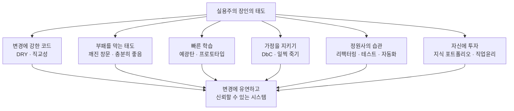

## 들어가며

이 글은 `Craftsmanship-Essential` 시리즈의 **2단계**입니다. 전체 학습 경로는 [Craftsmanship Essential Curriculum](/2026/06/19/craftsmanship-essential-curriculum.html)에서 확인할 수 있습니다.

1단계 [SICP: 추상화로 복잡성을 다스리다](/2026/06/19/sicp.html)에서 우리는 **생각하는 법**을 다뤘습니다. 복잡성을 추상화로 다스리고, 프로그램을 계산 과정에 대한 이야기로 바라보는 사고의 토대를 닦았죠. 하지만 좋은 사고가 곧바로 좋은 코드로 이어지지는 않습니다. 사고와 코드 사이에는 **매일 반복하는 습관**이라는 다리가 필요합니다.

이번 글의 텍스트는 Andrew Hunt와 David Thomas가 쓴 *The Pragmatic Programmer, 20th Anniversary Edition*입니다. 이 책의 원판은 1999년에 나왔고, 20주년 개정판은 그 통찰이 20년의 기술 변화를 견디고도 유효함을 증명했습니다. 책의 일관된 주제(thesis)는 단순합니다.

> 장인정신(craftsmanship)은 거창한 천재성이 아니라, **매일 쌓는 작은 습관의 총합**이다.

뛰어난 개발자는 어느 날 갑자기 영웅적인 코드를 쏟아내는 사람이 아닙니다. 중복을 보면 본능적으로 제거하고, 코드의 작은 부패를 그냥 지나치지 않으며, 위험을 일찍 드러내고, 반복 작업을 도구로 바꾸는 사람입니다. 이 글은 그런 습관들을 하나씩 풀어냅니다.

그리고 이 습관들이 몸에 배면, 자연스럽게 다음 질문으로 넘어가게 됩니다. "그렇다면 전문가는 설계를 어떻게 *생각*하는가?" 그 질문은 3단계 [Software Design Decoded: 전문가의 설계 사고](/2026/06/19/software-design-decoded.html)에서 본격적으로 다룹니다. 지금은 그 설계 사고를 떠받칠 일상의 토대를 단단히 다질 차례입니다.

<div class="post-summary-box" markdown="1">

### 📌 이 글에서 다루는 내용

#### 🔍 핵심 주제

- **DRY와 직교성(Orthogonality)**: 지식의 중복을 제거하고 모듈 간 결합도를 낮춰 변경의 파급을 통제한다
- **깨진 창문 이론 & 충분히 좋은 소프트웨어**: 작은 부패를 방치하지 않는 태도와, 완벽주의 대신 실용적 품질 기준을 세우는 균형
- **예광탄과 프로토타이핑(Tracer Bullets)**: 끝에서 끝까지 빠르게 연결해 학습하는 예광탄과, 버릴 코드로 위험을 탐색하는 프로토타이핑의 차이
- **계약에 의한 설계와 방어적 코딩**: assertion과 단언으로 가정을 명시하고, 문제가 보이면 일찍 죽기(crash early)
- **리팩터링·테스트·자동화 습관**: 코드를 정원처럼 꾸준히 가꾸고, 반복 작업은 사람이 아니라 도구에게 맡긴다
- **지식 포트폴리오와 평범한 장인정신**: 꾸준한 학습 투자와, 자기 일에 책임지는 평범한 직업윤리

</div>

## DRY와 직교성: 변경을 통제하는 두 축

소프트웨어에서 가장 비싼 활동은 작성이 아니라 **변경**입니다. 그리고 변경을 어렵게 만드는 가장 흔한 원인이 중복과 강한 결합입니다. DRY와 직교성은 이 둘을 정면으로 겨냥합니다.

### DRY는 코드가 아니라 지식의 중복을 말한다

DRY(Don't Repeat Yourself)는 흔히 "같은 코드를 두 번 쓰지 마라"로 오해됩니다. 책의 정의는 더 정밀합니다.

> 모든 **지식**은 시스템 안에서 단 하나의, 모호하지 않은, 권위 있는 표현을 가져야 한다.

핵심은 *코드의 우연한 중복*과 *지식의 중복*을 구별하는 것입니다. 우연히 같은 모양인 두 코드는 서로 다른 이유로 변할 수 있으므로 굳이 합칠 필요가 없습니다. 반면 같은 **비즈니스 규칙**이 여러 곳에 흩어져 있으면, 규칙이 바뀔 때 모든 곳을 빠짐없이 고쳐야 하고 — 하나라도 놓치면 버그가 됩니다.

```python
# DRY 위반: '성인 기준 나이 19세'라는 '지식'이 세 곳에 복제되어 있다
def can_sign_up(age):
    return age >= 19

def can_purchase_alcohol(age):
    return age >= 19          # 같은 규칙이 또 등장

def discount_rate(age):
    return 0.1 if age >= 19 else 0.0   # 또 한 번


# DRY 적용: 규칙(지식)을 한 곳에 권위 있게 표현한다
ADULT_AGE = 19

def is_adult(age):
    return age >= ADULT_AGE

def can_sign_up(age):        return is_adult(age)
def can_purchase_alcohol(age): return is_adult(age)
def discount_rate(age):      return 0.1 if is_adult(age) else 0.0
```

이제 성인 기준이 18세로 바뀌어도 고칠 곳은 단 한 군데입니다. DRY의 목적은 타이핑을 아끼는 게 아니라, **변경 지점을 하나로 모으는 것**입니다.

### 직교성: 서로 영향을 주지 않게 분리한다

직교성(orthogonality)은 기하학에서 빌려온 말로, "한 축을 움직여도 다른 축은 변하지 않는다"는 뜻입니다. 소프트웨어에서는 **한 모듈을 바꿔도 무관한 모듈은 영향을 받지 않는** 성질을 말합니다.

데이터베이스 코드와 화면 코드가 직교적이라면, DB를 PostgreSQL에서 다른 것으로 바꿔도 UI는 손댈 필요가 없습니다. 직교성이 깨진 시스템에서는 한 곳의 변경이 예상치 못한 곳으로 파급되어, "이걸 고치면 저기가 깨진다"는 공포가 생깁니다.

DRY와 직교성은 한 쌍입니다. **DRY는 중복을 없애 변경 지점을 하나로 모으고, 직교성은 결합을 끊어 그 변경이 다른 곳으로 새어나가지 않게 막습니다.** 둘이 함께 작동할 때 시스템은 변경에 유연해집니다.

## 깨진 창문 이론과 충분히 좋은 소프트웨어

이 두 항목은 얼핏 반대처럼 보입니다. 하나는 "작은 결함도 방치하지 마라"이고, 다른 하나는 "완벽을 좇지 마라"이니까요. 그러나 둘은 같은 동전의 양면 — **태도**와 **기준**입니다.

### 깨진 창문 이론: 작은 부패를 방치하지 않는 태도

범죄학의 깨진 창문 이론(broken windows theory)은, 깨진 창문 하나를 방치한 건물은 곧 다른 창문도 깨지고 결국 폐허가 된다고 말합니다. 코드도 같습니다. 한 군데의 나쁜 설계, 형편없는 임시 코드, 주석 처리된 죽은 코드를 그냥 두면, 팀은 무의식적으로 "여긴 원래 이래도 되는 곳"이라는 신호를 받습니다. 곧 두 번째, 세 번째 깨진 창문이 생기고 코드베이스는 빠르게 부패합니다.

처방은 단순합니다. **깨진 창문을 발견하면 즉시 고치거나, 적어도 명확히 표시하라.** 당장 고칠 시간이 없다면 임시 처리한 자리에 흔적을 남겨, "이건 정상이 아니다"라는 신호를 보존하는 것입니다.

```python
# 깨진 창문을 '보이게' 표시해 둔다 — 무언의 방치를 막는다
def parse_config(raw):
    # FIXME: 임시 파싱. 정식 스키마 검증으로 교체 필요 (TICKET-128)
    return raw.split(",")
```

### 충분히 좋은 소프트웨어: 실용적 품질 기준

반대편의 함정은 완벽주의입니다. 끝없는 다듬기는 출시를 막고, 더 다듬을수록 오히려 망가뜨리기도 합니다. "충분히 좋은(good enough) 소프트웨어"는 품질을 포기하라는 말이 **아닙니다**. 품질을 **명시적인 선택지로 끌어올려**, 사용자·이해관계자와 함께 "어디까지가 충분한가"를 정하라는 뜻입니다.

깨진 창문 이론이 "기준 이하로 떨어지는 부패를 막는 하한선"이라면, 충분히 좋은 소프트웨어는 "기준 이상으로 과잉 투자하지 않는 상한선"입니다. 장인은 이 두 선 사이에서 일합니다 — 부패는 막되, 완벽주의에 인질로 잡히지 않으면서요.

## 예광탄과 프로토타이핑: 빠르게 학습하는 두 방법

새 시스템 앞에서 가장 위험한 것은 불확실성입니다. 책은 이 불확실성을 줄이는 두 가지 빠른 학습 기법을 제시하는데, 자주 혼동되므로 **차이**를 분명히 해야 합니다.

### 예광탄(Tracer Bullets): 끝에서 끝까지 연결하기

예광탄은 어두운 밤에 실제 탄도를 눈으로 보며 조준을 교정하는 빛나는 탄환에서 따온 비유입니다. 소프트웨어의 예광탄은 **시스템의 모든 주요 레이어를 관통하는, 얇지만 진짜로 동작하는 한 줄기 경로**를 먼저 만드는 것입니다.

예를 들어 UI → API → 도메인 로직 → DB를 한 번에 꿰뚫는 최소 기능 하나를 끝에서 끝까지(end-to-end) 동작시킵니다. 기능은 빈약하지만 구조는 진짜입니다. 이 코드는 **버리지 않고**, 이후 살을 붙여나가는 골격이 됩니다. 예광탄의 가치는 아키텍처가 실제로 맞물리는지 일찍 확인하고, 팀이 보고 만질 수 있는 무언가를 일찍 손에 쥐는 데 있습니다.

### 프로토타이핑: 배우고 나면 버린다

프로토타입은 **특정 위험이나 미지의 영역을 탐색하기 위한 일회용 코드**입니다. 새 라이브러리의 성능이 충분한지, 어떤 UI 흐름이 자연스러운지를 빠르게 알아보려고 만듭니다. 견고함, 에러 처리, 완전성은 무시합니다 — 어차피 버릴 것이기 때문입니다. 프로토타입의 산출물은 코드가 아니라 **학습(lessons learned)**입니다.

| 구분 | 예광탄(Tracer Bullets) | 프로토타이핑(Prototyping) |
|------|----------------------|--------------------------|
| 목적 | 전체 구조를 끝에서 끝까지 연결·검증 | 특정 위험·미지수 탐색 |
| 코드 운명 | 유지하며 살을 붙임 (골격) | 학습 후 폐기 |
| 완성도 | 얇지만 진짜로 동작 | 동작 흉내만, 일회용 |

핵심 차이는 **코드의 운명**입니다. 예광탄은 남기고, 프로토타입은 버립니다. 둘을 혼동해 "프로토타입을 그대로 운영에 올리는" 것이 흔한 사고의 원인입니다.

## 계약에 의한 설계와 일찍 죽기

좋은 코드는 자신이 무엇을 약속하고 무엇을 기대하는지 분명히 합니다. 그리고 그 약속이 깨지면 조용히 넘어가지 않고 **시끄럽게, 즉시** 멈춥니다.

### 계약에 의한 설계(Design by Contract)

DbC(Design by Contract)는 모든 함수·메서드가 **선행 조건(precondition)**, **후행 조건(postcondition)**, **불변식(invariant)**이라는 계약을 갖는다고 봅니다.

- 선행 조건: 호출자가 보장해야 하는 입력의 조건
- 후행 조건: 함수가 보장하는 결과의 조건
- 불변식: 호출 전후로 늘 참이어야 하는 상태

이 계약을 코드로 명시하면, 버그가 발생했을 때 "누가 계약을 위반했는가"를 빠르게 가려낼 수 있습니다.

### 일찍 죽기(Crash Early): 방어적이되 너그럽지 않게

흔한 오해는 방어적 코딩이 "어떤 입력이든 어떻게든 처리해서 살아남는 것"이라는 생각입니다. 책의 조언은 반대입니다. **불가능해야 할 상태를 만나면, 그 자리에서 죽어라(crash early).** 손상된 상태로 계속 굴러가면, 진짜 원인에서 멀리 떨어진 곳에서 정체 모를 사고가 터져 디버깅이 지옥이 됩니다.

```python
def average(numbers):
    # 선행 조건: 비어 있지 않은 시퀀스 — 위반 시 '일찍, 시끄럽게' 죽는다
    assert len(numbers) > 0, "average()는 빈 리스트를 받을 수 없다"

    total = sum(numbers)
    result = total / len(numbers)

    # 후행 조건: 평균은 최솟값과 최댓값 사이에 있어야 한다 (계산 가정 검증)
    assert min(numbers) <= result <= max(numbers), "평균 계산 불변식 위반"
    return result


# 호출자가 계약을 어기면 즉시 AssertionError로 터진다 — 원인 지점에서 멈춘다
average([])   # AssertionError: average()는 빈 리스트를 받을 수 없다
```

여기서 `assert`는 "일어날 수 없다고 믿는 일"을 검사하는 도구입니다. 사용자 입력 검증 같은 *예상 가능한* 오류 처리와는 다릅니다 — 그건 정식 에러 처리로 다뤄야 합니다. assertion은 **프로그래머의 가정**을 지키는 장치이고, 가정이 깨지면 일찍 죽는 것이 가장 친절한 디버깅 도움입니다.

## 리팩터링·테스트·자동화: 정원사의 습관

책은 소프트웨어를 건축이 아니라 **정원(gardening)**에 비유합니다. 정원은 한 번 짓고 끝나는 게 아니라, 끊임없이 솎아내고 가지치고 옮겨 심으며 가꾸는 대상입니다. 이 비유를 떠받치는 세 가지 일상 습관이 리팩터링, 테스트, 자동화입니다.

### 리팩터링: 통증이 느껴질 때 일찍, 자주

리팩터링은 외부 동작을 바꾸지 않고 내부 구조를 개선하는 일입니다. 핵심은 "언젠가 대대적으로"가 아니라, **중복이 보이거나, 설계가 현실과 어긋나거나, 코드 냄새가 날 때 즉시, 조금씩** 하는 것입니다. 큰 리팩터링은 위험하지만, 작은 리팩터링을 자주 하면 코드는 항상 깨끗한 상태에 머뭅니다.

### 테스트: 리팩터링을 가능하게 하는 안전망

리팩터링을 두려움 없이 하려면 안전망이 필요합니다. 그것이 테스트입니다. 테스트가 있으면 구조를 바꿔도 동작이 보존됐는지 즉시 확인할 수 있고, 그래서 리팩터링은 도박이 아니라 일상이 됩니다. 테스트는 또한 계약(DbC)을 실행 가능한 명세로 박제하는 방법이기도 합니다.

### 자동화: 사람이 반복하면 사람이 틀린다

```python
# 손으로 매번 하던 배포 점검을 스크립트로 박제한다
# - 사람은 단계를 빼먹지만, 스크립트는 빼먹지 않는다
import subprocess, sys

CHECKS = [
    ["pytest", "-q"],            # 테스트 통과 확인
    ["ruff", "check", "."],      # 린트 확인
    ["mypy", "src"],             # 타입 검사
]

def main():
    for cmd in CHECKS:
        if subprocess.run(cmd).returncode != 0:
            print(f"[FAIL] {' '.join(cmd)}")
            sys.exit(1)   # 하나라도 실패하면 일찍 죽기
    print("[OK] 모든 점검 통과")

if __name__ == "__main__":
    main()
```

장인은 같은 일을 두 번 손으로 하면 불편함을 느낍니다. 빌드, 테스트, 배포, 환경 설정처럼 반복되는 작업은 사람의 기억력이 아니라 **스크립트와 도구**에 맡깁니다. 자동화는 실수를 줄이고, 사람의 에너지를 진짜 생각이 필요한 곳에 쓰게 해줍니다.

## 지식 포트폴리오와 평범한 장인정신

마지막 두 항목은 코드가 아니라 **사람**, 즉 개발자 자신에 관한 것입니다.

### 지식 포트폴리오: 학습을 투자처럼 관리하라

책은 당신의 지식과 경험을 **금융 포트폴리오**처럼 다루라고 권합니다.

- **꾸준히 투자하라**: 적은 양이라도 정기적으로 새로운 것을 배운다 (매년 새 언어 하나, 매달 기술서적 한 권 같은 습관).
- **다변화하라**: 한 기술에만 올인하지 말고 폭을 넓힌다.
- **위험을 관리하라**: 안정적인 기술과 떠오르는 기술에 균형 있게 분산한다.
- **싸게 사서 비싸게 팔라**: 아직 덜 알려졌지만 유망한 기술을 미리 학습해 둔다.

기술은 빠르게 낡습니다. 지식 포트폴리오를 의식적으로 관리하는 개발자는, 시장이 변할 때 자산이 함께 낡아버리는 위험을 분산시킵니다.

### 평범한 장인정신: 책임지는 직업윤리

이 책이 말하는 장인정신은 천재의 재능이 아니라 **평범한 사람의 직업윤리**입니다.

- 자신의 일과 그 결과에 책임을 진다 — "내 잘못이 아니다"라는 변명 대신 대안을 제시한다.
- 모른다고 말할 줄 알고, 잘못된 약속을 하지 않는다.
- 자신의 코드와 추정에 자부심을 갖되, 비판에는 방어가 아니라 학습으로 반응한다.

특별히 영웅적이지 않은, 매일의 성실함 — 이것이 책 전체를 관통하는 정서입니다. 앞서 다룬 모든 습관(DRY, 깨진 창문 고치기, 일찍 죽기, 자동화)은 결국 이 평범한 책임감의 구체적 표현입니다.



## 마무리

*The Pragmatic Programmer*가 말하는 장인정신은 한 번의 도약이 아니라 **매일의 작은 습관**입니다. 지식의 중복을 제거하는 DRY와 결합을 끊는 직교성으로 변경을 통제하고, 깨진 창문을 방치하지 않되 완벽주의의 인질이 되지 않는 균형을 잡습니다. 예광탄으로 구조를 끝에서 끝까지 빠르게 검증하고, 프로토타입으로는 위험만 탐색한 뒤 버립니다. 계약으로 가정을 명시하고 그 가정이 깨지면 일찍 죽으며, 코드를 정원처럼 리팩터링·테스트·자동화로 가꿉니다. 그리고 지식 포트폴리오와 평범한 직업윤리로 자기 자신에게도 꾸준히 투자합니다.

이 습관들이 손끝에 배면, 더 이상 "어떻게 하면 코드가 안 깨질까"를 걱정하는 단계에 머물지 않습니다. 그다음 질문은 더 높은 곳에 있습니다 — **전문가들은 좋은 설계를 어떻게 *생각*하는가?** 일상의 실천(daily practice)에서 설계 사고(design thinking)로 올라가는 그 다리를, 3단계에서 건너갑니다.

### 다음 학습

- 전체 학습 경로: [Craftsmanship Essential Curriculum](/2026/06/19/craftsmanship-essential-curriculum.html)
- 이전 단계 다시 보기 (1단계): [SICP: 추상화로 복잡성을 다스리다](/2026/06/19/sicp.html)
- 다음 단계 (3단계): [Software Design Decoded: 전문가의 설계 사고](/2026/06/19/software-design-decoded.html)
