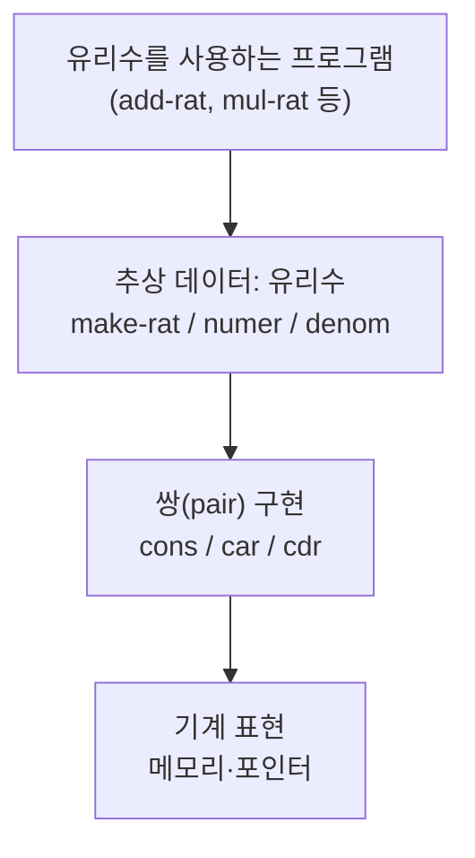
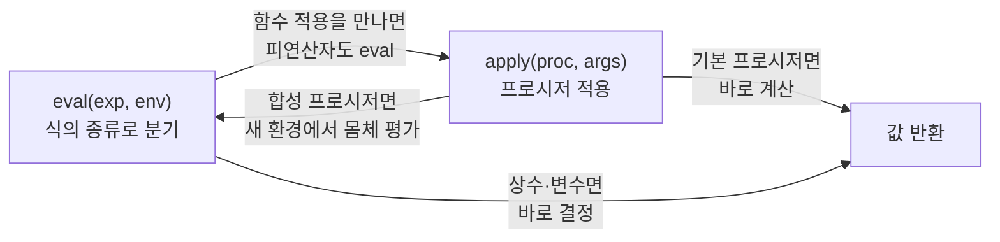

## 들어가며

이 글은 `Craftsmanship-Essential` 시리즈의 **1단계**입니다. 전체 학습 흐름은
[Craftsmanship Essential Curriculum](/2026/06/19/craftsmanship-essential-curriculum.html)에서
확인할 수 있습니다.

소프트웨어 장인의 길은 새로운 프레임워크나 최신 문법을 외우는 데서 시작하지 않습니다.
그것은 **복잡성을 다스리는 법**, 즉 **추상화로 사고하는 법**에서 출발합니다. 그래서 이
시리즈의 첫 책은 Harold Abelson과 Gerald Jay Sussman의
*Structure and Interpretation of Computer Programs* (보통 **SICP**, 한국에서는
"마법사 책"으로도 불립니다)입니다. MIT의 전설적인 입문 과정 6.001의 교재였고, 수십 년이
지난 지금도 "프로그래밍을 어떻게 생각해야 하는가"를 가장 깊게 다루는 책으로 꼽힙니다.

SICP의 가장 유명한 명제는 이것입니다.

> **프로그램은 사람이 읽기 위해 쓰는 것이고, 기계가 실행하는 것은 부수적이다.**
> (Programs must be written for people to read, and only incidentally for machines to execute.)

이 문장이 책 전체의 방향을 결정합니다. 우리가 코드를 짜는 진짜 목적은 컴퓨터를 돌리는 것이
아니라, **생각을 정확하고 읽기 좋게 표현하는 것**입니다. 그 표현의 도구가 바로 추상화입니다.

이 글에서는 SICP의 뼈대를 이루는 여섯 가지 추상화 도구를 다룹니다. 예제는 SICP의 모국어인
**Scheme**으로 쓰되, 고차 함수처럼 한국어 독자에게 도움이 되는 곳에서는 Python 대응 예제를
짧게 곁들입니다. 문법 자체보다, 그 문법으로 무엇을 **추상화**할 수 있는지에 집중하세요.

여기서 익히는 "추상화로 사고하는 법"은, 이어지는 2단계
[The Pragmatic Programmer: 실용주의 장인의 습관](/2026/06/19/pragmatic-programmer.html)에서
다루는 매일의 실천 습관으로 자연스럽게 이어집니다.

<div class="post-summary-box" markdown="1">

### 📌 이 글에서 다루는 내용

#### 🔍 핵심 주제

- **프로시저 추상화(Procedural Abstraction)**: 과정을 함수로 캡슐화하고, 내부를 모른 채 블랙박스로 합성하기
- **재귀와 반복(Recursion & Iteration)**: 재귀적 과정과 반복적 과정, 그리고 프로세스의 형태(shape) 이해
- **고차 함수(Higher-Order Procedures)**: 함수를 인자·반환값으로 다루며 공통 패턴을 추상화
- **데이터 추상화(Data Abstraction)**: 생성자·선택자와 추상화 장벽(abstraction barrier)
- **상태·환경·평가 모델(State & Evaluation)**: 환경 모델, 그리고 대입(assignment)·상태가 만드는 복잡성
- **메타순환 평가기(Metacircular Evaluator)**: 평가가 곧 데이터라는 통찰과, 언어로 언어를 만드는 일

</div>

## 프로시저 추상화: 과정을 블랙박스로 묶기

추상화의 가장 기본 단위는 **프로시저(procedure)**, 즉 함수입니다. 프로시저 추상화의 핵심은
"어떻게 하는가(how)"를 이름 뒤에 숨기고, 쓰는 쪽은 "무엇을 하는가(what)"만 알면 된다는 것입니다.

예를 들어 제곱근을 구하는 절차를 생각해 봅시다. Newton 방법으로 근사값을 개선하는 과정을
잘게 쪼개서, 각 단계에 의미 있는 이름을 붙입니다.

```scheme
;; 추정값 guess가 충분히 정확한지 판단 (절댓값 오차 기준)
(define (good-enough? guess x)
  (< (abs (- (square guess) x)) 0.001))

;; 추정값을 한 번 개선: guess와 x/guess의 평균
(define (improve guess x)
  (average guess (/ x guess)))

;; 충분히 정확해질 때까지 개선을 반복
(define (sqrt-iter guess x)
  (if (good-enough? guess x)
      guess
      (sqrt-iter (improve guess x) x)))

;; 외부에 노출되는 단 하나의 진입점
(define (my-sqrt x)
  (sqrt-iter 1.0 x))

(my-sqrt 2.0)   ; => 약 1.4142...
```

여기서 `my-sqrt`를 쓰는 사람은 `improve`나 `good-enough?`의 내부를 전혀 알 필요가 없습니다.
각 프로시저는 **블랙박스**이고, 우리는 이 블랙박스들을 합성(compose)해서 더 큰 블랙박스를
만듭니다. 만약 나중에 `good-enough?`의 판정 기준을 상대 오차로 바꾸더라도, `my-sqrt`를 쓰는
코드는 한 줄도 고칠 필요가 없습니다. 이것이 추상화가 주는 **변경의 국소화**입니다.

이름은 추상화의 도구입니다. `(< (abs (- (square guess) x)) 0.001)`이라는 식 대신
`good-enough?`라는 이름을 부여하는 순간, 우리는 디테일을 잊고 더 높은 층위에서 사고할 수
있게 됩니다. 좋은 이름 짓기가 곧 좋은 추상화입니다.

## 재귀와 반복: 같은 함수, 다른 프로세스의 형태

초보자가 자주 혼동하는 지점이 있습니다. **재귀적 프로시저(recursive procedure)**와
**재귀적 과정(recursive process)**은 다릅니다. 전자는 자기 자신을 호출하도록 "쓰인" 정의이고,
후자는 그 실행이 시간에 따라 펼쳐지는 **형태(shape)**입니다. 팩토리얼로 두 형태를 비교해 봅시다.

먼저 **선형 재귀적 과정(linear recursive process)**입니다.

```scheme
;; 선형 재귀적 과정: 곱셈이 "미뤄진 채" 쌓인다
(define (factorial n)
  (if (= n 1)
      1
      (* n (factorial (- n 1)))))
```

이 과정을 펼치면 다음과 같이 **부풀었다가 줄어드는** 모양이 됩니다.

```
(factorial 4)
(* 4 (factorial 3))
(* 4 (* 3 (factorial 2)))
(* 4 (* 3 (* 2 (factorial 1))))
(* 4 (* 3 (* 2 1)))      ; 여기까지 연기된 곱셈이 n개 쌓임
24
```

연기된 연산이 `n`에 비례해 쌓이므로 **공간 복잡도가 O(n)** 입니다. 인터프리터는 이 미뤄둔
곱셈들을 어딘가(콜 스택)에 기억해야 합니다.

같은 함수를 **선형 반복적 과정(linear iterative process)**으로도 쓸 수 있습니다. 결과를
누적하는 상태 변수를 들고 다니는 것이 핵심입니다.

```scheme
;; 선형 반복적 과정: 누적값 acc를 들고 다니며 계산
(define (factorial n)
  (fact-iter 1 1 n))

(define (fact-iter product counter max-count)
  (if (> counter max-count)
      product
      (fact-iter (* counter product)   ; 누적된 곱
                 (+ counter 1)
                 max-count)))
```

이 과정의 형태는 평평합니다.

```
(fact-iter 1 1 4)
(fact-iter 1 2 4)
(fact-iter 2 3 4)
(fact-iter 6 4 4)
(fact-iter 24 5 4)
24                  ; 어느 시점에서도 상태는 (product counter)뿐
```

연기된 연산이 없으므로 **공간 복잡도가 O(1)** 입니다. Scheme은 꼬리 호출 최적화(tail call
optimization)를 보장하므로, 이 정의는 별도 루프 구문 없이도 진짜 "반복"으로 실행됩니다.

요점: **재귀적으로 보이는 코드가 반드시 메모리를 많이 쓰는 것은 아닙니다.** 우리가 봐야 할
것은 코드의 모양이 아니라 그 코드가 만들어 내는 **프로세스의 형태**입니다. 이 관점은 성능을
직관적으로 추론하게 해 주는, SICP가 주는 첫 번째 큰 선물입니다.

## 고차 함수: 패턴 자체를 추상화하기

프로시저가 과정을 추상화한다면, **고차 함수(higher-order procedures)**는 **과정의 패턴**을
추상화합니다. 함수를 인자로 받거나 함수를 결과로 돌려주는 함수가 고차 함수입니다.

다음 두 합을 봅시다. (a) a부터 b까지 정수의 합, (b) a부터 b까지 세제곱의 합. 두 코드의 모양이
거의 같다는 것이 보일 것입니다. 차이는 "각 항을 어떻게 계산하는가"와 "다음 항으로 어떻게
넘어가는가"뿐입니다. 그 차이를 **함수 인자로 뽑아내면** 공통 골격을 한 번만 쓰면 됩니다.

```scheme
;; sum: term(항 계산)과 next(다음 항)을 인자로 받는 일반화된 합
(define (sum term a next b)
  (if (> a b)
      0
      (+ (term a)
         (sum term (next a) next b))))

(define (inc n) (+ n 1))
(define (cube x) (* x x x))

;; a부터 b까지 정수의 합
(define (sum-integers a b)
  (sum (lambda (x) x) a inc b))

;; a부터 b까지 세제곱의 합
(define (sum-cubes a b)
  (sum cube a inc b))

(sum-integers 1 10)  ; => 55
(sum-cubes 1 3)      ; => 36  (1 + 8 + 27)
```

`sum`은 "어떤 항을, 어떻게 진행하며 더한다"는 **합산이라는 개념 자체**를 표현합니다. 시그마
기호(Σ)를 코드로 옮긴 셈입니다. 새 합산이 필요할 때마다 루프를 다시 쓰는 대신, 두 함수만
끼워 넣으면 됩니다. 이것이 패턴의 추상화입니다.

같은 아이디어를 Python으로 보면 한국어 독자에게 더 익숙할 수 있습니다.

```python
# Python에도 같은 추상화가 있다: 함수를 인자로 받는 고차 함수
def summation(term, a, nxt, b):
    total = 0
    while a <= b:
        total += term(a)
        a = nxt(a)
    return total

summation(lambda x: x,       1, lambda n: n + 1, 10)  # => 55
summation(lambda x: x ** 3,  1, lambda n: n + 1, 3)   # => 36
```

`map`, `filter`, `reduce`, 데코레이터, 콜백, 전략(Strategy) 패턴 — 현대 코드에서 늘 마주치는
이 도구들이 전부 같은 통찰의 후손입니다. 함수를 값처럼 다룰 수 있으면, 우리는 "데이터의
변환"뿐 아니라 "변환 방법 자체"를 인자로 주고받을 수 있습니다.

## 데이터 추상화: 추상화 장벽 세우기

프로시저 추상화가 "과정"을 숨겼다면, **데이터 추상화(data abstraction)**는 "표현"을 숨깁니다.
핵심은 **생성자(constructor)** 와 **선택자(selector)** 를 정의하고, 데이터를 쓰는 코드가
이 둘만 통하도록 강제하는 것입니다. 이때 생기는 경계가 **추상화 장벽(abstraction barrier)** 입니다.

유리수(rational number)를 예로 들어 봅시다. Scheme의 기본 쌍(pair)인 `cons`/`car`/`cdr`
위에 유리수 추상을 올립니다.

```scheme
;; 생성자: 분자 n, 분모 d로 유리수를 만든다
(define (make-rat n d) (cons n d))

;; 선택자: 분자와 분모를 꺼낸다
(define (numer x) (car x))
(define (denom x) (cdr x))

;; 유리수 덧셈 — numer/denom/make-rat만 사용한다(쌍 구조를 직접 안 만짐)
(define (add-rat x y)
  (make-rat (+ (* (numer x) (denom y))
               (* (numer y) (denom x)))
            (* (denom x) (denom y))))

(define (print-rat x)
  (display (numer x)) (display "/") (display (denom x)))

(print-rat (add-rat (make-rat 1 2) (make-rat 1 3)))  ; => 5/6
```

`add-rat`은 `cons`나 `car`를 직접 부르지 않습니다. 오직 `numer`, `denom`, `make-rat`만
사용합니다. 덕분에 내일 우리가 유리수를 약분하도록 `make-rat`을 바꾸거나, 표현을 `cons`가
아닌 리스트나 해시로 바꾸더라도, `add-rat`을 비롯한 상위 코드는 손댈 필요가 없습니다.

```scheme
;; 표현을 바꿔도 상위 코드는 안전: 생성 시점에 약분하도록 개선
(define (make-rat n d)
  (let ((g (gcd n d)))
    (cons (/ n g) (/ d g))))

(print-rat (make-rat 6 9))   ; => 2/3  (상위 코드는 그대로)
```

추상화 장벽을 층으로 그리면 다음과 같습니다. 각 층은 바로 아래 층의 인터페이스에만 의존하고,
그 아래의 구현 디테일은 모릅니다. **무엇에 의존하는지를 통제하는 것**이 변경에 강한 설계의 본질입니다.



이 그림에서 위쪽 층의 코드는 아래 층의 "이름(인터페이스)"만 알 뿐, 그 아래 구현은 모른다는
점이 핵심입니다. 인터페이스가 계약(contract)이고, 장벽은 그 계약을 강제하는 벽입니다.

## 상태·환경·평가 모델: 대입이 가져오는 대가

지금까지의 예제는 모두 **순수(pure)** 했습니다. 같은 인자를 주면 늘 같은 값이 나오죠. 그런데
프로그램에 **상태(state)** 와 **대입(assignment, `set!`)** 이 들어오면 이야기가 달라집니다.
이를 정확히 추론하려면 **환경 모델(environment model)** 이 필요합니다.

환경은 "이름 → 값"의 묶음(프레임frame)들이 사슬처럼 연결된 구조입니다. 변수를 찾을 때는 현재
프레임부터 바깥쪽으로 올라가며 이름을 찾고, `set!`은 그 이름이 묶인 프레임의 값을 **바꿉니다**.

```scheme
;; 클로저로 은행 계좌의 상태를 캡슐화
(define (make-account balance)
  (lambda (amount)
    (set! balance (+ balance amount))  ; 내부 상태를 변경(대입)
    balance))

(define acc (make-account 100))
(acc -30)   ; => 70
(acc  50)   ; => 120  같은 인자라도 호출 시점마다 결과가 달라진다
```

`make-account`를 호출할 때마다 `balance`를 담은 **새 프레임**이 만들어지고, 반환된 람다는 그
프레임을 기억합니다(클로저). 같은 `acc`에 같은 인자를 줘도 결과가 달라지는 이유가 여기 있습니다.

상태는 강력하지만 **대가**가 따릅니다. 순수 함수는 "값으로만" 추론하면 됐지만, 상태가 있으면
이제 **시간과 순서**까지 추론해야 합니다. SICP는 이를 명확히 경고합니다.

- **참조 투명성(referential transparency)이 깨진다.** `(acc -30)`을 그 결괏값으로 치환할 수
  없습니다. 호출 순서에 따라 의미가 달라지니까요.
- **동일성(identity)과 동등성(equality)이 갈라진다.** 두 계좌가 "같은 잔액"인 것과 "같은
  계좌"인 것은 다른 문제가 됩니다.
- **동시성(concurrency)이 어려워진다.** 공유된 가변 상태는 경쟁 조건(race condition)의 씨앗입니다.

즉, 대입은 표현력을 주는 대신 추론의 비용을 청구합니다. 그래서 장인은 상태를 **함부로 흩뿌리지
않고**, 꼭 필요한 곳에 가두고(클로저·모듈 경계), 가능한 한 순수한 영역을 넓게 유지합니다. 이
긴장 관계 — "표현력 대 추론 용이성" — 를 이해하는 것이 SICP 3장의 핵심 교훈입니다.

## 메타순환 평가기: 평가가 곧 데이터

SICP의 정점은 4장의 **메타순환 평가기(metacircular evaluator)** 입니다. Scheme으로 Scheme
인터프리터를 만드는 일이죠. "메타순환"이란, 해석되는 언어와 해석하는 언어가 같다는 뜻입니다.

이것이 가능한 이유는 Lisp의 **동형성(homoiconicity)** 때문입니다. Lisp에서 코드는 곧
리스트, 즉 데이터입니다. `(+ 1 2)`는 "1과 2를 더하라는 명령"이면서 동시에 "기호 `+`와 숫자
`1`, `2`로 이루어진 리스트"입니다. **코드가 데이터이기 때문에**, 프로그램이 프로그램을 데이터로
받아 평가할 수 있습니다.

평가기의 심장은 서로를 부르는 두 프로시저, **`eval`과 `apply`** 의 순환입니다.

- `eval`: 표현식과 환경을 받아 값을 구한다. 식의 종류(상수·변수·람다·조합 등)에 따라 분기한다.
- `apply`: 프로시저와 인자들을 받아 적용한다. 프로시저 몸체를, 인자가 묶인 새 환경에서 `eval`한다.

```scheme
;; 메타순환 평가기의 골격 (핵심 분기만 발췌)
(define (eval exp env)
  (cond ((self-evaluating? exp) exp)                 ; 숫자·문자열 등
        ((variable? exp) (lookup-variable-value exp env))
        ((quoted? exp) (text-of-quotation exp))
        ((lambda? exp)                                ; 람다 → 프로시저 객체
         (make-procedure (lambda-parameters exp)
                         (lambda-body exp)
                         env))
        ((application? exp)                           ; 함수 적용
         (apply (eval (operator exp) env)
                (list-of-values (operands exp) env)))
        (else (error "Unknown expression" exp))))

(define (apply procedure arguments)
  (cond ((primitive-procedure? procedure)
         (apply-primitive-procedure procedure arguments))
        ((compound-procedure? procedure)
         ;; 몸체를, 매개변수에 인자를 묶은 새 환경에서 평가
         (eval-sequence
           (procedure-body procedure)
           (extend-environment
             (procedure-parameters procedure)
             arguments
             (procedure-environment procedure))))
        (else (error "Unknown procedure" procedure))))
```

`eval`은 함수를 적용해야 할 때 `apply`를 부르고, `apply`는 함수 몸체를 평가해야 할 때 다시
`eval`을 부릅니다. 이 **eval-apply 순환**이 프로그래밍 언어의 의미를 통째로 정의합니다.



이 한 장을 통과하면 사고가 바뀝니다. **언어는 신비로운 마법이 아니라, 우리가 직접 정의할 수
있는 평가 규칙의 집합**이라는 것을 체감하게 됩니다. 새 문법을 추가하고 싶다면? `eval`에
`cond` 분기를 하나 더 얹으면 됩니다. 도메인에 맞는 작은 언어(DSL)를 만드는 것, 매크로로
문법을 확장하는 것이 전부 같은 원리입니다. "평가가 곧 데이터"라는 통찰은, 추상화의 사다리에서
가장 높은 칸 — **언어로 언어를 만드는 능력** — 으로 우리를 데려갑니다.

## 마무리

SICP가 가르치는 것은 Scheme 문법이 아니라 **복잡성을 다스리는 추상화의 기술**입니다.

- **프로시저 추상화**로 과정을 블랙박스에 가두고, 이름으로 더 높은 층위에서 사고합니다.
- **재귀와 반복**을 구분하며, 코드의 모양이 아니라 **프로세스의 형태**로 비용을 추론합니다.
- **고차 함수**로 과정을 넘어 **패턴 자체**를 추상화합니다.
- **데이터 추상화**와 **추상화 장벽**으로 표현을 숨겨, 변경을 국소화합니다.
- **환경 모델**로 상태와 대입을 정확히 추론하고, 그 **대가**를 의식적으로 통제합니다.
- **메타순환 평가기**에서 "코드는 데이터"라는 통찰로, 언어로 언어를 만드는 정점에 도달합니다.

이 모든 것을 관통하는 한 문장은 책의 명제 그대로입니다 — "프로그램은 사람이 읽기 위해 쓴다."
추상화는 결국 **사람의 이해를 위한 도구**입니다.

이제 우리는 "추상화로 사고하는 법"이라는 토대를 얻었습니다. 다음 단계는 이 사고를 **매일의
작업 습관**으로 옮기는 일입니다.
[The Pragmatic Programmer: 실용주의 장인의 습관](/2026/06/19/pragmatic-programmer.html)에서는
DRY 원칙, 직교성, 깨진 창문 이론, 추적 가능한 코드 등 SICP의 추상화 정신을 현장에서 실천하는
구체적 습관들을 다룹니다. 생각하는 법에서 일하는 법으로, 한 걸음 나아갈 차례입니다.

### 다음 학습

- [Craftsmanship Essential Curriculum](/2026/06/19/craftsmanship-essential-curriculum.html) — 시리즈 전체 학습 로드맵과 진행 상황
- [The Pragmatic Programmer: 실용주의 장인의 습관](/2026/06/19/pragmatic-programmer.html) — 2단계: 추상화 사고를 매일의 실용주의 습관으로
