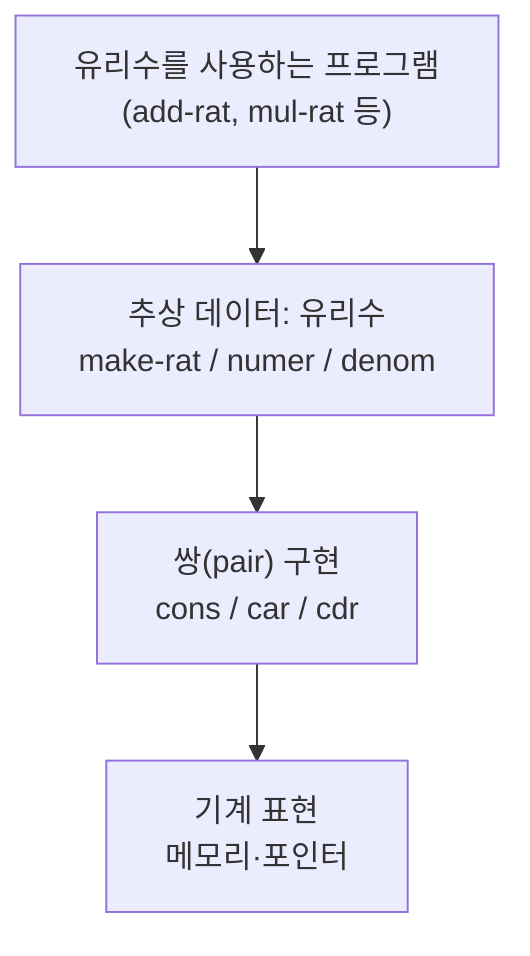
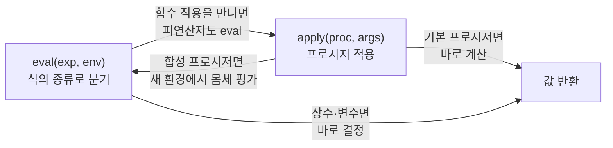

<figure class="post-figure post-figure--header">
<svg role="img" aria-label="SICP가 가르치는 추상화의 사다리를 한 장으로 그린 그림. 맨 아래 기계 표현 위로 추상화의 층이 한 칸씩 쌓인다. 1층은 프로시저 추상화로 여러 과정을 하나의 이름 붙은 블랙박스로 묶고, 2층은 데이터 추상화로 표현을 추상화 장벽 뒤에 숨기며, 3층은 고차 함수로 과정의 패턴 자체를 값으로 다루고, 가장 높은 칸은 메타언어적 추상화로 언어로 언어를 만든다. 오른쪽에는 eval과 apply가 서로를 부르며 도는 순환 고리가 그려져 사다리의 정점을 가리킨다." viewBox="0 0 680 320" xmlns="http://www.w3.org/2000/svg">
  <title>SICP — 추상화의 사다리: 프로시저 → 데이터 → 고차 함수 → 메타언어적 추상화</title>

  <text x="220" y="24" text-anchor="middle" font-size="12" fill="currentColor" font-weight="700" opacity="0.75">추상화의 사다리 — 복잡성을 한 층씩 다스리다</text>

  <!-- ===== bottom: machine representation ===== -->
  <rect x="40" y="256" width="360" height="34" rx="3" fill="var(--bg-sunken)" stroke="currentColor" stroke-width="1.6"/>
  <text x="220" y="277" text-anchor="middle" font-size="9.5" fill="currentColor" opacity="0.8" font-weight="700">기계 표현 — 메모리 · 포인터</text>

  <!-- ===== layer 1: procedural abstraction (black boxes -> one name) ===== -->
  <rect x="40" y="206" width="360" height="42" rx="3" fill="var(--bg-light)" stroke="currentColor" stroke-width="1.8"/>
  <text x="58" y="223" font-size="10" fill="currentColor" font-weight="700">1 · 프로시저 추상화</text>
  <text x="58" y="238" font-size="8" fill="currentColor" opacity="0.8">과정을 이름 붙은 블랙박스로 묶기</text>
  <!-- three small boxes folding into one -->
  <rect x="300" y="212" width="18" height="14" rx="2" fill="none" stroke="currentColor" stroke-width="1.4" opacity="0.6"/>
  <rect x="322" y="212" width="18" height="14" rx="2" fill="none" stroke="currentColor" stroke-width="1.4" opacity="0.6"/>
  <line x1="344" y1="219" x2="356" y2="219" stroke="var(--secondary-color)" stroke-width="2" marker-end="url(#sicp-arrow)"/>
  <rect x="362" y="210" width="30" height="18" rx="3" fill="var(--bg-panel)" stroke="var(--accent-color)" stroke-width="2"/>
  <text x="377" y="232" text-anchor="middle" font-size="6.5" fill="currentColor" opacity="0.75">f()</text>

  <!-- ===== layer 2: data abstraction (barrier) ===== -->
  <rect x="40" y="160" width="360" height="42" rx="3" fill="var(--bg-light)" stroke="currentColor" stroke-width="1.8"/>
  <text x="58" y="177" font-size="10" fill="currentColor" font-weight="700">2 · 데이터 추상화</text>
  <text x="58" y="192" font-size="8" fill="currentColor" opacity="0.8">표현을 추상화 장벽 뒤에 숨기기</text>
  <line x1="346" y1="164" x2="346" y2="198" stroke="var(--gold)" stroke-width="2.5" stroke-dasharray="3 3"/>
  <text x="376" y="176" text-anchor="middle" font-size="7" fill="currentColor" opacity="0.75">make /</text>
  <text x="376" y="186" text-anchor="middle" font-size="7" fill="currentColor" opacity="0.75">select</text>

  <!-- ===== layer 3: higher-order procedures (procedure as value) ===== -->
  <rect x="40" y="114" width="360" height="42" rx="3" fill="var(--bg-light)" stroke="currentColor" stroke-width="1.8"/>
  <text x="58" y="131" font-size="10" fill="currentColor" font-weight="700">3 · 고차 함수</text>
  <text x="58" y="146" font-size="8" fill="currentColor" opacity="0.8">과정의 패턴 자체를 값으로 다루기</text>
  <rect x="312" y="120" width="30" height="18" rx="3" fill="var(--bg-panel)" stroke="currentColor" stroke-width="1.6"/>
  <text x="327" y="133" text-anchor="middle" font-size="8" fill="currentColor" font-weight="700">g</text>
  <line x1="346" y1="129" x2="360" y2="129" stroke="var(--secondary-color)" stroke-width="2" marker-end="url(#sicp-arrow)"/>
  <rect x="362" y="118" width="30" height="22" rx="3" fill="var(--bg-panel)" stroke="var(--accent-color)" stroke-width="2"/>
  <text x="377" y="132" text-anchor="middle" font-size="8" fill="currentColor" font-weight="700">f(g)</text>

  <!-- ===== top: metalinguistic abstraction (language making language) ===== -->
  <rect x="40" y="64" width="360" height="44" rx="3" fill="var(--bg-panel)" stroke="var(--gold)" stroke-width="2.5"/>
  <text x="58" y="82" font-size="10.5" fill="currentColor" font-weight="700">4 · 메타언어적 추상화</text>
  <text x="58" y="98" font-size="8" fill="currentColor" opacity="0.85">코드가 곧 데이터 — 언어로 언어를 만들다</text>

  <!-- ascending guideline showing the ladder rising -->
  <line x1="48" y1="252" x2="48" y2="66" stroke="var(--accent-color)" stroke-width="2" marker-end="url(#sicp-arrow)" opacity="0.85"/>

  <!-- ===== right: eval-apply cycle = the summit ===== -->
  <line x1="404" y1="86" x2="448" y2="86" stroke="var(--gold)" stroke-width="2" stroke-dasharray="4 3" marker-end="url(#sicp-arrow)"/>
  <text x="556" y="44" text-anchor="middle" font-size="11" fill="currentColor" font-weight="700" opacity="0.75">정점: eval–apply 순환</text>
  <ellipse cx="556" cy="150" rx="92" ry="78" fill="none" stroke="currentColor" stroke-width="1" opacity="0.25"/>
  <rect x="492" y="74" width="86" height="34" rx="4" fill="var(--bg-light)" stroke="var(--accent-color)" stroke-width="2"/>
  <text x="535" y="95" text-anchor="middle" font-size="11" fill="currentColor" font-weight="700">eval</text>
  <rect x="540" y="192" width="86" height="34" rx="4" fill="var(--bg-light)" stroke="var(--secondary-color)" stroke-width="2"/>
  <text x="583" y="213" text-anchor="middle" font-size="11" fill="currentColor" font-weight="700">apply</text>
  <path d="M576 106 Q636 150 600 190" fill="none" stroke="var(--secondary-color)" stroke-width="2" marker-end="url(#sicp-arrow)"/>
  <path d="M540 200 Q478 156 510 108" fill="none" stroke="var(--secondary-color)" stroke-width="2" marker-end="url(#sicp-arrow)"/>
  <text x="556" y="156" text-anchor="middle" font-size="8" fill="currentColor" opacity="0.8" font-weight="700">코드 = 데이터</text>

  <defs>
    <marker id="sicp-arrow" markerWidth="8" markerHeight="8" refX="6" refY="4" orient="auto">
      <path d="M0,0 L8,4 L0,8 z" fill="var(--secondary-color)"/>
    </marker>
  </defs>
</svg>
<figcaption>SICP의 한 장 요약 — 추상화는 <strong>사다리</strong>처럼 쌓인다. 기계 표현 위로 <strong>프로시저 추상화</strong>(과정을 블랙박스로)→<strong>데이터 추상화</strong>(표현을 장벽 뒤로)→<strong>고차 함수</strong>(패턴을 값으로)가 한 칸씩 올라가고, 가장 높은 칸은 <strong>메타언어적 추상화</strong>다. 그 정점이 서로를 부르며 도는 <strong>eval–apply 순환</strong> — "코드가 곧 데이터"라는 통찰로 언어로 언어를 만든다.</figcaption>
</figure>

## 들어가며

이 글은 `Craftsmanship-Essential` 시리즈의 **1단계**입니다. 전체 학습 흐름은
[Craftsmanship Essential Curriculum](/2026/06/19/craftsmanship-essential-curriculum.html)에서
확인할 수 있습니다.

소프트웨어 장인의 길은 새로운 프레임워크나 최신 문법을 외우는 데서 시작하지 않습니다.
그것은 **복잡성을 다스리는 법**, 즉 **추상화로 사고하는 법**에서 출발합니다. 그래서 이
시리즈의 첫 책은 Harold Abelson과 Gerald Jay Sussman의
*Structure and Interpretation of Computer Programs* (보통 **SICP**, 한국에서는
"마법사 책"으로도 불립니다)입니다. MIT의 전설적인 입문 과정 6.001의 교재였고, 수십 년이
지난 지금도 "프로그래밍을 어떻게 생각해야 하는가"를 가장 깊게 다루는 책으로 꼽힙니다.

SICP의 가장 유명한 명제는 이것입니다.

> **프로그램은 사람이 읽기 위해 쓰는 것이고, 기계가 실행하는 것은 부수적이다.**
> (Programs must be written for people to read, and only incidentally for machines to execute.)

이 문장이 책 전체의 방향을 결정합니다. 우리가 코드를 짜는 진짜 목적은 컴퓨터를 돌리는 것이
아니라, **생각을 정확하고 읽기 좋게 표현하는 것**입니다. 그 표현의 도구가 바로 추상화입니다.

이 글에서는 SICP의 뼈대를 이루는 여섯 가지 추상화 도구를 다룹니다. 예제는 SICP의 모국어인
**Scheme**으로 쓰되, 고차 함수처럼 한국어 독자에게 도움이 되는 곳에서는 Python 대응 예제를
짧게 곁들입니다. 문법 자체보다, 그 문법으로 무엇을 **추상화**할 수 있는지에 집중하세요.

여기서 익히는 "추상화로 사고하는 법"은, 이어지는 2단계
[The Pragmatic Programmer: 실용주의 장인의 습관](/2026/06/19/pragmatic-programmer.html)에서
다루는 매일의 실천 습관으로 자연스럽게 이어집니다.

<div class="post-summary-box" markdown="1">

### 📌 이 글에서 다루는 내용

#### 🔍 핵심 주제

- **프로시저 추상화(Procedural Abstraction)**: 과정을 함수로 캡슐화하고, 내부를 모른 채 블랙박스로 합성하기
- **재귀와 반복(Recursion & Iteration)**: 재귀적 과정과 반복적 과정, 그리고 프로세스의 형태(shape) 이해
- **고차 함수(Higher-Order Procedures)**: 함수를 인자·반환값으로 다루며 공통 패턴을 추상화
- **데이터 추상화(Data Abstraction)**: 생성자·선택자와 추상화 장벽(abstraction barrier)
- **상태·환경·평가 모델(State & Evaluation)**: 환경 모델, 그리고 대입(assignment)·상태가 만드는 복잡성
- **메타순환 평가기(Metacircular Evaluator)**: 평가가 곧 데이터라는 통찰과, 언어로 언어를 만드는 일

</div>

## 프로시저 추상화: 과정을 블랙박스로 묶기

추상화의 가장 기본 단위는 **프로시저(procedure)**, 즉 함수입니다. 프로시저 추상화의 핵심은
"어떻게 하는가(how)"를 이름 뒤에 숨기고, 쓰는 쪽은 "무엇을 하는가(what)"만 알면 된다는 것입니다.

예를 들어 제곱근을 구하는 절차를 생각해 봅시다. Newton 방법으로 근사값을 개선하는 과정을
잘게 쪼개서, 각 단계에 의미 있는 이름을 붙입니다.

```scheme
;; 추정값 guess가 충분히 정확한지 판단 (절댓값 오차 기준)
(define (good-enough? guess x)
  (< (abs (- (square guess) x)) 0.001))

;; 추정값을 한 번 개선: guess와 x/guess의 평균
(define (improve guess x)
  (average guess (/ x guess)))

;; 충분히 정확해질 때까지 개선을 반복
(define (sqrt-iter guess x)
  (if (good-enough? guess x)
      guess
      (sqrt-iter (improve guess x) x)))

;; 외부에 노출되는 단 하나의 진입점
(define (my-sqrt x)
  (sqrt-iter 1.0 x))

(my-sqrt 2.0)   ; => 약 1.4142...
```

여기서 `my-sqrt`를 쓰는 사람은 `improve`나 `good-enough?`의 내부를 전혀 알 필요가 없습니다.
각 프로시저는 **블랙박스**이고, 우리는 이 블랙박스들을 합성(compose)해서 더 큰 블랙박스를
만듭니다. 만약 나중에 `good-enough?`의 판정 기준을 상대 오차로 바꾸더라도, `my-sqrt`를 쓰는
코드는 한 줄도 고칠 필요가 없습니다. 이것이 추상화가 주는 **변경의 국소화**입니다.

이름은 추상화의 도구입니다. `(< (abs (- (square guess) x)) 0.001)`이라는 식 대신
`good-enough?`라는 이름을 부여하는 순간, 우리는 디테일을 잊고 더 높은 층위에서 사고할 수
있게 됩니다. 좋은 이름 짓기가 곧 좋은 추상화입니다.

## 재귀와 반복: 같은 함수, 다른 프로세스의 형태

초보자가 자주 혼동하는 지점이 있습니다. **재귀적 프로시저(recursive procedure)**와
**재귀적 과정(recursive process)**은 다릅니다. 전자는 자기 자신을 호출하도록 "쓰인" 정의이고,
후자는 그 실행이 시간에 따라 펼쳐지는 **형태(shape)**입니다. 팩토리얼로 두 형태를 비교해 봅시다.

먼저 **선형 재귀적 과정(linear recursive process)**입니다.

```scheme
;; 선형 재귀적 과정: 곱셈이 "미뤄진 채" 쌓인다
(define (factorial n)
  (if (= n 1)
      1
      (* n (factorial (- n 1)))))
```

이 과정을 펼치면 다음과 같이 **부풀었다가 줄어드는** 모양이 됩니다.

```
(factorial 4)
(* 4 (factorial 3))
(* 4 (* 3 (factorial 2)))
(* 4 (* 3 (* 2 (factorial 1))))
(* 4 (* 3 (* 2 1)))      ; 여기까지 연기된 곱셈이 n개 쌓임
24
```

연기된 연산이 `n`에 비례해 쌓이므로 **공간 복잡도가 O(n)** 입니다. 인터프리터는 이 미뤄둔
곱셈들을 어딘가(콜 스택)에 기억해야 합니다.

같은 함수를 **선형 반복적 과정(linear iterative process)**으로도 쓸 수 있습니다. 결과를
누적하는 상태 변수를 들고 다니는 것이 핵심입니다.

```scheme
;; 선형 반복적 과정: 누적값 acc를 들고 다니며 계산
(define (factorial n)
  (fact-iter 1 1 n))

(define (fact-iter product counter max-count)
  (if (> counter max-count)
      product
      (fact-iter (* counter product)   ; 누적된 곱
                 (+ counter 1)
                 max-count)))
```

이 과정의 형태는 평평합니다.

```
(fact-iter 1 1 4)
(fact-iter 1 2 4)
(fact-iter 2 3 4)
(fact-iter 6 4 4)
(fact-iter 24 5 4)
24                  ; 어느 시점에서도 상태는 (product counter)뿐
```

연기된 연산이 없으므로 **공간 복잡도가 O(1)** 입니다. Scheme은 꼬리 호출 최적화(tail call
optimization)를 보장하므로, 이 정의는 별도 루프 구문 없이도 진짜 "반복"으로 실행됩니다.

요점: **재귀적으로 보이는 코드가 반드시 메모리를 많이 쓰는 것은 아닙니다.** 우리가 봐야 할
것은 코드의 모양이 아니라 그 코드가 만들어 내는 **프로세스의 형태**입니다. 이 관점은 성능을
직관적으로 추론하게 해 주는, SICP가 주는 첫 번째 큰 선물입니다.

## 고차 함수: 패턴 자체를 추상화하기

프로시저가 과정을 추상화한다면, **고차 함수(higher-order procedures)**는 **과정의 패턴**을
추상화합니다. 함수를 인자로 받거나 함수를 결과로 돌려주는 함수가 고차 함수입니다.

다음 두 합을 봅시다. (a) a부터 b까지 정수의 합, (b) a부터 b까지 세제곱의 합. 두 코드의 모양이
거의 같다는 것이 보일 것입니다. 차이는 "각 항을 어떻게 계산하는가"와 "다음 항으로 어떻게
넘어가는가"뿐입니다. 그 차이를 **함수 인자로 뽑아내면** 공통 골격을 한 번만 쓰면 됩니다.

```scheme
;; sum: term(항 계산)과 next(다음 항)을 인자로 받는 일반화된 합
(define (sum term a next b)
  (if (> a b)
      0
      (+ (term a)
         (sum term (next a) next b))))

(define (inc n) (+ n 1))
(define (cube x) (* x x x))

;; a부터 b까지 정수의 합
(define (sum-integers a b)
  (sum (lambda (x) x) a inc b))

;; a부터 b까지 세제곱의 합
(define (sum-cubes a b)
  (sum cube a inc b))

(sum-integers 1 10)  ; => 55
(sum-cubes 1 3)      ; => 36  (1 + 8 + 27)
```

`sum`은 "어떤 항을, 어떻게 진행하며 더한다"는 **합산이라는 개념 자체**를 표현합니다. 시그마
기호(Σ)를 코드로 옮긴 셈입니다. 새 합산이 필요할 때마다 루프를 다시 쓰는 대신, 두 함수만
끼워 넣으면 됩니다. 이것이 패턴의 추상화입니다.

같은 아이디어를 Python으로 보면 한국어 독자에게 더 익숙할 수 있습니다.

```python
# Python에도 같은 추상화가 있다: 함수를 인자로 받는 고차 함수
def summation(term, a, nxt, b):
    total = 0
    while a <= b:
        total += term(a)
        a = nxt(a)
    return total

summation(lambda x: x,       1, lambda n: n + 1, 10)  # => 55
summation(lambda x: x ** 3,  1, lambda n: n + 1, 3)   # => 36
```

아래 그림은 이 "함수를 값으로 끼워 넣는다"는 아이디어를 한눈에 보여 줍니다. 공통 골격 `sum`은
한 번만 쓰고, 비어 있는 두 슬롯(`term`·`next`)에 서로 다른 함수를 갈아 끼우면 전혀 다른 합산이
됩니다.

<figure class="post-figure">
<svg role="img" aria-label="고차 함수가 함수를 값으로 다루는 방식을 보여 주는 그림. 가운데에 일반화된 합산 골격 sum이 있고, 그 안에 term 슬롯과 next 슬롯 두 개의 빈 구멍이 있다. 왼쪽 위의 항등 함수와 inc 함수를 두 슬롯에 끼우면 정수의 합이 되어 1부터 10까지가 55가 되고, 왼쪽 아래의 cube 함수와 inc 함수를 끼우면 세제곱의 합이 되어 1부터 3까지가 36이 된다. 골격은 그대로 두고 끼우는 함수만 바꾼다." viewBox="0 0 640 280" xmlns="http://www.w3.org/2000/svg">
  <title>고차 함수 — 골격은 하나, 끼우는 함수(term·next)만 바꾼다</title>

  <text x="320" y="22" text-anchor="middle" font-size="11.5" fill="currentColor" font-weight="700" opacity="0.75">함수를 "값"으로 슬롯에 끼우기</text>

  <!-- central skeleton with two empty slots -->
  <rect x="234" y="92" width="172" height="96" rx="5" fill="var(--bg-light)" stroke="var(--gold)" stroke-width="2.5"/>
  <text x="320" y="114" text-anchor="middle" font-size="13" fill="currentColor" font-weight="700">sum</text>
  <text x="320" y="129" text-anchor="middle" font-size="8" fill="currentColor" opacity="0.8">일반화된 합산 골격 (Σ)</text>
  <!-- slot: term -->
  <rect x="252" y="148" width="64" height="28" rx="3" fill="var(--bg-sunken)" stroke="currentColor" stroke-width="1.6" stroke-dasharray="4 3"/>
  <text x="284" y="166" text-anchor="middle" font-size="9" fill="currentColor" font-weight="700">term ▢</text>
  <!-- slot: next -->
  <rect x="324" y="148" width="64" height="28" rx="3" fill="var(--bg-sunken)" stroke="currentColor" stroke-width="1.6" stroke-dasharray="4 3"/>
  <text x="356" y="166" text-anchor="middle" font-size="9" fill="currentColor" font-weight="700">next ▢</text>

  <!-- TOP plug set: identity + inc -> 55 -->
  <rect x="40" y="44" width="64" height="26" rx="3" fill="var(--bg-panel)" stroke="var(--accent-color)" stroke-width="2"/>
  <text x="72" y="61" text-anchor="middle" font-size="8.5" fill="currentColor" font-weight="700">(x) x</text>
  <rect x="112" y="44" width="64" height="26" rx="3" fill="var(--bg-panel)" stroke="var(--accent-color)" stroke-width="2"/>
  <text x="144" y="61" text-anchor="middle" font-size="8.5" fill="currentColor" font-weight="700">inc</text>
  <path d="M176 57 Q220 60 250 150" fill="none" stroke="var(--secondary-color)" stroke-width="2" marker-end="url(#hof-arrow)"/>
  <rect x="448" y="44" width="150" height="32" rx="4" fill="var(--bg-light)" stroke="currentColor" stroke-width="1.8"/>
  <text x="523" y="65" text-anchor="middle" font-size="9.5" fill="currentColor" font-weight="700">정수의 합  1..10 = 55</text>
  <line x1="406" y1="120" x2="446" y2="64" stroke="var(--secondary-color)" stroke-width="2" marker-end="url(#hof-arrow)"/>

  <!-- BOTTOM plug set: cube + inc -> 36 -->
  <rect x="40" y="210" width="64" height="26" rx="3" fill="var(--bg-panel)" stroke="var(--accent-color)" stroke-width="2"/>
  <text x="72" y="227" text-anchor="middle" font-size="8.5" fill="currentColor" font-weight="700">cube</text>
  <rect x="112" y="210" width="64" height="26" rx="3" fill="var(--bg-panel)" stroke="var(--accent-color)" stroke-width="2"/>
  <text x="144" y="227" text-anchor="middle" font-size="8.5" fill="currentColor" font-weight="700">inc</text>
  <path d="M176 223 Q220 220 250 178" fill="none" stroke="var(--secondary-color)" stroke-width="2" marker-end="url(#hof-arrow)"/>
  <rect x="448" y="204" width="150" height="32" rx="4" fill="var(--bg-light)" stroke="currentColor" stroke-width="1.8"/>
  <text x="523" y="225" text-anchor="middle" font-size="9.5" fill="currentColor" font-weight="700">세제곱의 합  1..3 = 36</text>
  <line x1="406" y1="160" x2="446" y2="216" stroke="var(--secondary-color)" stroke-width="2" marker-end="url(#hof-arrow)"/>

  <defs>
    <marker id="hof-arrow" markerWidth="8" markerHeight="8" refX="6" refY="4" orient="auto">
      <path d="M0,0 L8,4 L0,8 z" fill="var(--secondary-color)"/>
    </marker>
  </defs>
</svg>
<figcaption>고차 함수의 핵심 — 골격 <code>sum</code>은 한 번만 쓰고, 빈 두 슬롯(<code>term</code>·<code>next</code>)에 함수를 갈아 끼운다. 항등 함수+<code>inc</code>를 끼우면 정수의 합(55), <code>cube</code>+<code>inc</code>를 끼우면 세제곱의 합(36)이 된다. <strong>함수를 값으로 다룬다</strong>는 것은 곧 "변환 방법 자체"를 인자로 주고받는 것이다.</figcaption>
</figure>

`map`, `filter`, `reduce`, 데코레이터, 콜백, 전략(Strategy) 패턴 — 현대 코드에서 늘 마주치는
이 도구들이 전부 같은 통찰의 후손입니다. 함수를 값처럼 다룰 수 있으면, 우리는 "데이터의
변환"뿐 아니라 "변환 방법 자체"를 인자로 주고받을 수 있습니다.

## 데이터 추상화: 추상화 장벽 세우기

프로시저 추상화가 "과정"을 숨겼다면, **데이터 추상화(data abstraction)**는 "표현"을 숨깁니다.
핵심은 **생성자(constructor)** 와 **선택자(selector)** 를 정의하고, 데이터를 쓰는 코드가
이 둘만 통하도록 강제하는 것입니다. 이때 생기는 경계가 **추상화 장벽(abstraction barrier)** 입니다.

유리수(rational number)를 예로 들어 봅시다. Scheme의 기본 쌍(pair)인 `cons`/`car`/`cdr`
위에 유리수 추상을 올립니다.

```scheme
;; 생성자: 분자 n, 분모 d로 유리수를 만든다
(define (make-rat n d) (cons n d))

;; 선택자: 분자와 분모를 꺼낸다
(define (numer x) (car x))
(define (denom x) (cdr x))

;; 유리수 덧셈 — numer/denom/make-rat만 사용한다(쌍 구조를 직접 안 만짐)
(define (add-rat x y)
  (make-rat (+ (* (numer x) (denom y))
               (* (numer y) (denom x)))
            (* (denom x) (denom y))))

(define (print-rat x)
  (display (numer x)) (display "/") (display (denom x)))

(print-rat (add-rat (make-rat 1 2) (make-rat 1 3)))  ; => 5/6
```

`add-rat`은 `cons`나 `car`를 직접 부르지 않습니다. 오직 `numer`, `denom`, `make-rat`만
사용합니다. 덕분에 내일 우리가 유리수를 약분하도록 `make-rat`을 바꾸거나, 표현을 `cons`가
아닌 리스트나 해시로 바꾸더라도, `add-rat`을 비롯한 상위 코드는 손댈 필요가 없습니다.

```scheme
;; 표현을 바꿔도 상위 코드는 안전: 생성 시점에 약분하도록 개선
(define (make-rat n d)
  (let ((g (gcd n d)))
    (cons (/ n g) (/ d g))))

(print-rat (make-rat 6 9))   ; => 2/3  (상위 코드는 그대로)
```

추상화 장벽을 층으로 그리면 다음과 같습니다. 각 층은 바로 아래 층의 인터페이스에만 의존하고,
그 아래의 구현 디테일은 모릅니다. **무엇에 의존하는지를 통제하는 것**이 변경에 강한 설계의 본질입니다.



이 그림에서 위쪽 층의 코드는 아래 층의 "이름(인터페이스)"만 알 뿐, 그 아래 구현은 모른다는
점이 핵심입니다. 인터페이스가 계약(contract)이고, 장벽은 그 계약을 강제하는 벽입니다.

## 상태·환경·평가 모델: 대입이 가져오는 대가

지금까지의 예제는 모두 **순수(pure)** 했습니다. 같은 인자를 주면 늘 같은 값이 나오죠. 그런데
프로그램에 **상태(state)** 와 **대입(assignment, `set!`)** 이 들어오면 이야기가 달라집니다.
이를 정확히 추론하려면 **환경 모델(environment model)** 이 필요합니다.

환경은 "이름 → 값"의 묶음(프레임frame)들이 사슬처럼 연결된 구조입니다. 변수를 찾을 때는 현재
프레임부터 바깥쪽으로 올라가며 이름을 찾고, `set!`은 그 이름이 묶인 프레임의 값을 **바꿉니다**.

```scheme
;; 클로저로 은행 계좌의 상태를 캡슐화
(define (make-account balance)
  (lambda (amount)
    (set! balance (+ balance amount))  ; 내부 상태를 변경(대입)
    balance))

(define acc (make-account 100))
(acc -30)   ; => 70
(acc  50)   ; => 120  같은 인자라도 호출 시점마다 결과가 달라진다
```

`make-account`를 호출할 때마다 `balance`를 담은 **새 프레임**이 만들어지고, 반환된 람다는 그
프레임을 기억합니다(클로저). 같은 `acc`에 같은 인자를 줘도 결과가 달라지는 이유가 여기 있습니다.

아래 그림은 `(acc -30)`을 평가하는 순간의 환경을 그린 것입니다. 변수를 찾을 때는 **현재
프레임에서 시작해 바깥쪽 프레임으로 사슬을 타고 올라가며** 이름을 찾고, `set!`은 그 이름이
실제로 묶여 있는 프레임의 값을 **그 자리에서 바꿉니다**.

<figure class="post-figure">
<svg role="img" aria-label="환경 모델의 프레임 사슬을 보여 주는 그림. acc를 호출하면 만들어지는 람다 호출 프레임에는 매개변수 amount가 마이너스 30으로 묶여 있다. 이 프레임은 바깥쪽 make-account 프레임을 가리키고, 그 프레임에는 상태 변수 balance가 100으로 묶여 있다. 그 바깥은 전역 환경이다. 변수 balance를 찾을 때는 현재 프레임에서 없으므로 바깥 프레임으로 올라가 거기서 찾고, set은 바로 그 프레임의 balance 값을 100에서 70으로 바꾼다." viewBox="0 0 640 290" xmlns="http://www.w3.org/2000/svg">
  <title>환경 모델 — 프레임 사슬을 타고 바깥으로 변수를 찾고, set!은 그 자리에서 값을 바꾼다</title>

  <text x="320" y="22" text-anchor="middle" font-size="11.5" fill="currentColor" font-weight="700" opacity="0.75">(acc -30) 평가 순간의 환경</text>

  <!-- innermost: lambda call frame -->
  <rect x="40" y="48" width="190" height="92" rx="5" fill="var(--bg-light)" stroke="var(--accent-color)" stroke-width="2.5"/>
  <text x="56" y="68" font-size="9.5" fill="currentColor" font-weight="700">람다 호출 프레임</text>
  <text x="56" y="82" font-size="7.5" fill="currentColor" opacity="0.75">(acc 를 호출하며 생성)</text>
  <rect x="56" y="92" width="158" height="34" rx="3" fill="var(--bg-panel)" stroke="currentColor" stroke-width="1.4"/>
  <text x="135" y="113" text-anchor="middle" font-size="10" fill="currentColor" font-weight="700">amount → -30</text>

  <!-- middle: make-account frame holds state -->
  <rect x="40" y="160" width="190" height="100" rx="5" fill="var(--bg-light)" stroke="currentColor" stroke-width="1.8"/>
  <text x="56" y="180" font-size="9.5" fill="currentColor" font-weight="700">make-account 프레임</text>
  <text x="56" y="194" font-size="7.5" fill="currentColor" opacity="0.75">(상태가 사는 곳 · 클로저가 기억)</text>
  <rect x="56" y="204" width="158" height="40" rx="3" fill="var(--bg-panel)" stroke="var(--gold)" stroke-width="2"/>
  <text x="135" y="221" text-anchor="middle" font-size="9" fill="currentColor" opacity="0.55" font-weight="700">balance → 100</text>
  <line x1="92" y1="218" x2="178" y2="218" stroke="currentColor" stroke-width="1" opacity="0.5"/>
  <text x="135" y="237" text-anchor="middle" font-size="11" fill="currentColor" font-weight="700">balance → 70</text>

  <!-- outer: global env -->
  <rect x="40" y="262" width="190" height="22" rx="3" fill="var(--bg-sunken)" stroke="currentColor" stroke-width="1.4"/>
  <text x="135" y="277" text-anchor="middle" font-size="8.5" fill="currentColor" opacity="0.85" font-weight="700">전역 환경 (global)</text>

  <!-- parent pointers (chain outward) -->
  <line x1="135" y1="140" x2="135" y2="158" stroke="var(--secondary-color)" stroke-width="2" marker-end="url(#env-arrow)"/>
  <line x1="135" y1="260" x2="135" y2="262" stroke="var(--secondary-color)" stroke-width="1.6"/>
  <text x="150" y="153" font-size="7.5" fill="currentColor" opacity="0.7">바깥 프레임</text>

  <!-- lookup walk for `balance` -->
  <text x="300" y="84" font-size="9.5" fill="currentColor" font-weight="700">balance 를 찾는 과정</text>
  <path d="M232 100 Q280 100 296 100" fill="none" stroke="var(--secondary-color)" stroke-width="2" marker-end="url(#env-arrow)"/>
  <text x="300" y="104" font-size="8.5" fill="currentColor" opacity="0.85">① 현재 프레임엔 없음</text>
  <path d="M260 112 Q252 150 240 198" fill="none" stroke="var(--secondary-color)" stroke-width="2" stroke-dasharray="4 3" marker-end="url(#env-arrow)"/>
  <text x="300" y="128" font-size="8.5" fill="currentColor" opacity="0.85">② 사슬을 타고 바깥으로</text>
  <text x="300" y="152" font-size="8.5" fill="currentColor" opacity="0.85">③ 바깥 프레임에서 발견</text>

  <!-- set! mutates in place -->
  <rect x="290" y="196" width="300" height="78" rx="5" fill="var(--bg-panel)" stroke="var(--gold)" stroke-width="2"/>
  <text x="306" y="216" font-size="9.5" fill="currentColor" font-weight="700">set! — 그 프레임의 값을 그 자리에서 바꾼다</text>
  <text x="306" y="236" font-size="9" fill="currentColor" opacity="0.9">(set! balance (+ balance amount))</text>
  <text x="306" y="254" font-size="9.5" fill="currentColor" font-weight="700">100 + (-30)  →  balance = 70</text>
  <text x="306" y="268" font-size="7.5" fill="currentColor" opacity="0.7">같은 acc·같은 인자라도 호출 시점마다 잔액이 달라지는 이유</text>

  <defs>
    <marker id="env-arrow" markerWidth="8" markerHeight="8" refX="6" refY="4" orient="auto">
      <path d="M0,0 L8,4 L0,8 z" fill="var(--secondary-color)"/>
    </marker>
  </defs>
</svg>
<figcaption>환경 모델 — 변수는 <strong>현재 프레임에서 시작해 바깥 프레임으로 사슬을 타고</strong> 찾는다. <code>balance</code>는 람다 호출 프레임엔 없으므로 바깥 <code>make-account</code> 프레임까지 올라가 발견되고, <code>set!</code>은 바로 그 프레임의 값을 <strong>그 자리에서</strong> 100→70으로 바꾼다. 상태가 "어느 프레임에 사는가"가 곧 같은 인자라도 결과가 달라지는 이유다.</figcaption>
</figure>

상태는 강력하지만 **대가**가 따릅니다. 순수 함수는 "값으로만" 추론하면 됐지만, 상태가 있으면
이제 **시간과 순서**까지 추론해야 합니다. SICP는 이를 명확히 경고합니다.

- **참조 투명성(referential transparency)이 깨진다.** `(acc -30)`을 그 결괏값으로 치환할 수
  없습니다. 호출 순서에 따라 의미가 달라지니까요.
- **동일성(identity)과 동등성(equality)이 갈라진다.** 두 계좌가 "같은 잔액"인 것과 "같은
  계좌"인 것은 다른 문제가 됩니다.
- **동시성(concurrency)이 어려워진다.** 공유된 가변 상태는 경쟁 조건(race condition)의 씨앗입니다.

즉, 대입은 표현력을 주는 대신 추론의 비용을 청구합니다. 그래서 장인은 상태를 **함부로 흩뿌리지
않고**, 꼭 필요한 곳에 가두고(클로저·모듈 경계), 가능한 한 순수한 영역을 넓게 유지합니다. 이
긴장 관계 — "표현력 대 추론 용이성" — 를 이해하는 것이 SICP 3장의 핵심 교훈입니다.

## 메타순환 평가기: 평가가 곧 데이터

SICP의 정점은 4장의 **메타순환 평가기(metacircular evaluator)** 입니다. Scheme으로 Scheme
인터프리터를 만드는 일이죠. "메타순환"이란, 해석되는 언어와 해석하는 언어가 같다는 뜻입니다.

이것이 가능한 이유는 Lisp의 **동형성(homoiconicity)** 때문입니다. Lisp에서 코드는 곧
리스트, 즉 데이터입니다. `(+ 1 2)`는 "1과 2를 더하라는 명령"이면서 동시에 "기호 `+`와 숫자
`1`, `2`로 이루어진 리스트"입니다. **코드가 데이터이기 때문에**, 프로그램이 프로그램을 데이터로
받아 평가할 수 있습니다.

평가기의 심장은 서로를 부르는 두 프로시저, **`eval`과 `apply`** 의 순환입니다.

- `eval`: 표현식과 환경을 받아 값을 구한다. 식의 종류(상수·변수·람다·조합 등)에 따라 분기한다.
- `apply`: 프로시저와 인자들을 받아 적용한다. 프로시저 몸체를, 인자가 묶인 새 환경에서 `eval`한다.

```scheme
;; 메타순환 평가기의 골격 (핵심 분기만 발췌)
(define (eval exp env)
  (cond ((self-evaluating? exp) exp)                 ; 숫자·문자열 등
        ((variable? exp) (lookup-variable-value exp env))
        ((quoted? exp) (text-of-quotation exp))
        ((lambda? exp)                                ; 람다 → 프로시저 객체
         (make-procedure (lambda-parameters exp)
                         (lambda-body exp)
                         env))
        ((application? exp)                           ; 함수 적용
         (apply (eval (operator exp) env)
                (list-of-values (operands exp) env)))
        (else (error "Unknown expression" exp))))

(define (apply procedure arguments)
  (cond ((primitive-procedure? procedure)
         (apply-primitive-procedure procedure arguments))
        ((compound-procedure? procedure)
         ;; 몸체를, 매개변수에 인자를 묶은 새 환경에서 평가
         (eval-sequence
           (procedure-body procedure)
           (extend-environment
             (procedure-parameters procedure)
             arguments
             (procedure-environment procedure))))
        (else (error "Unknown procedure" procedure))))
```

`eval`은 함수를 적용해야 할 때 `apply`를 부르고, `apply`는 함수 몸체를 평가해야 할 때 다시
`eval`을 부릅니다. 이 **eval-apply 순환**이 프로그래밍 언어의 의미를 통째로 정의합니다.



이 한 장을 통과하면 사고가 바뀝니다. **언어는 신비로운 마법이 아니라, 우리가 직접 정의할 수
있는 평가 규칙의 집합**이라는 것을 체감하게 됩니다. 새 문법을 추가하고 싶다면? `eval`에
`cond` 분기를 하나 더 얹으면 됩니다. 도메인에 맞는 작은 언어(DSL)를 만드는 것, 매크로로
문법을 확장하는 것이 전부 같은 원리입니다. "평가가 곧 데이터"라는 통찰은, 추상화의 사다리에서
가장 높은 칸 — **언어로 언어를 만드는 능력** — 으로 우리를 데려갑니다.

## 마무리

SICP가 가르치는 것은 Scheme 문법이 아니라 **복잡성을 다스리는 추상화의 기술**입니다.

- **프로시저 추상화**로 과정을 블랙박스에 가두고, 이름으로 더 높은 층위에서 사고합니다.
- **재귀와 반복**을 구분하며, 코드의 모양이 아니라 **프로세스의 형태**로 비용을 추론합니다.
- **고차 함수**로 과정을 넘어 **패턴 자체**를 추상화합니다.
- **데이터 추상화**와 **추상화 장벽**으로 표현을 숨겨, 변경을 국소화합니다.
- **환경 모델**로 상태와 대입을 정확히 추론하고, 그 **대가**를 의식적으로 통제합니다.
- **메타순환 평가기**에서 "코드는 데이터"라는 통찰로, 언어로 언어를 만드는 정점에 도달합니다.

이 모든 것을 관통하는 한 문장은 책의 명제 그대로입니다 — "프로그램은 사람이 읽기 위해 쓴다."
추상화는 결국 **사람의 이해를 위한 도구**입니다.

이제 우리는 "추상화로 사고하는 법"이라는 토대를 얻었습니다. 다음 단계는 이 사고를 **매일의
작업 습관**으로 옮기는 일입니다.
[The Pragmatic Programmer: 실용주의 장인의 습관](/2026/06/19/pragmatic-programmer.html)에서는
DRY 원칙, 직교성, 깨진 창문 이론, 추적 가능한 코드 등 SICP의 추상화 정신을 현장에서 실천하는
구체적 습관들을 다룹니다. 생각하는 법에서 일하는 법으로, 한 걸음 나아갈 차례입니다.

### 다음 학습

- [Craftsmanship Essential Curriculum](/2026/06/19/craftsmanship-essential-curriculum.html) — 시리즈 전체 학습 로드맵과 진행 상황
- [The Pragmatic Programmer: 실용주의 장인의 습관](/2026/06/19/pragmatic-programmer.html) — 2단계: 추상화 사고를 매일의 실용주의 습관으로
