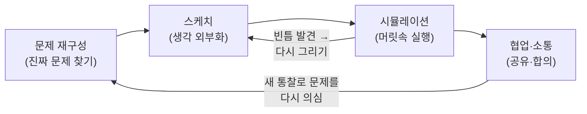

## 들어가며

이 글은 `Craftsmanship-Essential` 시리즈의 **3단계**입니다. 시리즈 전체 지도는 [Craftsmanship Essential Curriculum](/2026/06/19/craftsmanship-essential-curriculum.html)에서 확인할 수 있습니다.

2단계 [The Pragmatic Programmer: 실용주의 장인의 습관](/2026/06/19/pragmatic-programmer.html)에서는 매일의 작업 현장에서 통하는 실용적 습관들을 다뤘습니다. DRY, 직교성, 추적 가능한 결정, 충분히 좋은 소프트웨어 같은 원칙들은 "어떻게 일할 것인가"에 대한 답이었습니다. 그런데 그 습관들이 결국 향하는 곳은 하나의 질문입니다. **좋은 설계는 머릿속에서 어떻게 만들어지는가?** 이번 단계는 바로 그 질문, 즉 전문가가 설계할 때 실제로 무슨 생각을 하는지를 들여다봅니다.

이번 글의 교재는 Marian Petre와 André van der Hoek의 *Software Design Decoded: 66 Ways Experts Think*입니다. 이 책은 흔한 방법론 책과 결이 다릅니다. 저자들은 "이렇게 설계하라"는 절차를 처방하지 않습니다. 대신 수년에 걸쳐 **실제 전문가 설계자들을 관찰**하고, 그들이 공유하는 사고 패턴 66가지를 짧은 한 페이지짜리 통찰로 정리했습니다. 핵심 메시지는 분명합니다. 전문성은 고정된 프로세스가 아니라 **생각하는 습관(thinking habits)**에 있다는 것입니다.

그래서 이 글에는 코드가 거의 없습니다. 우리가 다룰 것은 문법이 아니라 사고방식입니다. 1단계에서 배운 SICP의 추상화 능력과 2단계의 실용주의 습관은, 바로 이 설계 사고 위에서 비로소 살아 움직입니다. 다음 4단계 [We Programmers: 프로그래밍의 역사와 문화](/2026/06/19/we-programmers.html)에서는 시야를 더 넓혀 이 모든 사고와 습관이 자라난 역사와 문화를 살펴볼 예정입니다.

### 📌 이 글에서 다루는 내용

#### 🔍 핵심 주제

- **문제 재구성(Reframing the Problem)**: 주어진 문제를 그대로 믿지 말고, 더 풀 만한 가치가 있는 문제로 다시 정의하기
- **스케치와 외부화(Sketching)**: 머릿속 생각을 종이·화이트보드로 꺼내 눈으로 보고 함께 추론하기
- **트레이드오프와 제약 다루기**: 제약을 적이 아니라 설계를 떠받치는 지렛대로 활용하기
- **시뮬레이션과 멘탈 모델**: 머릿속에서 시나리오를 돌려보며 설계를 미리 검증하기
- **협업·소통으로서의 설계**: 설계를 대화·합의·공유된 이해의 과정으로 다루기

## 문제 재구성: 주어진 문제를 의심하라

**왜 중요한가.** 초보 설계자와 전문가를 가르는 가장 큰 차이는 코딩 속도가 아니라, 문제를 받아들이는 태도입니다. 초보는 주어진 문제를 곧장 풀려 들고, 전문가는 먼저 **"이게 정말 풀어야 할 문제인가?"**를 묻습니다. *Software Design Decoded*는 전문가가 문제 정의 자체를 설계 대상으로 삼는다고 관찰합니다. 잘못된 문제를 완벽하게 푸는 것만큼 비싼 실패도 없기 때문입니다.

**개념.** 문제 재구성(reframing)은 요구사항을 의심하고, 그 뒤에 숨은 진짜 목표를 찾아내며, 더 다루기 좋은 형태로 문제를 다시 진술하는 행위입니다. 전문가는 문제와 해법 사이를 끊임없이 오갑니다. 해법을 스케치하다가 "아, 진짜 문제는 이게 아니었구나"를 깨닫고 문제 정의로 되돌아갑니다. 문제와 해법은 함께 진화합니다.

**구체적 시나리오.** 기획자가 "사용자가 주문 내역을 빠르게 찾을 수 있게 검색 기능을 추가해 주세요"라고 요청했다고 합시다. 초보는 곧장 검색창과 인덱싱을 설계합니다. 전문가는 한 단계 멈춥니다. "사용자가 왜 주문을 찾으려 할까?" 관찰해 보니 대부분은 **가장 최근 주문 하나**를 다시 보려는 것이었습니다. 그렇다면 진짜 문제는 "검색"이 아니라 "최근 주문을 즉시 보이게 하기"였습니다. 재구성된 문제의 해법은 검색 엔진이 아니라, 홈 화면 상단의 작은 카드 하나일 수 있습니다. 훨씬 싸고, 더 잘 맞는 답입니다.

이 습관은 2단계의 "사용자가 진짜 원하는 것을 파악하라"는 실용주의 원칙과 정확히 맞닿아 있습니다. 다만 여기서는 그것이 코딩 이전, 설계의 출발선에서 작동합니다.

## 스케치와 외부화: 생각을 손 밖으로 꺼내라

**왜 중요한가.** 인간의 작업 기억은 좁습니다. 머릿속에만 설계를 담아두면 변수 서너 개를 동시에 굴리는 순간 무너집니다. 전문가는 이 한계를 잘 알기에, 생각을 **외부화(externalization)**합니다. 종이, 화이트보드, 냅킨 위에 그려서 머리 밖으로 꺼내 놓습니다.

**개념.** 스케치는 그림을 잘 그리는 일이 아니라, **불완전하고 임시적인 표현으로 추론하는 일**입니다. *Software Design Decoded*는 전문가의 스케치가 의도적으로 모호하다고 말합니다. 깔끔한 UML 다이어그램이 아니라, 박스와 화살표와 물음표가 뒤섞인 지저분한 그림입니다. 모호함은 결함이 아니라 기능입니다. 아직 결정하지 않은 것을 열어두어, 여러 가능성을 동시에 품을 수 있게 해 줍니다.

**구체적 시나리오.** 결제 흐름을 설계 중이라고 합시다. 머릿속으로만 "장바구니에서 결제로 가고, 실패하면 되돌아오고, 부분 환불이 있고..."를 굴리면 금세 길을 잃습니다. 대신 화이트보드에 상태 몇 개를 박스로 그리고 화살표로 잇습니다. 그리는 순간 "부분 환불 상태에서 재결제하면 어디로 가지?"라는 빈 화살표가 눈에 보입니다. 종이가 생각의 빈틈을 대신 지적해 준 셈입니다. 외부화하지 않았다면 이 구멍은 운영 환경의 버그로야 발견되었을 것입니다.

스케치는 1단계 SICP에서 익힌 추상화와도 이어집니다. 박스 하나가 곧 하나의 추상이고, 우리는 그 박스 안을 잠시 블랙박스로 둔 채 박스들 사이의 관계부터 추론합니다.

## 트레이드오프와 제약: 한계를 지렛대로

**왜 중요한가.** 모든 좋은 설계는 트레이드오프의 결과입니다. 메모리와 속도, 단순함과 유연함, 출시 속도와 완성도. 어느 한쪽을 공짜로 얻을 수는 없습니다. 그런데 초보는 제약을 만나면 좌절하고, 전문가는 제약을 만나면 **반깁니다**. 제약이 선택지를 줄여 설계를 오히려 또렷하게 만들어 주기 때문입니다.

**개념.** *Software Design Decoded*는 전문가가 제약(constraints)을 설계의 **지렛대(leverage)**로 쓴다고 관찰합니다. "메모리가 64MB뿐"이라는 제약은 곧 "캐시 전략과 자료구조의 폭을 좁혀 준다"는 뜻입니다. 무한한 자유보다 적절한 제약이 더 나은 설계를 끌어냅니다. 전문가는 또한 트레이드오프를 **명시적으로** 만듭니다. 무엇을 얻고 무엇을 포기하는지 말로 적어, 나중에 그 결정을 추적할 수 있게 합니다.

**구체적 시나리오.** 알림 시스템을 설계하는데 "외부 의존성을 추가하지 마라"는 제약이 걸렸다고 합시다. 처음엔 손발이 묶인 느낌입니다. 하지만 이 제약 덕분에 메시지 큐 후보군이 통째로 사라지고, 설계는 "DB 테이블 하나를 폴링하는 단순 워커"로 빠르게 수렴합니다. 화려하진 않지만 운영 부담이 작고, 팀이 이미 아는 기술만 씁니다. 제약이 없었다면 며칠을 후보 비교로 흘려보냈을 것입니다.

이는 2단계의 "결정을 추적 가능하게 남겨라"와 직결됩니다. 트레이드오프를 적어두면, 6개월 뒤 "왜 메시지 큐를 안 썼지?"라는 질문에 즉시 답할 수 있습니다.

위 흐름은 전문가의 설계가 직선이 아니라 **반복 루프**임을 보여줍니다. 재구성 → 스케치 → 시뮬레이션 → 협업을 돌며, 각 단계가 앞 단계를 의심하게 만듭니다. 트레이드오프와 제약은 이 루프 전체에 스며들어, 어느 방향으로 돌지를 정하는 나침반 역할을 합니다.

## 시뮬레이션과 멘탈 모델: 머릿속에서 미리 돌려보라

**왜 중요한가.** 설계의 결함을 가장 싸게 발견하는 곳은 운영 환경도, 테스트 코드도 아닌 **머릿속**입니다. 전문가는 코드를 한 줄도 쓰기 전에, 설계 위로 시나리오를 흘려보내며 무슨 일이 벌어질지 상상합니다. 이것이 멘탈 시뮬레이션입니다.

**개념.** 멘탈 모델은 시스템이 어떻게 동작하는지에 대한 머릿속 모형입니다. *Software Design Decoded*는 전문가가 끊임없이 **"만약 ~라면?"**을 던지며 이 모형을 돌린다고 말합니다. "만약 이 요청이 동시에 천 번 오면?", "만약 이 단계에서 네트워크가 끊기면?", "만약 입력이 비어 있으면?" 전문가는 정상 경로보다 **예외 경로와 경계 조건**을 먼저 시뮬레이션합니다. 거기서 설계가 가장 잘 깨지기 때문입니다.

**구체적 시나리오.** 좌석 예약 시스템을 설계한다고 합시다. 화이트보드의 스케치를 보며 머릿속으로 시나리오를 돌립니다. "두 사용자가 같은 좌석을 동시에 누르면?" 스케치된 흐름을 따라가 보니, 둘 다 "예약 가능" 화면을 본 뒤 둘 다 확정 버튼을 누르는 순간이 보입니다. 충돌입니다. 이 시뮬레이션 덕분에 우리는 코딩 전에 낙관적 잠금이나 좌석 단위 락이 필요함을 압니다. 머릿속 1분의 실험이 운영 환경의 환불 사태를 막아 줍니다.

이 능력은 SICP에서 평가 모델을 손으로 따라가 보던 훈련과 같은 근육을 씁니다. 시스템의 동작을 머릿속에서 단계별로 실행할 수 있을 때, 우리는 비로소 설계를 신뢰할 수 있습니다.

## 협업·소통으로서의 설계: 설계는 혼자 하는 일이 아니다

**왜 중요한가.** 우리는 흔히 설계를 천재가 홀로 떠올리는 통찰로 상상합니다. 하지만 *Software Design Decoded*가 관찰한 현장은 다릅니다. 설계는 대체로 **대화 속에서** 일어납니다. 둘 이상이 화이트보드 앞에 서서, 서로의 아이디어를 깎고 보태며 공유된 이해를 만들어 갑니다.

**개념.** 여기서 설계 산출물(다이어그램, 문서)은 결과물이라기보다 **대화의 매개체**입니다. 좋은 다이어그램은 정답을 박제한 그림이 아니라, 팀이 같은 그림을 보며 같은 질문을 던지게 하는 공유 화면입니다. 전문가는 자기 설계를 설명할 때 **확신이 아니라 가정과 의문을 함께** 드러냅니다. "여기는 이렇게 했는데, 동시성 문제가 걸릴 것 같아"라고 약점을 먼저 꺼내, 동료가 보탤 여지를 만듭니다. 설계는 합의(consensus)이고, 합의는 공유된 멘탈 모델 위에서만 가능합니다.

**구체적 시나리오.** API 경계를 두고 백엔드와 프런트엔드가 화이트보드 앞에 섰다고 합시다. 백엔드는 "주문 객체를 통째로 내려주겠다"고 그립니다. 프런트엔드가 그 박스를 보며 "그럼 목록 화면에서 매번 무거운 객체를 다 받아야 하나요?"라고 묻습니다. 이 한 마디로 설계는 "목록용 가벼운 요약 응답"과 "상세용 전체 응답"으로 갈라집니다. 혼자였다면 보이지 않았을 트레이드오프가, 다른 멘탈 모델과 부딪히며 드러난 것입니다. 화이트보드 위 박스 하나가 두 사람의 이해를 같은 자리에 모아 준 결과입니다.

이 습관은 2단계의 "소통하라"는 실용주의 원칙을 설계 차원으로 끌어올립니다. 설계 회의에서 가장 가치 있는 산출물은 종종 다이어그램이 아니라, 모두가 같은 그림을 머릿속에 갖게 되었다는 그 공유된 이해 자체입니다.

## 추상화·습관과 설계 사고가 만나는 지점

지금까지의 다섯 습관을 모아 보면, 1·2단계에서 배운 것이 왜 설계 위에서 살아나는지가 보입니다. SICP의 **추상화**는 스케치의 박스 하나하나가 되고, 멘탈 시뮬레이션에서 우리가 따라가는 평가 모델이 됩니다. Pragmatic의 **추적 가능한 결정**은 트레이드오프를 명시적으로 적는 습관으로 이어지고, **소통**은 협업으로서의 설계로 확장됩니다.

다시 말해, 추상화는 설계의 어휘이고, 실용주의 습관은 설계의 작업 윤리이며, 이번 단계의 사고 습관은 그 둘을 실제 문제 위에서 움직이게 하는 동력입니다. 전문가의 설계 사고는 어떤 마법이 아니라, 이 작은 습관들을 끈질기게 반복하는 데서 나옵니다. 문제를 의심하고, 손 밖으로 꺼내 그리고, 제약을 지렛대로 삼고, 머릿속에서 돌려보고, 동료와 같은 그림을 본다 — 이 다섯 가지면 충분합니다.

## 마무리

*Software Design Decoded*가 우리에게 남기는 교훈은 분명합니다. 전문성은 정해진 절차가 아니라 **생각하는 습관**에 있습니다. 다섯 가지를 다시 짚어 봅니다.

- **문제 재구성**: 주어진 문제를 그대로 믿지 말고, 더 풀 만한 문제로 다시 정의한다.
- **스케치와 외부화**: 좁은 작업 기억을 종이와 화이트보드로 확장해 함께 추론한다.
- **트레이드오프와 제약**: 한계를 적이 아니라 설계를 또렷하게 만드는 지렛대로 쓴다.
- **시뮬레이션과 멘탈 모델**: 코딩 전에 머릿속에서 "만약 ~라면?"을 돌려 설계를 검증한다.
- **협업·소통으로서의 설계**: 설계를 대화와 합의, 공유된 이해의 과정으로 다룬다.

이 습관들은 모두 한 사람의 머릿속과 한 팀의 화이트보드 위에서 일어납니다. 하지만 이런 사고방식은 어느 날 갑자기 생긴 것이 아닙니다. 수십 년에 걸친 프로그래밍의 역사와, 그 안에서 자라난 문화가 오늘의 장인들에게 물려준 유산입니다. 다음 4단계에서는 시야를 더 넓혀, 이 모든 습관이 어디서 왔는지 — 프로그래밍이라는 직업의 역사와 문화를 들여다봅니다.

### 다음 학습

- [Craftsmanship Essential Curriculum](/2026/06/19/craftsmanship-essential-curriculum.html) — 시리즈 전체 지도에서 현재 위치 확인
- (다시 보기) [The Pragmatic Programmer: 실용주의 장인의 습관](/2026/06/19/pragmatic-programmer.html) — 2단계, 매일의 실용주의 습관
- (다음 단계) [We Programmers: 프로그래밍의 역사와 문화](/2026/06/19/we-programmers.html) — 4단계, 장인 정신이 자라난 역사와 문화
