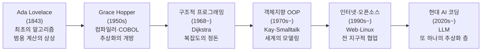

<figure class="post-figure post-figure--header">
<svg role="img" aria-label="We Programmers의 핵심을 한 장에 담은 그림. 위쪽에는 1843년 Ada Lovelace의 알고리즘에서 1950년대 Grace Hopper의 컴파일러, 1968년 Dijkstra의 구조화, 1970년대 Kay의 객체지향, 1990년대 인터넷·오픈소스, 2020년대 AI 코딩으로 이어지는 역사의 강이 하나의 타임라인으로 흐른다. 그 흐름이 가운데의 펼쳐진 두루마리, 즉 오늘의 프로그래머로 모인다. 아래쪽에는 그 두루마리를 떠받치는 세 개의 주춧돌 — 상상, 표현, 책임 — 이 전문직 윤리의 토대로 놓여 있다." viewBox="0 0 680 320" xmlns="http://www.w3.org/2000/svg">
  <title>We Programmers — 역사의 강(선구자들) → 오늘의 우리(두루마리) → 전문직의 토대(상상·표현·책임)</title>

  <!-- ===== TOP: the river of history as a timeline ===== -->
  <text x="340" y="22" text-anchor="middle" font-size="12" fill="currentColor" font-weight="700" opacity="0.75">역사의 강 — 우리는 어디에서 왔는가</text>

  <!-- timeline spine -->
  <line x1="44" y1="64" x2="636" y2="64" stroke="var(--secondary-color)" stroke-width="2" marker-end="url(#wp-arrow)"/>

  <!-- milestones: node + year + who -->
  <g font-size="8" text-anchor="middle">
    <circle cx="70" cy="64" r="6" fill="var(--bg-light)" stroke="currentColor" stroke-width="2"/>
    <text x="70" y="46" fill="currentColor" font-weight="700">1843</text>
    <text x="70" y="86" fill="currentColor" opacity="0.85">Ada</text>

    <circle cx="165" cy="64" r="6" fill="var(--bg-light)" stroke="currentColor" stroke-width="2"/>
    <text x="165" y="46" fill="currentColor" font-weight="700">1950s</text>
    <text x="165" y="86" fill="currentColor" opacity="0.85">Hopper</text>

    <circle cx="260" cy="64" r="6" fill="var(--bg-light)" stroke="currentColor" stroke-width="2"/>
    <text x="260" y="46" fill="currentColor" font-weight="700">1968</text>
    <text x="260" y="86" fill="currentColor" opacity="0.85">Dijkstra</text>

    <circle cx="355" cy="64" r="6" fill="var(--bg-light)" stroke="currentColor" stroke-width="2"/>
    <text x="355" y="46" fill="currentColor" font-weight="700">1970s</text>
    <text x="355" y="86" fill="currentColor" opacity="0.85">Kay · OOP</text>

    <circle cx="455" cy="64" r="6" fill="var(--bg-light)" stroke="currentColor" stroke-width="2"/>
    <text x="455" y="46" fill="currentColor" font-weight="700">1990s</text>
    <text x="455" y="86" fill="currentColor" opacity="0.85">Web · OSS</text>

    <circle cx="560" cy="64" r="7" fill="var(--bg-panel)" stroke="var(--accent-color)" stroke-width="2.5"/>
    <text x="560" y="46" fill="currentColor" font-weight="700">2020s</text>
    <text x="560" y="86" fill="currentColor" opacity="0.85">AI 코딩</text>
  </g>

  <!-- converging lines from the timeline into the scroll -->
  <line x1="165" y1="98" x2="300" y2="150" stroke="currentColor" stroke-width="1" opacity="0.3"/>
  <line x1="355" y1="98" x2="340" y2="150" stroke="currentColor" stroke-width="1" opacity="0.3"/>
  <line x1="560" y1="98" x2="382" y2="150" stroke="currentColor" stroke-width="1" opacity="0.3"/>

  <!-- ===== MIDDLE: today's programmer as an open scroll ===== -->
  <g>
    <!-- scroll rollers -->
    <rect x="214" y="150" width="14" height="74" rx="7" fill="var(--bg-sunken)" stroke="var(--gold)" stroke-width="2"/>
    <rect x="452" y="150" width="14" height="74" rx="7" fill="var(--bg-sunken)" stroke="var(--gold)" stroke-width="2"/>
    <!-- parchment -->
    <rect x="226" y="156" width="228" height="62" rx="3" fill="var(--bg-panel)" stroke="var(--gold)" stroke-width="2"/>
    <text x="340" y="184" text-anchor="middle" font-size="13" fill="currentColor" font-weight="700">We, Programmers</text>
    <text x="340" y="204" text-anchor="middle" font-size="9.5" fill="currentColor" opacity="0.85">오늘의 우리 — 하나의 직업 공동체</text>
  </g>

  <!-- pillars descending from the scroll -->
  <line x1="290" y1="224" x2="290" y2="250" stroke="currentColor" stroke-width="1" opacity="0.4"/>
  <line x1="340" y1="224" x2="340" y2="250" stroke="currentColor" stroke-width="1" opacity="0.4"/>
  <line x1="390" y1="224" x2="390" y2="250" stroke="currentColor" stroke-width="1" opacity="0.4"/>

  <!-- ===== BOTTOM: three pillars of professional ethic ===== -->
  <text x="340" y="270" text-anchor="middle" font-size="11" fill="currentColor" font-weight="700" opacity="0.75">변하지 않는 토대 — 장인정신의 약속</text>
  <g font-size="10" font-weight="700" text-anchor="middle">
    <rect x="206" y="280" width="92" height="30" rx="3" fill="var(--bg-light)" stroke="currentColor" stroke-width="1.8"/>
    <text x="252" y="299" fill="currentColor">상상</text>
    <rect x="306" y="280" width="92" height="30" rx="3" fill="var(--bg-light)" stroke="var(--accent-color)" stroke-width="2"/>
    <text x="352" y="299" fill="currentColor">표현</text>
    <rect x="406" y="280" width="92" height="30" rx="3" fill="var(--bg-light)" stroke="currentColor" stroke-width="1.8"/>
    <text x="452" y="299" fill="currentColor">책임</text>
  </g>

  <defs>
    <marker id="wp-arrow" markerWidth="8" markerHeight="8" refX="6" refY="4" orient="auto">
      <path d="M0,0 L8,4 L0,8 z" fill="var(--secondary-color)"/>
    </marker>
  </defs>
</svg>
<figcaption>이 글의 한 장 요약 — 위쪽 <strong>역사의 강</strong>은 Ada(1843)에서 AI 코딩(2020s)까지 선구자들의 발자취가 흐르는 타임라인이고, 그 흐름이 가운데 <strong>오늘의 우리</strong>라는 두루마리로 모인다. 두루마리를 떠받치는 세 주춧돌 <strong>상상·표현·책임</strong>은 도구가 바뀌어도 무너지지 않는 장인정신의 토대다.</figcaption>
</figure>

## 들어가며

이 글은 [Craftsmanship Essential Curriculum](/2026/06/19/craftsmanship-essential-curriculum.html)의 **4단계이자 마지막**입니다. 우리는 긴 여정을 걸어왔습니다. SICP로 추상화를 통해 사고하는 법을 배웠고, *The Pragmatic Programmer*로 매일의 실천을 익혔으며, 직전 3단계 [Software Design Decoded: 전문가의 설계 사고](/2026/06/19/software-design-decoded.html)에서는 숙련된 설계자가 어떻게 문제를 바라보고 결정을 내리는지를 들여다봤습니다. 그 단계가 "전문가의 머릿속"으로 들어가는 여정이었다면, 이번 단계는 시선을 정반대로 돌립니다. 한 개인의 사고에서 벗어나, 우리 직업 전체가 지나온 **시간의 강**을 거슬러 올라가는 것입니다.

이번 단계의 텍스트는 Gerald M. Weinberg의 정신을 잇는 한 권의 책, *We Programmers*입니다. 이 책은 한 가지 단순하지만 무거운 질문을 던집니다. **"프로그래머란 누구인가, 그리고 우리는 어디에서 왔는가?"** 책은 Ada Lovelace가 최초의 알고리즘을 종이 위에 적던 19세기에서 출발해, 천공 카드와 진공관을 거쳐, 오늘날 AI가 코드를 생성하는 시대에 이르기까지 **프로그래머라는 직업의 계보(genealogy)**를 추적합니다.

기술서가 "어떻게(how)"를 가르친다면, 이 책은 "누가, 왜, 어떤 마음으로(who, why, with what spirit)"를 묻습니다. 그래서 이 마지막 단계는 코드가 없는 **교양(liberal arts) 캡스톤**입니다. 우리가 매일 다루는 함수, 클래스, 커밋 메시지 뒤에 수많은 세대가 쌓아 올린 가치와 책임의 전통이 있다는 것을 깨닫는 순간, 우리는 비로소 단순한 코드 작성자가 아니라 **하나의 직업 공동체의 일원**이 됩니다. 이 글을 끝으로 `Craftsmanship-Essential` 시리즈는 완결됩니다.

### 📌 이 글에서 다루는 내용

#### 🔍 핵심 주제

- **프로그래밍의 계보(Ada to AI)**: 선구자들의 발자취와 패러다임의 변천을 하나의 연속된 흐름으로 추적합니다.
- **장인정신의 문화와 직업윤리**: 세대를 잇는 가치와 책임의 전통, 그리고 AI 시대에 프로그래머의 정체성이 무엇인지 묻습니다.

## 프로그래밍의 계보: Ada에서 AI까지

프로그래밍의 역사를 배운다는 것은 연표를 외우는 일이 아닙니다. 그것은 **무엇이 변했고 무엇이 변하지 않았는지**를 분별하는 안목을 기르는 일입니다. 각 세대는 자신만의 도구와 한계를 가졌지만, 모두가 같은 본질적 행위 — 기계에게 의도를 전달하고, 인간이 이해할 수 있는 형태로 그 의도를 정리하는 일 — 를 반복했습니다.

### 선구자: Ada Lovelace와 알고리즘의 탄생

1843년, Ada Lovelace는 Charles Babbage의 해석기관(Analytical Engine)에 대한 주석을 번역하면서 Bernoulli 수를 계산하는 일련의 단계를 기록했습니다. 이것이 흔히 **최초의 컴퓨터 프로그램**으로 불립니다. 더 중요한 통찰은 따로 있었습니다. Ada는 기계가 단지 숫자만 다루는 것이 아니라, 기호로 표현될 수 있는 **모든 것**을 조작할 수 있으리라 내다봤습니다. 음악조차 작곡할 수 있다고 말이죠. 하드웨어가 존재하기 한 세기 전에, 그녀는 이미 "범용 계산"이라는 추상을 사고하고 있었습니다. 우리 직업의 첫 장면은 기계가 아니라 **상상력**이었습니다.

### 추상화의 도약: Grace Hopper와 컴파일러

1950년대, Grace Hopper는 기계어와 인간의 거리를 좁히는 다리를 놓았습니다. 사람들이 "컴퓨터는 영어를 이해할 수 없다"고 말할 때, 그녀는 최초의 컴파일러(A-0)를 만들고 이후 COBOL의 토대가 되는 영어 기반 언어를 설계했습니다. 이것은 단순한 편의가 아니라 **추상화의 정치적 선언**이었습니다. 프로그래밍을 소수 엔지니어의 전유물에서 더 넓은 사람들에게 열어준 것이죠. Hopper의 유명한 "나방(bug)" 일화와 "허락을 구하는 것보다 용서를 구하는 게 쉽다"는 격언은 오늘날까지 엔지니어 문화의 일부로 살아 있습니다.

### 질서의 추구: 구조적 프로그래밍

1960~70년대, 소프트웨어가 복잡해지면서 "소프트웨어 위기(software crisis)"가 닥쳤습니다. Edsger Dijkstra의 "Go To Statement Considered Harmful"(1968)은 무질서한 점프로 얽힌 코드를 거부하고, **순차·선택·반복**이라는 제어 구조로 사고를 정돈하자고 호소했습니다. 이는 단순한 문법 논쟁이 아니라, **인간의 정신이 감당할 수 있는 복잡도**에 대한 첫 번째 진지한 성찰이었습니다. SICP에서 배운 추상화의 사고가 역사적으로 어디에서 시작됐는지를 여기서 만납니다.

### 모델링의 전환: 객체지향(OOP)

구조적 프로그래밍이 "절차를 어떻게 정돈할까"를 물었다면, 객체지향은 "세계를 어떻게 모델링할까"를 물었습니다. Simula에서 싹튼 아이디어는 Alan Kay의 Smalltalk를 통해 만개했습니다. Kay에게 객체지향의 핵심은 클래스나 상속이 아니라 **메시지 전달(messaging)**과 **캡슐화된 상태**였습니다. 데이터와 그것을 다루는 행위를 한데 묶어, 시스템을 살아 있는 객체들의 대화로 바라보는 시선 — 이는 이후 수십 년간 산업 표준이 됩니다. 자매 커리큘럼 [OO-Design Essential Curriculum](/2026/06/19/oo-design-essential-curriculum.html)이 다루는 모든 것이 바로 이 흐름의 후예입니다.

### 연결의 시대: 인터넷과 오픈소스

1990년대 이후, 프로그래밍은 개인의 작업에서 **전 지구적 협업**으로 변모했습니다. Tim Berners-Lee의 웹, Linus Torvalds의 Linux, 그리고 Richard Stallman이 점화한 자유 소프트웨어 운동은 코드를 **공유 가능한 공공재**로 재정의했습니다. "공개하고, 함께 고치고, 다시 공개한다"는 오픈소스 윤리는 길드(guild)의 도제 전통을 디지털 시대로 옮겨놓은 것이었습니다. 우리가 지금 GitHub에서 PR을 주고받는 행위는 이 문화적 혁명의 직접적인 상속입니다.

### 현대: AI 코딩과 새로운 추상화 층

오늘날 우리는 또 한 번의 도약 한가운데 있습니다. LLM 기반 코딩 도구는 자연어로 의도를 전달하면 코드를 생성합니다. 이는 Hopper가 영어 기반 언어로 시작한 흐름의 **가장 먼 지점**처럼 보입니다. 하지만 본질은 변하지 않았습니다. 추상화의 층이 하나 더 쌓였을 뿐, 의도를 정확히 표현하고, 결과를 검증하고, 책임지는 일은 여전히 인간의 몫입니다. 역사적 맥락에서 보면, AI는 어셈블러, 컴파일러, 고급 언어, 프레임워크에 이어 등장한 **또 하나의 추상화 도구**입니다.

다음 다이어그램은 이 계보를 하나의 연속된 사슬로 보여줍니다.

이 사슬을 관통하는 메시지는 분명합니다. **추상화의 층은 끊임없이 쌓이지만, 의도를 표현하고 책임지는 일은 늘 인간에게 남는다.** 각 세대는 자신이 선 자리에서 "이것이 프로그래밍의 미래다"라고 외쳤지만, 돌이켜보면 모두가 같은 강의 서로 다른 굽이였습니다.

## 장인정신의 문화와 직업윤리

역사가 가르쳐주는 두 번째 교훈은 **기술이 아니라 가치가 우리를 정의한다**는 것입니다. 도구는 십 년 단위로 사라지지만, 좋은 프로그래머가 되는 것의 의미는 놀라울 만큼 일관되게 이어져 왔습니다.

### 세대를 잇는 가치: 도제에서 코드 리뷰까지

중세 길드의 장인은 도제(apprentice) → 직인(journeyman) → 장인(master)의 단계를 거쳤습니다. 윗세대가 아랫세대에게 단지 기술뿐 아니라 **태도와 기준**을 전수했죠. 프로그래밍 문화는 이 전통을 고스란히 물려받았습니다. 오늘날의 코드 리뷰, 페어 프로그래밍, 멘토링, 오픈소스 기여는 모두 "더 숙련된 이가 곁에서 기준을 보여주는" 도제 방식의 변형입니다. 우리는 코드를 통해 세대 간 대화를 나눕니다. 잘 쓰인 코드와 정직한 커밋 메시지는 다음 세대에게 남기는 **편지**입니다.

다음 그림은 길드의 전수 단계가 어떻게 오늘의 실천으로 옮겨졌는지를 나란히 보여줍니다.

<figure class="post-figure">
<svg role="img" aria-label="길드의 전수 전통이 현대 프로그래밍 문화로 이어지는 그림. 위쪽 줄에는 도제, 직인, 장인의 세 단계가 화살표로 이어지고, 그 아래로 각각이 현대의 실천 — 코드 리뷰, 페어 프로그래밍·멘토링, 오픈소스 기여 — 로 내려와 대응된다. 세 단계를 하나로 묶는 띠에는 전수되는 것은 기술이 아니라 태도와 기준이라는 문장이 적혀 있다." viewBox="0 0 640 300" xmlns="http://www.w3.org/2000/svg">
  <title>세대를 잇는 전수 — 길드의 도제·직인·장인이 코드 리뷰·멘토링·오픈소스로 이어진다</title>

  <!-- top label -->
  <text x="320" y="24" text-anchor="middle" font-size="12" fill="currentColor" font-weight="700" opacity="0.75">길드의 전통 — 단계를 밟는 전수</text>

  <!-- top row: guild stages -->
  <g font-weight="700" text-anchor="middle">
    <rect x="40" y="40" width="150" height="46" rx="3" fill="var(--bg-light)" stroke="currentColor" stroke-width="1.8"/>
    <text x="115" y="62" font-size="11" fill="currentColor">도제</text>
    <text x="115" y="78" font-size="8" font-weight="400" fill="currentColor" opacity="0.8">apprentice — 배우는 이</text>

    <rect x="245" y="40" width="150" height="46" rx="3" fill="var(--bg-light)" stroke="currentColor" stroke-width="1.8"/>
    <text x="320" y="62" font-size="11" fill="currentColor">직인</text>
    <text x="320" y="78" font-size="8" font-weight="400" fill="currentColor" opacity="0.8">journeyman — 함께 짓는 이</text>

    <rect x="450" y="40" width="150" height="46" rx="3" fill="var(--bg-light)" stroke="var(--accent-color)" stroke-width="2"/>
    <text x="525" y="62" font-size="11" fill="currentColor">장인</text>
    <text x="525" y="78" font-size="8" font-weight="400" fill="currentColor" opacity="0.8">master — 기준을 세우는 이</text>
  </g>
  <!-- stage progression arrows -->
  <line x1="190" y1="63" x2="243" y2="63" stroke="var(--secondary-color)" stroke-width="2" marker-end="url(#wp2-arrow)"/>
  <line x1="395" y1="63" x2="448" y2="63" stroke="var(--secondary-color)" stroke-width="2" marker-end="url(#wp2-arrow)"/>

  <!-- descent arrows to modern practice -->
  <line x1="115" y1="86" x2="115" y2="138" stroke="var(--secondary-color)" stroke-width="2" stroke-dasharray="4 3" marker-end="url(#wp2-arrow)"/>
  <line x1="320" y1="86" x2="320" y2="138" stroke="var(--secondary-color)" stroke-width="2" stroke-dasharray="4 3" marker-end="url(#wp2-arrow)"/>
  <line x1="525" y1="86" x2="525" y2="138" stroke="var(--secondary-color)" stroke-width="2" stroke-dasharray="4 3" marker-end="url(#wp2-arrow)"/>

  <!-- middle label -->
  <text x="320" y="160" text-anchor="middle" font-size="12" fill="currentColor" font-weight="700" opacity="0.75">오늘의 실천 — 같은 전통의 변형</text>

  <!-- bottom row: modern practices -->
  <g font-weight="700" text-anchor="middle">
    <rect x="40" y="172" width="150" height="46" rx="3" fill="var(--bg-panel)" stroke="var(--gold)" stroke-width="2"/>
    <text x="115" y="194" font-size="10.5" fill="currentColor">코드 리뷰</text>
    <text x="115" y="210" font-size="8" font-weight="400" fill="currentColor" opacity="0.8">곁에서 기준을 본다</text>

    <rect x="245" y="172" width="150" height="46" rx="3" fill="var(--bg-panel)" stroke="var(--gold)" stroke-width="2"/>
    <text x="320" y="194" font-size="10.5" fill="currentColor">페어 · 멘토링</text>
    <text x="320" y="210" font-size="8" font-weight="400" fill="currentColor" opacity="0.8">곁에서 함께 짓는다</text>

    <rect x="450" y="172" width="150" height="46" rx="3" fill="var(--bg-panel)" stroke="var(--gold)" stroke-width="2"/>
    <text x="525" y="194" font-size="10.5" fill="currentColor">오픈소스 기여</text>
    <text x="525" y="210" font-size="8" font-weight="400" fill="currentColor" opacity="0.8">기준을 세상에 남긴다</text>
  </g>

  <!-- unifying band -->
  <rect x="40" y="246" width="560" height="34" rx="3" fill="var(--bg-sunken)" stroke="currentColor" stroke-width="1.5"/>
  <text x="320" y="267" text-anchor="middle" font-size="10.5" fill="currentColor" font-weight="700">전수되는 것은 기술이 아니라 — 태도와 기준</text>

  <defs>
    <marker id="wp2-arrow" markerWidth="8" markerHeight="8" refX="6" refY="4" orient="auto">
      <path d="M0,0 L8,4 L0,8 z" fill="var(--secondary-color)"/>
    </marker>
  </defs>
</svg>
<figcaption>세대를 잇는 전수 — 길드의 <strong>도제 → 직인 → 장인</strong>이 오늘날 <strong>코드 리뷰 · 페어/멘토링 · 오픈소스 기여</strong>로 이어진다. 도구는 바뀌었지만 "더 숙련된 이가 곁에서 기준을 보여준다"는 전수의 구조와, 전수되는 것이 기술이 아니라 <strong>태도와 기준</strong>이라는 본질은 그대로다.</figcaption>
</figure>

### 직업윤리: 우리가 만드는 것은 결과를 낳는다

선구자들은 일찍부터 프로그래밍이 단순한 기술이 아니라 **책임을 동반한 행위**임을 알았습니다. 코드는 비행기를 띄우고, 의료 장비를 작동시키고, 금융을 움직입니다. *The Pragmatic Programmer*에서 배운 "당신의 작업에 책임지라(care about your craft)"는 격언은 사실 매우 오래된 직업윤리의 현대적 재진술입니다. 검증되지 않은 코드를 출시하지 않는 것, 사용자의 데이터를 존중하는 것, 알면서도 결함을 숨기지 않는 것 — 이것들은 유행이 아니라 **세대를 가로질러 전수된 약속**입니다. 자매 커리큘럼 [Testing-Refactoring Essential Curriculum](/2026/06/19/testing-refactoring-essential-curriculum.html)이 다루는 규율도 결국 이 윤리의 실천적 형태입니다.

### AI 시대의 정체성: 변하는 것과 변하지 않는 것

지금 우리는 "AI가 프로그래머를 대체할 것인가"라는 불안 섞인 질문 속에 있습니다. 역사적 맥락은 이 과열을 차분하게 상대화해 줍니다. 어셈블러가 등장했을 때, 고급 언어가 나왔을 때, 프레임워크가 자동화를 약속했을 때 — 매번 "프로그래머가 필요 없어진다"는 예언이 있었습니다. 그러나 매번 추상화가 올라갈수록 프로그래머가 **다룰 수 있는 복잡도의 규모**가 커졌을 뿐, 직업은 사라지지 않았습니다.

AI 시대에 프로그래머의 정체성은 코드를 한 줄씩 타이핑하는 사람에서, **의도를 명료하게 정의하고 시스템을 검증하며 결과에 책임지는 사람**으로 다시 한번 이동합니다. 도구가 코드를 생성할 수 있게 될수록, 무엇을 만들 가치가 있는지를 판단하고 그 판단의 결과를 책임지는 인간의 역할은 오히려 무거워집니다. 본질은 Ada Lovelace 때와 같습니다. 우리는 여전히 **상상하고, 표현하고, 책임지는** 직업입니다. 변한 것은 추상화의 높이일 뿐, 장인정신의 핵심은 그대로입니다.

## 마무리

이번 4단계에서 우리는 *We Programmers*를 통해 프로그래밍이라는 직업의 계보를 따라갔습니다. Ada Lovelace의 상상에서 시작해 Hopper의 컴파일러, Dijkstra의 구조화, Kay의 객체지향, 오픈소스의 협업, 그리고 현대 AI 코딩에 이르는 사슬을 하나의 연속된 흐름으로 바라봤습니다. 그리고 그 모든 세대를 관통하는 것은 도구가 아니라 **세대를 잇는 가치와 책임의 전통**, 곧 장인정신의 문화임을 확인했습니다. AI 시대의 과열도 역사의 긴 시야에서 보면 또 한 번의 추상화 도약일 뿐입니다.

🎉 그리고 이로써 우리는 `Craftsmanship-Essential` 시리즈 전체를 완주했습니다. 네 권의 책은 하나의 완결된 여정을 그립니다. **SICP**로 추상화를 통해 사고하는 법을 익혔고(1단계 — 어떻게 생각할 것인가), **The Pragmatic Programmer**로 그 사고를 매일의 실천으로 옮기는 규율을 배웠으며(2단계 — 어떻게 실천할 것인가), **Software Design Decoded**로 전문가가 문제를 바라보고 설계를 결정하는 사고의 결을 들여다봤고(3단계 — 어떻게 설계할 것인가), 마지막으로 **We Programmers**로 우리가 속한 직업의 역사와 문화라는 더 넓은 시야를 얻었습니다(4단계 — 우리는 누구인가). 사고 → 실천 → 설계 → 정체성으로 이어지는 이 네 단계는, 어떤 언어나 프레임워크를 쓰든 변하지 않습니다. **장인정신은 모든 도구와 프레임워크 아래에 놓인, 시대가 바뀌어도 무너지지 않는 가장 단단한 토대입니다.**

### 다음 학습

이 글은 `Craftsmanship-Essential` 시리즈의 마지막 단계이므로 다음 단계는 없습니다. 대신 아래 길로 학습을 이어가세요.

- [Craftsmanship Essential Curriculum](/2026/06/19/craftsmanship-essential-curriculum.html) — 전체 로드맵 다시 보기
- [Software Design Decoded: 전문가의 설계 사고](/2026/06/19/software-design-decoded.html) — 직전 3단계 다시 보기
- [OO-Design Essential Curriculum](/2026/06/19/oo-design-essential-curriculum.html) — 객체지향 설계로 시야 확장하기
- [Testing-Refactoring Essential Curriculum](/2026/06/19/testing-refactoring-essential-curriculum.html) — 테스트와 리팩터링의 규율로 장인정신을 실천하기
