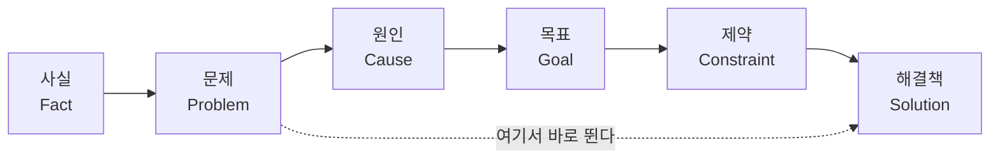
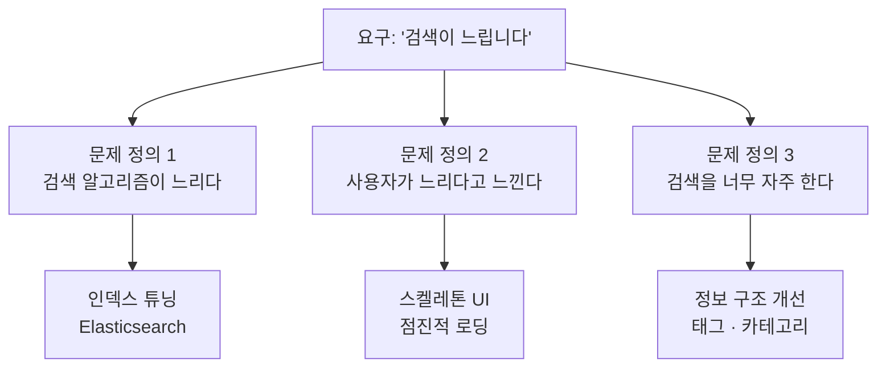
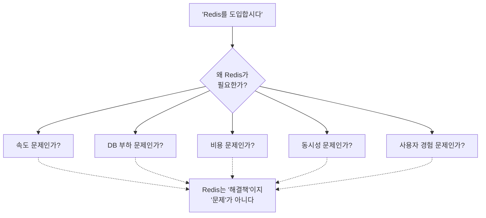

<figure class="post-figure post-figure--header">
<svg role="img" aria-label="모호하게 던져진 하나의 의견이 여러 개의 문제 정의로 갈라지고, 그중 하나가 해결책으로 선택되는 과정을 담은 그림. 왼쪽에는 물음표가 담긴 흐릿한 말풍선 하나가 '검색이 느려요'라는 대충 던진 의견을 나타낸다. 가운데에는 그 의견을 통과시켜 세 갈래로 갈라놓는 프리즘이 있다. 오른쪽에는 세 개의 서로 다른 문제 정의 카드가 세로로 놓여 있고, 각각 알고리즘·체감·빈도라는 다른 관점을 가리킨다. 그중 가운데 카드에 강조 테두리가 둘려 하나의 해결책이 선택되었음을 보여준다." viewBox="0 0 680 300" xmlns="http://www.w3.org/2000/svg">
  <title>하나의 모호한 의견 → 여러 문제 정의 → 선택된 해결책</title>

  <!-- ===== LEFT: one vague opinion ===== -->
  <text x="96" y="30" text-anchor="middle" font-size="12" fill="currentColor" font-weight="700" opacity="0.75">대충 던진 의견</text>
  <path d="M32 96 q0 -28 28 -28 h72 q28 0 28 28 v34 q0 28 -28 28 h-52 l-20 22 v-22 h0 q-28 0 -28 -28 z"
        fill="var(--bg-light)" stroke="currentColor" stroke-width="1.8" opacity="0.9"/>
  <text x="96" y="112" text-anchor="middle" font-size="11" fill="currentColor" opacity="0.85">"검색이</text>
  <text x="96" y="128" text-anchor="middle" font-size="11" fill="currentColor" opacity="0.85">느려요"</text>
  <text x="150" y="196" text-anchor="middle" font-size="26" fill="currentColor" opacity="0.4" font-weight="700">?</text>

  <!-- ===== CENTER: prism that splits ===== -->
  <text x="300" y="30" text-anchor="middle" font-size="12" fill="currentColor" font-weight="700" opacity="0.75">문제 정의</text>
  <polygon points="284,108 336,138 284,168" fill="var(--bg-panel)" stroke="var(--accent-color)" stroke-width="2"/>
  <!-- incoming ray -->
  <line x1="176" y1="138" x2="284" y2="138" stroke="currentColor" stroke-width="1.8" opacity="0.7"/>
  <!-- three diverging rays -->
  <line x1="336" y1="138" x2="452" y2="70"  stroke="currentColor" stroke-width="1.6" opacity="0.7"/>
  <line x1="336" y1="138" x2="452" y2="138" stroke="var(--accent-color)" stroke-width="2"/>
  <line x1="336" y1="138" x2="452" y2="206" stroke="currentColor" stroke-width="1.6" opacity="0.7"/>

  <!-- ===== RIGHT: three problem definitions ===== -->
  <rect x="452" y="48"  width="196" height="44" rx="4" fill="var(--bg-light)" stroke="currentColor" stroke-width="1.6"/>
  <text x="466" y="68"  font-size="10" fill="currentColor" font-weight="700" opacity="0.8">문제 1 · 알고리즘</text>
  <text x="466" y="83"  font-size="9"  fill="currentColor" opacity="0.75">인덱스 · 검색 엔진</text>

  <rect x="452" y="116" width="196" height="44" rx="4" fill="var(--bg-panel)" stroke="var(--gold)" stroke-width="2.4"/>
  <text x="466" y="136" font-size="10" fill="currentColor" font-weight="700" opacity="0.9">문제 2 · 체감 속도</text>
  <text x="466" y="151" font-size="9"  fill="currentColor" opacity="0.8">스켈레톤 · 점진 로딩</text>

  <rect x="452" y="184" width="196" height="44" rx="4" fill="var(--bg-light)" stroke="currentColor" stroke-width="1.6"/>
  <text x="466" y="204" font-size="10" fill="currentColor" font-weight="700" opacity="0.8">문제 3 · 검색 빈도</text>
  <text x="466" y="219" font-size="9"  fill="currentColor" opacity="0.75">정보 구조 · 태그</text>

  <text x="550" y="256" text-anchor="middle" font-size="10" fill="currentColor" opacity="0.6">같은 요구, 다른 문제 → 다른 해결책</text>
</svg>
</figure>

### 📌 이 글에서 다루는 내용

#### 🔍 핵심 주제

- **본질을 찾는 능력의 정체**: 상대의 말을 이해하는 게 아니라, 상대가 표현하지 못한 생각을 재구성하는 능력
- **증상과 원인의 분리**: "검색이 불편해요"가 정말 검색 문제인지, 정보 구조 문제인지 갈라내기
- **문제 정의를 여러 개 만드는 훈련**: 하나의 요구를 최소 3개의 문제 정의로 다시 쓰기
- **Senior와 Principal의 차이**: 기능을 잘 만드는 사람과, 무슨 문제를 풀지 정의하는 사람

#### 🎯 이 글의 결론

> 뛰어난 엔지니어는 해결책을 빨리 떠올리는 사람이 아니라, 문제를 더 정확하게 정의하는 사람이다.

## 시작은 하나의 질문이었다

이 글은 하나의 질문에서 출발했다.

> "타인이 대충 던진 의견도 핵심을 파악하고 구체화할 수 있는 능력은 무엇이며, 어떻게 키워야 할까?"

회의에서, 슬랙에서, 복도에서 우리는 매일 다듬어지지 않은 말들을 듣는다. "이거 좀 불편해요", "검색이 느려요", "안정성을 높이면 좋겠어요." 대부분은 감정이거나 증상이거나, 반쯤만 완성된 생각이다. 그런데 어떤 사람은 그 반쪽짜리 문장에서 상대조차 정확히 몰랐던 진짜 문제를 끄집어낸다. 나는 오래전부터 그 능력의 **이름**이 궁금했다. 이름을 찾으면 훈련법도 보일 것 같았다.

## 이 능력의 정체

결론부터 말하면, 이 능력은 하나의 단어로 정의되지 않는다. 다음 능력들의 조합에 가깝다.

- **추상화(Abstraction)** — 구체적인 현상을 한 단계 위 개념으로 끌어올리기
- **구조화(Structuring)** — 흩어진 말을 사실·문제·목표·제약으로 정렬하기
- **문제 정의(Problem Framing)** — 무엇을 풀 문제로 삼을지 결정하기
- **본질 파악(First Principles Thinking)** — 관습이 아니라 근본에서 다시 쌓기
- **질문하는 능력** — 답이 아니라 더 나은 질문을 던지기

핵심은 이것이다. 상대가 **한 말**을 이해하는 것이 아니라, 상대가 **표현하지 못한 생각**을 재구성하는 능력. 즉,

> 말을 듣는 능력이 아니라, 생각을 구조화하는 능력이다.

## 어떻게 사고하는가 — 증상과 원인을 분리한다

예를 들어 "검색이 불편해요"라는 말을 들었다고 하자. 이 능력이 없는 사람은 곧장 해결책으로 뛴다. "검색창을 크게 하자", "자동완성을 붙이자." 반면 이 능력이 있는 사람은 해결책 대신 **질문**을 먼저 꺼낸다.

- 언제 불편한가?
- 무엇이 불편한가?
- 검색 **속도**인가?
- 검색 **결과**인가?
- 탐색 **구조**인가?

이 질문들을 따라가다 보면 종종 놀라운 사실을 만난다. 이건 "검색" 문제가 아니라 "태그 구조" 문제이거나, 더 근본적으로는 "정보 구조" 문제일 수도 있다는 것. 사용자는 검색창 앞에서 불편을 느꼈지만, 진짜 원인은 애초에 검색에 의존할 수밖에 없게 만든 콘텐츠 구조에 있다.

핵심은 하나다. **증상과 원인을 분리하는 것.** 사용자가 가리키는 곳은 아픈 곳이지, 병의 위치가 아니다.

<figure class="post-figure">
<svg role="img" aria-label="증상과 원인이 서로 다른 깊이에 있음을 보여주는 지층 단면도. 위에서 아래로 검색 UI(검색창), 태그 구조, 정보 구조 세 개의 층이 쌓여 있다. 맨 위 검색 UI 층에는 통증을 뜻하는 붉은 불꽃 표시가 찍혀 있고, 오른쪽에 '증상 · 아픈 곳, 사용자가 가리키는 곳'이라고 적혀 있다. 맨 아래 정보 구조 층에는 붉은 균열이 나 있고, 오른쪽에 '원인 · 병의 위치, 진짜 고쳐야 할 곳'이라고 적혀 있다. 왼쪽에는 위 통증 지점에서 아래 균열 지점으로 향하는 점선 화살표가 아래로 내려가며, 아픈 곳과 병의 위치가 서로 다른 층에 있음을 나타낸다." viewBox="0 0 680 280" xmlns="http://www.w3.org/2000/svg">
  <title>아픈 곳(증상)과 병의 위치(원인)는 다른 층에 있다</title>

  <text x="340" y="28" text-anchor="middle" font-size="12" fill="currentColor" font-weight="700" opacity="0.75">사용자가 가리키는 곳(증상) ≠ 병의 위치(원인)</text>

  <!-- ===== stacked strata ===== -->
  <rect x="150" y="52"  width="300" height="46" rx="4" fill="var(--bg-light)" stroke="currentColor" stroke-width="1.6"/>
  <text x="300" y="80"  text-anchor="middle" font-size="11" fill="currentColor" font-weight="700" opacity="0.85">검색 UI · 검색창</text>

  <rect x="150" y="112" width="300" height="46" rx="4" fill="var(--bg-panel)" stroke="currentColor" stroke-width="1.4" opacity="0.9"/>
  <text x="300" y="140" text-anchor="middle" font-size="11" fill="currentColor" opacity="0.8">태그 구조</text>

  <rect x="150" y="172" width="300" height="46" rx="4" fill="var(--bg-light)" stroke="var(--accent-color)" stroke-width="1.8"/>
  <text x="300" y="200" text-anchor="middle" font-size="11" fill="currentColor" font-weight="700" opacity="0.9">정보 구조 · 콘텐츠 구조</text>

  <!-- pain spark on top layer -->
  <g stroke="var(--accent-color)" stroke-width="2">
    <line x1="200" y1="63" x2="200" y2="87"/>
    <line x1="188" y1="75" x2="212" y2="75"/>
    <line x1="191" y1="66" x2="209" y2="84"/>
    <line x1="209" y1="66" x2="191" y2="84"/>
  </g>
  <circle cx="200" cy="75" r="3" fill="var(--accent-color)"/>

  <!-- crack on bottom layer -->
  <polyline points="192,176 200,188 194,196 206,208 200,214" fill="none" stroke="var(--accent-color)" stroke-width="2.4"/>

  <!-- descending dashed arrow: symptom -> cause -->
  <line x1="118" y1="74" x2="118" y2="198" stroke="currentColor" stroke-width="1.6" stroke-dasharray="4 4" opacity="0.7"/>
  <polygon points="118,212 111,198 125,198" fill="currentColor" opacity="0.7"/>
  <text transform="translate(100,138) rotate(-90)" text-anchor="middle" font-size="9.5" fill="currentColor" opacity="0.65">진짜 원인은 더 깊은 층</text>

  <!-- right-side callouts -->
  <text x="470" y="70"  font-size="11" fill="var(--accent-color)" font-weight="700">증상 · 아픈 곳</text>
  <text x="470" y="86"  font-size="9"  fill="currentColor" opacity="0.75">사용자가 가리키는 곳</text>
  <text x="470" y="190" font-size="11" fill="var(--accent-color)" font-weight="700">원인 · 병의 위치</text>
  <text x="470" y="206" font-size="9"  fill="currentColor" opacity="0.75">진짜 고쳐야 할 곳</text>
</svg>
<figcaption>증상과 원인의 분리 — 사용자가 아파하는 표면(검색창)과 병이 자리한 깊이(정보 구조)는 다른 층이다.</figcaption>
</figure>

## 좋은 사고의 순서 — 한눈에 보기

좋은 사고는 요구에서 해결책으로 직행하지 않는다. 사실에서 시작해 여러 단계를 거친다.

많은 사람은 `Problem`에서 곧장 `Solution`으로 점프한다(점선 경로). 문제를 하나로 확정하자마자 답을 찾기 시작하는 것이다. 하지만 뛰어난 사람은 다르다. **`Problem`을 여러 개 정의한 뒤에 `Solution`을 고른다.** 문제 정의가 하나뿐이면 해결책도 하나로 정해지지만, 문제 정의가 셋이면 서로 다른 세 갈래의 해결책이 후보로 열린다.

## 훈련 방법 다섯 가지

이 능력은 재능이 아니라 습관이다. 나는 다음 다섯 가지를 반복 훈련으로 삼는다.

### (1) 구조화 — 회의를 다섯 칸으로 정리한다

회의가 끝나면 오간 말을 다음 다섯 칸에 나눠 담는다.

- **Fact** — 관찰된 사실 (측정값, 실제로 일어난 일)
- **Problem** — 무엇이 문제인가
- **Goal** — 어떤 상태가 되면 해결된 것인가
- **Constraint** — 시간·비용·인력·기술의 제약
- **Solution** — 그래서 무엇을 할 것인가

말들이 감정인지 사실인지, 문제인지 해결책인지 자리를 찾아주는 것만으로도 논의의 절반은 정리된다.

### (2) 추상화 — 한 단계 위 개념으로 올린다

구체적인 말을 한 단계 위 개념으로 바꾼다.

> 버튼이 많다 → 인지 부하가 높다 → 사용성이 낮다

"버튼이 많다"에 머물면 "버튼을 줄이자"밖에 안 나온다. "인지 부하"까지 올라가면 그룹핑·기본값·점진적 노출 같은 다른 해법이 보인다.

### (3) 구체화 — 추상적인 말을 분해한다

반대 방향의 훈련도 필요하다. 추상적인 말을 들으면 그것이 구체적으로 무엇을 의미하는지 분해한다.

> 안정성을 높인다 → 어떤 안정성? 장애율? SLA? 메모리? 복구 시간(MTTR)?

"안정성"은 아름답지만 텅 빈 단어다. 무엇을 측정할지 정하지 못하면 개선했는지조차 알 수 없다.

<figure class="post-figure">
<svg role="img" aria-label="추상화와 구체화가 서로 반대 방향임을 보여주는 그림. 왼쪽에는 아래에서 위로 올라가는 사다리가 있다. 맨 아래 칸은 '버튼이 많다', 가운데 칸은 '인지 부하가 높다', 맨 위 칸은 '사용성이 낮다'이며, 왼쪽에 위로 향하는 초록 화살표와 '추상화(올리기)' 글자가 있다. 오른쪽에는 맨 위의 '안정성'이라는 한 단어가 아래로 네 개의 칸 '장애율', 'SLA', '메모리', 'MTTR'로 갈라져 내려가고, 아래로 향하는 붉은 화살표와 '구체화(내리기)' 글자가 있다. 왼쪽은 구체적인 현상을 한 단계 위 개념으로 올리는 방향, 오른쪽은 추상적인 단어를 측정 가능한 지표로 내리는 방향이다." viewBox="0 0 680 330" xmlns="http://www.w3.org/2000/svg">
  <title>추상화는 올려서 개념으로, 구체화는 내려서 지표로</title>

  <text x="340" y="26" text-anchor="middle" font-size="12" fill="currentColor" font-weight="700" opacity="0.75">추상화는 올리고, 구체화는 내린다</text>

  <line x1="340" y1="46" x2="340" y2="300" stroke="currentColor" stroke-width="1.2" stroke-dasharray="3 5" opacity="0.25"/>

  <!-- ===== LEFT: abstraction ladder (bottom -> up) ===== -->
  <line x1="190" y1="108" x2="190" y2="216" stroke="currentColor" stroke-width="1.4" opacity="0.5"/>

  <rect x="95" y="64"  width="190" height="44" rx="4" fill="var(--bg-panel)" stroke="var(--secondary-color)" stroke-width="2"/>
  <text x="190" y="91"  text-anchor="middle" font-size="11" fill="currentColor" font-weight="700" opacity="0.9">사용성이 낮다</text>

  <rect x="95" y="140" width="190" height="44" rx="4" fill="var(--bg-light)" stroke="currentColor" stroke-width="1.5"/>
  <text x="190" y="167" text-anchor="middle" font-size="11" fill="currentColor" opacity="0.85">인지 부하가 높다</text>

  <rect x="95" y="216" width="190" height="44" rx="4" fill="var(--bg-light)" stroke="currentColor" stroke-width="1.5"/>
  <text x="190" y="243" text-anchor="middle" font-size="11" fill="currentColor" opacity="0.85">버튼이 많다</text>

  <line x1="55" y1="252" x2="55" y2="78" stroke="var(--secondary-color)" stroke-width="2"/>
  <polygon points="55,64 48,80 62,80" fill="var(--secondary-color)"/>
  <text transform="translate(38,164) rotate(-90)" text-anchor="middle" font-size="11" font-weight="700" fill="var(--secondary-color)">추상화 (올리기)</text>

  <text x="190" y="292" text-anchor="middle" font-size="9" fill="currentColor" opacity="0.6">한 단계 위 개념으로 → 새 해법이 열린다</text>

  <!-- ===== RIGHT: concretization (top -> down, split) ===== -->
  <rect x="440" y="52" width="140" height="42" rx="4" fill="var(--bg-panel)" stroke="var(--accent-color)" stroke-width="2"/>
  <text x="510" y="79" text-anchor="middle" font-size="12" fill="currentColor" font-weight="700" opacity="0.9">안정성</text>

  <line x1="510" y1="94" x2="429" y2="214" stroke="currentColor" stroke-width="1.3" opacity="0.5"/>
  <line x1="510" y1="94" x2="483" y2="214" stroke="currentColor" stroke-width="1.3" opacity="0.5"/>
  <line x1="510" y1="94" x2="537" y2="214" stroke="currentColor" stroke-width="1.3" opacity="0.5"/>
  <line x1="510" y1="94" x2="591" y2="214" stroke="currentColor" stroke-width="1.3" opacity="0.5"/>

  <rect x="398" y="216" width="62" height="44" rx="4" fill="var(--bg-light)" stroke="currentColor" stroke-width="1.5"/>
  <text x="429" y="243" text-anchor="middle" font-size="10" fill="currentColor" opacity="0.85">장애율</text>

  <rect x="468" y="216" width="30" height="44" rx="4" fill="var(--bg-light)" stroke="currentColor" stroke-width="1.5"/>
  <text x="483" y="243" text-anchor="middle" font-size="10" fill="currentColor" opacity="0.85">SLA</text>

  <rect x="508" y="216" width="58" height="44" rx="4" fill="var(--bg-light)" stroke="currentColor" stroke-width="1.5"/>
  <text x="537" y="243" text-anchor="middle" font-size="10" fill="currentColor" opacity="0.85">메모리</text>

  <rect x="576" y="216" width="62" height="44" rx="4" fill="var(--bg-light)" stroke="currentColor" stroke-width="1.5"/>
  <text x="607" y="243" text-anchor="middle" font-size="10" fill="currentColor" opacity="0.85">MTTR</text>

  <line x1="368" y1="72" x2="368" y2="238" stroke="var(--accent-color)" stroke-width="2"/>
  <polygon points="368,252 361,236 375,236" fill="var(--accent-color)"/>
  <text transform="translate(385,158) rotate(90)" text-anchor="middle" font-size="11" font-weight="700" fill="var(--accent-color)">구체화 (내리기)</text>

  <text x="518" y="292" text-anchor="middle" font-size="9" fill="currentColor" opacity="0.6">측정 가능한 지표로 → 개선 여부를 안다</text>
</svg>
<figcaption>추상화 사다리 — 위로 올리면 새 해법이 보이고(버튼→인지 부하→사용성), 아래로 내리면 측정할 지표가 생긴다(안정성→장애율·SLA·메모리·MTTR).</figcaption>
</figure>

### (4) 여러 관점으로 보기

동일한 문제를 여러 이해관계자의 언어로 각각 설명해 본다.

- **사용자** 관점: 무엇이 불편하고 무엇을 기대하는가
- **개발자** 관점: 구현·유지보수 비용은
- **운영** 관점: 배포·모니터링·장애 대응은
- **비용** 관점: 인프라·인건비 트레이드오프는
- **보안** 관점: 새로 열리는 공격면은

한 관점에서 최적인 답이 다른 관점에서는 최악인 경우가 흔하다. 관점을 바꿔 설명해 보면 그 충돌이 미리 드러나고, 드러난 충돌을 저울에 올려 무엇을 얻고 무엇을 포기할지 견주는 일이 곧 **트레이드오프 분석**이다.

### (5) 한 문장으로 요약

회의가 끝나면 스스로에게 묻는다. **"결국 핵심은 무엇인가?"** 이걸 한 문장으로 못 쓰면, 아직 문제를 이해하지 못한 것이다. 한 문장은 이해의 리트머스 시험지다.

## 가장 중요한 훈련: 요구 하나를 문제 정의 셋으로

위의 다섯 가지 중에서도 사고 수준을 가장 크게 끌어올린 훈련은 따로 있다.

> 요구사항을 들으면 바로 해결책을 생각하지 말고, **최소 3개의 문제 정의**를 만들어 본다.

이 한 가지 습관이 전부를 바꾼다. 해결책은 매력적이라 우리를 빨리 붙잡는다. 하지만 매력적인 해결책 하나는 대안을 볼 눈을 닫아 버린다. 문제를 세 가지로 다시 쓰는 순간, 뇌는 "어떻게 풀까"에서 "무엇을 풀 것인가"로 축을 옮긴다.

## 사례: "검색이 느립니다"

한 요구가 들어왔다. "검색이 느립니다." 보통은 반사적으로 이렇게 생각한다. *"Elasticsearch를 붙이자."* 하지만 문제 정의를 세 개로 늘려 보면 완전히 다른 세계가 열린다.

같은 한 문장이지만, 문제 정의가 달라지면 해결책도 완전히 달라진다.

- **정의 1(알고리즘이 느리다)**은 실제 응답 시간이 느린 경우다. 인덱스, 쿼리, 검색 엔진의 문제 → Elasticsearch가 답이 될 수 있다.
- **정의 2(느리다고 느낀다)**는 응답 시간은 멀쩡한데 **체감**이 나쁜 경우다. 로딩 중 빈 화면이 문제라면 스켈레톤 UI와 점진적 로딩이 답이다. 엔진을 바꿔도 체감은 그대로일 수 있다.
- **정의 3(너무 자주 검색한다)**은 애초에 검색에 의존하지 않아도 되게 만드는 문제다. 정보 구조를 개선하고 태그·카테고리로 탐색을 돕는 것이 답이다. 검색 자체를 빠르게 하는 게 아니라 **검색의 필요를 줄인다.**

Elasticsearch로 직행했다면, 문제가 실은 2번이나 3번이었을 때 몇 주를 쓰고도 사용자는 여전히 "검색이 느려요"라고 말했을 것이다.

## 그래서 얻은 결론

여기서 하나의 문장이 남는다.

> 좋은 엔지니어는 문제를 **해결하는** 사람이다. 하지만 더 뛰어난 엔지니어는 문제를 **다시 정의하는** 사람이다.

## Principal Engineer는 무엇이 다른가

문제 정의라는 주제는 자연스럽게 다음 질문으로 이어졌다. **Principal Engineer는 무엇이 다른가?**

많은 사람이 Principal Engineer를 "코드를 가장 잘 짜는 사람"이라고 생각한다. 하지만 실제 역할은 다르다. Principal Engineer는 **조직 전체의 기술 방향을 결정하는 사람**이다. 코드는 그 결정을 뒷받침하는 근거이자 수단이지, 역할의 본질이 아니다.

### Senior와 Principal의 차이

| | Senior Engineer | Principal Engineer |
| --- | --- | --- |
| 초점 | 기능을 **잘 만든다** | 어떤 문제를 풀지 **정의한다** |
| 품질 | 코드의 품질을 높인다 | 조직 전체의 기술 품질을 높인다 |
| 시간축 | 현재를 최적화한다 | 2~3년 뒤를 설계한다 |

Senior는 주어진 문제를 훌륭하게 푼다. Principal은 그 앞에 서서 "이게 정말 우리가 풀어야 할 문제인가?"를 먼저 묻는다. 앞의 문제 정의 훈련이 개인의 사고 습관이라면, Principal의 일은 그 습관을 **조직의 의사결정 규모로** 실행하는 것이다.

<figure class="post-figure">
<svg role="img" aria-label="Senior와 Principal이 같은 '지금' 시점에 서 있지만 서로 다른 시간축을 바라본다는 것을 보여주는 그림. 아래에는 왼쪽 '지금'에서 오른쪽 '2~3년 뒤'로 향하는 시간 축이 있다. 위쪽 Senior는 '지금' 위치에 서서 바로 옆의 좁은 창을 본다. 그 창에는 '기능을 잘 만든다 · 코드 품질', '현재를 최적화한다'라고 적혀 있어 시야가 현재에 머문다. 아래쪽 Principal도 같은 '지금'에 서 있지만, 시선이 붉은 긴 화살표가 되어 '2~3년 뒤'의 과녁까지 뻗어 있고, '조직 전체의 기술 방향을 설계한다', '무슨 문제를 풀지 정의한다'라고 적혀 있다." viewBox="0 0 680 300" xmlns="http://www.w3.org/2000/svg">
  <title>같은 지금에 서서, 다른 시간을 본다 — Senior와 Principal의 시간축 차이</title>

  <text x="340" y="26" text-anchor="middle" font-size="12" fill="currentColor" font-weight="700" opacity="0.75">같은 '지금'에 서서, 다른 시간을 본다</text>

  <!-- vertical guides -->
  <line x1="130" y1="58" x2="130" y2="248" stroke="currentColor" stroke-width="1" stroke-dasharray="3 4" opacity="0.22"/>
  <line x1="588" y1="150" x2="588" y2="248" stroke="currentColor" stroke-width="1" stroke-dasharray="3 4" opacity="0.22"/>

  <!-- ===== Senior lane ===== -->
  <text x="130" y="72" text-anchor="middle" font-size="11" fill="currentColor" font-weight="700">Senior</text>
  <circle cx="130" cy="96" r="7" fill="currentColor"/>
  <line x1="139" y1="96" x2="156" y2="96" stroke="currentColor" stroke-width="2"/>
  <polygon points="166,96 154,90 154,102" fill="currentColor"/>
  <rect x="168" y="78" width="196" height="40" rx="5" fill="var(--bg-light)" stroke="currentColor" stroke-width="1.5" stroke-dasharray="5 3"/>
  <text x="266" y="95"  text-anchor="middle" font-size="10" fill="currentColor" font-weight="700" opacity="0.9">기능을 잘 만든다 · 코드 품질</text>
  <text x="266" y="110" text-anchor="middle" font-size="9"  fill="currentColor" opacity="0.75">현재를 최적화한다</text>

  <!-- ===== Principal lane ===== -->
  <text x="130" y="158" text-anchor="middle" font-size="11" fill="var(--accent-color)" font-weight="700">Principal</text>
  <circle cx="130" cy="182" r="7" fill="var(--accent-color)"/>
  <line x1="139" y1="182" x2="576" y2="182" stroke="var(--accent-color)" stroke-width="2.2"/>
  <polygon points="588,182 574,175 574,189" fill="var(--accent-color)"/>
  <circle cx="588" cy="182" r="11" fill="none" stroke="var(--accent-color)" stroke-width="1.6"/>
  <circle cx="588" cy="182" r="4"  fill="var(--accent-color)"/>
  <text x="345" y="172" text-anchor="middle" font-size="10" fill="currentColor" font-weight="700" opacity="0.9">2~3년 뒤 · 조직 전체의 기술 방향을 설계한다</text>
  <text x="320" y="204" text-anchor="middle" font-size="9"  fill="currentColor" opacity="0.75">무슨 문제를 풀지 정의한다</text>

  <!-- ===== time axis ===== -->
  <line x1="90" y1="248" x2="616" y2="248" stroke="currentColor" stroke-width="1.6" opacity="0.7"/>
  <polygon points="628,248 614,242 614,254" fill="currentColor" opacity="0.7"/>
  <line x1="130" y1="243" x2="130" y2="253" stroke="currentColor" stroke-width="1.6" opacity="0.7"/>
  <line x1="588" y1="243" x2="588" y2="253" stroke="currentColor" stroke-width="1.6" opacity="0.7"/>
  <text x="130" y="270" text-anchor="middle" font-size="10" fill="currentColor" font-weight="700" opacity="0.8">지금</text>
  <text x="588" y="270" text-anchor="middle" font-size="10" fill="currentColor" font-weight="700" opacity="0.8">2~3년 뒤</text>
  <text x="628" y="270" text-anchor="middle" font-size="9"  fill="currentColor" opacity="0.55">시간</text>
</svg>
<figcaption>Senior와 Principal의 시간축 — 둘 다 '지금'에 서 있지만, Senior는 눈앞의 기능을, Principal은 2~3년 뒤 조직의 방향을 본다.</figcaption>
</figure>

### Principal Engineer의 사고 방식

회의에서 이런 의견이 나왔다고 하자. "Redis를 도입합시다." Principal은 Redis를 곧바로 논의하지 않는다. 대신 한 단계 뒤로 물러선다.

Principal이 분리해 내는 것은 단 하나다. **Redis는 "문제"가 아니라 "해결책"이다.** 팀이 해결책을 문제인 양 들고 오면, 그는 그 뒤에 숨은 진짜 문제를 먼저 드러낸다. 문제가 무엇이냐에 따라 Redis가 최선일 수도, 오히려 인덱스 하나 추가가 답일 수도, 캐싱이 아니라 쿼리 재설계가 답일 수도 있기 때문이다.

## 최종 결론

이 긴 사고의 여정은 결국 하나로 요약된다.

> 뛰어난 엔지니어는 해결책을 빨리 떠올리는 사람이 아니라, 문제를 더 정확하게 정의하는 사람이다.

그리고 이를 위해서는 **추상화 · 구조화 · 질문 · 본질 파악 · 다양한 문제 정의 · 트레이드오프 분석**을 반복적으로 훈련해야 한다. 특히 실무에서는 다음 질문 하나를 습관으로 만드는 것이 가장 효과적이었다.

> 이 요구사항을 최소 3개의 서로 다른 문제 정의로 해석할 수 있는가?

이 질문 하나가, Senior Engineer의 사고에서 Principal Engineer의 사고로 넘어가는 가장 중요한 전환점이다.

### 다음 학습 (Next Learning)

- [Python Backend Engineer 직무 기술서](/2025/10/12/python-engineer-job-description.html) — 레벨별 역할과 요구 역량 맵
- [The Pragmatic Programmer: 실용주의 장인의 습관](/2026/06/19/pragmatic-programmer.html) — 문제를 다루는 장인의 태도
- [Domain-Driven Design](/2026/06/19/domain-driven-design.html) — 문제 공간(도메인)을 먼저 이해하고 해결 공간을 설계하기
