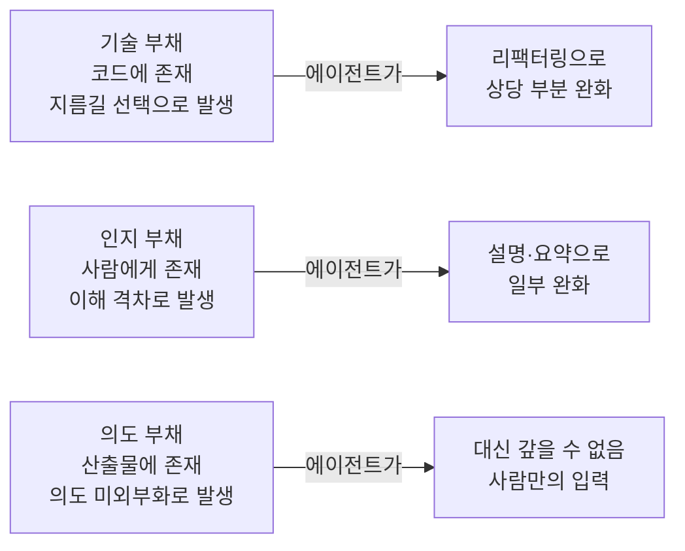
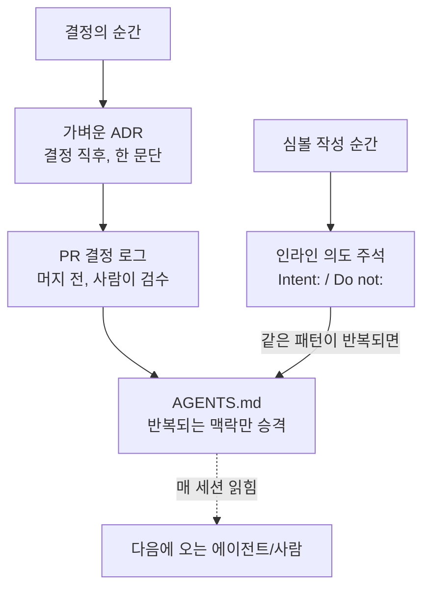

<div class="post-summary-box" markdown="1">

### 📌 이 글에서 다루는 내용

#### 🔍 핵심 주제

- **의도 부채 재정의**: "누가 왜 이렇게 만들었는가"가 사람 머릿속에만 있는 상태, 그리고 그것이 에이전트 시대에 가장 비싸지는 이유
- **인지 체크리스트**: 지금 이 프로젝트에 의도 부채가 얼마나 쌓여 있는지 스스로 진단하는 질문들
- **방지 레이어**: 결정 순간의 ADR, PR 단위 결정 로그, 심볼 단위 인라인 주석, 반복 맥락의 AGENTS.md까지, 기록을 언제·어디에 남길지 나누기
- **AGENTS.md를 의도 원장으로**: 설정 파일이 아니라 "왜 이렇게 안 하는지"를 적는 문서로 다시 설계한 템플릿
- **오픈소스 공개**: `it-is-not-my-intent`라는 이름에 담은 의도

#### 🎯 이 글의 결론

> "그건 제 의도가 아니었어요"는 원래 일이 터진 **뒤에** 하는 변명이다. 의도를 미리 적어 두면, 그 변명은 **일이 터지기 전에** 이미 거짓말이 된다.

</div>

## 이 글을 쓰는 이유

몇 달 전 이 위키에 Addy Osmani의 [Intent Debt](/2026/06/21/intent-debt.html)를 정리했다. 소프트웨어 부채를 코드에 존재하며 지름길·구현 선택의 누적에 의해 발생하는 **기술 부채**, 사람에게 존재하며 이해의 격차에 의해 발생하는 **인지 부채**, 산출물에 존재하며 의도가 외부화되지 않은 데서 발생하는 **의도 부채**로 나누고, 그중 에이전트가 절대 대신 갚아줄 수 없는 것이 의도 부채라는 내용이었다. 정리할 당시엔 "맞는 말이다"로 끝났는데, 실제로 몇 개 프로젝트에 적용해 보려니 원문이 던진 처방 — AGENTS.md를 의도 원장으로, 가벼운 ADR, PR 결정 로그 — 이 구체적으로 **무엇을, 언제, 어떻게** 적어야 하는지는 스스로 다시 설계해야 했다.

이 글은 그 재구성이다. 원문 요약이 아니라, "의도 부채를 어떻게 인지하고, 어떻게 방지할 것인가"를 내 언어로 다시 짠 실전 프레임이다. 그리고 그 결과물인 AGENTS.md 템플릿을 별도 오픈소스 리포로 공개한다.

## 복습: 의도 부채는 왜 특별한가

세 부채는 존재하는 곳과 발생 원인이 다르다.



기술 부채와 인지 부채는 에이전트가 도와줄 여지가 크다. 코드를 리팩터링하고, 시스템을 설명하고, 요약해 준다. 그런데 **의도**는 다르다. 에이전트는 코드가 지금 *무엇을 하는지*는 잘 추론하지만, *무엇을 위한 것인지*는 추론하지 못한다. 이유가 하나다 — 그 *왜*는 애초에 코드 안에 있던 적이 없기 때문이다. 사람의 머릿속이나, 오래전에 닫힌 슬랙 스레드, 혹은 이미 퇴사한 사람의 기억 속에 있다.

문제는 이게 예전엔 **가끔만** 청구되는 비용이었다는 것이다. 온보딩할 때, 누가 퇴사한 뒤 그 지식을 복원할 때. 그런데 에이전트를 매 세션 돌리는 지금은 이 청구가 **세션마다, 에이전트 수만큼 곱해져서** 들어온다. 안 갚은 이자가 복리로 불어나는 구조다.

## 의도 부채를 "인지"하는 법 — 자가 진단 체크리스트

방지하려면 먼저 지금 얼마나 쌓여 있는지부터 봐야 한다. 다음 질문에 "그렇다"가 많을수록 의도 부채가 위험 수위다.

- **이 결정의 이유가 사람 한 명의 머릿속에만 있는가?** 그 사람이 자리를 비우면 답을 아무도 못 낸다.
- **"그때 왜 이렇게 했더라?"라는 질문에 코드도, 문서도, 커밋 로그도 답하지 못하는가?** 답을 찾으려면 사람에게 직접 물어야 한다.
- **PR 설명에 무엇을 했는지(what)는 있는데 왜 했는지(why)는 없는가?** 리뷰어가 diff만 보고 근거를 처음부터 재구성해야 한다.
- **똑같은 "개선 제안"이 주기적으로 다시 올라오는가?** 예전에 시도했다가 접은 이유가 어디에도 적혀 있지 않으면, 같은 실패를 몇 년 주기로 반복하게 된다.
- **신규 입사자나 에이전트가 같은 실수를 반복하는가?** 실수 자체보다, 그 실수를 막을 지식이 왜 외부화되지 않았는지가 진짜 문제다.
- **에이전트가 만든 결과물이 "기술적으로는 맞는데 방향이 틀린" 적이 있는가?** 무엇을 하는지는 이해했지만 무엇을 위한 것인지는 몰랐다는 신호다.

이 질문들의 공통점은 단 하나, **"이 지식이 사람 머릿속에만 있는가?"** 다. 그렇다면 그것은 지금 당장은 안 보여도 다음 세션에 반드시 청구될 부채다.

## 의도 부채를 "방지"하는 법 — 기록을 레이어로 나누기

체크리스트로 위험을 확인했다면, 다음은 "그래서 어디에 적을 것인가"다. 나는 이걸 **기록의 즉시성과 범위**를 기준으로 네 겹으로 나눠서 정리했다.



- **결정의 순간 — 가벼운 ADR.** 결정하는 그 순간 *왜*를 적는 비용은 거의 0에 가깝다. 나중에 재구성하려면 몇 시간이 든다. "무엇을 선택했고, 무엇을 배제했는지" 한 문단이면 충분하다.
- **PR 단위 — 결정 로그.** 에이전트에게 "무엇을 하려 했고 무엇을 배제했는지"를 진술하게 하되, **사람이 그 의도가 실제로 맞는지 검수한 뒤에만** 머지한다. 에이전트가 쓴 결정 로그는 의도의 대체물이 아니라 사람이 검수해야 할 초안이다 — 이 구분을 흐리면 사후 합리화가 진짜 의도로 둔갑한다.
- **심볼 작성 순간 — 인라인 의도 주석.** 클래스·필드 하나에만 해당하는 국지적인 의도는 별도 문서가 아니라 그 심볼 자체에 적는다. 아래에서 따로 다룬다.
- **AGENTS.md — 반복되는 맥락의 승격.** ADR·결정 로그·인라인 주석이 쌓이다 보면 "이건 매번 반복해서 설명하고 있다"는 항목이 보인다. 그런 항목만 AGENTS.md로 승격한다. 여기엔 무엇이든 다 넣지 않는다 — **한 번 적으면 매 세션 읽히는**, 정말로 반복되는 맥락만 넣는다.

네 레이어를 구분하지 않으면 실패한다. 전부 AGENTS.md에 몰아넣으면 파일이 비대해져 아무도 안 읽고, 전부 개인 메모로 남기면 애초에 외부화가 안 된다.

## 코드로는 알 수 없는 의도 — 심볼 단위 주석

프로젝트 전체 컨벤션이라면 AGENTS.md에 적으면 된다. 그런데 의도 부채는 훨씬 국지적인 곳에서도 발생한다. Django 프로젝트에 `LegacyInvoice`라는 모델이 있다고 하자. 코드만 보면 필드 몇 개짜리 평범한 모델이라, 신입 개발자도 에이전트도 "`Invoice`랑 중복 같은데 합치면 되겠다"고 판단하기 쉽다. 그런데 실제로는 과거 결제 스냅샷을 감사(audit) 목적으로 그대로 보존해야 해서 존재하는 모델이라면, 그 이유는 AGENTS.md에도 ADR에도 없을 수 있다 — 프로젝트 전체 컨벤션이 아니라 **이 모델 하나에만 해당하는** 의도이기 때문이다.

이런 의도를 AGENTS.md로 승격시키면 실패한다. 모든 모델·필드의 사연을 프로젝트 파일 하나에 다 담으면 그 파일은 아무도 안 읽는 문서가 된다. 그래서 이 의도는 **그 심볼을 편집하려는 사람·에이전트가 반드시 보게 되는 자리**, 즉 코드 그 자체에 적는다. 나는 두 개의 고정 태그로 통일했다.

```python
class LegacyInvoice(models.Model):
    """
    Intent: read-only audit snapshot of pre-2024 billing records.
    Auditors must see the invoice as it looked at purchase time, even
    after Invoice's schema changes.

    Do not: merge this into `Invoice` or backfill missing fields from
    it. Tried in PR #482 — broke the FY2024 audit export. See ADR-0011.
    """
```

필드 단위처럼 docstring을 붙일 수 없는 자리는 바로 위에 같은 형식의 주석을 붙인다.

```python
    external_id = models.CharField(max_length=64, unique=True)
    # Intent: mirrors the payment provider's ID 1:1.
    # Do not: generate or backfill this locally — reconciliation with the
    # provider breaks silently if this value is ever synthetic.
```

`Intent:`와 `Do not:`을 고정 태그로 쓰는 이유는 하나다 — grep 한 줄(`grep -rn "Intent:\|Do not:" .`)로 프로젝트 전체에 흩어진 심볼 단위 의도를 전부 찾아낼 수 있어야 하기 때문이다. 그리고 승격 규칙도 하나다. **같은 `Do not:` 패턴이 서로 다른 심볼에서 두 번 이상 반복되면, 그건 더 이상 그 심볼만의 사정이 아니라 프로젝트 전체의 컨벤션이다.** 그 순간 AGENTS.md의 "무엇을 배제했는가" 섹션으로 승격한다.

## AGENTS.md를 "설정 파일"에서 "의도 원장"으로

대부분의 AGENTS.md는 빌드 명령, 테스트 명령, 코딩 스타일 같은 **어떻게(how)** 로 채워진다. 틀린 건 아니지만, 그것만으로는 설정 파일이지 원장이 아니다. 의도 원장이 되려면 최소한 다음 두 섹션이 반드시 있어야 한다.

- **왜 이렇게 안 하는가 (Why not)** — "이렇게 하면 더 간단해 보이는데 왜 저렇게 하는가"에 대한 답. 이게 없으면 에이전트도, 신규 입사자도 몇 달마다 같은 "개선안"을 다시 들고 온다.
- **무엇을 배제했는가 (Excluded paths)** — 시도했다가 접은 길과, 접은 이유. 원문이 짚었듯 이건 순수한 의도 부채 상환이다. 한 번 적어 두면 다음번엔 아무도 그 길을 다시 걷지 않는다.

이 구조로 실제 템플릿을 만들었다. 발췌하면 이런 식이다.

```markdown
## 2. What we deliberately do NOT do

<!--
  Format: "We don't do X. Someone tried. See <link>. It broke <thing>."
  This section exists specifically to stop agents (and new hires) from
  re-discovering the same dead end at agent speed, every session.
-->

- We don't `<thing that looks like an obvious improvement>`. It was tried in
  `<PR/issue link>` and it `<what broke>`.
```

그리고 결정 로그를 AGENTS.md 안에 프로토콜로 박아 둔다. 에이전트가 매 PR마다 아래 형식을 채우게 강제하되, 마지막 체크박스는 **에이전트가 스스로 체크할 수 없게** 만든다.

```markdown
### YYYY-MM-DD — <short title>
- Intent: what were you actually trying to achieve?
- Alternatives excluded: what did you consider and rule out, and why?
- Human verified: [ ] yes  [ ] no   <!-- an agent must never check this box itself -->
```

이 한 줄이 핵심이다. 에이전트가 적은 의도 진술은 **추론의 기록**이지 **우리가 진짜 원했던 것**이 아니다. 그 둘이 일치하는지는 여전히 사람이 확인해야 하고, 그 확인 없이는 결정 로그도 그 자체로 새로운 의도 부채가 될 뿐이다.

## 오픈소스로 공개한다 — `it-is-not-my-intent`

이 템플릿을 리포로 만들어 공개하기로 했다. 이름은 **`it-is-not-my-intent`**.

"그건 제 의도가 아니었어요"는 원래 일이 **터진 뒤에** 하는 변명이다. 책임을 과거로 떠넘기는 문장이다. 이 리포의 이름은 그 문장을 뒤집는다. 의도를 **일이 터지기 전에** 파일로 적어 두면, 그 변명은 더 이상 성립하지 않는다. 의도가 적혀 있는데 무시됐다면 그건 프로세스의 실패이고, 애초에 적혀 있지 않았다면 그것도 이제는 눈에 보이는 실패다. 어느 쪽이든 "제 의도가 아니었어요"로 도망칠 곳이 사라진다 — 사람에게도, 에이전트에게도.

리포에는 이 글에서 다룬 구조를 그대로 담은 `AGENTS.md` 템플릿과, 왜 이렇게 구조화했는지를 설명하는 README를 넣었다. 1번(왜 이렇게 만들었나), 2번(무엇을 안 하는가), 3번(심볼 단위 인라인 주석 규칙), 5번(결정 로그 프로토콜) 순으로 채우면 바로 쓸 수 있게 만들었다.

## 마무리

에이전트는 코드를 쓰고, 설명하고, 리팩터링해서 기술 부채와 인지 부채를 덜어 준다. 그러나 **왜 이 시스템이 이런 모습이어야 하는가**는 끝내 사람의 입력으로 남는다. 이 글에서 정리한 체크리스트와 네 겹의 기록 레이어, 그리고 AGENTS.md 템플릿은 결국 하나의 질문으로 좁혀진다.

> 지금 이 결정의 이유는, 사람 머릿속이 아니라 파일 안에 있는가?

"아니오"라는 답이 나올 때마다, 그것이 다음 세션에 청구될 이자다. 지금 한 줄 적어 두는 게 언제나 더 싸다.

### 다음 학습 (Next Learning)

- [Intent Debt: 에이전트가 대신 갚아줄 수 없는 단 하나의 부채](/2026/06/21/intent-debt.html) — 이 글의 출발점이 된 Triple Debt 모델 원문 정리
- [모호한 의견에서 본질을 찾기: 문제 정의와 Principal Engineer의 사고 방식](/2026/07/31/problem-framing-principal-engineer.html) — 문제를 정의하는 사람에게 결정 로그가 왜 자연스러운 습관인지
- [Loop Engineering 정리](/2026/06/19/loop-engineering.html) — 에이전트를 둘러싼 시스템 설계, 그 시스템에 의도를 먹이는 이야기
