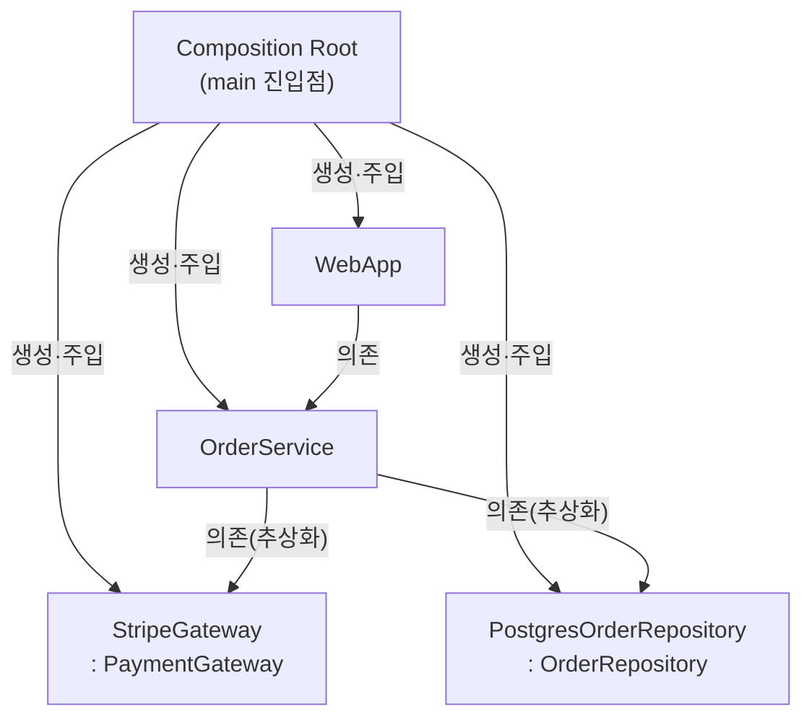

<figure class="post-figure post-figure--header">
<svg role="img" aria-label="의존성 주입의 핵심을 한 장으로 담은 그림. 왼쪽은 강결합으로, OrderService 상자 안에서 화살표가 톱니바퀴(구체 클래스 new)를 직접 만들어 객체가 스스로 의존성을 생성하고 그 구현에 단단히 묶인다. 가운데는 제어의 역전을 뜻하는 굵은 화살표가 바깥에서 안으로 향한다. 오른쪽은 의존성 주입으로, Composition Root가 위에서 톱니바퀴를 만들어 OrderService에 외부로부터 꽂아 넣고, OrderService는 구체가 아니라 추상화(인터페이스)에만 의존한다." viewBox="0 0 680 300" xmlns="http://www.w3.org/2000/svg">
  <title>의존성 주입의 본질 — 객체가 의존성을 직접 만드는 강결합(왼쪽)에서, Composition Root가 외부에서 주입하는 제어의 역전(오른쪽)으로</title>

  <!-- ===== LEFT: Control Freak — object creates its own dependency inside ===== -->
  <text x="120" y="26" text-anchor="middle" font-size="12" fill="currentColor" font-weight="700" opacity="0.75">강결합 (직접 생성)</text>
  <!-- outer service box -->
  <rect x="36" y="58" width="168" height="150" rx="5" fill="var(--bg-light)" stroke="currentColor" stroke-width="2"/>
  <text x="120" y="82" text-anchor="middle" font-size="11" fill="currentColor" font-weight="700">OrderService</text>
  <!-- inner concrete dependency it builds itself -->
  <text x="120" y="106" text-anchor="middle" font-size="8.5" fill="currentColor" opacity="0.75">self._gw = StripeGateway()</text>
  <line x1="120" y1="116" x2="120" y2="138" stroke="var(--accent-color)" stroke-width="2.4" marker-end="url(#di-arrow-a)"/>
  <text x="143" y="132" text-anchor="start" font-size="8" fill="currentColor" opacity="0.7">new</text>
  <!-- gear (concrete class) created internally -->
  <g transform="translate(120,168)">
    <circle r="22" fill="var(--bg-panel)" stroke="var(--accent-color)" stroke-width="2.4"/>
    <circle r="8" fill="none" stroke="var(--accent-color)" stroke-width="2"/>
    <g stroke="var(--accent-color)" stroke-width="2.4">
      <line x1="0" y1="-22" x2="0" y2="-30"/>
      <line x1="0" y1="22" x2="0" y2="30"/>
      <line x1="-22" y1="0" x2="-30" y2="0"/>
      <line x1="22" y1="0" x2="30" y2="0"/>
      <line x1="-15.5" y1="-15.5" x2="-21" y2="-21"/>
      <line x1="15.5" y1="-15.5" x2="21" y2="-21"/>
      <line x1="-15.5" y1="15.5" x2="-21" y2="21"/>
      <line x1="15.5" y1="15.5" x2="21" y2="21"/>
    </g>
  </g>
  <text x="120" y="224" text-anchor="middle" font-size="8.5" fill="currentColor" opacity="0.8">구체 클래스에 단단히 묶임</text>

  <!-- ===== MIDDLE: Inversion of Control arrow ===== -->
  <text x="340" y="120" text-anchor="middle" font-size="11" fill="currentColor" font-weight="700" opacity="0.8">제어의 역전</text>
  <text x="340" y="136" text-anchor="middle" font-size="8.5" fill="currentColor" opacity="0.65">Inversion of Control</text>
  <line x1="386" y1="158" x2="294" y2="158" stroke="var(--gold)" stroke-width="4" marker-end="url(#di-arrow-gold)"/>
  <text x="340" y="180" text-anchor="middle" font-size="8.5" fill="currentColor" opacity="0.7">밖에서 안으로 주입</text>

  <!-- ===== RIGHT: Dependency Injection — assembled from outside ===== -->
  <text x="560" y="26" text-anchor="middle" font-size="12" fill="currentColor" font-weight="700" opacity="0.75">의존성 주입 (외부 조립)</text>
  <!-- Composition Root on top -->
  <rect x="478" y="46" width="164" height="32" rx="4" fill="var(--bg-panel)" stroke="var(--gold)" stroke-width="2.2"/>
  <text x="560" y="66" text-anchor="middle" font-size="9.5" fill="currentColor" font-weight="700">Composition Root</text>
  <!-- gear built by the root -->
  <g transform="translate(516,118)">
    <circle r="18" fill="var(--bg-panel)" stroke="var(--secondary-color)" stroke-width="2.2"/>
    <circle r="6.5" fill="none" stroke="var(--secondary-color)" stroke-width="1.8"/>
    <g stroke="var(--secondary-color)" stroke-width="2.2">
      <line x1="0" y1="-18" x2="0" y2="-25"/>
      <line x1="0" y1="18" x2="0" y2="25"/>
      <line x1="-18" y1="0" x2="-25" y2="0"/>
      <line x1="18" y1="0" x2="25" y2="0"/>
      <line x1="-12.7" y1="-12.7" x2="-17.6" y2="-17.6"/>
      <line x1="12.7" y1="-12.7" x2="17.6" y2="-17.6"/>
      <line x1="-12.7" y1="12.7" x2="-17.6" y2="17.6"/>
      <line x1="12.7" y1="12.7" x2="17.6" y2="17.6"/>
    </g>
  </g>
  <text x="516" y="152" text-anchor="middle" font-size="7.5" fill="currentColor" opacity="0.75">StripeGateway</text>
  <!-- root creates the gear -->
  <line x1="540" y1="80" x2="522" y2="98" stroke="var(--secondary-color)" stroke-width="2" marker-end="url(#di-arrow-sec)"/>
  <text x="556" y="92" text-anchor="start" font-size="7.5" fill="currentColor" opacity="0.7">생성</text>
  <!-- root injects gear into the service -->
  <line x1="534" y1="124" x2="566" y2="138" stroke="var(--secondary-color)" stroke-width="2.4" marker-end="url(#di-arrow-sec)"/>
  <text x="556" y="124" text-anchor="start" font-size="7.5" fill="currentColor" opacity="0.7">주입</text>
  <!-- service box depending on abstraction (dashed slot) -->
  <rect x="500" y="146" width="142" height="72" rx="5" fill="var(--bg-light)" stroke="currentColor" stroke-width="2"/>
  <text x="571" y="170" text-anchor="middle" font-size="11" fill="currentColor" font-weight="700">OrderService</text>
  <!-- abstraction slot -->
  <rect x="588" y="180" width="44" height="26" rx="4" fill="none" stroke="var(--secondary-color)" stroke-width="2" stroke-dasharray="4 3"/>
  <text x="610" y="197" text-anchor="middle" font-size="7.5" fill="currentColor" opacity="0.85">: 추상화</text>
  <text x="525" y="196" text-anchor="middle" font-size="8" fill="currentColor" opacity="0.8">인터페이스만</text>
  <text x="525" y="208" text-anchor="middle" font-size="8" fill="currentColor" opacity="0.8">의존</text>
  <text x="560" y="240" text-anchor="middle" font-size="8.5" fill="currentColor" opacity="0.8">구현 교체·테스트가 자유로움</text>

  <defs>
    <marker id="di-arrow-a" markerWidth="8" markerHeight="8" refX="6" refY="4" orient="auto">
      <path d="M0,0 L8,4 L0,8 z" fill="var(--accent-color)"/>
    </marker>
    <marker id="di-arrow-gold" markerWidth="9" markerHeight="9" refX="6" refY="4.5" orient="auto">
      <path d="M0,0 L9,4.5 L0,9 z" fill="var(--gold)"/>
    </marker>
    <marker id="di-arrow-sec" markerWidth="8" markerHeight="8" refX="6" refY="4" orient="auto">
      <path d="M0,0 L8,4 L0,8 z" fill="var(--secondary-color)"/>
    </marker>
  </defs>
</svg>
<figcaption>의존성 주입의 한 장 요약 — <strong>왼쪽(강결합)</strong>은 OrderService가 <code>new</code>로 구체 클래스를 스스로 만들어 그 구현에 묶이고, <strong>가운데</strong>의 <strong>제어의 역전(IoC)</strong>으로 생성·조립의 책임이 바깥으로 넘어간다. <strong>오른쪽(DI)</strong>은 Composition Root가 의존성을 만들어 OrderService에 <strong>주입</strong>하고, OrderService는 구체가 아닌 <strong>추상화</strong>에만 의존해 교체·테스트가 자유로워진다.</figcaption>
</figure>

## 들어가며

이 글은 `OO-Design-Essential` 시리즈의 **6단계이자 마지막**입니다. 전체 지도는 [OO-Design Essential Curriculum](/2026/06/19/oo-design-essential-curriculum.html)에서 다시 확인할 수 있습니다.

5단계에서 우리는 Booch의 OOAD를 통해 시스템을 객체로 **모델링**하는 법을 배웠습니다. 책임을 가진 객체들을 식별하고, 각각의 역할과 협력 관계를 설계했죠. 그런데 모델링이 끝나면 곧바로 현실적인 질문이 따라옵니다. "이렇게 잘게 나눈 객체들을, 실제 애플리케이션 규모에서는 누가 어떻게 **조립**하는가?" 5단계가 *어떤 객체를 만들 것인가*에 대한 답이라면, 6단계는 *그 객체들을 어떻게 연결해 하나의 동작하는 시스템으로 묶을 것인가*에 대한 답입니다. Dependency Injection(DI)은 바로 이 조립의 기술입니다.

이 단계는 Steven van Deursen과 Mark Seemann의 *Dependency Injection: Principles, Practices, and Patterns*를 길잡이로 삼습니다. 이 책의 핵심 주장은 분명합니다. **DI는 프레임워크 사용법이 아니라, 제어의 역전(IoC)을 통해 결합도(coupling)를 관리하는 설계 원리**라는 것입니다. 많은 개발자가 DI를 "컨테이너 어노테이션 붙이는 법" 정도로 오해하지만, 책은 컨테이너 없이도 손으로 DI를 구현할 수 있으며(Pure DI), 오히려 그 원리를 먼저 이해해야 컨테이너를 올바르게 쓸 수 있다고 강조합니다.

이 글로 `OO-Design-Essential` 시리즈가 완성됩니다. 직관에서 시작해 정전(正典)을 거쳐, 현대적 재해석과 원리, 그리고 시스템 모델링까지 온 여정의 마지막 매듭을 결합도 관리로 짓습니다.

<div class="post-summary-box" markdown="1">

### 📌 이 글에서 다루는 내용

#### 🔍 핵심 주제

- **DI의 본질**: 제어의 역전(IoC)과 의존성 주입의 차이, 그리고 왜 필요한가(테스트 용이성·교체 가능성·결합도)
- **주입 방식**: 생성자·메서드·속성 주입의 차이와 Composition Root에서의 조립
- **DI 안티패턴**: Service Locator, Control Freak, 과도한 추상화 경계
- **생명주기·범위**: Singleton·Scoped·Transient와 captive dependency 함정
- **DI 컨테이너**: 컨테이너 활용과 Pure DI의 트레이드오프

</div>

## DI의 본질: IoC와 의존성 주입은 같지 않다

가장 먼저 정리해야 할 개념적 구분이 있습니다. **제어의 역전(Inversion of Control, IoC)**과 **의존성 주입(Dependency Injection, DI)**은 동의어가 아닙니다.

IoC는 넓은 원리입니다. 전통적으로 내 코드가 직접 흐름을 제어하던 것을, 외부(프레임워크, 상위 모듈)에게 넘기는 모든 형태를 가리킵니다. 콜백, 이벤트 핸들러, 템플릿 메서드 패턴, 그리고 DI까지 모두 IoC의 사례입니다. 반면 DI는 IoC의 **한 구체적 적용**으로, "객체가 필요로 하는 의존성을 스스로 생성하지 않고 외부로부터 받는다"는 좁고 명확한 기법입니다.

왜 이렇게 해야 할까요? 핵심은 **결합도**입니다. 의존성을 직접 생성하면, 그 구체 클래스에 단단히 묶입니다.

```python
# 나쁜 예: OrderService가 결제 구현에 직접 결합됨
class OrderService:
    def __init__(self) -> None:
        # 구체 클래스를 직접 생성 → StripeGateway에 강하게 결합
        self._gateway = StripeGateway(api_key="sk_live_...")

    def checkout(self, order: "Order") -> None:
        self._gateway.charge(order.total)
```

이 코드는 세 가지 문제를 안고 있습니다. 첫째, **테스트 용이성**이 떨어집니다. 단위 테스트에서 진짜 Stripe를 호출하지 않으려면 코드를 뜯어고쳐야 합니다. 둘째, **교체 가능성**이 없습니다. PayPal로 바꾸려면 `OrderService`를 수정해야 합니다. 셋째, 결제 게이트웨이의 생성과 설정(api_key)이라는 **무관한 책임**까지 떠안습니다.

DI는 이 의존성을 밖으로 끌어냅니다.

```python
from typing import Protocol

class PaymentGateway(Protocol):
    """추상화: OrderService는 이 인터페이스만 안다."""
    def charge(self, amount: int) -> None: ...

class OrderService:
    def __init__(self, gateway: PaymentGateway) -> None:
        # 구현을 모른 채, 추상화에 의존하며 외부로부터 주입받는다
        self._gateway = gateway

    def checkout(self, order: "Order") -> None:
        self._gateway.charge(order.total)
```

이제 `OrderService`는 `PaymentGateway`라는 추상화에만 의존합니다(이것이 SOLID의 DIP, 의존성 역전 원칙입니다). 테스트에서는 가짜(fake)를, 운영에서는 Stripe를 주입하면 됩니다. 결합도가 컴파일 시점의 구체 클래스에서 런타임의 조립 결정으로 옮겨졌습니다.

아래 그림은 이 두 코드의 의존 구조 차이를 나란히 보여줍니다.

<figure class="post-figure">
<svg role="img" aria-label="강결합 코드와 의존성 주입 코드의 의존 구조를 좌우로 비교한 그림. 왼쪽 Before에서는 OrderService가 화살표로 StripeGateway라는 구체 클래스에 직접 의존하며, 테스트용 가짜로 교체할 길이 없다. 오른쪽 After에서는 OrderService가 PaymentGateway라는 추상화 인터페이스에만 의존하고, 그 인터페이스를 StripeGateway와 FakeGateway 두 구현이 함께 실현하므로, 운영에서는 Stripe를 테스트에서는 가짜를 자유롭게 주입할 수 있다." viewBox="0 0 680 280" xmlns="http://www.w3.org/2000/svg">
  <title>강결합(Before) vs 의존성 주입(After) — 구체 클래스 직접 의존에서 추상화 의존으로</title>

  <!-- ===== LEFT: Before — direct dependency on concrete ===== -->
  <text x="160" y="26" text-anchor="middle" font-size="12" fill="currentColor" font-weight="700" opacity="0.8">Before — 강결합</text>
  <rect x="96" y="52" width="128" height="40" rx="4" fill="var(--bg-light)" stroke="currentColor" stroke-width="2"/>
  <text x="160" y="76" text-anchor="middle" font-size="10.5" fill="currentColor" font-weight="700">OrderService</text>
  <line x1="160" y1="92" x2="160" y2="140" stroke="var(--accent-color)" stroke-width="2.4" marker-end="url(#cmp-arrow-a)"/>
  <text x="172" y="120" text-anchor="start" font-size="8" fill="currentColor" opacity="0.75">직접 의존</text>
  <rect x="96" y="142" width="128" height="44" rx="4" fill="var(--bg-panel)" stroke="var(--accent-color)" stroke-width="2.4"/>
  <text x="160" y="162" text-anchor="middle" font-size="10" fill="currentColor" font-weight="700">StripeGateway</text>
  <text x="160" y="177" text-anchor="middle" font-size="7.5" fill="currentColor" opacity="0.75">구체 클래스</text>
  <text x="160" y="214" text-anchor="middle" font-size="9" fill="currentColor" opacity="0.85">교체·테스트 분리 불가</text>

  <!-- divider -->
  <line x1="340" y1="40" x2="340" y2="240" stroke="currentColor" stroke-width="1" opacity="0.25"/>

  <!-- ===== RIGHT: After — depends on abstraction, two implementations ===== -->
  <text x="510" y="26" text-anchor="middle" font-size="12" fill="currentColor" font-weight="700" opacity="0.8">After — 의존성 주입</text>
  <rect x="446" y="52" width="128" height="40" rx="4" fill="var(--bg-light)" stroke="currentColor" stroke-width="2"/>
  <text x="510" y="76" text-anchor="middle" font-size="10.5" fill="currentColor" font-weight="700">OrderService</text>
  <line x1="510" y1="92" x2="510" y2="110" stroke="var(--secondary-color)" stroke-width="2.4" marker-end="url(#cmp-arrow-s)"/>
  <text x="522" y="106" text-anchor="start" font-size="8" fill="currentColor" opacity="0.75">의존</text>
  <!-- abstraction interface -->
  <rect x="438" y="112" width="144" height="42" rx="4" fill="none" stroke="var(--gold)" stroke-width="2.4" stroke-dasharray="5 3"/>
  <text x="510" y="132" text-anchor="middle" font-size="10" fill="currentColor" font-weight="700">PaymentGateway</text>
  <text x="510" y="146" text-anchor="middle" font-size="7.5" fill="currentColor" opacity="0.8">추상화 (인터페이스)</text>
  <!-- two implementations realize the abstraction -->
  <line x1="476" y1="154" x2="452" y2="190" stroke="var(--secondary-color)" stroke-width="2" stroke-dasharray="4 3" marker-end="url(#cmp-arrow-s)"/>
  <line x1="544" y1="154" x2="568" y2="190" stroke="var(--secondary-color)" stroke-width="2" stroke-dasharray="4 3" marker-end="url(#cmp-arrow-s)"/>
  <rect x="402" y="192" width="96" height="38" rx="4" fill="var(--bg-panel)" stroke="currentColor" stroke-width="1.8"/>
  <text x="450" y="211" text-anchor="middle" font-size="9" fill="currentColor" font-weight="700">StripeGateway</text>
  <text x="450" y="223" text-anchor="middle" font-size="7" fill="currentColor" opacity="0.75">운영 주입</text>
  <rect x="522" y="192" width="96" height="38" rx="4" fill="var(--bg-panel)" stroke="currentColor" stroke-width="1.8"/>
  <text x="570" y="211" text-anchor="middle" font-size="9" fill="currentColor" font-weight="700">FakeGateway</text>
  <text x="570" y="223" text-anchor="middle" font-size="7" fill="currentColor" opacity="0.75">테스트 주입</text>
  <text x="510" y="252" text-anchor="middle" font-size="9" fill="currentColor" opacity="0.85">무엇을 주입할지 외부가 결정</text>

  <defs>
    <marker id="cmp-arrow-a" markerWidth="8" markerHeight="8" refX="6" refY="4" orient="auto">
      <path d="M0,0 L8,4 L0,8 z" fill="var(--accent-color)"/>
    </marker>
    <marker id="cmp-arrow-s" markerWidth="8" markerHeight="8" refX="6" refY="4" orient="auto">
      <path d="M0,0 L8,4 L0,8 z" fill="var(--secondary-color)"/>
    </marker>
  </defs>
</svg>
<figcaption><strong>Before</strong>는 OrderService가 구체 클래스 StripeGateway에 직접 의존해 교체나 테스트 분리가 막혀 있다. <strong>After</strong>는 추상화 <code>PaymentGateway</code>에만 의존하고, 그 인터페이스를 StripeGateway·FakeGateway가 함께 실현하므로 운영엔 Stripe를, 테스트엔 가짜를 외부에서 골라 주입한다 — 결합도가 구체에서 추상으로 옮겨진다.</figcaption>
</figure>

## 주입 방식: 생성자·메서드·속성, 그리고 Composition Root

의존성을 주입하는 통로는 세 가지입니다.

**생성자 주입(Constructor Injection)** — 의존성을 생성자 매개변수로 받습니다. **이것이 기본값(default)이어야 합니다.** 객체가 생성되는 순간 모든 필수 의존성이 채워지므로, 불완전한 상태의 객체가 존재할 수 없습니다(항상 유효한 불변식). 의존성이 명시적으로 드러나 "이 클래스가 무엇을 필요로 하는가"가 생성자 시그니처에 그대로 보입니다.

```python
class OrderService:
    def __init__(self, gateway: PaymentGateway, repo: "OrderRepository") -> None:
        # 필수 의존성은 모두 생성자로 — 생성 시점에 객체가 완전해진다
        self._gateway = gateway
        self._repo = repo
```

**메서드 주입(Method Injection)** — 특정 연산에서만 필요한 의존성을 그 메서드의 인자로 받습니다. 객체의 상태가 아니라 호출마다 달라지는 협력자(예: 그 요청의 사용자 컨텍스트)에 적합합니다.

```python
class PricingPolicy:
    def quote(self, order: "Order", customer: "Customer") -> int:
        # customer는 이 호출에만 필요한 의존성 → 메서드로 받는다
        return order.total - customer.loyalty_discount()
```

**속성 주입(Property/Setter Injection)** — 생성 후 속성에 의존성을 꽂습니다. **선택적(optional) 의존성**, 즉 합리적인 기본 구현이 이미 있고 가끔만 교체하는 경우에만 제한적으로 씁니다. 객체가 일시적으로 불완전할 수 있어 위험하므로 남용하지 않습니다.

그렇다면 이 모든 주입은 **어디서** 일어날까요? 정답은 **Composition Root(조립 루트)**입니다. Composition Root는 애플리케이션의 진입점에 위치한 **단 하나의** 장소로, 객체 그래프 전체를 이곳에서 조립합니다. 비즈니스 객체들은 자기 의존성을 받기만 하고, "어떤 구체 구현을 쓸지" 결정하는 책임은 오직 이 한 곳에 집중됩니다.

```python
def main() -> None:
    # === Composition Root: 조립은 진입점 한 곳에서만 ===
    gateway = StripeGateway(api_key=read_env("STRIPE_KEY"))
    repo = PostgresOrderRepository(dsn=read_env("DB_DSN"))

    # 의존성을 엮어 객체 그래프를 완성한다
    order_service = OrderService(gateway=gateway, repo=repo)

    app = WebApp(order_service=order_service)
    app.run()

if __name__ == "__main__":
    main()
```

핵심은 **"어떤 구현을 쓸지에 대한 지식이 비즈니스 코드 전역으로 흩어지지 않고, Composition Root 한 곳에만 모인다"**는 점입니다. 게이트웨이를 PayPal로 바꾸고 싶다면 `main()` 한 줄만 고치면 됩니다.

다음은 Composition Root가 객체 그래프를 엮는 모습을 시각화한 것입니다.



## DI 안티패턴: 잘못 끼운 첫 단추들

DI를 도입했다고 자동으로 좋은 설계가 되는 것은 아닙니다. 책은 흔한 함정 세 가지를 경고합니다.

**Service Locator** — 의존성을 생성자로 받는 대신, 전역 레지스트리에서 **꺼내 쓰는** 방식입니다. 언뜻 DI처럼 보이지만 정반대의 안티패턴입니다.

```python
# 안티패턴: Service Locator
class OrderService:
    def checkout(self, order: "Order") -> None:
        # 의존성을 숨긴 채 전역 컨테이너에서 직접 꺼낸다
        gateway = ServiceLocator.get(PaymentGateway)  # ← 의존성이 시그니처에 안 보임
        gateway.charge(order.total)
```

무엇이 문제일까요? 의존성이 생성자에 드러나지 않아 **의존성이 숨겨집니다**. 클래스만 봐서는 무엇이 필요한지 알 수 없고, 테스트는 전역 로케이터 상태를 세팅해야 하며, 런타임에야 비로소 "그 키가 등록 안 됐다"는 오류를 만납니다. 핵심 격언: **의존성은 밀어 넣어져야지(push), 끌어와선(pull) 안 됩니다.**

**Control Freak** — 객체가 자기 의존성을 **직접 `new`(직접 생성)** 하며 통제권을 놓지 않는 것입니다. 글머리의 첫 번째 나쁜 예가 정확히 이 패턴입니다. `self._gateway = StripeGateway(...)`처럼 구체 클래스를 내부에서 생성하면, 외부에서 교체할 여지가 사라집니다. DI의 출발점은 이 통제 본능을 내려놓고 조립 책임을 Composition Root에 양도하는 것입니다.

**과도한 추상화 경계** — 반대 방향의 과잉입니다. "DIP가 좋다니까" 모든 클래스마다 인터페이스를 하나씩 만들고, 구현체가 영원히 하나뿐인 추상화를 양산하는 것입니다. 추상화는 공짜가 아닙니다. 간접 계층은 코드를 읽기 어렵게 만듭니다. 책의 조언은 **"진짜로 교체·테스트 분리가 필요한 변동점(seam)에만 추상화를 두라"**는 것입니다. 안정적이고 변하지 않는 의존성(예: 표준 라이브러리)까지 인터페이스로 감쌀 필요는 없습니다.

## 생명주기·범위: Singleton·Scoped·Transient

객체를 조립할 때는 "이 의존성을 **얼마나 오래** 살리고, **언제 재사용**할 것인가"도 결정해야 합니다. 이것이 생명주기(lifetime) 또는 범위(scope)입니다. 대표적으로 세 가지가 있습니다.

- **Singleton**: 애플리케이션 전체에서 인스턴스 하나를 공유합니다. 상태가 없거나 스레드 안전한 의존성(설정, 커넥션 풀 등)에 적합합니다.
- **Scoped**: 하나의 논리적 범위(예: 웹 요청 한 건) 안에서만 인스턴스 하나를 공유하고, 범위가 끝나면 폐기합니다. 요청 단위 트랜잭션이나 DB 세션이 전형적입니다.
- **Transient**: 요청될 때마다 새 인스턴스를 만듭니다. 가볍고 상태를 갖는 의존성에 적합합니다.

여기서 반드시 알아야 할 함정이 **captive dependency(포획된 의존성)**입니다. **수명이 긴 객체가 수명이 짧은 객체를 붙잡고 있으면**, 짧은 객체가 폐기되지 못하고 긴 객체의 수명만큼 살아남아 버그를 일으킵니다.

```python
# 함정: Singleton이 Scoped를 포획한다
class CacheService:           # Singleton 으로 등록
    def __init__(self, session: "DbSession") -> None:  # Scoped 여야 할 세션
        # 앱이 살아있는 내내 '첫 요청의 세션'을 붙들게 된다 → captive dependency!
        self._session = session
```

`CacheService`가 싱글톤이라면 생성은 단 한 번뿐이고, 그때 주입된 요청-범위 세션이 영원히 박제됩니다. 두 번째 요청부터는 이미 닫힌 세션을 쓰게 되죠. 규칙은 간단합니다. **소비자의 수명은 그 의존성의 수명보다 같거나 짧아야 합니다.** 긴 수명이 짧은 수명을 직접 품으면 안 됩니다(필요하면 팩토리나 범위 접근을 통해 매번 신선한 인스턴스를 얻어야 합니다).

## DI 컨테이너 vs Pure DI: 무엇을 택할까

마지막으로, 조립을 **손으로** 할지 **컨테이너**로 할지의 선택입니다.

**Pure DI**(또는 Poor Man's DI)는 컨테이너 없이 Composition Root에서 직접 `new`로 객체 그래프를 엮는 방식입니다. 앞서 보여준 `main()` 예제가 정확히 Pure DI입니다. 장점은 명확합니다. 의존성이 전부 코드로 드러나 따라가기 쉽고, 컴파일/실행 전에 구성 오류가 잡히며, 마법 같은 동작이 없습니다. 단점은 객체가 많아지면 조립 코드가 길고 반복적이 된다는 것입니다.

**DI Container**는 등록(registration)된 규칙에 따라 객체 그래프를 **자동으로** 조립해 주는 도구입니다. 생명주기 관리, 자동 와이어링을 대신해 주어 대규모 그래프에서 보일러플레이트를 크게 줄입니다.

```python
# DI Container 개념 예시 (의사 코드 수준)
container = Container()
container.register(PaymentGateway, StripeGateway, lifetime="singleton")
container.register(OrderRepository, PostgresOrderRepository, lifetime="scoped")
container.register(OrderService, lifetime="transient")

# resolve 가 의존성을 추적해 그래프를 자동 조립한다
service = container.resolve(OrderService)
```

아래 그림은 컨테이너가 등록 규칙만 보고 의존성을 추적해 객체 그래프를 자동으로 엮는 과정을 나타냅니다.

<figure class="post-figure">
<svg role="img" aria-label="DI 컨테이너가 객체 그래프를 자동 조립하는 과정을 보여주는 그림. 왼쪽에는 등록 표가 있어 PaymentGateway는 StripeGateway로 싱글톤, OrderRepository는 PostgresOrderRepository로 스코프드, OrderService는 트랜지언트로 등록되어 있다. 오른쪽에는 resolve(OrderService) 호출이 들어오면 컨테이너가 OrderService가 필요로 하는 PaymentGateway와 OrderRepository를 등록 규칙에서 추적해 각각 구현을 만들어 OrderService에 주입한 완성된 객체 그래프를 돌려준다." viewBox="0 0 680 300" xmlns="http://www.w3.org/2000/svg">
  <title>DI 컨테이너 — 등록(registration) 규칙으로부터 객체 그래프를 자동 조립(resolve)</title>

  <!-- ===== LEFT: registration table ===== -->
  <text x="150" y="26" text-anchor="middle" font-size="12" fill="currentColor" font-weight="700" opacity="0.8">등록 (register)</text>
  <rect x="34" y="44" width="232" height="172" rx="5" fill="var(--bg-light)" stroke="currentColor" stroke-width="2"/>
  <!-- row 1 -->
  <text x="50" y="76" font-size="8.5" fill="currentColor" font-weight="700">PaymentGateway</text>
  <text x="50" y="89" font-size="7.5" fill="currentColor" opacity="0.75">→ StripeGateway</text>
  <rect x="196" y="64" width="58" height="20" rx="3" fill="var(--bg-panel)" stroke="var(--gold)" stroke-width="1.6"/>
  <text x="225" y="78" text-anchor="middle" font-size="7.5" fill="currentColor" font-weight="700">singleton</text>
  <line x1="50" y1="98" x2="250" y2="98" stroke="currentColor" stroke-width="0.8" opacity="0.2"/>
  <!-- row 2 -->
  <text x="50" y="120" font-size="8.5" fill="currentColor" font-weight="700">OrderRepository</text>
  <text x="50" y="133" font-size="7.5" fill="currentColor" opacity="0.75">→ PostgresOrderRepository</text>
  <rect x="196" y="108" width="58" height="20" rx="3" fill="var(--bg-panel)" stroke="var(--gold)" stroke-width="1.6"/>
  <text x="225" y="122" text-anchor="middle" font-size="7.5" fill="currentColor" font-weight="700">scoped</text>
  <line x1="50" y1="142" x2="250" y2="142" stroke="currentColor" stroke-width="0.8" opacity="0.2"/>
  <!-- row 3 -->
  <text x="50" y="164" font-size="8.5" fill="currentColor" font-weight="700">OrderService</text>
  <text x="50" y="177" font-size="7.5" fill="currentColor" opacity="0.75">→ OrderService</text>
  <rect x="196" y="152" width="58" height="20" rx="3" fill="var(--bg-panel)" stroke="var(--gold)" stroke-width="1.6"/>
  <text x="225" y="166" text-anchor="middle" font-size="7.5" fill="currentColor" font-weight="700">transient</text>
  <text x="150" y="202" text-anchor="middle" font-size="8" fill="currentColor" opacity="0.7">규칙: 무엇을 · 어떤 수명으로</text>

  <!-- ===== MIDDLE: resolve arrow ===== -->
  <line x1="270" y1="130" x2="330" y2="130" stroke="var(--secondary-color)" stroke-width="3" marker-end="url(#ctr-arrow-s)"/>
  <text x="300" y="118" text-anchor="middle" font-size="9" fill="currentColor" font-weight="700">resolve</text>
  <text x="300" y="150" text-anchor="middle" font-size="7.5" fill="currentColor" opacity="0.7">의존성 추적</text>

  <!-- ===== RIGHT: auto-assembled object graph ===== -->
  <text x="500" y="26" text-anchor="middle" font-size="12" fill="currentColor" font-weight="700" opacity="0.8">자동 조립된 그래프</text>
  <rect x="438" y="44" width="124" height="34" rx="4" fill="var(--bg-panel)" stroke="var(--accent-color)" stroke-width="2.4"/>
  <text x="500" y="65" text-anchor="middle" font-size="9.5" fill="currentColor" font-weight="700">OrderService</text>
  <!-- two injected deps -->
  <line x1="476" y1="78" x2="448" y2="118" stroke="var(--secondary-color)" stroke-width="2" marker-end="url(#ctr-arrow-s)"/>
  <line x1="524" y1="78" x2="552" y2="118" stroke="var(--secondary-color)" stroke-width="2" marker-end="url(#ctr-arrow-s)"/>
  <rect x="386" y="120" width="116" height="38" rx="4" fill="var(--bg-light)" stroke="currentColor" stroke-width="1.8"/>
  <text x="444" y="139" text-anchor="middle" font-size="8.5" fill="currentColor" font-weight="700">StripeGateway</text>
  <text x="444" y="151" text-anchor="middle" font-size="7" fill="currentColor" opacity="0.7">: PaymentGateway</text>
  <rect x="510" y="120" width="124" height="38" rx="4" fill="var(--bg-light)" stroke="currentColor" stroke-width="1.8"/>
  <text x="572" y="139" text-anchor="middle" font-size="8" fill="currentColor" font-weight="700">PostgresOrderRepo</text>
  <text x="572" y="151" text-anchor="middle" font-size="7" fill="currentColor" opacity="0.7">: OrderRepository</text>
  <text x="500" y="186" text-anchor="middle" font-size="8.5" fill="currentColor" opacity="0.85">호출 한 번 → 완성된 객체 반환</text>

  <!-- ground note -->
  <text x="340" y="246" text-anchor="middle" font-size="9" fill="currentColor" opacity="0.75" font-weight="700">컨테이너가 사람 대신 객체 그래프를 엮는다 — 단, 와이어링은 런타임으로 미뤄진다</text>

  <defs>
    <marker id="ctr-arrow-s" markerWidth="8" markerHeight="8" refX="6" refY="4" orient="auto">
      <path d="M0,0 L8,4 L0,8 z" fill="var(--secondary-color)"/>
    </marker>
  </defs>
</svg>
<figcaption>DI 컨테이너는 <strong>등록 규칙</strong>(어떤 추상화를 어떤 구현으로, 어떤 수명으로)만 받아 두고, <code>resolve(OrderService)</code> 한 번에 필요한 의존성을 <strong>스스로 추적</strong>해 완성된 객체 그래프를 돌려준다. 대규모 그래프의 보일러플레이트를 줄여 주지만, 와이어링이 <strong>런타임으로 미뤄져</strong> 구성 오류를 늦게 발견하는 트레이드오프가 따른다.</figcaption>
</figure>

트레이드오프는 이렇습니다. 컨테이너는 편하지만, 와이어링이 런타임으로 미뤄져 **구성 오류를 늦게 발견**하고, 마법이 동작 추적을 어렵게 만들며, 잘못 쓰면 Service Locator로 퇴화하기 쉽습니다. 책의 균형 잡힌 권고는 **"규모가 작거나 명확성이 중요하면 Pure DI로 시작하고, 그래프가 충분히 커져 손 조립의 비용이 명백해질 때 컨테이너를 도입하라"**는 것입니다. 어느 쪽이든 변하지 않는 원칙은 하나입니다. **조립은 Composition Root 한 곳에 머물러야 한다.**

## 마무리

이번 단계에서 우리는 DI를 프레임워크 기능이 아니라 **결합도를 관리하는 설계 원리**로 다뤘습니다. IoC와 DI를 구분하고, 생성자 주입을 기본으로 삼아 메서드·속성 주입을 보조로 쓰며, 모든 조립을 Composition Root 한 곳에 모았습니다. Service Locator·Control Freak·과도한 추상화라는 안티패턴을 경계하고, Singleton·Scoped·Transient 생명주기와 captive dependency 함정을 살폈으며, 컨테이너와 Pure DI의 트레이드오프까지 짚었습니다.

그리고 이 글로 `OO-Design-Essential` 시리즈가 **완주**됩니다. 🎉 여섯 권의 책이 그린 궤적을 한 문단으로 잇겠습니다. 우리는 *Head First Design Patterns*의 직관으로 객체지향에 발을 들였고, GoF의 *Design Patterns* 정전(正典)으로 패턴의 어휘를 정립했으며, *Swift* 관점의 현대적 재해석으로 프로토콜·값 타입 시대의 설계를 다시 보았습니다. 이어 Bertrand Meyer의 *Object-Oriented Software Construction*으로 계약에 의한 설계(DbC)와 객체의 **원리**를 다졌고, Grady Booch의 OOAD로 시스템을 객체로 **모델링**하는 법을 익혔으며, 마지막으로 Seemann & van Deursen의 *Dependency Injection*으로 그 객체들을 **조립**하며 결합도를 다스리는 법을 배웠습니다. 직관에서 원리로, 모델링에서 조립으로 이어진 이 여정이 가리키는 한 가지 결론은 분명합니다. **결합도를 어떻게 관리하느냐가 곧 좋은 객체 설계의 척도입니다.**

### 다음 학습

이번이 시리즈의 마지막 단계이므로 다음 단계는 없습니다. 대신 아래 길을 권합니다.

- 전체 로드맵 다시 보기: [OO-Design Essential Curriculum](/2026/06/19/oo-design-essential-curriculum.html)
- 이전 단계(5단계) 다시 보기: [OOAD with Applications: 시스템을 객체로 모델링](/2026/06/19/object-oriented-analysis-and-design.html)
- 자매 커리큘럼 — 테스트로 설계를 검증하고 다듬기: [Testing-Refactoring Essential Curriculum](/2026/06/19/testing-refactoring-essential-curriculum.html)
- 자매 커리큘럼 — 객체를 넘어 시스템 구조로 확장하기: [Architecture Essential Curriculum](/2026/06/19/architecture-essential-curriculum.html)
